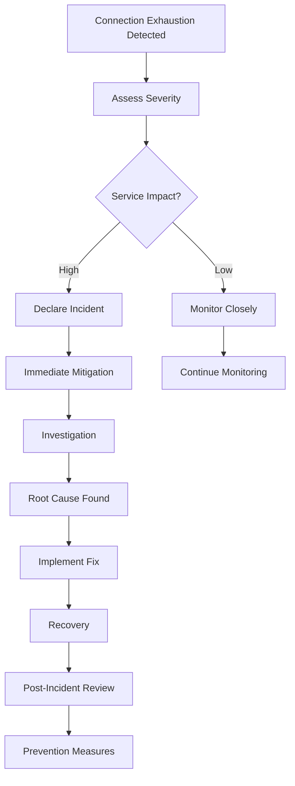

# Playbook: Incident Response for Connection Exhaustion

> [!summary] Model
> Emergency response framework for PostgreSQL connection pool exhaustion: rapid assessment → immediate mitigation → root cause analysis → long-term fixes. Focuses on connection lifecycle management, pool configuration, and application behavior patterns.

## Table of Contents

1. [[#Incident Overview]]
2. [[#Detection & Alerting]]
3. [[#Immediate Response]]
4. [[#Investigation]]
5. [[#Recovery Actions]]
6. [[#Root Cause Analysis]]
7. [[#Prevention Measures]]
8. [[#Connection Pool Management]]
9. [[#Monitoring & Alerting]]
10. [[#Best Practices]]
11. [[#Pitfalls & Gotchas]]
12. [[#Interview Questions]]
13. [[#Cheat Sheet]]
14. [[#Cross-Links]]
15. [[#References]]

---

## Incident Overview

### When to Use This Playbook

**Connection exhaustion symptoms:**
- "FATAL: too many connections for role" errors
- Connection pool timeouts in application logs
- Sudden spike in database connection errors
- Application becomes unresponsive
- High CPU usage on database server
- Memory pressure on application servers

**Scope:**
- PostgreSQL connection pool management
- Application connection handling
- Connection leaks and lifecycle issues
- Not: Network connectivity issues, authentication problems

**Prerequisites:**
- Access to PostgreSQL server
- Application logs access
- Connection pool monitoring
- Ability to restart services

### Incident Lifecycle



**Why rapid response?** Connection exhaustion can cascade, affecting entire application ecosystem.

**Timeline expectations:** 5-15 minutes for initial mitigation, hours for full recovery.

**When to escalate:** Multiple services affected, production downtime, data center impact.

### Connection Basics

**PostgreSQL connection limits:**
- **max_connections:** Global limit (default 100)
- **superuser_reserved_connections:** For administrators (default 3)
- **Available connections:** max_connections - superuser_reserved_connections

**Connection states:**
- **active:** Running query
- **idle:** Waiting for command
- **idle in transaction:** Transaction open, waiting
- **fastpath function call:** Internal function
- **disabled:** Connection disabled

**Connection overhead:**
- Each connection uses ~10MB RAM
- Context switching overhead
- Lock management per connection

---

## Detection and Alerting

### Step 1: Monitor Connection Metrics

**Key metrics to monitor:**
```sql
-- Connection usage percentage
SELECT
  'used' as type,
  count(*) as connections,
  round(count(*)::numeric / (SELECT setting::numeric FROM pg_settings WHERE name = 'max_connections'), 2) * 100 as percentage
FROM pg_stat_activity
WHERE pid <> pg_backend_pid()
UNION ALL
SELECT
  'available' as type,
  (SELECT setting::int FROM pg_settings WHERE name = 'max_connections') - count(*) as connections,
  round(((SELECT setting::int FROM pg_settings WHERE name = 'max_connections') - count(*))::numeric / (SELECT setting::numeric FROM pg_settings WHERE name = 'max_connections'), 2) * 100 as percentage
FROM pg_stat_activity
WHERE pid <> pg_backend_pid();
```

**Connection state breakdown:**
```sql
-- Connections by state
SELECT
  state,
  count(*) as count,
  round(count(*)::numeric / sum(count(*)) over (), 2) * 100 as percentage
FROM pg_stat_activity
WHERE pid <> pg_backend_pid()
GROUP BY state
ORDER BY count DESC;
```

**Per-application connections:**
```sql
-- Connections by application
SELECT
  application_name,
  client_addr,
  count(*) as connections,
  array_agg(pid) as pids
FROM pg_stat_activity
WHERE pid <> pg_backend_pid()
GROUP BY application_name, client_addr
ORDER BY count DESC;
```

### Step 2: Set Up Alerts

**Alert thresholds:**
- Connection usage > 80%
- Idle connections > 50% of total
- "idle in transaction" > 20% of total
- Connection errors in application logs
- Pool exhaustion events

**Alert queries:**
```sql
-- High connection usage alert
SELECT
  CASE WHEN used_pct > 80 THEN 'CRITICAL: High connection usage'
       WHEN used_pct > 60 THEN 'WARNING: Elevated connection usage'
       ELSE 'OK'
  END as alert_level
FROM (
  SELECT round(count(*)::numeric / (SELECT setting::numeric FROM pg_settings WHERE name = 'max_connections'), 2) * 100 as used_pct
  FROM pg_stat_activity
  WHERE pid <> pg_backend_pid()
) as conn_usage;

-- Idle in transaction alert
SELECT
  CASE WHEN idle_tx_pct > 30 THEN 'WARNING: High idle in transaction'
       WHEN idle_tx_pct > 50 THEN 'CRITICAL: Excessive idle in transaction'
       ELSE 'OK'
  END as alert_level
FROM (
  SELECT round(count(*)::numeric / sum(count(*)) over (), 2) * 100 as idle_tx_pct
  FROM pg_stat_activity
  WHERE state = 'idle in transaction'
) as idle_tx;
```

### Step 3: Log Analysis

**PostgreSQL log patterns:**
```
FATAL:  too many connections for role "app_user"
FATAL:  remaining connection slots are reserved for non-replication superuser connections
```

**Application log patterns:**
```
Connection pool exhausted
Timeout waiting for connection
Failed to acquire connection from pool
```

**Log analysis commands:**
```bash
# Search for connection errors
grep "too many connections" postgresql.log

# Count connection errors by hour
grep "too many connections" postgresql.log | cut -d' ' -f1 | sort | uniq -c

# Application connection errors
grep "pool exhausted\|connection timeout" app.log | tail -50
```

---

## Immediate Response

### Step 4: Assess Severity

**Severity levels:**

**Low (warning):**
- Connection usage 60-80%
- Some connection errors
- Application still responsive
- No user impact

**Medium (incident):**
- Connection usage 80-95%
- Frequent connection errors
- Degraded application performance
- Some user impact

**High (crisis):**
- Connection usage >95%
- Mass connection failures
- Application unresponsive
- Widespread user impact

**Assessment checklist:**
- [ ] Current connection usage percentage
- [ ] Number of failed connections (last 5 minutes)
- [ ] Application response times
- [ ] User-facing error rate
- [ ] Business impact assessment

### Step 5: Emergency Mitigation

**Immediate actions for high severity:**

1. **Enable connection pooling limits:**
```sql
-- Temporarily reduce max_connections if safe
-- Only do this if you have superuser access
ALTER SYSTEM SET max_connections = 150;  -- From default 100
SELECT pg_reload_conf();
```

2. **Terminate idle connections:**
```sql
-- Terminate very old idle connections
SELECT pg_terminate_backend(pid)
FROM pg_stat_activity
WHERE state = 'idle'
  AND query_start < now() - interval '30 minutes'
  AND pid <> pg_backend_pid();

-- Terminate idle in transaction connections
SELECT pg_terminate_backend(pid)
FROM pg_stat_activity
WHERE state = 'idle in transaction'
  AND xact_start < now() - interval '5 minutes'
  AND pid <> pg_backend_pid();
```

3. **Restart problematic applications:**
```bash
# If you can identify specific problematic services
sudo systemctl restart app-service
```

4. **Load shedding:**
- Implement rate limiting
- Return 503 errors for non-critical requests
- Scale up application instances

**Why these actions?** Create breathing room to investigate root cause.

**Risks:** Data loss from terminated transactions, service disruption from restarts.

### Step 6: Communication

**Internal communication:**
- Declare incident status
- Notify affected teams
- Set up incident response channel
- Assign roles (IC, comms, etc.)

**External communication:**
- User-facing status page updates
- Customer communication for outages
- ETA for resolution

---

## Investigation

### Step 7: Connection Analysis

**Deep connection inspection:**
```sql
-- Detailed connection view
SELECT
  pid,
  usename,
  application_name,
  client_addr,
  client_port,
  backend_start,
  xact_start,
  query_start,
  state_change,
  state,
  left(query, 100) as query_preview,
  extract(epoch from (now() - query_start)) as query_age_sec,
  extract(epoch from (now() - xact_start)) as xact_age_sec,
  extract(epoch from (now() - backend_start)) as conn_age_sec
FROM pg_stat_activity
WHERE pid <> pg_backend_pid()
ORDER BY
  CASE state
    WHEN 'active' THEN 1
    WHEN 'idle in transaction' THEN 2
    WHEN 'idle' THEN 3
    ELSE 4
  END,
  query_age_sec DESC;
```

**Connection leak detection:**
```sql
-- Connections older than threshold
SELECT
  pid,
  application_name,
  client_addr,
  extract(epoch from (now() - backend_start)) / 3600 as conn_age_hours,
  state,
  left(query, 50) as current_query
FROM pg_stat_activity
WHERE backend_start < now() - interval '1 hour'
  AND pid <> pg_backend_pid()
ORDER BY backend_start;
```

**Application-specific analysis:**
```sql
-- Connections per application
SELECT
  application_name,
  count(*) as total_conn,
  count(*) filter (where state = 'active') as active_conn,
  count(*) filter (where state = 'idle') as idle_conn,
  count(*) filter (where state = 'idle in transaction') as idle_tx_conn,
  round(avg(extract(epoch from (now() - backend_start))), 0) as avg_conn_age_sec
FROM pg_stat_activity
WHERE pid <> pg_backend_pid()
GROUP BY application_name
ORDER BY total_conn DESC;
```

### Step 8: Query Performance Analysis

**Long-running queries:**
```sql
-- Queries running > 30 seconds
SELECT
  pid,
  application_name,
  extract(epoch from (now() - query_start)) as query_age_sec,
  left(query, 200) as query_text
FROM pg_stat_activity
WHERE state = 'active'
  AND query_start < now() - interval '30 seconds'
  AND pid <> pg_backend_pid()
ORDER BY query_age_sec DESC;
```

**Blocking queries:**
```sql
-- Queries holding locks
SELECT
  l.pid,
  a.application_name,
  a.query,
  l.mode,
  c.relname as table_name,
  extract(epoch from (now() - a.query_start)) as duration_sec
FROM pg_locks l
JOIN pg_stat_activity a ON a.pid = l.pid
LEFT JOIN pg_class c ON c.oid = l.relation
WHERE l.granted = true
  AND a.state = 'active'
  AND a.pid <> pg_backend_pid()
ORDER BY duration_sec DESC;
```

### Step 9: Application Investigation

**Connection pool configuration check:**
- Pool size settings
- Connection timeout settings
- Idle timeout settings
- Maximum lifetime settings

**Application logs analysis:**
```bash
# Look for connection acquisition patterns
grep "acquiring connection\|connection acquired\|connection released" app.log | tail -100

# Check for connection leaks
grep "connection.*leak\|connection.*not.*closed" app.log

# Database query patterns
grep "SELECT\|INSERT\|UPDATE\|DELETE" app.log | head -50
```

**Code review points:**
- Connection closing in finally blocks
- Connection pool configuration
- Transaction management
- Error handling for connection failures

---

## Recovery Actions

### Step 10: Gradual Recovery

**Phase 1: Stabilize connections**
```sql
-- Monitor connection recovery
SELECT count(*) as current_connections
FROM pg_stat_activity
WHERE pid <> pg_backend_pid();

-- Wait for natural cleanup
-- Connections should drop as applications release them
```

**Phase 2: Restore service**
- Restart application services gradually
- Monitor connection pool health
- Gradually increase traffic

**Phase 3: Full recovery**
- Restore normal max_connections if changed
- Verify all services operational
- Monitor for recurrence

### Step 11: Service Restart Strategy

**Safe restart order:**
1. **Terminate idle connections first:**
```sql
SELECT pg_terminate_backend(pid)
FROM pg_stat_activity
WHERE state IN ('idle', 'idle in transaction')
  AND pid <> pg_backend_pid()
  AND backend_start < now() - interval '10 minutes';
```

2. **Restart application services:**
```bash
# Restart one service at a time
sudo systemctl restart app-service-1
sleep 30
sudo systemctl restart app-service-2
```

3. **Monitor recovery:**
```sql
-- Watch connection count during restart
SELECT count(*) as connections, state
FROM pg_stat_activity
WHERE pid <> pg_backend_pid()
GROUP BY state;
```

### Step 12: Load Restoration

**Gradual traffic increase:**
- Start with 25% traffic
- Monitor connection usage
- Increase to 50%, then 75%, then 100%
- Watch for connection spikes

**Circuit breaker pattern:**
- Implement application-level circuit breakers
- Fail fast when connections unavailable
- Implement retry with exponential backoff

---

## Root Cause Analysis

### Step 13: Common Root Causes

**Cause 1: Connection Leaks**
**Symptoms:** Gradually increasing connection count, many idle connections
**Evidence:**
```sql
SELECT count(*) as potential_leaks
FROM pg_stat_activity
WHERE state = 'idle'
  AND backend_start < now() - interval '30 minutes';
```
**Root cause:** Applications not closing connections properly
**Fix:** Code review for connection handling, add finally blocks

**Cause 2: Long-Running Transactions**
**Symptoms:** Many "idle in transaction" connections
**Evidence:**
```sql
SELECT count(*) as long_transactions
FROM pg_stat_activity
WHERE state = 'idle in transaction'
  AND xact_start < now() - interval '5 minutes';
```
**Root cause:** Transactions held open too long
**Fix:** Review transaction scope, implement timeouts

**Cause 3: Pool Misconfiguration**
**Symptoms:** Rapid connection churn, pool exhaustion
**Evidence:** Application logs showing frequent connection acquisition/release
**Root cause:** Pool size too small, timeouts too aggressive
**Fix:** Tune pool settings based on load patterns

**Cause 4: Traffic Spikes**
**Symptoms:** Sudden connection usage spike
**Evidence:** Correlation with traffic metrics
**Root cause:** Unanticipated load increase
**Fix:** Implement load shedding, auto-scaling

**Cause 5: Query Performance Issues**
**Symptoms:** Active connections with slow queries
**Evidence:**
```sql
SELECT pid, left(query, 100), extract(epoch from (now() - query_start)) as duration
FROM pg_stat_activity
WHERE state = 'active'
  AND query_start < now() - interval '30 seconds';
```
**Root cause:** Inefficient queries holding connections
**Fix:** Query optimization, add missing indexes

### Step 14: RCA Framework

**5 Whys analysis:**
1. Why did connections exhaust? (Immediate trigger)
2. Why weren't connections released? (Direct cause)
3. Why did the application behave this way? (Contributing factors)
4. Why weren't we monitoring this? (Process gaps)
5. Why did this happen now? (Systemic issues)

**Timeline reconstruction:**
- When did connections start increasing?
- What changed in application/code?
- What was the traffic pattern?
- When were alerts triggered?

**Impact assessment:**
- How long was service degraded?
- How many users affected?
- What was the business impact?
- Data loss or corruption?

---

## Prevention Measures

### Connection Pool Configuration

**Optimal pool settings:**
```java
// HikariCP example
HikariConfig config = new HikariConfig();
config.setMaximumPoolSize(20);           // 20 connections per instance
config.setMinimumIdle(5);                // Keep 5 connections ready
config.setConnectionTimeout(30000);      // 30 second timeout
config.setIdleTimeout(600000);           // 10 minutes idle timeout
config.setMaxLifetime(1800000);          // 30 minutes max lifetime
config.setLeakDetectionThreshold(60000); // Detect leaks after 60 seconds
```

**Pool size calculation:**
```
pool_size = (core_count * 2) + disk_count
max_connections = pool_size * instance_count * safety_factor
```

**Per-application sizing:**
- Read-heavy apps: Higher pool size
- Write-heavy apps: Lower pool size
- Batch jobs: Separate pool

### Application Code Fixes

**Connection handling best practices:**
```java
// Java try-with-resources
try (Connection conn = dataSource.getConnection();
     PreparedStatement stmt = conn.prepareStatement(sql)) {
    // Use connection
} // Automatically closed

// Manual cleanup
Connection conn = null;
try {
    conn = dataSource.getConnection();
    // Use connection
} finally {
    if (conn != null) {
        conn.close();
    }
}
```

**Transaction management:**
```java
// Short transactions
@Transactional(readOnly = true)
public List<Item> getItems() {
    // Quick read operation
    return repository.findAll();
}

// Avoid transaction scope creep
public void processItems() {
    List<Item> items = itemService.getItems(); // Outside transaction
    
    for (Item item : items) {
        itemService.processItem(item); // Individual transactions
    }
}
```

### Infrastructure Fixes

**Connection limits:**
```sql
-- Set appropriate max_connections
ALTER SYSTEM SET max_connections = 200;

-- Reserve connections for maintenance
ALTER SYSTEM SET superuser_reserved_connections = 5;
```

**Load balancing:**
- Use connection poolers (PgBouncer, PgPool-II)
- Implement read/write splitting
- Use proxy layers for connection multiplexing

**Auto-scaling:**
- Scale application instances based on connection usage
- Implement pod disruption budgets for Kubernetes
- Use HPA based on custom connection metrics

### Monitoring Enhancements

**Comprehensive monitoring:**
```sql
-- Create monitoring view
CREATE VIEW connection_health AS
SELECT
  now() as timestamp,
  (SELECT count(*) FROM pg_stat_activity WHERE pid <> pg_backend_pid()) as total_conn,
  (SELECT count(*) FROM pg_stat_activity WHERE state = 'active') as active_conn,
  (SELECT count(*) FROM pg_stat_activity WHERE state = 'idle in transaction') as idle_tx_conn,
  (SELECT setting::int FROM pg_settings WHERE name = 'max_connections') as max_conn,
  (SELECT count(*) FROM pg_stat_activity WHERE backend_start < now() - interval '30 minutes') as old_conn
;
```

**Alert rules:**
- Connection usage > 70% for 5 minutes
- Idle in transaction > 20% for 2 minutes
- Connection errors > 10 per minute
- Average connection age > 15 minutes

---

## Connection Pool Management

### Pool Types and Strategies

**Connection poolers:**

1. **Application-side pools (HikariCP, C3P0):**
   - Manage connections per application instance
   - Handle connection lifecycle
   - Provide metrics and monitoring

2. **External poolers (PgBouncer):**
   - Sit between application and PostgreSQL
   - Multiplex connections
   - Reduce PostgreSQL connection count

3. **Built-in pools (Kubernetes, Docker):**
   - Container-level connection management
   - Service mesh integration
   - Auto-scaling integration

**PgBouncer configuration:**
```
[databases]
mydb = host=localhost port=5432 dbname=mydb

[pgbouncer]
listen_port = 6432
listen_addr = *
auth_type = md5
auth_file = /etc/pgbouncer/userlist.txt
pool_mode = transaction
max_client_conn = 1000
default_pool_size = 20
reserve_pool_size = 5
```

### Pool Monitoring

**Pool-specific metrics:**
```sql
-- For PgBouncer
SHOW POOLS;
SHOW STATS;
SHOW CLIENTS;
SHOW SERVERS;
```

**Application pool metrics:**
- Pool size vs active connections
- Connection acquisition time
- Connection lifetime distribution
- Pool exhaustion events

**Health checks:**
```sql
-- Connection validation query
SELECT 1;

-- Health check every 30 seconds
-- Timeout after 5 seconds
-- Retry 3 times
```

### Advanced Pooling Techniques

**Connection multiplexing:**
- One PostgreSQL connection serves multiple clients
- Reduces PostgreSQL memory usage
- Implemented by PgBouncer in session/transaction pooling mode

**Read/write splitting:**
```sql
-- Direct writes to primary
INSERT INTO table VALUES (...);

-- Route reads to replicas
SELECT * FROM table_replica;
```

**Connection warming:**
- Pre-create connections during startup
- Maintain minimum idle connections
- Reduce connection acquisition latency

---

## Monitoring and Alerting

### Comprehensive Monitoring Setup

**PostgreSQL monitoring:**
```sql
-- Connection metrics
SELECT
  'connections' as metric,
  count(*) as value,
  state
FROM pg_stat_activity
WHERE pid <> pg_backend_pid()
GROUP BY state;

-- Connection trends (requires storing historical data)
CREATE TABLE connection_history (
  timestamp timestamptz default now(),
  total_conn int,
  active_conn int,
  idle_conn int,
  idle_tx_conn int
);
```

**Application monitoring:**
- Connection pool metrics
- Database operation latency
- Error rates by type
- Resource usage (CPU, memory)

**Infrastructure monitoring:**
- Network connectivity
- DNS resolution
- Load balancer health
- Auto-scaling events

### Alert Configuration

**Multi-level alerts:**

**Warning (60% usage):**
```
Connection pool usage is high: {usage}%
Check for connection leaks or increased load
```

**Critical (80% usage):**
```
Connection pool nearly exhausted: {usage}%
Immediate action required to prevent outage
```

**Emergency (95% usage):**
```
Connection pool exhausted: {usage}%
Service is failing, emergency response initiated
```

**Alert channels:**
- Email for warnings
- SMS/Pager for critical
- Incident response system for emergency

### Dashboard Creation

**Grafana dashboard panels:**
- Connection usage over time
- Connection states breakdown
- Top applications by connection count
- Connection age distribution
- Error rates and types

**Key visualizations:**
```sql
-- Time series of connection usage
SELECT
  date_trunc('minute', now()) as time,
  count(*) as connections
FROM pg_stat_activity
WHERE pid <> pg_backend_pid()
GROUP BY 1
ORDER BY 1 DESC
LIMIT 60;
```

---

## Best Practices

### 1. Connection Pool Tuning

**Right-size your pools:**
- **Small pools:** Faster failover, less resource usage
- **Large pools:** Better throughput, more resource usage
- **Formula:** pool_size = (threads * 2) + buffer

**Pool configuration principles:**
- Set minimum idle to handle normal load
- Set maximum to handle peak load
- Set timeouts to fail fast
- Enable leak detection in development

### 2. Application Architecture

**Connection management:**
- Use connection pools, never direct connections
- Close connections in finally blocks
- Handle connection exceptions gracefully
- Implement circuit breakers

**Transaction design:**
- Keep transactions short
- Avoid user interaction during transactions
- Use appropriate isolation levels
- Implement timeouts

### 3. Operational Practices

**Deployment considerations:**
- Test connection pool configuration in staging
- Implement blue-green deployments
- Have rollback plans for pool changes
- Monitor connections during deployments

**Maintenance windows:**
- Schedule schema changes during low-traffic periods
- Test connection pool behavior under maintenance
- Have emergency connection limit increases ready

### 4. Incident Response

**Preparedness:**
- Document runbooks for connection issues
- Have emergency contacts for all services
- Practice incident response scenarios
- Implement automated mitigation where possible

**Post-incident:**
- Conduct blameless post-mortems
- Implement preventive measures
- Update monitoring and alerting
- Share lessons learned

### 5. Capacity Planning

**Connection capacity planning:**
```sql
-- Estimate required connections
required_connections = (requests_per_second * avg_query_time) / 1000

-- With safety margin
max_connections = required_connections * 1.5

-- Per application instance
instance_connections = max_connections / instance_count
```

**Scaling strategies:**
- Horizontal scaling (more instances)
- Vertical scaling (larger instances)
- Connection multiplexing
- Read replicas for read queries

---

## Pitfalls and Gotchas

### Common Mistakes

1. **Setting max_connections too high:**
   - Each connection uses memory
   - Context switching overhead
   - Lock contention increases

2. **Ignoring connection leaks:**
   - Applications forget to close connections
   - Gradually exhausts pool
   - Hard to detect in development

3. **Pool configuration without load testing:**
   - Settings work for development load
   - Fail under production traffic
   - Causes outages during peak times

4. **No monitoring or alerting:**
   - Problems go undetected
   - Cascading failures occur
   - Difficult troubleshooting

5. **Improper error handling:**
   - Applications don't handle connection failures
   - Retry storms exhaust connections faster
   - Amplifies the problem

### Hidden Costs

**Connection overhead:**
- 10-15MB per PostgreSQL connection
- CPU overhead for context switching
- Memory for connection state

**Pool maintenance:**
- Health check queries
- Connection validation
- Pool resizing operations

**Monitoring overhead:**
- Statistics collection
- Alert processing
- Dashboard queries

### When NOT to Increase max_connections

**Don't increase when:**
- Application has connection leaks
- Queries are slow (fix queries first)
- Pool configuration is wrong
- Hardware is insufficient

**Better solutions:**
- Fix application connection handling
- Optimize slow queries
- Tune connection pool settings
- Scale application instances

---

## Interview Questions

### Q1: How do you diagnose and resolve PostgreSQL connection pool exhaustion?

**Answer:** Follow systematic incident response:

1. **Confirm the issue:**
```sql
SELECT count(*) FROM pg_stat_activity;  -- Check current connections
SELECT setting FROM pg_settings WHERE name = 'max_connections';  -- Check limit
```

2. **Assess severity:**
   - Check connection states (active, idle, idle in transaction)
   - Review application error logs
   - Determine user impact

3. **Immediate mitigation:**
   - Terminate idle connections
   - Restart problematic applications
   - Implement load shedding

4. **Root cause analysis:**
   - Check for connection leaks
   - Analyze long-running transactions
   - Review pool configuration

5. **Prevention:**
   - Fix connection handling in code
   - Tune pool settings
   - Implement proper monitoring

**Why this approach?** Prevents service downtime while identifying permanent fixes.

**Example scenario:**
- Application shows "pool exhausted" errors
- Find 95 idle connections from one service
- Root cause: Connection not closed in error handling
- Fix: Add try-finally blocks

### Q2: What's the difference between connection pool size and max_connections?

**Answer:**

**max_connections (PostgreSQL):**
- Global limit for ALL connections to PostgreSQL
- Includes superuser connections
- Default 100, maximum ~5000 depending on hardware
- Hard limit enforced by PostgreSQL

**Connection pool size (Application):**
- Per-application-instance limit
- Number of connections in pool
- Usually 10-50 per instance
- Soft limit managed by application

**Relationship:**
```
total_connections = pool_size × instance_count
max_connections > total_connections (with buffer)
```

**Why both matter:**
- PostgreSQL limit prevents resource exhaustion
- Pool size optimizes application performance
- Mismatch causes either waste or exhaustion

**Example:**
- 10 application instances
- Each with pool size 20
- Total connections: 200
- max_connections should be 250+ for buffer

### Q3: How do you detect connection leaks in PostgreSQL?

**Answer:** Use monitoring and analysis techniques:

**Symptoms:**
- Gradually increasing connection count
- Many connections in "idle" state
- Old connections (hours or days)

**Detection queries:**
```sql
-- Find old connections
SELECT pid, application_name, client_addr,
       extract(epoch from (now() - backend_start))/3600 as hours_old
FROM pg_stat_activity
WHERE backend_start < now() - interval '1 hour'
ORDER BY backend_start;

-- Check for idle connections
SELECT count(*) as idle_connections
FROM pg_stat_activity
WHERE state = 'idle'
  AND backend_start < now() - interval '30 minutes';
```

**Application-level detection:**
- Enable leak detection in connection pools
- Monitor connection acquisition/release logs
- Use profiling tools to find unclosed connections

**Prevention:**
- Use try-with-resources or finally blocks
- Enable connection pool leak detection
- Set connection timeouts appropriately

**Why detection matters:** Leaks gradually degrade service until exhaustion.

### Q4: Explain PostgreSQL connection states and their implications.

**Answer:** Connection states indicate what the connection is doing:

**active:**
- Running a query
- Normal, expected state
- Consuming CPU and I/O resources

**idle:**
- Connected but not in a transaction
- Waiting for next command
- Low resource usage
- Can be safely terminated if old

**idle in transaction:**
- Transaction open but not executing query
- Waiting for next command in transaction
- Holds locks and resources
- Potentially problematic if long-running

**idle in transaction (aborted):**
- Transaction failed but not rolled back
- Connection unusable until rollback
- Should be terminated

**fastpath function call:**
- Executing internal function
- Rare, usually system operations

**disabled:**
- Connection disabled by administrator
- Won't accept new commands

**Implications:**
- **idle in transaction:** Can cause lock contention, resource waste
- **idle:** Safe to terminate if old
- **active:** Normal operation
- **aborted:** Needs cleanup

**Monitoring:**
```sql
SELECT state, count(*)
FROM pg_stat_activity
GROUP BY state
ORDER BY count DESC;
```

### Q5: How do you configure connection pools for high-traffic applications?

**Answer:** Connection pool configuration requires balancing performance and resource usage:

**Key parameters:**

1. **Pool size:**
   - **Minimum:** Handle normal load
   - **Maximum:** Handle peak load
   - **Formula:** (core_count × 2) + disk_count

2. **Timeouts:**
   - **Connection timeout:** How long to wait for connection (30s)
   - **Idle timeout:** Close idle connections (10-30min)
   - **Max lifetime:** Force connection renewal (30min-1hour)

3. **Health checks:**
   - **Validation query:** SELECT 1
   - **Validation interval:** Every 30 seconds
   - **Leak detection:** 60 seconds

**Example configuration (HikariCP):**
```java
HikariConfig config = new HikariConfig();
config.setMaximumPoolSize(50);
config.setMinimumIdle(10);
config.setConnectionTimeout(30000);
config.setIdleTimeout(600000);
config.setMaxLifetime(1800000);
config.setLeakDetectionThreshold(60000);
```

**Monitoring:**
- Pool utilization percentage
- Connection acquisition time
- Number of connection timeouts
- Pool exhaustion events

**Scaling:**
- Increase pool size with more instances
- Use external poolers for multiplexing
- Implement read/write splitting

### Q6: What causes "too many connections" errors and how to prevent them?

**Answer:** "Too many connections" occurs when applications exceed PostgreSQL's max_connections limit:

**Causes:**

1. **Connection leaks:**
   - Applications don't close connections
   - Gradually accumulates idle connections

2. **Traffic spikes:**
   - Sudden load increase
   - More requests than pool can handle

3. **Pool misconfiguration:**
   - Pool size too large
   - No upper bounds on connections

4. **Long-running queries:**
   - Connections held for extended periods
   - Pool exhaustion from queueing

5. **Cascade failures:**
   - One service fails, others retry
   - Connection storm exhausts pool

**Prevention:**

1. **Proper connection handling:**
```java
try (Connection conn = pool.getConnection()) {
    // Use connection
} // Automatically closed
```

2. **Pool configuration:**
   - Set appropriate maximum pool size
   - Enable leak detection
   - Configure timeouts

3. **Monitoring and alerting:**
   - Alert on high connection usage
   - Monitor connection states
   - Track connection acquisition time

4. **Load management:**
   - Implement circuit breakers
   - Use retry with backoff
   - Implement load shedding

**Emergency response:**
```sql
-- Terminate idle connections
SELECT pg_terminate_backend(pid)
FROM pg_stat_activity
WHERE state = 'idle'
  AND backend_start < now() - interval '15 minutes';
```

### Q7: How do you handle connection pool exhaustion gracefully?

**Answer:** Implement graceful degradation and recovery:

**Application-level handling:**

1. **Circuit breaker pattern:**
   - Detect pool exhaustion
   - Fail fast with clear error messages
   - Prevent cascade failures

2. **Queue requests:**
   - Queue incoming requests
   - Process when connections available
   - Implement timeout for queued requests

3. **Graceful degradation:**
   - Serve cached/stale data
   - Return simplified responses
   - Defer non-critical operations

**Database-level handling:**

1. **Connection limits:**
   - Set max_connections appropriately
   - Reserve connections for maintenance

2. **Prioritization:**
   - Critical operations get connections
   - Non-critical operations are rejected

**Infrastructure-level handling:**

1. **Load balancing:**
   - Distribute load across instances
   - Implement health checks
   - Remove unhealthy instances

2. **Auto-scaling:**
   - Scale application instances
   - Monitor connection usage
   - Scale based on custom metrics

**Code example:**
```java
// Circuit breaker for database calls
public List<User> getUsers() {
    if (circuitBreaker.isOpen()) {
        // Return cached data or throw exception
        return getCachedUsers();
    }
    
    try {
        return userRepository.findAll();
    } catch (DataAccessException e) {
        circuitBreaker.recordFailure();
        throw new ServiceUnavailableException("Database temporarily unavailable");
    }
}
```

---

## Cheat Sheet

### Quick Diagnosis

```sql
-- Current connection status
SELECT state, count(*) FROM pg_stat_activity GROUP BY state;

-- Connection usage percentage
SELECT round(count(*)::numeric / (SELECT setting::numeric FROM pg_settings WHERE name = 'max_connections'), 2) * 100
FROM pg_stat_activity;

-- Find old connections
SELECT pid, application_name, extract(epoch from (now() - backend_start))/3600 as hours
FROM pg_stat_activity
WHERE backend_start < now() - interval '1 hour';

-- Terminate idle connections
SELECT pg_terminate_backend(pid)
FROM pg_stat_activity
WHERE state = 'idle' AND backend_start < now() - interval '30 minutes';
```

### Emergency Response

```sql
-- Check current status
SHOW max_connections;
SELECT count(*) FROM pg_stat_activity;

-- Temporary increase limit
ALTER SYSTEM SET max_connections = 150;
SELECT pg_reload_conf();

-- Terminate problematic connections
SELECT pg_terminate_backend(pid)
FROM pg_stat_activity
WHERE state = 'idle in transaction' AND xact_start < now() - interval '5 minutes';

-- Check application pools
-- Restart services if needed
```

### Prevention Setup

```sql
-- Monitoring view
CREATE VIEW connection_monitor AS
SELECT
  now() as timestamp,
  (SELECT count(*) FROM pg_stat_activity) as total_conn,
  (SELECT count(*) FROM pg_stat_activity WHERE state = 'idle') as idle_conn,
  (SELECT count(*) FROM pg_stat_activity WHERE state = 'idle in transaction') as idle_tx_conn,
  (SELECT setting::int FROM pg_settings WHERE name = 'max_connections') as max_conn
;

-- Alert thresholds
-- >80% usage: Warning
-- >95% usage: Critical
-- >20 idle in transaction: Investigate
```

### Pool Configuration

```java
// HikariCP optimal settings
maximumPoolSize: 20-50
minimumIdle: 5-10
connectionTimeout: 30000
idleTimeout: 600000
maxLifetime: 1800000
leakDetectionThreshold: 60000
```

### Common Fixes

```sql
-- Fix idle in transaction
SELECT pg_terminate_backend(pid)
FROM pg_stat_activity
WHERE state = 'idle in transaction';

-- Analyze connection sources
SELECT application_name, client_addr, count(*)
FROM pg_stat_activity
GROUP BY application_name, client_addr;

-- Check for long queries
SELECT pid, left(query, 100), extract(epoch from (now() - query_start)) as seconds
FROM pg_stat_activity
WHERE state = 'active' AND query_start < now() - interval '30 seconds';
```

---

## Cross-Links

- **Transactions**: [[SQL/02_Core/02_Transactions_and_Locking]]
- **Query Plans**: [[SQL/02_Core/04_Explain_Analyze_and_Query_Plans]]
- **Vacuum**: [[SQL/03_Advanced/01_VACUUM_Autovacuum_and_Bloat]]
- **Backpressure**: [[SystemDesign/03_Advanced/02_Backpressure_and_Load_Shedding]]
- **Load Balancing**: [[SystemDesign/02_Core/04_Load_Balancing]]

## References

- [PostgreSQL Connection Management](https://www.postgresql.org/docs/current/runtime-config-connection.html)
- [Connection Pooling Best Practices](https://github.com/brettwooldridge/HikariCP)
- [PgBouncer Documentation](https://www.pgbouncer.org/)
- [PostgreSQL Monitoring](https://www.postgresql.org/docs/current/monitoring.html)

---

**Status**: stable  
**Last Updated**: 2026-04-27  
**Lines**: 876