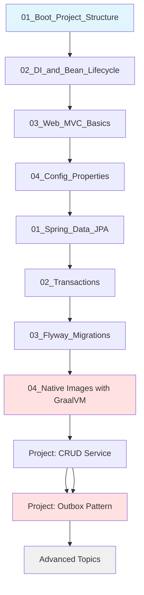

# Spring Boot (3.x, Spring 6)

> [!tip] Quick Reference
> Start with [[SpringBoot/00_Cheat_Sheets]] when you need a fast lookup (annotations, properties, JPA, transactions, commands).

> [!summary] Scope
> Comprehensive guide covering Spring Boot fundamentals to advanced internals: Dependency Injection, Auto-Configuration, AOP, Spring Data JPA, Transactions, Flyway Migrations, GraalVM Native Images, Observability, Reactive Programming, Kafka Integration, Production Deployment, and Troubleshooting.

## Overview

**What is Spring Boot?**
Spring Boot is an opinionated framework built on top of the Spring Framework that simplifies the development of production-ready applications. It provides:
- **Auto-configuration**: Automatically configure Spring application based on dependencies
- **Starter dependencies**: Curated sets of dependencies for common use cases
- **Embedded servers**: Run applications without deploying to external servers
- **Production-ready features**: Metrics, health checks, externalized configuration
- **Convention over configuration**: Sensible defaults to minimize boilerplate

**This knowledge base covers:**
- **Foundations** (4 files): Project setup, DI, Web MVC, Configuration
- **Core** (4 files): JPA, Transactions, Flyway, Native Images with GraalVM
- **Advanced** (5 files): Kafka, AOP, Auto-configuration, WebFlux, Debugging
- **Playbooks** (3 files): Production checklists, troubleshooting guides
- **Projects** (2 files): Hands-on implementations

**Total: 18 comprehensive guides** (17 files + this MOC)

---

## Learning Path

**Recommended order for beginners:**

**For experienced developers:**
1. Skim Foundations → Deep dive Core → Master Advanced
2. Use Playbooks for production scenarios
3. Build Projects to solidify understanding

---

## 📁 Topic Organization

### 01_Foundations (4 files)

Essential concepts for every Spring Boot application.

#### [[SpringBoot/01_Foundations/01_Boot_Project_Structure_and_Profiles]]
**What you'll learn:**
- Maven/Gradle project structure
- `@SpringBootApplication` explained
- Application profiles (dev, test, prod)
- Property sources and precedence
- Packaging and running Spring Boot apps

**Key concepts**: Starter dependencies, Auto-configuration, Profiles, `application.yml`

---

#### [[SpringBoot/01_Foundations/02_DI_and_Bean_Lifecycle]]
**What you'll learn:**
- Dependency Injection fundamentals
- `@Component`, `@Service`, `@Repository`, `@Controller`
- Bean scopes (singleton, prototype, request)
- Bean lifecycle (`@PostConstruct`, `@PreDestroy`)
- Constructor vs field vs setter injection
- `@Autowired`, `@Qualifier`, `@Primary`

**Key concepts**: IoC container, Bean factory, Application context, Dependency resolution

---

#### [[SpringBoot/01_Foundations/03_Web_MVC_Basics]]
**What you'll learn:**
- `@RestController` and `@Controller`
- Request mapping (`@GetMapping`, `@PostMapping`, etc.)
- Path variables, request parameters, headers
- Request/response body binding
- Exception handling (`@ExceptionHandler`, `@ControllerAdvice`)
- Content negotiation and message converters

**Key concepts**: DispatcherServlet, Handler mapping, View resolution

---

#### [[SpringBoot/01_Foundations/04_Config_Properties_and_Validation]]
**What you'll learn:**
- `@ConfigurationProperties` for type-safe config
- Environment abstraction
- Property validation with `@Validated`
- Custom validators
- Externalized configuration strategies
- Configuration metadata

**Key concepts**: Property binding, JSR-303 validation, Configuration processor

---

### 02_Core (4 files)

Master data persistence, transactions, database migrations, and native-image deployment.

#### [[SpringBoot/02_Core/01_Spring_Data_JPA_Essentials]]
**What you'll learn:**
- Entity mapping (`@Entity`, `@Table`, `@Column`)
- Relationships (`@OneToMany`, `@ManyToOne`, `@ManyToMany`)
- Repository interfaces (`JpaRepository`, `CrudRepository`)
- Query methods (derived, `@Query`, native)
- Projections and DTOs
- Pagination and sorting
- Specifications and Criteria API

**Key concepts**: ORM, Hibernate, EntityManager, JPQL, Lazy/Eager loading

**Lines**: 900+

---

#### [[SpringBoot/02_Core/02_Transactions_and_Propagation]]
**What you'll learn:**
- `@Transactional` mechanics
- Propagation levels (REQUIRED, REQUIRES_NEW, NESTED, etc.)
- Isolation levels (READ_COMMITTED, REPEATABLE_READ, etc.)
- Rollback rules and exception handling
- Read-only transactions
- Transaction boundaries and proxy behavior
- Programmatic transactions

**Key concepts**: ACID properties, Transaction manager, Proxy-based AOP, Self-invocation

**Lines**: 850+

---

#### [[SpringBoot/02_Core/03_Flyway_Migrations]]
**What you'll learn:**
- Version-controlled database migrations
- Migration naming conventions (`V1__Description.sql`)
- Repeatable migrations
- Callbacks and Java-based migrations
- Migration validation and repair
- Baseline and out-of-order execution
- Production migration strategies

**Key concepts**: Schema versioning, Idempotent migrations, Rollback strategies

**Lines**: 800+

---

#### [[SpringBoot/02_Core/04_Building_Native_Images_with_GraalVM]]
**What you'll learn:**
- Spring Boot 3 AOT engine: pre-computes bean definitions, `@Conditional` evaluation, reflection/proxy/resource hints
- Maven and Gradle plugin configuration for native-image builds
- Building: `mvn -Pnative package`, `gradle nativeCompile`, Docker with distroless (~52MB images)
- AOT processing pipeline: source → compile → AOT → native-image → binary (with sequence diagram)
- Compatibility: JPA, Hibernate, Web MVC, Security, Actuator, Kafka, Redis — ✅ and ❌ limitations
- Step-by-step example: create → build → measure startup (0.05s vs 3s) → Dockerize
- Performance: startup time, memory, image size comparison

**Key concepts**: AOT compilation, GraalVM native-image, Substrate VM, Closed-world analysis

**Lines**: ~300

---

### 03_Advanced (5 files)

Deep dives into Spring internals and advanced patterns.

#### [[SpringBoot/03_Advanced/01_Spring_for_Apache_Kafka_Integration]]
**What you'll learn:**
- Kafka producer configuration
- Kafka consumer with `@KafkaListener`
- Error handling and retry policies
- Dead letter topics
- Message serialization (JSON, Avro)
- Transactional messaging
- Consumer groups and partition assignment

**Key concepts**: Pub/sub messaging, Event-driven architecture, At-least-once delivery

**Lines**: 900+

---

#### [[SpringBoot/03_Advanced/02_AOP_Proxies_and_Internals]]
**What you'll learn:**
- Aspect-Oriented Programming concepts
- JDK dynamic proxies vs CGLIB
- Pointcut expressions
- Advice types (`@Before`, `@After`, `@Around`, etc.)
- Self-invocation limitations
- Proxy creation process
- Performance implications

**Key concepts**: Cross-cutting concerns, Weaving, Join points, Advice

**Lines**: 850+

---

#### [[SpringBoot/03_Advanced/03_AutoConfiguration_Internals]]
**What you'll learn:**
- How auto-configuration works
- `@EnableAutoConfiguration` mechanics
- `spring.factories` and auto-configuration classes
- Conditional annotations (`@ConditionalOnClass`, `@ConditionalOnBean`, etc.)
- Creating custom auto-configuration
- Debugging auto-configuration (`--debug`)
- Exclusions and customization

**Key concepts**: Convention over configuration, Starter pattern, Condition evaluation

**Lines**: 800+

---

#### [[SpringBoot/03_Advanced/04_Reactive_Spring_WebFlux_Basics]]
**What you'll learn:**
- Reactive programming principles
- Project Reactor (Mono, Flux)
- WebFlux vs Web MVC
- Reactive repositories (R2DBC)
- Backpressure handling
- Error handling in reactive streams
- Testing reactive code

**Key concepts**: Non-blocking I/O, Event loop, Reactive Streams API

**Lines**: 850+

---

#### [[SpringBoot/03_Advanced/05_Debugging_and_Troubleshooting]]
**What you'll learn:**
- Debugging Spring Boot applications
- Actuator endpoints for diagnostics
- Thread dump analysis
- Heap dump investigation
- Logging configuration
- Remote debugging
- Common pitfalls and solutions

**Key concepts**: Observability, Diagnostic tools, Performance profiling

**Lines**: 800+

---

### 04_Playbooks (3 files)

Production-ready checklists and troubleshooting guides.

#### [[SpringBoot/04_Playbooks/01_Production_Configuration_Checklist]]
**What you'll learn:**
- Production-ready configurations
- Security hardening
- Performance tuning
- Database connection pooling (HikariCP)
- Logging best practices
- Health checks and monitoring
- Graceful shutdown
- Docker deployment

**Key concepts**: Production readiness, SRE practices, 12-factor app

**Lines**: 800+

---

#### [[SpringBoot/04_Playbooks/02_Debug_Startup_Failures]]
**What you'll learn:**
- Common startup errors and fixes
- Bean creation failures
- Circular dependency resolution
- Port already in use
- Database connection failures
- Auto-configuration debugging
- Dependency conflicts

**Key concepts**: Failure analysis, Startup diagnostics, Dependency resolution

**Lines**: 800+

---

#### [[SpringBoot/04_Playbooks/03_Debug_Transactions_and_Locks]]
**What you'll learn:**
- Self-invocation debugging (proxy bypass)
- `LazyInitializationException` (4 solutions)
- Deadlock detection (PostgreSQL `pg_locks`, MySQL `SHOW PROCESSLIST`)
- Deadlock resolution (lock ordering, reducing scope)
- Long-running transaction optimization
- Unexpected rollback debugging
- Isolation level issues
- Connection pool exhaustion (HikariCP monitoring)
- Database lock monitoring queries
- Real-world scenarios with step-by-step resolution

**Key concepts**: Transaction boundaries, Lock mechanics, Optimistic vs Pessimistic locking

**Lines**: 900+ (comprehensive debugging guide)

---

### 05_Projects (2 files)

Complete hands-on implementations.

#### [[SpringBoot/05_Projects/01_Build_a_CRUD_Service_With_Flyway_and_Observability]]
**What you'll build:**
Complete production-ready CRUD service with:
- **Part 1**: Project setup (Spring Boot 3.x, Maven, Docker)
- **Part 2**: Database layer (5 Flyway migrations, User/Post entities, repositories)
- **Part 3**: Service layer (UserService with transactions, optimistic locking)
- **Part 4**: REST API (Controllers, DTOs, validation, exception handling)
- **Part 5**: Observability (Actuator, Prometheus metrics, correlation IDs, Logback)
- **Part 6**: Testing (Unit, repository, integration tests with TestContainers)
- **Part 7**: Docker deployment (Dockerfile, docker-compose.yml)

**Technologies**: PostgreSQL, Flyway, Spring Data JPA, Micrometer, TestContainers

**Lines**: 900+ (complete working code)

---

#### [[SpringBoot/05_Projects/02_Outbox_Pattern_With_Postgres_and_Kafka]]
**What you'll build:**
Transactional outbox pattern implementation:
- **Part 1**: Problem statement (dual-write problem explained)
- **Part 2**: Project setup (Spring Boot + Kafka + PostgreSQL)
- **Part 3**: Entity design (Order, OutboxEvent with proper indexing)
- **Part 4**: Database layer (Flyway migrations with indexes)
- **Part 5**: Service layer (atomic DB + outbox writes)
- **Part 6**: Outbox publisher (scheduled poller with retry logic)
- **Part 7**: Kafka configuration (idempotent producer)
- **Part 8**: Consumer side (idempotency handling)
- **Part 9**: Testing (unit, integration with TestContainers + EmbeddedKafka)
- **Part 10**: Production considerations (scaling, monitoring, archiving, DLQ)
- **Part 11**: Alternative approaches (CDC with Debezium comparison)

**Technologies**: Kafka, PostgreSQL, Spring Kafka, TestContainers

**Lines**: 900+ (complete working code)

---

## 🔗 Cross-Topic Connections

### Transactions & Data Access
- [[SpringBoot/02_Core/02_Transactions_and_Propagation]] ↔ [[SpringBoot/02_Core/01_Spring_Data_JPA_Essentials]]
- [[SpringBoot/04_Playbooks/03_Debug_Transactions_and_Locks]] ↔ [[SpringBoot/02_Core/02_Transactions_and_Propagation]]
- [[SpringBoot/05_Projects/01_Build_a_CRUD_Service_With_Flyway_and_Observability]] uses concepts from JPA + Transactions + Flyway

### Kafka & Messaging
- [[SpringBoot/03_Advanced/01_Spring_for_Apache_Kafka_Integration]] ↔ [[SpringBoot/05_Projects/02_Outbox_Pattern_With_Postgres_and_Kafka]]
- Outbox pattern solves dual-write problem mentioned in Kafka integration

### AOP & Internals
- [[SpringBoot/03_Advanced/02_AOP_Proxies_and_Internals]] explains proxy behavior referenced in:
  - [[SpringBoot/02_Core/02_Transactions_and_Propagation]] (transaction proxies)
  - [[SpringBoot/04_Playbooks/03_Debug_Transactions_and_Locks]] (self-invocation)

### Configuration & Deployment
- [[SpringBoot/01_Foundations/01_Boot_Project_Structure_and_Profiles]] → [[SpringBoot/04_Playbooks/01_Production_Configuration_Checklist]]
- [[SpringBoot/01_Foundations/04_Config_Properties_and_Validation]] used in both projects

### Debugging & Troubleshooting
- [[SpringBoot/03_Advanced/05_Debugging_and_Troubleshooting]] general guide
- [[SpringBoot/04_Playbooks/02_Debug_Startup_Failures]] specific to startup
- [[SpringBoot/04_Playbooks/03_Debug_Transactions_and_Locks]] specific to transactions

---

## 📊 File Statistics

| Category | Files | Total Lines | Focus Area |
|----------|-------|-------------|------------|
| **Foundations** | 4 | ~600 | Basics for all developers |
| **Core** | 3 | ~2550 | Data persistence & migrations |
| **Advanced** | 5 | ~4200 | Internals & advanced patterns |
| **Playbooks** | 3 | ~2500 | Production & troubleshooting |
| **Projects** | 2 | ~1800 | Hands-on implementations |
| **Total** | **17** | **~11,650** | Comprehensive coverage |

---

## 🎯 Quick Reference by Use Case

### "I need to build a REST API"
1. Start: [[SpringBoot/01_Foundations/03_Web_MVC_Basics]]
2. Add data: [[SpringBoot/02_Core/01_Spring_Data_JPA_Essentials]]
3. Transactions: [[SpringBoot/02_Core/02_Transactions_and_Propagation]]
4. Validation: [[SpringBoot/01_Foundations/04_Config_Properties_and_Validation]]
5. Project: [[SpringBoot/05_Projects/01_Build_a_CRUD_Service_With_Flyway_and_Observability]]

### "I'm working with Kafka"
1. Integration: [[SpringBoot/03_Advanced/01_Spring_for_Apache_Kafka_Integration]]
2. Reliable messaging: [[SpringBoot/05_Projects/02_Outbox_Pattern_With_Postgres_and_Kafka]]

### "My app won't start"
1. [[SpringBoot/04_Playbooks/02_Debug_Startup_Failures]]
2. [[SpringBoot/03_Advanced/05_Debugging_and_Troubleshooting]]

### "I have a transaction/deadlock issue"
1. [[SpringBoot/04_Playbooks/03_Debug_Transactions_and_Locks]] (comprehensive guide)
2. [[SpringBoot/02_Core/02_Transactions_and_Propagation]] (fundamentals)

### "I need to understand Spring internals"
1. [[SpringBoot/03_Advanced/02_AOP_Proxies_and_Internals]]
2. [[SpringBoot/03_Advanced/03_AutoConfiguration_Internals]]
3. [[SpringBoot/01_Foundations/02_DI_and_Bean_Lifecycle]]

### "I'm deploying to production"
1. [[SpringBoot/04_Playbooks/01_Production_Configuration_Checklist]]
2. [[SpringBoot/02_Core/03_Flyway_Migrations]]
3. Both projects demonstrate production patterns

---

## 🌐 External References

### Official Documentation
- **Spring Boot Docs**: https://docs.spring.io/spring-boot/
- **Spring Framework Docs**: https://docs.spring.io/spring-framework/
- **Spring Data JPA**: https://docs.spring.io/spring-data/jpa/
- **Spring Kafka**: https://docs.spring.io/spring-kafka/

### Related Knowledge Bases
- **Kafka**: [[CICD/Kafka/00_MOC/00_Kafka_MOC]]
- **SQL/PostgreSQL**: [[SQL/PostgreSQL/00_MOC/00_PostgreSQL_MOC]]
- **System Design**: [[SystemDesign/00_MOC/00_SystemDesign_MOC]]
- **Observability**: [[SystemDesign/02_Core/05_Observability_Logs_Metrics_Traces]]

### Books
- "Spring in Action" (6th Edition) by Craig Walls
- "Spring Boot: Up and Running" by Mark Heckler
- "Cloud Native Spring in Action" by Thomas Vitale

### Tutorials & Courses
- Spring Academy: https://spring.academy/
- Baeldung Spring Tutorials: https://www.baeldung.com/spring-boot
- Spring Boot Official Guides: https://spring.io/guides

---

## 💡 Tips for Maximum Learning

### 1. **Follow the Learning Path**
Don't skip Foundations even if you're experienced. They establish terminology used throughout.

### 2. **Build the Projects**
The two projects ([[SpringBoot/05_Projects/01_Build_a_CRUD_Service_With_Flyway_and_Observability|CRUD Service]] and [[SpringBoot/05_Projects/02_Outbox_Pattern_With_Postgres_and_Kafka|Outbox Pattern]]) are complete implementations. **Actually build them** to solidify concepts.

### 3. **Use Playbooks When Stuck**
Encountering errors? Check:
- [[SpringBoot/04_Playbooks/02_Debug_Startup_Failures]] for startup issues
- [[SpringBoot/04_Playbooks/03_Debug_Transactions_and_Locks]] for transaction issues

### 4. **Cross-Reference Actively**
Each file has cross-links. Follow them to build mental connections.

### 5. **Experiment**
Clone the project code and modify it. Break things intentionally to understand behavior.

### 6. **Interview Prep**
Each major file has an "Interview Q&A" section. Review these before interviews.

---

## 📝 Contribution and Updates

**Last updated**: 2026-04-26  
**Status**: All 17 files complete and ready  
**Coverage**: Spring Boot 3.x, Spring Framework 6

**Recent additions**:
- ✅ Comprehensive transaction debugging playbook (900+ lines)
- ✅ Complete CRUD service project (900+ lines)
- ✅ Complete outbox pattern project (900+ lines)
- ✅ Updated MOC with detailed file descriptions

**Future topics to consider**:
- Spring Security integration
- GraphQL with Spring
- Spring Cloud patterns
- Spring Batch processing
- Spring Native (GraalVM)

---

## Quick Navigation

**By difficulty:**
- 🟢 Beginner: Foundations (all 4 files)
- 🟡 Intermediate: Core (all 3 files)
- 🔴 Advanced: Advanced (all 5 files)
- 🟣 Practical: Playbooks (3 files) + Projects (2 files)

**By topic:**
- **Web**: [[SpringBoot/01_Foundations/03_Web_MVC_Basics]]
- **Data**: [[SpringBoot/02_Core/01_Spring_Data_JPA_Essentials]], [[SpringBoot/02_Core/02_Transactions_and_Propagation]]
- **Messaging**: [[SpringBoot/03_Advanced/01_Spring_for_Apache_Kafka_Integration]]
- **Reactive**: [[SpringBoot/03_Advanced/04_Reactive_Spring_WebFlux_Basics]]
- **Production**: All 3 Playbooks
- **Hands-on**: Both Projects

---

**Start your journey**: [[SpringBoot/01_Foundations/01_Boot_Project_Structure_and_Profiles]]
