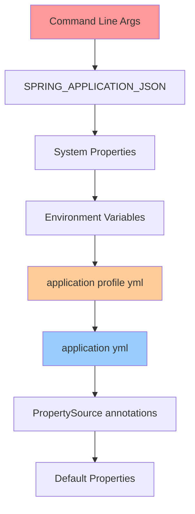

# Boot Project Structure and Profiles

> [!tip] Quick Reference
> Start with [[SpringBoot/00_Cheat_Sheets]] when you need a fast lookup (profiles, properties, common annotations).

## Overview

Understanding Spring Boot project organization, configuration management, profiles, and build artifacts is fundamental to building maintainable applications.

> [!summary] Goal
> Master Spring Boot project structure, configuration precedence, profile management, and packaging strategies for different environments.

---

## Spring Boot Project Anatomy

### Standard Directory Structure

```
myapp/
├── src/
│   ├── main/
│   │   ├── java/
│   │   │   └── com/example/myapp/
│   │   │       ├── MyAppApplication.java          # Main entry point
│   │   │       ├── controller/                     # REST controllers
│   │   │       │   ├── UserController.java
│   │   │       │   └── ProductController.java
│   │   │       ├── service/                        # Business logic
│   │   │       │   ├── UserService.java
│   │   │       │   └── ProductService.java
│   │   │       ├── repository/                     # Data access (JPA)
│   │   │       │   ├── UserRepository.java
│   │   │       │   └── ProductRepository.java
│   │   │       ├── model/                          # Domain entities
│   │   │       │   ├── User.java
│   │   │       │   └── Product.java
│   │   │       ├── dto/                            # Data Transfer Objects
│   │   │       │   ├── UserDto.java
│   │   │       │   └── CreateUserRequest.java
│   │   │       ├── config/                         # Configuration classes
│   │   │       │   ├── SecurityConfig.java
│   │   │       │   └── KafkaConfig.java
│   │   │       ├── exception/                      # Custom exceptions
│   │   │       │   ├── ResourceNotFoundException.java
│   │   │       │   └── GlobalExceptionHandler.java
│   │   │       └── util/                           # Utility classes
│   │   │           └── DateUtils.java
│   │   └── resources/
│   │       ├── application.yml                     # Default config
│   │       ├── application-dev.yml                 # Dev profile
│   │       ├── application-prod.yml                # Production profile
│   │       ├── db/migration/                       # Flyway migrations
│   │       │   ├── V1__Create_users_table.sql
│   │       │   └── V2__Add_email_column.sql
│   │       ├── static/                             # Static assets (if needed)
│   │       └── templates/                          # Thymeleaf templates (if needed)
│   └── test/
│       ├── java/
│       │   └── com/example/myapp/
│       │       ├── MyAppApplicationTests.java      # Integration tests
│       │       ├── controller/
│       │       │   └── UserControllerTest.java     # Controller tests
│       │       ├── service/
│       │       │   └── UserServiceTest.java        # Service tests
│       │       └── repository/
│       │           └── UserRepositoryTest.java     # Repository tests
│       └── resources/
│           ├── application-test.yml                # Test profile config
│           └── test-data.sql                       # Test data
├── pom.xml                                          # Maven (or build.gradle for Gradle)
├── Dockerfile
└── README.md
```

---

## The Main Application Class

### Basic Structure

```java
package com.example.myapp;

import org.springframework.boot.SpringApplication;
import org.springframework.boot.autoconfigure.SpringBootApplication;

/**
 * Main entry point for Spring Boot application
 * 
 * @SpringBootApplication is a convenience annotation that combines:
 * - @Configuration: Marks class as source of bean definitions
 * - @EnableAutoConfiguration: Enables Spring Boot's auto-configuration
 * - @ComponentScan: Scans for components in current package and sub-packages
 */
@SpringBootApplication
public class MyAppApplication {
    public static void main(String[] args) {
        SpringApplication.run(MyAppApplication.class, args);
    }
}
```

### Customizing Component Scan

```java
@SpringBootApplication(
    scanBasePackages = {
        "com.example.myapp",
        "com.example.shared"  // Include external package
    }
)
public class MyAppApplication {
    // ...
}

// Or exclude auto-configurations
@SpringBootApplication(
    exclude = {
        DataSourceAutoConfiguration.class,
        HibernateJpaAutoConfiguration.class
    }
)
```

### Custom Initialization Logic

```java
@SpringBootApplication
public class MyAppApplication {
    
    public static void main(String[] args) {
        SpringApplication app = new SpringApplication(MyAppApplication.class);
        
        // Customize before run
        app.setBannerMode(Banner.Mode.OFF);
        app.setAdditionalProfiles("custom-profile");
        
        // Add listeners
        app.addListeners(new MyApplicationListener());
        
        app.run(args);
    }
    
    // Run code after startup
    @Bean
    public CommandLineRunner init() {
        return args -> {
            System.out.println("Application started successfully!");
        };
    }
}
```

---

## Configuration Management

### Configuration Files

Spring Boot supports multiple configuration formats:

**application.yml** (preferred for readability):
```yaml
spring:
  application:
    name: myapp
  
  datasource:
    url: jdbc:postgresql://localhost:5432/mydb
    username: dbuser
    password: dbpass
    hikari:
      maximum-pool-size: 10
      minimum-idle: 5
      connection-timeout: 30000
  
  jpa:
    hibernate:
      ddl-auto: validate
    show-sql: false
    properties:
      hibernate:
        format_sql: true
        dialect: org.hibernate.dialect.PostgreSQLDialect

server:
  port: 8080
  servlet:
    context-path: /api

logging:
  level:
    root: INFO
    com.example.myapp: DEBUG
  file:
    name: logs/application.log
```

**application.properties** (alternative):
```properties
spring.application.name=myapp
spring.datasource.url=jdbc:postgresql://localhost:5432/mydb
spring.datasource.username=dbuser
spring.datasource.password=dbpass
server.port=8080
```

### Configuration Precedence (Highest to Lowest)



**Example: Override property at runtime**
```bash
# Via command line
java -jar myapp.jar --server.port=9090

# Via environment variable
export SERVER_PORT=9090
java -jar myapp.jar

# Via system property
java -Dserver.port=9090 -jar myapp.jar
```

---

## Profile Management

### What are Profiles?

Profiles allow different configurations for different environments (dev, test, prod).

### Defining Profile-Specific Configuration

**application-dev.yml**:
```yaml
spring:
  datasource:
    url: jdbc:h2:mem:testdb  # In-memory DB for dev
  
  jpa:
    show-sql: true           # Show SQL in dev
    hibernate:
      ddl-auto: create-drop  # Recreate schema on startup

logging:
  level:
    root: DEBUG
```

**application-prod.yml**:
```yaml
spring:
  datasource:
    url: jdbc:postgresql://prod-db.example.com:5432/mydb
    hikari:
      maximum-pool-size: 50
  
  jpa:
    show-sql: false          # Don't log SQL in prod
    hibernate:
      ddl-auto: validate     # Only validate schema

logging:
  level:
    root: WARN
    com.example.myapp: INFO
```

### Activating Profiles

**Method 1: Environment Variable** (recommended for production):
```bash
export SPRING_PROFILES_ACTIVE=prod
java -jar myapp.jar
```

**Method 2: Command Line Argument**:
```bash
java -jar myapp.jar --spring.profiles.active=prod
```

**Method 3: application.yml**:
```yaml
spring:
  profiles:
    active: dev  # Default profile if not specified
```

**Method 4: Programmatically**:
```java
public static void main(String[] args) {
    SpringApplication app = new SpringApplication(MyAppApplication.class);
    app.setAdditionalProfiles("prod");
    app.run(args);
}
```

### Multiple Active Profiles

```bash
# Activate multiple profiles (comma-separated)
java -jar myapp.jar --spring.profiles.active=prod,kafka,metrics
```

```yaml
# application.yml
spring:
  profiles:
    active: prod,kafka
```

### Profile-Specific Beans

```java
@Configuration
public class DatabaseConfig {
    
    @Bean
    @Profile("dev")
    public DataSource devDataSource() {
        return new EmbeddedDatabaseBuilder()
            .setType(EmbeddedDatabaseType.H2)
            .build();
    }
    
    @Bean
    @Profile("prod")
    public DataSource prodDataSource() {
        HikariConfig config = new HikariConfig();
        config.setJdbcUrl(prodDbUrl);
        config.setMaximumPoolSize(50);
        return new HikariDataSource(config);
    }
    
    // Active when NOT in prod profile
    @Bean
    @Profile("!prod")
    public DataSource testDataSource() {
        // ...
    }
}
```

### Profile Groups (Spring Boot 2.4+)

```yaml
# application.yml
spring:
  profiles:
    group:
      production:
        - prod
        - kafka
        - metrics
      development:
        - dev
        - local-cache

# Activate all profiles in group
# java -jar myapp.jar --spring.profiles.active=production
```

---

## Layered Configuration Strategy

### Base Configuration (application.yml)

```yaml
# Common settings for all environments
spring:
  application:
    name: myapp
  
  jackson:
    default-property-inclusion: non_null
    serialization:
      write-dates-as-timestamps: false

server:
  compression:
    enabled: true
  shutdown: graceful

management:
  endpoints:
    web:
      exposure:
        include: health,info,metrics
```

### Environment-Specific Overrides

**application-dev.yml**:
```yaml
spring:
  datasource:
    url: jdbc:h2:mem:testdb
  jpa:
    hibernate:
      ddl-auto: create-drop

logging:
  level:
    root: DEBUG
```

**application-staging.yml**:
```yaml
spring:
  datasource:
    url: jdbc:postgresql://staging-db:5432/mydb
  jpa:
    hibernate:
      ddl-auto: validate

logging:
  level:
    root: INFO
```

**application-prod.yml**:
```yaml
spring:
  datasource:
    url: jdbc:postgresql://prod-db:5432/mydb
    hikari:
      maximum-pool-size: 50
      leak-detection-threshold: 60000
  jpa:
    hibernate:
      ddl-auto: validate

logging:
  level:
    root: WARN
```

### Secrets Management

**DON'T store secrets in application.yml**:
```yaml
# ❌ BAD: Never commit secrets
spring:
  datasource:
    password: super-secret-password
```

**DO use environment variables**:
```yaml
# ✅ GOOD: Reference environment variables
spring:
  datasource:
    url: ${DB_URL}
    username: ${DB_USERNAME}
    password: ${DB_PASSWORD}
```

```bash
# Set via environment
export DB_URL=jdbc:postgresql://localhost:5432/mydb
export DB_USERNAME=dbuser
export DB_PASSWORD=secret

java -jar myapp.jar
```

**Or use external config service** (Spring Cloud Config, Vault, AWS Secrets Manager):
```yaml
spring:
  cloud:
    config:
      uri: https://config-server.example.com
  config:
    import: vault://
```

---

## Build and Packaging

### Maven Configuration (pom.xml)

```xml
<?xml version="1.0" encoding="UTF-8"?>
<project xmlns="http://maven.apache.org/POM/4.0.0"
         xmlns:xsi="http://www.w3.org/2001/XMLSchema-instance"
         xsi:schemaLocation="http://maven.apache.org/POM/4.0.0 
         https://maven.apache.org/xsd/maven-4.0.0.xsd">
    <modelVersion>4.0.0</modelVersion>
    
    <parent>
        <groupId>org.springframework.boot</groupId>
        <artifactId>spring-boot-starter-parent</artifactId>
        <version>3.2.0</version>
        <relativePath/>
    </parent>
    
    <groupId>com.example</groupId>
    <artifactId>myapp</artifactId>
    <version>1.0.0-SNAPSHOT</version>
    <name>MyApp</name>
    <description>Spring Boot Application</description>
    
    <properties>
        <java.version>17</java.version>
    </properties>
    
    <dependencies>
        <!-- Spring Boot Starters -->
        <dependency>
            <groupId>org.springframework.boot</groupId>
            <artifactId>spring-boot-starter-web</artifactId>
        </dependency>
        
        <dependency>
            <groupId>org.springframework.boot</groupId>
            <artifactId>spring-boot-starter-data-jpa</artifactId>
        </dependency>
        
        <dependency>
            <groupId>org.springframework.boot</groupId>
            <artifactId>spring-boot-starter-validation</artifactId>
        </dependency>
        
        <!-- Database -->
        <dependency>
            <groupId>org.postgresql</groupId>
            <artifactId>postgresql</artifactId>
            <scope>runtime</scope>
        </dependency>
        
        <!-- Flyway -->
        <dependency>
            <groupId>org.flywaydb</groupId>
            <artifactId>flyway-core</artifactId>
        </dependency>
        
        <!-- Lombok (optional) -->
        <dependency>
            <groupId>org.projectlombok</groupId>
            <artifactId>lombok</artifactId>
            <scope>provided</scope>
        </dependency>
        
        <!-- Testing -->
        <dependency>
            <groupId>org.springframework.boot</groupId>
            <artifactId>spring-boot-starter-test</artifactId>
            <scope>test</scope>
        </dependency>
    </dependencies>
    
    <build>
        <plugins>
            <plugin>
                <groupId>org.springframework.boot</groupId>
                <artifactId>spring-boot-maven-plugin</artifactId>
                <configuration>
                    <excludes>
                        <exclude>
                            <groupId>org.projectlombok</groupId>
                            <artifactId>lombok</artifactId>
                        </exclude>
                    </excludes>
                </configuration>
            </plugin>
        </plugins>
    </build>
</project>
```

### Gradle Configuration (build.gradle)

```groovy
plugins {
    id 'java'
    id 'org.springframework.boot' version '3.2.0'
    id 'io.spring.dependency-management' version '1.1.4'
}

group = 'com.example'
version = '1.0.0-SNAPSHOT'
sourceCompatibility = '17'

repositories {
    mavenCentral()
}

dependencies {
    implementation 'org.springframework.boot:spring-boot-starter-web'
    implementation 'org.springframework.boot:spring-boot-starter-data-jpa'
    implementation 'org.springframework.boot:spring-boot-starter-validation'
    
    runtimeOnly 'org.postgresql:postgresql'
    implementation 'org.flywaydb:flyway-core'
    
    compileOnly 'org.projectlombok:lombok'
    annotationProcessor 'org.projectlombok:lombok'
    
    testImplementation 'org.springframework.boot:spring-boot-starter-test'
}

tasks.named('test') {
    useJUnitPlatform()
}
```

### Building the Application

```bash
# Maven
mvn clean package
# Produces: target/myapp-1.0.0-SNAPSHOT.jar

# Gradle
./gradlew clean build
# Produces: build/libs/myapp-1.0.0-SNAPSHOT.jar

# Skip tests (faster)
mvn clean package -DskipTests

# Run without packaging
mvn spring-boot:run
./gradlew bootRun
```

### Understanding the Fat JAR

Spring Boot creates an executable "fat JAR" (uber JAR) containing:
- Your application classes
- All dependencies
- Embedded servlet container (Tomcat/Jetty/Undertow)

```bash
# Inspect JAR contents
jar tf target/myapp-1.0.0-SNAPSHOT.jar | head -20

# Structure:
# BOOT-INF/classes/          # Your application classes
# BOOT-INF/lib/              # All dependencies
# META-INF/
# org/springframework/boot/  # Spring Boot loader
```

### Running the JAR

```bash
# Basic run
java -jar myapp.jar

# With profile
java -jar myapp.jar --spring.profiles.active=prod

# With JVM options
java -Xmx512m -Xms256m -jar myapp.jar

# With system properties
java -Dserver.port=9090 -jar myapp.jar

# Background process
nohup java -jar myapp.jar > app.log 2>&1 &
```

---

## Externalized Configuration

### Configuration Locations (Precedence Order)

Spring Boot searches for configuration in this order:
1. `/config` subdirectory of current directory
2. Current directory
3. Classpath `/config` package
4. Classpath root

```bash
# Example directory structure
myapp/
├── myapp.jar
├── application.yml          # Overrides classpath config
└── config/
    └── application.yml      # Highest precedence
```

### Environment-Specific Configuration at Runtime

```bash
# Method 1: External file
java -jar myapp.jar --spring.config.location=file:./custom-config.yml

# Method 2: Additional locations
java -jar myapp.jar --spring.config.additional-location=file:/etc/myapp/

# Method 3: Import specific file
# application.yml:
spring:
  config:
    import: file:/etc/myapp/secrets.yml
```

---

## Common Pitfalls and Solutions

### Pitfall 1: Profile Not Activated

**Problem**: Configuration not loading as expected

```java
// application-prod.yml exists but not loaded
```

**Solution**: Verify profile activation
```bash
# Check active profiles in logs
# Look for: "The following 1 profile is active: prod"

# Enable debug logging
java -jar myapp.jar --debug | grep "profile"

# Programmatically check
@Component
public class ProfileChecker {
    @Autowired
    private Environment env;
    
    @PostConstruct
    public void logActiveProfiles() {
        System.out.println("Active profiles: " + 
            Arrays.toString(env.getActiveProfiles()));
    }
}
```

### Pitfall 2: Property Not Overriding

**Problem**: Lower precedence config overwriting higher precedence

**Solution**: Check property names match exactly
```yaml
# ❌ Won't override (different names)
# application.yml
serverPort: 8080

# application-prod.yml
server.port: 9090

# ✅ Will override (same property)
# Both files
server:
  port: 8080  # Base
  port: 9090  # Override in prod
```

### Pitfall 3: Secrets in Version Control

**Problem**: Accidentally committing passwords

**Solution**: Use `.gitignore` and environment variables
```bash
# .gitignore
application-local.yml
application-secrets.yml
*.env

# Use environment variables instead
export DB_PASSWORD=secret
```

### Pitfall 4: Profile-Specific Bean Not Created

**Problem**: Bean expected but not in context

```java
@Bean
@Profile("dev")
public DataSource devDataSource() { ... }

// Fails in dev environment
```

**Solution**: Check profile spelling and activation
```java
@Component
public class BeanChecker implements ApplicationListener<ContextRefreshedEvent> {
    @Autowired
    private ApplicationContext context;
    
    @Override
    public void onApplicationEvent(ContextRefreshedEvent event) {
        String[] beans = context.getBeanDefinitionNames();
        System.out.println("Total beans: " + beans.length);
        
        // Check if specific bean exists
        if (context.containsBean("devDataSource")) {
            System.out.println("devDataSource found");
        }
    }
}
```

---

## Best Practices

> [!tip] Configuration Best Practices
> 1. **Use YAML over Properties**: More readable for nested configs
> 2. **External secrets**: Never commit passwords/keys
> 3. **Minimal base config**: Keep `application.yml` lean, use profiles
> 4. **Document required env vars**: List in README.md
> 5. **Validate on startup**: Use `@ConfigurationProperties` with validation
> 6. **Profile naming**: Use consistent names (dev, staging, prod)
> 7. **Group related properties**: Use nested YAML structure
> 8. **Version control exclusions**: Ignore local/secret configs
> 9. **Test profile configs**: Automated tests for each profile
> 10. **Actuator endpoints**: Expose `/env` and `/configprops` (secured)

---

## Related Notes

- [[02_DI_and_Bean_Lifecycle]] - Bean creation and scopes
- [[04_Config_Properties_and_Validation]] - Type-safe configuration
- [[03_Flyway_Migrations]] - Database migrations

---

> [!question]- Interview Questions
> **Q: What's the difference between @SpringBootApplication and @Configuration?**
> A: `@SpringBootApplication` is a meta-annotation combining `@Configuration`, `@EnableAutoConfiguration`, and `@ComponentScan`. It's used on the main class. `@Configuration` alone just marks a class as a source of bean definitions without auto-configuration or component scanning.
> 
> **Q: How does Spring Boot resolve property conflicts between profiles?**
> A: Active profile configs override base config. If multiple profiles active, later profiles override earlier ones. Command-line args > env vars > profile configs > base config. Example: `--spring.profiles.active=dev,local` means `local` overrides `dev`.
> 
> **Q: Why use spring-boot-starter-parent?**
> A: Provides dependency management (no versions needed), plugin configs, default resource filtering, and sensible defaults for Maven plugins. Manages transitive dependencies to avoid version conflicts.
> 
> **Q: How to run Spring Boot without packaging a JAR?**
> A: Use `mvn spring-boot:run` or `./gradlew bootRun`, or run the main class directly from IDE. For production, always use packaged JAR for consistency.
> 
> **Q: What happens if spring.profiles.active is set in both application.yml and environment variable?**
> A: Environment variable wins (higher precedence). Generally: command-line > env var > application.yml. This allows runtime override without code changes.
