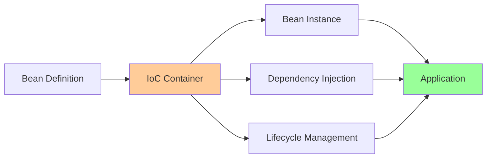
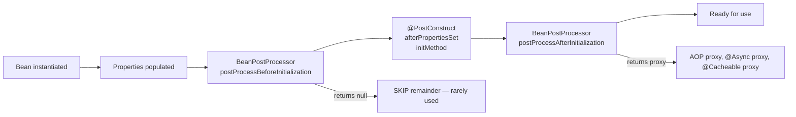
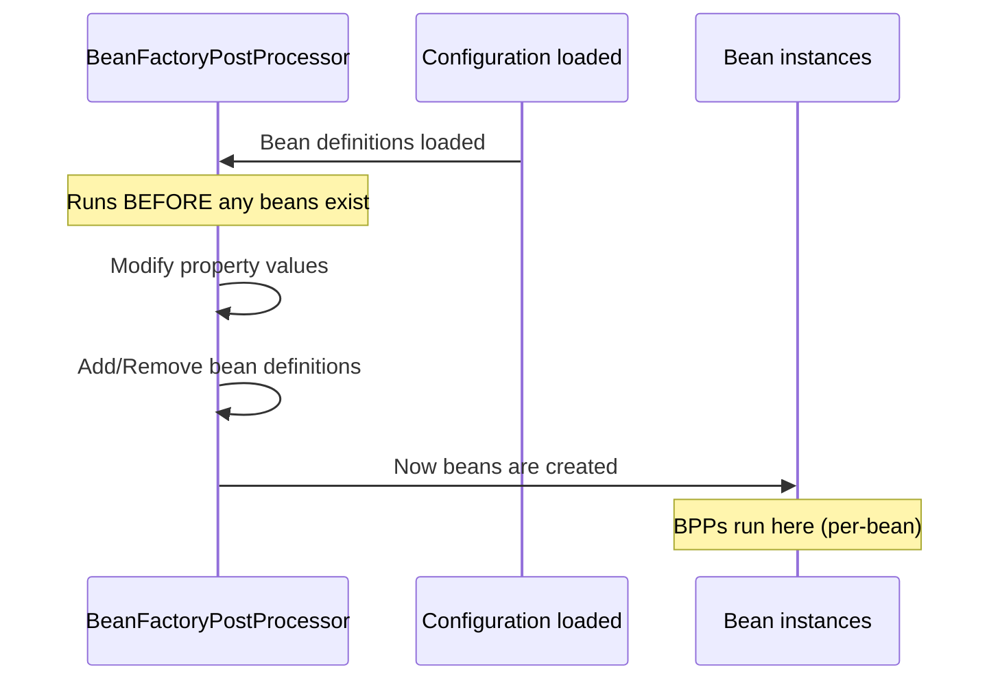

# DI and Bean Lifecycle

> [!tip] Quick Reference
> Start with [[SpringBoot/00_Cheat_Sheets]] when you need a fast lookup (core annotations, scopes, lifecycle, common patterns).

## Overview

Dependency Injection (DI) is the core of Spring Framework. Understanding how Spring manages beans, their lifecycles, scopes, and injection mechanisms is essential for building robust applications.

> [!summary] Goal
> Master Spring's Inversion of Control (IoC) container, bean creation, dependency injection patterns, scopes, and lifecycle management.

---

## What is a Bean?

A **bean** is an object managed by the Spring IoC container. The container:
- Instantiates beans
- Injects dependencies
- Manages lifecycle
- Applies AOP proxies if needed



---

## Declaring Beans

### Method 1: Stereotype Annotations

```java
// Generic component
@Component
public class EmailService {
    public void sendEmail(String to, String message) {
        System.out.println("Sending email to " + to);
    }
}

// Service layer (semantic equivalent to @Component)
@Service
public class UserService {
    // Business logic
}

// Data access layer
@Repository
public class UserRepositoryImpl implements UserRepository {
    // Adds translation of data access exceptions
}

// Web layer
@RestController  // Combines @Controller + @ResponseBody
@RequestMapping("/api/users")
public class UserController {
    // HTTP endpoints
}
```

**Stereotype annotations**:
- `@Component`: Generic bean
- `@Service`: Service layer (business logic)
- `@Repository`: Persistence layer (adds exception translation)
- `@Controller` / `@RestController`: Presentation layer

### Method 2: @Bean Methods

```java
@Configuration
public class AppConfig {
    
    /**
     * Explicitly declare bean
     * - Method name = bean name (unless overridden)
     * - Return type = bean type
     */
    @Bean
    public DataSource dataSource() {
        HikariConfig config = new HikariConfig();
        config.setJdbcUrl("jdbc:postgresql://localhost:5432/mydb");
        config.setUsername("user");
        config.setPassword("pass");
        config.setMaximumPoolSize(10);
        return new HikariDataSource(config);
    }
    
    /**
     * Bean with custom name
     */
    @Bean(name = "myCustomCache")
    public CacheManager cacheManager() {
        return new ConcurrentMapCacheManager("users", "products");
    }
    
    /**
     * Bean with dependencies (auto-injected by Spring)
     */
    @Bean
    public UserService userService(UserRepository userRepository, 
                                   EmailService emailService) {
        return new UserService(userRepository, emailService);
    }
}
```

### Method 3: @Import

```java
@Configuration
@Import({DatabaseConfig.class, SecurityConfig.class})
public class AppConfig {
    // Imports beans from other @Configuration classes
}
```

---

## Dependency Injection Patterns

### 1. Constructor Injection (RECOMMENDED)

```java
@Service
public class UserService {
    private final UserRepository userRepository;
    private final EmailService emailService;
    
    /**
     * Constructor injection
     * - @Autowired is optional if single constructor
     * - Enables immutability (final fields)
     * - Makes dependencies explicit
     * - Easy to test (just pass dependencies)
     */
    public UserService(UserRepository userRepository, 
                      EmailService emailService) {
        this.userRepository = userRepository;
        this.emailService = emailService;
    }
    
    public User createUser(String email, String name) {
        User user = new User(email, name);
        userRepository.save(user);
        emailService.sendEmail(email, "Welcome!");
        return user;
    }
}
```

**Why constructor injection?**
- ✅ Immutable (thread-safe)
- ✅ Clear dependencies (can't create without them)
- ✅ Easy to test (no Spring needed)
- ✅ Prevents partial initialization
- ✅ Lombok `@RequiredArgsConstructor` support

```java
// With Lombok (generates constructor for final fields)
@Service
@RequiredArgsConstructor
public class UserService {
    private final UserRepository userRepository;
    private final EmailService emailService;
    
    // Constructor auto-generated
}
```

### 2. Setter Injection (Optional Dependencies)

```java
@Service
public class NotificationService {
    private EmailService emailService;
    private SmsService smsService;  // Optional
    
    @Autowired
    public void setEmailService(EmailService emailService) {
        this.emailService = emailService;
    }
    
    @Autowired(required = false)  // Optional dependency
    public void setSmsService(SmsService smsService) {
        this.smsService = smsService;
    }
    
    public void sendNotification(String message) {
        emailService.send(message);
        if (smsService != null) {
            smsService.send(message);
        }
    }
}
```

### 3. Field Injection (NOT RECOMMENDED)

```java
@Service
public class UserService {
    @Autowired
    private UserRepository userRepository;  // ❌ Hard to test, mutable
    
    @Autowired
    private EmailService emailService;      // ❌ Hidden dependencies
}
```

**Why avoid field injection?**
- ❌ Can't create instance without Spring
- ❌ Hard to test (need reflection or Spring context)
- ❌ Mutable (not thread-safe by default)
- ❌ Hidden dependencies (not visible in constructor)
- ❌ Can lead to NullPointerException if used before injection

---

## Bean Scopes

### Singleton (Default)

One instance per Spring container (application-wide).

```java
@Service
@Scope("singleton")  // Default, can be omitted
public class UserService {
    private int counter = 0;  // ⚠️ Shared across all requests
    
    public void incrementCounter() {
        counter++;  // NOT thread-safe!
    }
}
```

**Thread Safety Warning**:
```java
@Service
public class StatefulService {
    private List<String> requests = new ArrayList<>();  // ❌ NOT thread-safe
    
    public void addRequest(String req) {
        requests.add(req);  // Race condition!
    }
}

// ✅ SOLUTION: Use thread-safe collections or @Scope("prototype")
@Service
public class StatelessService {
    public void processRequest(String req) {
        // No instance variables = thread-safe
    }
}
```

### Prototype

New instance every time it's injected/requested.

```java
@Component
@Scope("prototype")
public class TaskProcessor {
    private String taskId;  // Each instance has own state
    
    public void process(String taskId) {
        this.taskId = taskId;
        // Process task
    }
}

@Service
public class TaskService {
    @Autowired
    private ApplicationContext context;
    
    public void handleTask(String taskId) {
        // Get new instance each time
        TaskProcessor processor = context.getBean(TaskProcessor.class);
        processor.process(taskId);
    }
}
```

### Request Scope (Web Applications)

New instance per HTTP request.

```java
@Component
@Scope(value = WebApplicationContext.SCOPE_REQUEST, proxyMode = ScopedProxyMode.TARGET_CLASS)
public class RequestContext {
    private String requestId;
    private long startTime;
    
    @PostConstruct
    public void init() {
        this.requestId = UUID.randomUUID().toString();
        this.startTime = System.currentTimeMillis();
    }
    
    public String getRequestId() {
        return requestId;
    }
}

// Inject in singleton service (proxy handles scope)
@Service
public class LoggingService {
    private final RequestContext requestContext;  // Proxied
    
    public LoggingService(RequestContext requestContext) {
        this.requestContext = requestContext;
    }
    
    public void log(String message) {
        System.out.println("[" + requestContext.getRequestId() + "] " + message);
    }
}
```

### Session Scope

New instance per HTTP session.

```java
@Component
@Scope(value = WebApplicationContext.SCOPE_SESSION, proxyMode = ScopedProxyMode.TARGET_CLASS)
public class ShoppingCart {
    private List<Product> items = new ArrayList<>();
    
    public void addItem(Product product) {
        items.add(product);
    }
}
```

### Application Scope

One instance for entire ServletContext (shared across all sessions).

```java
@Component
@Scope(value = WebApplicationContext.SCOPE_APPLICATION, proxyMode = ScopedProxyMode.TARGET_CLASS)
public class ApplicationMetrics {
    private final AtomicLong totalRequests = new AtomicLong();
    
    public void incrementRequests() {
        totalRequests.incrementAndGet();
    }
}
```

---

## Bean Lifecycle

### Lifecycle Phases

```mermaid
graph TB
    A[Bean Definition] --> B[Instantiate]
    B --> C[Populate Properties]
    C --> D[BeanNameAware.setBeanName]
    D --> E[BeanFactoryAware.setBeanFactory]
    E --> F[ApplicationContextAware.setApplicationContext]
    F --> G[@PostConstruct / InitializingBean.afterPropertiesSet]
    G --> H[Bean Ready]
    H --> I[Application Running]
    I --> J[@PreDestroy / DisposableBean.destroy]
    J --> K[Bean Destroyed]
    
    style A fill:#99ccff
    style H fill:#99ff99
    style K fill:#ff9999
```

### Initialization Hooks

**Method 1: @PostConstruct** (Recommended)

```java
@Service
public class DataService {
    private final DataSource dataSource;
    private Connection connection;
    
    public DataService(DataSource dataSource) {
        this.dataSource = dataSource;
    }
    
    /**
     * Called after dependencies injected
     * - Clean, annotation-based
     * - JSR-250 standard (javax.annotation.PostConstruct)
     */
    @PostConstruct
    public void init() throws SQLException {
        System.out.println("Initializing DataService");
        this.connection = dataSource.getConnection();
    }
}
```

**Method 2: InitializingBean Interface**

```java
@Service
public class CacheService implements InitializingBean {
    private Cache cache;
    
    /**
     * Called after properties set
     * - More verbose than @PostConstruct
     * - Couples code to Spring
     */
    @Override
    public void afterPropertiesSet() {
        System.out.println("Initializing cache");
        this.cache = new LRUCache(1000);
    }
}
```

**Method 3: @Bean(initMethod)**

```java
@Configuration
public class AppConfig {
    
    @Bean(initMethod = "initialize")
    public CustomService customService() {
        return new CustomService();
    }
}

public class CustomService {
    public void initialize() {
        System.out.println("Custom init method called");
    }
}
```

### Destruction Hooks

**Method 1: @PreDestroy** (Recommended)

```java
@Service
public class ConnectionService {
    private Connection connection;
    
    /**
     * Called before bean destroyed
     * - Cleanup resources
     * - Close connections
     * - Stop background threads
     */
    @PreDestroy
    public void cleanup() {
        System.out.println("Cleaning up ConnectionService");
        if (connection != null) {
            try {
                connection.close();
            } catch (SQLException e) {
                // Log error
            }
        }
    }
}
```

**Method 2: DisposableBean Interface**

```java
@Service
public class ThreadPoolService implements DisposableBean {
    private ExecutorService executorService;
    
    @PostConstruct
    public void init() {
        executorService = Executors.newFixedThreadPool(10);
    }
    
    @Override
    public void destroy() {
        System.out.println("Shutting down thread pool");
        executorService.shutdown();
        try {
            if (!executorService.awaitTermination(60, TimeUnit.SECONDS)) {
                executorService.shutdownNow();
            }
        } catch (InterruptedException e) {
            executorService.shutdownNow();
        }
    }
}
```

### Lifecycle Order Example

```java
@Component
public class LifecycleDemo implements BeanNameAware, ApplicationContextAware, 
                                      InitializingBean, DisposableBean {
    
    private String beanName;
    private ApplicationContext context;
    
    public LifecycleDemo() {
        System.out.println("1. Constructor called");
    }
    
    @Override
    public void setBeanName(String name) {
        System.out.println("2. setBeanName: " + name);
        this.beanName = name;
    }
    
    @Override
    public void setApplicationContext(ApplicationContext context) {
        System.out.println("3. setApplicationContext");
        this.context = context;
    }
    
    @PostConstruct
    public void postConstruct() {
        System.out.println("4. @PostConstruct");
    }
    
    @Override
    public void afterPropertiesSet() {
        System.out.println("5. afterPropertiesSet (InitializingBean)");
    }
    
    @PreDestroy
    public void preDestroy() {
        System.out.println("6. @PreDestroy");
    }
    
    @Override
    public void destroy() {
        System.out.println("7. destroy (DisposableBean)");
    }
}

// Output:
// 1. Constructor called
// 2. setBeanName: lifecycleDemo
// 3. setApplicationContext
// 4. @PostConstruct
// 5. afterPropertiesSet (InitializingBean)
// ... application runs ...
// 6. @PreDestroy
// 7. destroy (DisposableBean)
```

---

## Bean Post-Processing

### `BeanPostProcessor` — Modify Beans After Injection

> [!tip] Definition
> **`BeanPostProcessor`**: a factory hook that allows custom modification of new bean instances — called after dependency injection is complete but before `@PostConstruct`/`afterPropertiesSet()`/`initMethod` execute. Spring's entire annotation-driven injection system is built on BPPs.

### Where BPPs fit in the lifecycle



### Built-in BPP examples

| BeanPostProcessor | What it processes |
|------------------|-------------------|
| `AutowiredAnnotationBeanPostProcessor` | `@Autowired`, `@Value`, `@Inject` |
| `CommonAnnotationBeanPostProcessor` | `@PostConstruct`, `@PreDestroy`, `@Resource` |
| `AsyncAnnotationBeanPostProcessor` | `@Async` — wraps bean in a proxy for async execution |
| `PersistenceExceptionTranslationPostProcessor` | Translates JPA exceptions to Spring's `DataAccessException` |
| `RequiredAnnotationBeanPostProcessor` | `@Required` (deprecated) |

### Custom BeanPostProcessor example

```java
@Component
public class CountingBeanPostProcessor implements BeanPostProcessor {

    private final Map<String, Long> timings = new ConcurrentHashMap<>();

    @Override
    public Object postProcessBeforeInitialization(Object bean, String beanName) {
        timings.put(beanName, System.nanoTime());
        return bean;  // MUST return the bean (or a wrapped proxy)
    }

    @Override
    public Object postProcessAfterInitialization(Object bean, String beanName) {
        Long start = timings.remove(beanName);
        if (start != null) {
            long elapsed = (System.nanoTime() - start) / 1_000_000;
            if (elapsed > 100) {
                LOG.warn("Bean '{}' took {}ms to initialize", beanName, elapsed);
            }
        }
        return bean;  // Could return a JDK dynamic proxy wrapping the bean
    }
}
```

> [!warning] A BeanPostProcessor receiving a bean MUST return the same bean or a wrapper proxy. If it returns `null`, the bean creation fails silently in some Spring versions. Always `return bean;` as the default path.

### Ordering multiple BPPs

Implement `Ordered` or use `@Order`:

```java
@Component @Order(1)
public class HighPriorityBPP implements BeanPostProcessor { ... }

@Component @Order(Ordered.LOWEST_PRECEDENCE)
public class AopBPP extends AbstractAutoProxyCreator { ... }
```

The AOP-related BPP (`AbstractAutoProxyCreator`) runs last, ensuring it wraps a fully-initialized bean.

---

### `BeanFactoryPostProcessor` — Modify Bean Definitions Before Creation

> [!tip] Definition
> **`BeanFactoryPostProcessor`**: runs after bean definitions are loaded but BEFORE any beans are instantiated. Used to modify bean definitions — property values, scope, init methods, or even add/remove bean definitions.



### Built-in BFPP example

`PropertySourcesPlaceholderConfigurer` resolves `${...}` placeholders in bean definitions:

```java
@Value("${app.timeout:5000}")     // Without PropertySourcesPlaceholderConfigurer,
private int timeout;               // this would inject the literal "${...}"
```

The BFPP scans all bean definitions and replaces `${...}` with values from the Environment.

### Custom BeanFactoryPostProcessor

```java
@Component
public class TimeoutModifierBFPP implements BeanFactoryPostProcessor {

    @Override
    public void postProcessBeanFactory(ConfigurableListableBeanFactory factory) {
        // Runs BEFORE any beans are instantiated
        for (String name : factory.getBeanDefinitionNames()) {
            BeanDefinition bd = factory.getBeanDefinition(name);
            // Add a default property value before the bean exists
            if (bd.getPropertyValues().contains("timeout")) {
                bd.getPropertyValues().add("timeout", 5000);
            }
        }
    }
}
```

### BPP vs BFPP — Key differences

| Aspect | `BeanPostProcessor` | `BeanFactoryPostProcessor` |
|--------|---------------------|---------------------------|
| **When it runs** | After injection, per-bean | After config load, before any beans |
| **What it operates on** | Bean instances (objects) | Bean definitions (metadata) |
| **Can modify properties** | ✅ Yes (already injected) | ✅ Yes (before injection) |
| **Can add/remove beans** | ❌ (beans already exist) | ✅ Yes |
| **Use case** | `@Autowired`, AOP proxies, `@PostConstruct` | Property placeholders, profile resolution |
| **Example** | `AutowiredAnnotationBeanPostProcessor` | `PropertySourcesPlaceholderConfigurer` |

---

### `@Qualifier` and `@Primary` — Disambiguating Multiple Beans

When multiple beans of the same type exist, Spring throws `NoUniqueBeanDefinitionException`:

```java
@Component
public class PdfReport implements ReportGenerator { ... }

@Component
public class CsvReport implements ReportGenerator { ... }

@Autowired
private ReportGenerator generator;  // ❌ NoUniqueBeanDefinitionException!
```

### `@Primary` — Mark a Default Bean

```java
@Component
@Primary   // 👈 Default choice when no qualifier specified
public class CsvReport implements ReportGenerator { ... }

@Autowired
private ReportGenerator generator;  // ✅ Now picks CsvReport
```

### `@Qualifier` — Explicit Selection

```java
@Component
@Qualifier("pdf")
public class PdfReport implements ReportGenerator { ... }

@Component
@Primary
public class CsvReport implements ReportGenerator { ... }

@Autowired @Qualifier("pdf")
private ReportGenerator pdfGenerator;    // ✅ Explicitly PDF

@Autowired
private ReportGenerator defaultGenerator;  // ✅ CsvReport (primary)
```

### Custom Qualifier Annotations (Compile-Time Safe)

```java
@Target({ElementType.FIELD, ElementType.TYPE, ElementType.PARAMETER})
@Retention(RetentionPolicy.RUNTIME)
@Qualifier
public @interface PdfReport {}   // Custom qualifier — type-safe
```

```java
@Component @PdfReport
public class PdfReport implements ReportGenerator { ... }

@Service
public class ReportService {
    @Autowired @PdfReport             // ✅ Compile-time safety
    private ReportGenerator generator;
}
```

### `@Primary` vs `@Qualifier`

| Aspect | `@Primary` | `@Qualifier` |
|--------|------------|--------------|
| **Default behavior** | ✅ One bean is the default | ❌ Must specify at injection point |
| **Compile-time safety** | ❌ String-based bean selection | ❌ (custom qualifiers: ✅) |
| **Flexibility** | One default, others need qualifier | Each injection point chooses explicitly |
| **Conflict resolution** | If two `@Primary` of same type → still ambiguous | Multiple qualifiers can be combined |
| **When to use** | You have a "main" implementation (e.g., `CsvReport`) and alternates | Each consuming class knows which variant it needs |

---

### `@Resource` vs `@Inject` vs `@Autowired`

Java provides three injection annotations with subtle differences:

| Aspect | `@Autowired` (Spring) | `@Inject` (JSR-330) | `@Resource` (JSR-250) |
|--------|----------------------|---------------------|----------------------|
| **Resolution** | By type | By type | By name **first**, then by type |
| **Required by default** | ✅ Yes | ✅ Yes | ❌ No (returns null if missing) |
| **`@Qualifier` support** | ✅ | ✅ (via `@Named`) | ❌ (uses `name` attribute) |
| **Package** | `org.springframework.beans.factory.annotation` | `javax.inject` / `jakarta.inject` | `javax.annotation` / `jakarta.annotation` |
| **When to use** | Spring projects | Jakarta EE / Spring | Legacy code, by-name injection |

```java
@Component
public class ReportingService {

    // Spring-specific — by type
    @Autowired
    private ReportGenerator byType;

    // Jakarta EE — by type (requires javax.inject dependency)
    @Inject
    @Named("csvReport")
    private ReportGenerator byName;

    // JSR-250 — by name first (field name = bean name)
    @Resource(name = "pdfReport")
    private ReportGenerator pdfReport;

    // @Resource resolves by matching the field name to the bean name
    @Resource
    private ReportGenerator csvReport;  // matches bean "csvReport"
}
```

### @Conditional

```java
@Configuration
public class DatabaseConfig {
    
    /**
     * Create bean only if property is set
     */
    @Bean
    @ConditionalOnProperty(name = "app.cache.enabled", havingValue = "true")
    public CacheManager cacheManager() {
        return new ConcurrentMapCacheManager();
    }
    
    /**
     * Create bean only if class is on classpath
     */
    @Bean
    @ConditionalOnClass(name = "org.springframework.data.redis.core.RedisTemplate")
    public RedisTemplate<String, Object> redisTemplate() {
        return new RedisTemplate<>();
    }
    
    /**
     * Create bean only if another bean is missing
     */
    @Bean
    @ConditionalOnMissingBean(DataSource.class)
    public DataSource defaultDataSource() {
        return new EmbeddedDatabaseBuilder()
            .setType(EmbeddedDatabaseType.H2)
            .build();
    }
    
    /**
     * Profile-based creation
     */
    @Bean
    @Profile("dev")
    public DataSource devDataSource() {
        // H2 in-memory for dev
    }
    
    @Bean
    @Profile("prod")
    public DataSource prodDataSource() {
        // PostgreSQL for production
    }
}
```

---

## Common Pitfalls and Solutions

### Pitfall 1: Circular Dependencies

**Problem**: Beans depend on each other

```java
@Service
public class UserService {
    private final OrderService orderService;
    
    public UserService(OrderService orderService) {
        this.orderService = orderService;
    }
}

@Service
public class OrderService {
    private final UserService userService;  // ❌ Circular dependency
    
    public OrderService(UserService userService) {
        this.userService = userService;
    }
}

// Error: The dependencies of some of the beans in the application context form a cycle
```

**Solutions**:

```java
// Solution 1: Setter injection for one side
@Service
public class OrderService {
    private UserService userService;
    
    @Autowired
    public void setUserService(UserService userService) {
        this.userService = userService;
    }
}

// Solution 2: @Lazy injection (proxy created, real bean injected later)
@Service
public class UserService {
    private final OrderService orderService;
    
    public UserService(@Lazy OrderService orderService) {
        this.orderService = orderService;
    }
}

// Solution 3: Refactor design (BEST)
// Extract common logic to a third service
@Service
public class BusinessLogicService {
    // Shared logic
}

@Service
public class UserService {
    private final BusinessLogicService businessLogic;
    // No circular dependency
}

@Service
public class OrderService {
    private final BusinessLogicService businessLogic;
    // No circular dependency
}
```

### Pitfall 2: Field Injection Testing Issues

**Problem**: Can't easily test with field injection

```java
@Service
public class UserService {
    @Autowired
    private UserRepository userRepository;  // Hard to mock
    
    public User getUser(Long id) {
        return userRepository.findById(id).orElse(null);
    }
}

// Testing requires Spring context or reflection
@SpringBootTest
public class UserServiceTest {
    @Autowired
    private UserService userService;  // Slow, integration test
}
```

**Solution**: Constructor injection

```java
@Service
public class UserService {
    private final UserRepository userRepository;
    
    public UserService(UserRepository userRepository) {
        this.userRepository = userRepository;
    }
}

// Easy unit test (no Spring)
@Test
public void testGetUser() {
    UserRepository mockRepo = mock(UserRepository.class);
    UserService service = new UserService(mockRepo);
    
    when(mockRepo.findById(1L)).thenReturn(Optional.of(new User()));
    
    User user = service.getUser(1L);
    assertNotNull(user);
}
```

### Pitfall 3: Using Beans in Constructor

**Problem**: Bean not fully initialized

```java
@Service
public class UserService {
    private final EmailService emailService;
    
    public UserService(EmailService emailService) {
        this.emailService = emailService;
        emailService.sendEmail("admin@example.com", "Service started");  // ❌ May fail
    }
}
```

**Solution**: Use @PostConstruct

```java
@Service
public class UserService {
    private final EmailService emailService;
    
    public UserService(EmailService emailService) {
        this.emailService = emailService;
    }
    
    @PostConstruct
    public void init() {
        // All dependencies fully initialized
        emailService.sendEmail("admin@example.com", "Service started");
    }
}
```

### Pitfall 4: Prototype Bean in Singleton

**Problem**: Prototype bean created only once

```java
@Component
@Scope("prototype")
public class TaskProcessor {
    private String taskId;
}

@Service  // Singleton
public class TaskService {
    @Autowired
    private TaskProcessor processor;  // ❌ Only one instance injected
    
    public void process(String taskId) {
        processor.setTaskId(taskId);  // All requests share same instance!
    }
}
```

**Solutions**:

```java
// Solution 1: Inject ApplicationContext
@Service
public class TaskService {
    @Autowired
    private ApplicationContext context;
    
    public void process(String taskId) {
        TaskProcessor processor = context.getBean(TaskProcessor.class);
        processor.setTaskId(taskId);
    }
}

// Solution 2: ObjectProvider (cleaner)
@Service
public class TaskService {
    private final ObjectProvider<TaskProcessor> processorProvider;
    
    public TaskService(ObjectProvider<TaskProcessor> processorProvider) {
        this.processorProvider = processorProvider;
    }
    
    public void process(String taskId) {
        TaskProcessor processor = processorProvider.getObject();
        processor.setTaskId(taskId);
    }
}

// Solution 3: @Lookup method injection
@Service
public abstract class TaskService {
    
    @Lookup
    protected abstract TaskProcessor getProcessor();
    
    public void process(String taskId) {
        TaskProcessor processor = getProcessor();  // New instance
        processor.setTaskId(taskId);
    }
}
```

---

## Additional Spring Annotations Reference

### Caching Annotations
```java
@Configuration
@EnableCaching  // Required to enable caching
public class CacheConfig {
    @Bean
    public CacheManager cacheManager() {
        return new ConcurrentMapCacheManager("users", "products");
    }
}

@Service
public class UserService {
    
    @Cacheable("users")  // Cache method result
    public User findById(Long id) {
        return userRepository.findById(id).orElseThrow();
    }
    
    @CachePut(value = "users", key = "#user.id")  // Update cache
    public User updateUser(User user) {
        return userRepository.save(user);
    }
    
    @CacheEvict(value = "users", key = "#id")  // Remove from cache
    public void deleteUser(Long id) {
        userRepository.deleteById(id);
    }
    
    @CacheEvict(value = "users", allEntries = true)  // Clear all cache
    public void clearCache() {
        // Clear all users cache
    }
}
```

### Async Processing Annotations
```java
@Configuration
@EnableAsync  // Required for @Async
public class AsyncConfig {
    @Bean
    public Executor taskExecutor() {
        ThreadPoolTaskExecutor executor = new ThreadPoolTaskExecutor();
        executor.setCorePoolSize(2);
        executor.setMaxPoolSize(4);
        executor.setQueueCapacity(100);
        executor.setThreadNamePrefix("async-");
        executor.initialize();
        return executor;
    }
}

@Service
public class EmailService {
    
    @Async  // Execute asynchronously
    public CompletableFuture<Void> sendEmail(String to, String subject, String body) {
        // Simulate email sending
        try {
            Thread.sleep(2000);  // Long operation
            System.out.println("Email sent to: " + to);
            return CompletableFuture.completedFuture(null);
        } catch (InterruptedException e) {
            Thread.currentThread().interrupt();
            return CompletableFuture.completedFuture(null);
        }
    }
    
    @Async("customExecutor")  // Use specific executor
    public void processBatch(List<String> items) {
        // Process in background
    }
}
```

### Event Handling Annotations
```java
@Service
public class UserService {
    
    @Autowired
    private ApplicationEventPublisher eventPublisher;
    
    public User createUser(CreateUserRequest request) {
        User user = userRepository.save(new User(request.getName(), request.getEmail()));
        
        // Publish custom event
        eventPublisher.publishEvent(new UserCreatedEvent(user));
        
        return user;
    }
}

// Custom event
public class UserCreatedEvent {
    private final User user;
    private final LocalDateTime timestamp;
    
    public UserCreatedEvent(User user) {
        this.user = user;
        this.timestamp = LocalDateTime.now();
    }
    
    // getters...
}

// Event listener
@Component
public class UserEventListener {
    
    @EventListener  // Listen for events
    public void handleUserCreated(UserCreatedEvent event) {
        System.out.println("User created: " + event.getUser().getEmail());
    }
    
    @EventListener
    @Async  // Handle asynchronously
    public void sendWelcomeEmail(UserCreatedEvent event) {
        emailService.sendWelcomeEmail(event.getUser().getEmail());
    }
    
    @EventListener(condition = "#event.user.email.contains('@vip.com')")  // Conditional
    public void handleVipUser(UserCreatedEvent event) {
        notificationService.notifyAdmins("VIP user registered: " + event.getUser().getEmail());
    }
}
```

### Scheduling Annotations
```java
@Configuration
@EnableScheduling  // Required for @Scheduled
public class SchedulingConfig {
    // Configuration for task scheduler
}

@Service
public class ReportService {
    
    @Scheduled(fixedRate = 300000)  // Every 5 minutes
    public void generateDailyReport() {
        // Generate report every 5 minutes
    }
    
    @Scheduled(fixedDelay = 60000)  // Wait 1 minute after completion
    public void cleanupTempFiles() {
        // Clean up temp files, then wait 1 minute
    }
    
    @Scheduled(cron = "0 0 2 * * *")  // Cron expression: daily at 2 AM
    public void backupDatabase() {
        // Daily backup at 2:00 AM
    }
    
    @Scheduled(cron = "0 */30 9-17 * * MON-FRI")  // Every 30 min, 9 AM to 5 PM, weekdays
    public void sendReminders() {
        // Send reminders during business hours
    }
}
```

### Validation Annotations
```java
public class CreateUserRequest {
    
    @NotBlank(message = "Name is required")
    @Size(min = 2, max = 50, message = "Name must be between 2 and 50 characters")
    private String name;
    
    @NotBlank(message = "Email is required")
    @Email(message = "Invalid email format")
    private String email;
    
    @Min(value = 18, message = "Must be at least 18 years old")
    @Max(value = 120, message = "Age must be realistic")
    private int age;
    
    @Pattern(regexp = "^\\+?[1-9]\\d{1,14}$", message = "Invalid phone number")
    private String phone;
    
    @Past(message = "Birth date must be in the past")
    private LocalDate birthDate;
    
    // getters and setters...
}

@RestController
@RequestMapping("/api/users")
public class UserController {
    
    @PostMapping
    public ResponseEntity<UserDto> createUser(@Valid @RequestBody CreateUserRequest request) {
        User user = userService.createUser(request);
        return ResponseEntity.created(URI.create("/api/users/" + user.getId()))
            .body(toDto(user));
    }
    
    @PutMapping("/{id}")
    public ResponseEntity<UserDto> updateUser(@PathVariable Long id, @Validated(Update.class) @RequestBody UpdateUserRequest request) {
        // Use validation groups for partial updates
    }
}

// Validation groups
public interface Create {}
public interface Update {}

public class UpdateUserRequest {
    
    @NotNull(groups = Update.class)  // Required for updates
    private Long id;
    
    @Size(min = 2, max = 50, groups = {Create.class, Update.class})
    private String name;
    
    // other fields...
}
```

### Conditional Annotations
```java
@Configuration
public class ConditionalConfig {
    
    @Bean
    @ConditionalOnClass(name = "com.mysql.Driver")  // Only if MySQL driver present
    public DataSource mysqlDataSource() {
        return new MySqlDataSource();
    }
    
    @Bean
    @ConditionalOnMissingClass("com.mysql.Driver")  // Only if MySQL driver NOT present
    public DataSource h2DataSource() {
        return new H2DataSource();
    }
    
    @Bean
    @ConditionalOnProperty(name = "app.feature.email.enabled", havingValue = "true", matchIfMissing = false)
    public EmailService emailService() {
        return new SmtpEmailService();
    }
    
    @Bean
    @ConditionalOnBean(MetricsRegistry.class)  // Only if MetricsRegistry bean exists
    public MetricsExporter metricsExporter() {
        return new PrometheusMetricsExporter();
    }
    
    @Bean
    @ConditionalOnExpression("'${app.env}'.equals('prod') and ${app.metrics.enabled:true}")  // Complex condition
    public MonitoringService monitoringService() {
        return new CloudMonitoringService();
    }
}
```

### Profile-Specific Annotations
```java
@Configuration
public class DataSourceConfig {
    
    @Bean
    @Profile("dev")  // Only for dev profile
    public DataSource devDataSource() {
        return new H2DataSource();  // In-memory DB for dev
    }
    
    @Bean
    @Profile("prod")  // Only for prod profile
    public DataSource prodDataSource() {
        return new PostgreSqlDataSource();  // Production DB
    }
    
    @Bean
    @Profile("!test")  // All profiles except test
    public EmailService emailService() {
        return new SmtpEmailService();
    }
    
    @Bean
    @Profile({"dev", "staging"})  // Multiple profiles
    public LoggingService verboseLoggingService() {
        return new VerboseLoggingService();
    }
}
```

### Bean Lifecycle Annotations
```java
@Component
public class DatabaseConnectionManager {
    
    @PostConstruct  // Called after dependency injection
    public void initialize() {
        // Initialize database connections
        System.out.println("Initializing database connections...");
    }
    
    @PreDestroy  // Called before bean destruction
    public void cleanup() {
        // Close database connections
        System.out.println("Closing database connections...");
    }
}

// Alternative: InitializingBean interface
@Component
public class FileProcessor implements InitializingBean, DisposableBean {
    
    @Override
    public void afterPropertiesSet() throws Exception {
        // Called after properties set
        System.out.println("FileProcessor initialized");
    }
    
    @Override
    public void destroy() throws Exception {
        // Called during shutdown
        System.out.println("FileProcessor destroyed");
    }
}
```

---

## Best Practices

> [!tip] Dependency Injection Best Practices
> 1. **Prefer constructor injection**: Immutable, testable, explicit
> 2. **Use final fields**: Ensures dependencies never null
> 3. **Avoid field injection**: Harder to test, hidden dependencies
> 4. **Keep beans stateless**: Singletons should be thread-safe
> 5. **Use @PostConstruct for initialization**: Not constructor
> 6. **Clean up in @PreDestroy**: Close resources, stop threads
> 7. **Avoid circular dependencies**: Indicates design issue
> 8. **Use @Lazy sparingly**: Only to break circular dependencies
> 9. **Profile-specific beans**: Use @Profile for env-specific configs
> 10. **Document scope**: Add `@Scope` explicitly if not singleton

---

## Related Notes

- [[01_Boot_Project_Structure_and_Profiles]] - Configuration and profiles
- [[02_AOP_Proxies_and_Internals]] - AOP proxy creation
- [[03_AutoConfiguration_Internals]] - How auto-configuration creates beans

---

> [!question]- Interview Questions
> **Q: What's the difference between @Component and @Bean?**
> A: `@Component` is a class-level annotation for auto-scanning. `@Bean` is a method-level annotation in `@Configuration` classes for explicit bean declaration. Use `@Bean` when you don't control the class source (third-party libs) or need complex initialization logic.
> 
> **Q: Why is constructor injection better than field injection?**
> A: 1. Testability (no Spring needed), 2. Immutability (final fields), 3. Explicit dependencies (clear what's required), 4. Prevents partial initialization, 5. Works with Lombok `@RequiredArgsConstructor`.
> 
> **Q: How does Spring handle circular dependencies?**
> A: For singleton beans with setter injection, Spring uses "early exposure" - exposes bean before fully initialized. For constructor injection, circular deps fail. Solutions: `@Lazy`, setter injection, or refactor design.
> 
> **Q: When would you use @Scope("prototype")?**
> A: When beans need per-use state (not thread-safe to share), like tasks, builders, or stateful operations. Most beans should be singleton (stateless).
> 
> **Q: Difference between @PostConstruct and afterPropertiesSet()?**
> A: Both run after dependency injection. `@PostConstruct` is JSR-250 standard (less coupling to Spring), `afterPropertiesSet()` requires implementing `InitializingBean` interface (more Spring-specific). Prefer `@PostConstruct`.
