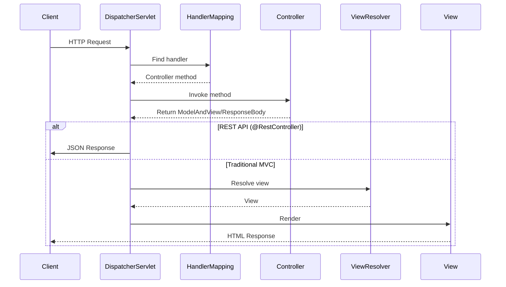

# Web MVC Basics

> [!tip] Quick Reference
> Start with [[SpringBoot/00_Cheat_Sheets]] when you need a fast lookup (web annotations, validation, error handling).

## Overview

Spring MVC provides the foundation for building HTTP APIs in Spring Boot. Understanding controllers, request/response mapping, validation, error handling, and content negotiation is essential for building robust web services.

> [!summary] Goal
> Master REST controllers, request mapping, validation, exception handling, content negotiation, and best practices for building production-ready HTTP APIs.

---

## Spring MVC Architecture

### Request Processing Flow



**Key Components**:
- **DispatcherServlet**: Front controller, routes requests
- **HandlerMapping**: Maps URLs to controller methods
- **Controller**: Handles business logic
- **ViewResolver**: Resolves view names to actual views (for traditional MVC)
- **MessageConverter**: Converts objects to/from JSON/XML (for REST)

---

## Controllers

### @RestController vs @Controller

```java
package com.example.demo.controller;

import org.springframework.web.bind.annotation.*;

/**
 * @RestController = @Controller + @ResponseBody
 * 
 * - All methods return data (not view names)
 * - Responses automatically converted to JSON
 * - Used for REST APIs
 */
@RestController
@RequestMapping("/api/users")
public class UserController {
    
    @GetMapping("/{id}")
    public UserDto getUser(@PathVariable Long id) {
        // Return object -> auto-converted to JSON
        return new UserDto(id, "john@example.com", "John Doe");
    }
}

/**
 * @Controller (traditional MVC)
 * 
 * - Methods return view names
 * - Used for server-side rendered pages
 */
@Controller
@RequestMapping("/web/users")
public class UserViewController {
    
    @GetMapping("/{id}")
    public String showUser(@PathVariable Long id, Model model) {
        UserDto user = userService.getUser(id);
        model.addAttribute("user", user);
        
        // Return view name (e.g., templates/user-profile.html)
        return "user-profile";
    }
}
```

### Basic REST Controller

```java
@RestController
@RequestMapping("/api/products")
public class ProductController {
    
    private final ProductService productService;
    
    // Constructor injection
    public ProductController(ProductService productService) {
        this.productService = productService;
    }
    
    /**
     * GET /api/products
     * Returns all products
     */
    @GetMapping
    public List<ProductDto> getAllProducts() {
        return productService.findAll();
    }
    
    /**
     * GET /api/products/{id}
     * Returns single product by ID
     */
    @GetMapping("/{id}")
    public ProductDto getProduct(@PathVariable Long id) {
        return productService.findById(id);
    }
    
    /**
     * POST /api/products
     * Creates new product
     */
    @PostMapping
    @ResponseStatus(HttpStatus.CREATED)  // Return 201 Created
    public ProductDto createProduct(@RequestBody CreateProductRequest request) {
        return productService.create(request);
    }
    
    /**
     * PUT /api/products/{id}
     * Updates existing product
     */
    @PutMapping("/{id}")
    public ProductDto updateProduct(
        @PathVariable Long id,
        @RequestBody UpdateProductRequest request
    ) {
        return productService.update(id, request);
    }
    
    /**
     * DELETE /api/products/{id}
     * Deletes product
     */
    @DeleteMapping("/{id}")
    @ResponseStatus(HttpStatus.NO_CONTENT)  // Return 204 No Content
    public void deleteProduct(@PathVariable Long id) {
        productService.delete(id);
    }
}
```

---

## Request Mapping

### HTTP Method Annotations

| Annotation | HTTP Method | Usage |
|------------|-------------|-------|
| `@GetMapping` | GET | Retrieve resources |
| `@PostMapping` | POST | Create resources |
| `@PutMapping` | PUT | Update/replace resources |
| `@PatchMapping` | PATCH | Partial update |
| `@DeleteMapping` | DELETE | Delete resources |
| `@RequestMapping` | Any | Generic mapping |

### Path Variables

```java
@RestController
@RequestMapping("/api/orders")
public class OrderController {
    
    /**
     * Single path variable
     * GET /api/orders/123
     */
    @GetMapping("/{id}")
    public OrderDto getOrder(@PathVariable Long id) {
        return orderService.findById(id);
    }
    
    /**
     * Multiple path variables
     * GET /api/orders/123/items/456
     */
    @GetMapping("/{orderId}/items/{itemId}")
    public OrderItemDto getOrderItem(
        @PathVariable Long orderId,
        @PathVariable Long itemId
    ) {
        return orderService.findItem(orderId, itemId);
    }
    
    /**
     * Custom path variable name
     * GET /api/orders/ORD-2024-001
     */
    @GetMapping("/{orderNumber}")
    public OrderDto getOrderByNumber(
        @PathVariable("orderNumber") String number
    ) {
        return orderService.findByNumber(number);
    }
    
    /**
     * Optional path variable (using Optional)
     * GET /api/orders/latest or /api/orders/latest/5
     */
    @GetMapping({"/latest", "/latest/{count}"})
    public List<OrderDto> getLatestOrders(
        @PathVariable(required = false) Optional<Integer> count
    ) {
        int limit = count.orElse(10);
        return orderService.findLatest(limit);
    }
}
```

### Query Parameters

```java
@RestController
@RequestMapping("/api/products")
public class ProductController {
    
    /**
     * Single query parameter
     * GET /api/products?category=electronics
     */
    @GetMapping
    public List<ProductDto> getProducts(@RequestParam String category) {
        return productService.findByCategory(category);
    }
    
    /**
     * Multiple query parameters
     * GET /api/products?category=electronics&minPrice=100&maxPrice=1000
     */
    @GetMapping("/search")
    public List<ProductDto> searchProducts(
        @RequestParam String category,
        @RequestParam BigDecimal minPrice,
        @RequestParam BigDecimal maxPrice
    ) {
        return productService.search(category, minPrice, maxPrice);
    }
    
    /**
     * Optional query parameter
     * GET /api/products?sort=price (or /api/products)
     */
    @GetMapping("/list")
    public List<ProductDto> listProducts(
        @RequestParam(required = false, defaultValue = "name") String sort
    ) {
        return productService.findAll(sort);
    }
    
    /**
     * Query parameter with different name
     * GET /api/products?q=laptop
     */
    @GetMapping("/search-text")
    public List<ProductDto> searchByText(
        @RequestParam("q") String query
    ) {
        return productService.searchByText(query);
    }
    
    /**
     * List parameter
     * GET /api/products?ids=1,2,3 or ?ids=1&ids=2&ids=3
     */
    @GetMapping("/batch")
    public List<ProductDto> getProductsBatch(
        @RequestParam List<Long> ids
    ) {
        return productService.findByIds(ids);
    }
}
```

### Request Body

```java
@RestController
@RequestMapping("/api/users")
public class UserController {
    
    /**
     * Simple request body
     * POST /api/users
     * Body: {"email": "john@example.com", "fullName": "John Doe"}
     */
    @PostMapping
    public UserDto createUser(@RequestBody CreateUserRequest request) {
        return userService.create(request);
    }
    
    /**
     * Request body with validation
     */
    @PostMapping("/validated")
    public UserDto createUserValidated(@Valid @RequestBody CreateUserRequest request) {
        return userService.create(request);
    }
}

// DTO class
public class CreateUserRequest {
    private String email;
    private String fullName;
    
    // Constructors, getters, setters
}
```

### Request Headers

```java
@RestController
@RequestMapping("/api/data")
public class DataController {
    
    /**
     * Read single header
     * GET /api/data
     * Headers: Authorization: Bearer token123
     */
    @GetMapping
    public DataDto getData(@RequestHeader("Authorization") String authHeader) {
        String token = authHeader.substring(7); // Remove "Bearer "
        return dataService.getData(token);
    }
    
    /**
     * Optional header with default
     */
    @GetMapping("/with-locale")
    public DataDto getDataWithLocale(
        @RequestHeader(value = "Accept-Language", defaultValue = "en") String locale
    ) {
        return dataService.getData(locale);
    }
    
    /**
     * All headers
     */
    @GetMapping("/debug")
    public Map<String, String> debugHeaders(@RequestHeader Map<String, String> headers) {
        return headers;
    }
}
```

---

### @ModelAttribute — Form/Object Binding

> [!tip] Definition
> **`@ModelAttribute`** binds request parameters (form data or query params) to a Java object's fields. Spring calls setters matching request parameter names. Two distinct uses: method parameter (bind incoming data) and method-level (populate model for all requests).

### Method parameter — binding form data

```java
@PostMapping("/register")
public String register(@ModelAttribute UserRegistration form) {
    // Binds request params to UserRegistration fields via setters
    // form.email, form.name, form.password are populated
    userService.register(form);
    return "redirect:/login";
}
```

`POST /register?email=a@b.com&name=Alice&password=secret`
→ Spring creates `UserRegistration`, calls `setEmail("a@b.com")`, `setName("Alice")`, `setPassword("secret")`.

### Method-level — populate model for ALL requests

```java
@Controller
@RequestMapping("/admin")
public class AdminController {

    @ModelAttribute("menuItems")                // runs BEFORE every handler
    public List<MenuItem> populateMenu() {
        return adminService.getMenu();
    }

    @ModelAttribute("currentUser")
    public User currentUser(@RequestParam("userId") Long id) {
        return userService.findById(id);
    }

    @GetMapping("/dashboard")
    public String dashboard() {
        // "menuItems" and "currentUser" are already in the model
        return "dashboard";
    }
}
```

### @ModelAttribute vs @RequestBody

| Aspect | `@ModelAttribute` | `@RequestBody` |
|--------|-------------------|----------------|
| **Data source** | Form params / query string | Request body (JSON/XML) |
| **Binding** | By name via setters | By type via Jackson deserializer |
| **Validation** | `@Valid` on the parameter | `@Valid` on the parameter |
| **Content type** | `application/x-www-form-urlencoded` | `application/json` |
| **Use case** | Form-based MVC, file uploads | REST APIs |

---

### @CrossOrigin — CORS Configuration

```java
@RestController
@RequestMapping("/api/users")
@CrossOrigin(origins = "https://app.example.com")  // per-controller
public class UserController {

    @GetMapping("/{id}")
    public UserDto getUser(@PathVariable Long id) { ... }

    @CrossOrigin(origins = "https://admin.example.com")  // per-method override
    @PostMapping
    public UserDto createUser(@RequestBody CreateUserRequest req) { ... }
}
```

### Global CORS (no annotation needed on controllers)

```java
@Configuration
public class CorsConfig implements WebMvcConfigurer {
    @Override
    public void addCorsMappings(CorsRegistry registry) {
        registry.addMapping("/api/**")
            .allowedOrigins("https://app.example.com")
            .allowedMethods("GET", "POST", "PUT", "DELETE")
            .allowedHeaders("*")
            .allowCredentials(true)
            .maxAge(3600);
    }
}
```

| `@CrossOrigin` parameter | Default | Description |
|-------------------------|---------|-------------|
| `origins` | `*` | Allowed origins |
| `methods` | HTTP methods from mapping | Allowed HTTP methods |
| `allowedHeaders` | `*` | Allowed request headers |
| `exposedHeaders` | — | Response headers to expose |
| `allowCredentials` | — | Whether to send cookies |
| `maxAge` | 1800 (30 min) | Preflight cache duration |

---

### Pagination and Sorting

```java
@RestController
@RequestMapping("/api/products")
public class ProductController {
    
    /**
     * Pagination with Spring Data
     * GET /api/products?page=0&size=20&sort=price,desc
     */
    @GetMapping
    public Page<ProductDto> getProducts(
        @RequestParam(defaultValue = "0") int page,
        @RequestParam(defaultValue = "20") int size,
        @RequestParam(defaultValue = "id") String sort,
        @RequestParam(defaultValue = "asc") String direction
    ) {
        Sort.Direction dir = Sort.Direction.fromString(direction);
        Pageable pageable = PageRequest.of(page, size, Sort.by(dir, sort));
        
        return productService.findAll(pageable);
    }
    
    /**
     * Using Pageable parameter (cleaner)
     * GET /api/products/paged?page=0&size=20&sort=name,asc
     */
    @GetMapping("/paged")
    public Page<ProductDto> getProductsPaged(Pageable pageable) {
        return productService.findAll(pageable);
    }
}
```

---

## Request/Response Handling

### ResponseEntity (Full Control)

```java
@RestController
@RequestMapping("/api/users")
public class UserController {
    
    /**
     * Return ResponseEntity for full control
     */
    @GetMapping("/{id}")
    public ResponseEntity<UserDto> getUser(@PathVariable Long id) {
        Optional<UserDto> user = userService.findById(id);
        
        if (user.isPresent()) {
            return ResponseEntity.ok(user.get());
        } else {
            return ResponseEntity.notFound().build();
        }
    }
    
    /**
     * Custom headers and status
     */
    @PostMapping
    public ResponseEntity<UserDto> createUser(@RequestBody CreateUserRequest request) {
        UserDto user = userService.create(request);
        
        URI location = ServletUriComponentsBuilder
            .fromCurrentRequest()
            .path("/{id}")
            .buildAndExpand(user.getId())
            .toUri();
        
        return ResponseEntity
            .created(location)
            .header("X-Custom-Header", "value")
            .body(user);
    }
    
    /**
     * Conditional response
     */
    @GetMapping("/{id}/profile")
    public ResponseEntity<UserProfileDto> getUserProfile(@PathVariable Long id) {
        UserProfileDto profile = userService.getProfile(id);
        
        if (profile.isPublic()) {
            return ResponseEntity.ok(profile);
        } else {
            return ResponseEntity.status(HttpStatus.FORBIDDEN).build();
        }
    }
}
```

### HTTP Status Codes

```java
@RestController
@RequestMapping("/api/resources")
public class ResourceController {
    
    // 200 OK (default for GET)
    @GetMapping("/{id}")
    public ResourceDto get(@PathVariable Long id) {
        return resourceService.get(id);
    }
    
    // 201 Created (POST success)
    @PostMapping
    @ResponseStatus(HttpStatus.CREATED)
    public ResourceDto create(@RequestBody CreateResourceRequest request) {
        return resourceService.create(request);
    }
    
    // 204 No Content (DELETE success)
    @DeleteMapping("/{id}")
    @ResponseStatus(HttpStatus.NO_CONTENT)
    public void delete(@PathVariable Long id) {
        resourceService.delete(id);
    }
    
    // 202 Accepted (async operation)
    @PostMapping("/{id}/process")
    @ResponseStatus(HttpStatus.ACCEPTED)
    public void processAsync(@PathVariable Long id) {
        resourceService.processAsync(id);
    }
    
    // 304 Not Modified (caching)
    @GetMapping("/{id}/cached")
    public ResponseEntity<ResourceDto> getCached(
        @PathVariable Long id,
        @RequestHeader(value = "If-None-Match", required = false) String etag
    ) {
        ResourceDto resource = resourceService.get(id);
        String currentEtag = generateEtag(resource);
        
        if (currentEtag.equals(etag)) {
            return ResponseEntity.status(HttpStatus.NOT_MODIFIED).build();
        }
        
        return ResponseEntity.ok()
            .eTag(currentEtag)
            .body(resource);
    }
}
```

---

## Validation

### Bean Validation Annotations

```java
package com.example.demo.dto;

import jakarta.validation.constraints.*;
import java.math.BigDecimal;
import java.time.LocalDate;

public class CreateProductRequest {
    
    @NotBlank(message = "Name is required")
    @Size(min = 3, max = 100, message = "Name must be between 3 and 100 characters")
    private String name;
    
    @NotBlank
    @Size(max = 500)
    private String description;
    
    @NotNull(message = "Price is required")
    @DecimalMin(value = "0.01", message = "Price must be greater than 0")
    @Digits(integer = 10, fraction = 2)
    private BigDecimal price;
    
    @Min(0)
    @Max(10000)
    private Integer stock;
    
    @NotBlank
    @Pattern(regexp = "^[A-Z]{2,10}$", message = "Category must be 2-10 uppercase letters")
    private String category;
    
    @Email(message = "Invalid email format")
    private String contactEmail;
    
    @Past(message = "Manufacture date must be in the past")
    private LocalDate manufactureDate;
    
    @Future
    private LocalDate expiryDate;
    
    @AssertTrue(message = "Must accept terms and conditions")
    private Boolean termsAccepted;
    
    // Getters and setters
}
```

### Enabling Validation

```java
@RestController
@RequestMapping("/api/products")
public class ProductController {
    
    /**
     * @Valid triggers validation
     * Throws MethodArgumentNotValidException if validation fails
     */
    @PostMapping
    public ProductDto createProduct(@Valid @RequestBody CreateProductRequest request) {
        return productService.create(request);
    }
    
    /**
     * Validate path variable
     */
    @GetMapping("/{id}")
    public ProductDto getProduct(@PathVariable @Min(1) Long id) {
        return productService.findById(id);
    }
    
    /**
     * Validate query parameter
     */
    @GetMapping
    public List<ProductDto> searchProducts(
        @RequestParam @NotBlank String keyword,
        @RequestParam @Min(1) @Max(100) int limit
    ) {
        return productService.search(keyword, limit);
    }
}
```

### Custom Validators

```java
// Custom annotation
@Target({ElementType.FIELD, ElementType.PARAMETER})
@Retention(RetentionPolicy.RUNTIME)
@Constraint(validatedBy = PhoneNumberValidator.class)
public @interface ValidPhoneNumber {
    String message() default "Invalid phone number";
    Class<?>[] groups() default {};
    Class<? extends Payload>[] payload() default {};
}

// Validator implementation
public class PhoneNumberValidator implements ConstraintValidator<ValidPhoneNumber, String> {
    
    private static final Pattern PHONE_PATTERN = Pattern.compile("^\\+?[1-9]\\d{1,14}$");
    
    @Override
    public boolean isValid(String value, ConstraintValidatorContext context) {
        if (value == null || value.isEmpty()) {
            return true;  // Use @NotBlank for null check
        }
        return PHONE_PATTERN.matcher(value).matches();
    }
}

// Usage
public class CreateUserRequest {
    @NotBlank
    @ValidPhoneNumber
    private String phoneNumber;
}
```

### Validation Groups

```java
// Validation groups
public interface CreateGroup {}
public interface UpdateGroup {}

// DTO with groups
public class UserRequest {
    
    @Null(groups = CreateGroup.class, message = "ID must be null when creating")
    @NotNull(groups = UpdateGroup.class, message = "ID is required when updating")
    private Long id;
    
    @NotBlank(groups = {CreateGroup.class, UpdateGroup.class})
    @Email
    private String email;
    
    @NotBlank(groups = CreateGroup.class, message = "Password required when creating")
    @Size(min = 8, groups = CreateGroup.class)
    private String password;
}

// Controller
@RestController
@RequestMapping("/api/users")
public class UserController {
    
    @PostMapping
    public UserDto create(@Validated(CreateGroup.class) @RequestBody UserRequest request) {
        return userService.create(request);
    }
    
    @PutMapping("/{id}")
    public UserDto update(
        @PathVariable Long id,
        @Validated(UpdateGroup.class) @RequestBody UserRequest request
    ) {
        return userService.update(id, request);
    }
}
```

---

## Error Handling

### Global Exception Handler

```java
package com.example.demo.exception;

import org.springframework.http.HttpStatus;
import org.springframework.http.ResponseEntity;
import org.springframework.validation.FieldError;
import org.springframework.web.bind.MethodArgumentNotValidException;
import org.springframework.web.bind.annotation.ExceptionHandler;
import org.springframework.web.bind.annotation.ResponseStatus;
import org.springframework.web.bind.annotation.RestControllerAdvice;
import jakarta.persistence.EntityNotFoundException;
import java.time.LocalDateTime;
import java.util.HashMap;
import java.util.Map;

/**
 * Global exception handler for all controllers
 * @RestControllerAdvice = @ControllerAdvice + @ResponseBody
 */
@RestControllerAdvice
public class GlobalExceptionHandler {
    
    /**
     * Handle EntityNotFoundException (404 Not Found)
     */
    @ExceptionHandler(EntityNotFoundException.class)
    @ResponseStatus(HttpStatus.NOT_FOUND)
    public ErrorResponse handleEntityNotFound(EntityNotFoundException ex) {
        return new ErrorResponse(
            HttpStatus.NOT_FOUND.value(),
            "Resource not found",
            ex.getMessage(),
            LocalDateTime.now()
        );
    }
    
    /**
     * Handle validation errors (400 Bad Request)
     */
    @ExceptionHandler(MethodArgumentNotValidException.class)
    @ResponseStatus(HttpStatus.BAD_REQUEST)
    public ValidationErrorResponse handleValidationErrors(MethodArgumentNotValidException ex) {
        Map<String, String> errors = new HashMap<>();
        
        ex.getBindingResult().getAllErrors().forEach(error -> {
            String fieldName = ((FieldError) error).getField();
            String errorMessage = error.getDefaultMessage();
            errors.put(fieldName, errorMessage);
        });
        
        return new ValidationErrorResponse(
            HttpStatus.BAD_REQUEST.value(),
            "Validation failed",
            errors,
            LocalDateTime.now()
        );
    }
    
    /**
     * Handle IllegalArgumentException (400 Bad Request)
     */
    @ExceptionHandler(IllegalArgumentException.class)
    @ResponseStatus(HttpStatus.BAD_REQUEST)
    public ErrorResponse handleIllegalArgument(IllegalArgumentException ex) {
        return new ErrorResponse(
            HttpStatus.BAD_REQUEST.value(),
            "Invalid request",
            ex.getMessage(),
            LocalDateTime.now()
        );
    }
    
    /**
     * Handle generic exceptions (500 Internal Server Error)
     */
    @ExceptionHandler(Exception.class)
    @ResponseStatus(HttpStatus.INTERNAL_SERVER_ERROR)
    public ErrorResponse handleGenericException(Exception ex) {
        // Log the exception
        logger.error("Unexpected error occurred", ex);
        
        return new ErrorResponse(
            HttpStatus.INTERNAL_SERVER_ERROR.value(),
            "Internal server error",
            "An unexpected error occurred. Please try again later.",
            LocalDateTime.now()
        );
    }
    
    /**
     * Custom business exception
     */
    @ExceptionHandler(InsufficientStockException.class)
    @ResponseStatus(HttpStatus.CONFLICT)
    public ErrorResponse handleInsufficientStock(InsufficientStockException ex) {
        return new ErrorResponse(
            HttpStatus.CONFLICT.value(),
            "Insufficient stock",
            ex.getMessage(),
            LocalDateTime.now()
        );
    }
}

// Error response DTOs
record ErrorResponse(
    int status,
    String error,
    String message,
    LocalDateTime timestamp
) {}

record ValidationErrorResponse(
    int status,
    String error,
    Map<String, String> fieldErrors,
    LocalDateTime timestamp
) {}
```

### Custom Exceptions

```java
// Base exception
public class BusinessException extends RuntimeException {
    private final HttpStatus status;
    
    public BusinessException(String message, HttpStatus status) {
        super(message);
        this.status = status;
    }
    
    public HttpStatus getStatus() {
        return status;
    }
}

// Specific exceptions
public class ResourceNotFoundException extends BusinessException {
    public ResourceNotFoundException(String message) {
        super(message, HttpStatus.NOT_FOUND);
    }
}

public class DuplicateResourceException extends BusinessException {
    public DuplicateResourceException(String message) {
        super(message, HttpStatus.CONFLICT);
    }
}

public class UnauthorizedException extends BusinessException {
    public UnauthorizedException(String message) {
        super(message, HttpStatus.UNAUTHORIZED);
    }
}

// Handler
@ExceptionHandler(BusinessException.class)
public ResponseEntity<ErrorResponse> handleBusinessException(BusinessException ex) {
    ErrorResponse response = new ErrorResponse(
        ex.getStatus().value(),
        ex.getStatus().getReasonPhrase(),
        ex.getMessage(),
        LocalDateTime.now()
    );
    
    return ResponseEntity.status(ex.getStatus()).body(response);
}
```

---

## Content Negotiation

### Producing JSON/XML

```java
@RestController
@RequestMapping("/api/products")
public class ProductController {
    
    /**
     * Produces JSON by default
     * GET /api/products/1
     * Accept: application/json
     */
    @GetMapping(value = "/{id}", produces = "application/json")
    public ProductDto getProductJson(@PathVariable Long id) {
        return productService.findById(id);
    }
    
    /**
     * Produces XML when requested
     * GET /api/products/1
     * Accept: application/xml
     */
    @GetMapping(value = "/{id}", produces = "application/xml")
    public ProductDto getProductXml(@PathVariable Long id) {
        return productService.findById(id);
    }
    
    /**
     * Supports both JSON and XML
     * GET /api/products/1
     * Accept: application/json or application/xml
     */
    @GetMapping(value = "/{id}", produces = {
        MediaType.APPLICATION_JSON_VALUE,
        MediaType.APPLICATION_XML_VALUE
    })
    public ProductDto getProduct(@PathVariable Long id) {
        return productService.findById(id);
    }
}
```

### Consuming JSON/XML

```java
@RestController
@RequestMapping("/api/products")
public class ProductController {
    
    /**
     * Accepts only JSON
     * POST /api/products
     * Content-Type: application/json
     */
    @PostMapping(consumes = "application/json")
    public ProductDto createFromJson(@RequestBody CreateProductRequest request) {
        return productService.create(request);
    }
    
    /**
     * Accepts JSON or XML
     */
    @PostMapping(consumes = {
        MediaType.APPLICATION_JSON_VALUE,
        MediaType.APPLICATION_XML_VALUE
    })
    public ProductDto create(@RequestBody CreateProductRequest request) {
        return productService.create(request);
    }
}
```

---

## Common Pitfalls and Solutions

### Pitfall 1: Missing @RequestBody

**Problem**: Request body not deserialized.

```java
// ❌ BAD: Missing @RequestBody
@PostMapping
public UserDto create(CreateUserRequest request) {
    // request is null!
}

// ✅ GOOD
@PostMapping
public UserDto create(@RequestBody CreateUserRequest request) {
    // request properly deserialized from JSON
}
```

### Pitfall 2: Path Variable vs Query Parameter Confusion

```java
// Path variable (part of URL structure)
// GET /api/users/123
@GetMapping("/{id}")
public UserDto getUser(@PathVariable Long id) {}

// Query parameter (optional filters)
// GET /api/users?id=123&active=true
@GetMapping
public List<UserDto> getUsers(@RequestParam Long id, @RequestParam boolean active) {}
```

### Pitfall 3: Not Handling Validation Errors

**Problem**: Validation errors return generic 400 response.

```java
// ❌ BAD: No error handling
@PostMapping
public UserDto create(@Valid @RequestBody CreateUserRequest request) {
    // Validation fails -> generic error
}

// ✅ GOOD: Global handler
@ExceptionHandler(MethodArgumentNotValidException.class)
@ResponseStatus(HttpStatus.BAD_REQUEST)
public ValidationErrorResponse handleValidation(MethodArgumentNotValidException ex) {
    // Return structured error with field-level details
}
```

### Pitfall 4: Large Response Payloads

**Problem**: Returning entire entities instead of DTOs.

```java
// ❌ BAD: Exposing entire entity
@GetMapping("/{id}")
public User getUser(@PathVariable Long id) {
    return userRepository.findById(id).get();
    // Exposes internal fields, lazy collections, etc.
}

// ✅ GOOD: Use DTOs
@GetMapping("/{id}")
public UserDto getUser(@PathVariable Long id) {
    User user = userRepository.findById(id).get();
    return new UserDto(user.getId(), user.getEmail(), user.getFullName());
    // Only necessary fields
}
```

### Pitfall 5: Not Setting Proper HTTP Status

```java
// ❌ BAD: Returns 200 for creation
@PostMapping
public UserDto create(@RequestBody CreateUserRequest request) {
    return userService.create(request);
}

// ✅ GOOD: Returns 201 Created
@PostMapping
@ResponseStatus(HttpStatus.CREATED)
public UserDto create(@RequestBody CreateUserRequest request) {
    return userService.create(request);
}

// OR with Location header
@PostMapping
public ResponseEntity<UserDto> create(@RequestBody CreateUserRequest request) {
    UserDto user = userService.create(request);
    URI location = ServletUriComponentsBuilder
        .fromCurrentRequest()
        .path("/{id}")
        .buildAndExpand(user.getId())
        .toUri();
    
    return ResponseEntity.created(location).body(user);
}
```

---

## Production Best Practices

### 1. Use DTOs, Not Entities

```java
// ✅ GOOD: Separate DTOs
public record UserDto(Long id, String email, String fullName) {}
public record CreateUserRequest(String email, String fullName, String password) {}
public record UpdateUserRequest(String email, String fullName) {}

@RestController
@RequestMapping("/api/users")
public class UserController {
    
    @GetMapping("/{id}")
    public UserDto getUser(@PathVariable Long id) {
        User user = userService.findById(id);
        return toDto(user);  // Map entity to DTO
    }
    
    private UserDto toDto(User user) {
        return new UserDto(user.getId(), user.getEmail(), user.getFullName());
    }
}
```

### 2. Versioning APIs

```java
// Option 1: URL versioning
@RestController
@RequestMapping("/api/v1/users")
public class UserControllerV1 {}

@RestController
@RequestMapping("/api/v2/users")
public class UserControllerV2 {}

// Option 2: Header versioning
@GetMapping(headers = "API-Version=1")
public UserDtoV1 getUserV1() {}

@GetMapping(headers = "API-Version=2")
public UserDtoV2 getUserV2() {}

// Option 3: Accept header versioning
@GetMapping(produces = "application/vnd.company.v1+json")
public UserDtoV1 getUserV1() {}

@GetMapping(produces = "application/vnd.company.v2+json")
public UserDtoV2 getUserV2() {}
```

### 3. Rate Limiting

```java
@RestController
@RequestMapping("/api/public")
public class PublicApiController {
    
    private final RateLimiter rateLimiter;
    
    @GetMapping("/data")
    public ResponseEntity<DataDto> getData(@RequestHeader("X-API-Key") String apiKey) {
        if (!rateLimiter.allowRequest(apiKey)) {
            return ResponseEntity.status(HttpStatus.TOO_MANY_REQUESTS)
                .header("X-RateLimit-Remaining", "0")
                .build();
        }
        
        return ResponseEntity.ok(dataService.getData());
    }
}
```

### 4. Request Logging

```java
@Component
public class RequestLoggingFilter implements Filter {
    
    @Override
    public void doFilter(ServletRequest request, ServletResponse response, FilterChain chain)
            throws IOException, ServletException {
        
        HttpServletRequest httpRequest = (HttpServletRequest) request;
        
        logger.info("Request: {} {} from {}",
            httpRequest.getMethod(),
            httpRequest.getRequestURI(),
            httpRequest.getRemoteAddr()
        );
        
        chain.doFilter(request, response);
    }
}
```

---

## Related Notes

- [[04_Config_Properties_and_Validation]] - Configuration and validation
- [[01_Spring_Data_JPA_Essentials]] - Data access layer
- [[02_Transactions_and_Propagation]] - Transaction management

---

> [!question]- Interview Questions
> 
> **Q: What's the difference between @Controller and @RestController?**
> A: `@RestController` = `@Controller` + `@ResponseBody`. `@Controller` returns view names for server-side rendering. `@RestController` returns data (objects automatically serialized to JSON). Use `@RestController` for REST APIs, `@Controller` for traditional MVC with templates.
> 
> **Q: When would you use @PathVariable vs @RequestParam?**
> A: `@PathVariable` for resource identifiers in URL structure (e.g., `/users/{id}`). `@RequestParam` for optional filters/parameters (e.g., `/users?active=true&sort=name`). Path variables are part of RESTful design, query params are for filtering/pagination.
> 
> **Q: How does Spring MVC handle validation errors?**
> A: When `@Valid` or `@Validated` is used, Spring triggers Bean Validation. If validation fails, throws `MethodArgumentNotValidException`. Without handler, returns generic 400. Best practice: Create `@RestControllerAdvice` with `@ExceptionHandler` to return structured error response with field-level details.
> 
> **Q: What HTTP status code should you return for successful POST?**
> A: 201 Created (not 200 OK). Include Location header with URI of created resource. Example: `ResponseEntity.created(location).body(createdResource)`. 200 OK is for GET/PUT, 204 No Content for DELETE.
> 
> **Q: Why use DTOs instead of returning entities directly?**
> A: 1) Decouple API from database schema, 2) Control what fields are exposed (security), 3) Avoid lazy loading exceptions, 4) Prevent exposing internal structure, 5) Enable API versioning. Entities are for persistence layer, DTOs for presentation layer.
