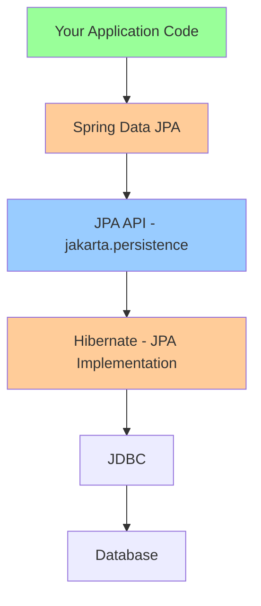
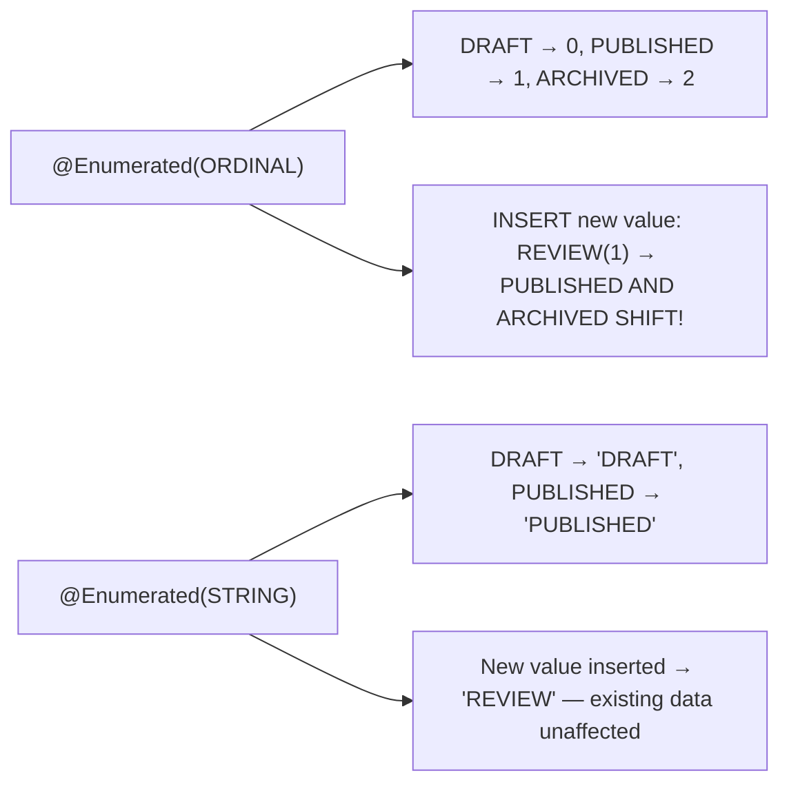
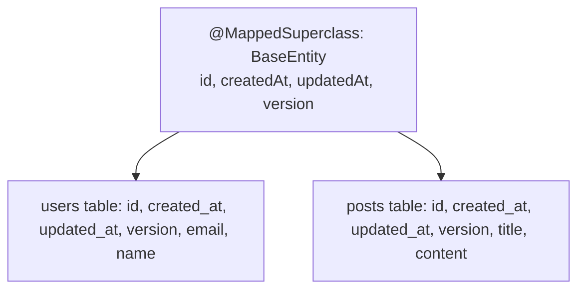
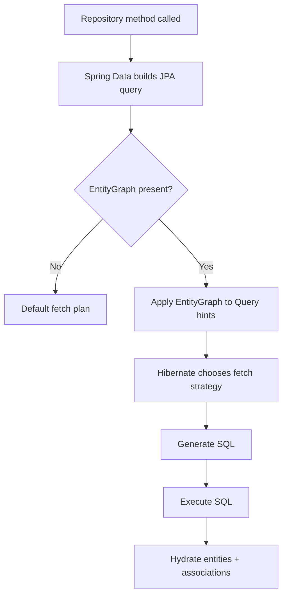
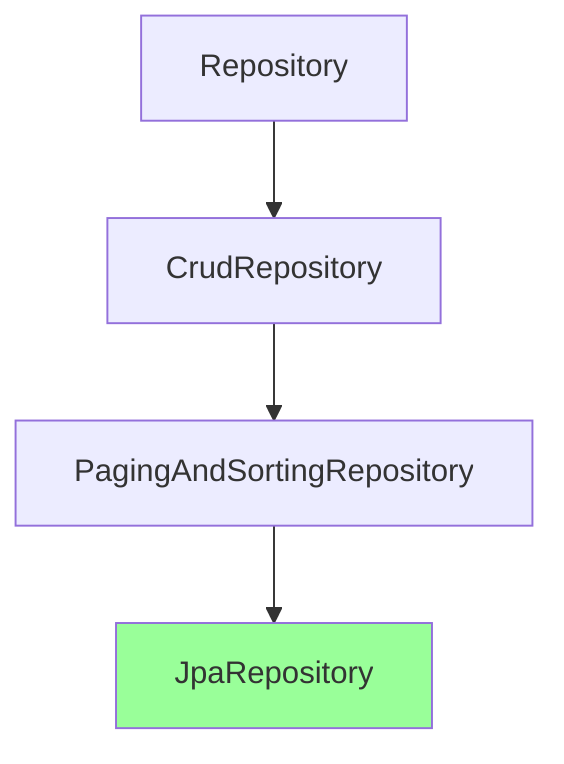
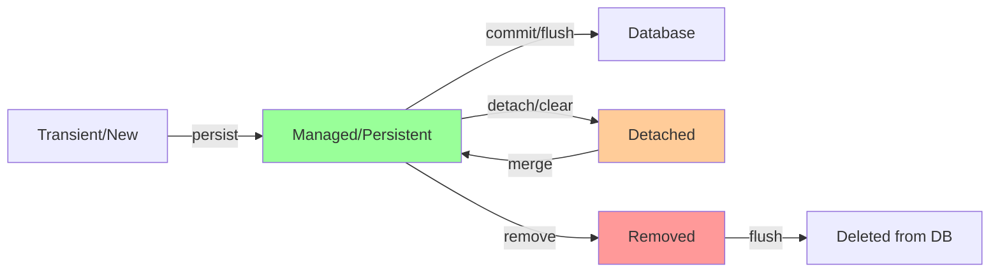

# Spring Data JPA Essentials

## Overview

Spring Data JPA simplifies data access by providing repository abstractions over JPA/Hibernate. However, understanding entity lifecycle, relationships, fetch strategies, and common pitfalls is critical for building performant, correct applications.

> [!summary] Goal
> Master JPA entities, relationships, query methods, fetch strategies, N+1 problem solutions, and production best practices for data access.

---

## JPA vs Hibernate vs Spring Data JPA

### The Layers



**What each layer provides**:

- **JPA (Jakarta Persistence API)**: Specification/interfaces (`@Entity`, `EntityManager`, etc.)
- **Hibernate**: Implementation of JPA (most popular)
- **Spring Data JPA**: Repository abstraction over JPA (reduces boilerplate)

---

## Entity Basics

### Basic Entity

```java
package com.example.demo.model;

import jakarta.persistence.*;
import java.time.LocalDateTime;

/**
 * JPA Entity representing a User
 * 
 * @Entity - Marks class as JPA entity (mapped to table)
 * @Table - Optional: specify table name (defaults to class name)
 * @Id - Primary key field
 * @GeneratedValue - How to generate PK values
 */
@Entity
@Table(name = "users")
public class User {
    
    /**
     * Primary Key Strategies:
     * - IDENTITY: Auto-increment (DB generates ID)
     * - SEQUENCE: Use DB sequence (PostgreSQL default)
     * - AUTO: JPA chooses based on DB
     * - UUID: Generate UUID (recommended for distributed systems)
     */
    @Id
    @GeneratedValue(strategy = GenerationType.IDENTITY)
    private Long id;
    
    /**
     * @Column - Optional: customize column mapping
     * - name: column name (defaults to field name)
     * - nullable: NOT NULL constraint
     * - unique: UNIQUE constraint
     * - length: VARCHAR length (default 255)
     */
    @Column(name = "email", nullable = false, unique = true, length = 100)
    private String email;
    
    @Column(name = "full_name", nullable = false)
    private String fullName;
    
    /**
     * Audit fields (when created/updated)
     * @CreatedDate and @LastModifiedDate from Spring Data JPA
     */
    @Column(name = "created_at", nullable = false, updatable = false)
    private LocalDateTime createdAt;
    
    @Column(name = "updated_at", nullable = false)
    private LocalDateTime updatedAt;
    
    /**
     * Version field for optimistic locking
     * Automatically incremented on each update
     * Prevents lost updates in concurrent scenarios
     */
    @Version
    private Long version;
    
    /**
     * Lifecycle callbacks
     */
    @PrePersist
    protected void onCreate() {
        createdAt = LocalDateTime.now();
        updatedAt = LocalDateTime.now();
    }
    
    @PreUpdate
    protected void onUpdate() {
        updatedAt = LocalDateTime.now();
    }
    
    // Constructors
    protected User() {} // Required by JPA
    
    public User(String email, String fullName) {
        this.email = email;
        this.fullName = fullName;
    }
    
    // Getters and setters
    public Long getId() { return id; }
    
    public String getEmail() { return email; }
    public void setEmail(String email) { this.email = email; }
    
    public String getFullName() { return fullName; }
    public void setFullName(String fullName) { this.fullName = fullName; }
    
    public LocalDateTime getCreatedAt() { return createdAt; }
    public LocalDateTime getUpdatedAt() { return updatedAt; }
    public Long getVersion() { return version; }
    
    @Override
    public boolean equals(Object o) {
        if (this == o) return true;
        if (!(o instanceof User)) return false;
        User user = (User) o;
        return id != null && id.equals(user.id);
    }
    
    @Override
    public int hashCode() {
        return getClass().hashCode();
    }
}
```

### Entity with Lombok

```java
import lombok.Data;
import lombok.NoArgsConstructor;
import lombok.AllArgsConstructor;

@Entity
@Table(name = "products")
@Data  // Generates getters, setters, toString, equals, hashCode
@NoArgsConstructor  // JPA requires no-arg constructor
@AllArgsConstructor
public class Product {
    
    @Id
    @GeneratedValue(strategy = GenerationType.IDENTITY)
    private Long id;
    
    @Column(nullable = false)
    private String name;
    
    @Column(precision = 10, scale = 2)  // For BigDecimal
    private BigDecimal price;
    
    @Version
    private Long version;
}
```

### UUID Primary Keys (Recommended for Distributed Systems)

```java
import java.util.UUID;

@Entity
@Table(name = "orders")
public class Order {
    
    /**
     * UUID primary key
     * - Advantages: No DB round-trip to get ID, works in distributed systems
     * - Disadvantages: 16 bytes vs 8 for BIGINT, index performance
     */
    @Id
    @GeneratedValue(strategy = GenerationType.UUID)
    @Column(columnDefinition = "uuid")
    private UUID id;
    
    // Alternative: Generate UUID manually
    @Id
    @Column(columnDefinition = "uuid")
    private UUID id = UUID.randomUUID();
    
    // Fields...
}
```

---

### @Enumerated — Mapping Enums

```java
public enum Status { DRAFT, PUBLISHED, ARCHIVED }

@Entity
public class Article {
    @Enumerated(EnumType.STRING)   // 👈 ALWAYS use STRING
    private Status status;
}
```



> [!warning] **Never use `EnumType.ORDINAL`.** If you add or reorder enum constants, ORDINAL shifts corrupt existing rows. `ORDINAL`: `PUBLISHED = 1`, `ARCHIVED = 2`. Insert `REVIEW` between them → `PUBLISHED` becomes `1`, `ARCHIVED` becomes `2`, `REVIEW` becomes `3`. All existing `ARCHIVED` rows now read as `PUBLISHED` — catastrophic data corruption. Always use `EnumType.STRING`.

### @Lob — Large Objects

```java
@Entity
public class Document {
    @Lob
    @Column(columnDefinition = "TEXT")
    private String content;        // CLOB — character large object

    @Lob
    @Column(columnDefinition = "BYTEA")
    private byte[] attachment;     // BLOB — binary large object
}
```

| Type | Java type | SQL type | Use case |
|------|-----------|----------|----------|
| CLOB | `String` | `TEXT`, `LONGTEXT` | Blog content, JSON, markdown |
| BLOB | `byte[]` | `BYTEA`, `BLOB` | Images, PDF files, encrypted data |

> [!warning] `@Lob` fields cannot be indexed or used efficiently in `WHERE` clauses. Keep queries on `@Lob` columns to `IS NULL`/`IS NOT NULL`.

### @Transient — Non-Persisted Fields

```java
@Entity
public class User {

    @Transient
    private boolean recentlyActive;   // Computed, not stored in DB

    @Transient
    private String displayName;       // Derived from firstName + lastName

    @PostLoad
    public void afterLoad() {
        this.recentlyActive = getLastLogin() != null
            && getLastLogin().isAfter(LocalDateTime.now().minusDays(7));
    }
}
```

> [!tip] JPA `@Transient` is different from Java's `transient` keyword. `@Transient` excludes the field from JPA persistence. `transient` excludes it from Java serialization. They can be used independently.

### @MappedSuperclass — Shared Entity Fields

Defines common fields inherited by all entities — no table for the superclass itself; columns are mapped directly into each entity's table.

```java
@MappedSuperclass
public abstract class BaseEntity {

    @Id @GeneratedValue(strategy = GenerationType.SEQUENCE)
    private Long id;

    @CreatedDate
    @Column(updatable = false)
    private LocalDateTime createdAt;

    @LastModifiedDate
    private LocalDateTime updatedAt;

    @Version
    private Long version;

    @PrePersist
    void onCreate() { this.createdAt = LocalDateTime.now(); }

    @PreUpdate
    void onUpdate() { this.updatedAt = LocalDateTime.now(); }
}

@Entity
public class User extends BaseEntity {       // inherits id, createdAt, etc.
    private String email;
    private String name;
}
```



> [!warning] `@MappedSuperclass` does NOT support polymorphic queries. You cannot do `FROM BaseEntity`. Use `@Inheritance` for polymorphic querying.

---

### @Inheritance — Entity Hierarchy Strategies

```java
@Entity
@Inheritance(strategy = InheritanceType.SINGLE_TABLE)   // DEFAULT
@DiscriminatorColumn(name = "payment_type")
public abstract class Payment {
    @Id @GeneratedValue private Long id;
    private BigDecimal amount;
}

@Entity
@DiscriminatorValue("CC")
public class CreditCardPayment extends Payment {
    private String cardNumber;
}

@Entity
@DiscriminatorValue("PP")
public class PayPalPayment extends Payment {
    private String paypalEmail;
}
```

| Strategy | Tables | Query speed | Nullable columns | Best for |
|----------|--------|-------------|------------------|----------|
| **SINGLE_TABLE** (default) | 1 | Fastest | Many nullable | Simple, shallow hierarchies |
| **JOINED** | 1 per class | Slower (joins) | None | Deep, normalized hierarchies |
| **TABLE_PER_CLASS** | 1 per concrete class | Fast (no joins) | None | Non-overlapping fields |

---

### Entity Lifecycle Callbacks

JPA provides seven lifecycle callback annotations:

| Callback | Timing | Common use |
|----------|--------|------------|
| `@PrePersist` | Before INSERT | Set `createdAt`, defaults |
| `@PostPersist` | After INSERT | Audit log, cache warming |
| `@PreUpdate` | Before UPDATE | Update `updatedAt` |
| `@PostUpdate` | After UPDATE | Event publishing, change log |
| `@PreRemove` | Before DELETE | Referential integrity check |
| `@PostRemove` | After DELETE | Cache eviction |
| `@PostLoad` | After SELECT / refresh | Populate `@Transient` fields |

```java
@Entity
public class User {

    @PrePersist
    public void beforePersist() { this.createdAt = LocalDateTime.now(); }

    @PostPersist
    public void afterPersist() { audit.log("User created: " + id); }

    @PreUpdate
    public void beforeUpdate() { this.updatedAt = LocalDateTime.now(); }

    @PostUpdate
    public void afterUpdate() { audit.log("User updated: " + id); }

    @PreRemove
    public void beforeRemove() { checkReferentialIntegrity(); }

    @PostRemove
    public void afterRemove() { cache.evict("users", id); }

    @PostLoad
    public void afterLoad() { this.displayName = firstName + " " + lastName; }
}
```

---

## Entity Relationships

> [!tip] Quick Reference
> See [[SpringBoot/00_Cheat_Sheets#Spring Data JPA Cheat Sheet]] for a condensed lookup (annotations, fetch patterns, recipes).

### Relationship Map (Mermaid)

```mermaid
graph TD
    U[User] -->|@OneToOne| P[UserProfile]
    U -->|@OneToMany| O[Order]
    O -->|@ManyToOne| U
    S[Student] -->|@ManyToMany| C[Course]
    C -->|@ManyToMany mappedBy| S
```

### @OneToMany and @ManyToOne

**Bidirectional relationship** (User has many Orders):

```java
// Parent side (User)
@Entity
@Table(name = "users")
public class User {
    @Id
    @GeneratedValue(strategy = GenerationType.IDENTITY)
    private Long id;
    
    /**
     * One User has Many Orders
     * 
     * @OneToMany:
     * - mappedBy: field name in Order entity (indicates non-owning side)
     * - cascade: operations to cascade (PERSIST, REMOVE, etc.)
     * - orphanRemoval: delete Orders when removed from list
     * - fetch: LAZY (default, recommended) or EAGER
     */
    @OneToMany(
        mappedBy = "user",
        cascade = CascadeType.ALL,
        orphanRemoval = true,
        fetch = FetchType.LAZY  // Default, explicit for clarity
    )
    private List<Order> orders = new ArrayList<>();
    
    // Helper methods to maintain bidirectional relationship
    public void addOrder(Order order) {
        orders.add(order);
        order.setUser(this);
    }
    
    public void removeOrder(Order order) {
        orders.remove(order);
        order.setUser(null);
    }
}

// Child side (Order)
@Entity
@Table(name = "orders")
public class Order {
    @Id
    @GeneratedValue(strategy = GenerationType.IDENTITY)
    private Long id;
    
    /**
     * Many Orders belong to One User
     * 
     * @ManyToOne:
     * - Owning side (has foreign key column)
     * - fetch: EAGER by default (often problematic!)
     * @JoinColumn:
     * - name: foreign key column name
     * - nullable: whether FK can be NULL
     */
    @ManyToOne(fetch = FetchType.LAZY)  // Override default EAGER
    @JoinColumn(name = "user_id", nullable = false)
    private User user;
    
    @Column(nullable = false)
    private BigDecimal totalAmount;
}
```

**Unidirectional @ManyToOne** (simpler, often sufficient):

```java
@Entity
@Table(name = "comments")
public class Comment {
    @Id
    @GeneratedValue(strategy = GenerationType.IDENTITY)
    private Long id;
    
    @ManyToOne(fetch = FetchType.LAZY)
    @JoinColumn(name = "post_id", nullable = false)
    private Post post;  // Reference to parent, no collection in Post
    
    @Column(nullable = false, length = 1000)
    private String content;
}
```

### @OneToOne

```java
// User
@Entity
@Table(name = "users")
public class User {
    @Id
    @GeneratedValue(strategy = GenerationType.IDENTITY)
    private Long id;
    
    /**
     * One-to-One relationship
     * - mappedBy: indicates non-owning side
     * - cascade: operations to cascade
     * - fetch: LAZY (requires bytecode enhancement in some cases)
     */
    @OneToOne(mappedBy = "user", cascade = CascadeType.ALL, fetch = FetchType.LAZY)
    private UserProfile profile;
}

// UserProfile (owning side)
@Entity
@Table(name = "user_profiles")
public class UserProfile {
    @Id
    @GeneratedValue(strategy = GenerationType.IDENTITY)
    private Long id;
    
    @OneToOne(fetch = FetchType.LAZY)
    @JoinColumn(name = "user_id", nullable = false, unique = true)
    private User user;
    
    @Column(length = 500)
    private String bio;
    
    @Column(length = 200)
    private String avatarUrl;
}
```

**Shared Primary Key @OneToOne** (more efficient):

```java
// UserProfile with shared PK
@Entity
@Table(name = "user_profiles")
public class UserProfile {
    
    /**
     * Share same ID as User
     * - No separate ID generation
     * - FK constraint enforces relationship
     */
    @Id
    private Long id;
    
    @OneToOne(fetch = FetchType.LAZY)
    @MapsId  // Use User's ID as this entity's ID
    @JoinColumn(name = "user_id")
    private User user;
    
    @Column(length = 500)
    private String bio;
}
```

### @ManyToMany

```java
// Student
@Entity
@Table(name = "students")
public class Student {
    @Id
    @GeneratedValue(strategy = GenerationType.IDENTITY)
    private Long id;
    
    @Column(nullable = false)
    private String name;
    
    /**
     * Many Students to Many Courses
     * 
     * @JoinTable: defines join table
     * - name: join table name
     * - joinColumns: FK to this entity
     * - inverseJoinColumns: FK to other entity
     */
    @ManyToMany
    @JoinTable(
        name = "student_courses",
        joinColumns = @JoinColumn(name = "student_id"),
        inverseJoinColumns = @JoinColumn(name = "course_id")
    )
    private Set<Course> courses = new HashSet<>();
    
    // Helper methods
    public void enrollInCourse(Course course) {
        courses.add(course);
        course.getStudents().add(this);
    }
    
    public void dropCourse(Course course) {
        courses.remove(course);
        course.getStudents().remove(this);
    }
}

// Course
@Entity
@Table(name = "courses")
public class Course {
    @Id
    @GeneratedValue(strategy = GenerationType.IDENTITY)
    private Long id;
    
    @Column(nullable = false)
    private String title;
    
    @ManyToMany(mappedBy = "courses")
    private Set<Student> students = new HashSet<>();
}
```

**ManyToMany with Attributes (Join Entity Pattern)**:

```java
// StudentCourse (join entity with attributes)
@Entity
@Table(name = "student_courses")
public class StudentCourse {
    
    @EmbeddedId
    private StudentCourseId id;
    
    @ManyToOne(fetch = FetchType.LAZY)
    @MapsId("studentId")
    @JoinColumn(name = "student_id")
    private Student student;
    
    @ManyToOne(fetch = FetchType.LAZY)
    @MapsId("courseId")
    @JoinColumn(name = "course_id")
    private Course course;
    
    @Column(name = "enrolled_at", nullable = false)
    private LocalDateTime enrolledAt;
    
    @Column(name = "grade")
    private Integer grade;  // Additional attribute
}

// Composite key
@Embeddable
public class StudentCourseId implements Serializable {
    private Long studentId;
    private Long courseId;
    
    // equals, hashCode, constructors
}
```

---

## Fetch Strategies and N+1 Problem

### The N+1 Problem

**Problem**: Loading 1 parent + N queries for children

```java
// Example: Load all users
List<User> users = userRepository.findAll();  // 1 query

// Access orders for each user
for (User user : users) {
    System.out.println(user.getOrders().size());  // N queries (one per user)
}

// Result: 1 + N queries (if 100 users, 101 queries!)
```

**SQL Generated**:
```sql
-- Query 1: Fetch users
SELECT * FROM users;

-- Query 2-N: Fetch orders for each user
SELECT * FROM orders WHERE user_id = 1;
SELECT * FROM orders WHERE user_id = 2;
SELECT * FROM orders WHERE user_id = 3;
-- ... 100 queries
```

### Solution 1: JOIN FETCH

```java
// Repository method with JOIN FETCH
@Query("SELECT u FROM User u LEFT JOIN FETCH u.orders WHERE u.id = :id")
Optional<User> findByIdWithOrders(@Param("id") Long id);

// For multiple users (beware of cartesian product)
@Query("SELECT DISTINCT u FROM User u LEFT JOIN FETCH u.orders")
List<User> findAllWithOrders();
```

**SQL Generated**:
```sql
SELECT u.*, o.* 
FROM users u 
LEFT JOIN orders o ON u.id = o.user_id;
```

### Solution 2: EntityGraph

> [!summary] What EntityGraph Actually Does
> `@EntityGraph` influences the fetch plan for *that repository method call*. Hibernate uses it to decide which associations to fetch eagerly (typically via SQL joins or secondary selects) without changing the default mapping fetch type globally.



```java
@Entity
@Table(name = "users")
@NamedEntityGraph(
    name = "User.orders",
    attributeNodes = @NamedAttributeNode("orders")
)
public class User {
    // ...
}

// Repository
public interface UserRepository extends JpaRepository<User, Long> {
    
    @EntityGraph(value = "User.orders", type = EntityGraph.EntityGraphType.FETCH)
    List<User> findAll();
    
    // Or inline
    @EntityGraph(attributePaths = {"orders"})
    Optional<User> findById(Long id);
}

**When to prefer EntityGraph vs JOIN FETCH**:

- Use **JOIN FETCH** when you want to *force* a specific join shape for one query and you can reason about row explosion and pagination constraints.
- Use **EntityGraph** when you want a reusable fetch recipe across multiple derived queries (`findBy...`) without rewriting JPQL.

**Internal note (Hibernate)**:

- Entity graphs typically translate into one of:
  - SQL join fetching for to-one associations.
  - Join fetching or secondary selects for collections depending on cardinality and provider decisions.
- If you see unexpected extra queries, verify:
  - collection type (bag vs set)
  - `hibernate.default_batch_fetch_size` and `@BatchSize`
  - whether pagination is applied
```

### Solution 3: Batch Fetching

```java
@Entity
@Table(name = "users")
public class User {
    
    @OneToMany(mappedBy = "user")
    @BatchSize(size = 10)  // Fetch in batches of 10
    private List<Order> orders = new ArrayList<>();
}
```

**SQL Generated**:
```sql
-- Query 1: Fetch users
SELECT * FROM users;

-- Query 2: Fetch orders for first 10 users (batched)
SELECT * FROM orders WHERE user_id IN (1, 2, 3, 4, 5, 6, 7, 8, 9, 10);

-- Query 3: Fetch orders for next 10 users
SELECT * FROM orders WHERE user_id IN (11, 12, 13, ...);
```

### Comparison: Fetch Strategies

| Strategy | Queries | Pros | Cons |
|----------|---------|------|------|
| **LAZY (default)** | N+1 | Memory efficient | N+1 problem |
| **EAGER** | 1 (with JOIN) | Simple | Always loads, cartesian product risk |
| **JOIN FETCH** | 1 | Explicit, efficient | Query-specific |
| **EntityGraph** | 1 | Flexible, reusable | More complex |
| **Batch Fetch** | 1 + N/batchSize | Reduces queries | Still multiple queries |

---

## Spring Data JPA Repositories

### Repository Hierarchy



**What each provides**:
- **Repository**: Marker interface
- **CrudRepository**: save, findById, findAll, delete, etc.
- **PagingAndSortingRepository**: Adds pagination and sorting
- **JpaRepository**: Adds batch operations, flushing

### Basic Repository

```java
package com.example.demo.repository;

import com.example.demo.model.User;
import org.springframework.data.jpa.repository.JpaRepository;
import org.springframework.stereotype.Repository;

/**
 * Spring Data JPA Repository
 * 
 * - Extends JpaRepository<Entity, IDType>
 * - @Repository is optional (Spring Data auto-detects)
 * - Provides CRUD operations out-of-the-box
 */
@Repository
public interface UserRepository extends JpaRepository<User, Long> {
    
    /**
     * Derived Query Methods
     * 
     * Spring Data generates implementation from method name
     * Pattern: findBy<PropertyName><Operator>
     */
    
    // SELECT * FROM users WHERE email = ?
    Optional<User> findByEmail(String email);
    
    // SELECT * FROM users WHERE full_name = ?
    List<User> findByFullName(String fullName);
    
    // SELECT * FROM users WHERE email = ? AND full_name = ?
    Optional<User> findByEmailAndFullName(String email, String fullName);
    
    // SELECT * FROM users WHERE created_at > ?
    List<User> findByCreatedAtAfter(LocalDateTime date);
    
    // SELECT * FROM users WHERE full_name LIKE ?
    List<User> findByFullNameContaining(String keyword);
    
    // SELECT * FROM users WHERE email IN (...)
    List<User> findByEmailIn(List<String> emails);
    
    // SELECT COUNT(*) FROM users WHERE email = ?
    long countByEmail(String email);
    
    // SELECT EXISTS(SELECT 1 FROM users WHERE email = ?)
    boolean existsByEmail(String email);
    
    // DELETE FROM users WHERE email = ?
    void deleteByEmail(String email);  // ⚠️ Inefficient: loads then deletes
}
```

### Query Methods with Sorting and Pagination

```java
public interface ProductRepository extends JpaRepository<Product, Long> {
    
    // With sorting
    List<Product> findByCategory(String category, Sort sort);
    
    // Usage:
    // productRepository.findByCategory("electronics", Sort.by("price").descending());
    
    // With pagination (returns Page — includes total count)
    Page<Product> findByCategory(String category, Pageable pageable);
    
    // With pagination (returns Slice — no total count query)
    Slice<Product> findByCategorySlice(String category, Pageable pageable);
    
    // Usage:
    // Pageable pageable = PageRequest.of(0, 20, Sort.by("name"));
    // Page<Product> page = productRepository.findByCategory("electronics", pageable);
}
```

> [!tip] Definition
> **`Page<T>`**: wraps a list of items plus total count, total pages, page number, and size. Executes an additional `COUNT` query. Use when you need to display pagination controls ("Page 3 of 12").
> 
> **`Slice<T>`**: wraps a list of items plus `hasNext()` / `hasPrevious()`. Does NOT execute a `COUNT` query — only checks if there's a next page by requesting `pageSize + 1`. Use for infinite scroll, search results, or when total count is not needed.
>
> **`Pageable.unpaged()`**: returns all results without pagination. Useful for optional pagination — a service method can accept `Pageable` and callers can pass `unpaged()` to bypass paging.

```java
@Service
public class ProductService {

    public Page<Product> getProducts(String category, Pageable pageable) {
        return repository.findByCategory(category, pageable);
    }

    public Slice<Product> getProductsInfinite(String category, Pageable pageable) {
        // No COUNT query — faster for infinite scroll
        return repository.findByCategorySlice(category, pageable);
    }

    public List<Product> getAllProducts(boolean paginate) {
        Pageable pageable = paginate
            ? PageRequest.of(0, 20, Sort.by("name"))
            : Pageable.unpaged();               // No limit, no offset
        return repository.findByCategory("electronics", pageable).getContent();
    }
}
```

### Custom JPQL Queries

```java
import org.springframework.data.jpa.repository.Query;
import org.springframework.data.repository.query.Param;

public interface UserRepository extends JpaRepository<User, Long> {
    
    /**
     * JPQL (Java Persistence Query Language)
     * 
     * - Queries entities (not tables)
     * - Use entity names and field names
     */
    @Query("SELECT u FROM User u WHERE u.email = :email")
    Optional<User> findByEmailJPQL(@Param("email") String email);
    
    /**
     * JOIN FETCH to avoid N+1
     */
    @Query("SELECT u FROM User u LEFT JOIN FETCH u.orders WHERE u.id = :id")
    Optional<User> findByIdWithOrders(@Param("id") Long id);
    
    /**
     * Aggregate queries
     */
    @Query("SELECT COUNT(u) FROM User u WHERE u.createdAt > :date")
    long countUsersCreatedAfter(@Param("date") LocalDateTime date);
    
    /**
     * Constructor projection
     */
    @Query("SELECT new com.example.demo.dto.UserSummary(u.id, u.email, u.fullName) " +
           "FROM User u WHERE u.id = :id")
    Optional<UserSummary> findUserSummaryById(@Param("id") Long id);
}
```

### Native SQL Queries

```java
public interface OrderRepository extends JpaRepository<Order, Long> {
    
    /**
     * Native SQL Query
     * 
     * - Use when JPQL insufficient (DB-specific features)
     * - nativeQuery = true
     * - Use table/column names (not entity/field names)
     */
    @Query(value = "SELECT * FROM orders WHERE user_id = :userId " +
                   "ORDER BY created_at DESC LIMIT :limit", 
           nativeQuery = true)
    List<Order> findRecentOrdersNative(@Param("userId") Long userId, 
                                       @Param("limit") int limit);
    
    /**
     * Modifying queries (UPDATE/DELETE)
     * 
     * @Modifying - required for DML operations
     * @Transactional - required (or method must be in @Transactional context)
     * clearAutomatically - clears persistence context after execution
     */
    @Modifying
    @Query("UPDATE Order o SET o.status = :status WHERE o.user.id = :userId")
    int updateOrderStatusByUserId(@Param("userId") Long userId, 
                                   @Param("status") String status);
    
    @Modifying
    @Query("DELETE FROM Order o WHERE o.createdAt < :date")
    int deleteOrdersOlderThan(@Param("date") LocalDateTime date);
}
```

### Projections (DTOs)

**Interface-based projection**:

```java
public interface UserSummary {
    Long getId();
    String getEmail();
    String getFullName();
    
    // Computed property
    @Value("#{target.fullName + ' (' + target.email + ')'}")
    String getDisplayName();
}

public interface UserRepository extends JpaRepository<User, Long> {
    // Spring Data auto-projects
    List<UserSummary> findByFullNameContaining(String keyword);
}
```

**Class-based projection (DTO)**:

```java
public class UserDto {
    private Long id;
    private String email;
    private String fullName;
    
    public UserDto(Long id, String email, String fullName) {
        this.id = id;
        this.email = email;
        this.fullName = fullName;
    }
    
    // Getters
}

@Query("SELECT new com.example.demo.dto.UserDto(u.id, u.email, u.fullName) " +
       "FROM User u")
List<UserDto> findAllUserDtos();
```

---

## Entity Lifecycle and Persistence Context

### Entity States



**States**:
1. **Transient**: New object, not tracked by JPA
2. **Managed**: Tracked by EntityManager, changes auto-synced to DB
3. **Detached**: Was managed, no longer tracked (session closed)
4. **Removed**: Marked for deletion

### Persistence Context Example

```java
@Service
public class UserService {
    
    @PersistenceContext
    private EntityManager entityManager;
    
    @Transactional
    public void demonstrateStates() {
        // 1. Transient (new object)
        User user = new User("test@example.com", "Test User");
        System.out.println("Transient: " + !entityManager.contains(user));
        
        // 2. Managed (persist)
        entityManager.persist(user);
        System.out.println("Managed: " + entityManager.contains(user));
        
        // Changes auto-tracked (dirty checking)
        user.setFullName("Updated Name");  // Will UPDATE on flush
        
        // 3. Flush (sync to DB, but transaction not committed)
        entityManager.flush();
        
        // 4. Detach (no longer tracked)
        entityManager.detach(user);
        user.setFullName("Not Tracked");  // Won't UPDATE
        
        // 5. Merge (reattach)
        User merged = entityManager.merge(user);  // Creates new managed instance
        merged.setFullName("Tracked Again");  // Will UPDATE
        
        // 6. Remove (mark for deletion)
        entityManager.remove(merged);
        
        // Commit transaction -> DELETE executed
    }
}
```

### Flush Modes

```java
@Transactional
public void flushModes() {
    // AUTO (default): Flush before query if changes might affect query results
    entityManager.setFlushMode(FlushModeType.AUTO);
    
    // COMMIT: Only flush on transaction commit
    entityManager.setFlushMode(FlushModeType.COMMIT);
    
    // Manual flush
    entityManager.flush();
}
```

---

## Transactions and Locking

### Optimistic Locking

**Using @Version** (prevents lost updates):

```java
@Entity
@Table(name = "products")
public class Product {
    @Id
    @GeneratedValue(strategy = GenerationType.IDENTITY)
    private Long id;
    
    @Column(nullable = false)
    private String name;
    
    @Column(nullable = false)
    private Integer stock;
    
    /**
     * Version field for optimistic locking
     * - Auto-incremented on each UPDATE
     * - If version mismatch during update, throws OptimisticLockException
     */
    @Version
    private Long version;
}

// Service
@Service
public class ProductService {
    
    @Autowired
    private ProductRepository productRepository;
    
    @Transactional
    public void decrementStock(Long productId, int quantity) {
        Product product = productRepository.findById(productId)
            .orElseThrow(() -> new EntityNotFoundException("Product not found"));
        
        if (product.getStock() < quantity) {
            throw new IllegalArgumentException("Insufficient stock");
        }
        
        product.setStock(product.getStock() - quantity);
        
        // On save, Hibernate generates:
        // UPDATE products SET stock = ?, version = version + 1 
        // WHERE id = ? AND version = ?
        // 
        // If version mismatch (concurrent update), throws OptimisticLockException
        productRepository.save(product);
    }
}
```

**Handling OptimisticLockException**:

```java
@Service
public class ProductService {
    
    @Transactional
    public void decrementStockWithRetry(Long productId, int quantity) {
        int maxRetries = 3;
        int attempt = 0;
        
        while (attempt < maxRetries) {
            try {
                Product product = productRepository.findById(productId)
                    .orElseThrow(() -> new EntityNotFoundException("Product not found"));
                
                product.setStock(product.getStock() - quantity);
                productRepository.save(product);
                
                return;  // Success
                
            } catch (OptimisticLockException e) {
                attempt++;
                if (attempt >= maxRetries) {
                    throw new RuntimeException("Failed after " + maxRetries + " retries", e);
                }
                // Retry (fetch fresh version)
            }
        }
    }
}
```

### Pessimistic Locking

```java
public interface ProductRepository extends JpaRepository<Product, Long> {
    
    /**
     * Pessimistic locks acquire DB row locks
     * 
     * LockModeType.PESSIMISTIC_WRITE:
     * - Acquires exclusive lock (SELECT ... FOR UPDATE)
     * - Blocks other transactions from reading/writing
     * 
     * LockModeType.PESSIMISTIC_READ:
     * - Acquires shared lock (SELECT ... FOR SHARE)
     * - Allows concurrent reads, blocks writes
     */
    @Lock(LockModeType.PESSIMISTIC_WRITE)
    @Query("SELECT p FROM Product p WHERE p.id = :id")
    Optional<Product> findByIdForUpdate(@Param("id") Long id);
    
    /**
     * Skip locked rows (useful for job queues)
     */
    @Lock(LockModeType.PESSIMISTIC_WRITE)
    @QueryHints(@QueryHint(name = "javax.persistence.lock.timeout", value = "0"))
    @Query(value = "SELECT * FROM products WHERE status = 'PENDING' LIMIT 1 FOR UPDATE SKIP LOCKED", 
           nativeQuery = true)
    Optional<Product> findAndLockNextPending();
}
```

---

## Common Pitfalls and Solutions

### Pitfall 1: LazyInitializationException

**Problem**: Accessing lazy relationship outside transaction

```java
@Service
public class UserService {
    
    @Autowired
    private UserRepository userRepository;
    
    // ❌ NO @Transactional
    public User getUserWithOrders(Long id) {
        User user = userRepository.findById(id)
            .orElseThrow(() -> new EntityNotFoundException());
        
        // Exception: LazyInitializationException
        // Session closed, can't load lazy collection
        List<Order> orders = user.getOrders();
        
        return user;
    }
}
```

**Error**:
```
org.hibernate.LazyInitializationException: 
failed to lazily initialize a collection of role: User.orders, 
could not initialize proxy - no Session
```

**Solutions**:

```java
// Solution 1: Add @Transactional
@Transactional(readOnly = true)
public User getUserWithOrders(Long id) {
    User user = userRepository.findById(id)
        .orElseThrow(() -> new EntityNotFoundException());
    
    // Force initialization within transaction
    user.getOrders().size();
    
    return user;
}

// Solution 2: JOIN FETCH (better)
@Query("SELECT u FROM User u LEFT JOIN FETCH u.orders WHERE u.id = :id")
Optional<User> findByIdWithOrders(@Param("id") Long id);

// Solution 3: DTO projection (best for read-only)
@Query("SELECT new com.example.demo.dto.UserWithOrdersDto(" +
       "u.id, u.email, o.id, o.totalAmount) " +
       "FROM User u LEFT JOIN u.orders o WHERE u.id = :id")
List<UserWithOrdersDto> findUserWithOrdersDto(@Param("id") Long id);
```

### Pitfall 2: Detached Entity

**Problem**: Updating detached entity

```java
@RestController
public class UserController {
    
    @Autowired
    private UserService userService;
    
    @PutMapping("/users/{id}")
    public User updateUser(@PathVariable Long id, @RequestBody User user) {
        user.setId(id);
        
        // ❌ user is detached (not managed by persistence context)
        // This creates a new user instead of updating!
        return userService.save(user);
    }
}
```

**Solution**:

```java
@Service
public class UserService {
    
    @Transactional
    public User update(Long id, UserUpdateDto dto) {
        // Fetch managed entity
        User user = userRepository.findById(id)
            .orElseThrow(() -> new EntityNotFoundException());
        
        // Update fields (dirty checking tracks changes)
        user.setEmail(dto.getEmail());
        user.setFullName(dto.getFullName());
        
        // No explicit save needed (changes flushed on commit)
        return user;
    }
}
```

### Pitfall 3: Bidirectional Relationship Sync

**Problem**: Not syncing both sides

```java
@Transactional
public void addOrder() {
    User user = userRepository.findById(1L).get();
    Order order = new Order();
    
    // ❌ Only set one side
    order.setUser(user);
    
    orderRepository.save(order);
    
    // user.getOrders() is stale (doesn't contain new order)
}
```

**Solution**: Use helper methods

```java
@Entity
public class User {
    @OneToMany(mappedBy = "user", cascade = CascadeType.ALL, orphanRemoval = true)
    private List<Order> orders = new ArrayList<>();
    
    // Helper method syncs both sides
    public void addOrder(Order order) {
        orders.add(order);
        order.setUser(this);
    }
    
    public void removeOrder(Order order) {
        orders.remove(order);
        order.setUser(null);
    }
}

// Usage
@Transactional
public void addOrder() {
    User user = userRepository.findById(1L).get();
    Order order = new Order();
    
    user.addOrder(order);  // Syncs both sides
    
    // No explicit save needed (cascade = ALL)
}
```

### Pitfall 4: Inefficient Delete

**Problem**: deleteBy methods load then delete

```java
// ❌ Inefficient: generates SELECT + DELETE for each row
userRepository.deleteByEmail("test@example.com");

// SQL generated:
// SELECT * FROM users WHERE email = 'test@example.com';
// DELETE FROM users WHERE id = 1;
// DELETE FROM users WHERE id = 2;
// ...
```

**Solution**: Use bulk delete

```java
@Modifying
@Query("DELETE FROM User u WHERE u.email = :email")
int deleteByEmailBulk(@Param("email") String email);

// SQL generated:
// DELETE FROM users WHERE email = 'test@example.com';
```

### Pitfall 5: Cartesian Product with Multiple Collections

**Problem**: JOIN FETCH multiple collections

```java
// ❌ Creates cartesian product
@Query("SELECT u FROM User u " +
       "LEFT JOIN FETCH u.orders " +
       "LEFT JOIN FETCH u.addresses")
List<User> findAllWithOrdersAndAddresses();

// If user has 3 orders and 2 addresses, returns 6 rows (3 * 2)
```

**Solution**: Fetch separately or use @EntityGraph

```java
// Solution 1: Separate queries
@Query("SELECT DISTINCT u FROM User u LEFT JOIN FETCH u.orders")
List<User> findAllWithOrders();

@Query("SELECT DISTINCT u FROM User u LEFT JOIN FETCH u.addresses WHERE u.id IN :ids")
List<User> findByIdsWithAddresses(@Param("ids") List<Long> ids);

// Solution 2: @EntityGraph (Hibernate optimizes)
@EntityGraph(attributePaths = {"orders", "addresses"})
List<User> findAll();
```

---

## Production Best Practices

### 1. Connection Pool Configuration

```yaml
# application.yml
spring:
  datasource:
    url: jdbc:postgresql://localhost:5432/mydb
    username: dbuser
    password: dbpass
    
    # HikariCP (default connection pool)
    hikari:
      # Maximum pool size (connections)
      maximum-pool-size: 10
      
      # Minimum idle connections
      minimum-idle: 5
      
      # Max time to wait for connection (ms)
      connection-timeout: 30000
      
      # Max lifetime of connection (ms) - should be < DB timeout
      max-lifetime: 1800000  # 30 minutes
      
      # Idle timeout (ms)
      idle-timeout: 600000  # 10 minutes
      
      # Leak detection threshold (ms) - warns if connection held too long
      leak-detection-threshold: 60000  # 1 minute
      
      # Validation query
      connection-test-query: SELECT 1
```

**Sizing formula**:
```
connections = ((core_count * 2) + effective_spindle_count)

Example: 4 cores, SSD (1 spindle) = (4 * 2) + 1 = 9 ≈ 10
```

### 2. Query Performance

**Enable Query Logging (dev only)**:

```yaml
spring:
  jpa:
    show-sql: true  # Print SQL
    properties:
      hibernate:
        format_sql: true  # Pretty print
        use_sql_comments: true  # Add comments to SQL
        
# Log parameter values
logging:
  level:
    org.hibernate.SQL: DEBUG
    org.hibernate.type.descriptor.sql.BasicBinder: TRACE
```

**Detect N+1 Problems**:

```java
// Add dependency: org.hibernate:hibernate-jpamodelgen

// Enable statistics
spring.jpa.properties.hibernate.generate_statistics=true

// Log slow queries
spring.jpa.properties.hibernate.session.events.log.LOG_QUERIES_SLOWER_THAN_MS=100
```

### 3. Read-Only Transactions

```java
/**
 * Read-only transactions:
 * - Hint to DB (may enable optimizations)
 * - Disables dirty checking (performance boost)
 * - Prevents accidental writes
 */
@Transactional(readOnly = true)
public List<UserDto> searchUsers(String keyword) {
    return userRepository.findByFullNameContaining(keyword)
        .stream()
        .map(this::toDto)
        .toList();
}
```

### 4. Pagination for Large Results

```java
@RestController
@RequestMapping("/api/users")
public class UserController {
    
    @GetMapping
    public Page<UserDto> getUsers(
        @RequestParam(defaultValue = "0") int page,
        @RequestParam(defaultValue = "20") int size,
        @RequestParam(defaultValue = "id") String sort
    ) {
        Pageable pageable = PageRequest.of(page, size, Sort.by(sort));
        return userRepository.findAll(pageable)
            .map(this::toDto);
    }
}
```

### 5. Second-Level Cache (for read-heavy entities)

```yaml
spring:
  jpa:
    properties:
      hibernate:
        cache:
          use_second_level_cache: true
          region:
            factory_class: org.hibernate.cache.jcache.JCacheRegionFactory
```

```java
@Entity
@Table(name = "products")
@Cacheable
@org.hibernate.annotations.Cache(usage = CacheConcurrencyStrategy.READ_WRITE)
public class Product {
    // Cached entity
}
```

### 6. Batch Operations

```java
@Service
public class UserService {
    
    @Autowired
    private UserRepository userRepository;
    
    @Transactional
    public void bulkInsert(List<User> users) {
        int batchSize = 50;
        
        for (int i = 0; i < users.size(); i++) {
            userRepository.save(users.get(i));
            
            if (i % batchSize == 0 && i > 0) {
                // Flush and clear every batchSize
                entityManager.flush();
                entityManager.clear();
            }
        }
    }
}
```

```yaml
spring:
  jpa:
    properties:
      hibernate:
        jdbc:
          batch_size: 50
        order_inserts: true
        order_updates: true
```

---

## Related Notes

- [[02_Transactions_and_Propagation]] - Transaction management and isolation
- [[03_Flyway_Migrations]] - Database schema versioning
- [[01_Boot_Project_Structure_and_Profiles]] - Configuration and profiles
- [[SQL/02_Core/01_Indexing_Basics_BTree_and_Covering]] - Database indexing

---

> [!question]- Interview Questions
> 
> **Q: What's the difference between JPA and Hibernate?**
> A: JPA is a specification (interfaces and annotations like `@Entity`, `EntityManager`). Hibernate is an implementation of JPA (most popular). Other implementations include EclipseLink. Spring Data JPA is a layer on top that provides repository abstractions.
> 
> **Q: Explain the N+1 problem and how to fix it.**
> A: Loading 1 parent entity triggers N separate queries for child collections. Example: `findAll()` users (1 query) + accessing `user.getOrders()` for each (N queries). Solutions: JOIN FETCH, @EntityGraph, batch fetching. Best practice: use JOIN FETCH for specific queries.
> 
> **Q: What's the difference between @OneToMany and @ManyToOne? Which is the owning side?**
> A: @ManyToOne is the owning side (has foreign key column). @OneToMany is the inverse side (uses `mappedBy`). Always define @ManyToOne; @OneToMany is optional. Example: Order @ManyToOne User (order table has user_id FK).
> 
> **Q: When to use optimistic vs pessimistic locking?**
> A: Optimistic (@Version): Low contention, most updates succeed, better performance. Fails with OptimisticLockException on conflict. Pessimistic (FOR UPDATE): High contention, critical sections (payment processing), blocks concurrent access. Trade-off: throughput vs consistency guarantees.
> 
> **Q: What causes LazyInitializationException and how to fix it?**
> A: Accessing lazy-loaded relationship outside transaction/persistence context. Hibernate can't fetch data (session closed). Fix: 1) Add @Transactional, 2) Use JOIN FETCH to eagerly load, 3) Use DTO projections, 4) Force initialization within transaction (`collection.size()`). Best: JOIN FETCH or DTOs.
> 
> **Q: What's the difference between persist() and merge()?**
> A: `persist()`: Takes transient entity, makes it managed, generates ID. Throws exception if entity already exists. `merge()`: Takes detached entity, creates new managed copy with same ID, returns managed instance. Use persist() for new entities, merge() for detached entities. In Spring Data JPA, `save()` calls merge() internally.
> 
> **Q: How does dirty checking work in JPA?**
> A: EntityManager tracks managed entities. On flush/commit, Hibernate compares current state with snapshot taken at load time. If different, generates UPDATE. Only happens for managed entities within transaction. Disabled for read-only transactions (performance optimization).
> 
> **Q: What's the difference between FetchType.LAZY and FetchType.EAGER?**
> A: LAZY: Loads relationship on first access (may cause LazyInitializationException). EAGER: Loads immediately with parent entity (may cause N+1 or unnecessary data loading). @OneToMany/@ManyToMany default to LAZY. @ManyToOne/@OneToOne default to EAGER (should override to LAZY). Best practice: default to LAZY, use JOIN FETCH when needed.
