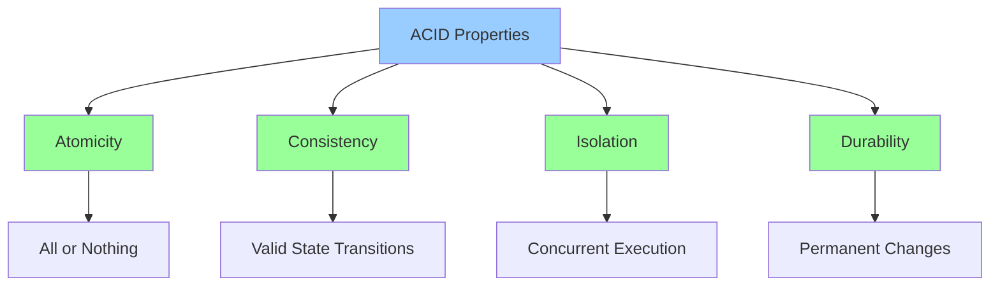
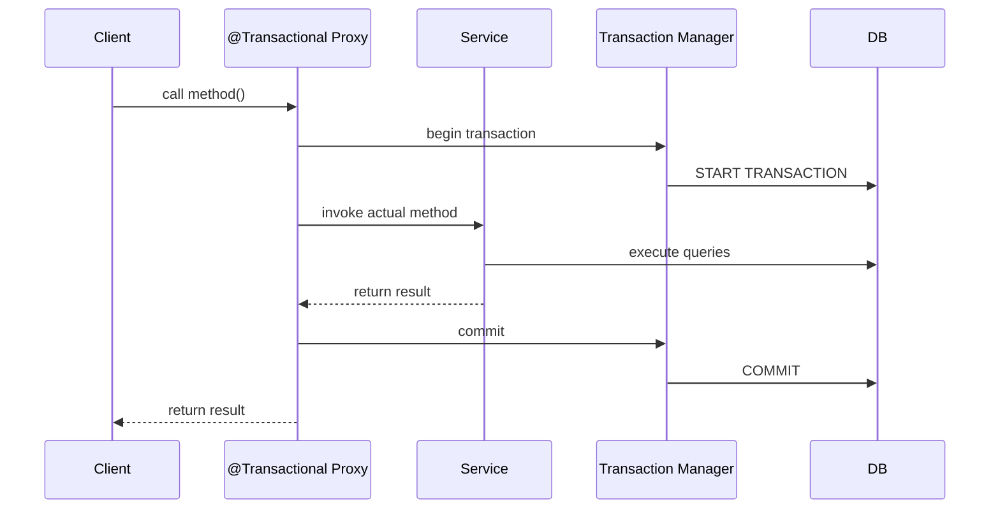
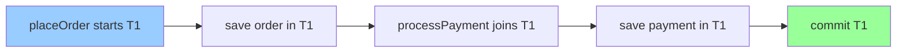
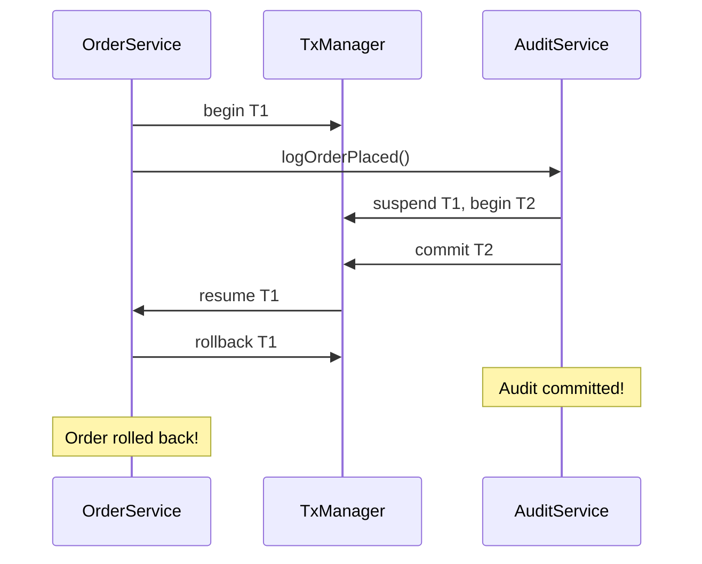
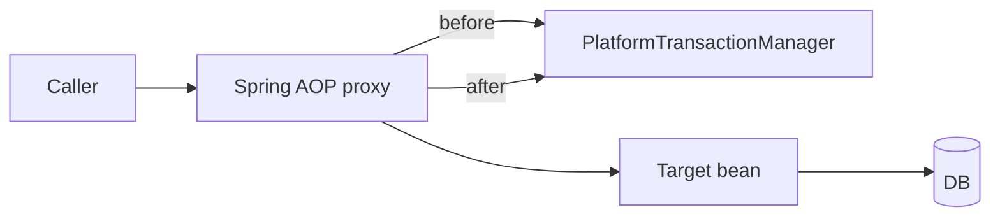
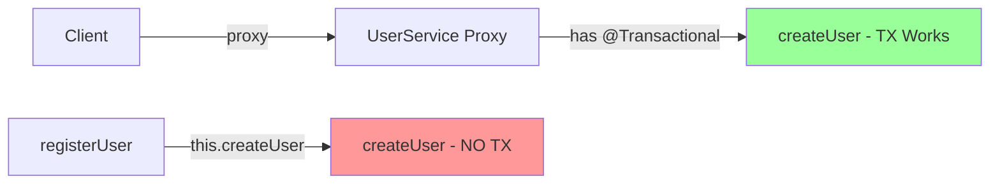

# Transactions and Propagation

## Overview

Spring's `@Transactional` annotation provides declarative transaction management using AOP proxies. Understanding propagation levels, isolation levels, rollback rules, and proxy limitations is essential for building correct, concurrent applications.

> [!summary] Goal
> Master transaction boundaries, propagation behavior, isolation levels, rollback strategies, and common pitfalls in Spring's proxy-based transaction management.

---

## Transaction Fundamentals

### ACID Properties



- **Atomicity**: All operations succeed or all fail (rollback on error)
- **Consistency**: Database moves from one valid state to another
- **Isolation**: Concurrent transactions don't interfere
- **Durability**: Committed changes persist (survive crashes)

### How Spring Transactions Work



**Key Points**:
- Spring uses **AOP proxies** to intercept method calls
- Proxy begins transaction **before** method execution
- Proxy commits/rolls back **after** method execution
- Works **only** when called through proxy (not self-invocation)

---

## @Transactional Basics

### Simple Example

```java
package com.example.demo.service;

import org.springframework.stereotype.Service;
import org.springframework.transaction.annotation.Transactional;

@Service
public class UserService {
    
    private final UserRepository userRepository;
    private final EmailService emailService;
    
    public UserService(UserRepository userRepository, EmailService emailService) {
        this.userRepository = userRepository;
        this.emailService = emailService;
    }
    
    /**
     * @Transactional:
     * - Starts transaction before method
     * - Commits on successful completion
     * - Rolls back on unchecked exceptions (RuntimeException, Error)
     * - Does NOT roll back on checked exceptions (unless configured)
     */
    @Transactional
    public User createUser(String email, String fullName) {
        // All operations in same transaction
        User user = new User(email, fullName);
        userRepository.save(user);
        
        emailService.sendWelcomeEmail(email);
        
        return user;  // Commit happens here
    }
    
    /**
     * Read-only transaction
     * - Hint to DB (may enable optimizations)
     * - Disables dirty checking (performance)
     * - Prevents accidental writes
     */
    @Transactional(readOnly = true)
    public User getUser(Long id) {
        return userRepository.findById(id)
            .orElseThrow(() -> new EntityNotFoundException("User not found"));
    }
}
```

### Default Behavior

| Aspect | Default Value | Notes |
|--------|---------------|-------|
| **Propagation** | REQUIRED | Join existing or create new |
| **Isolation** | DEFAULT | Use DB default (usually READ_COMMITTED) |
| **Timeout** | -1 (no timeout) | In seconds |
| **Read-only** | false | Writable transaction |
| **Rollback for** | RuntimeException, Error | Unchecked exceptions |
| **No rollback for** | Checked exceptions | Must configure explicitly |

---

## Propagation Levels

> [!tip] Quick Reference
> See [[SpringBoot/00_Cheat_Sheets#Transactions and Locking Cheat Sheet]] for propagation/isolation tables.

### Propagation Decision Flow (Mermaid)

```mermaid
flowchart TD
    A[Method invoked] --> B{Is there an existing TX?}
    B -->|No| C{Propagation?}
    B -->|Yes| D{Propagation?}

    C -->|REQUIRED| C1[Start new TX]
    C -->|REQUIRES_NEW| C2[Start new TX]
    C -->|SUPPORTS| C3[Run NON-TX]
    C -->|MANDATORY| C4[Throw exception]
    C -->|NOT_SUPPORTED| C5[Run NON-TX]
    C -->|NEVER| C6[Run NON-TX]
    C -->|NESTED| C7[Start new TX (or savepoint if supported)]

    D -->|REQUIRED| D1[Join existing TX]
    D -->|REQUIRES_NEW| D2[Suspend existing, start new TX]
    D -->|SUPPORTS| D3[Join existing TX]
    D -->|MANDATORY| D4[Join existing TX]
    D -->|NOT_SUPPORTED| D5[Suspend existing, run NON-TX]
    D -->|NEVER| D6[Throw exception]
    D -->|NESTED| D7[Create savepoint (or behave like REQUIRED)]
```

Propagation determines how transactions relate to each other when methods call other transactional methods.

### REQUIRED (Default)

**Behavior**: Join existing transaction, or create new if none exists.

```java
@Service
public class OrderService {
    
    @Autowired
    private PaymentService paymentService;
    
    @Transactional  // Propagation.REQUIRED (default)
    public void placeOrder(OrderRequest request) {
        // Transaction T1 starts here
        Order order = new Order(request);
        orderRepository.save(order);
        
        // Joins T1 (no new transaction)
        paymentService.processPayment(order.getId(), order.getTotal());
        
        // Both operations in same transaction
        // If payment fails, order is also rolled back
    }
}

@Service
public class PaymentService {
    
    @Transactional  // Propagation.REQUIRED
    public void processPayment(Long orderId, BigDecimal amount) {
        // Joins existing transaction from OrderService
        Payment payment = new Payment(orderId, amount);
        paymentRepository.save(payment);
        
        // If this throws exception, entire transaction rolls back
    }
}
```

**Diagram**:


### REQUIRES_NEW

**Behavior**: Always create new transaction, suspend existing if present.

```java
@Service
public class OrderService {
    
    @Autowired
    private AuditService auditService;
    
    @Transactional
    public void placeOrder(OrderRequest request) {
        // Transaction T1 starts
        Order order = new Order(request);
        orderRepository.save(order);
        
        // Creates NEW transaction T2, suspends T1
        auditService.logOrderPlaced(order.getId());
        
        // If order fails here, audit is STILL COMMITTED
        throw new RuntimeException("Order failed");
    }
}

@Service
public class AuditService {
    
    @Transactional(propagation = Propagation.REQUIRES_NEW)
    public void logOrderPlaced(Long orderId) {
        // New transaction T2 (independent of T1)
        AuditLog log = new AuditLog("ORDER_PLACED", orderId);
        auditRepository.save(log);
        
        // T2 commits here (even if T1 rolls back later)
    }
}
```

**Use Cases**:
- ✅ Auditing (always persist logs, even if business tx fails)
- ✅ Notifications (send email regardless of main tx outcome)
- ⚠️ **Warning**: Can lead to data inconsistency (use carefully)

**Diagram**:


### NESTED

**Behavior**: Create nested transaction (savepoint), rollback to savepoint on failure.

```java
@Service
public class OrderService {
    
    @Autowired
    private InventoryService inventoryService;
    
    @Transactional
    public void placeOrder(OrderRequest request) {
        // Transaction T1
        Order order = new Order(request);
        orderRepository.save(order);
        
        try {
            // Creates savepoint within T1
            inventoryService.reserveInventory(order.getItems());
        } catch (InsufficientInventoryException e) {
            // Rollback to savepoint (order save remains)
            // Can continue with partial order
        }
        
        // T1 commits (order persisted, inventory reservation rolled back)
    }
}

@Service
public class InventoryService {
    
    @Transactional(propagation = Propagation.NESTED)
    public void reserveInventory(List<OrderItem> items) {
        // Nested transaction (savepoint)
        for (OrderItem item : items) {
            Inventory inv = inventoryRepository.findByProductId(item.getProductId());
            if (inv.getQuantity() < item.getQuantity()) {
                throw new InsufficientInventoryException();
            }
            inv.setQuantity(inv.getQuantity() - item.getQuantity());
        }
        // If exception, rollback to savepoint
    }
}
```

**Note**: NESTED requires database support (PostgreSQL supports savepoints, MySQL requires specific engine).

### MANDATORY

**Behavior**: Requires existing transaction, throws exception if none.

```java
@Service
public class PaymentService {
    
    @Transactional(propagation = Propagation.MANDATORY)
    public void processPayment(Long orderId, BigDecimal amount) {
        // MUST be called within existing transaction
        // Throws IllegalTransactionStateException if no transaction
        
        Payment payment = new Payment(orderId, amount);
        paymentRepository.save(payment);
    }
}
```

**Use Case**: Enforce that method is only called within transaction context.

### SUPPORTS

**Behavior**: Join existing transaction if present, otherwise execute non-transactionally.

```java
@Service
public class ReportService {
    
    @Transactional(propagation = Propagation.SUPPORTS)
    public List<OrderReport> generateReport() {
        // If called within transaction, joins it
        // If called without transaction, executes without one
        
        return orderRepository.findRecentOrders();
    }
}
```

### NOT_SUPPORTED

**Behavior**: Execute non-transactionally, suspend existing transaction if present.

```java
@Service
public class CacheService {
    
    @Transactional(propagation = Propagation.NOT_SUPPORTED)
    public void refreshCache() {
        // Always executes outside transaction
        // Suspends transaction if one exists
        
        cache.clear();
        cache.loadFromDatabase();
    }
}
```

### NEVER

**Behavior**: Execute non-transactionally, throw exception if transaction exists.

```java
@Service
public class FileService {
    
    @Transactional(propagation = Propagation.NEVER)
    public void writeToFile(String data) {
        // Must NOT be in transaction
        // Throws IllegalTransactionStateException if transaction exists
        
        Files.writeString(Path.of("data.txt"), data);
    }
}
```

### Propagation Summary

| Propagation | Existing TX? | Behavior |
|-------------|--------------|----------|
| **REQUIRED** (default) | Yes | Join existing |
| | No | Create new |
| **REQUIRES_NEW** | Yes | Suspend existing, create new |
| | No | Create new |
| **NESTED** | Yes | Create savepoint |
| | No | Create new |
| **MANDATORY** | Yes | Join existing |
| | No | Throw exception |
| **SUPPORTS** | Yes | Join existing |
| | No | Execute without TX |
| **NOT_SUPPORTED** | Yes | Suspend existing |
| | No | Execute without TX |
| **NEVER** | Yes | Throw exception |
| | No | Execute without TX |

---

## Isolation Levels

Isolation controls how transaction changes are visible to other concurrent transactions.

### Isolation Levels Overview

| Level | Dirty Read | Non-Repeatable Read | Phantom Read | Performance |
|-------|------------|---------------------|--------------|-------------|
| **READ_UNCOMMITTED** | ✅ Possible | ✅ Possible | ✅ Possible | Highest |
| **READ_COMMITTED** | ❌ Prevented | ✅ Possible | ✅ Possible | High |
| **REPEATABLE_READ** | ❌ Prevented | ❌ Prevented | ✅ Possible | Medium |
| **SERIALIZABLE** | ❌ Prevented | ❌ Prevented | ❌ Prevented | Lowest |

### Anomalies Explained

**Dirty Read**: Reading uncommitted changes from another transaction.

```java
// Transaction 1
@Transactional(isolation = Isolation.READ_UNCOMMITTED)
public BigDecimal getBalance(Long accountId) {
    Account account = accountRepository.findById(accountId).get();
    return account.getBalance();  // May read uncommitted value!
}

// Transaction 2 (concurrent)
@Transactional
public void withdraw(Long accountId, BigDecimal amount) {
    Account account = accountRepository.findById(accountId).get();
    account.setBalance(account.getBalance().subtract(amount));
    // Not committed yet, but T1 may read this value
    
    // Later rolls back - T1 read invalid data!
    throw new RuntimeException("Withdrawal failed");
}
```

**Non-Repeatable Read**: Same query returns different results within transaction.

```java
@Transactional(isolation = Isolation.READ_COMMITTED)
public void demonstrateNonRepeatableRead(Long accountId) {
    // Read 1
    Account account1 = accountRepository.findById(accountId).get();
    BigDecimal balance1 = account1.getBalance();  // e.g., $100
    
    // Another transaction updates and commits
    // (concurrent transaction changes balance to $50)
    
    // Read 2 (same transaction)
    entityManager.clear();  // Force re-fetch
    Account account2 = accountRepository.findById(accountId).get();
    BigDecimal balance2 = account2.getBalance();  // $50 (different!)
    
    // balance1 != balance2 (non-repeatable read)
}
```

**Phantom Read**: New rows appear in range query within transaction.

```java
@Transactional(isolation = Isolation.REPEATABLE_READ)
public void demonstratePhantomRead() {
    // Query 1: Count accounts with balance > $1000
    long count1 = accountRepository.countByBalanceGreaterThan(new BigDecimal("1000"));
    // e.g., count1 = 5
    
    // Another transaction inserts new account with balance $2000
    // (concurrent transaction commits)
    
    // Query 2: Same query, same transaction
    long count2 = accountRepository.countByBalanceGreaterThan(new BigDecimal("1000"));
    // count2 = 6 (phantom row appeared!)
    
    // count1 != count2 (phantom read)
}
```

### Setting Isolation Level

```java
@Service
public class AccountService {
    
    /**
     * READ_COMMITTED (most common, PostgreSQL default)
     * - Prevents dirty reads
     * - Allows non-repeatable reads and phantom reads
     * - Good balance of consistency and performance
     */
    @Transactional(isolation = Isolation.READ_COMMITTED)
    public BigDecimal getBalance(Long accountId) {
        Account account = accountRepository.findById(accountId).get();
        return account.getBalance();
    }
    
    /**
     * REPEATABLE_READ (MySQL default)
     * - Prevents dirty reads and non-repeatable reads
     * - Allows phantom reads (in some DBs)
     * - Use when consistent reads within TX are critical
     */
    @Transactional(isolation = Isolation.REPEATABLE_READ)
    public TransferResult transfer(Long fromId, Long toId, BigDecimal amount) {
        Account from = accountRepository.findById(fromId).get();
        Account to = accountRepository.findById(toId).get();
        
        // Accounts won't change during transaction
        from.setBalance(from.getBalance().subtract(amount));
        to.setBalance(to.getBalance().add(amount));
        
        accountRepository.save(from);
        accountRepository.save(to);
        
        return new TransferResult(from.getBalance(), to.getBalance());
    }
    
    /**
     * SERIALIZABLE (strictest)
     * - Prevents all anomalies
     * - Transactions execute as if serial (one at a time)
     * - Significant performance impact
     * - Use for critical operations (e.g., financial reports)
     */
    @Transactional(isolation = Isolation.SERIALIZABLE)
    public FinancialReport generateReport() {
        // No concurrent modifications possible
        List<Account> accounts = accountRepository.findAll();
        BigDecimal total = accounts.stream()
            .map(Account::getBalance)
            .reduce(BigDecimal.ZERO, BigDecimal::add);
        
        return new FinancialReport(total, accounts.size());
    }
}
```

### Database Defaults

| Database | Default Isolation |
|----------|-------------------|
| PostgreSQL | READ_COMMITTED |
| MySQL (InnoDB) | REPEATABLE_READ |
| Oracle | READ_COMMITTED |
| SQL Server | READ_COMMITTED |

---

## Rollback Rules

### Default Rollback Behavior

```java
@Service
public class OrderService {
    
    /**
     * Default: Rollback on RuntimeException and Error
     * No rollback on checked exceptions
     */
    @Transactional
    public void placeOrder(OrderRequest request) throws OrderException {
        Order order = new Order(request);
        orderRepository.save(order);
        
        // Rolls back (RuntimeException)
        if (order.getTotal().compareTo(BigDecimal.ZERO) <= 0) {
            throw new IllegalArgumentException("Invalid order total");
        }
        
        // NO rollback (checked exception)
        if (!inventoryService.hasStock(order.getItems())) {
            throw new OrderException("Insufficient stock");  // Committed!
        }
    }
}
```

### Custom Rollback Rules

```java
@Service
public class PaymentService {
    
    /**
     * Rollback for specific exceptions
     */
    @Transactional(rollbackFor = {PaymentException.class, InsufficientFundsException.class})
    public void processPayment(Payment payment) throws PaymentException {
        paymentRepository.save(payment);
        
        if (!hasBalance(payment.getAccountId(), payment.getAmount())) {
            // Rolls back (explicitly configured)
            throw new InsufficientFundsException("Insufficient funds");
        }
    }
    
    /**
     * Don't rollback for specific exceptions
     */
    @Transactional(noRollbackFor = {TemporaryException.class})
    public void retryableOperation() {
        operationRepository.save(new Operation());
        
        if (externalServiceDown()) {
            // Does NOT rollback (operation saved)
            throw new TemporaryException("Service temporarily unavailable");
        }
    }
    
    /**
     * Rollback for all exceptions (including checked)
     */
    @Transactional(rollbackFor = Exception.class)
    public void strictOperation() throws Exception {
        // Any exception causes rollback
        criticalRepository.save(new CriticalData());
    }
}
```

### Programmatic Rollback

```java
@Service
public class OrderService {
    
    @Transactional
    public void placeOrderWithValidation(OrderRequest request) {
        Order order = new Order(request);
        orderRepository.save(order);
        
        // Custom validation
        ValidationResult result = validator.validate(order);
        if (!result.isValid()) {
            // Force rollback without throwing exception
            TransactionAspectSupport.currentTransactionStatus().setRollbackOnly();
            
            // Can still execute non-DB logic
            logger.warn("Order validation failed: " + result.getErrors());
            return;
        }
        
        // Continue processing
    }
}
```

---

## Timeout Configuration

```java
@Service
public class ReportService {
    
    /**
     * Transaction timeout (in seconds)
     * - Prevents long-running transactions
     * - Throws TransactionTimedOutException if exceeded
     * - Applies to entire transaction duration (not query time)
     */
    @Transactional(timeout = 30)  // 30 seconds
    public Report generateLargeReport() {
        // If total transaction exceeds 30s, rollback
        List<Data> data = dataRepository.findAll();
        return processData(data);
    }
    
    /**
     * Combine with read-only for long-running reports
     */
    @Transactional(readOnly = true, timeout = 60)
    public AnalyticsReport generateAnalytics() {
        return analyticsRepository.complexAggregation();
    }
}
```

---

## Common Pitfalls and Solutions

---

## Proxy Internals (JDK vs CGLIB)

Spring transactions are implemented via AOP proxies.



### JDK Dynamic Proxy

- Used when the bean implements at least one interface.
- Proxy is an object implementing the same interface(s), delegating to the target.
- Only interface methods are proxied.

### CGLIB Proxy

- Used when proxying a concrete class (no interface) or when forced.
- Proxy is a subclass of the target class.
- Cannot override `final` methods; `private` methods are never intercepted.

> [!warning] What agents often miss
> `@Transactional` is applied only when the call goes through the proxy. Calls like `this.someTxMethod()` are plain Java calls and bypass the proxy entirely.

### Pitfall 1: Self-Invocation (Proxy Bypass)

**Problem**: Calling @Transactional method from within same class bypasses proxy.

```java
@Service
public class UserService {
    
    @Autowired
    private UserRepository userRepository;
    
    // NOT @Transactional
    public void registerUser(String email, String name) {
        // Calls createUser() directly (NOT through proxy)
        // createUser's @Transactional is IGNORED!
        createUser(email, name);
    }
    
    @Transactional
    public void createUser(String email, String name) {
        // NO transaction here when called from registerUser()
        User user = new User(email, name);
        userRepository.save(user);
    }
}
```

**Why**: `this.createUser()` is direct method call, not proxy call.



**Solutions**:

```java
// Solution 1: Move to separate service (BEST)
@Service
public class UserRegistrationService {
    @Autowired
    private UserService userService;
    
    public void registerUser(String email, String name) {
        // Calls through proxy - transaction works!
        userService.createUser(email, name);
    }
}

@Service
public class UserService {
    @Transactional
    public void createUser(String email, String name) {
        User user = new User(email, name);
        userRepository.save(user);
    }
}

// Solution 2: Self-inject (HACKY)
@Service
public class UserService {
    
    @Autowired
    private UserService self;  // Injects proxy
    
    public void registerUser(String email, String name) {
        self.createUser(email, name);  // Goes through proxy
    }
    
    @Transactional
    public void createUser(String email, String name) {
        User user = new User(email, name);
        userRepository.save(user);
    }
}

// Solution 3: Make both methods transactional
@Service
public class UserService {
    
    @Transactional
    public void registerUser(String email, String name) {
        // Transaction starts here
        createUser(email, name);  // Joins existing transaction
    }
    
    @Transactional  // REQUIRED propagation joins existing
    public void createUser(String email, String name) {
        User user = new User(email, name);
        userRepository.save(user);
    }
}
```

### Pitfall 2: Transaction on Private Method

**Problem**: @Transactional on private methods is ignored.

```java
@Service
public class UserService {
    
    public void registerUser(String email, String name) {
        createUser(email, name);
    }
    
    @Transactional  // ❌ IGNORED (private method)
    private void createUser(String email, String name) {
        User user = new User(email, name);
        userRepository.save(user);
    }
}
```

**Why**: Spring AOP proxies can't intercept private methods (proxy extends class or implements interface).

**Solution**: Make method public or protected.

```java
@Transactional
public void createUser(String email, String name) {
    User user = new User(email, name);
    userRepository.save(user);
}
```

### Pitfall 3: Catching Exception Without Rethrowing

**Problem**: Transaction commits despite exception.

```java
@Service
public class OrderService {
    
    @Transactional
    public void placeOrder(OrderRequest request) {
        try {
            Order order = new Order(request);
            orderRepository.save(order);
            
            // Throws exception
            paymentService.processPayment(order.getId(), order.getTotal());
            
        } catch (PaymentException e) {
            // ❌ Swallows exception - transaction COMMITS!
            logger.error("Payment failed", e);
        }
    }
}
```

**Solution**: Rethrow or mark rollback.

```java
@Transactional
public void placeOrder(OrderRequest request) {
    try {
        Order order = new Order(request);
        orderRepository.save(order);
        
        paymentService.processPayment(order.getId(), order.getTotal());
        
    } catch (PaymentException e) {
        // Solution 1: Rethrow
        throw new OrderException("Order failed", e);
        
        // Solution 2: Mark rollback
        TransactionAspectSupport.currentTransactionStatus().setRollbackOnly();
        logger.error("Payment failed", e);
    }
}
```

### Pitfall 4: Long-Running Transactions

**Problem**: Holding transaction too long, blocking concurrent access.

```java
@Service
public class OrderService {
    
    @Transactional  // ❌ Transaction includes slow external call
    public void placeOrder(OrderRequest request) {
        Order order = new Order(request);
        orderRepository.save(order);
        
        // Slow external API call (3 seconds)
        // Transaction held for entire duration!
        emailService.sendConfirmationEmail(order);
        
        // DB locks held for 3+ seconds
    }
}
```

**Solution**: Minimize transaction scope.

```java
@Service
public class OrderService {
    
    @Autowired
    private OrderRepository orderRepository;
    @Autowired
    private EmailService emailService;
    
    public void placeOrder(OrderRequest request) {
        Order order;
        
        // Narrow transaction scope
        order = createOrderTransactional(request);
        
        // External call OUTSIDE transaction
        emailService.sendConfirmationEmail(order);
    }
    
    @Transactional
    private Order createOrderTransactional(OrderRequest request) {
        Order order = new Order(request);
        return orderRepository.save(order);
    }
}
```

### Pitfall 5: REQUIRES_NEW Overuse

**Problem**: Creating too many independent transactions.

```java
@Service
public class OrderService {
    
    @Autowired
    private InventoryService inventoryService;
    @Autowired
    private PaymentService paymentService;
    
    @Transactional
    public void placeOrder(OrderRequest request) {
        Order order = new Order(request);
        orderRepository.save(order);
        
        // Both use REQUIRES_NEW
        inventoryService.reserveInventory(order);  // Commits independently
        paymentService.processPayment(order);      // Commits independently
        
        // If this fails, inventory and payment are ALREADY COMMITTED
        // Data inconsistency!
        throw new RuntimeException("Order processing failed");
    }
}
```

**Solution**: Use REQUIRED (default) for operations that should be atomic.

```java
@Transactional
public void placeOrder(OrderRequest request) {
    Order order = new Order(request);
    orderRepository.save(order);
    
    // Both join same transaction
    inventoryService.reserveInventory(order);  // REQUIRED
    paymentService.processPayment(order);      // REQUIRED
    
    // If this fails, ALL roll back together
}
```

---

## Advanced Patterns

### Saga Pattern (Long-Running Transactions)

For distributed transactions across services, use compensating transactions.

```java
@Service
public class OrderSagaService {
    
    @Autowired
    private OrderService orderService;
    @Autowired
    private InventoryService inventoryService;
    @Autowired
    private PaymentService paymentService;
    
    public void placeOrderSaga(OrderRequest request) {
        Long orderId = null;
        Long reservationId = null;
        Long paymentId = null;
        
        try {
            // Step 1: Create order
            orderId = orderService.createOrder(request);
            
            // Step 2: Reserve inventory
            reservationId = inventoryService.reserveInventory(request.getItems());
            
            // Step 3: Process payment
            paymentId = paymentService.processPayment(request.getPaymentInfo());
            
            // Success
            orderService.confirmOrder(orderId);
            
        } catch (Exception e) {
            // Compensate (undo committed changes)
            if (paymentId != null) {
                paymentService.refund(paymentId);
            }
            if (reservationId != null) {
                inventoryService.releaseReservation(reservationId);
            }
            if (orderId != null) {
                orderService.cancelOrder(orderId);
            }
            
            throw new OrderException("Order failed, compensated", e);
        }
    }
}
```

### Optimistic Locking with Retry

```java
@Service
public class AccountService {
    
    @Transactional
    public void withdraw(Long accountId, BigDecimal amount) {
        int maxRetries = 3;
        int attempt = 0;
        
        while (attempt < maxRetries) {
            try {
                Account account = accountRepository.findById(accountId)
                    .orElseThrow(() -> new EntityNotFoundException());
                
                if (account.getBalance().compareTo(amount) < 0) {
                    throw new InsufficientFundsException();
                }
                
                account.setBalance(account.getBalance().subtract(amount));
                accountRepository.save(account);
                
                return;  // Success
                
            } catch (OptimisticLockException e) {
                attempt++;
                if (attempt >= maxRetries) {
                    throw new RuntimeException("Failed after " + maxRetries + " retries", e);
                }
                // Retry with fresh entity
            }
        }
    }
}
```

### Read-Write Transaction Splitting

```java
@Service
public class ProductService {
    
    @Autowired
    private ProductRepository productRepository;
    
    /**
     * Read-only transaction (optimized)
     */
    @Transactional(readOnly = true)
    public List<ProductDto> searchProducts(String keyword) {
        return productRepository.findByNameContaining(keyword)
            .stream()
            .map(this::toDto)
            .toList();
    }
    
    /**
     * Write transaction
     */
    @Transactional
    public Product updateProduct(Long id, ProductUpdateDto dto) {
        Product product = productRepository.findById(id)
            .orElseThrow(() -> new EntityNotFoundException());
        
        product.setName(dto.getName());
        product.setPrice(dto.getPrice());
        
        return product;
    }
}
```

---

## Production Best Practices

### 1. Transaction Boundaries

```java
// ❌ BAD: Transaction too broad
@Transactional
public OrderResult processOrder(OrderRequest request) {
    Order order = createOrder(request);           // DB write
    emailService.sendConfirmation(order);         // Slow external call
    smsService.sendNotification(order);           // Slow external call
    analyticsService.trackOrder(order);           // External call
    return new OrderResult(order);
}

// ✅ GOOD: Narrow transaction scope
public OrderResult processOrder(OrderRequest request) {
    Order order = createOrderTransactional(request);  // Fast DB write
    
    // External calls OUTSIDE transaction
    emailService.sendConfirmation(order);
    smsService.sendNotification(order);
    analyticsService.trackOrder(order);
    
    return new OrderResult(order);
}

@Transactional
private Order createOrderTransactional(OrderRequest request) {
    Order order = new Order(request);
    return orderRepository.save(order);
}
```

### 2. Isolation Level Selection

```java
@Service
public class AccountService {
    
    // Read operations: READ_COMMITTED (default)
    @Transactional(readOnly = true)
    public BigDecimal getBalance(Long accountId) {
        Account account = accountRepository.findById(accountId).get();
        return account.getBalance();
    }
    
    // Write operations with reads: REPEATABLE_READ
    @Transactional(isolation = Isolation.REPEATABLE_READ)
    public void transfer(Long fromId, Long toId, BigDecimal amount) {
        Account from = accountRepository.findById(fromId).get();
        Account to = accountRepository.findById(toId).get();
        
        // Balances won't change during transaction
        from.setBalance(from.getBalance().subtract(amount));
        to.setBalance(to.getBalance().add(amount));
        
        accountRepository.save(from);
        accountRepository.save(to);
    }
    
    // Critical reports: SERIALIZABLE
    @Transactional(
        isolation = Isolation.SERIALIZABLE,
        readOnly = true,
        timeout = 60
    )
    public BalanceReport generateBalanceReport() {
        List<Account> accounts = accountRepository.findAll();
        BigDecimal total = accounts.stream()
            .map(Account::getBalance)
            .reduce(BigDecimal.ZERO, BigDecimal::add);
        
        return new BalanceReport(total, LocalDateTime.now());
    }
}
```

### 3. Timeout Configuration

```yaml
# application.yml
spring:
  transaction:
    default-timeout: 30  # Global default (seconds)
    
  jpa:
    properties:
      javax:
        persistence:
          query:
            timeout: 10000  # Query timeout (ms)
```

```java
@Transactional(timeout = 5)  // Override per method
public void quickOperation() {
    // Must complete within 5 seconds
}
```

### 4. Monitoring Transactions

```java
import org.springframework.transaction.support.TransactionSynchronizationManager;

@Service
public class OrderService {
    
    @Transactional
    public void placeOrder(OrderRequest request) {
        // Check transaction status
        boolean inTransaction = TransactionSynchronizationManager.isActualTransactionActive();
        String txName = TransactionSynchronizationManager.getCurrentTransactionName();
        boolean readOnly = TransactionSynchronizationManager.isCurrentTransactionReadOnly();
        
        logger.info("Transaction: {}, readOnly: {}", txName, readOnly);
        
        // Business logic
        Order order = new Order(request);
        orderRepository.save(order);
    }
}
```

---

## Related Notes

- [[01_Spring_Data_JPA_Essentials]] - Entity management and persistence context
- [[03_Flyway_Migrations]] - Database migrations
- [[02_AOP_Proxies_and_Internals]] - How Spring implements @Transactional
- [[SQL/02_Core/02_Transactions_and_Locking]] - Database-level transactions
- [[SQL/02_Core/03_Isolation_Levels_and_Anomalies]] - Isolation details

---

> [!question]- Interview Questions
> 
> **Q: How does Spring's @Transactional work internally?**
> A: Spring uses AOP proxies to intercept method calls. When you call a `@Transactional` method, the proxy: 1) Begins transaction (gets connection from pool), 2) Invokes actual method, 3) Commits on success or rolls back on exception, 4) Returns connection to pool. This only works when called through the proxy (not self-invocation).
> 
> **Q: What's the difference between REQUIRED and REQUIRES_NEW propagation?**
> A: REQUIRED (default) joins existing transaction or creates new if none exists. All operations commit/rollback together. REQUIRES_NEW always creates new transaction, suspending existing one. New transaction commits independently, even if outer transaction rolls back. Use REQUIRES_NEW carefully (e.g., audit logs), as it can cause data inconsistency.
> 
> **Q: Why doesn't @Transactional work on private methods?**
> A: Spring AOP creates proxies by subclassing (CGLIB) or implementing interfaces (JDK proxy). Both can't intercept private methods. Private methods are called directly via `this`, bypassing the proxy. Solution: make method public/protected or move to separate service.
> 
> **Q: What isolation level should I use for money transfers?**
> A: REPEATABLE_READ or SERIALIZABLE. READ_COMMITTED allows non-repeatable reads (account balances could change mid-transaction). REPEATABLE_READ ensures consistent reads. For critical operations, SERIALIZABLE prevents all anomalies but has performance cost. Always use pessimistic locking (SELECT FOR UPDATE) or optimistic locking (@Version) for concurrent updates.
> 
> **Q: What happens if I catch an exception in a @Transactional method?**
> A: By default, Spring only rolls back on unchecked exceptions (RuntimeException, Error). If you catch and swallow an exception, transaction commits! Solutions: 1) Rethrow exception, 2) Use `setRollbackOnly()`, 3) Configure `rollbackFor` to include checked exceptions.
> 
> **Q: Explain the self-invocation problem.**
> A: When a method calls another `@Transactional` method in the same class using `this.method()`, it bypasses the proxy. The target method's `@Transactional` is ignored. Example: `this.createUser()` (no TX) vs `userService.createUser()` (TX works). Solutions: 1) Move to separate service (best), 2) Self-inject proxy, 3) Make caller also `@Transactional`.
> 
> **Q: When would you use PROPAGATION.NEVER?**
> A: When a method must NOT run in a transaction (e.g., file I/O, external API calls that shouldn't be tied to DB transaction). Throws exception if called within transaction. Enforces architectural constraint that operation is separate from transactional context.
> 
> **Q: What's the difference between isolation levels and propagation?**
> A: Propagation determines how transactions relate to each other when methods call methods (join existing, create new, etc.). Isolation determines how concurrent transactions interact with each other (what they can read/write). Propagation is about transaction boundaries, isolation is about concurrent access anomalies.
