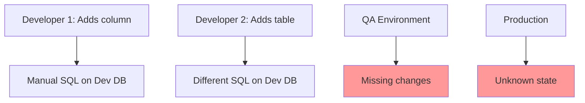
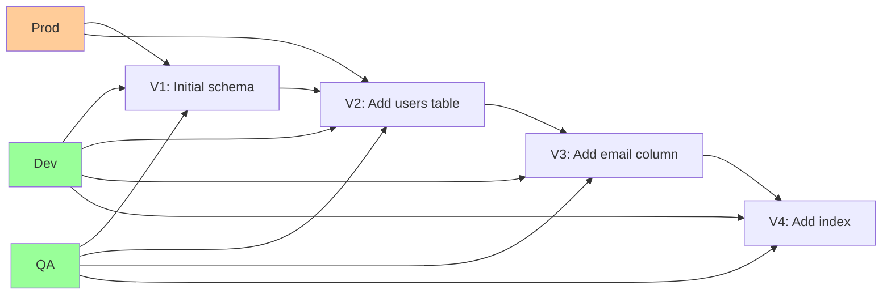
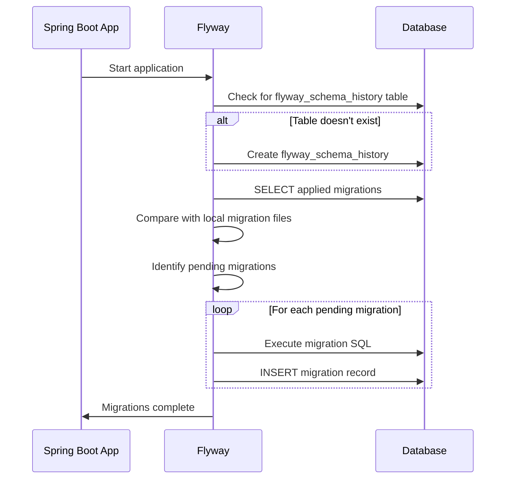

# Flyway Migrations

> [!tip] Quick Reference
> See [[SpringBoot/00_Cheat_Sheets]] for Flyway commands/properties and migration gotchas.

## Overview

Flyway is a database migration tool that versions your database schema like Git versions code. It enables reproducible deployments, rollback capabilities, and safe schema evolution across environments.

> [!summary] Goal
> Master database migrations with Flyway: versioning strategies, migration patterns, rollback handling, production deployment practices, and common pitfalls.

---

## Why Database Migrations?

### The Problem Without Migrations



**Issues**:
- ❌ No version control for schema
- ❌ Manual steps (error-prone)
- ❌ Environments out of sync
- ❌ No rollback strategy
- ❌ Can't reproduce schema state

### The Solution: Version-Controlled Migrations



**Benefits**:
- ✅ Schema versioned like code
- ✅ Automated, repeatable
- ✅ Environments in sync
- ✅ Audit trail (who, when, what)
- ✅ Rollback possible

---

## Flyway Basics

### How Flyway Works

1. **Migration Files**: SQL/Java files with version numbers
2. **Schema History Table**: Tracks applied migrations (`flyway_schema_history`)
3. **Checksum Validation**: Ensures migrations haven't changed
4. **Sequential Execution**: Runs pending migrations in order



### Schema History Table

```sql
-- flyway_schema_history table structure
CREATE TABLE flyway_schema_history (
    installed_rank INT NOT NULL,
    version VARCHAR(50),
    description VARCHAR(200) NOT NULL,
    type VARCHAR(20) NOT NULL,
    script VARCHAR(1000) NOT NULL,
    checksum INT,
    installed_by VARCHAR(100) NOT NULL,
    installed_on TIMESTAMP NOT NULL,
    execution_time INT NOT NULL,
    success BOOLEAN NOT NULL,
    PRIMARY KEY (installed_rank)
);
```

**Example data**:

| installed_rank | version | description      | script                 | checksum   | installed_on        |
| -------------- | ------- | ---------------- | ---------------------- | ---------- | ------------------- |
| 1              | 1       | initial schema   | V1__initial_schema.sql | 1234567890 | 2026-01-01 10:00:00 |
| 2              | 2       | add users table  | V2__add_users.sql      | 9876543210 | 2026-01-15 14:30:00 |
| 3              | 3       | add email column | V3__add_email.sql      | 1122334455 | 2026-02-01 09:15:00 |


---

## Setup and Configuration

### Maven Dependency

```xml
<dependencies>
    <!-- Spring Boot Starter Data JPA -->
    <dependency>
        <groupId>org.springframework.boot</groupId>
        <artifactId>spring-boot-starter-data-jpa</artifactId>
    </dependency>
    
    <!-- Database driver -->
    <dependency>
        <groupId>org.postgresql</groupId>
        <artifactId>postgresql</artifactId>
        <scope>runtime</scope>
    </dependency>
    
    <!-- Flyway -->
    <dependency>
        <groupId>org.flywaydb</groupId>
        <artifactId>flyway-core</artifactId>
    </dependency>
    
    <!-- Flyway PostgreSQL support (Flyway 9+) -->
    <dependency>
        <groupId>org.flywaydb</groupId>
        <artifactId>flyway-database-postgresql</artifactId>
    </dependency>
</dependencies>
```

### Gradle Dependency

```groovy
dependencies {
    implementation 'org.springframework.boot:spring-boot-starter-data-jpa'
    runtimeOnly 'org.postgresql:postgresql'
    implementation 'org.flywaydb:flyway-core'
    implementation 'org.flywaydb:flyway-database-postgresql'
}
```

### Spring Boot Configuration

```yaml
# application.yml
spring:
  datasource:
    url: jdbc:postgresql://localhost:5432/mydb
    username: dbuser
    password: dbpass
    
  jpa:
    hibernate:
      # IMPORTANT: Set to 'validate' with Flyway
      # Don't let Hibernate manage schema (Flyway does it)
      ddl-auto: validate
    show-sql: false
    
  flyway:
    # Enable Flyway (default: true)
    enabled: true
    
    # Migration scripts location (default)
    locations: classpath:db/migration
    
    # Baseline version (for existing databases)
    baseline-on-migrate: false
    baseline-version: 1
    
    # Validate migrations on startup
    validate-on-migrate: true
    
    # Clean database (DANGER: only for dev)
    clean-disabled: true
    clean-on-validation-error: false
    
    # Schema to manage
    schemas: public
    
    # Placeholder replacement
    placeholder-replacement: true
    placeholders:
      tablespace: myTablespace
```

### Directory Structure

```
src/
└── main/
    └── resources/
        └── db/
            └── migration/
                ├── V1__initial_schema.sql
                ├── V2__add_users_table.sql
                ├── V3__add_email_column.sql
                ├── V4__add_indexes.sql
                └── V5__add_orders_table.sql
```

---

## Migration Naming Convention

### Versioned Migrations

**Pattern**: `V{version}__{description}.sql`

```
V1__initial_schema.sql
V2__add_users_table.sql
V2.1__add_email_index.sql
V3__create_orders_table.sql
V10__major_refactor.sql
V20230115143000__add_audit_columns.sql  # Timestamp version
```

**Rules**:
- **V**: Uppercase V prefix (required)
- **Version**: Number (1, 2, 2.1, 3) or timestamp
- **__**: Double underscore separator (required)
- **Description**: Underscores replace spaces
- **.sql**: File extension

### Repeatable Migrations

**Pattern**: `R__{description}.sql`

```
R__create_views.sql
R__update_functions.sql
R__refresh_materialized_views.sql
```

**Behavior**:
- Run **every time** checksum changes
- Executed **after** all versioned migrations
- Useful for views, functions, procedures

### Undo Migrations (Enterprise Feature)

**Pattern**: `U{version}__{description}.sql`

```
U2__undo_add_users_table.sql
U3__undo_add_email_column.sql
```

**Note**: Requires Flyway Teams/Enterprise edition.

---

## Writing Migrations

### Migration 1: Initial Schema

```sql
-- V1__initial_schema.sql
-- Create initial database schema

-- Enable UUID extension (PostgreSQL)
CREATE EXTENSION IF NOT EXISTS "uuid-ossp";

-- Users table
CREATE TABLE users (
    id BIGSERIAL PRIMARY KEY,
    email VARCHAR(255) NOT NULL UNIQUE,
    full_name VARCHAR(255) NOT NULL,
    created_at TIMESTAMP NOT NULL DEFAULT CURRENT_TIMESTAMP,
    updated_at TIMESTAMP NOT NULL DEFAULT CURRENT_TIMESTAMP,
    version BIGINT NOT NULL DEFAULT 0
);

-- Create index on email
CREATE INDEX idx_users_email ON users(email);

-- Create index on created_at for sorting
CREATE INDEX idx_users_created_at ON users(created_at);

-- Comments (documentation)
COMMENT ON TABLE users IS 'Application users';
COMMENT ON COLUMN users.email IS 'Unique email address';
COMMENT ON COLUMN users.version IS 'Optimistic locking version';
```

### Migration 2: Add New Table

```sql
-- V2__add_orders_table.sql
-- Add orders table with foreign key to users

CREATE TABLE orders (
    id BIGSERIAL PRIMARY KEY,
    user_id BIGINT NOT NULL,
    total_amount DECIMAL(10, 2) NOT NULL,
    status VARCHAR(50) NOT NULL DEFAULT 'PENDING',
    created_at TIMESTAMP NOT NULL DEFAULT CURRENT_TIMESTAMP,
    updated_at TIMESTAMP NOT NULL DEFAULT CURRENT_TIMESTAMP,
    version BIGINT NOT NULL DEFAULT 0,
    
    -- Foreign key constraint
    CONSTRAINT fk_orders_user
        FOREIGN KEY (user_id)
        REFERENCES users(id)
        ON DELETE CASCADE,
    
    -- Check constraint
    CONSTRAINT chk_orders_total_positive
        CHECK (total_amount > 0)
);

-- Indexes
CREATE INDEX idx_orders_user_id ON orders(user_id);
CREATE INDEX idx_orders_status ON orders(status);
CREATE INDEX idx_orders_created_at ON orders(created_at DESC);

-- Composite index for common queries
CREATE INDEX idx_orders_user_status ON orders(user_id, status);
```

### Migration 3: Add Column

```sql
-- V3__add_phone_number_to_users.sql
-- Add phone number column to users table

ALTER TABLE users
ADD COLUMN phone_number VARCHAR(20);

-- Add index if needed
CREATE INDEX idx_users_phone_number ON users(phone_number)
WHERE phone_number IS NOT NULL;  -- Partial index (PostgreSQL)

-- Update existing rows (optional)
-- UPDATE users SET phone_number = '' WHERE phone_number IS NULL;

COMMENT ON COLUMN users.phone_number IS 'Optional phone number';
```

### Migration 4: Modify Column (Safe Pattern)

```sql
-- V4__make_email_case_insensitive.sql
-- Make email column case-insensitive

-- Step 1: Create new column
ALTER TABLE users
ADD COLUMN email_lower VARCHAR(255);

-- Step 2: Populate new column
UPDATE users
SET email_lower = LOWER(email);

-- Step 3: Add NOT NULL constraint
ALTER TABLE users
ALTER COLUMN email_lower SET NOT NULL;

-- Step 4: Add unique constraint
ALTER TABLE users
ADD CONSTRAINT users_email_lower_unique UNIQUE (email_lower);

-- Step 5: Create index
CREATE INDEX idx_users_email_lower ON users(email_lower);

-- Step 6: Drop old column (in future migration after app updated)
-- ALTER TABLE users DROP COLUMN email;
-- ALTER TABLE users RENAME COLUMN email_lower TO email;
```

### Migration 5: Add Enum Type (PostgreSQL)

```sql
-- V5__add_order_status_enum.sql
-- Add enum type for order status

-- Create enum type
CREATE TYPE order_status AS ENUM (
    'PENDING',
    'CONFIRMED',
    'SHIPPED',
    'DELIVERED',
    'CANCELLED'
);

-- Add new column with enum type
ALTER TABLE orders
ADD COLUMN status_enum order_status;

-- Migrate existing data
UPDATE orders
SET status_enum = status::order_status;

-- Make new column NOT NULL
ALTER TABLE orders
ALTER COLUMN status_enum SET NOT NULL;

-- Drop old column (after app updated)
-- ALTER TABLE orders DROP COLUMN status;
-- ALTER TABLE orders RENAME COLUMN status_enum TO status;
```

### Migration 6: Add Audit Columns

```sql
-- V6__add_audit_columns.sql
-- Add created_by and updated_by tracking

ALTER TABLE users
ADD COLUMN created_by VARCHAR(100),
ADD COLUMN updated_by VARCHAR(100);

ALTER TABLE orders
ADD COLUMN created_by VARCHAR(100),
ADD COLUMN updated_by VARCHAR(100);

-- Set default for existing rows
UPDATE users
SET created_by = 'system', updated_by = 'system'
WHERE created_by IS NULL;

UPDATE orders
SET created_by = 'system', updated_by = 'system'
WHERE created_by IS NULL;

-- Add NOT NULL constraint
ALTER TABLE users
ALTER COLUMN created_by SET NOT NULL,
ALTER COLUMN updated_by SET NOT NULL;

ALTER TABLE orders
ALTER COLUMN created_by SET NOT NULL,
ALTER COLUMN updated_by SET NOT NULL;
```

### Migration 7: Data Migration

```sql
-- V7__migrate_user_preferences.sql
-- Migrate user preferences from JSON column to separate table

-- Create preferences table
CREATE TABLE user_preferences (
    id BIGSERIAL PRIMARY KEY,
    user_id BIGINT NOT NULL,
    preference_key VARCHAR(100) NOT NULL,
    preference_value TEXT NOT NULL,
    created_at TIMESTAMP NOT NULL DEFAULT CURRENT_TIMESTAMP,
    
    CONSTRAINT fk_user_preferences_user
        FOREIGN KEY (user_id)
        REFERENCES users(id)
        ON DELETE CASCADE,
    
    CONSTRAINT user_preferences_unique
        UNIQUE (user_id, preference_key)
);

-- Migrate data (example: extract from JSON)
-- INSERT INTO user_preferences (user_id, preference_key, preference_value)
-- SELECT 
--     id as user_id,
--     'theme',
--     preferences->>'theme'
-- FROM users
-- WHERE preferences IS NOT NULL
--   AND preferences->>'theme' IS NOT NULL;

CREATE INDEX idx_user_preferences_user_id ON user_preferences(user_id);
```

### Repeatable Migration: Views

```sql
-- R__create_user_order_summary_view.sql
-- Repeatable migration for views (re-run when changed)

-- Drop view if exists
DROP VIEW IF EXISTS user_order_summary;

-- Create view
CREATE VIEW user_order_summary AS
SELECT 
    u.id as user_id,
    u.email,
    u.full_name,
    COUNT(o.id) as total_orders,
    COALESCE(SUM(o.total_amount), 0) as total_spent,
    MAX(o.created_at) as last_order_date
FROM users u
LEFT JOIN orders o ON u.id = o.user_id
GROUP BY u.id, u.email, u.full_name;

COMMENT ON VIEW user_order_summary IS 'Summary of user orders';
```

---

## Advanced Patterns

### Expand/Contract Pattern (Zero-Downtime Migrations)

**Problem**: Changing a column requires downtime if done atomically.

**Solution**: Multi-phase migration.

**Phase 1: Expand** (V10__expand_add_new_column.sql)
```sql
-- Add new column without removing old one
ALTER TABLE users
ADD COLUMN full_name_new VARCHAR(500);

-- Backfill data
UPDATE users
SET full_name_new = full_name
WHERE full_name_new IS NULL;

-- Add index
CREATE INDEX idx_users_full_name_new ON users(full_name_new);
```

**App Deployment**: Update app to write to BOTH columns.

**Phase 2: Contract** (V11__contract_remove_old_column.sql)
```sql
-- App now only reads from full_name_new
-- Safe to remove old column

ALTER TABLE users
DROP COLUMN full_name;

ALTER TABLE users
RENAME COLUMN full_name_new TO full_name;

-- Add NOT NULL constraint if needed
ALTER TABLE users
ALTER COLUMN full_name SET NOT NULL;
```

### Handling Large Data Migrations

```sql
-- V12__backfill_email_verification.sql
-- Backfill email_verified flag in batches

-- Add column (fast)
ALTER TABLE users
ADD COLUMN email_verified BOOLEAN DEFAULT FALSE;

-- Backfill in batches (avoid long locks)
DO $$
DECLARE
    batch_size INTEGER := 1000;
    rows_updated INTEGER;
BEGIN
    LOOP
        -- Update batch
        UPDATE users
        SET email_verified = TRUE
        WHERE id IN (
            SELECT id
            FROM users
            WHERE email_verified = FALSE
              AND email IS NOT NULL
            LIMIT batch_size
        );
        
        GET DIAGNOSTICS rows_updated = ROW_COUNT;
        
        -- Exit when no more rows
        EXIT WHEN rows_updated = 0;
        
        -- Commit batch (in transaction)
        COMMIT;
        
        -- Small delay to reduce load
        PERFORM pg_sleep(0.1);
    END LOOP;
END $$;

-- Add NOT NULL constraint
ALTER TABLE users
ALTER COLUMN email_verified SET NOT NULL;
```

### Adding Indexes (Low Locking)

```sql
-- V13__add_index_concurrently.sql
-- Add index without locking table (PostgreSQL)

-- CREATE INDEX normally acquires ShareLock (blocks writes)
-- CREATE INDEX CONCURRENTLY allows writes (slower, but no downtime)

CREATE INDEX CONCURRENTLY idx_orders_user_created 
ON orders(user_id, created_at DESC);

-- Note: CONCURRENTLY can fail; check if index exists before proceeding
```

### Baseline Existing Database

For databases that already exist (not created by Flyway):

```yaml
spring:
  flyway:
    baseline-on-migrate: true
    baseline-version: 0
```

```sql
-- V1__baseline.sql (empty or minimal)
-- Baseline migration for existing database
SELECT 1;
```

Then add new migrations:
```sql
-- V2__add_new_feature.sql
-- First real migration after baseline
```

---

## Production Practices

### 1. Immutable Migrations

**Rule**: Never modify applied migrations.

```bash
# ❌ BAD: Editing V1__initial_schema.sql after deployment
# Flyway detects checksum change and fails

# ✅ GOOD: Create new migration
V10__fix_users_table.sql
```

**Why**: Flyway validates checksums. Modifying migrations breaks validation and causes deployment failures.

### 2. Test Migrations Locally

```bash
# Clean database (dev only!)
./mvnw flyway:clean

# Run migrations
./mvnw flyway:migrate

# Check status
./mvnw flyway:info
```

### 3. Separate Migration Scripts from Application

```yaml
# Option 1: Separate Flyway execution (recommended for prod)
# Don't run migrations on app startup

spring:
  flyway:
    enabled: false  # Disable auto-migration in prod
```

```bash
# Run migrations separately via CI/CD
flyway migrate -url=jdbc:postgresql://prod-db:5432/mydb \
               -user=flyway_user \
               -password=$DB_PASSWORD
```

**Why**: 
- ✅ Separate concerns (migration vs app startup)
- ✅ Faster rollbacks (don't need to restart app)
- ✅ Better control over timing
- ✅ Separate database permissions

### 4. Database User Permissions

```sql
-- Create separate Flyway user with DDL permissions
CREATE USER flyway_user WITH PASSWORD 'secure_password';
GRANT ALL PRIVILEGES ON DATABASE mydb TO flyway_user;
GRANT ALL PRIVILEGES ON SCHEMA public TO flyway_user;

-- App user with limited permissions (DML only)
CREATE USER app_user WITH PASSWORD 'secure_password';
GRANT SELECT, INSERT, UPDATE, DELETE ON ALL TABLES IN SCHEMA public TO app_user;
GRANT USAGE, SELECT ON ALL SEQUENCES IN SCHEMA public TO app_user;
```

### 5. Rollback Strategy

**Option 1: Undo Migrations** (Flyway Teams/Enterprise)
```sql
-- U3__undo_add_phone_number.sql
ALTER TABLE users DROP COLUMN phone_number;
```

**Option 2: Forward-Fix** (Community Edition)
```sql
-- V4__fix_phone_number_issue.sql
-- Fix the issue introduced in V3
ALTER TABLE users ALTER COLUMN phone_number TYPE VARCHAR(50);
```

**Option 3: Database Backup/Restore**
```bash
# Before migration
pg_dump mydb > backup_before_migration.sql

# If migration fails
psql mydb < backup_before_migration.sql
```

### 6. Monitoring Migrations

```java
import org.flywaydb.core.Flyway;
import org.springframework.boot.autoconfigure.flyway.FlywayMigrationStrategy;
import org.springframework.context.annotation.Bean;
import org.springframework.context.annotation.Configuration;

@Configuration
public class FlywayConfig {
    
    @Bean
    public FlywayMigrationStrategy flywayMigrationStrategy() {
        return flyway -> {
            // Log migration info
            flyway.info().all().forEach(info -> {
                System.out.println("Migration: " + info.getVersion() + 
                                   " - " + info.getDescription() + 
                                   " (" + info.getState() + ")");
            });
            
            // Run migrations
            long startTime = System.currentTimeMillis();
            flyway.migrate();
            long duration = System.currentTimeMillis() - startTime;
            
            System.out.println("Migrations completed in " + duration + "ms");
        };
    }
}
```

### 7. CI/CD Integration

```yaml
# .github/workflows/deploy.yml
name: Deploy

jobs:
  migrate:
    runs-on: ubuntu-latest
    steps:
      - uses: actions/checkout@v3
      
      - name: Run Flyway Migrations
        run: |
          flyway migrate \
            -url=jdbc:postgresql://${{ secrets.DB_HOST }}:5432/${{ secrets.DB_NAME }} \
            -user=${{ secrets.FLYWAY_USER }} \
            -password=${{ secrets.FLYWAY_PASSWORD }} \
            -locations=filesystem:./src/main/resources/db/migration
      
      - name: Deploy Application
        if: success()
        run: kubectl apply -f k8s/
```

---

## Common Pitfalls and Solutions

### Pitfall 1: Modifying Applied Migrations

**Problem**: Checksum validation fails.

```
Error: Validate failed: 
Checksum mismatch for migration V2__add_users_table.sql
Expected: 1234567890
Found: 9876543210
```

**Solution**: Never modify applied migrations. Create new one.

```sql
-- V10__fix_users_table_issue.sql
-- Fix the issue from V2
```

### Pitfall 2: Non-Transactional Statements

**Problem**: Some DDL statements can't be rolled back (e.g., PostgreSQL DROP TABLE).

```sql
-- V5__risky_migration.sql
DROP TABLE old_table;  -- Not rollback-able!
CREATE TABLE new_table (...);
-- If CREATE fails, DROP already executed
```

**Solution**: Use separate migrations for risky operations.

```sql
-- V5__create_new_table.sql
CREATE TABLE new_table (...);

-- V6__migrate_data.sql (after verifying V5)
INSERT INTO new_table SELECT * FROM old_table;

-- V7__drop_old_table.sql (after verifying V6)
DROP TABLE old_table;
```

### Pitfall 3: Missing Permissions

**Problem**: Flyway user lacks permissions.

```
Error: ERROR: permission denied for table users
```

**Solution**: Grant necessary permissions.

```sql
GRANT ALL PRIVILEGES ON DATABASE mydb TO flyway_user;
GRANT ALL PRIVILEGES ON SCHEMA public TO flyway_user;
```

### Pitfall 4: Race Conditions (Multiple Instances)

**Problem**: Multiple app instances run migrations concurrently.

**Solution**: Flyway uses database locks to prevent concurrent migrations.

```yaml
# Ensure Flyway locking is enabled (default)
spring:
  flyway:
    # Flyway acquires lock on flyway_schema_history table
    # Only one instance can migrate at a time
```

**Alternative**: Run migrations separately from app startup.

### Pitfall 5: Long-Running Migrations

**Problem**: Migration locks tables, causing downtime.

```sql
-- ❌ BAD: Locks entire table
ALTER TABLE users ADD COLUMN phone VARCHAR(20);
UPDATE users SET phone = '';  -- Locks all rows
```

**Solution**: Batch updates or use background jobs.

```sql
-- ✅ GOOD: Allow NULL initially
ALTER TABLE users ADD COLUMN phone VARCHAR(20);

-- Backfill in batches (separate script or app logic)
-- UPDATE users SET phone = '' WHERE id BETWEEN 1 AND 1000;
-- UPDATE users SET phone = '' WHERE id BETWEEN 1001 AND 2000;
-- ...

-- Add NOT NULL later (in new migration after backfill complete)
```

### Pitfall 6: Timezone Issues

**Problem**: Timestamps stored in wrong timezone.

```sql
-- ❌ BAD: Uses server timezone
created_at TIMESTAMP DEFAULT CURRENT_TIMESTAMP

-- ✅ GOOD: Use UTC
created_at TIMESTAMP WITH TIME ZONE DEFAULT (NOW() AT TIME ZONE 'UTC')
```

### Pitfall 7: Forgetting Indexes

**Problem**: Missing indexes cause slow queries.

```sql
-- V2__add_orders_table.sql
CREATE TABLE orders (
    id BIGSERIAL PRIMARY KEY,
    user_id BIGINT NOT NULL,  -- ❌ No index!
    ...
);

-- Common query: SELECT * FROM orders WHERE user_id = ?
-- Results in full table scan!
```

**Solution**: Add indexes for foreign keys and common queries.

```sql
CREATE INDEX idx_orders_user_id ON orders(user_id);
```

---

## Best Practices Checklist

> [!tip] Flyway Best Practices
> 1. **Never modify applied migrations**: Create new migration instead
> 2. **Test locally first**: Run `flyway:clean` and `flyway:migrate` before pushing
> 3. **Small, focused migrations**: One logical change per migration
> 4. **Use descriptive names**: `V2__add_users_table` not `V2__migration`
> 5. **Add indexes**: Don't forget indexes on foreign keys and common queries
> 6. **Use transactions**: Wrap related changes in transactions (where possible)
> 7. **Comment your SQL**: Explain WHY, not just WHAT
> 8. **Separate Flyway user**: Use dedicated user with DDL permissions
> 9. **Run migrations separately**: Don't run on app startup in production
> 10. **Backup before migrations**: Take database snapshot before risky migrations
> 11. **Use expand/contract**: For zero-downtime column changes
> 12. **Monitor migration time**: Set alerts for long-running migrations
> 13. **Version control everything**: Migrations are code, treat them as such
> 14. **Test rollback strategy**: Know how to revert if migration fails
> 15. **Use placeholders**: For environment-specific values

---

## Flyway CLI Commands

```bash
# Migrate to latest version
flyway migrate

# Show migration status
flyway info

# Validate applied migrations
flyway validate

# Repair schema history (fix checksums)
flyway repair

# Clean database (DANGER: deletes all data)
flyway clean

# Baseline existing database
flyway baseline

# Undo last migration (Teams/Enterprise)
flyway undo
```

---

## Related Notes

- [[01_Spring_Data_JPA_Essentials]] - JPA entities and repositories
- [[02_Transactions_and_Propagation]] - Transaction management
- [[01_Boot_Project_Structure_and_Profiles]] - Project configuration
- [[SQL/01_Foundations/04_Schema_Design_Basics]] - Database schema design
- [[SQL/02_Core/01_Indexing_Basics_BTree_and_Covering]] - Index design

---

> [!question]- Interview Questions
> 
> **Q: What is Flyway and why use it?**
> A: Flyway is a database migration tool that versions schema changes. Benefits: 1) Schema as code (version controlled), 2) Reproducible deployments across environments, 3) Audit trail of changes, 4) Automated migrations (no manual SQL), 5) Safe rollback strategies. Alternative: Liquibase (XML-based, more complex).
> 
> **Q: How does Flyway track applied migrations?**
> A: Flyway maintains a `flyway_schema_history` table with: version, description, script name, checksum, timestamp, and success status. On startup, Flyway queries this table, compares with local migration files, and runs pending migrations in version order. Checksums prevent accidental modification of applied migrations.
> 
> **Q: What happens if you modify an applied migration?**
> A: Flyway detects checksum mismatch and fails validation. Error: "Checksum mismatch for migration X". Solution: 1) Never modify applied migrations (create new one instead), 2) Use `flyway repair` to update checksums (only if you know what you're doing), 3) In dev, `flyway clean` and re-run all migrations.
> 
> **Q: Explain the expand/contract pattern for zero-downtime migrations.**
> A: Multi-phase migration to avoid downtime. Example: Renaming column. Phase 1 (Expand): Add new column, backfill data, update app to write both columns. Deploy app. Phase 2 (Contract): Update app to only read new column. Deploy app. Phase 3: Drop old column. Each phase is safe to rollback.
> 
> **Q: How do you handle rollbacks in Flyway?**
> A: Community Edition: No built-in undo. Options: 1) Forward-fix (new migration to fix issue), 2) Database restore from backup. Teams/Enterprise: Undo migrations (U prefix). Best practice: Test migrations thoroughly, have backup strategy, design migrations to be reversible when possible.
> 
> **Q: Should Flyway migrations run on application startup in production?**
> A: No (best practice). Reasons: 1) Separates concerns (migration vs app startup), 2) Faster rollbacks (no app restart), 3) Better control over timing, 4) Separate database permissions (Flyway user vs app user). Run migrations via CI/CD before app deployment.
> 
> **Q: How do you add an index without downtime on a large table?**
> A: PostgreSQL: Use `CREATE INDEX CONCURRENTLY`. This doesn't lock the table but takes longer. Example: `CREATE INDEX CONCURRENTLY idx_users_email ON users(email)`. For other databases, consider: 1) Add index during low-traffic period, 2) Use online DDL features (MySQL 5.6+), 3) Create index on read replica, promote to primary.
> 
> **Q: What's the difference between versioned and repeatable migrations?**
> A: Versioned (V): Run once, in order, tracked by version number. Used for schema changes (tables, columns). Repeatable (R): Re-run whenever checksum changes, executed after versioned migrations. Used for views, functions, procedures (things that need to be recreated on change). Example: R__create_views.sql runs every time view definition changes.
