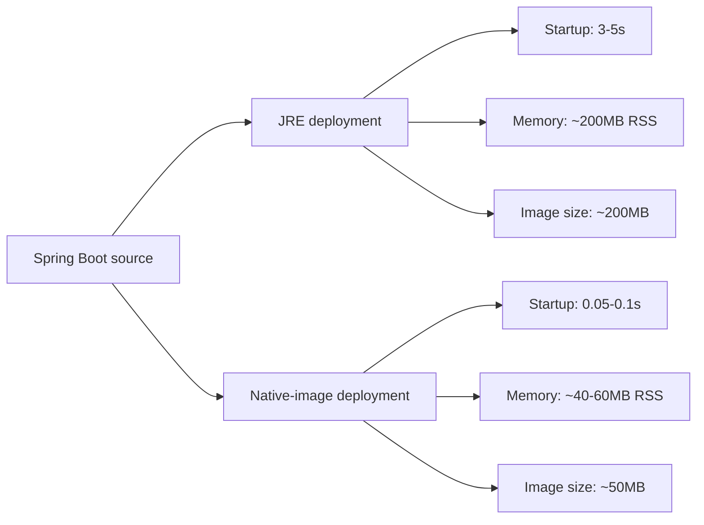
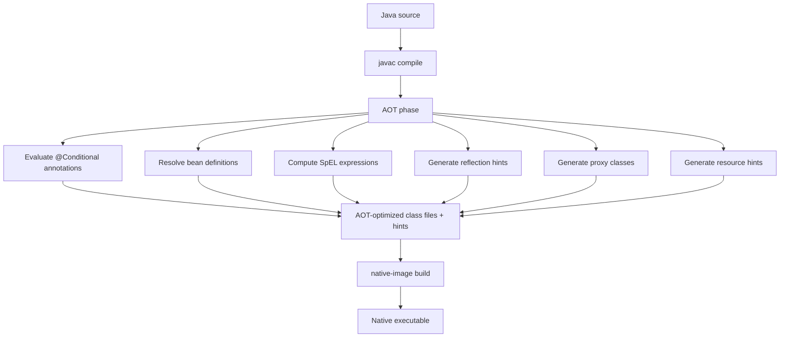
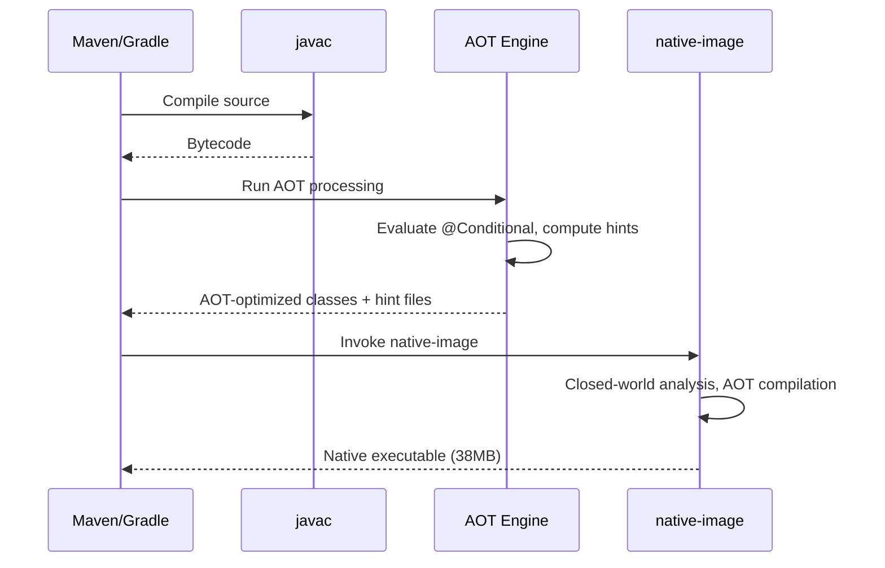
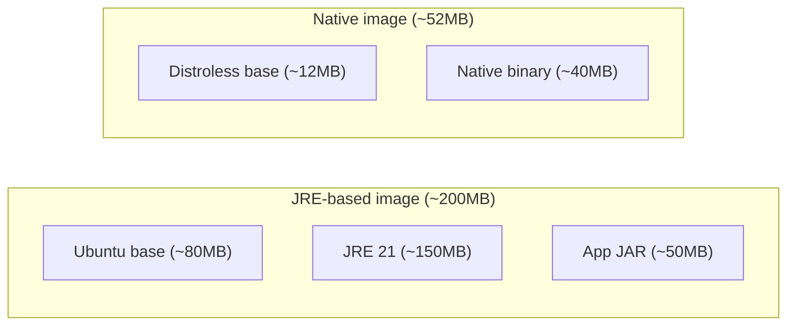

# Building Native Images with GraalVM

> [!summary] Goal
> Build native executables for Spring Boot 3.x applications with GraalVM — near-instant startup (~50ms), lower memory (~50MB), and minimal Docker images. Understand AOT processing, Maven/Gradle setup, compatibility, and limitations.

## Table of Contents

1. [Why Spring Boot Native](#why-spring-boot-native)
2. [How It Works: AOT Processing](#how-it-works-aot-processing)
3. [Maven Setup](#maven-setup)
4. [Gradle Setup](#gradle-setup)
5. [Building the Native Image](#building-the-native-image)
6. [Testing Native Images](#testing-native-images)
7. [Docker with Native Image](#docker-with-native-image)
8. [AOT Processing in Detail](#aot-processing-in-detail)
9. [Compatibility with Spring Features](#compatibility-with-spring-features)
10. [Step-by-Step Example](#step-by-step-example)
11. [Performance Characteristics](#performance-characteristics)
12. [Pitfalls](#pitfalls)

---

## Why Spring Boot Native

Spring Boot 3.x supports AOT compilation with GraalVM to produce native binaries. The result: applications that start instantly and use a fraction of the memory.

```bash
# Compare JRE vs native startup
java -jar app.jar                          # ~3-5 seconds startup
./target/my-app                             # ~0.05-0.1 seconds startup
```



---

## How It Works: AOT Processing

Spring Boot's AOT engine runs at build-time to pre-compute everything the application needs, eliminating the need for runtime reflection, classpath scanning, and conditional evaluation.



> [!tip] Definition
> **AOT (Ahead-of-Time) processing**: Spring Boot's build-time engine that pre-evaluates `@Conditional`, resolves bean definitions, and generates configuration hints for GraalVM native-image. This eliminates the need for runtime classpath scanning and conditional evaluation.

---

## Maven Setup

```xml
<parent>
    <groupId>org.springframework.boot</groupId>
    <artifactId>spring-boot-starter-parent</artifactId>
    <version>3.3.0</version>
</parent>

<build>
    <plugins>
        <plugin>
            <groupId>org.graalvm.buildtools</groupId>
            <artifactId>native-maven-plugin</artifactId>
        </plugin>
    </plugins>
</build>

<!-- Without parent POM -->
<plugin>
    <groupId>org.graalvm.buildtools</groupId>
    <artifactId>native-maven-plugin</artifactId>
    <version>0.10.2</version>
    <executions>
        <execution>
            <id>build-native</id>
            <goals>
                <goal>compile-no-fork</goal>
            </goals>
            <phase>package</phase>
        </execution>
    </executions>
</plugin>
```

### Maven Profiles for native

```xml
<profiles>
    <profile>
        <id>native</id>
        <build>
            <plugins>
                <plugin>
                    <groupId>org.graalvm.buildtools</groupId>
                    <artifactId>native-maven-plugin</artifactId>
                </plugin>
            </plugins>
        </build>
    </profile>
</profiles>
```

```bash
# Build with native profile
mvn -Pnative package
```

---

## Gradle Setup

```kotlin
// build.gradle.kts
plugins {
    java
    id("org.springframework.boot") version "3.3.0"
    id("io.spring.dependency-management") version "1.1.4"
    id("org.graalvm.buildtools.native") version "0.10.2"
}
```

```groovy
// build.gradle
plugins {
    id 'java'
    id 'org.springframework.boot' version '3.3.0'
    id 'io.spring.dependency-management' version '1.1.4'
    id 'org.graalvm.buildtools.native' version '0.10.2'
}
```

```bash
# Build native image
./gradlew nativeCompile
# Output: build/native/nativeCompile/<app-name>
```

---

## Building the Native Image

```bash
# Maven (Linux)
mvn -Pnative package
# Output: target/<app-name>

# Maven with Docker build (cross-compile from macOS)
mvn -Pnative package -DskipTests -Dnative-image.docker-build=true

# Gradle
./gradlew nativeCompile
```

### What the build produces

```bash
ls -lh target/demo
# -rwxr-xr-x 1 user user  38M  ...  target/demo  (static binary)

# Run immediately
./target/demo

# Output:
#   .   ____          _            __ _ _
#  /\\ / ___'_ __ _ _(_)_ __  __ _ \ \ \ \
# ( ( )\___ | '_ | '_| | '_ \/ _` | \ \ \ \
#  \\/  ___)| |_)| | | | | || (_| |  ) ) ) )
#   '  |____| .__|_| |_|_| |_\__, | / / / /
#  =========|_|==============|___/=/_/_/_/
#  :: Spring Boot ::                (v3.3.0)
#  Started DemoApplication in **0.054 seconds** (JVM running for **0.059**)
```



---

## Testing Native Images

```bash
# Maven — runs tests against the native binary
mvn -PnativeTest

# Gradle
./gradlew nativeTest
```

```java
@SpringBootTest
class ApplicationTest {

    @Test
    void contextLoads() {
        // In JVM mode: tests run on HotSpot
        // In nativeTest: tests run on the compiled native binary
    }
}
```

**Why nativeTest matters**: It catches configuration gaps (missing reflection hints, serialization config, proxy registration) that would only surface at runtime on the native binary.

---

## Docker with Native Image

The native binary has zero Java dependencies — use a distroless base image (~12MB):

```dockerfile
# Dockerfile
FROM gcr.io/distroless/base AS run
COPY target/my-app /app
EXPOSE 8080
CMD ["/app"]
```

```dockerfile
# Multi-stage build with Docker
FROM ghcr.io/graalvm/native-image:22 AS build
WORKDIR /app
COPY . .
RUN ./mvnw -Pnative package -DskipTests

FROM gcr.io/distroless/base AS run
COPY --from=build /app/target/my-app /app
EXPOSE 8080
CMD ["/app"]
```

```bash
# Build
docker build -t my-app:latest .

# Compare sizes
docker images | grep my-app
# my-app:jre        latest  200MB     (JRE-based)
# my-app:native     latest  52MB      (distroless + native binary)

# Compare startup
docker run --rm -i my-app:native
# Started DemoApplication in 0.054 seconds
```



---

## AOT Processing in Detail

### What AOT generates at build time

| Artifact | What it contains |
|----------|-----------------|
| `target/spring-aot/main/resources/META-INF/native-image/reflect-config.json` | Pre-computed reflection hints for all injection points, `@ConfigurationProperties`, JPA entities, Spring proxies |
| `proxy-config.json` | JDK proxy interfaces for repositories, AOP advisors |
| `resource-config.json` | Classpath resources, message bundles, static resources |
| `serialization-config.json` | Serializable classes used by Spring Session, caching |
| AOT-processed classes | Bean definitions pre-resolved, conditional evaluation baked in |

### What AOT evaluates at build time

```java
@Configuration
public class MyConfig {
    @Bean
    @ConditionalOnProperty("feature.enabled")
    public MyService myService() {
        return new MyService();
    }
}
// AOT evaluates @ConditionalOnProperty at BUILD TIME
// If "feature.enabled" is true during build, the bean is included
```

```mermaid
flowchart TD
    A[Source configuration] --> B[AOT engine]
    B --> C{@ConditionalOnProperty?}
    C -->|"true at build"| D[Bean included in native image]
    C -->|"false at build"| E[Bean excluded]
    B --> F{@ConditionalOnClass?}
    F -->|Class in classpath| G[Bean included]
    F -->|Class missing| H[Bean excluded]
    B --> I{SpEL expression?}
    I --> J[Evaluated at build time]
```

---

## Compatibility with Spring Features

| Feature | Compatibility | Notes |
|---------|--------------|-------|
| **Auto-configuration** | ✅ Full | All `@Conditional*` evaluated at build time |
| **Web MVC / WebFlux** | ✅ Full | Tomcat, Netty, Undertow supported |
| **JPA / Hibernate** | ✅ With config | Hibernate proxies need reflection hints (generated by AOT) |
| **Spring Data JPA** | ✅ With config | Repository proxies generated by AOT |
| **Spring Security** | ✅ Most | Method security with AOP needs proxy registration |
| **Spring AOP** | ⚠️ Limited | JDK proxies need explicit registration; CGLIB works |
| **Actuator** | ⚠️ Partial | Some endpoints (`/heapdump`, `/jolokia`) unavailable |
| **JMX** | ❌ Not available | No JMX MBeans, no remote management |
| **Spring Cloud** | ⚠️ Partial | Config client works; discovery clients vary |
| **Kafka / RabbitMQ** | ✅ Full | Standard messaging, no reflection issues |
| **SpEL** | ✅ Evaluated at build time | |
| **@Profile** | ⚠️ Limited | Profile evaluation at build time; runtime switching limited |
| **Serialization** | ⚠️ Needs config | Redis session, cache serialization needs config |

---

## Step-by-Step Example

### 1. Create a project

```bash
curl https://start.spring.io/starter.zip \
  -d dependencies=web,data-jpa,postgresql,actuator \
  -d type=maven-project \
  -d language=java \
  -d bootVersion=3.3.0 \
  -d javaVersion=21 \
  -d name=native-demo \
  -d artifactId=native-demo \
  -d packages=native-demo \
  -o native-demo.zip

unzip native-demo.zip && cd native-demo
```

### 2. Add native plugin

```xml
<plugin>
    <groupId>org.graalvm.buildtools</groupId>
    <artifactId>native-maven-plugin</artifactId>
</plugin>
```

### 3. Build and measure

```bash
# Standard JRE build
mvn package -DskipTests
time java -jar target/native-demo-0.0.1-SNAPSHOT.jar &
# real 0m3.245s (startup)
curl http://localhost:8080/actuator/health
kill %1

# Native build
mvn -Pnative package -DskipTests
time ./target/native-demo &
# real 0m0.054s (startup)
curl http://localhost:8080/actuator/health
kill %1

# Compare memory
ps -o rss,vsz -p $(pgrep -f "java -jar")          # ~200MB RSS
ps -o rss,vsz -p $(pgrep -f "^./target/native-demo")  # ~45MB RSS
```

### 4. Docker build

```dockerfile
FROM ghcr.io/graalvm/native-image:22 AS build
WORKDIR /app
COPY . .
RUN ./mvnw -Pnative package -DskipTests -Dnative-image.docker-build=true

FROM gcr.io/distroless/base
COPY --from=build /app/target/native-demo /app
EXPOSE 8080
CMD ["/app"]
```

```bash
docker build -t native-demo:latest .
docker run --rm -p 8080:8080 native-demo:latest
```

---

## Performance Characteristics

| Metric | JRE (HotSpot) | Native Image |
|--------|---------------|--------------|
| **Startup time** | 3-5 seconds | **0.05-0.2 seconds** |
| **Peak throughput (req/s)** | Baseline | 5-15% lower (no JIT for hot paths) |
| **Memory (RSS, idle)** | ~150-250 MB | **~40-60 MB** |
| **Memory (RSS, under load)** | ~300-500 MB | **~80-120 MB** |
| **Docker image size** | ~200 MB | **~50 MB** |
| **First response time** | 3-5 seconds | **<100ms** |
| **Build time** | 10-30 seconds | **2-10 minutes** |
| **Best for** | Long-running services, high throughput | Serverless, autoscaling, containers |

---

## Pitfalls

### AOT processing memory

The AOT phase and native-image build require significant memory. Builds with JPA + Hibernate + Security + several dependencies can need 8-12GB RAM.

**Fix**: Set `-J-Xmx8g` or `-J-Xmx12g` via `native-maven-plugin` configuration. Use `-Dnative-image.docker-build=true` to build on a machine with more memory.

### `@Profile` behavior at runtime

`@Profile("cloud")` is evaluated at build time. If the profile is not active during build, the beans are excluded.

**Fix**: Build with the profiles you need: `mvn -Pnative package -Dspring.profiles.active=cloud`. For runtime profile switching, avoid `@Profile` on beans that need to switch.

### Serialization without config

If your app uses Redis session store, JMS, or distributed caching, serialization config is needed:

```bash
# Run with tracing agent
java -agentlib:native-image-agent=config-output-dir=src/main/resources/META-INF/native-image -jar app.jar
# Exercise all serialization paths, then stop
```

### Non-embedded Actuator endpoints

Endpoints that require JMX or heap dumps (`/heapdump`, `/jolokia`, `/logfile`) are not available in native images.

**Fix**: Use process-level metrics (Prometheus `/actuator/prometheus` still works). Use sidecar containers for log shipping.

### Hibernate lazy loading

Hibernate's lazy loading proxies need explicit registration:

```properties
# application.properties
spring.jpa.open-in-view=false
```

If lazy loading fails, wrap the entity with `@Proxy(lazy=false)` or eager-load the relationship.

---

> [!question]- Interview Questions
>
> **Q: What does Spring Boot's AOT engine do?**
> A: It runs at build time to pre-evaluate `@Conditional` annotations, resolve bean definitions, compute SpEL expressions, and generate reflection/proxy/serialization hints for GraalVM native-image.
>
> **Q: What are the main benefits of Spring Boot native images?**
> A: Sub-100ms startup (vs 3-5s for JRE), ~50MB memory (vs ~200MB), ~50MB Docker images (vs ~200MB). Best for serverless, autoscaling, and container-dense deployments.
>
> **Q: What Spring features are NOT available in native images?**
> A: JMX, heap dumps, JFR recordings, `-javaagent` at runtime, some Actuator endpoints, runtime `@Profile` switching, and dynamic class loading.
>
> **Q: How do you fix a `ClassNotFoundException` at runtime in a native image?**
> A: Run the app with `-agentlib:native-image-agent=config-output-dir=...` and exercise all code paths. Copy the generated `reflect-config.json` to `META-INF/native-image/`.

---

## Cross-Links

- [[Java/03_Advanced/05_GraalVM_Native_Image_and_AOT]] for GraalVM technology fundamentals
- [[SpringBoot/01_Foundations/01_Boot_Project_Structure_and_Profiles]] for Maven plugin configuration
- [[CICD/Docker/04_Playbooks/05_Containerize_a_Spring_Boot_App]] for Docker deployment comparison
- [[SpringBoot/04_Playbooks/01_Production_Configuration_Checklist]] for production settings

---

## References

- [Spring Boot AOT Documentation](https://docs.spring.io/spring-boot/reference/packaging/native-image/index.html)
- [GraalVM Native Image for Spring Boot](https://www.graalvm.org/latest/docs/getting-started/spring-boot/)
- [Spring Native](https://docs.spring.io/spring-boot/reference/packaging/native-image/introducing.html)
- [native-maven-plugin](https://graalvm.github.io/native-build-tools/latest/maven-plugin.html)
- [Spring Boot @RegisterReflectionForBinding](https://docs.spring.io/spring-boot/reference/packaging/native-image/native-image.html#packaging.native-image.configuration)
