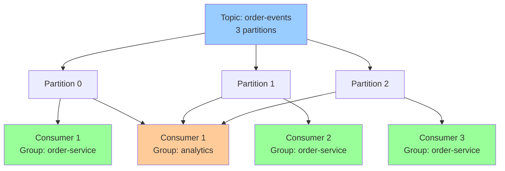
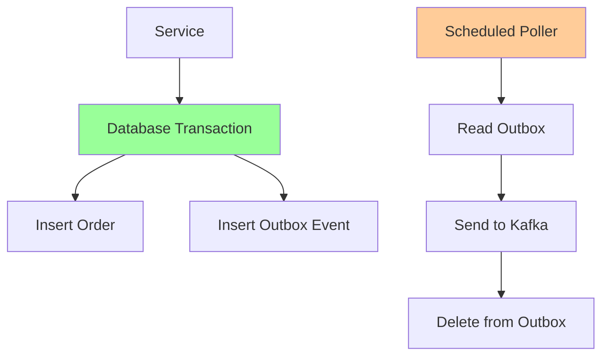

# Spring for Apache Kafka Integration

> [!tip] Quick Reference
> See [[SpringBoot/00_Cheat_Sheets]] for Kafka property/consumer/producer quick lookups.

## Overview

Spring for Apache Kafka provides high-level abstractions over the native Kafka client, simplifying producer/consumer implementation while maintaining flexibility for advanced use cases. It handles serialization, error handling, retries, and integrates seamlessly with Spring's transaction management.

> [!summary] Goal
> Produce and consume Kafka events reliably with retries, idempotence, Dead Letter Queues, and proper offset management for production-grade event-driven systems.

---

## Spring Kafka vs Native Kafka Client

### Comparison

| Feature | Native Kafka Client | Spring Kafka |
|---------|---------------------|--------------|
| **Configuration** | Manual properties | Spring Boot auto-config + properties |
| **Consumer** | Manual poll loop | `@KafkaListener` annotation |
| **Error Handling** | Manual try-catch | Built-in error handlers + DLT |
| **Retries** | Manual implementation | `RetryTemplate`, `@Retryable` |
| **Serialization** | Manual configuration | Auto-configured JSON/Avro |
| **Transaction Support** | Manual | Integrates with `@Transactional` |
| **Testing** | Manual setup | `@EmbeddedKafka` |
| **Spring Integration** | Manual wiring | Auto-wired beans |

### When to Use Each

**Use Spring Kafka when**:
- Building Spring Boot applications (auto-config)
- You want declarative consumers (`@KafkaListener`)
- You need built-in retry/DLT mechanisms
- You want integration with Spring transactions

**Use Native Kafka Client when**:
- Non-Spring applications
- Maximum control over low-level details
- Custom poll loop logic
- Performance-critical scenarios (avoid abstraction overhead)

---

## Dependencies

### Maven

```xml
<dependency>
    <groupId>org.springframework.kafka</groupId>
    <artifactId>spring-kafka</artifactId>
</dependency>

<!-- For testing -->
<dependency>
    <groupId>org.springframework.kafka</groupId>
    <artifactId>spring-kafka-test</artifactId>
    <scope>test</scope>
</dependency>
```

### Gradle

```gradle
implementation 'org.springframework.kafka:spring-kafka'
testImplementation 'org.springframework.kafka:spring-kafka-test'
```

---

## Producer Configuration

### Basic Configuration

```yaml
# application.yml
spring:
  kafka:
    bootstrap-servers: localhost:9092
    producer:
      key-serializer: org.apache.kafka.common.serialization.StringSerializer
      value-serializer: org.springframework.kafka.support.serializer.JsonSerializer
      acks: all  # Wait for all replicas to acknowledge
      retries: 3
      properties:
        linger.ms: 10  # Batch messages for 10ms
        batch.size: 16384  # 16KB batch size
        compression.type: snappy
        max.in.flight.requests.per.connection: 5
```

### Producer Bean Configuration

```java
package com.example.kafka.config;

import org.apache.kafka.clients.producer.ProducerConfig;
import org.apache.kafka.common.serialization.StringSerializer;
import org.springframework.context.annotation.Bean;
import org.springframework.context.annotation.Configuration;
import org.springframework.kafka.core.DefaultKafkaProducerFactory;
import org.springframework.kafka.core.KafkaTemplate;
import org.springframework.kafka.core.ProducerFactory;
import org.springframework.kafka.support.serializer.JsonSerializer;

import java.util.HashMap;
import java.util.Map;

@Configuration
public class KafkaProducerConfig {
    
    @Bean
    public ProducerFactory<String, Object> producerFactory() {
        Map<String, Object> props = new HashMap<>();
        
        // Connection
        props.put(ProducerConfig.BOOTSTRAP_SERVERS_CONFIG, "localhost:9092");
        
        // Serialization
        props.put(ProducerConfig.KEY_SERIALIZER_CLASS_CONFIG, StringSerializer.class);
        props.put(ProducerConfig.VALUE_SERIALIZER_CLASS_CONFIG, JsonSerializer.class);
        
        // Reliability
        props.put(ProducerConfig.ACKS_CONFIG, "all");  // Wait for all in-sync replicas
        props.put(ProducerConfig.RETRIES_CONFIG, 3);
        props.put(ProducerConfig.ENABLE_IDEMPOTENCE_CONFIG, true);  // Exactly-once semantics
        
        // Performance
        props.put(ProducerConfig.LINGER_MS_CONFIG, 10);  // Batch for 10ms
        props.put(ProducerConfig.BATCH_SIZE_CONFIG, 16384);  // 16KB
        props.put(ProducerConfig.COMPRESSION_TYPE_CONFIG, "snappy");
        props.put(ProducerConfig.BUFFER_MEMORY_CONFIG, 33554432);  // 32MB buffer
        
        // Ordering (with idempotence)
        props.put(ProducerConfig.MAX_IN_FLIGHT_REQUESTS_PER_CONNECTION, 5);
        
        return new DefaultKafkaProducerFactory<>(props);
    }
    
    @Bean
    public KafkaTemplate<String, Object> kafkaTemplate() {
        return new KafkaTemplate<>(producerFactory());
    }
}
```

### Using KafkaTemplate

```java
package com.example.service;

import lombok.RequiredArgsConstructor;
import lombok.extern.slf4j.Slf4j;
import org.springframework.kafka.core.KafkaTemplate;
import org.springframework.kafka.support.SendResult;
import org.springframework.stereotype.Service;

import java.util.concurrent.CompletableFuture;

@Service
@RequiredArgsConstructor
@Slf4j
public class OrderEventProducer {
    
    private static final String TOPIC = "order-events";
    
    private final KafkaTemplate<String, Object> kafkaTemplate;
    
    /**
     * Fire-and-forget (not recommended for critical events)
     */
    public void sendFireAndForget(OrderEvent event) {
        kafkaTemplate.send(TOPIC, event.getOrderId(), event);
    }
    
    /**
     * Synchronous send (blocks until acknowledged)
     */
    public void sendSync(OrderEvent event) {
        try {
            SendResult<String, Object> result = kafkaTemplate.send(
                TOPIC, 
                event.getOrderId(),  // Key for partitioning
                event
            ).get();  // Blocks here
            
            log.info("Sent event to partition {} offset {}", 
                result.getRecordMetadata().partition(),
                result.getRecordMetadata().offset());
        } catch (Exception e) {
            log.error("Failed to send event", e);
            throw new RuntimeException("Kafka send failed", e);
        }
    }
    
    /**
     * Async send with callback (recommended)
     */
    public void sendAsync(OrderEvent event) {
        CompletableFuture<SendResult<String, Object>> future = kafkaTemplate.send(
            TOPIC,
            event.getOrderId(),
            event
        );
        
        future.whenComplete((result, ex) -> {
            if (ex != null) {
                log.error("Failed to send event: {}", event, ex);
                // Handle failure (retry, DLQ, alert, etc.)
            } else {
                log.info("Sent event {} to partition {} offset {}",
                    event.getOrderId(),
                    result.getRecordMetadata().partition(),
                    result.getRecordMetadata().offset());
            }
        });
    }
    
    /**
     * Send with custom headers
     */
    public void sendWithHeaders(OrderEvent event) {
        kafkaTemplate.send(TOPIC, event.getOrderId(), event)
            .thenAccept(result -> {
                log.info("Event sent successfully");
            })
            .exceptionally(ex -> {
                log.error("Send failed", ex);
                return null;
            });
    }
}
```

### Event Model

```java
package com.example.model;

import lombok.AllArgsConstructor;
import lombok.Data;
import lombok.NoArgsConstructor;

import java.math.BigDecimal;
import java.time.Instant;

@Data
@NoArgsConstructor
@AllArgsConstructor
public class OrderEvent {
    private String orderId;
    private String customerId;
    private BigDecimal amount;
    private OrderStatus status;
    private Instant timestamp;
    
    public enum OrderStatus {
        CREATED, CONFIRMED, SHIPPED, DELIVERED, CANCELLED
    }
}
```

---

## Consumer Configuration

### Basic Configuration

```yaml
# application.yml
spring:
  kafka:
    bootstrap-servers: localhost:9092
    consumer:
      group-id: order-service
      key-deserializer: org.apache.kafka.common.serialization.StringDeserializer
      value-deserializer: org.springframework.kafka.support.serializer.JsonDeserializer
      auto-offset-reset: earliest  # earliest or latest
      enable-auto-commit: false  # Manual offset commit (safer)
      properties:
        spring.json.trusted.packages: com.example.model
        max.poll.records: 100  # Max records per poll
        max.poll.interval.ms: 300000  # 5 minutes
        session.timeout.ms: 10000  # 10 seconds
```

### Consumer Bean Configuration

```java
package com.example.kafka.config;

import com.example.model.OrderEvent;
import org.apache.kafka.clients.consumer.ConsumerConfig;
import org.apache.kafka.common.serialization.StringDeserializer;
import org.springframework.context.annotation.Bean;
import org.springframework.context.annotation.Configuration;
import org.springframework.kafka.annotation.EnableKafka;
import org.springframework.kafka.config.ConcurrentKafkaListenerContainerFactory;
import org.springframework.kafka.core.ConsumerFactory;
import org.springframework.kafka.core.DefaultKafkaConsumerFactory;
import org.springframework.kafka.listener.ContainerProperties;
import org.springframework.kafka.support.serializer.ErrorHandlingDeserializer;
import org.springframework.kafka.support.serializer.JsonDeserializer;

import java.util.HashMap;
import java.util.Map;

@Configuration
@EnableKafka
public class KafkaConsumerConfig {
    
    @Bean
    public ConsumerFactory<String, OrderEvent> consumerFactory() {
        Map<String, Object> props = new HashMap<>();
        
        // Connection
        props.put(ConsumerConfig.BOOTSTRAP_SERVERS_CONFIG, "localhost:9092");
        
        // Consumer group
        props.put(ConsumerConfig.GROUP_ID_CONFIG, "order-service");
        
        // Deserializers with error handling
        props.put(ConsumerConfig.KEY_DESERIALIZER_CLASS_CONFIG, ErrorHandlingDeserializer.class);
        props.put(ConsumerConfig.VALUE_DESERIALIZER_CLASS_CONFIG, ErrorHandlingDeserializer.class);
        props.put(ErrorHandlingDeserializer.KEY_DESERIALIZER_CLASS, StringDeserializer.class);
        props.put(ErrorHandlingDeserializer.VALUE_DESERIALIZER_CLASS, JsonDeserializer.class);
        
        // JSON deserialization config
        props.put(JsonDeserializer.TRUSTED_PACKAGES, "com.example.model");
        props.put(JsonDeserializer.VALUE_DEFAULT_TYPE, OrderEvent.class.getName());
        
        // Offset management
        props.put(ConsumerConfig.AUTO_OFFSET_RESET_CONFIG, "earliest");
        props.put(ConsumerConfig.ENABLE_AUTO_COMMIT_CONFIG, false);  // Manual commit
        
        // Performance
        props.put(ConsumerConfig.MAX_POLL_RECORDS_CONFIG, 100);
        props.put(ConsumerConfig.MAX_POLL_INTERVAL_MS_CONFIG, 300000);  // 5 minutes
        props.put(ConsumerConfig.SESSION_TIMEOUT_MS_CONFIG, 10000);  // 10 seconds
        props.put(ConsumerConfig.HEARTBEAT_INTERVAL_MS_CONFIG, 3000);  // 3 seconds
        
        return new DefaultKafkaConsumerFactory<>(props);
    }
    
    @Bean
    public ConcurrentKafkaListenerContainerFactory<String, OrderEvent> kafkaListenerContainerFactory() {
        ConcurrentKafkaListenerContainerFactory<String, OrderEvent> factory = 
            new ConcurrentKafkaListenerContainerFactory<>();
        
        factory.setConsumerFactory(consumerFactory());
        
        // Concurrency (number of consumer threads)
        factory.setConcurrency(3);
        
        // Manual offset commit
        factory.getContainerProperties().setAckMode(ContainerProperties.AckMode.MANUAL);
        
        return factory;
    }
}
```

---

## @KafkaListener Annotation

### Basic Listener

```java
package com.example.consumer;

import com.example.model.OrderEvent;
import lombok.extern.slf4j.Slf4j;
import org.springframework.kafka.annotation.KafkaListener;
import org.springframework.stereotype.Component;

@Component
@Slf4j
public class OrderEventConsumer {
    
    @KafkaListener(
        topics = "order-events",
        groupId = "order-service"
    )
    public void consume(OrderEvent event) {
        log.info("Received order event: {}", event);
        // Process event
    }
}
```

### All @KafkaListener Attributes

```java
@Component
@Slf4j
public class AdvancedOrderEventConsumer {
    
    @KafkaListener(
        // Topics
        topics = {"order-events", "payment-events"},  // Multiple topics
        topicPattern = "order-.*",  // Regex pattern
        
        // Consumer group
        groupId = "order-service",
        
        // Concurrency
        concurrency = "3",  // 3 consumer threads
        
        // Container factory
        containerFactory = "kafkaListenerContainerFactory",
        
        // Auto-startup
        autoStartup = "true",
        
        // Error handler
        errorHandler = "kafkaErrorHandler",
        
        // Filtering
        filter = "orderEventFilter",
        
        // Partition assignment
        topicPartitions = @TopicPartition(
            topic = "order-events",
            partitions = {"0", "1"}  // Only partitions 0 and 1
        )
    )
    public void consume(OrderEvent event) {
        log.info("Processing: {}", event);
    }
}
```

### Access Kafka Metadata

```java
@Component
@Slf4j
public class OrderEventConsumer {
    
    @KafkaListener(topics = "order-events", groupId = "order-service")
    public void consume(
        OrderEvent event,
        @Header(KafkaHeaders.RECEIVED_TOPIC) String topic,
        @Header(KafkaHeaders.RECEIVED_PARTITION) int partition,
        @Header(KafkaHeaders.OFFSET) long offset,
        @Header(KafkaHeaders.RECEIVED_TIMESTAMP) long timestamp,
        @Header(KafkaHeaders.RECEIVED_KEY) String key
    ) {
        log.info("Received event from topic={}, partition={}, offset={}, key={}", 
            topic, partition, offset, key);
        log.info("Event: {}", event);
    }
}
```

### Manual Offset Commit

```java
@Component
@Slf4j
public class OrderEventConsumer {
    
    @KafkaListener(
        topics = "order-events",
        groupId = "order-service",
        containerFactory = "kafkaListenerContainerFactory"  // Must use manual ack mode
    )
    public void consume(OrderEvent event, Acknowledgment ack) {
        try {
            log.info("Processing event: {}", event);
            
            // Process event
            processOrder(event);
            
            // Commit offset ONLY after successful processing
            ack.acknowledge();
            
            log.info("Offset committed for event: {}", event.getOrderId());
        } catch (Exception e) {
            log.error("Failed to process event: {}", event, e);
            // Don't commit offset - will reprocess on next poll
            // Could also send to DLT here
        }
    }
    
    private void processOrder(OrderEvent event) {
        // Business logic
    }
}
```

### Batch Consumption

```java
@Component
@Slf4j
public class BatchOrderEventConsumer {
    
    @KafkaListener(
        topics = "order-events",
        groupId = "order-service-batch",
        containerFactory = "batchKafkaListenerContainerFactory"
    )
    public void consumeBatch(List<OrderEvent> events) {
        log.info("Received batch of {} events", events.size());
        
        // Process batch
        events.forEach(event -> {
            log.info("Processing: {}", event);
            processOrder(event);
        });
    }
    
    private void processOrder(OrderEvent event) {
        // Business logic
    }
}
```

**Batch configuration**:

```java
@Bean
public ConcurrentKafkaListenerContainerFactory<String, OrderEvent> batchKafkaListenerContainerFactory() {
    ConcurrentKafkaListenerContainerFactory<String, OrderEvent> factory = 
        new ConcurrentKafkaListenerContainerFactory<>();
    
    factory.setConsumerFactory(consumerFactory());
    factory.setBatchListener(true);  // Enable batch mode
    factory.setConcurrency(3);
    
    return factory;
}
```

---

## Error Handling

### Using ErrorHandler

```java
package com.example.kafka.config;

import lombok.extern.slf4j.Slf4j;
import org.apache.kafka.clients.consumer.Consumer;
import org.apache.kafka.clients.consumer.ConsumerRecord;
import org.springframework.kafka.listener.KafkaListenerErrorHandler;
import org.springframework.kafka.listener.ListenerExecutionFailedException;
import org.springframework.messaging.Message;
import org.springframework.stereotype.Component;

@Component("kafkaErrorHandler")
@Slf4j
public class KafkaErrorHandler implements KafkaListenerErrorHandler {
    
    @Override
    public Object handleError(Message<?> message, ListenerExecutionFailedException exception) {
        log.error("Error in Kafka listener", exception);
        log.error("Message: {}", message.getPayload());
        
        // Could send to DLT, alert, etc.
        
        return null;  // Return value can be used to send to reply topic
    }
}
```

**Usage**:

```java
@KafkaListener(
    topics = "order-events",
    errorHandler = "kafkaErrorHandler"
)
public void consume(OrderEvent event) {
    if (event.getAmount().compareTo(BigDecimal.ZERO) <= 0) {
        throw new IllegalArgumentException("Invalid amount");
    }
    processOrder(event);
}
```

### CommonErrorHandler (Spring Kafka 2.8+)

```java
package com.example.kafka.config;

import lombok.extern.slf4j.Slf4j;
import org.springframework.context.annotation.Bean;
import org.springframework.context.annotation.Configuration;
import org.springframework.kafka.listener.CommonErrorHandler;
import org.springframework.kafka.listener.DefaultErrorHandler;
import org.springframework.util.backoff.FixedBackOff;

@Configuration
@Slf4j
public class KafkaErrorConfig {
    
    @Bean
    public CommonErrorHandler errorHandler() {
        // Retry 3 times with 1 second interval
        DefaultErrorHandler handler = new DefaultErrorHandler(
            (record, exception) -> {
                // Called after all retries exhausted
                log.error("Failed to process record after retries: {}", record, exception);
                // Send to DLT
            },
            new FixedBackOff(1000L, 3)  // 1 second interval, 3 retries
        );
        
        // Don't retry for certain exceptions
        handler.addNotRetryableExceptions(IllegalArgumentException.class);
        
        return handler;
    }
}
```

**Wire to listener container**:

```java
@Bean
public ConcurrentKafkaListenerContainerFactory<String, OrderEvent> kafkaListenerContainerFactory() {
    ConcurrentKafkaListenerContainerFactory<String, OrderEvent> factory = 
        new ConcurrentKafkaListenerContainerFactory<>();
    
    factory.setConsumerFactory(consumerFactory());
    factory.setCommonErrorHandler(errorHandler());  // Set error handler
    
    return factory;
}
```

---

## Retry Mechanisms

### Using @Retryable

```java
package com.example.consumer;

import com.example.model.OrderEvent;
import lombok.extern.slf4j.Slf4j;
import org.springframework.kafka.annotation.KafkaListener;
import org.springframework.retry.annotation.Backoff;
import org.springframework.retry.annotation.Retryable;
import org.springframework.stereotype.Component;

@Component
@Slf4j
public class OrderEventConsumer {
    
    @KafkaListener(topics = "order-events", groupId = "order-service")
    @Retryable(
        value = {RuntimeException.class},
        maxAttempts = 3,
        backoff = @Backoff(delay = 1000, multiplier = 2)  // 1s, 2s, 4s
    )
    public void consume(OrderEvent event) {
        log.info("Processing event: {}", event);
        
        // May throw exception - will retry
        processOrder(event);
    }
    
    private void processOrder(OrderEvent event) {
        // Business logic that may fail
        if (event.getAmount().compareTo(BigDecimal.ZERO) <= 0) {
            throw new RuntimeException("Invalid amount");
        }
    }
}
```

**Enable retries**:

```java
@Configuration
@EnableRetry
public class RetryConfig {
    // @Retryable now works
}
```

### Using RetryTemplate

```java
package com.example.consumer;

import com.example.model.OrderEvent;
import lombok.extern.slf4j.Slf4j;
import org.springframework.kafka.annotation.KafkaListener;
import org.springframework.retry.RetryCallback;
import org.springframework.retry.RetryContext;
import org.springframework.retry.backoff.ExponentialBackOffPolicy;
import org.springframework.retry.policy.SimpleRetryPolicy;
import org.springframework.retry.support.RetryTemplate;
import org.springframework.stereotype.Component;

@Component
@Slf4j
public class OrderEventConsumer {
    
    private final RetryTemplate retryTemplate;
    
    public OrderEventConsumer() {
        this.retryTemplate = new RetryTemplate();
        
        // Retry policy
        SimpleRetryPolicy retryPolicy = new SimpleRetryPolicy();
        retryPolicy.setMaxAttempts(3);
        retryTemplate.setRetryPolicy(retryPolicy);
        
        // Backoff policy
        ExponentialBackOffPolicy backOffPolicy = new ExponentialBackOffPolicy();
        backOffPolicy.setInitialInterval(1000);  // 1 second
        backOffPolicy.setMultiplier(2.0);  // 2x each time
        backOffPolicy.setMaxInterval(10000);  // Max 10 seconds
        retryTemplate.setBackOffPolicy(backOffPolicy);
    }
    
    @KafkaListener(topics = "order-events", groupId = "order-service")
    public void consume(OrderEvent event) {
        retryTemplate.execute((RetryCallback<Void, RuntimeException>) context -> {
            log.info("Processing event (attempt {}): {}", context.getRetryCount() + 1, event);
            processOrder(event);
            return null;
        }, context -> {
            // Recovery callback (called after all retries fail)
            log.error("Failed to process event after {} attempts", context.getRetryCount());
            sendToDLT(event);
            return null;
        });
    }
    
    private void processOrder(OrderEvent event) {
        // Business logic
    }
    
    private void sendToDLT(OrderEvent event) {
        // Send to Dead Letter Topic
    }
}
```

---

## Dead Letter Topic (DLT) Pattern

### Automatic DLT with DeadLetterPublishingRecoverer

```java
package com.example.kafka.config;

import org.apache.kafka.clients.producer.ProducerConfig;
import org.apache.kafka.common.serialization.StringSerializer;
import org.springframework.context.annotation.Bean;
import org.springframework.context.annotation.Configuration;
import org.springframework.kafka.core.DefaultKafkaProducerFactory;
import org.springframework.kafka.core.KafkaTemplate;
import org.springframework.kafka.listener.CommonErrorHandler;
import org.springframework.kafka.listener.DeadLetterPublishingRecoverer;
import org.springframework.kafka.listener.DefaultErrorHandler;
import org.springframework.kafka.support.serializer.JsonSerializer;
import org.springframework.util.backoff.FixedBackOff;

import java.util.HashMap;
import java.util.Map;

@Configuration
public class KafkaDLTConfig {
    
    @Bean
    public KafkaTemplate<String, Object> dltKafkaTemplate() {
        Map<String, Object> props = new HashMap<>();
        props.put(ProducerConfig.BOOTSTRAP_SERVERS_CONFIG, "localhost:9092");
        props.put(ProducerConfig.KEY_SERIALIZER_CLASS_CONFIG, StringSerializer.class);
        props.put(ProducerConfig.VALUE_SERIALIZER_CLASS_CONFIG, JsonSerializer.class);
        
        return new KafkaTemplate<>(new DefaultKafkaProducerFactory<>(props));
    }
    
    @Bean
    public CommonErrorHandler errorHandler(KafkaTemplate<String, Object> dltKafkaTemplate) {
        // Send failed messages to DLT
        DeadLetterPublishingRecoverer recoverer = new DeadLetterPublishingRecoverer(
            dltKafkaTemplate,
            (record, ex) -> {
                // DLT topic name: original-topic.DLT
                String dltTopic = record.topic() + ".DLT";
                return new org.apache.kafka.common.TopicPartition(dltTopic, record.partition());
            }
        );
        
        // Retry 3 times, then send to DLT
        return new DefaultErrorHandler(recoverer, new FixedBackOff(1000L, 3));
    }
}
```

### DLT Consumer

```java
package com.example.consumer;

import com.example.model.OrderEvent;
import lombok.extern.slf4j.Slf4j;
import org.springframework.kafka.annotation.KafkaListener;
import org.springframework.kafka.support.KafkaHeaders;
import org.springframework.messaging.handler.annotation.Header;
import org.springframework.stereotype.Component;

@Component
@Slf4j
public class OrderEventDLTConsumer {
    
    @KafkaListener(
        topics = "order-events.DLT",
        groupId = "order-service-dlt"
    )
    public void consumeDLT(
        OrderEvent event,
        @Header(KafkaHeaders.RECEIVED_TOPIC) String topic,
        @Header(KafkaHeaders.OFFSET) long offset,
        @Header(KafkaHeaders.EXCEPTION_MESSAGE) String exceptionMessage,
        @Header(KafkaHeaders.EXCEPTION_STACKTRACE) String stackTrace
    ) {
        log.error("Received event from DLT");
        log.error("Topic: {}, Offset: {}", topic, offset);
        log.error("Event: {}", event);
        log.error("Exception: {}", exceptionMessage);
        log.error("Stack trace: {}", stackTrace);
        
        // Handle DLT messages:
        // 1. Log to monitoring system
        // 2. Send alert
        // 3. Store for manual inspection
        // 4. Attempt manual recovery
    }
}
```

---

## Consumer Groups and Partition Assignment

### Consumer Groups



**Key points**:
- Each partition is consumed by **exactly one** consumer in a group
- Multiple consumer groups can consume the same partition independently
- Partitions are rebalanced when consumers join/leave

### Concurrency Configuration

```java
@Bean
public ConcurrentKafkaListenerContainerFactory<String, OrderEvent> kafkaListenerContainerFactory() {
    ConcurrentKafkaListenerContainerFactory<String, OrderEvent> factory = 
        new ConcurrentKafkaListenerContainerFactory<>();
    
    factory.setConsumerFactory(consumerFactory());
    
    // 3 consumer threads (can consume from 3 partitions concurrently)
    factory.setConcurrency(3);
    
    return factory;
}
```

**Important**: If you have 3 partitions and `concurrency=5`, only 3 consumers will be active (1 per partition).

### Partition Assignment Strategies

```yaml
spring:
  kafka:
    consumer:
      properties:
        partition.assignment.strategy: org.apache.kafka.clients.consumer.RangeAssignor
        # Options:
        # - RangeAssignor (default)
        # - RoundRobinAssignor
        # - StickyAssignor (minimizes partition movement)
        # - CooperativeStickyAssignor (Kafka 2.4+)
```

---

## Offset Management

### Offset Commit Strategies

#### Auto-Commit (Not Recommended)

```yaml
spring:
  kafka:
    consumer:
      enable-auto-commit: true
      auto-commit-interval: 5000  # Commit every 5 seconds
```

**Problems**:
- Messages can be lost if consumer crashes between poll and commit
- Messages can be processed twice if consumer crashes after processing but before commit

#### Manual Commit (Recommended)

```java
@KafkaListener(topics = "order-events", groupId = "order-service")
public void consume(OrderEvent event, Acknowledgment ack) {
    try {
        processOrder(event);
        ack.acknowledge();  // Commit offset AFTER processing
    } catch (Exception e) {
        log.error("Processing failed", e);
        // Don't acknowledge - will reprocess
    }
}
```

**Configuration**:

```java
factory.getContainerProperties().setAckMode(ContainerProperties.AckMode.MANUAL);
```

### Offset Reset Behavior

```yaml
spring:
  kafka:
    consumer:
      auto-offset-reset: earliest  # or latest
```

**Options**:
- `earliest`: Start from beginning if no offset exists
- `latest`: Start from newest messages if no offset exists
- `none`: Throw exception if no offset exists

### Manual Offset Seek

```java
@Component
public class OrderEventConsumer implements ConsumerSeekAware {
    
    @Override
    public void onPartitionsAssigned(Map<TopicPartition, Long> assignments, ConsumerSeekCallback callback) {
        // Seek to specific offset
        assignments.forEach((partition, offset) -> {
            callback.seek(partition.topic(), partition.partition(), 100);  // Start at offset 100
        });
    }
    
    @KafkaListener(topics = "order-events", groupId = "order-service")
    public void consume(OrderEvent event) {
        processOrder(event);
    }
}
```

---

## Serialization and Deserialization

### JSON Serialization

**Producer**:

```yaml
spring:
  kafka:
    producer:
      value-serializer: org.springframework.kafka.support.serializer.JsonSerializer
```

**Consumer**:

```yaml
spring:
  kafka:
    consumer:
      value-deserializer: org.springframework.kafka.support.serializer.JsonDeserializer
      properties:
        spring.json.trusted.packages: com.example.model
```

### Avro Serialization (with Schema Registry)

**Dependencies**:

```xml
<dependency>
    <groupId>io.confluent</groupId>
    <artifactId>kafka-avro-serializer</artifactId>
    <version>7.4.0</version>
</dependency>
```

**Configuration**:

```yaml
spring:
  kafka:
    producer:
      value-serializer: io.confluent.kafka.serializers.KafkaAvroSerializer
      properties:
        schema.registry.url: http://localhost:8081
    consumer:
      value-deserializer: io.confluent.kafka.serializers.KafkaAvroDeserializer
      properties:
        schema.registry.url: http://localhost:8081
        specific.avro.reader: true
```

### Custom Serializer

```java
public class CustomOrderEventSerializer implements Serializer<OrderEvent> {
    
    @Override
    public byte[] serialize(String topic, OrderEvent data) {
        try {
            ObjectMapper mapper = new ObjectMapper();
            return mapper.writeValueAsBytes(data);
        } catch (Exception e) {
            throw new SerializationException("Error serializing OrderEvent", e);
        }
    }
}
```

---

## Transactional Outbox Pattern

### Problem

How to atomically update database AND send Kafka event?

```java
@Transactional
public void createOrder(Order order) {
    orderRepository.save(order);
    kafkaTemplate.send("order-events", orderEvent);  // NOT in same transaction!
}
```

**Issue**: If Kafka send fails, database changes are already committed. If database commit fails, Kafka event may already be sent.

### Solution: Outbox Pattern

**Architecture**:



**Implementation**: See [[SpringBoot/05_Projects/02_Outbox_Pattern_With_Postgres_and_Kafka]] for complete code.

---

## Idempotent Consumers

### Why Idempotency Matters

Kafka guarantees **at-least-once** delivery (with proper configuration). This means consumers may receive the same message multiple times.

### Idempotency Strategies

#### 1. Natural Idempotency

```java
@KafkaListener(topics = "order-events")
public void consume(OrderEvent event) {
    // INSERT OR UPDATE (idempotent)
    orderRepository.save(event.toOrder());
}
```

#### 2. Deduplication with Unique Key

```java
@KafkaListener(topics = "order-events")
public void consume(OrderEvent event) {
    if (processedEventRepository.existsByEventId(event.getEventId())) {
        log.info("Event {} already processed, skipping", event.getEventId());
        return;
    }
    
    processOrder(event);
    
    // Mark as processed
    processedEventRepository.save(new ProcessedEvent(event.getEventId()));
}
```

#### 3. Database Constraint

```sql
CREATE TABLE processed_events (
    event_id VARCHAR(255) PRIMARY KEY,
    processed_at TIMESTAMP NOT NULL
);
```

```java
@KafkaListener(topics = "order-events")
@Transactional
public void consume(OrderEvent event) {
    try {
        // Will fail if event already processed (unique constraint)
        processedEventRepository.save(new ProcessedEvent(event.getEventId()));
        
        processOrder(event);
    } catch (DataIntegrityViolationException e) {
        log.info("Event {} already processed", event.getEventId());
    }
}
```

---

## Testing with @EmbeddedKafka

### Test Configuration

```java
package com.example.kafka;

import com.example.model.OrderEvent;
import org.junit.jupiter.api.Test;
import org.springframework.beans.factory.annotation.Autowired;
import org.springframework.boot.test.context.SpringBootTest;
import org.springframework.kafka.core.KafkaTemplate;
import org.springframework.kafka.test.context.EmbeddedKafka;
import org.springframework.test.annotation.DirtiesContext;

import java.math.BigDecimal;
import java.time.Instant;
import java.util.concurrent.TimeUnit;

import static org.assertj.core.api.Assertions.assertThat;

@SpringBootTest
@EmbeddedKafka(
    partitions = 1,
    topics = {"order-events"},
    brokerProperties = {
        "listeners=PLAINTEXT://localhost:9092",
        "port=9092"
    }
)
@DirtiesContext
class KafkaIntegrationTest {
    
    @Autowired
    private KafkaTemplate<String, Object> kafkaTemplate;
    
    @Autowired
    private TestOrderEventConsumer testConsumer;
    
    @Test
    void shouldProduceAndConsumeEvent() throws Exception {
        // Given
        OrderEvent event = new OrderEvent(
            "order-123",
            "customer-456",
            new BigDecimal("99.99"),
            OrderEvent.OrderStatus.CREATED,
            Instant.now()
        );
        
        // When
        kafkaTemplate.send("order-events", event.getOrderId(), event).get();
        
        // Then
        boolean consumed = testConsumer.getLatch().await(10, TimeUnit.SECONDS);
        assertThat(consumed).isTrue();
        assertThat(testConsumer.getReceivedEvent()).isEqualTo(event);
    }
}
```

### Test Consumer

```java
package com.example.kafka;

import com.example.model.OrderEvent;
import lombok.Getter;
import org.springframework.kafka.annotation.KafkaListener;
import org.springframework.stereotype.Component;

import java.util.concurrent.CountDownLatch;

@Component
@Getter
public class TestOrderEventConsumer {
    
    private CountDownLatch latch = new CountDownLatch(1);
    private OrderEvent receivedEvent;
    
    @KafkaListener(topics = "order-events", groupId = "test-group")
    public void consume(OrderEvent event) {
        this.receivedEvent = event;
        latch.countDown();
    }
    
    public void reset() {
        latch = new CountDownLatch(1);
        receivedEvent = null;
    }
}
```

---

## Production Configuration

### Connection Pooling

```yaml
spring:
  kafka:
    producer:
      properties:
        connections.max.idle.ms: 540000  # 9 minutes
    consumer:
      properties:
        connections.max.idle.ms: 540000
```

### Timeouts

```yaml
spring:
  kafka:
    producer:
      properties:
        request.timeout.ms: 30000  # 30 seconds
        delivery.timeout.ms: 120000  # 2 minutes
        max.block.ms: 60000  # 1 minute (for send())
    consumer:
      properties:
        request.timeout.ms: 30000
        session.timeout.ms: 10000
        max.poll.interval.ms: 300000  # 5 minutes
```

### Security (SSL/SASL)

```yaml
spring:
  kafka:
    bootstrap-servers: kafka.example.com:9093
    properties:
      security.protocol: SASL_SSL
      sasl.mechanism: PLAIN
      sasl.jaas.config: org.apache.kafka.common.security.plain.PlainLoginModule required username="user" password="secret";
    ssl:
      trust-store-location: classpath:kafka.truststore.jks
      trust-store-password: truststore-password
```

---

## Monitoring and Observability

### Actuator Integration

```yaml
management:
  endpoints:
    web:
      exposure:
        include: health, metrics, prometheus
  health:
    kafka:
      enabled: true
```

**Health check**:

```bash
curl http://localhost:8080/actuator/health/kafka
```

**Response**:

```json
{
  "status": "UP",
  "details": {
    "clusterId": "kafka-cluster-1",
    "nodes": 3
  }
}
```

### Metrics

```java
@Component
public class KafkaMetrics {
    
    private final MeterRegistry registry;
    
    public KafkaMetrics(MeterRegistry registry) {
        this.registry = registry;
    }
    
    @KafkaListener(topics = "order-events")
    public void consume(OrderEvent event) {
        Timer.Sample sample = Timer.start(registry);
        
        try {
            processOrder(event);
            registry.counter("kafka.messages.processed", "status", "success").increment();
        } catch (Exception e) {
            registry.counter("kafka.messages.processed", "status", "error").increment();
            throw e;
        } finally {
            sample.stop(registry.timer("kafka.processing.time"));
        }
    }
}
```

---

## Common Pitfalls

### Pitfall 1: Rebalancing Too Often

**Problem**: Consumers keep rebalancing (partitions reassigned).

**Causes**:
- Processing takes longer than `max.poll.interval.ms`
- Heartbeats not sent (blocked thread)

**Solution**:

```yaml
spring:
  kafka:
    consumer:
      properties:
        max.poll.interval.ms: 600000  # Increase to 10 minutes
        max.poll.records: 50  # Process fewer records per poll
```

### Pitfall 2: Message Loss

**Problem**: Messages are lost after consumer crashes.

**Cause**: Auto-commit enabled, offset committed before processing.

**Solution**: Use manual offset commit:

```java
factory.getContainerProperties().setAckMode(ContainerProperties.AckMode.MANUAL);
```

### Pitfall 3: Duplicate Processing

**Problem**: Same message processed multiple times.

**Cause**: At-least-once delivery guarantee.

**Solution**: Implement idempotent consumers (see above).

### Pitfall 4: Poison Messages

**Problem**: Bad message causes consumer to crash repeatedly.

**Solution**: Use DLT pattern (see above).

---

> [!question]- Interview Questions
> 
> **Q: What is the difference between Spring Kafka and the native Kafka client?**
> A: Spring Kafka adds Spring-friendly abstractions (`@KafkaListener`), error handling/retries/DLT support, Boot auto-config, transaction integration, and testing support (`@EmbeddedKafka`).
> 
> **Q: What is a consumer group?**
> A: A set of consumers sharing work for a topic; each partition is consumed by exactly one consumer in the group at a time. This enables parallelism and failover.
> 
> **Q: How do you achieve exactly-once semantics with Kafka?**
> A: In practice you combine producer idempotence/transactions with idempotent consumer processing (dedupe/unique constraints) and often the transactional outbox pattern for DB + event consistency.
> 
> **Q: What is the Dead Letter Topic pattern?**
> A: Send messages that keep failing processing (after retries) to a separate topic for inspection/recovery so poison messages don’t block the main flow.
> 
> **Q: What causes consumer rebalancing?**
> A: Group membership changes (join/leave), missed heartbeats (`session.timeout.ms`), processing stalls beyond `max.poll.interval.ms`, or partition count changes.
> 
> **Q: How do you handle message ordering in Kafka?**
> A: Ordering is only guaranteed within a partition. Use stable keys so related events land in the same partition. Tuning `max.in.flight.requests.per.connection` affects strictness/throughput.
> 
> **Q: What is the transactional outbox pattern?**
> A: Write the domain change and an outbox row in the same DB transaction, then a separate relay publishes outbox rows to Kafka. This avoids distributed transactions while preserving consistency.
> 
> **Q: How do you test Kafka consumers?**
> A: Use `@EmbeddedKafka` for integration tests:
> ```java
> @SpringBootTest
> @EmbeddedKafka(topics = "test-topic")
> class ConsumerTest {
>     // Test sending to embedded Kafka and asserting consumption
> }
> ```

---

## Cross-Links

- **Kafka fundamentals**: [[CICD/Kafka/00_MOC/00_Kafka_MOC]]
- **Delivery semantics**: [[CICD/Kafka/02_Core/01_Delivery_Semantics_and_Exactly_Once]]
- **Idempotency**: [[SystemDesign/01_Foundations/04_APIs_Idempotency_and_Retries]]
- **Transactions**: [[SpringBoot/02_Core/02_Transactions_and_Propagation]]
- **Outbox project**: [[SpringBoot/05_Projects/02_Outbox_Pattern_With_Postgres_and_Kafka]]

---

## References

- [Spring Kafka Documentation](https://docs.spring.io/spring-kafka/reference/html/)
- [Apache Kafka Documentation](https://kafka.apache.org/documentation/)
- [Confluent Schema Registry](https://docs.confluent.io/platform/current/schema-registry/index.html)
- [Spring Kafka GitHub](https://github.com/spring-projects/spring-kafka)
