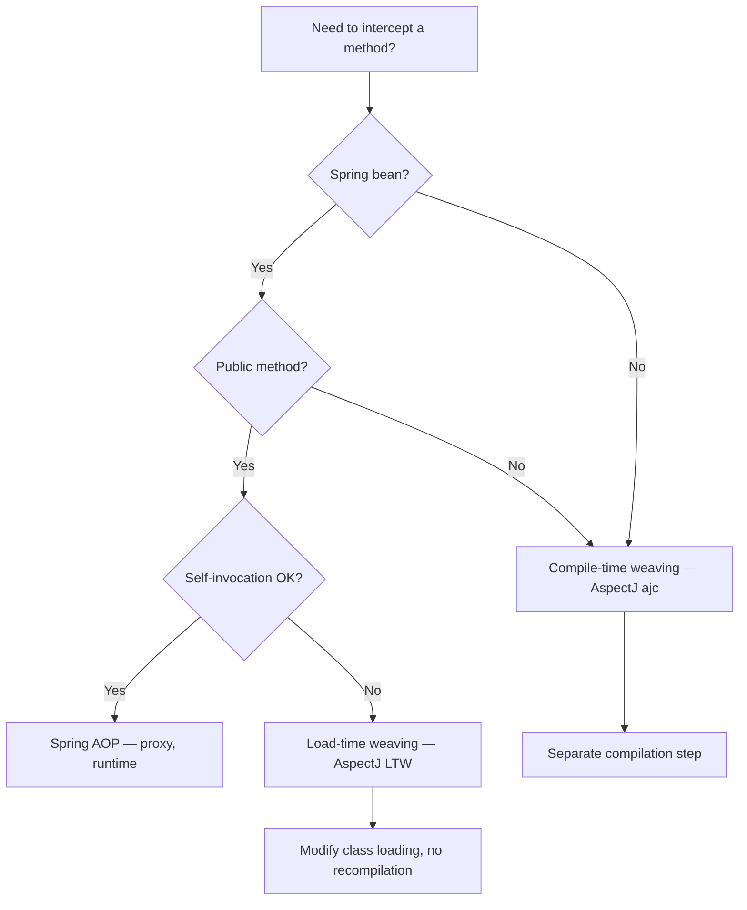
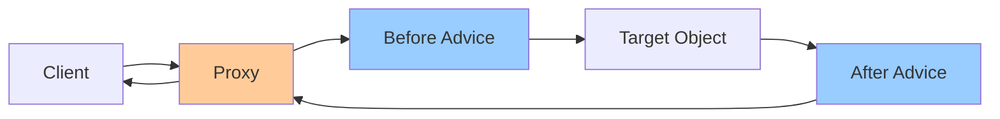
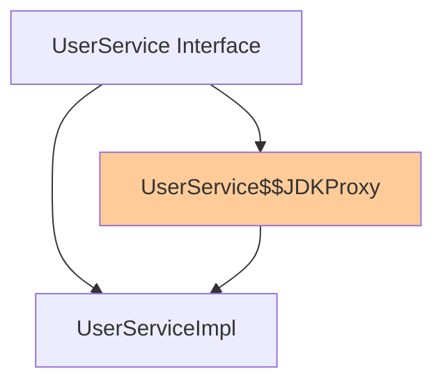
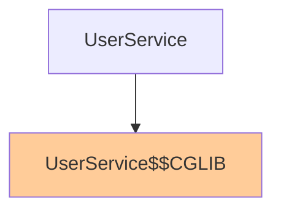
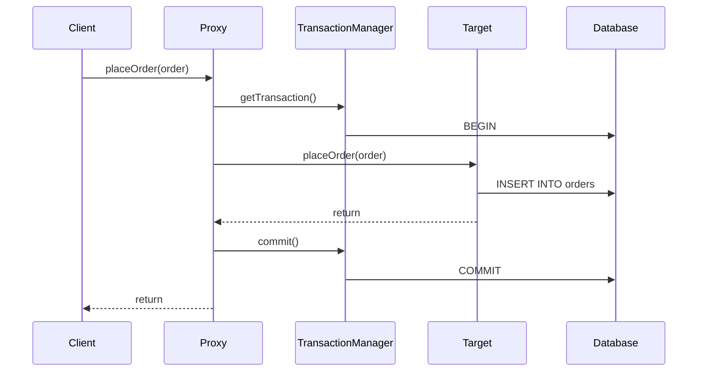
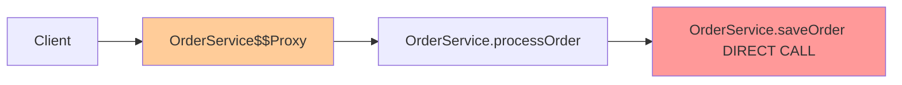

# AOP, Proxies, and Internals

> [!tip] Quick Reference
> See [[SpringBoot/00_Cheat_Sheets]] for AOP/transactions/proxy behavior reminders.

## Overview

Aspect-Oriented Programming (AOP) is a programming paradigm that allows you to modularize cross-cutting concerns (logging, security, transactions) separately from business logic. Spring AOP is heavily used internally for features like `@Transactional`, `@Async`, `@Cacheable`, and security annotations.

> [!summary] Goal
> Understand how Spring AOP works using proxies, recognize when proxy-based behavior causes issues (self-invocation), and learn debugging techniques for proxy-related problems.

---

## What is AOP?

### The Problem: Cross-Cutting Concerns

Without AOP, cross-cutting concerns (logging, security, transactions) are scattered across your codebase:

```java
public class UserService {
    
    public void createUser(User user) {
        // Security check (cross-cutting concern)
        if (!SecurityContext.hasRole("ADMIN")) {
            throw new AccessDeniedException();
        }
        
        // Transaction management (cross-cutting concern)
        TransactionStatus tx = transactionManager.getTransaction();
        try {
            // Logging (cross-cutting concern)
            logger.info("Creating user: {}", user);
            
            // ACTUAL BUSINESS LOGIC
            userRepository.save(user);
            
            // More logging (cross-cutting concern)
            logger.info("User created successfully");
            
            transactionManager.commit(tx);
        } catch (Exception e) {
            transactionManager.rollback(tx);
            throw e;
        }
    }
}
```

**Problems**:
- Business logic is buried in infrastructure code
- Code duplication across all service methods
- Hard to change cross-cutting behavior

### The Solution: AOP

With AOP, cross-cutting concerns are modularized into **aspects**:

```java
@Service
public class UserService {
    
    @Transactional
    @PreAuthorize("hasRole('ADMIN')")
    @Loggable
    public void createUser(User user) {
        // ONLY BUSINESS LOGIC
        userRepository.save(user);
    }
}
```

The framework automatically weaves in transaction management, security checks, and logging.

---

## Core AOP Concepts

### 1. Aspect

A module that encapsulates a cross-cutting concern.

```java
@Aspect
@Component
public class LoggingAspect {
    // Contains advice methods
}
```

### 2. Join Point

A point in program execution where an aspect can be applied (method execution, field access, etc.). In Spring AOP, **join points are always method executions**.

### 3. Pointcut

An expression that selects which join points to apply advice to.

```java
@Pointcut("execution(* com.example.service.*.*(..))")
public void serviceLayerMethods() {}
```

**Pointcut expression syntax**:
```
execution(modifiers? return-type declaring-type? method-name(params) throws?)
```

### 4. Advice

The action taken at a join point. Types:
- `@Before`: Before method execution
- `@After`: After method execution (finally block)
- `@AfterReturning`: After method returns successfully
- `@AfterThrowing`: After method throws exception
- `@Around`: Wraps method execution (most powerful)

### 5. Weaving

The process of applying aspects to target objects. Spring AOP uses **runtime weaving** with proxies.

---

## Spring AOP Annotations

### @Aspect

Marks a class as an aspect:

```java
@Aspect
@Component  // Must be a Spring bean
@Slf4j
public class PerformanceMonitoringAspect {
    // Advice methods here
}
```

### @Before

Executes before the target method:

```java
@Aspect
@Component
@Slf4j
public class LoggingAspect {
    
    @Before("execution(* com.example.service.*.*(..))")
    public void logMethodEntry(JoinPoint joinPoint) {
        String methodName = joinPoint.getSignature().getName();
        String className = joinPoint.getTarget().getClass().getSimpleName();
        Object[] args = joinPoint.getArgs();
        
        log.info("Entering {}.{} with args: {}", className, methodName, Arrays.toString(args));
    }
}
```

**Use cases**: Logging, security checks, validation

### @After

Executes after method completes (like finally block):

```java
@After("execution(* com.example.service.*.*(..))")
public void cleanup(JoinPoint joinPoint) {
    log.info("Cleaning up after {}", joinPoint.getSignature().getName());
    // Always executes (success or exception)
}
```

### @AfterReturning

Executes only if method returns successfully:

```java
@AfterReturning(
    pointcut = "execution(* com.example.service.*.*(..))",
    returning = "result"
)
public void logMethodReturn(JoinPoint joinPoint, Object result) {
    log.info("{} returned: {}", joinPoint.getSignature().getName(), result);
}
```

### @AfterThrowing

Executes only if method throws an exception:

```java
@AfterThrowing(
    pointcut = "execution(* com.example.service.*.*(..))",
    throwing = "ex"
)
public void logException(JoinPoint joinPoint, Exception ex) {
    log.error("{} threw exception: {}", joinPoint.getSignature().getName(), ex.getMessage());
    // Could also send to error tracking service
}
```

### @Around (Most Powerful)

Wraps the entire method execution:

```java
@Around("execution(* com.example.service.*.*(..))")
public Object measurePerformance(ProceedingJoinPoint pjp) throws Throwable {
    String methodName = pjp.getSignature().getName();
    
    long startTime = System.currentTimeMillis();
    
    try {
        // MUST call proceed() to execute the actual method
        Object result = pjp.proceed();
        
        long duration = System.currentTimeMillis() - startTime;
        log.info("{} took {} ms", methodName, duration);
        
        return result;
    } catch (Throwable ex) {
        long duration = System.currentTimeMillis() - startTime;
        log.error("{} failed after {} ms", methodName, duration);
        throw ex;
    }
}
```

**Use cases**: Performance monitoring, caching, retries, transaction management

**WARNING**: Always call `proceed()` or the target method won't execute!

---

## Pointcut Expressions

### Execution Patterns

```java
// All methods in service package
@Pointcut("execution(* com.example.service.*.*(..))")

// All methods returning User
@Pointcut("execution(com.example.model.User com.example..*.*(..))")

// All methods starting with 'save'
@Pointcut("execution(* save*(..))")

// All methods with single String parameter
@Pointcut("execution(* *(String))")

// All methods with any number of parameters
@Pointcut("execution(* *(..))")

// All public methods
@Pointcut("execution(public * *(..))")
```

### Within Patterns

```java
// All methods within UserService class
@Pointcut("within(com.example.service.UserService)")

// All methods within service package
@Pointcut("within(com.example.service..*)")
```

### Annotation-Based Pointcuts

```java
// All methods annotated with @Transactional
@Pointcut("@annotation(org.springframework.transaction.annotation.Transactional)")

// All methods in classes annotated with @RestController
@Pointcut("@within(org.springframework.web.bind.annotation.RestController)")

// All methods with parameters annotated with @Valid
@Pointcut("@args(jakarta.validation.Valid)")
```

### Combining Pointcuts

```java
@Aspect
@Component
public class CombinedAspect {
    
    @Pointcut("execution(* com.example.service.*.*(..))")
    public void serviceMethods() {}
    
    @Pointcut("execution(* com.example.repository.*.*(..))")
    public void repositoryMethods() {}
    
    // AND: Both conditions must match
    @Pointcut("serviceMethods() && @annotation(org.springframework.transaction.annotation.Transactional)")
    public void transactionalServiceMethods() {}
    
    // OR: Either condition can match
    @Pointcut("serviceMethods() || repositoryMethods()")
    public void dataAccessMethods() {}
    
    // NOT: Exclude matching methods
    @Pointcut("serviceMethods() && !execution(* get*(..))")
    public void nonGetterServiceMethods() {}
    
    @Before("transactionalServiceMethods()")
    public void beforeTransactionalService(JoinPoint joinPoint) {
        log.info("Transactional service method: {}", joinPoint.getSignature());
    }
}
```

### `args()` — Match by Argument Type

Captures join points where the method has specific argument types:

```java
@Pointcut("args(com.example.User, ..)")
public void userArgMethod() {}

// Combined with execution:
@Around("execution(* com.example.service.*.*(..)) && args(user, ..)")
public Object auditUserAccess(ProceedingJoinPoint pjp, User user) throws Throwable {
    log.info("User '{}' accessing {}", user.email(), pjp.getSignature().getName());
    return pjp.proceed();
}
```

The `args()` designator binds the actual argument value to the advice method parameter — Spring AOP automatically passes it.

### `bean()` — Match by Bean Name

Spring-specific pointcut (not available in AspectJ compile-time weaving):

```java
// Match specific bean name
@Pointcut("bean(userService)")
public void userServiceBean() {}

// Match by pattern
@Pointcut("bean(*Service)")
public void allServiceBeans() {}

@Around("userServiceBean() && execution(* find*(..))")
public Object auditFindMethods(ProceedingJoinPoint pjp) throws Throwable {
    log.info("find method called on userService");
    return pjp.proceed();
}
```

### Complete pointcut designator reference

| Designator | Description | Example |
|------------|-------------|---------|
| `execution()` | Method execution pattern | `execution(* service.*.*(..))` |
| `within()` | Matches all methods in a type | `within(com.example.service.*)` |
| `@annotation()` | Matches methods with the annotation | `@annotation(Transactional)` |
| `@within()` | Matches types with the annotation | `@within(Transactional)` |
| `@args()` | Matches by annotation on parameter types | `@args(Validated)` |
| `args()` | Matches by parameter types | `args(User, ..)` |
| `bean()` | Matches by bean name (Spring-only) | `bean(*Service)` |
| `target()` | Matches by target object type | `target(com.example.MyService)` |
| `this()` | Matches by proxy object type | `this(com.example.MyInterface)` |

---

## Spring AOP vs AspectJ

Spring AOP is proxy-based. AspectJ is a full AOP framework with compile-time and load-time weaving.



### Differences

| Aspect | Spring AOP | AspectJ |
|--------|-----------|---------|
| **Weaving** | Runtime (proxy creation) | Compile-time, load-time, or runtime |
| **Targets** | Spring beans only | Any Java class |
| **Methods** | Public only | Any visibility |
| **Self-invocation** | ❌ Bypasses proxy | ✅ Intercepted |
| **Constructors** | ❌ | ✅ Intercepted |
| **Field access** | ❌ | ✅ Intercepted |
| **`final` classes/methods** | ❌ Can't proxy | ✅ Weave directly |
| **Performance** | Slight overhead per proxied call | No runtime overhead (compile-time) |
| **Configuration** | `@EnableAspectJAutoProxy`, auto-config | Compiler plugin (`ajc`) or JVM agent (`-javaagent`) |
| **When to use** | 95% of use cases (logging, metrics, transactions, security) | Constructor interception, self-invocation, non-Spring classes, `final` types |

```java
// Spring AOP — proxy-based, simple
@Aspect @Component
public class LoggingAspect {
    @Around("execution(* com.example.service.*.*(..))")
    public Object log(ProceedingJoinPoint pjp) { return pjp.proceed(); }
}

// AspectJ (compile-time) — any class, any method
public aspect LoggingAspectJ {
    pointcut allServiceMethods(): execution(* com.example..*.*(..));
    before(): allServiceMethods() {
        System.out.println("Before: " + thisJoinPoint);
    }
}
```

---

## How Spring AOP Works: Proxies

### Proxy Pattern

Spring AOP is **proxy-based**. When you annotate a bean with `@Transactional`, `@Async`, etc., Spring creates a **proxy** that wraps your bean:



**What the proxy does**:
1. Intercept method calls
2. Execute `@Before` advice
3. Call the actual method on the target object
4. Execute `@After` advice
5. Return result to caller

### Proxy Creation Example

```java
@Service
public class UserService {
    
    @Transactional
    public void createUser(User user) {
        userRepository.save(user);
    }
}
```

**At runtime, Spring creates a proxy**:

```java
// Simplified proxy (generated by Spring)
public class UserService$$Proxy extends UserService {
    
    private UserService target;
    private TransactionInterceptor txInterceptor;
    
    @Override
    public void createUser(User user) {
        // 1. Start transaction (Before advice)
        TransactionStatus tx = txInterceptor.beginTransaction();
        
        try {
            // 2. Call actual method
            target.createUser(user);
            
            // 3. Commit transaction (After advice)
            txInterceptor.commit(tx);
        } catch (Exception e) {
            // 4. Rollback on exception
            txInterceptor.rollback(tx);
            throw e;
        }
    }
}
```

---

## Proxy Types: JDK Dynamic Proxy vs CGLIB

Spring uses two proxy mechanisms depending on whether your bean implements an interface.

### JDK Dynamic Proxy

**When used**: Bean implements at least one interface

```java
public interface UserService {
    void createUser(User user);
}

@Service
public class UserServiceImpl implements UserService {
    
    @Transactional
    @Override
    public void createUser(User user) {
        userRepository.save(user);
    }
}
```

**How it works**: JDK creates a proxy that implements the same interface.



**Characteristics**:
- Fast proxy creation
- Smaller memory footprint
- Only works with interfaces
- Methods not in interface cannot be proxied

### CGLIB Proxy

**When used**: Bean does NOT implement an interface

```java
@Service
public class UserService {  // No interface
    
    @Transactional
    public void createUser(User user) {
        userRepository.save(user);
    }
}
```

**How it works**: CGLIB creates a subclass that extends your class.



**Characteristics**:
- Slower proxy creation (bytecode generation)
- Works without interfaces
- Cannot proxy final classes
- Cannot proxy final methods
- Cannot proxy private methods

### Comparison Table

| Feature | JDK Dynamic Proxy | CGLIB Proxy |
|---------|-------------------|-------------|
| **Requires interface** | Yes | No |
| **Proxy creation speed** | Fast | Slower (bytecode generation) |
| **Runtime performance** | Same | Same |
| **Can proxy final classes** | N/A | No |
| **Can proxy final methods** | N/A | No |
| **Can proxy private methods** | No | No |
| **Memory usage** | Lower | Higher |
| **Spring Boot default** | Used if interface exists | Used if no interface |

### Force CGLIB Proxies

```yaml
# application.yml
spring:
  aop:
    proxy-target-class: true  # Force CGLIB even with interfaces
```

---

## How @Transactional Works Under the Hood

### The Transaction Proxy

```java
@Service
public class OrderService {
    
    @Autowired
    private OrderRepository orderRepository;
    
    @Transactional
    public void placeOrder(Order order) {
        orderRepository.save(order);
        // Transaction committed here
    }
}
```

**What Spring generates (simplified)**:

```java
public class OrderService$$Proxy extends OrderService {
    
    private OrderService target;
    private PlatformTransactionManager txManager;
    
    @Override
    public void placeOrder(Order order) {
        TransactionStatus tx = null;
        try {
            // 1. Begin transaction
            tx = txManager.getTransaction(new DefaultTransactionDefinition());
            
            // 2. Call actual method
            target.placeOrder(order);
            
            // 3. Commit if no exception
            txManager.commit(tx);
        } catch (RuntimeException | Error ex) {
            // 4. Rollback on runtime exception
            if (tx != null) {
                txManager.rollback(tx);
            }
            throw ex;
        }
    }
}
```

### Transaction Lifecycle



---

## How @Async Works Under the Hood

### The Async Proxy

```java
@Service
public class EmailService {
    
    @Async
    public void sendEmail(String to, String subject, String body) {
        // Executes in separate thread
        emailClient.send(to, subject, body);
    }
}
```

**What Spring generates (simplified)**:

```java
public class EmailService$$Proxy extends EmailService {
    
    private EmailService target;
    private Executor taskExecutor;  // Thread pool
    
    @Override
    public void sendEmail(String to, String subject, String body) {
        // Submit to thread pool instead of executing directly
        taskExecutor.execute(() -> {
            target.sendEmail(to, subject, body);
        });
        // Returns immediately (doesn't wait for completion)
    }
}
```

### Enable Async Support

```java
@Configuration
@EnableAsync
public class AsyncConfig implements AsyncConfigurer {
    
    @Override
    public Executor getAsyncExecutor() {
        ThreadPoolTaskExecutor executor = new ThreadPoolTaskExecutor();
        executor.setCorePoolSize(5);
        executor.setMaxPoolSize(10);
        executor.setQueueCapacity(100);
        executor.setThreadNamePrefix("async-");
        executor.initialize();
        return executor;
    }
    
    @Override
    public AsyncUncaughtExceptionHandler getAsyncUncaughtExceptionHandler() {
        return (ex, method, params) -> {
            log.error("Async method {} threw exception", method.getName(), ex);
        };
    }
}
```

---

## The Self-Invocation Problem

### What is Self-Invocation?

**Self-invocation** occurs when a method calls another method in the same class. This **bypasses the proxy**, so AOP advice doesn't execute.

### Example: The Problem

```java
@Service
public class OrderService {
    
    // NOT annotated with @Transactional
    public void processOrder(Order order) {
        validateOrder(order);
        saveOrder(order);  // Self-invocation - proxy bypassed!
    }
    
    @Transactional
    public void saveOrder(Order order) {
        orderRepository.save(order);
        // Transaction WILL NOT work when called from processOrder()!
    }
}
```

**Why it doesn't work**:



When `processOrder()` calls `saveOrder()`, it uses `this.saveOrder()`, which is a **direct method call** on the target object, not through the proxy.

### Detailed Explanation

```java
@Service
public class OrderService$$Proxy extends OrderService {
    
    private OrderService target;
    
    @Override
    public void processOrder(Order order) {
        // No @Transactional, just delegate
        target.processOrder(order);
    }
    
    @Override
    public void saveOrder(Order order) {
        // Transaction logic
        TransactionStatus tx = txManager.getTransaction(...);
        try {
            target.saveOrder(order);
            txManager.commit(tx);
        } catch (Exception e) {
            txManager.rollback(tx);
            throw e;
        }
    }
}

// The target object
public class OrderService {
    
    public void processOrder(Order order) {
        validateOrder(order);
        this.saveOrder(order);  // Calls target directly, not proxy!
    }
    
    @Transactional
    public void saveOrder(Order order) {
        orderRepository.save(order);
    }
}
```

### Solution 1: Move to Separate Bean (Recommended)

```java
@Service
public class OrderService {
    
    @Autowired
    private OrderPersistenceService persistenceService;
    
    public void processOrder(Order order) {
        validateOrder(order);
        persistenceService.saveOrder(order);  // Goes through proxy!
    }
}

@Service
public class OrderPersistenceService {
    
    @Autowired
    private OrderRepository orderRepository;
    
    @Transactional
    public void saveOrder(Order order) {
        orderRepository.save(order);
    }
}
```

**Pros**: Clean separation, follows Single Responsibility Principle
**Cons**: More classes

### Solution 2: Self-Inject (Hacky)

```java
@Service
public class OrderService {
    
    @Autowired
    private OrderService self;  // Injects the proxy!
    
    public void processOrder(Order order) {
        validateOrder(order);
        self.saveOrder(order);  // Goes through proxy
    }
    
    @Transactional
    public void saveOrder(Order order) {
        orderRepository.save(order);
    }
}
```

**Pros**: No extra classes
**Cons**: Confusing, circular dependency (works but ugly)

### Solution 3: AopContext (Not Recommended)

```java
@Service
public class OrderService {
    
    public void processOrder(Order order) {
        validateOrder(order);
        
        // Get proxy from AOP context
        OrderService proxy = (OrderService) AopContext.currentProxy();
        proxy.saveOrder(order);
    }
    
    @Transactional
    public void saveOrder(Order order) {
        orderRepository.save(order);
    }
}
```

**Enable AopContext**:
```java
@EnableAspectJAutoProxy(exposeProxy = true)
```

**Pros**: Works
**Cons**: Couples code to Spring AOP, harder to test, not thread-safe in all cases

### Solution 4: Make Outer Method Transactional

```java
@Service
public class OrderService {
    
    @Transactional  // Just annotate the public method
    public void processOrder(Order order) {
        validateOrder(order);
        saveOrder(order);  // Runs in same transaction
    }
    
    // Remove @Transactional (not needed)
    private void saveOrder(Order order) {
        orderRepository.save(order);
    }
}
```

**Pros**: Simplest solution
**Cons**: Only works if transactional behavior is desired for entire outer method

---

## Common Pitfalls and Solutions

### Pitfall 1: Final Classes/Methods

```java
@Service
public final class UserService {  // CGLIB cannot subclass final classes!
    
    @Transactional
    public void createUser(User user) {
        userRepository.save(user);
    }
}
```

**Error**:
```
Cannot subclass final class com.example.UserService
```

**Solution**: Remove `final` or use interface-based proxy:

```java
public interface UserService {
    void createUser(User user);
}

@Service
public final class UserServiceImpl implements UserService {
    
    @Transactional
    @Override
    public void createUser(User user) {
        userRepository.save(user);
    }
}
```

### Pitfall 2: Private Methods

```java
@Service
public class UserService {
    
    @Transactional
    private void createUser(User user) {  // Private methods cannot be proxied!
        userRepository.save(user);
    }
}
```

**Why it doesn't work**: Proxies override methods. Private methods cannot be overridden.

**Solution**: Make method public or package-private:

```java
@Service
public class UserService {
    
    @Transactional
    public void createUser(User user) {  // Public works
        userRepository.save(user);
    }
}
```

### Pitfall 3: Calling Proxied Method from Constructor

```java
@Service
public class UserService {
    
    public UserService() {
        // Proxy doesn't exist yet!
        initialize();  // @Transactional won't work
    }
    
    @Transactional
    public void initialize() {
        // Load initial data
    }
}
```

**Solution**: Use `@PostConstruct`:

```java
@Service
public class UserService {
    
    @PostConstruct  // Called after proxy creation
    public void init() {
        initialize();  // Now proxy exists
    }
    
    @Transactional
    public void initialize() {
        // Works correctly
    }
}
```

### Pitfall 4: @Async Returns Value (Wrong Return Type)

```java
@Service
public class EmailService {
    
    @Async
    public String sendEmail(String to) {  // WRONG: Returns String
        emailClient.send(to);
        return "Email sent";  // This value is lost!
    }
}
```

**Solution**: Return `void`, `Future`, or `CompletableFuture`:

```java
@Service
public class EmailService {
    
    @Async
    public CompletableFuture<String> sendEmail(String to) {
        emailClient.send(to);
        return CompletableFuture.completedFuture("Email sent");
    }
}

// Usage
CompletableFuture<String> future = emailService.sendEmail("user@example.com");
String result = future.get();  // Blocks until complete
```

---

## Proxy Debugging Techniques

### 1. Check if Bean is Proxied

```java
@RestController
public class DebugController {
    
    @Autowired
    private UserService userService;
    
    @GetMapping("/debug/proxy")
    public String checkProxy() {
        Class<?> clazz = userService.getClass();
        
        boolean isProxy = AopUtils.isAopProxy(userService);
        boolean isJdkProxy = AopUtils.isJdkDynamicProxy(userService);
        boolean isCglibProxy = AopUtils.isCglibProxy(userService);
        
        return String.format(
            "Class: %s\nIs Proxy: %s\nJDK Proxy: %s\nCGLIB Proxy: %s",
            clazz.getName(), isProxy, isJdkProxy, isCglibProxy
        );
    }
}
```

**Output**:
```
Class: com.example.UserService$$EnhancerBySpringCGLIB$$12345678
Is Proxy: true
JDK Proxy: false
CGLIB Proxy: true
```

### 2. Enable AOP Debug Logging

```yaml
# application.yml
logging:
  level:
    org.springframework.aop: DEBUG
    org.springframework.transaction: DEBUG
```

**Sample output**:
```
DEBUG o.s.aop.framework.CglibAopProxy: Creating CGLIB proxy for UserService
DEBUG o.s.transaction.interceptor.TransactionInterceptor: Getting transaction for [UserService.createUser]
DEBUG o.s.transaction.interceptor.TransactionInterceptor: Completing transaction for [UserService.createUser]
```

### 3. Use Actuator to Inspect Beans

```yaml
# application.yml
management:
  endpoints:
    web:
      exposure:
        include: beans
```

**Request**:
```bash
curl http://localhost:8080/actuator/beans | jq '.contexts.application.beans.userService'
```

**Response**:
```json
{
  "scope": "singleton",
  "type": "com.example.UserService$$EnhancerBySpringCGLIB$$12345678",
  "dependencies": ["userRepository"]
}
```

### 4. Use Debugger to Inspect Proxy

Set breakpoint in your code and inspect variables:

```java
@Service
public class UserService {
    
    public void test() {
        System.out.println(this.getClass());  // Set breakpoint here
        // Inspect 'this' - you'll see it's a CGLIB proxy
    }
}
```

In debugger:
```
this = UserService$$EnhancerBySpringCGLIB$$12345678@4f8e5cde
  $$beanFactory = org.springframework...
  CGLIB$CALLBACK_0 = DynamicAdvisedInterceptor@...
  target = UserService@...  // The actual target object
```

---

## Performance Implications

### Proxy Creation Cost

**CGLIB proxies** have higher creation cost than JDK proxies:

- **JDK Proxy**: ~0.1ms per proxy
- **CGLIB Proxy**: ~1-5ms per proxy (bytecode generation)

**Impact**: Noticeable on application startup with many beans, negligible at runtime.

### Runtime Performance

**Method invocation overhead**:

- **Direct call**: 0ns
- **JDK Proxy**: ~10-20ns overhead
- **CGLIB Proxy**: ~10-20ns overhead

**Conclusion**: Runtime performance difference is negligible (nanoseconds).

### Memory Overhead

Each proxy holds references to:
- Target object
- Advisors/interceptors
- CGLIB-generated bytecode (for CGLIB proxies)

**Estimate**: ~1-5KB per proxy

**Impact**: Minimal unless you have thousands of proxied beans.

---

## When to Use AOP vs Alternative Patterns

### Use AOP When:

✅ **Cross-cutting concerns** that apply to many methods
- Logging, security, transactions, caching, retries

✅ **Declarative behavior** is preferred
- `@Transactional` is cleaner than manual transaction management

✅ **Separation of concerns** is important
- Keep business logic separate from infrastructure

### Use Alternatives When:

❌ **Performance is critical** (hot path)
- AOP adds nanoseconds, but in tight loops it can add up
- Consider manual implementation for performance-critical code

❌ **Behavior is specific to one method**
- No point in creating an aspect for one-off logic

❌ **Testing complexity** outweighs benefits
- Proxies can make testing harder (mocking, dependency injection)

### Alternative Patterns

#### Decorator Pattern

```java
public interface UserService {
    void createUser(User user);
}

@Component
public class UserServiceImpl implements UserService {
    
    @Override
    public void createUser(User user) {
        userRepository.save(user);
    }
}

@Component
@Primary
public class TransactionalUserService implements UserService {
    
    private final UserService delegate;
    private final PlatformTransactionManager txManager;
    
    public TransactionalUserService(UserServiceImpl delegate, PlatformTransactionManager txManager) {
        this.delegate = delegate;
        this.txManager = txManager;
    }
    
    @Override
    public void createUser(User user) {
        TransactionStatus tx = txManager.getTransaction(new DefaultTransactionDefinition());
        try {
            delegate.createUser(user);
            txManager.commit(tx);
        } catch (Exception e) {
            txManager.rollback(tx);
            throw e;
        }
    }
}
```

**Pros**: Explicit, easy to test, no magic
**Cons**: More boilerplate

#### Template Method Pattern

```java
@Service
public abstract class TransactionalService {
    
    @Autowired
    private PlatformTransactionManager txManager;
    
    protected <T> T executeInTransaction(Supplier<T> action) {
        TransactionStatus tx = txManager.getTransaction(new DefaultTransactionDefinition());
        try {
            T result = action.get();
            txManager.commit(tx);
            return result;
        } catch (Exception e) {
            txManager.rollback(tx);
            throw e;
        }
    }
}

@Service
public class UserService extends TransactionalService {
    
    public void createUser(User user) {
        executeInTransaction(() -> {
            userRepository.save(user);
            return null;
        });
    }
}
```

**Pros**: Explicit control flow, easy to debug
**Cons**: Inheritance-based (less flexible)

---

## Complete Example: Custom Logging Aspect

```java
package com.example.aspect;

import lombok.extern.slf4j.Slf4j;
import org.aspectj.lang.JoinPoint;
import org.aspectj.lang.ProceedingJoinPoint;
import org.aspectj.lang.annotation.*;
import org.springframework.stereotype.Component;

import java.util.Arrays;

/**
 * Aspect for logging method execution details.
 * 
 * Applied to all methods in the service layer.
 */
@Aspect
@Component
@Slf4j
public class LoggingAspect {
    
    /**
     * Pointcut for all service layer methods
     */
    @Pointcut("execution(* com.example.service..*.*(..))")
    public void serviceMethods() {}
    
    /**
     * Log method entry with arguments
     */
    @Before("serviceMethods()")
    public void logMethodEntry(JoinPoint joinPoint) {
        String className = joinPoint.getTarget().getClass().getSimpleName();
        String methodName = joinPoint.getSignature().getName();
        Object[] args = joinPoint.getArgs();
        
        log.info("[ENTRY] {}.{} called with args: {}", 
            className, methodName, Arrays.toString(args));
    }
    
    /**
     * Log method return with result
     */
    @AfterReturning(pointcut = "serviceMethods()", returning = "result")
    public void logMethodReturn(JoinPoint joinPoint, Object result) {
        String methodName = joinPoint.getSignature().getName();
        log.info("[RETURN] {} returned: {}", methodName, result);
    }
    
    /**
     * Log exceptions
     */
    @AfterThrowing(pointcut = "serviceMethods()", throwing = "ex")
    public void logException(JoinPoint joinPoint, Exception ex) {
        String methodName = joinPoint.getSignature().getName();
        log.error("[ERROR] {} threw exception: {}", methodName, ex.getMessage(), ex);
    }
    
    /**
     * Measure execution time
     */
    @Around("serviceMethods()")
    public Object measureExecutionTime(ProceedingJoinPoint pjp) throws Throwable {
        String methodName = pjp.getSignature().toShortString();
        
        long startTime = System.currentTimeMillis();
        
        try {
            Object result = pjp.proceed();
            
            long duration = System.currentTimeMillis() - startTime;
            
            if (duration > 1000) {
                log.warn("[SLOW] {} took {} ms", methodName, duration);
            } else {
                log.debug("[PERF] {} took {} ms", methodName, duration);
            }
            
            return result;
        } catch (Throwable ex) {
            long duration = System.currentTimeMillis() - startTime;
            log.error("[FAILED] {} failed after {} ms", methodName, duration);
            throw ex;
        }
    }
}
```

**Usage**:

```java
@Service
public class UserService {
    
    public User createUser(User user) {
        // No logging code needed - aspect handles it
        return userRepository.save(user);
    }
}
```

**Log output**:
```
INFO  [ENTRY] UserService.createUser called with args: [User(id=null, email=test@example.com)]
DEBUG [PERF] UserService.createUser(..) took 45 ms
INFO  [RETURN] createUser returned: User(id=1, email=test@example.com)
```

---

> [!question]- Interview Questions
> 
> **Q: What is AOP and why is it useful?**
> A: AOP modularizes cross-cutting concerns (logging, security, transactions) separately from business logic. It reduces duplication and keeps service code focused.
> 
> **Q: How does Spring AOP work internally?**
> A: Spring applies advice via a proxy that wraps your bean. The proxy intercepts method calls and runs advice before/after/around the target method.
> 
> **Q: What is the difference between JDK dynamic proxies and CGLIB proxies?**
> A: JDK proxies require an interface and proxy the interface. CGLIB creates a subclass of the concrete class. Final classes/methods can’t be proxied with CGLIB.
> 
> **Q: What is the self-invocation problem? How do you solve it?**
> A: Calls within the same class bypass the proxy, so advice like `@Transactional` may not run.
> Solutions: move the advised method to another bean (preferred), make the entry method transactional (if valid), or use more advanced patterns (generally avoid `AopContext.currentProxy()`).
> 
> **Q: Why can’t private methods be proxied?**
> A: Proxying relies on overriding/intercepting method calls; private methods can’t be overridden.
> 
> **Q: What are the different advice types in Spring AOP?**
> A: `@Before`, `@After`, `@AfterReturning`, `@AfterThrowing`, `@Around`.
> 
> **Q: How does `@Transactional` work under the hood?**
> A: The transactional proxy starts a transaction before method execution and commits/rolls back based on outcome and rollback rules.
> 
> **Q: What happens if you return a plain value from an `@Async` method?**
> A: The caller won’t receive it. Use `void`, `Future<T>`, or `CompletableFuture<T>` for async results.

---

## Cross-Links

- **Transactions**: [[SpringBoot/02_Core/02_Transactions_and_Propagation]]
- **Auto-configuration**: [[SpringBoot/03_Advanced/03_AutoConfiguration_Internals]]
- **Debugging**: [[SpringBoot/03_Advanced/05_Debugging_and_Troubleshooting]]
- **Transaction playbook**: [[SpringBoot/04_Playbooks/03_Debug_Transactions_and_Locks]]

---

## References

- [Spring AOP Documentation](https://docs.spring.io/spring-framework/reference/core/aop.html)
- [AspectJ Pointcut Syntax](https://www.eclipse.org/aspectj/doc/released/progguide/semantics-pointcuts.html)
- [Spring AOP vs AspectJ](https://docs.spring.io/spring-framework/reference/core/aop/ataspectj.html)
- [Proxy Mechanism Details](https://docs.spring.io/spring-framework/reference/core/aop/proxying.html)
