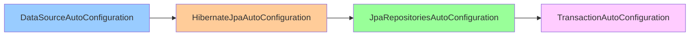

# Auto-Configuration Internals

> [!tip] Quick Reference
> See [[SpringBoot/00_Cheat_Sheets]] for common auto-config switches and debugging toggles.

## Overview

Spring Boot's auto-configuration is the "magic" that makes Spring Boot applications work with minimal configuration. It automatically configures beans based on classpath dependencies, environment properties, and existing beans. Understanding how auto-configuration works is critical for debugging, customization, and creating your own starters.

> [!summary] Goal
> Understand how Spring Boot auto-configuration works internally, debug configuration issues, create custom auto-configurations, and troubleshoot bean creation problems.

---

## What is Auto-Configuration?

### The Problem: Spring XML Configuration Hell

**Traditional Spring (pre-Boot)**:

```xml
<!-- applicationContext.xml -->
<beans>
    <bean id="dataSource" class="org.apache.commons.dbcp.BasicDataSource">
        <property name="driverClassName" value="org.postgresql.Driver"/>
        <property name="url" value="jdbc:postgresql://localhost:5432/mydb"/>
        <property name="username" value="user"/>
        <property name="password" value="password"/>
    </bean>
    
    <bean id="entityManagerFactory" class="org.springframework.orm.jpa.LocalContainerEntityManagerFactoryBean">
        <property name="dataSource" ref="dataSource"/>
        <property name="packagesToScan" value="com.example.model"/>
        <property name="jpaVendorAdapter">
            <bean class="org.springframework.orm.jpa.vendor.HibernateJpaVendorAdapter"/>
        </property>
    </bean>
    
    <bean id="transactionManager" class="org.springframework.orm.jpa.JpaTransactionManager">
        <property name="entityManagerFactory" ref="entityManagerFactory"/>
    </bean>
    
    <!-- ... 100+ more lines ... -->
</beans>
```

**Problems**:
- Boilerplate configuration for common use cases
- Easy to misconfigure
- Hard to understand what's actually configured

### The Solution: Auto-Configuration

**Spring Boot**:

```yaml
# application.yml
spring:
  datasource:
    url: jdbc:postgresql://localhost:5432/mydb
    username: user
    password: password
```

**That's it!** Spring Boot auto-configures:
- DataSource
- EntityManagerFactory
- TransactionManager
- JPA repositories
- Connection pooling (HikariCP)
- Transaction advisor
- And more...

---

## How Auto-Configuration Works

### High-Level Flow

```mermaid
graph TB
    A[@SpringBootApplication] --> B[@EnableAutoConfiguration]
    B --> C[AutoConfigurationImportSelector]
    C --> D[Read META-INF/spring/org.springframework.boot.autoconfigure.AutoConfiguration.imports]
    D --> E[Load Auto-Configuration Classes]
    E --> F[Evaluate @Conditional Annotations]
    F --> G{Condition Met?}
    G -->|Yes| H[Register Beans]
    G -->|No| I[Skip Configuration]
    
    style B fill:#99ccff
    style F fill:#ffcc99
    style H fill:#99ff99
```

### @SpringBootApplication Deep Dive

```java
@SpringBootApplication
public class MyApplication {
    public static void main(String[] args) {
        SpringApplication.run(MyApplication.class, args);
    }
}
```

**@SpringBootApplication is a meta-annotation**:

```java
@Target(ElementType.TYPE)
@Retention(RetentionPolicy.RUNTIME)
@Documented
@Inherited
@SpringBootConfiguration  // Same as @Configuration
@EnableAutoConfiguration  // ← The magic!
@ComponentScan(excludeFilters = {
    @Filter(type = FilterType.CUSTOM, classes = TypeExcludeFilter.class),
    @Filter(type = FilterType.CUSTOM, classes = AutoConfigurationExcludeFilter.class)
})
public @interface SpringBootApplication {
    // ...
}
```

### @EnableAutoConfiguration

```java
@Target(ElementType.TYPE)
@Retention(RetentionPolicy.RUNTIME)
@Documented
@Inherited
@AutoConfigurationPackage
@Import(AutoConfigurationImportSelector.class)  // ← Imports auto-configuration classes
public @interface EnableAutoConfiguration {
    
    String ENABLED_OVERRIDE_PROPERTY = "spring.boot.enableautoconfiguration";
    
    Class<?>[] exclude() default {};
    
    String[] excludeName() default {};
}
```

**What it does**:
1. Imports `AutoConfigurationImportSelector`
2. Allows excluding specific auto-configurations
3. Can be disabled globally with `spring.boot.enableautoconfiguration=false`

---

## AutoConfigurationImportSelector

### Source Code (Simplified)

```java
public class AutoConfigurationImportSelector implements DeferredImportSelector {
    
    @Override
    public String[] selectImports(AnnotationMetadata annotationMetadata) {
        if (!isEnabled(annotationMetadata)) {
            return NO_IMPORTS;
        }
        
        // 1. Load auto-configuration classes from META-INF
        AutoConfigurationEntry autoConfigurationEntry = getAutoConfigurationEntry(annotationMetadata);
        
        // 2. Return class names to import
        return StringUtils.toStringArray(autoConfigurationEntry.getConfigurations());
    }
    
    protected AutoConfigurationEntry getAutoConfigurationEntry(AnnotationMetadata annotationMetadata) {
        // 1. Check if auto-configuration is enabled
        if (!isEnabled(annotationMetadata)) {
            return EMPTY_ENTRY;
        }
        
        // 2. Get excluded classes from @EnableAutoConfiguration
        AnnotationAttributes attributes = getAttributes(annotationMetadata);
        
        // 3. Load configurations from META-INF/spring/...
        List<String> configurations = getCandidateConfigurations(annotationMetadata, attributes);
        
        // 4. Remove duplicates
        configurations = removeDuplicates(configurations);
        
        // 5. Remove excluded configurations
        Set<String> exclusions = getExclusions(annotationMetadata, attributes);
        configurations.removeAll(exclusions);
        
        // 6. Filter using AutoConfigurationImportFilter
        configurations = getConfigurationClassFilter().filter(configurations);
        
        // 7. Fire auto-configuration import events
        fireAutoConfigurationImportEvents(configurations, exclusions);
        
        return new AutoConfigurationEntry(configurations, exclusions);
    }
    
    protected List<String> getCandidateConfigurations(
        AnnotationMetadata metadata, 
        AnnotationAttributes attributes
    ) {
        // Read from META-INF/spring/org.springframework.boot.autoconfigure.AutoConfiguration.imports
        List<String> configurations = SpringFactoriesLoader.loadFactoryNames(
            getSpringFactoriesLoaderFactoryClass(), 
            getBeanClassLoader()
        );
        
        Assert.notEmpty(configurations, 
            "No auto configuration classes found in META-INF/spring.factories");
        
        return configurations;
    }
}
```

---

## META-INF/spring.factories (Spring Boot 2.x)

### Location

```
src/main/resources/META-INF/spring.factories
```

### Example (from spring-boot-autoconfigure JAR)

```properties
# Auto Configure
org.springframework.boot.autoconfigure.EnableAutoConfiguration=\
org.springframework.boot.autoconfigure.admin.SpringApplicationAdminJmxAutoConfiguration,\
org.springframework.boot.autoconfigure.aop.AopAutoConfiguration,\
org.springframework.boot.autoconfigure.cache.CacheAutoConfiguration,\
org.springframework.boot.autoconfigure.data.jpa.JpaRepositoriesAutoConfiguration,\
org.springframework.boot.autoconfigure.jdbc.DataSourceAutoConfiguration,\
org.springframework.boot.autoconfigure.jdbc.DataSourceTransactionManagerAutoConfiguration,\
org.springframework.boot.autoconfigure.orm.jpa.HibernateJpaAutoConfiguration,\
org.springframework.boot.autoconfigure.transaction.TransactionAutoConfiguration,\
org.springframework.boot.autoconfigure.web.servlet.WebMvcAutoConfiguration,\
... (100+ more)
```

**How it works**:
- Spring Boot reads this file at startup
- Each class is evaluated for conditional registration
- Classes with met conditions are instantiated and beans registered

---

## META-INF/spring/ (Spring Boot 3.x)

### New Format (Spring Boot 3.0+)

In Spring Boot 3.x, `spring.factories` is replaced with dedicated import files:

```
src/main/resources/META-INF/spring/org.springframework.boot.autoconfigure.AutoConfiguration.imports
```

### Example

```
# org.springframework.boot.autoconfigure.AutoConfiguration.imports
org.springframework.boot.autoconfigure.admin.SpringApplicationAdminJmxAutoConfiguration
org.springframework.boot.autoconfigure.aop.AopAutoConfiguration
org.springframework.boot.autoconfigure.cache.CacheAutoConfiguration
org.springframework.boot.autoconfigure.data.jpa.JpaRepositoriesAutoConfiguration
org.springframework.boot.autoconfigure.jdbc.DataSourceAutoConfiguration
org.springframework.boot.autoconfigure.orm.jpa.HibernateJpaAutoConfiguration
```

**Benefits**:
- Cleaner (one class per line, no backslashes)
- Faster parsing
- Better IDE support

---

## @Conditional Annotations

### Overview

Auto-configuration classes use `@Conditional` annotations to conditionally register beans based on:
- Classpath (is a library present?)
- Beans (is a bean already defined?)
- Properties (is a property set?)
- Resources (does a file exist?)
- Environment (which profile is active?)

### Core @Conditional Annotations

#### @ConditionalOnClass

**Registers bean only if class is on classpath**:

```java
@Configuration
@ConditionalOnClass(DataSource.class)  // Only if javax.sql.DataSource is on classpath
public class DataSourceAutoConfiguration {
    
    @Bean
    public DataSource dataSource() {
        return new HikariDataSource();
    }
}
```

**How it works**:
- Checks if `DataSource.class` can be loaded
- If JDBC driver is not on classpath, skips this configuration

**Example**: Spring Boot only configures JPA if `EntityManager` is on classpath.

#### @ConditionalOnMissingClass

**Registers bean only if class is NOT on classpath**:

```java
@Configuration
@ConditionalOnMissingClass("org.thymeleaf.spring5.SpringTemplateEngine")
public class FreeMarkerAutoConfiguration {
    // Only configure FreeMarker if Thymeleaf is not present
}
```

#### @ConditionalOnBean

**Registers bean only if another bean exists**:

```java
@Configuration
public class MyAutoConfiguration {
    
    @Bean
    @ConditionalOnBean(DataSource.class)  // Only if DataSource bean exists
    public MyService myService(DataSource dataSource) {
        return new MyService(dataSource);
    }
}
```

**Use case**: Register beans that depend on other beans.

#### @ConditionalOnMissingBean

**Registers bean only if no bean of that type exists** (most common):

```java
@Configuration
public class DataSourceAutoConfiguration {
    
    @Bean
    @ConditionalOnMissingBean(DataSource.class)  // Only if user hasn't defined DataSource
    public DataSource dataSource() {
        return new HikariDataSource();  // Default
    }
}
```

**This is key to overriding defaults!**

**Example**: User can define their own `DataSource` bean, and Spring Boot won't create its default one.

#### @ConditionalOnProperty

**Registers bean only if property matches**:

```java
@Configuration
@ConditionalOnProperty(
    name = "spring.datasource.type",
    havingValue = "hikari",
    matchIfMissing = true  // Register if property is not set
)
public class HikariDataSourceConfiguration {
    
    @Bean
    public DataSource dataSource() {
        return new HikariDataSource();
    }
}
```

**Use cases**:
- Enable/disable features via properties
- Switch implementations based on config

#### @ConditionalOnResource

**Registers bean only if resource exists**:

```java
@Configuration
@ConditionalOnResource(resources = "classpath:schema.sql")
public class DataSourceInitializerConfiguration {
    // Only configure initializer if schema.sql exists
}
```

#### @ConditionalOnExpression

**Registers bean only if SpEL expression is true**:

```java
@Configuration
@ConditionalOnExpression("${myapp.feature.enabled:true} and ${myapp.env} == 'prod'")
public class FeatureConfiguration {
    // Complex conditional logic
}
```

#### @ConditionalOnWebApplication

**Registers bean only if web application**:

```java
@Configuration
@ConditionalOnWebApplication(type = ConditionalOnWebApplication.Type.SERVLET)
public class WebMvcAutoConfiguration {
    // Only for servlet-based web apps (not reactive)
}
```

**Types**:
- `SERVLET`: Spring MVC
- `REACTIVE`: Spring WebFlux
- `ANY`: Either

### Complete Example: DataSourceAutoConfiguration

```java
package org.springframework.boot.autoconfigure.jdbc;

import javax.sql.DataSource;

import com.zaxxer.hikari.HikariDataSource;
import org.springframework.boot.autoconfigure.AutoConfiguration;
import org.springframework.boot.autoconfigure.condition.*;
import org.springframework.boot.context.properties.EnableConfigurationProperties;
import org.springframework.context.annotation.Bean;
import org.springframework.context.annotation.Configuration;

/**
 * Auto-configuration for DataSource.
 * 
 * Conditions:
 * - DataSource.class is on classpath
 * - No DataSource bean is already defined
 * - spring.datasource.url property is set
 */
@AutoConfiguration
@ConditionalOnClass(DataSource.class)  // Requires JDBC on classpath
@ConditionalOnMissingBean(DataSource.class)  // User hasn't defined their own
@EnableConfigurationProperties(DataSourceProperties.class)  // Bind spring.datasource.*
public class DataSourceAutoConfiguration {
    
    @Configuration
    @ConditionalOnProperty(name = "spring.datasource.url")  // URL must be set
    static class PooledDataSourceConfiguration {
        
        @Bean
        @ConditionalOnMissingBean
        @ConditionalOnClass(HikariDataSource.class)  // HikariCP on classpath
        public DataSource hikariDataSource(DataSourceProperties properties) {
            HikariDataSource dataSource = new HikariDataSource();
            dataSource.setJdbcUrl(properties.getUrl());
            dataSource.setUsername(properties.getUsername());
            dataSource.setPassword(properties.getPassword());
            return dataSource;
        }
    }
}
```

**How it works**:
1. Check if `DataSource.class` is on classpath → Yes (JDBC dependency)
2. Check if user defined `DataSource` bean → No
3. Check if `spring.datasource.url` is set → Yes
4. Check if `HikariDataSource.class` is on classpath → Yes (default in Spring Boot)
5. Create `HikariDataSource` bean

---

## Auto-Configuration Order

### The Problem

Auto-configurations may depend on each other. For example:
- `JpaRepositoriesAutoConfiguration` needs `HibernateJpaAutoConfiguration`
- `HibernateJpaAutoConfiguration` needs `DataSourceAutoConfiguration`

### @AutoConfigureAfter

**Run this configuration AFTER another**:

```java
@AutoConfiguration
@AutoConfigureAfter(DataSourceAutoConfiguration.class)
public class HibernateJpaAutoConfiguration {
    // Runs AFTER DataSource is configured
}
```

### @AutoConfigureBefore

**Run this configuration BEFORE another**:

```java
@AutoConfiguration
@AutoConfigureBefore(HibernateJpaAutoConfiguration.class)
public class DataSourceAutoConfiguration {
    // Runs BEFORE JPA is configured
}
```

### @AutoConfigureOrder

**Set explicit order** (lower numbers run first):

```java
@AutoConfiguration
@AutoConfigureOrder(Ordered.HIGHEST_PRECEDENCE)
public class EarlyConfiguration {
    // Runs very early
}
```

### Example: JPA Configuration Order



---

## Creating Custom Auto-Configuration

### Use Case: Custom Audit Logger

Let's create an auto-configuration for an audit logging library.

### Step 1: Create the Library

**AuditLogger.java**:

```java
package com.example.audit;

import lombok.extern.slf4j.Slf4j;

@Slf4j
public class AuditLogger {
    
    private final String appName;
    
    public AuditLogger(String appName) {
        this.appName = appName;
    }
    
    public void logEvent(String event) {
        log.info("[AUDIT] [{}] {}", appName, event);
    }
}
```

### Step 2: Create Configuration Properties

**AuditProperties.java**:

```java
package com.example.audit;

import org.springframework.boot.context.properties.ConfigurationProperties;

@ConfigurationProperties(prefix = "audit")
public class AuditProperties {
    
    /**
     * Enable audit logging (default: true)
     */
    private boolean enabled = true;
    
    /**
     * Application name for audit logs
     */
    private String appName = "unknown";
    
    // Getters and setters
    public boolean isEnabled() {
        return enabled;
    }
    
    public void setEnabled(boolean enabled) {
        this.enabled = enabled;
    }
    
    public String getAppName() {
        return appName;
    }
    
    public void setAppName(String appName) {
        this.appName = appName;
    }
}
```

### Step 3: Create Auto-Configuration

**AuditAutoConfiguration.java**:

```java
package com.example.audit;

import org.springframework.boot.autoconfigure.AutoConfiguration;
import org.springframework.boot.autoconfigure.condition.ConditionalOnClass;
import org.springframework.boot.autoconfigure.condition.ConditionalOnMissingBean;
import org.springframework.boot.autoconfigure.condition.ConditionalOnProperty;
import org.springframework.boot.context.properties.EnableConfigurationProperties;
import org.springframework.context.annotation.Bean;

/**
 * Auto-configuration for AuditLogger.
 * 
 * Enabled when:
 * - AuditLogger class is on classpath
 * - audit.enabled=true (default)
 * - No AuditLogger bean is manually defined
 */
@AutoConfiguration
@ConditionalOnClass(AuditLogger.class)
@ConditionalOnProperty(name = "audit.enabled", havingValue = "true", matchIfMissing = true)
@EnableConfigurationProperties(AuditProperties.class)
public class AuditAutoConfiguration {
    
    @Bean
    @ConditionalOnMissingBean
    public AuditLogger auditLogger(AuditProperties properties) {
        return new AuditLogger(properties.getAppName());
    }
}
```

### Step 4: Register Auto-Configuration

**Spring Boot 3.x**:

Create file: `src/main/resources/META-INF/spring/org.springframework.boot.autoconfigure.AutoConfiguration.imports`

```
com.example.audit.AuditAutoConfiguration
```

**Spring Boot 2.x**:

Create file: `src/main/resources/META-INF/spring.factories`

```properties
org.springframework.boot.autoconfigure.EnableAutoConfiguration=\
com.example.audit.AuditAutoConfiguration
```

### Step 5: Usage in Application

**Add dependency**:

```xml
<dependency>
    <groupId>com.example</groupId>
    <artifactId>audit-spring-boot-starter</artifactId>
    <version>1.0.0</version>
</dependency>
```

**Configure**:

```yaml
# application.yml
audit:
  enabled: true
  app-name: order-service
```

**Use**:

```java
@RestController
public class OrderController {
    
    @Autowired
    private AuditLogger auditLogger;  // Auto-configured!
    
    @PostMapping("/orders")
    public Order createOrder(@RequestBody Order order) {
        auditLogger.logEvent("Order created: " + order.getId());
        return orderService.create(order);
    }
}
```

**No manual configuration needed!**

---

## Overriding Auto-Configuration

### Method 1: Define Your Own Bean

Auto-configurations use `@ConditionalOnMissingBean`, so you can override by defining your own bean:

```java
@Configuration
public class CustomDataSourceConfig {
    
    @Bean
    public DataSource dataSource() {
        // Spring Boot's auto-configured DataSource won't be created
        HikariDataSource ds = new HikariDataSource();
        ds.setJdbcUrl("jdbc:postgresql://custom-host:5432/mydb");
        ds.setMaximumPoolSize(50);
        return ds;
    }
}
```

### Method 2: Use Properties

Most auto-configurations read from `application.yml`:

```yaml
spring:
  datasource:
    url: jdbc:postgresql://localhost:5432/mydb
    username: user
    password: secret
    hikari:
      maximum-pool-size: 20
      minimum-idle: 5
      connection-timeout: 30000
```

### Method 3: Exclude Auto-Configuration

**Via annotation**:

```java
@SpringBootApplication(exclude = {
    DataSourceAutoConfiguration.class,
    HibernateJpaAutoConfiguration.class
})
public class MyApplication {
}
```

**Via properties**:

```yaml
spring:
  autoconfigure:
    exclude:
      - org.springframework.boot.autoconfigure.jdbc.DataSourceAutoConfiguration
      - org.springframework.boot.autoconfigure.orm.jpa.HibernateJpaAutoConfiguration
```

---

## Debugging Auto-Configuration

### Method 1: Enable Debug Logging

**In application.yml**:

```yaml
logging:
  level:
    org.springframework.boot.autoconfigure: DEBUG
```

**Or via command line**:

```bash
java -jar myapp.jar --debug
```

### Method 2: Condition Evaluation Report

When you enable debug mode, Spring Boot prints a **Condition Evaluation Report** showing which auto-configurations matched and why:

```
============================
CONDITIONS EVALUATION REPORT
============================


Positive matches:
-----------------

   DataSourceAutoConfiguration matched:
      - @ConditionalOnClass found required class 'javax.sql.DataSource' (OnClassCondition)
      - @ConditionalOnMissingBean (types: javax.sql.DataSource; SearchStrategy: all) did not find any beans (OnBeanCondition)

   HibernateJpaAutoConfiguration matched:
      - @ConditionalOnClass found required classes 'org.springframework.orm.jpa.LocalContainerEntityManagerFactoryBean', 'javax.persistence.EntityManager' (OnClassCondition)

   JpaRepositoriesAutoConfiguration matched:
      - @ConditionalOnClass found required class 'org.springframework.data.jpa.repository.JpaRepository' (OnClassCondition)
      - @ConditionalOnProperty (spring.data.jpa.repositories.enabled=true) matched (OnPropertyCondition)


Negative matches:
-----------------

   MongoAutoConfiguration:
      Did not match:
         - @ConditionalOnClass did not find required class 'com.mongodb.client.MongoClient' (OnClassCondition)

   RabbitAutoConfiguration:
      Did not match:
         - @ConditionalOnClass did not find required class 'com.rabbitmq.client.Channel' (OnClassCondition)


Exclusions:
-----------

    None


Unconditional classes:
----------------------

    org.springframework.boot.autoconfigure.context.ConfigurationPropertiesAutoConfiguration
    org.springframework.boot.autoconfigure.info.ProjectInfoAutoConfiguration
```

**How to read it**:
- **Positive matches**: Auto-configurations that were applied (and why)
- **Negative matches**: Auto-configurations that were skipped (and why)
- **Exclusions**: Auto-configurations manually excluded
- **Unconditional classes**: Always applied

### Method 3: Actuator /conditions Endpoint

**Enable actuator**:

```xml
<dependency>
    <groupId>org.springframework.boot</groupId>
    <artifactId>spring-boot-starter-actuator</artifactId>
</dependency>
```

**Configuration**:

```yaml
management:
  endpoints:
    web:
      exposure:
        include: conditions
```

**Request**:

```bash
curl http://localhost:8080/actuator/conditions | jq
```

**Response** (JSON version of condition evaluation report):

```json
{
  "contexts": {
    "application": {
      "positiveMatches": {
        "DataSourceAutoConfiguration": [
          {
            "condition": "OnClassCondition",
            "message": "@ConditionalOnClass found required class 'javax.sql.DataSource'"
          }
        ]
      },
      "negativeMatches": {
        "MongoAutoConfiguration": {
          "notMatched": [
            {
              "condition": "OnClassCondition",
              "message": "did not find required class 'com.mongodb.client.MongoClient'"
            }
          ]
        }
      }
    }
  }
}
```

### Method 4: Check Registered Beans

**Via actuator**:

```bash
curl http://localhost:8080/actuator/beans | jq
```

**Via code**:

```java
@RestController
public class DebugController {
    
    @Autowired
    private ApplicationContext context;
    
    @GetMapping("/debug/beans")
    public String[] listBeans() {
        return context.getBeanDefinitionNames();
    }
    
    @GetMapping("/debug/datasource")
    public String checkDataSource() {
        try {
            DataSource ds = context.getBean(DataSource.class);
            return "DataSource: " + ds.getClass().getName();
        } catch (NoSuchBeanDefinitionException e) {
            return "No DataSource bean found";
        }
    }
}
```

---

## Common Auto-Configurations

### DataSourceAutoConfiguration

**When it runs**:
- `javax.sql.DataSource` is on classpath
- `spring.datasource.url` is set
- No user-defined `DataSource` bean

**What it creates**:
- `DataSource` bean (HikariCP by default)

**Configuration**:

```yaml
spring:
  datasource:
    url: jdbc:postgresql://localhost:5432/mydb
    username: user
    password: secret
    hikari:
      maximum-pool-size: 10
```

### HibernateJpaAutoConfiguration

**When it runs**:
- JPA classes on classpath
- `DataSource` bean exists
- No user-defined `EntityManagerFactory`

**What it creates**:
- `EntityManagerFactory`
- `JpaVendorAdapter`

**Configuration**:

```yaml
spring:
  jpa:
    hibernate:
      ddl-auto: validate
    show-sql: true
    properties:
      hibernate:
        format_sql: true
        dialect: org.hibernate.dialect.PostgreSQLDialect
```

### JpaRepositoriesAutoConfiguration

**When it runs**:
- Spring Data JPA on classpath
- `EntityManagerFactory` bean exists

**What it creates**:
- Enables JPA repositories
- Scans for `@Repository` interfaces extending `JpaRepository`

### WebMvcAutoConfiguration

**When it runs**:
- Spring MVC on classpath
- Servlet-based web application

**What it creates**:
- `DispatcherServlet`
- `RequestMappingHandlerMapping`
- `RequestMappingHandlerAdapter`
- View resolvers
- Static resource handling

**Configuration**:

```yaml
spring:
  mvc:
    throw-exception-if-no-handler-found: true
    static-path-pattern: /static/**
```

### SecurityAutoConfiguration

**When it runs**:
- Spring Security on classpath

**What it creates**:
- Default security filter chain
- In-memory user with generated password

**Configuration**:

```yaml
spring:
  security:
    user:
      name: admin
      password: secret
```

---

## How spring-boot-starter Works

### What is a Starter?

A starter is a Maven/Gradle dependency that:
1. Brings in all necessary dependencies
2. Provides auto-configuration

**Example**: `spring-boot-starter-data-jpa`

### Anatomy of a Starter

**pom.xml** (for `spring-boot-starter-data-jpa`):

```xml
<project>
    <artifactId>spring-boot-starter-data-jpa</artifactId>
    
    <dependencies>
        <!-- Auto-configuration -->
        <dependency>
            <groupId>org.springframework.boot</groupId>
            <artifactId>spring-boot-starter</artifactId>
        </dependency>
        
        <!-- Spring Data JPA -->
        <dependency>
            <groupId>org.springframework.boot</groupId>
            <artifactId>spring-boot-starter-jdbc</artifactId>
        </dependency>
        <dependency>
            <groupId>org.springframework.data</groupId>
            <artifactId>spring-data-jpa</artifactId>
        </dependency>
        
        <!-- Hibernate (JPA implementation) -->
        <dependency>
            <groupId>org.hibernate.orm</groupId>
            <artifactId>hibernate-core</artifactId>
        </dependency>
        
        <!-- Transaction support -->
        <dependency>
            <groupId>org.springframework</groupId>
            <artifactId>spring-aspects</artifactId>
        </dependency>
    </dependencies>
</project>
```

**Auto-configuration classes** (in `spring-boot-autoconfigure` JAR):
- `DataSourceAutoConfiguration`
- `HibernateJpaAutoConfiguration`
- `JpaRepositoriesAutoConfiguration`
- `TransactionAutoConfiguration`

**Result**: Add one dependency, get fully configured JPA setup.

### Creating a Custom Starter

**Project structure**:

```
my-library/                          # The actual library
my-library-spring-boot-autoconfigure/  # Auto-configuration
my-library-spring-boot-starter/      # Starter (brings everything together)
```

**Example**: See AuditAutoConfiguration example above.

---

## Common Pitfalls

### Pitfall 1: Configuration Not Applied

**Problem**: Expected auto-configuration doesn't run.

**Causes**:
- Required class not on classpath
- Property not set
- User-defined bean conflicts

**Solution**: Enable debug logging and check condition evaluation report.

### Pitfall 2: Bean Conflicts

**Problem**: 
```
The bean 'dataSource', defined in class path resource [com/example/MyConfig.class], 
could not be registered. A bean with that name has already been defined in 
class path resource [org/springframework/boot/autoconfigure/jdbc/DataSourceConfiguration.class]
```

**Cause**: You defined a bean that auto-configuration also defines.

**Solution**: 
- Use `@ConditionalOnMissingBean` in your config
- Or exclude the auto-configuration

### Pitfall 3: Circular Dependencies

**Problem**:
```
The dependencies of some of the beans in the application context form a cycle
```

**Cause**: Auto-configuration created circular dependency.

**Solution**:
- Review bean dependencies
- Use `@Lazy` injection
- Restructure beans

### Pitfall 4: Wrong Auto-Configuration Order

**Problem**: Auto-configuration runs before/after expected.

**Solution**: Use `@AutoConfigureAfter` / `@AutoConfigureBefore`.

---

> [!question]- Interview Questions
> 
> **Q: How does Spring Boot auto-configuration work?**
> A:
> 1. `@EnableAutoConfiguration` imports an import selector
> 2. Boot loads auto-config class names from `META-INF/spring/org.springframework.boot.autoconfigure.AutoConfiguration.imports`
> 3. Each auto-config is gated by `@Conditional...` annotations
> 4. Matching auto-configs contribute beans
> 5. User beans typically win via `@ConditionalOnMissingBean`
> 
> **Q: What is the difference between `@ConditionalOnBean` and `@ConditionalOnMissingBean`?**
> A: `@ConditionalOnBean` requires another bean to exist; `@ConditionalOnMissingBean` creates a default only when you haven’t provided one.
> 
> **Q: How do you debug why an auto-configuration didn’t run?**
> A: Use `--debug`, check the condition evaluation report, and inspect `/actuator/conditions` for unmet conditions (missing class/property/bean, etc.).
> 
> **Q: How do you override Spring Boot’s default `DataSource`?**
> A: Provide your own `@Bean DataSource` (Boot backs off because defaults are usually `@ConditionalOnMissingBean`).
> 
> **Q: What is the difference between `spring.factories` and `AutoConfiguration.imports`?**
> A: `spring.factories` is the older Boot 2.x mechanism; Boot 3.x uses `AutoConfiguration.imports` (one class per line) for faster loading.
> 
> **Q: How do you create a custom Spring Boot starter?**
> A: Build a library + auto-config module (with `@Conditional` + `@ConfigurationProperties`), register it in `AutoConfiguration.imports`, then publish a starter that pulls it in.
> 
> **Q: What is `@AutoConfigureAfter` used for?**
> A: To control ordering between auto-configs when one depends on beans contributed by another.
> 
> **Q: How do you disable auto-configuration?**
> A: Exclude via annotation (`exclude = ...`) or property (`spring.autoconfigure.exclude=...`).

---

## Cross-Links

- **Boot structure**: [[SpringBoot/01_Foundations/01_Boot_Project_Structure_and_Profiles]]
- **DI lifecycle**: [[SpringBoot/01_Foundations/02_DI_and_Bean_Lifecycle]]
- **AOP proxies**: [[SpringBoot/03_Advanced/02_AOP_Proxies_and_Internals]]
- **Debugging**: [[SpringBoot/03_Advanced/05_Debugging_and_Troubleshooting]]
- **Startup failures playbook**: [[SpringBoot/04_Playbooks/02_Debug_Startup_Failures]]

---

## References

- [Spring Boot Auto-Configuration](https://docs.spring.io/spring-boot/reference/using/auto-configuration.html)
- [Creating Your Own Auto-Configuration](https://docs.spring.io/spring-boot/reference/features/developing-auto-configuration.html)
- [Condition Annotations](https://docs.spring.io/spring-boot/api/java/org/springframework/boot/autoconfigure/condition/package-summary.html)
- [Spring Boot Starters](https://docs.spring.io/spring-boot/reference/using/build-systems.html#using.build-systems.starters)
