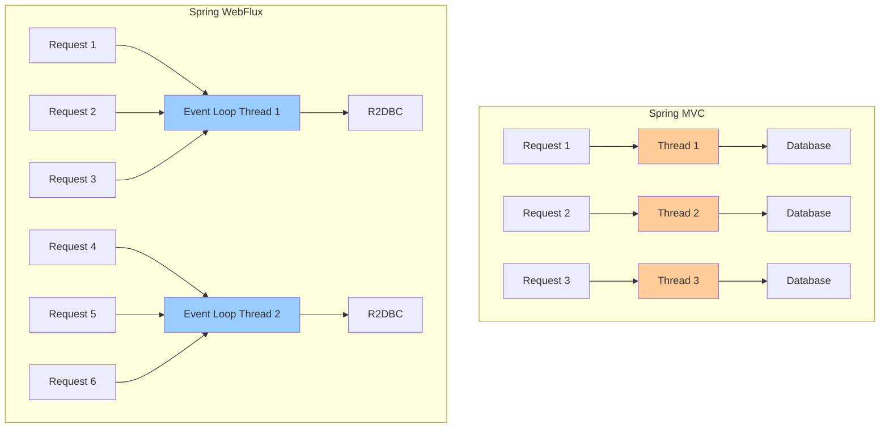
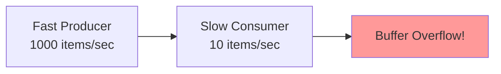
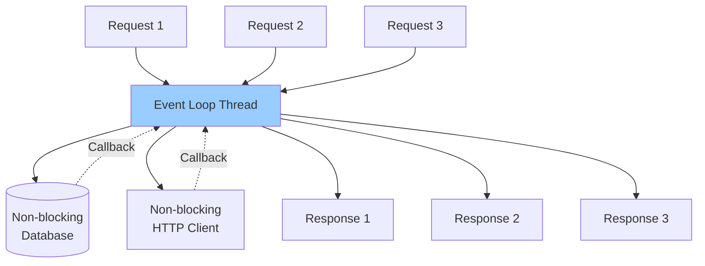

# Reactive Spring (WebFlux Basics)

> [!tip] Quick Reference
> See [[SpringBoot/00_Cheat_Sheets]] for reactive gotchas and quick operator reminders.

## Overview

Spring WebFlux is Spring's reactive web framework, built on Project Reactor. It enables non-blocking, event-driven applications that can handle high concurrency with fewer threads. Unlike Spring MVC's thread-per-request model, WebFlux uses an event loop similar to Node.js.

> [!summary] Goal
> Understand reactive programming fundamentals, know when WebFlux helps (IO-bound concurrency) and when it doesn't, master Mono/Flux operators, and recognize common pitfalls like blocking calls on event loops.

---

## What is Reactive Programming?

### Imperative vs Reactive

**Imperative (Spring MVC)**:

```java
@GetMapping("/users/{id}")
public User getUser(@PathVariable Long id) {
    User user = userRepository.findById(id);  // Blocks thread
    Account account = accountService.getAccount(user);  // Blocks thread
    return user;  // Thread blocked entire time
}
```

**Threading model**: One thread per request (blocks waiting for I/O).

**Reactive (Spring WebFlux)**:

```java
@GetMapping("/users/{id}")
public Mono<User> getUser(@PathVariable Long id) {
    return userRepository.findById(id)  // Non-blocking
        .flatMap(user -> accountService.getAccount(user)  // Non-blocking
            .map(account -> {
                user.setAccount(account);
                return user;
            }));
}
```

**Threading model**: Event loop (thread handles many requests, never blocks).

### Key Concepts

#### Asynchronous

Operations start and complete later (callbacks, futures, promises).

#### Non-Blocking

Thread doesn't wait for I/O to complete; it processes other work.

#### Backpressure

Consumer can signal producer to slow down (prevent overwhelming).

#### Reactive Streams

Specification for asynchronous stream processing with backpressure:
- **Publisher**: Produces data
- **Subscriber**: Consumes data
- **Subscription**: Link between publisher and subscriber
- **Processor**: Both publisher and subscriber

---

## Spring MVC vs Spring WebFlux

### Comparison Table

| Feature | Spring MVC | Spring WebFlux |
|---------|------------|----------------|
| **Programming Model** | Imperative (blocking) | Reactive (non-blocking) |
| **Threading Model** | Thread-per-request | Event loop (small thread pool) |
| **Concurrency** | Limited by threads (typically 200) | Very high (thousands of concurrent requests) |
| **Blocking I/O** | Normal and expected | Dangerous (blocks event loop) |
| **Database** | JDBC (blocking) | R2DBC (reactive) |
| **Learning Curve** | Easy (familiar) | Steep (new paradigm) |
| **Best For** | CRUD apps, blocking I/O | High concurrency, streaming, microservices |
| **Debugging** | Easier (stack traces) | Harder (async stack traces) |
| **Testing** | Easier | More complex |
| **Performance (low load)** | Similar | Similar |
| **Performance (high load)** | Degrades with threads | Scales better |

### Architecture Comparison



**Key difference**: Spring MVC blocks threads waiting for I/O. WebFlux threads never block.

---

## When to Use WebFlux

### Good Use Cases for WebFlux

✅ **High concurrency I/O-bound workloads**:
- API gateway handling thousands of concurrent requests
- Microservices with many external API calls
- Real-time data streaming

✅ **Server-Sent Events (SSE)**:
```java
@GetMapping(value = "/stream", produces = MediaType.TEXT_EVENT_STREAM_VALUE)
public Flux<ServerSentEvent<String>> streamEvents() {
    return Flux.interval(Duration.ofSeconds(1))
        .map(i -> ServerSentEvent.builder("Event " + i).build());
}
```

✅ **WebSocket applications**

✅ **Reactive database access (R2DBC)**

✅ **Backpressure-aware streaming**

### When NOT to Use WebFlux

❌ **Blocking I/O**:
- JDBC (use R2DBC instead)
- Blocking HTTP clients (use WebClient)
- File I/O (unless using reactive file APIs)
- Thread.sleep()

❌ **CPU-bound work**:
- Heavy computations
- Image processing
- Encryption/compression
- (Reactive doesn't help; more threads do)

❌ **Simple CRUD applications**:
- Spring MVC is simpler and sufficient

❌ **Team not familiar with reactive**:
- Steep learning curve
- Harder debugging
- More complex testing

### Performance Reality Check

**Myth**: "WebFlux is always faster"

**Reality**: 
- **Low load**: Spring MVC and WebFlux perform similarly
- **High load** (I/O-bound): WebFlux scales better (fewer threads)
- **CPU-bound**: WebFlux provides no benefit

**Benchmark** (simplified):

| Concurrent Requests | Spring MVC Throughput | WebFlux Throughput |
|---------------------|----------------------|-------------------|
| 100 | 5,000 req/s | 5,000 req/s |
| 1,000 | 5,000 req/s | 8,000 req/s |
| 10,000 | 3,000 req/s (threads exhausted) | 10,000 req/s |

---

## Mono and Flux

### Mono<T>

Represents **0 or 1** asynchronous value (like `Optional` or `CompletableFuture`).

```java
Mono<String> mono = Mono.just("Hello");
Mono<User> user = userRepository.findById(1L);
Mono<Void> empty = Mono.empty();
Mono<String> error = Mono.error(new RuntimeException("Error"));
```

**Use when**: Single result (user lookup, HTTP response, etc.)

### Flux<T>

Represents **0 to N** asynchronous values (like `Stream` but asynchronous).

```java
Flux<String> flux = Flux.just("A", "B", "C");
Flux<User> users = userRepository.findAll();
Flux<Integer> range = Flux.range(1, 100);
Flux<Long> interval = Flux.interval(Duration.ofSeconds(1));  // Emits 0, 1, 2, ... every second
```

**Use when**: Multiple results (list of users, stream of events, etc.)

### When to Use Each

```java
// Mono: Single result
public Mono<User> findUserById(Long id);
public Mono<Void> deleteUser(Long id);  // No return value
public Mono<Order> createOrder(Order order);

// Flux: Multiple results
public Flux<User> findAllUsers();
public Flux<Event> streamEvents();
public Flux<String> readFileLines(String path);
```

---

## Reactive Operators

### Creation Operators

```java
// Mono
Mono<String> mono1 = Mono.just("value");
Mono<String> mono2 = Mono.empty();
Mono<String> mono3 = Mono.error(new RuntimeException("error"));
Mono<String> mono4 = Mono.fromCallable(() -> expensiveOperation());
Mono<String> mono5 = Mono.fromSupplier(() -> "lazy value");

// Flux
Flux<String> flux1 = Flux.just("A", "B", "C");
Flux<Integer> flux2 = Flux.range(1, 10);
Flux<Long> flux3 = Flux.interval(Duration.ofSeconds(1));
Flux<String> flux4 = Flux.fromIterable(Arrays.asList("X", "Y", "Z"));
Flux<String> flux5 = Flux.fromStream(Stream.of("a", "b", "c"));
```

### Transformation Operators

#### map

Transform each element:

```java
Flux<Integer> numbers = Flux.just(1, 2, 3);
Flux<Integer> doubled = numbers.map(n -> n * 2);  // 2, 4, 6

Mono<User> user = userRepository.findById(1L);
Mono<String> userName = user.map(User::getName);
```

#### flatMap

Transform each element to a Publisher and flatten:

```java
Flux<User> users = Flux.just(1L, 2L, 3L)
    .flatMap(id -> userRepository.findById(id));  // Async lookup for each ID

Mono<User> user = userRepository.findById(1L)
    .flatMap(u -> accountService.getAccount(u.getAccountId())  // Async call
        .map(account -> {
            u.setAccount(account);
            return u;
        }));
```

**Key difference from map**:
- `map`: Synchronous transformation (T → U)
- `flatMap`: Asynchronous transformation (T → Mono<U> or Flux<U>)

#### flatMapMany

Transform Mono to Flux:

```java
Mono<User> user = userRepository.findById(1L);
Flux<Order> orders = user.flatMapMany(u -> orderRepository.findByUserId(u.getId()));
```

### Filtering Operators

```java
Flux<Integer> numbers = Flux.range(1, 10);

// filter
Flux<Integer> evens = numbers.filter(n -> n % 2 == 0);  // 2, 4, 6, 8, 10

// take
Flux<Integer> firstThree = numbers.take(3);  // 1, 2, 3

// skip
Flux<Integer> skipTwo = numbers.skip(2);  // 3, 4, 5, ...

// distinct
Flux<Integer> unique = Flux.just(1, 2, 2, 3, 3, 3).distinct();  // 1, 2, 3
```

### Combining Operators

#### zip

Combine multiple Publishers element-wise:

```java
Mono<User> user = userRepository.findById(1L);
Mono<Account> account = accountService.getAccount(1L);

Mono<UserWithAccount> combined = Mono.zip(user, account,
    (u, a) -> new UserWithAccount(u, a));
```

```java
Flux<Integer> flux1 = Flux.just(1, 2, 3);
Flux<String> flux2 = Flux.just("A", "B", "C");

Flux<String> zipped = Flux.zip(flux1, flux2, 
    (num, letter) -> num + letter);  // "1A", "2B", "3C"
```

#### merge

Merge multiple Publishers (interleaved):

```java
Flux<String> flux1 = Flux.just("A", "B").delayElements(Duration.ofMillis(100));
Flux<String> flux2 = Flux.just("1", "2").delayElements(Duration.ofMillis(150));

Flux<String> merged = Flux.merge(flux1, flux2);  // A, 1, B, 2 (interleaved by time)
```

#### concat

Concatenate Publishers (sequential):

```java
Flux<String> flux1 = Flux.just("A", "B");
Flux<String> flux2 = Flux.just("C", "D");

Flux<String> concatenated = Flux.concat(flux1, flux2);  // A, B, C, D (flux2 waits for flux1)
```

### Error Handling Operators

```java
Mono<User> user = userRepository.findById(1L)
    .onErrorReturn(new User("default"))  // Return default on error
    .onErrorResume(ex -> Mono.just(new User("fallback")))  // Fallback Mono
    .doOnError(ex -> log.error("Error fetching user", ex))  // Log error
    .onErrorMap(ex -> new CustomException("User fetch failed", ex));  // Transform error
```

### Side Effect Operators

```java
Flux<User> users = userRepository.findAll()
    .doOnNext(user -> log.info("Found user: {}", user))  // Log each element
    .doOnError(ex -> log.error("Error", ex))  // Log error
    .doOnComplete(() -> log.info("Completed"))  // Log completion
    .doOnSubscribe(sub -> log.info("Subscribed"));  // Log subscription
```

---

## Backpressure

### What is Backpressure?

**Problem**: Fast producer, slow consumer → memory overflow.



**Solution**: Consumer signals producer to slow down.

### Backpressure Strategies

#### 1. Buffer (Default)

```java
Flux<Integer> flux = Flux.range(1, 1000)
    .onBackpressureBuffer(100);  // Buffer up to 100 items
```

**Behavior**: Buffer items; if buffer full, throw error.

#### 2. Drop

```java
Flux<Integer> flux = Flux.range(1, 1000)
    .onBackpressureDrop();  // Drop items if consumer can't keep up
```

**Behavior**: Drop newest items when consumer is slow.

#### 3. Latest

```java
Flux<Integer> flux = Flux.range(1, 1000)
    .onBackpressureLatest();  // Keep only latest item
```

**Behavior**: Keep only the most recent item.

#### 4. Error

```java
Flux<Integer> flux = Flux.range(1, 1000)
    .onBackpressureError();  // Throw error if consumer can't keep up
```

**Behavior**: Fail fast if backpressure occurs.

### Manual Backpressure

```java
Flux.range(1, 100)
    .subscribe(new BaseSubscriber<Integer>() {
        
        @Override
        protected void hookOnSubscribe(Subscription subscription) {
            request(10);  // Request 10 items
        }
        
        @Override
        protected void hookOnNext(Integer value) {
            log.info("Processing: {}", value);
            request(1);  // Request next item after processing
        }
    });
```

---

## Reactive Web with WebFlux

### REST Controller

```java
package com.example.controller;

import com.example.model.User;
import com.example.service.UserService;
import lombok.RequiredArgsConstructor;
import org.springframework.web.bind.annotation.*;
import reactor.core.publisher.Flux;
import reactor.core.publisher.Mono;

@RestController
@RequestMapping("/api/users")
@RequiredArgsConstructor
public class UserController {
    
    private final UserService userService;
    
    /**
     * Get user by ID
     */
    @GetMapping("/{id}")
    public Mono<User> getUser(@PathVariable Long id) {
        return userService.findById(id);
    }
    
    /**
     * Get all users
     */
    @GetMapping
    public Flux<User> getAllUsers() {
        return userService.findAll();
    }
    
    /**
     * Create user
     */
    @PostMapping
    public Mono<User> createUser(@RequestBody User user) {
        return userService.save(user);
    }
    
    /**
     * Update user
     */
    @PutMapping("/{id}")
    public Mono<User> updateUser(@PathVariable Long id, @RequestBody User user) {
        return userService.update(id, user);
    }
    
    /**
     * Delete user
     */
    @DeleteMapping("/{id}")
    public Mono<Void> deleteUser(@PathVariable Long id) {
        return userService.delete(id);
    }
}
```

### Server-Sent Events (SSE)

```java
@RestController
public class EventController {
    
    /**
     * Stream events to client
     */
    @GetMapping(value = "/stream", produces = MediaType.TEXT_EVENT_STREAM_VALUE)
    public Flux<ServerSentEvent<String>> streamEvents() {
        return Flux.interval(Duration.ofSeconds(1))
            .map(sequence -> ServerSentEvent.<String>builder()
                .id(String.valueOf(sequence))
                .event("periodic-event")
                .data("Event " + sequence)
                .build());
    }
}
```

**Client consumption**:

```javascript
const eventSource = new EventSource('/stream');
eventSource.onmessage = (event) => {
    console.log('Received:', event.data);
};
```

---

## Reactive Repositories (R2DBC)

### Why R2DBC?

JDBC is **blocking** → incompatible with WebFlux event loop.

R2DBC (Reactive Relational Database Connectivity) is **non-blocking**.

### Dependencies

```xml
<dependency>
    <groupId>org.springframework.boot</groupId>
    <artifactId>spring-boot-starter-data-r2dbc</artifactId>
</dependency>

<dependency>
    <groupId>org.postgresql</groupId>
    <artifactId>r2dbc-postgresql</artifactId>
</dependency>
```

### Configuration

```yaml
spring:
  r2dbc:
    url: r2dbc:postgresql://localhost:5432/mydb
    username: user
    password: secret
  data:
    r2dbc:
      repositories:
        enabled: true
```

### Entity

```java
package com.example.model;

import org.springframework.data.annotation.Id;
import org.springframework.data.relational.core.mapping.Table;

@Table("users")
public class User {
    
    @Id
    private Long id;
    private String email;
    private String name;
    
    // Getters and setters
}
```

### Repository

```java
package com.example.repository;

import com.example.model.User;
import org.springframework.data.r2dbc.repository.Query;
import org.springframework.data.r2dbc.repository.R2dbcRepository;
import reactor.core.publisher.Flux;
import reactor.core.publisher.Mono;

public interface UserRepository extends R2dbcRepository<User, Long> {
    
    Mono<User> findByEmail(String email);
    
    Flux<User> findByNameContaining(String name);
    
    @Query("SELECT * FROM users WHERE created_at > :timestamp")
    Flux<User> findRecentUsers(Instant timestamp);
}
```

### Service

```java
package com.example.service;

import com.example.model.User;
import com.example.repository.UserRepository;
import lombok.RequiredArgsConstructor;
import org.springframework.stereotype.Service;
import reactor.core.publisher.Flux;
import reactor.core.publisher.Mono;

@Service
@RequiredArgsConstructor
public class UserService {
    
    private final UserRepository userRepository;
    
    public Mono<User> findById(Long id) {
        return userRepository.findById(id);
    }
    
    public Flux<User> findAll() {
        return userRepository.findAll();
    }
    
    public Mono<User> save(User user) {
        return userRepository.save(user);
    }
    
    public Mono<User> update(Long id, User user) {
        return userRepository.findById(id)
            .flatMap(existing -> {
                existing.setName(user.getName());
                existing.setEmail(user.getEmail());
                return userRepository.save(existing);
            });
    }
    
    public Mono<Void> delete(Long id) {
        return userRepository.deleteById(id);
    }
}
```

---

## Error Handling in Reactive Streams

### Controller Exception Handling

```java
package com.example.exception;

import org.springframework.http.HttpStatus;
import org.springframework.http.ResponseEntity;
import org.springframework.web.bind.annotation.ExceptionHandler;
import org.springframework.web.bind.annotation.RestControllerAdvice;

@RestControllerAdvice
public class GlobalExceptionHandler {
    
    @ExceptionHandler(UserNotFoundException.class)
    public ResponseEntity<ErrorResponse> handleUserNotFound(UserNotFoundException ex) {
        ErrorResponse error = new ErrorResponse("USER_NOT_FOUND", ex.getMessage());
        return ResponseEntity.status(HttpStatus.NOT_FOUND).body(error);
    }
    
    @ExceptionHandler(Exception.class)
    public ResponseEntity<ErrorResponse> handleGenericException(Exception ex) {
        ErrorResponse error = new ErrorResponse("INTERNAL_ERROR", ex.getMessage());
        return ResponseEntity.status(HttpStatus.INTERNAL_SERVER_ERROR).body(error);
    }
}
```

### Reactive Error Handling

```java
public Mono<User> findUserWithFallback(Long id) {
    return userRepository.findById(id)
        .switchIfEmpty(Mono.error(new UserNotFoundException(id)))
        .onErrorResume(ex -> {
            log.error("Error finding user", ex);
            return Mono.just(new User("default-user"));
        });
}
```

---

## Testing Reactive Code

### StepVerifier

```java
package com.example.service;

import com.example.model.User;
import com.example.repository.UserRepository;
import org.junit.jupiter.api.Test;
import org.springframework.beans.factory.annotation.Autowired;
import org.springframework.boot.test.context.SpringBootTest;
import reactor.core.publisher.Flux;
import reactor.core.publisher.Mono;
import reactor.test.StepVerifier;

import java.time.Duration;

@SpringBootTest
class UserServiceTest {
    
    @Autowired
    private UserService userService;
    
    @Test
    void testFindById() {
        Mono<User> userMono = userService.findById(1L);
        
        StepVerifier.create(userMono)
            .expectNextMatches(user -> user.getId().equals(1L))
            .verifyComplete();
    }
    
    @Test
    void testFindAll() {
        Flux<User> users = userService.findAll();
        
        StepVerifier.create(users)
            .expectNextCount(3)
            .verifyComplete();
    }
    
    @Test
    void testError() {
        Mono<User> error = Mono.error(new RuntimeException("Error"));
        
        StepVerifier.create(error)
            .expectError(RuntimeException.class)
            .verify();
    }
    
    @Test
    void testTimeout() {
        Flux<Long> interval = Flux.interval(Duration.ofSeconds(1)).take(5);
        
        StepVerifier.create(interval)
            .expectNext(0L, 1L, 2L, 3L, 4L)
            .expectComplete()
            .verify(Duration.ofSeconds(10));  // Timeout
    }
}
```

### WebTestClient

```java
package com.example.controller;

import com.example.model.User;
import org.junit.jupiter.api.Test;
import org.springframework.beans.factory.annotation.Autowired;
import org.springframework.boot.test.autoconfigure.web.reactive.WebFluxTest;
import org.springframework.boot.test.mock.mockito.MockBean;
import org.springframework.test.web.reactive.server.WebTestClient;
import reactor.core.publisher.Mono;

import static org.mockito.Mockito.when;

@WebFluxTest(UserController.class)
class UserControllerTest {
    
    @Autowired
    private WebTestClient webTestClient;
    
    @MockBean
    private UserService userService;
    
    @Test
    void testGetUser() {
        User user = new User(1L, "test@example.com", "Test User");
        when(userService.findById(1L)).thenReturn(Mono.just(user));
        
        webTestClient.get()
            .uri("/api/users/1")
            .exchange()
            .expectStatus().isOk()
            .expectBody(User.class)
            .isEqualTo(user);
    }
    
    @Test
    void testCreateUser() {
        User user = new User(null, "new@example.com", "New User");
        User saved = new User(1L, "new@example.com", "New User");
        when(userService.save(user)).thenReturn(Mono.just(saved));
        
        webTestClient.post()
            .uri("/api/users")
            .bodyValue(user)
            .exchange()
            .expectStatus().isOk()
            .expectBody(User.class)
            .isEqualTo(saved);
    }
}
```

---

## Threading Model

### Event Loop



**Key points**:
- Small thread pool (typically 4-8 threads)
- Threads never block
- Callbacks registered for I/O completion
- Thread processes other requests while waiting for I/O

### Scheduler Types

```java
// Immediate (current thread)
Flux.just(1, 2, 3)
    .subscribeOn(Schedulers.immediate());

// Single thread
Flux.just(1, 2, 3)
    .subscribeOn(Schedulers.single());  // Reuses one thread

// Bounded elastic (I/O tasks, can grow)
Flux.just(1, 2, 3)
    .subscribeOn(Schedulers.boundedElastic());  // For blocking calls

// Parallel (CPU-bound tasks)
Flux.range(1, 100)
    .parallel()
    .runOn(Schedulers.parallel())
    .map(i -> expensiveComputation(i));
```

---

## Common Pitfalls

### Pitfall 1: Blocking Calls on Event Loop

**WRONG**:

```java
@GetMapping("/users/{id}")
public Mono<User> getUser(@PathVariable Long id) {
    return Mono.fromCallable(() -> {
        User user = jdbcTemplate.queryForObject(...);  // BLOCKS EVENT LOOP!
        return user;
    });
}
```

**Consequence**: Event loop thread blocked → can't handle other requests → defeats purpose of reactive.

**CORRECT**:

```java
@GetMapping("/users/{id}")
public Mono<User> getUser(@PathVariable Long id) {
    return Mono.fromCallable(() -> {
        User user = jdbcTemplate.queryForObject(...);
        return user;
    }).subscribeOn(Schedulers.boundedElastic());  // Run on separate thread pool
}
```

**Better**: Use R2DBC (non-blocking database access).

### Pitfall 2: Forgetting to Subscribe

**WRONG**:

```java
public void sendEmail(String to) {
    emailService.send(to);  // Returns Mono<Void> but not subscribed!
    // Email is NEVER sent!
}
```

**CORRECT**:

```java
public Mono<Void> sendEmail(String to) {
    return emailService.send(to);  // Return Mono, caller will subscribe
}

// Or if you must trigger immediately
public void sendEmail(String to) {
    emailService.send(to)
        .subscribe(
            unused -> log.info("Email sent"),
            error -> log.error("Email failed", error)
        );
}
```

### Pitfall 3: Blocking in map()

**WRONG**:

```java
Flux<User> users = userRepository.findAll()
    .map(user -> {
        Account account = accountService.getAccount(user.getId()).block();  // BLOCKS!
        user.setAccount(account);
        return user;
    });
```

**CORRECT**: Use `flatMap()` for async operations:

```java
Flux<User> users = userRepository.findAll()
    .flatMap(user -> 
        accountService.getAccount(user.getId())
            .map(account -> {
                user.setAccount(account);
                return user;
            })
    );
```

### Pitfall 4: Mixing Reactive and Blocking Stacks

**WRONG**:

```java
@Service
public class UserService {
    
    @Autowired
    private UserRepository userRepository;  // JpaRepository (blocking!)
    
    public Mono<User> findById(Long id) {
        return Mono.fromCallable(() -> userRepository.findById(id).orElse(null));
        // Blocking JDBC call in reactive context!
    }
}
```

**CORRECT**: Use R2dbcRepository:

```java
@Service
public class UserService {
    
    @Autowired
    private UserRepository userRepository;  // R2dbcRepository (reactive!)
    
    public Mono<User> findById(Long id) {
        return userRepository.findById(id);  // Truly non-blocking
    }
}
```

### Pitfall 5: Not Handling Errors

**WRONG**:

```java
return userRepository.findById(id);  // What if user not found? Returns empty Mono
```

**Client receives**: Empty response (not 404).

**CORRECT**:

```java
return userRepository.findById(id)
    .switchIfEmpty(Mono.error(new UserNotFoundException(id)));  // Proper 404
```

---

> [!question]- Interview Questions
> 
> **Q: What is the difference between Spring MVC and Spring WebFlux?**
> A: MVC is blocking/thread-per-request; WebFlux is non-blocking/event-loop and scales better for I/O-bound concurrency. Use WebFlux when you actually have non-blocking I/O end-to-end.
> 
> **Q: What is the difference between `Mono` and `Flux`?**
> A: `Mono<T>` is 0..1 value; `Flux<T>` is 0..N values.
> 
> **Q: What is backpressure?**
> A: A protocol for a consumer to signal demand so a producer doesn’t overwhelm it (Reactive Streams).
> 
> **Q: What is the difference between `map()` and `flatMap()`?**
> A: `map` is a synchronous transform; `flatMap` is for chaining async publishers.
> 
> **Q: Why is blocking code dangerous in WebFlux?**
> A: Blocking an event-loop thread reduces throughput for all requests. Use non-blocking drivers or offload blocking work to bounded elastic.
> 
> **Q: How do you test reactive code?**
> A: Use `StepVerifier` for publishers and `WebTestClient` for integration tests.
> 
> **Q: What is R2DBC?**
> A: Reactive Relational Database Connectivity, a non-blocking alternative to JDBC.
> 
> **Q: When should you NOT use WebFlux?**
> A: When your dependencies are blocking (JDBC/file I/O), workloads are CPU-bound, the app is simple CRUD where MVC is simpler, or the team isn’t ready for reactive complexity.

---

## Cross-Links

- **Backpressure**: [[SystemDesign/03_Advanced/02_Backpressure_and_Load_Shedding]]
- **Debugging**: [[SpringBoot/03_Advanced/05_Debugging_and_Troubleshooting]]
- **Spring MVC**: [[SpringBoot/01_Foundations/03_Web_MVC_Basics]]

---

## References

- [Spring WebFlux Documentation](https://docs.spring.io/spring-framework/reference/web/webflux.html)
- [Project Reactor Documentation](https://projectreactor.io/docs/core/release/reference/)
- [R2DBC Documentation](https://r2dbc.io/)
- [Reactive Streams Specification](https://www.reactive-streams.org/)
