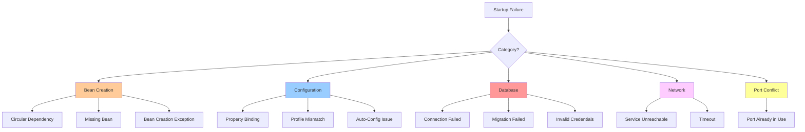

# Debugging and Troubleshooting

> [!tip] Quick Reference
> See [[SpringBoot/00_Cheat_Sheets]] for debugging flags, actuator endpoints, and quick commands.

## Overview

Effective debugging and troubleshooting are critical skills for production Spring Boot applications. This guide covers systematic approaches to diagnosing startup failures, runtime issues, performance problems, and production incidents.

> [!summary] Goal
> Quickly narrow failures to configuration, wiring, database, networking, or runtime behavior using systematic debugging techniques, logging, profiling, and production-grade observability tools.

---

## Debugging Spring Boot Startup

### Common Startup Failure Categories



### Reading Stack Traces Effectively

**Key principle**: Scroll to the **first cause** (near the bottom), not the top.

**Example stack trace**:

```
***************************
APPLICATION FAILED TO START
***************************

Description:

Field userRepository in com.example.service.UserService required a bean of type 'com.example.repository.UserRepository' that could not be found.

The injection point has the following annotations:
	- @org.springframework.beans.factory.annotation.Autowired(required=true)

Action:

Consider defining a bean of type 'com.example.repository.UserRepository' in your configuration.
```

**How to read**:
1. **Description**: What failed (UserRepository bean not found)
2. **Where**: UserService needs it (@Autowired)
3. **Action**: Spring's suggested fix

**Root cause**: UserRepository not scanned or not annotated properly.

### Startup Debugging Checklist

1. **Read error message** (Spring Boot gives good hints)
2. **Check first cause** (scroll to bottom of stack trace)
3. **Enable debug logging** (`--debug` or `logging.level.org.springframework=DEBUG`)
4. **Check condition evaluation report** (which auto-configs ran/skipped)
5. **Verify profiles** (`spring.profiles.active`)
6. **Check component scanning** (are packages scanned?)

---

## Common Startup Errors

### 1. BeanCreationException

**Error**:

```
org.springframework.beans.factory.BeanCreationException: 
Error creating bean with name 'userService': Unsatisfied dependency expressed through field 'userRepository'
```

**Causes**:
- Bean not created (missing `@Component`, `@Service`, `@Repository`)
- Package not scanned
- Conditional not met (@ConditionalOnProperty, etc.)

**Debug steps**:

1. Enable debug logging:

```bash
java -jar app.jar --debug
```

2. Check if bean exists:

```bash
curl http://localhost:8080/actuator/beans | jq '.contexts.application.beans | keys' | grep userRepository
```

3. Check component scanning (verify `@SpringBootApplication` package and `scanBasePackages` if used).

**Solution**:

```java
// Make sure repository is annotated and in scanned package
@Repository
public interface UserRepository extends JpaRepository<User, Long> {
}

// Ensure package is scanned
@SpringBootApplication(scanBasePackages = "com.example")
public class Application {
}
```

### 2. CircularDependencyException

**Error**:

```
The dependencies of some of the beans in the application context form a cycle:

┌─────┐
|  userService (field com.example.repository.UserRepository com.example.service.UserService.userRepository)
↑     ↓
|  userRepository
└─────┘
```

**Cause**: Beans depend on each other (A → B → A).

**Solutions**:

#### Solution 1: Use @Lazy

```java
@Service
public class UserService {
    
    @Autowired
    @Lazy  // Inject proxy, break circular dependency
    private UserRepository userRepository;
}
```

#### Solution 2: Restructure Dependencies

```java
// Extract common logic to third service
@Service
public class UserValidationService {
    // Common validation logic
}

@Service
public class UserService {
    @Autowired
    private UserValidationService validationService;
}

@Service
public class OrderService {
    @Autowired
    private UserValidationService validationService;
}
```

#### Solution 3: Use Setter Injection

```java
@Service
public class UserService {
    
    private UserRepository userRepository;
    
    @Autowired
    public void setUserRepository(UserRepository userRepository) {
        this.userRepository = userRepository;
    }
}
```

### 3. DataSource Configuration Errors

**Error**:

```
Failed to configure a DataSource: 'url' attribute is not specified and no embedded datasource could be configured.
```

**Cause**: No `spring.datasource.url` configured.

**Solution**:

```yaml
spring:
  datasource:
    url: jdbc:postgresql://localhost:5432/mydb
    username: user
    password: secret
```

### 4. Port Already in Use

**Error**:

```
Web server failed to start. Port 8080 was already in use.
```

**Solution 1**: Change port

```yaml
server:
  port: 8081
```

**Solution 2**: Kill process using port

**Linux/Mac**:

```bash
lsof -i :8080
kill -9 <PID>
```

**Windows**:

```bash
netstat -ano | findstr :8080
taskkill /PID <PID> /F
```

### 5. Flyway Migration Failures

**Error**:

```
FlywayException: Validate failed: Migration checksum mismatch for migration version 1
```

**Causes**:
- Migration file changed after being applied
- Migration files out of order
- Database schema manually modified

**Solution**:

1. Repair checksums (if file didn't actually change):

```bash
./mvnw flyway:repair
```

2. Create a new migration to fix the issue:

`src/main/resources/db/migration/V3__fix_schema.sql`

3. Baseline and start fresh (dev only):

```bash
./mvnw flyway:clean flyway:migrate
```

### 6. Property Binding Errors

**Error**:

```
Binding to target org.springframework.boot.context.properties.bind.BindException: 
Failed to bind properties under 'spring.datasource.hikari.maximum-pool-size' to java.lang.Integer
```

**Cause**: Property value has wrong type.

**Configuration**:

```yaml
spring:
  datasource:
    hikari:
      maximum-pool-size: "ten"  # WRONG: Should be integer
```

**Solution**:

```yaml
spring:
  datasource:
    hikari:
      maximum-pool-size: 10  # Correct
```

---

## Actuator Endpoints for Debugging

### Enable Actuator

```xml
<dependency>
    <groupId>org.springframework.boot</groupId>
    <artifactId>spring-boot-starter-actuator</artifactId>
</dependency>
```

```yaml
management:
  endpoints:
    web:
      exposure:
        include: '*'  # Expose all endpoints (use cautiously in prod)
  endpoint:
    health:
      show-details: always
```

### Key Endpoints

#### /actuator/health

Shows application health status.

```bash
curl http://localhost:8080/actuator/health | jq
```

**Response**:

```json
{
  "status": "UP",
  "components": {
    "db": {
      "status": "UP",
      "details": {
        "database": "PostgreSQL",
        "validationQuery": "isValid()"
      }
    },
    "diskSpace": {
      "status": "UP",
      "details": {
        "total": 500000000000,
        "free": 250000000000,
        "threshold": 10485760
      }
    }
  }
}
```

**Use case**: Quick check if app is healthy (database connected, disk space available, etc.).

#### /actuator/metrics

Lists all available metrics.

```bash
#### List metrics
curl http://localhost:8080/actuator/metrics

#### Get specific metric
curl http://localhost:8080/actuator/metrics/jvm.memory.used | jq
```

**Response**:

```json
{
  "name": "jvm.memory.used",
  "measurements": [
    {
      "statistic": "VALUE",
      "value": 512000000
    }
  ],
  "availableTags": [
    {
      "tag": "area",
      "values": ["heap", "nonheap"]
    }
  ]
}
```

**Use case**: Monitor memory, CPU, HTTP requests, database connections.

#### /actuator/env

Shows all environment properties.

```bash
curl http://localhost:8080/actuator/env | jq
```

**Use case**: Verify which properties are set, check profile-specific values.

#### /actuator/beans

Lists all Spring beans.

```bash
curl http://localhost:8080/actuator/beans | jq '.contexts.application.beans | keys'
```

**Use case**: Verify if bean was created, check bean dependencies.

#### /actuator/conditions

Shows auto-configuration condition evaluation report.

```bash
curl http://localhost:8080/actuator/conditions | jq
```

**Use case**: Debug why auto-configuration didn't run.

#### /actuator/loggers

View and modify log levels at runtime.

```bash
#### Get current log levels
curl http://localhost:8080/actuator/loggers/com.example.service

#### Change log level
curl -X POST http://localhost:8080/actuator/loggers/com.example.service \
  -H "Content-Type: application/json" \
  -d '{"configuredLevel": "DEBUG"}'
```

**Use case**: Enable debug logging in production without restart.

#### /actuator/threaddump

Get thread dump.

```bash
curl http://localhost:8080/actuator/threaddump > threaddump.json
```

**Use case**: Detect deadlocks, analyze blocked threads.

---

## Logging Configuration

### Log Levels

```yaml
logging:
  level:
    root: INFO
    com.example: DEBUG
    org.springframework.web: DEBUG
    org.springframework.security: DEBUG
    org.hibernate.SQL: DEBUG
    org.hibernate.type.descriptor.sql.BasicBinder: TRACE  # Show bind parameters
```

### Log Patterns

```yaml
logging:
  pattern:
    console: "%d{yyyy-MM-dd HH:mm:ss} - %msg%n"
    file: "%d{yyyy-MM-dd HH:mm:ss} [%thread] %-5level %logger{36} - %msg%n"
```

### File Output

```yaml
logging:
  file:
    name: /var/log/myapp/application.log
    max-size: 10MB
    max-history: 30
    total-size-cap: 1GB
```

### JSON Logging (Production)

**Dependencies**:

```xml
<dependency>
    <groupId>net.logstash.logback</groupId>
    <artifactId>logstash-logback-encoder</artifactId>
    <version>7.3</version>
</dependency>
```

**logback-spring.xml**:

```xml
<configuration>
    <appender name="JSON" class="ch.qos.logback.core.ConsoleAppender">
        <encoder class="net.logstash.logback.encoder.LogstashEncoder">
            <includeMdcKeyName>traceId</includeMdcKeyName>
            <includeMdcKeyName>spanId</includeMdcKeyName>
        </encoder>
    </appender>
    
    <root level="INFO">
        <appender-ref ref="JSON"/>
    </root>
</configuration>
```

**Output**:

```json
{
  "@timestamp": "2026-04-26T10:30:45.123Z",
  "level": "INFO",
  "logger": "com.example.service.UserService",
  "message": "User created successfully",
  "traceId": "abc123",
  "spanId": "xyz789"
}
```

---

## Remote Debugging

### Enable JDWP

**Command line**:

```bash
java -agentlib:jdwp=transport=dt_socket,server=y,suspend=n,address=*:5005 -jar app.jar
```

**Environment variable**:

```bash
export JAVA_OPTS="-agentlib:jdwp=transport=dt_socket,server=y,suspend=n,address=*:5005"
```

**Docker**:

```dockerfile
CMD ["java", "-agentlib:jdwp=transport=dt_socket,server=y,suspend=n,address=*:5005", "-jar", "app.jar"]
```

**Kubernetes**:

```yaml
env:
  - name: JAVA_OPTS
    value: "-agentlib:jdwp=transport=dt_socket,server=y,suspend=n,address=*:5005"
ports:
  - containerPort: 5005
    name: debug
```

### Connect from IntelliJ

1. Run → Edit Configurations
2. Add New Configuration → Remote JVM Debug
3. Host: `localhost` (or remote host)
4. Port: `5005`
5. Click Debug

### Security Consideration

**WARNING**: Don't expose debug port in production! Use SSH tunnel:

```bash
ssh -L 5005:localhost:5005 user@production-server
```

Then connect to `localhost:5005`.

---

## Profiling

### JDK Flight Recorder (JFR)

**Start recording**:

```bash
#### Start recording for 60 seconds
java -XX:StartFlightRecording=duration=60s,filename=recording.jfr -jar app.jar

#### Or trigger at runtime
jcmd <PID> JFR.start duration=60s filename=recording.jfr
```

**Analyze with JDK Mission Control**:

```bash
jmc recording.jfr
```

**Use cases**:
- CPU profiling (hotspots)
- Memory allocation
- Lock contention
- I/O operations

### async-profiler

**Download**:

```bash
wget https://github.com/async-profiler/async-profiler/releases/download/v2.9/async-profiler-2.9-linux-x64.tar.gz
tar -xzf async-profiler-2.9-linux-x64.tar.gz
```

**Profile CPU**:

```bash
./profiler.sh -d 30 -f flamegraph.html <PID>
```

**Profile memory allocations**:

```bash
./profiler.sh -d 30 -e alloc -f flamegraph.html <PID>
```

**Output**: Flame graph showing CPU/memory hotspots.

---

## Memory Leak Detection

### Symptoms

- Memory usage constantly increasing
- OutOfMemoryError
- Garbage collection taking longer
- Application becomes unresponsive

### Heap Dump

**Trigger heap dump**:

```bash
#### Manual
jmap -dump:live,format=b,file=heap.hprof <PID>

#### Automatic on OOM
java -XX:+HeapDumpOnOutOfMemoryError -XX:HeapDumpPath=/var/log/myapp -jar app.jar
```

### Analyze with Eclipse MAT

1. Download [Eclipse Memory Analyzer](https://www.eclipse.org/mat/)
2. Open heap dump
3. Run "Leak Suspects Report"
4. Look for:
   - Large objects
   - Duplicate strings
   - Collections with many elements

### Common Memory Leaks

#### 1. Static Collections

```java
public class UserCache {
    private static Map<Long, User> cache = new HashMap<>();  // Never cleared!
    
    public void addUser(User user) {
        cache.put(user.getId(), user);  // Memory leak
    }
}
```

**Solution**: Use eviction policy (Caffeine, Redis) or weak references.

#### 2. Listeners Not Removed

```java
public class UserService {
    public void addUser(User user) {
        eventPublisher.addEventListener(event -> {
            // Lambda captures 'user' - not garbage collected until listener removed
        });
    }
}
```

**Solution**: Remove listeners when done.

#### 3. Unclosed Resources

```java
public void readFile(String path) {
    FileInputStream fis = new FileInputStream(path);  // Never closed!
    // ...
}
```

**Solution**: Use try-with-resources:

```java
try (FileInputStream fis = new FileInputStream(path)) {
    // ...
}
```

---

## Thread Dump Analysis

### Trigger Thread Dump

```bash
#### Method 1: jstack
jstack <PID> > threaddump.txt

#### Method 2: kill signal (Linux)
kill -3 <PID>  # Prints to stdout/log

#### Method 3: Actuator
curl http://localhost:8080/actuator/threaddump > threaddump.json
```

### Analyzing Thread Dump

**Look for**:
- **BLOCKED** threads (waiting for lock)
- **WAITING** threads (waiting for notification)
- **TIMED_WAITING** threads (sleeping)
- **RUNNABLE** threads (executing)

**Example (deadlock)**:

```
"Thread-1" #11 prio=5 os_prio=0 tid=0x00007f8c4c0a3000 nid=0x1234 waiting for monitor entry
   java.lang.Thread.State: BLOCKED (on object monitor)
        at com.example.Service1.method1(Service1.java:10)
        - waiting to lock <0x00000000d5f00000> (a java.lang.Object) held by "Thread-2"

"Thread-2" #12 prio=5 os_prio=0 tid=0x00007f8c4c0a4000 nid=0x5678 waiting for monitor entry
   java.lang.Thread.State: BLOCKED (on object monitor)
        at com.example.Service2.method2(Service2.java:20)
        - waiting to lock <0x00000000d5f00100> (a java.lang.Object) held by "Thread-1"
```

**Diagnosis**: Deadlock between Thread-1 and Thread-2.

**Solution**: Fix locking order or use `tryLock()` with timeout.

---

## Database Debugging

### SQL Query Logging

```yaml
spring:
  jpa:
    show-sql: true
    properties:
      hibernate:
        format_sql: true
        use_sql_comments: true
logging:
  level:
    org.hibernate.SQL: DEBUG
    org.hibernate.type.descriptor.sql.BasicBinder: TRACE
```

**Output**:

```sql
Hibernate: 
    /* select u from User u where u.email = :email */
    select
        user0_.id as id1_0_,
        user0_.email as email2_0_,
        user0_.name as name3_0_ 
    from
        users user0_ 
    where
        user0_.email=?
2026-04-26 10:30:45.123 TRACE --- binding parameter [1] as [VARCHAR] - [test@example.com]
```

### Query Performance Analysis

**PostgreSQL**:

```sql
EXPLAIN ANALYZE
SELECT * FROM users WHERE email = 'test@example.com';
```

**Output**:

```
Seq Scan on users  (cost=0.00..35.50 rows=1 width=100) (actual time=0.015..0.250 rows=1 loops=1)
  Filter: (email = 'test@example.com'::text)
  Rows Removed by Filter: 999
Planning Time: 0.123 ms
Execution Time: 0.275 ms
```

**Problem**: Sequential scan (no index).

**Solution**:

```sql
CREATE INDEX idx_users_email ON users(email);
```

See [[SQL/02_Core/04_Explain_Analyze_and_Query_Plans]] for details.

### N+1 Query Detection

**Problem**:

```java
@GetMapping("/users")
public List<User> getUsers() {
    List<User> users = userRepository.findAll();  // 1 query
    users.forEach(user -> {
        user.getOrders().size();  // N queries (lazy loading)
    });
    return users;
}
```

**Logs**:

```
Hibernate: select * from users
Hibernate: select * from orders where user_id = 1
Hibernate: select * from orders where user_id = 2
Hibernate: select * from orders where user_id = 3
...
```

**Solution**: Use JOIN FETCH:

```java
@Query("SELECT u FROM User u LEFT JOIN FETCH u.orders")
List<User> findAllWithOrders();
```

See [[SpringBoot/02_Core/01_Spring_Data_JPA_Essentials]] for details.

### Connection Pool Monitoring

```yaml
spring:
  datasource:
    hikari:
      maximum-pool-size: 10
      minimum-idle: 5
      connection-timeout: 30000
      leak-detection-threshold: 60000  # Warn if connection held > 60s
logging:
  level:
    com.zaxxer.hikari: DEBUG
```

**Actuator metric**:

```bash
curl http://localhost:8080/actuator/metrics/hikari.connections.active
```

---

## HTTP Debugging

### Request/Response Logging

**Logbook library**:

```xml
<dependency>
    <groupId>org.zalando</groupId>
    <artifactId>logbook-spring-boot-starter</artifactId>
    <version>3.3.0</version>
</dependency>
```

**Configuration**:

```yaml
logbook:
  include:
    - /api/**
  exclude:
    - /actuator/**
  format:
    style: http
```

**Output**:

```
Incoming Request: POST /api/users
Remote: 192.168.1.100
Content-Type: application/json
{
  "email": "test@example.com",
  "name": "Test User"
}

Outgoing Response: 200 OK
Content-Type: application/json
{
  "id": 1,
  "email": "test@example.com",
  "name": "Test User"
}
```

### Wireshark Network Capture

**Capture HTTP traffic**:

```bash
#### Capture on port 8080
sudo tcpdump -i any -s 0 -w capture.pcap port 8080
```

**Analyze in Wireshark**:
- Open `capture.pcap`
- Filter: `http`
- View HTTP requests/responses

---

## Performance Troubleshooting

### Slow Endpoint Detection

**Spring Boot Actuator + Micrometer**:

```yaml
management:
  metrics:
    distribution:
      percentiles-histogram:
        http.server.requests: true
```

**Query metrics**:

```bash
curl http://localhost:8080/actuator/metrics/http.server.requests | jq
```

**Response**:

```json
{
  "name": "http.server.requests",
  "measurements": [
    {"statistic": "COUNT", "value": 1000},
    {"statistic": "TOTAL_TIME", "value": 5.5},
    {"statistic": "MAX", "value": 2.3}
  ],
  "availableTags": [
    {"tag": "uri", "values": ["/api/users", "/api/orders"]}
  ]
}
```

**Identify slow endpoints**:

```bash
curl http://localhost:8080/actuator/metrics/http.server.requests?tag=uri:/api/users
```

### Profiling Slow Methods

**Using @Timed**:

```java
@RestController
public class UserController {
    
    @GetMapping("/users")
    @Timed(value = "users.getAll", description = "Time to get all users")
    public List<User> getAllUsers() {
        return userService.findAll();
    }
}
```

**Query metric**:

```bash
curl http://localhost:8080/actuator/metrics/users.getAll
```

---

## Production Debugging

### Log Aggregation

**ELK Stack (Elasticsearch, Logstash, Kibana)**:

1. Configure JSON logging (see above)
2. Ship logs to Logstash
3. Index in Elasticsearch
4. Query in Kibana

**Query example**:

```
level:ERROR AND service:order-service AND traceId:abc123
```

### Distributed Tracing

**Spring Cloud Sleuth + Zipkin**:

```xml
<dependency>
    <groupId>org.springframework.cloud</groupId>
    <artifactId>spring-cloud-starter-sleuth</artifactId>
</dependency>
<dependency>
    <groupId>org.springframework.cloud</groupId>
    <artifactId>spring-cloud-sleuth-zipkin</artifactId>
</dependency>
```

```yaml
spring:
  sleuth:
    sampler:
      probability: 1.0  # Sample 100% (reduce in production)
  zipkin:
    base-url: http://localhost:9411
```

**Trace flow**:

```
[order-service] traceId=abc123, spanId=1
  → [user-service] traceId=abc123, spanId=2
    → [database] traceId=abc123, spanId=3
```

**View in Zipkin**: See complete request flow across services.

---

## Tools

### IntelliJ IDEA Debugger

**Features**:
- Breakpoints
- Conditional breakpoints
- Evaluate expression
- Watch variables
- Hot reload (Spring Boot DevTools)

### VisualVM

**Download**: https://visualvm.github.io/

**Features**:
- CPU profiling
- Memory profiling
- Thread analysis
- Heap dump
- GC monitoring

**Connect**: File → Add JMX Connection → `localhost:9999`

### JConsole

**Start**:

```bash
jconsole <PID>
```

**Features**:
- Memory usage
- Thread count
- CPU usage
- MBean inspection

---

> [!question]- Interview Questions
> 
> **Q: How do you debug a Spring Boot startup failure?**
> A: Read the first "Caused by", run with `--debug`, inspect the condition evaluation report, verify profiles/component scanning, and use actuator to inspect beans/env.
> 
> **Q: What is a `BeanCreationException` and how do you fix it?**
> A: Spring couldn’t create a bean due to missing dependencies, circular refs, or configuration errors. Fix by providing the missing bean, breaking cycles (often by refactoring, sometimes `@Lazy`), or correcting properties.
> 
> **Q: How do you detect memory leaks in production?**
> A: Monitor `jvm.memory.used`, enable heap dumps on OOM, and analyze dumps (MAT) for growing dominators/collections.
> 
> **Q: How do you debug slow database queries?**
> A: Check SQL logs, use `EXPLAIN ANALYZE`, validate indexing, look for N+1, and monitor pool saturation.
> 
> **Q: Which actuator endpoints are most useful?**
> A: `/health`, `/metrics`, `/loggers`, `/beans`, `/conditions`, `/threaddump`.
> 
> **Q: How do you debug a deadlock?**
> A: Capture a thread dump (`jstack`), identify blocked threads and lock owners, then enforce a consistent lock order or reduce lock scope.
> 
> **Q: How do you enable remote debugging safely?**
> A: Start with JDWP and never expose the port publicly; tunnel via SSH.
> 
> **Q: How do you trace a request across microservices?**
> A: Use distributed tracing (trace/span IDs in logs + a tracer backend) and correlate by traceId.

---

## Cross-Links

- **Startup failures playbook**: [[SpringBoot/04_Playbooks/02_Debug_Startup_Failures]]
- **Transaction debugging**: [[SpringBoot/04_Playbooks/03_Debug_Transactions_and_Locks]]
- **Production config**: [[SpringBoot/04_Playbooks/01_Production_Configuration_Checklist]]
- **Observability**: [[SystemDesign/02_Core/05_Observability_Logs_Metrics_Traces]]
- **SQL explain**: [[SQL/02_Core/04_Explain_Analyze_and_Query_Plans]]

---

## References

- [Spring Boot Actuator](https://docs.spring.io/spring-boot/reference/actuator/endpoints.html)
- [JDK Flight Recorder](https://docs.oracle.com/javacomponents/jmc-5-4/jfr-runtime-guide/about.htm)
- [Eclipse Memory Analyzer](https://www.eclipse.org/mat/)
- [Spring Cloud Sleuth](https://spring.io/projects/spring-cloud-sleuth)
