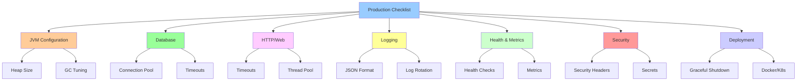

# Playbook: Production Configuration Checklist

> [!tip] Quick Reference
> See [[SpringBoot/00_Cheat_Sheets]] for quick prod toggles (actuator, logging, common properties).

## Overview

This playbook provides a comprehensive checklist for hardening Spring Boot applications for production. Following these guidelines prevents common production issues related to timeouts, resource exhaustion, security vulnerabilities, and observability blind spots.

> [!summary] Goal
> Avoid the most common production misconfigurations: timeouts, connection pools, logging, health checks, security, and observability. Use this checklist before every production deployment.

---

## Checklist Overview



---

## 1. JVM Configuration

### Heap Size

**Default**: Often too small for production workloads.

**Configuration**:

```bash
# Set heap size (adjust based on container/VM memory)
java -Xms2g -Xmx2g -jar app.jar
```

**Best practices**:
- Set `-Xms` and `-Xmx` to **same value** (prevents heap resizing overhead)
- Allocate 50-75% of container memory to heap
- Leave room for metaspace, thread stacks, native memory

**Example for 4GB container**:

```bash
java -Xms3g -Xmx3g -jar app.jar
```

**Docker/Kubernetes**:

```yaml
env:
  - name: JAVA_OPTS
    value: "-Xms2g -Xmx2g"
```

### GC Tuning

**Default**: G1GC (Java 9+)

**Production configuration**:

```bash
# G1GC (recommended for most cases)
java -Xms2g -Xmx2g \
  -XX:+UseG1GC \
  -XX:MaxGCPauseMillis=200 \
  -XX:+ParallelRefProcEnabled \
  -jar app.jar
```

**For low-latency requirements**:

```bash
# ZGC (Java 15+, very low pause times)
java -Xms2g -Xmx2g \
  -XX:+UseZGC \
  -jar app.jar
```

**GC logging** (for monitoring):

```bash
java -Xms2g -Xmx2g \
  -Xlog:gc*:file=/var/log/myapp/gc.log:time,uptime:filecount=5,filesize=10M \
  -jar app.jar
```

### Metaspace

**Configuration**:

```bash
java -XX:MetaspaceSize=256m -XX:MaxMetaspaceSize=512m -jar app.jar
```

**When to increase**:
- Many classes (large classpath)
- Dynamic class loading
- OutOfMemoryError: Metaspace

### Thread Stack Size

**Default**: 1MB per thread

**Reduce for high thread count**:

```bash
java -Xss512k -jar app.jar  # 512KB per thread
```

---

## 2. Database Configuration

### Connection Pool (HikariCP)

**Critical settings**:

```yaml
spring:
  datasource:
    hikari:
      # Pool sizing
      maximum-pool-size: 20  # Max connections
      minimum-idle: 5        # Min idle connections
      
      # Timeouts (milliseconds)
      connection-timeout: 30000      # 30 seconds to get connection from pool
      idle-timeout: 600000           # 10 minutes idle before eviction
      max-lifetime: 1800000          # 30 minutes max connection lifetime
      
      # Leak detection
      leak-detection-threshold: 60000  # Warn if connection held > 60 seconds
      
      # Performance
      auto-commit: false  # Explicit transaction management
      
      # Health check
      connection-test-query: SELECT 1
```

**Pool sizing formula**:

```
connections = ((core_count * 2) + effective_spindle_count)
```

**Example**: 4 cores, 1 disk → `(4 * 2) + 1 = 9` connections

**WARNING**: Don't over-provision!
- Database max connections: 100
- 5 application instances
- Each instance: max 20 connections = 100 total ✅

### Query Timeouts

```yaml
spring:
  jpa:
    properties:
      javax:
        persistence:
          query:
            timeout: 30000  # 30 seconds
      hibernate:
        query:
          timeout: 30000  # 30 seconds
```

### Transaction Timeout

```yaml
spring:
  transaction:
    default-timeout: 30  # 30 seconds
```

**Or per-method**:

```java
@Transactional(timeout = 30)  // 30 seconds
public void processOrder(Order order) {
    // Long-running transaction
}
```

---

## 3. HTTP/Web Configuration

### Server Timeouts

```yaml
server:
  port: 8080
  
  # Connection timeout
  connection-timeout: 30s
  
  # Tomcat-specific
  tomcat:
    connection-timeout: 30s
    keep-alive-timeout: 60s
    max-keep-alive-requests: 100
    
    # Thread pool
    threads:
      max: 200        # Max request threads
      min-spare: 10   # Min idle threads
    
    # Request limits
    max-http-header-size: 8KB
    max-swallow-size: 2MB
    max-http-post-size: 2MB
    
    # Connection limits
    accept-count: 100  # Queue size when threads exhausted
    max-connections: 10000
```

### HTTP Client Timeouts (RestTemplate/WebClient)

**RestTemplate**:

```java
@Bean
public RestTemplate restTemplate() {
    HttpComponentsClientHttpRequestFactory factory = 
        new HttpComponentsClientHttpRequestFactory();
    
    factory.setConnectTimeout(5000);  // 5 seconds
    factory.setReadTimeout(30000);    // 30 seconds
    
    return new RestTemplate(factory);
}
```

**WebClient**:

```java
@Bean
public WebClient webClient() {
    HttpClient httpClient = HttpClient.create()
        .option(ChannelOption.CONNECT_TIMEOUT_MILLIS, 5000)
        .responseTimeout(Duration.ofSeconds(30));
    
    return WebClient.builder()
        .clientConnector(new ReactorClientHttpConnector(httpClient))
        .build();
}
```

### CORS Configuration

```yaml
spring:
  web:
    cors:
      allowed-origins: https://example.com
      allowed-methods: GET,POST,PUT,DELETE
      allowed-headers: '*'
      allow-credentials: true
      max-age: 3600
```

**Or Java config**:

```java
@Configuration
public class CorsConfig implements WebMvcConfigurer {
    
    @Override
    public void addCorsMappings(CorsRegistry registry) {
        registry.addMapping("/api/**")
            .allowedOrigins("https://example.com")
            .allowedMethods("GET", "POST", "PUT", "DELETE")
            .allowedHeaders("*")
            .allowCredentials(true)
            .maxAge(3600);
    }
}
```

---

## 4. Logging Configuration

### JSON Structured Logging

**Dependencies**:

```xml
<dependency>
    <groupId>net.logstash.logback</groupId>
    <artifactId>logstash-logback-encoder</artifactId>
    <version>7.3</version>
</dependency>
```

**logback-spring.xml**:

```xml
<configuration>
    <include resource="org/springframework/boot/logging/logback/defaults.xml"/>
    
    <appender name="JSON_CONSOLE" class="ch.qos.logback.core.ConsoleAppender">
        <encoder class="net.logstash.logback.encoder.LogstashEncoder">
            <customFields>{"application":"order-service","environment":"production"}</customFields>
            <includeMdcKeyName>traceId</includeMdcKeyName>
            <includeMdcKeyName>spanId</includeMdcKeyName>
            <includeMdcKeyName>userId</includeMdcKeyName>
        </encoder>
    </appender>
    
    <appender name="JSON_FILE" class="ch.qos.logback.core.rolling.RollingFileAppender">
        <file>/var/log/myapp/application.log</file>
        <encoder class="net.logstash.logback.encoder.LogstashEncoder"/>
        
        <rollingPolicy class="ch.qos.logback.core.rolling.TimeBasedRollingPolicy">
            <fileNamePattern>/var/log/myapp/application-%d{yyyy-MM-dd}.%i.log.gz</fileNamePattern>
            <maxHistory>30</maxHistory>
            <totalSizeCap>10GB</totalSizeCap>
            <timeBasedFileNamingAndTriggeringPolicy class="ch.qos.logback.core.rolling.SizeAndTimeBasedFNATP">
                <maxFileSize>100MB</maxFileSize>
            </timeBasedFileNamingAndTriggeringPolicy>
        </rollingPolicy>
    </appender>
    
    <root level="INFO">
        <appender-ref ref="JSON_CONSOLE"/>
        <appender-ref ref="JSON_FILE"/>
    </root>
    
    <!-- Application-specific loggers -->
    <logger name="com.example" level="INFO"/>
    
    <!-- Reduce noise -->
    <logger name="org.springframework" level="WARN"/>
    <logger name="org.hibernate" level="WARN"/>
</configuration>
```

### Log Levels

```yaml
logging:
  level:
    root: INFO
    com.example: INFO
    
    # Reduce noise
    org.springframework: WARN
    org.hibernate: WARN
    
    # Never log passwords/secrets
    org.springframework.security: WARN
```

### Correlation IDs

**Add to MDC**:

```java
@Component
public class CorrelationIdFilter extends OncePerRequestFilter {
    
    @Override
    protected void doFilterInternal(
        HttpServletRequest request,
        HttpServletResponse response,
        FilterChain filterChain
    ) throws ServletException, IOException {
        
        String correlationId = request.getHeader("X-Correlation-ID");
        if (correlationId == null) {
            correlationId = UUID.randomUUID().toString();
        }
        
        MDC.put("correlationId", correlationId);
        response.addHeader("X-Correlation-ID", correlationId);
        
        try {
            filterChain.doFilter(request, response);
        } finally {
            MDC.remove("correlationId");
        }
    }
}
```

---

## 5. Graceful Shutdown

### Configuration

```yaml
server:
  shutdown: graceful

spring:
  lifecycle:
    timeout-per-shutdown-phase: 30s  # Wait 30s for requests to complete
```

**What it does**:
1. Server stops accepting new requests
2. Waits for in-flight requests to complete (up to 30s)
3. Shuts down

### Kubernetes Integration

```yaml
apiVersion: v1
kind: Pod
spec:
  containers:
    - name: myapp
      lifecycle:
        preStop:
          exec:
            command: ["sh", "-c", "sleep 10"]  # Wait for load balancer to deregister
```

**Flow**:
1. Kubernetes sends SIGTERM
2. preStop hook waits 10s (load balancer deregisters pod)
3. Spring graceful shutdown begins
4. Pod terminates

---

## 6. Health Checks and Monitoring

### Actuator Configuration

```yaml
management:
  server:
    port: 8081  # Separate port for management endpoints (security)
  
  endpoints:
    web:
      base-path: /actuator
      exposure:
        include: health,metrics,prometheus,info
  
  endpoint:
    health:
      show-details: always
      probes:
        enabled: true  # Kubernetes liveness/readiness
  
  metrics:
    export:
      prometheus:
        enabled: true
    distribution:
      percentiles-histogram:
        http.server.requests: true
```

### Health Indicators

```java
@Component
public class DatabaseHealthIndicator implements HealthIndicator {
    
    @Autowired
    private DataSource dataSource;
    
    @Override
    public Health health() {
        try (Connection conn = dataSource.getConnection()) {
            conn.createStatement().execute("SELECT 1");
            return Health.up()
                .withDetail("database", "PostgreSQL")
                .build();
        } catch (SQLException e) {
            return Health.down()
                .withDetail("error", e.getMessage())
                .build();
        }
    }
}
```

### Kubernetes Probes

```yaml
livenessProbe:
  httpGet:
    path: /actuator/health/liveness
    port: 8081
  initialDelaySeconds: 60
  periodSeconds: 10
  failureThreshold: 3

readinessProbe:
  httpGet:
    path: /actuator/health/readiness
    port: 8081
  initialDelaySeconds: 30
  periodSeconds: 5
  failureThreshold: 3
```

### Prometheus Metrics

**Scrape config** (prometheus.yml):

```yaml
scrape_configs:
  - job_name: 'spring-boot-app'
    metrics_path: '/actuator/prometheus'
    static_configs:
      - targets: ['localhost:8081']
```

**Custom metrics**:

```java
@Component
public class OrderMetrics {
    
    private final Counter orderCounter;
    private final Timer orderProcessingTime;
    
    public OrderMetrics(MeterRegistry registry) {
        this.orderCounter = Counter.builder("orders.created")
            .description("Total orders created")
            .register(registry);
        
        this.orderProcessingTime = Timer.builder("orders.processing.time")
            .description("Order processing time")
            .register(registry);
    }
    
    public void recordOrder() {
        orderCounter.increment();
    }
    
    public void recordProcessingTime(Runnable action) {
        orderProcessingTime.record(action);
    }
}
```

---

## 7. Security Configuration

### Security Headers

```java
@Configuration
@EnableWebSecurity
public class SecurityConfig {
    
    @Bean
    public SecurityFilterChain filterChain(HttpSecurity http) throws Exception {
        http
            .headers(headers -> headers
                // Prevent clickjacking
                .frameOptions().deny()
                
                // Prevent MIME sniffing
                .contentTypeOptions().and()
                
                // XSS protection
                .xssProtection().and()
                
                // HSTS (HTTPS only)
                .httpStrictTransportSecurity()
                    .maxAgeInSeconds(31536000)
                    .includeSubDomains(true)
                    .and()
                
                // Content Security Policy
                .contentSecurityPolicy("default-src 'self'")
            );
        
        return http.build();
    }
}
```

### CSRF Protection

**Enable for session-based auth**:

```java
http.csrf().csrfTokenRepository(CookieCsrfTokenRepository.withHttpOnlyFalse());
```

**Disable for stateless APIs** (JWT):

```java
http.csrf().disable();
```

### SSL/TLS Configuration

```yaml
server:
  ssl:
    enabled: true
    key-store: classpath:keystore.p12
    key-store-password: ${KEYSTORE_PASSWORD}
    key-store-type: PKCS12
    key-alias: tomcat
    
    # TLS protocol
    protocol: TLS
    enabled-protocols: TLSv1.2,TLSv1.3
```

**Generate keystore**:

```bash
keytool -genkeypair -alias tomcat -keyalg RSA -keysize 2048 \
  -storetype PKCS12 -keystore keystore.p12 -validity 3650
```

### Rate Limiting

**Using Bucket4j**:

```java
@Component
public class RateLimitFilter extends OncePerRequestFilter {
    
    private final Map<String, Bucket> cache = new ConcurrentHashMap<>();
    
    @Override
    protected void doFilterInternal(
        HttpServletRequest request,
        HttpServletResponse response,
        FilterChain filterChain
    ) throws ServletException, IOException {
        
        String ip = request.getRemoteAddr();
        Bucket bucket = cache.computeIfAbsent(ip, k -> createBucket());
        
        if (bucket.tryConsume(1)) {
            filterChain.doFilter(request, response);
        } else {
            response.setStatus(429);  // Too Many Requests
            response.getWriter().write("Rate limit exceeded");
        }
    }
    
    private Bucket createBucket() {
        Bandwidth limit = Bandwidth.simple(100, Duration.ofMinutes(1));  // 100 req/min
        return Bucket.builder().addLimit(limit).build();
    }
}
```

---

## 8. Caching Strategy

### Cache Configuration

```yaml
spring:
  cache:
    type: caffeine
    caffeine:
      spec: maximumSize=1000,expireAfterWrite=10m
```

**Or Redis**:

```yaml
spring:
  cache:
    type: redis
  redis:
    host: localhost
    port: 6379
    password: ${REDIS_PASSWORD}
    timeout: 2000ms
    lettuce:
      pool:
        max-active: 8
        max-idle: 8
        min-idle: 0
```

### Cache Usage

```java
@Service
public class UserService {
    
    @Cacheable(value = "users", key = "#id")
    public User findById(Long id) {
        return userRepository.findById(id).orElseThrow();
    }
    
    @CacheEvict(value = "users", key = "#user.id")
    public User update(User user) {
        return userRepository.save(user);
    }
}
```

---

## 9. Environment-Specific Configuration

### Profile-Based Configuration

**application.yml** (defaults):

```yaml
spring:
  application:
    name: order-service
```

**application-dev.yml**:

```yaml
spring:
  datasource:
    url: jdbc:postgresql://localhost:5432/mydb_dev
  jpa:
    show-sql: true
logging:
  level:
    com.example: DEBUG
```

**application-prod.yml**:

```yaml
spring:
  datasource:
    url: jdbc:postgresql://prod-db:5432/mydb
  jpa:
    show-sql: false
logging:
  level:
    com.example: INFO
```

**Activate**:

```bash
java -jar app.jar --spring.profiles.active=prod
```

### Environment Variables

```yaml
spring:
  datasource:
    url: ${DATABASE_URL}
    username: ${DATABASE_USERNAME}
    password: ${DATABASE_PASSWORD}
```

**Set in Kubernetes**:

```yaml
env:
  - name: DATABASE_URL
    value: jdbc:postgresql://prod-db:5432/mydb
  - name: DATABASE_USERNAME
    valueFrom:
      secretKeyRef:
        name: db-secret
        key: username
  - name: DATABASE_PASSWORD
    valueFrom:
      secretKeyRef:
        name: db-secret
        key: password
```

---

## 10. Secrets Management

### Kubernetes Secrets

**Create secret**:

```bash
kubectl create secret generic db-secret \
  --from-literal=username=myuser \
  --from-literal=password=mypassword
```

**Use in pod**:

```yaml
env:
  - name: DATABASE_USERNAME
    valueFrom:
      secretKeyRef:
        name: db-secret
        key: username
  - name: DATABASE_PASSWORD
    valueFrom:
      secretKeyRef:
        name: db-secret
        key: password
```

### HashiCorp Vault

```yaml
spring:
  cloud:
    vault:
      uri: https://vault.example.com
      authentication: TOKEN
      token: ${VAULT_TOKEN}
      kv:
        enabled: true
        backend: secret
```

**Usage**:

```yaml
spring:
  datasource:
    password: ${vault:secret/myapp:database.password}
```

### AWS Secrets Manager

```yaml
spring:
  cloud:
    aws:
      secretsmanager:
        enabled: true
        region: us-east-1
```

**Usage**:

```yaml
spring:
  datasource:
    password: ${aws-secretsmanager:myapp/database/password}
```

---

## 11. Docker Best Practices

### Multi-Stage Build

```dockerfile
# Build stage
FROM maven:3.9-eclipse-temurin-17 AS build
WORKDIR /app
COPY pom.xml .
RUN mvn dependency:go-offline
COPY src ./src
RUN mvn clean package -DskipTests

# Runtime stage
FROM eclipse-temurin:17-jre-alpine
WORKDIR /app

# Create non-root user
RUN addgroup -S spring && adduser -S spring -G spring
USER spring:spring

# Copy JAR
COPY --from=build /app/target/*.jar app.jar

# Health check
HEALTHCHECK --interval=30s --timeout=3s --retries=3 \
  CMD wget --no-verbose --tries=1 --spider http://localhost:8081/actuator/health || exit 1

# JVM options
ENV JAVA_OPTS="-Xms512m -Xmx512m"

EXPOSE 8080 8081

ENTRYPOINT exec java $JAVA_OPTS -jar app.jar
```

### Resource Limits

```yaml
apiVersion: apps/v1
kind: Deployment
spec:
  template:
    spec:
      containers:
        - name: myapp
          resources:
            requests:
              memory: "512Mi"
              cpu: "500m"
            limits:
              memory: "1Gi"
              cpu: "1000m"
```

---

## 12. Kubernetes Best Practices

### Deployment

```yaml
apiVersion: apps/v1
kind: Deployment
metadata:
  name: order-service
spec:
  replicas: 3
  strategy:
    type: RollingUpdate
    rollingUpdate:
      maxSurge: 1
      maxUnavailable: 0
  selector:
    matchLabels:
      app: order-service
  template:
    metadata:
      labels:
        app: order-service
    spec:
      containers:
        - name: order-service
          image: myregistry/order-service:1.0.0
          ports:
            - containerPort: 8080
              name: http
            - containerPort: 8081
              name: management
          
          env:
            - name: SPRING_PROFILES_ACTIVE
              value: "prod"
            - name: JAVA_OPTS
              value: "-Xms512m -Xmx512m"
          
          livenessProbe:
            httpGet:
              path: /actuator/health/liveness
              port: 8081
            initialDelaySeconds: 60
            periodSeconds: 10
          
          readinessProbe:
            httpGet:
              path: /actuator/health/readiness
              port: 8081
            initialDelaySeconds: 30
            periodSeconds: 5
          
          resources:
            requests:
              memory: "512Mi"
              cpu: "500m"
            limits:
              memory: "1Gi"
              cpu: "1000m"
```

---

## Production Deployment Checklist

### Pre-Deployment

- [ ] JVM heap size configured
- [ ] GC logging enabled
- [ ] Database connection pool sized correctly
- [ ] All timeouts configured (HTTP, DB, transaction)
- [ ] JSON structured logging enabled
- [ ] Log rotation configured
- [ ] Correlation IDs added to logs
- [ ] Graceful shutdown enabled
- [ ] Health checks configured
- [ ] Metrics exported to Prometheus
- [ ] Security headers enabled
- [ ] HTTPS/TLS configured
- [ ] Rate limiting implemented
- [ ] Secrets stored securely (Vault/K8s Secrets)
- [ ] Environment-specific configs verified
- [ ] Docker image optimized (multi-stage build)
- [ ] Kubernetes resource limits set
- [ ] Liveness/readiness probes configured

### Post-Deployment

- [ ] Health endpoint returns 200 OK
- [ ] Metrics are being scraped
- [ ] Logs flowing to aggregation system
- [ ] No errors in startup logs
- [ ] Connection pool metrics look healthy
- [ ] GC pause times acceptable
- [ ] Response times within SLO
- [ ] No memory leaks (monitor over time)
- [ ] Alerts configured (if applicable)

---

> [!question]- Interview Questions
> 
> **Q: What JVM heap size should you use in production?**
> A: Set `-Xms` and `-Xmx` to the same value (prevents resizing overhead). Allocate 50-75% of container memory to heap. Example: for a 4GB container, use `-Xms3g -Xmx3g`.
> 
> **Q: How do you size a database connection pool?**
> A: A common starting heuristic is `connections = (core_count * 2) + effective_spindle_count`. Example: 4 cores, 1 disk = 9 connections. Don’t over-provision: check DB max connections and end-to-end latency.
> 
> **Q: What timeouts should be configured in production?**
> A:
> - HTTP connection timeout: 5-10s
> - HTTP read timeout: 30s
> - Database connection timeout: 30s
> - Transaction timeout: 30s
> - Query timeout: 30s
> 
> **Q: How do you implement graceful shutdown?**
> A:
> ```yaml
> server:
>   shutdown: graceful
> spring:
>   lifecycle:
>     timeout-per-shutdown-phase: 30s
> ```
> This stops accepting new requests and waits for in-flight requests to complete.
> 
> **Q: What security headers should be enabled?**
> A: Common baseline: `X-Frame-Options`, `X-Content-Type-Options`, `Strict-Transport-Security`, `Content-Security-Policy` (and consider modern guidance for deprecated headers like `X-XSS-Protection`).
> 
> **Q: How do you manage secrets in production?**
> A: Never hardcode secrets. Use Kubernetes Secrets, Vault, AWS Secrets Manager, or runtime-injected environment variables.
> 
> **Q: What should liveness and readiness probes check?**
> A: Liveness should check `/actuator/health/liveness` and readiness should check `/actuator/health/readiness`.
> 
> **Q: How do you prevent memory leaks?**
> A: Close resources (try-with-resources), avoid unbounded static collections, unregister listeners, choose cache eviction policies carefully, and monitor heap over time.

---

## Cross-Links

- **Debugging**: [[SpringBoot/03_Advanced/05_Debugging_and_Troubleshooting]]
- **SLOs**: [[SystemDesign/01_Foundations/02_Throughput_Latency_and_SLOs]]
- **Observability**: [[SystemDesign/02_Core/05_Observability_Logs_Metrics_Traces]]
- **Transactions**: [[SpringBoot/02_Core/02_Transactions_and_Propagation]]

---

## References

- [Spring Boot Production Ready](https://docs.spring.io/spring-boot/reference/actuator/index.html)
- [HikariCP Configuration](https://github.com/brettwooldridge/HikariCP#configuration-knobs-baby)
- [JVM GC Tuning](https://docs.oracle.com/en/java/javase/17/gctuning/)
- [Kubernetes Best Practices](https://kubernetes.io/docs/concepts/configuration/overview/)
