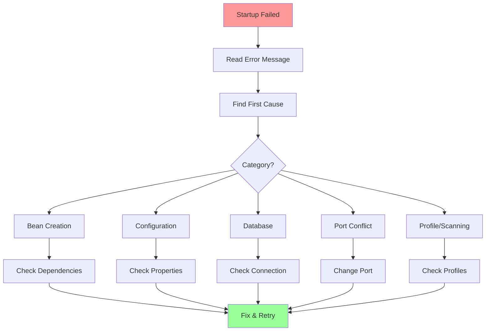
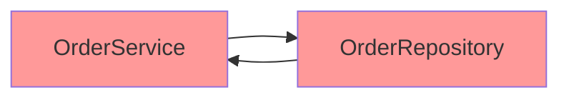

# Playbook: Debug Startup Failures

> [!tip] Quick Reference
> See [[SpringBoot/00_Cheat_Sheets]] for `--debug`, condition reports, and common startup-failure commands.

## Overview

Spring Boot startup failures can be frustrating, but they follow predictable patterns. This playbook provides a systematic approach to diagnosing and fixing common startup errors, from bean creation failures to configuration issues.

> [!summary] Goal
> Find the first real cause of startup failures and fix the underlying wiring/configuration issue using systematic debugging steps, error pattern recognition, and proven solutions.

---

## Systematic Debugging Approach

### Step-by-Step Process



### Golden Rules

1. **Read the FIRST error** (often near the bottom of stack trace)
2. **Spring Boot errors are descriptive** (read carefully)
3. **Enable debug logging early** (`--debug`)
4. **Check one thing at a time**
5. **Google the exact error message** (you're not alone)

---

## Reading Stack Traces

### Anatomy of a Stack Trace

```
***************************
APPLICATION FAILED TO START
***************************

Description:

Field userRepository in com.example.service.UserService required a bean of type 
'com.example.repository.UserRepository' that could not be found.

The injection point has the following annotations:
	- @org.springframework.beans.factory.annotation.Autowired(required=true)


Action:

Consider defining a bean of type 'com.example.repository.UserRepository' in your configuration.
```

**Key sections**:
- **Description**: What went wrong
- **Injection point**: Where the problem occurred
- **Action**: Spring's suggested fix

### Finding the First Cause

**Example multi-level stack trace**:

```
Error starting ApplicationContext. To display the conditions report re-run your application with 'debug' enabled.
2026-04-26 10:30:45.123 ERROR 12345 --- [  main] o.s.boot.SpringApplication: Application run failed

org.springframework.beans.factory.UnsatisfiedDependencyException: 
    Error creating bean with name 'orderController': 
    Unsatisfied dependency expressed through field 'orderService'; 
    nested exception is org.springframework.beans.factory.UnsatisfiedDependencyException: 
    Error creating bean with name 'orderService': 
    Unsatisfied dependency expressed through field 'orderRepository'; 
    nested exception is org.springframework.beans.factory.BeanCreationException: 
    Error creating bean with name 'orderRepository' defined in com.example.repository.OrderRepository 
    defined in @EnableJpaRepositories declared on JpaRepositoriesRegistrar.EnableJpaRepositoriesConfiguration: 
    Cannot resolve reference to bean 'jpaMappingContext' while setting bean property 'mappingContext'; 
    nested exception is org.springframework.beans.factory.BeanCreationException: 
    Error creating bean with name 'jpaMappingContext': 
    Invocation of init method failed; 
    nested exception is javax.persistence.PersistenceException: 
    [PersistenceUnit: default] Unable to build Hibernate SessionFactory; 
    nested exception is org.hibernate.MappingException: 
    Could not determine type for: java.util.List, at table: orders, for columns: [org.hibernate.mapping.Column(items)]

Caused by: org.hibernate.MappingException: Could not determine type for: java.util.List, at table: orders, for columns: [org.hibernate.mapping.Column(items)]
    at org.hibernate.mapping.SimpleValue.buildType(SimpleValue.java:...)
    ...
```

**How to read**:
1. Start at **"Caused by"** (bottom of chain)
2. **Root cause**: `Could not determine type for: java.util.List`
3. **Location**: `table: orders, for columns: [items]`
4. **Problem**: Missing `@ElementCollection` or `@OneToMany` on `items` field

**Fix**:

```java
@Entity
public class Order {
    @OneToMany(mappedBy = "order")
    private List<OrderItem> items;  // Add relationship annotation
}
```

---

## Common Error Categories

### 1. Bean Creation Errors

#### 1.1. BeanCreationException: Missing Bean

**Error**:

```
Field userRepository in com.example.service.UserService required a bean of type 
'com.example.repository.UserRepository' that could not be found.
```

**Causes**:
- Bean not annotated (`@Repository`, `@Service`, `@Component`)
- Package not scanned
- Conditional not met (`@ConditionalOnProperty`, etc.)
- Profile mismatch

**Debugging steps**:

```bash
# 1. Enable debug logging
java -jar app.jar --debug

# 2. Check if bean exists
curl http://localhost:8080/actuator/beans | jq '.contexts.application.beans | keys' | grep userRepository

# 3. Check condition evaluation report (in debug output)
```

**Solution 1: Missing annotation**:

```java
@Repository  // Add this!
public interface UserRepository extends JpaRepository<User, Long> {
}
```

**Solution 2: Package not scanned**:

```java
@SpringBootApplication(scanBasePackages = {"com.example", "com.external"})
public class Application {
}
```

**Solution 3: Conditional not met**:

```yaml
# Check application.yml
myapp:
  feature:
    enabled: true  # Required for @ConditionalOnProperty
```

#### 1.2. CircularDependencyException

**Error**:

```
The dependencies of some of the beans in the application context form a cycle:

┌─────┐
|  orderService (field com.example.repository.OrderRepository)
↑     ↓
|  orderRepository (field com.example.service.OrderService)
└─────┘
```

**Diagram**:



**Solution 1: Use @Lazy**:

```java
@Service
public class OrderService {
    
    @Autowired
    @Lazy  // Inject proxy to break cycle
    private OrderRepository orderRepository;
}
```

**Solution 2: Restructure dependencies**:

```java
// Extract common logic
@Service
public class ValidationService {
    public void validate(Order order) { }
}

@Service
public class OrderService {
    @Autowired
    private ValidationService validationService;  // No cycle
}
```

**Solution 3: Constructor injection**:

```java
@Service
public class OrderService {
    
    private final OrderRepository orderRepository;
    
    @Autowired
    public OrderService(OrderRepository orderRepository) {
        this.orderRepository = orderRepository;
    }
}
```

#### 1.3. BeanCreationException: Constructor Arguments

**Error**:

```
Parameter 0 of constructor in com.example.service.OrderService required a bean of type 
'com.example.repository.OrderRepository' that could not be found.
```

**Cause**: Constructor dependency not satisfied.

**Solution**: Ensure dependency is a bean:

```java
@Repository
public interface OrderRepository extends JpaRepository<Order, Long> {
}
```

#### 1.4. BeanCreationException: Ambiguous Beans

**Error**:

```
Field userService in com.example.controller.UserController required a single bean, 
but 2 were found:
	- userServiceImpl1
	- userServiceImpl2
```

**Cause**: Multiple beans of same type.

**Solution 1: Use @Primary**:

```java
@Service
@Primary  // This one will be injected by default
public class UserServiceImpl1 implements UserService {
}

@Service
public class UserServiceImpl2 implements UserService {
}
```

**Solution 2: Use @Qualifier**:

```java
@RestController
public class UserController {
    
    @Autowired
    @Qualifier("userServiceImpl1")  // Specify which one
    private UserService userService;
}
```

---

### 2. Configuration Errors

#### 2.1. Property Binding Error

**Error**:

```
Binding to target org.springframework.boot.context.properties.bind.BindException: 
Failed to bind properties under 'spring.datasource.hikari.maximum-pool-size' to java.lang.Integer

Reason: failed to convert java.lang.String to java.lang.Integer
```

**Cause**: Property value has wrong type.

**Configuration**:

```yaml
spring:
  datasource:
    hikari:
      maximum-pool-size: "ten"  # WRONG: Should be integer
```

**Solution**:

```yaml
spring:
  datasource:
    hikari:
      maximum-pool-size: 10  # Correct
```

#### 2.2. Missing Required Property

**Error**:

```
Binding to target com.example.config.AppProperties failed:

Property: myapp.api.url
Value: null
Reason: must not be null
```

**Configuration class**:

```java
@ConfigurationProperties(prefix = "myapp.api")
@Validated
public class AppProperties {
    
    @NotNull
    private String url;  // Missing in application.yml
}
```

**Solution**:

```yaml
myapp:
  api:
    url: https://api.example.com
```

#### 2.3. Invalid Property Value

**Error**:

```
Failed to bind properties under 'server.port' to int:

Property: server.port
Value: invalid
Reason: failed to convert java.lang.String to int
```

**Solution**:

```yaml
server:
  port: 8080  # Must be integer
```

---

### 3. Database Errors

#### 3.1. DataSource URL Not Specified

**Error**:

```
Failed to configure a DataSource: 'url' attribute is not specified and no embedded datasource could be configured.

Reason: Failed to determine a suitable driver class

Action:

Consider the following:
	If you want an embedded database (H2, HSQL or Derby), please put it on the classpath.
	If you have database settings to be loaded from a particular profile you may need to activate it (no profiles are currently active).
```

**Cause**: Missing `spring.datasource.url`.

**Solution**:

```yaml
spring:
  datasource:
    url: jdbc:postgresql://localhost:5432/mydb
    username: user
    password: secret
```

#### 3.2. Database Connection Failed

**Error**:

```
HikariPool-1 - Exception during pool initialization.

org.postgresql.util.PSQLException: Connection to localhost:5432 refused. 
Check that the hostname and port are correct and that the postmaster is accepting TCP/IP connections.
```

**Causes**:
- Database not running
- Wrong host/port
- Firewall blocking connection
- Wrong credentials

**Debugging steps**:

```bash
# 1. Check if database is running
pg_isready -h localhost -p 5432

# 2. Test connection manually
psql -h localhost -p 5432 -U user -d mydb

# 3. Check application.yml
```

**Solution**: Fix connection details:

```yaml
spring:
  datasource:
    url: jdbc:postgresql://localhost:5432/mydb  # Correct host/port
    username: correct_user
    password: correct_password
```

#### 3.3. Flyway Migration Failed

**Error**:

```
Error occurred while configuring Flyway

FlywayException: Validate failed: 
Migration checksum mismatch for migration version 1
-> Applied to database : 123456789
-> Resolved locally    : 987654321
```

**Cause**: Migration file changed after being applied.

**Solutions**:

**Option 1: Repair checksums** (if file didn't actually change):

```bash
./mvnw flyway:repair
```

**Option 2: Create new migration**:

```sql
-- V3__fix_issue.sql
ALTER TABLE users ADD COLUMN phone VARCHAR(20);
```

**Option 3: Clean and re-migrate** (DEV ONLY):

```bash
./mvnw flyway:clean flyway:migrate
```

**Never run `flyway:clean` in production!**

#### 3.4. JPA Entity Mapping Error

**Error**:

```
org.hibernate.MappingException: Could not determine type for: java.util.List, 
at table: orders, for columns: [org.hibernate.mapping.Column(items)]
```

**Cause**: Missing relationship annotation.

**Wrong**:

```java
@Entity
public class Order {
    private List<OrderItem> items;  // No annotation!
}
```

**Solution**:

```java
@Entity
public class Order {
    
    @OneToMany(mappedBy = "order", cascade = CascadeType.ALL)
    private List<OrderItem> items;
}
```

---

### 4. Port Already in Use

**Error**:

```
***************************
APPLICATION FAILED TO START
***************************

Description:

Web server failed to start. Port 8080 was already in use.

Action:

Identify and stop the process that's listening on port 8080 or configure this application to listen on another port.
```

**Solution 1: Change port**:

```yaml
server:
  port: 8081
```

**Solution 2: Kill process**:

```bash
# Linux/Mac
lsof -i :8080
kill -9 <PID>

# Windows
netstat -ano | findstr :8080
taskkill /PID <PID> /F
```

---

### 5. Profile and Scanning Issues

#### 5.1. Profile Not Activated

**Error**: Application uses wrong configuration (e.g., connects to dev database in prod).

**Cause**: Profile not activated.

**Debugging**:

```bash
# Check active profile
curl http://localhost:8080/actuator/env | jq '.propertySources[] | select(.name | contains("activeProfiles"))'
```

**Solution**: Activate profile:

```bash
java -jar app.jar --spring.profiles.active=prod
```

**Or environment variable**:

```bash
export SPRING_PROFILES_ACTIVE=prod
java -jar app.jar
```

**Or application.properties**:

```properties
spring.profiles.active=prod
```

#### 5.2. Component Not Scanned

**Error**:

```
Field userRepository in com.example.service.UserService required a bean of type 
'com.example.repository.UserRepository' that could not be found.
```

**Cause**: Repository in different package not scanned.

**Wrong**:

```
com.example.app
  └── Application.java (main class)
com.external.repository
  └── UserRepository.java  # Not scanned!
```

**Solution**: Specify scan packages:

```java
@SpringBootApplication(scanBasePackages = {"com.example", "com.external"})
public class Application {
}
```

**Or use @Import**:

```java
@SpringBootApplication
@Import(UserRepository.class)
public class Application {
}
```

---

## Enable Debug Logging

### Command Line

```bash
java -jar app.jar --debug
```

### application.yml

```yaml
debug: true

logging:
  level:
    org.springframework: DEBUG
    org.springframework.boot.autoconfigure: DEBUG
    org.hibernate: DEBUG
```

### Condition Evaluation Report

When debug is enabled, Spring Boot prints which auto-configurations matched/didn't match:

```
============================
CONDITIONS EVALUATION REPORT
============================

Positive matches:
-----------------

   DataSourceAutoConfiguration matched:
      - @ConditionalOnClass found required class 'javax.sql.DataSource' (OnClassCondition)

Negative matches:
-----------------

   MongoAutoConfiguration:
      Did not match:
         - @ConditionalOnClass did not find required class 'com.mongodb.client.MongoClient' (OnClassCondition)
```

---

## Using Actuator for Debugging

### Check Beans

```bash
curl http://localhost:8080/actuator/beans | jq '.contexts.application.beans | keys'
```

**Look for**:
- Is my bean created?
- What dependencies does it have?

### Check Auto-Configuration

```bash
curl http://localhost:8080/actuator/conditions | jq
```

**Use case**: Why didn't DataSource auto-configuration run?

### Check Environment

```bash
curl http://localhost:8080/actuator/env | jq '.propertySources'
```

**Use case**: Is my property set correctly?

---

## Real-World Examples

### Example 1: Missing JPA Repository

**Symptom**:

```
Field orderRepository in com.example.service.OrderService required a bean of type 
'com.example.repository.OrderRepository' that could not be found.
```

**Investigation**:

```bash
# 1. Check if @Repository annotation exists
cat src/main/java/com/example/repository/OrderRepository.java
```

```java
// WRONG: No annotation
public interface OrderRepository extends JpaRepository<Order, Long> {
}
```

**Solution**:

```java
@Repository
public interface OrderRepository extends JpaRepository<Order, Long> {
}
```

**Or enable JPA repositories**:

```java
@SpringBootApplication
@EnableJpaRepositories(basePackages = "com.example.repository")
public class Application {
}
```

### Example 2: H2 Database Not Found

**Symptom**:

```
Failed to configure a DataSource: 'url' attribute is not specified and no embedded datasource could be configured.
```

**Investigation**:

```bash
# 1. Check if H2 is on classpath
./mvnw dependency:tree | grep h2
```

**Output**: (empty - H2 not on classpath)

**Solution**: Add H2 dependency:

```xml
<dependency>
    <groupId>com.h2database</groupId>
    <artifactId>h2</artifactId>
    <scope>runtime</scope>
</dependency>
```

**Or configure external database**:

```yaml
spring:
  datasource:
    url: jdbc:postgresql://localhost:5432/mydb
    username: user
    password: secret
```

### Example 3: Hibernate Dialect Not Set

**Symptom**:

```
HHH000342: Could not obtain connection to query metadata
org.postgresql.util.PSQLException: FATAL: password authentication failed for user "user"
```

**Investigation**: Check application.yml

```yaml
spring:
  datasource:
    url: jdbc:postgresql://localhost:5432/mydb
    username: user
    password: wrong_password  # WRONG!
```

**Solution**: Fix password:

```yaml
spring:
  datasource:
    url: jdbc:postgresql://localhost:5432/mydb
    username: user
    password: correct_password
```

### Example 4: Missing @Transactional

**Symptom**:

```
org.hibernate.LazyInitializationException: 
failed to lazily initialize a collection of role: com.example.model.User.orders, 
could not initialize proxy - no Session
```

**Investigation**: Check service method:

```java
public User findUserWithOrders(Long id) {  // No @Transactional!
    User user = userRepository.findById(id).orElseThrow();
    user.getOrders().size();  // Lazy load outside transaction
    return user;
}
```

**Solution 1: Add @Transactional**:

```java
@Transactional
public User findUserWithOrders(Long id) {
    User user = userRepository.findById(id).orElseThrow();
    user.getOrders().size();  // Works inside transaction
    return user;
}
```

**Solution 2: Use JOIN FETCH**:

```java
@Query("SELECT u FROM User u LEFT JOIN FETCH u.orders WHERE u.id = :id")
User findUserWithOrders(@Param("id") Long id);
```

### Example 5: Auto-Configuration Not Running

**Symptom**: DataSource bean not created (no error, just missing).

**Investigation**:

```bash
curl http://localhost:8080/actuator/conditions | jq '.contexts.application.negativeMatches.DataSourceAutoConfiguration'
```

**Output**:

```json
{
  "notMatched": [
    {
      "condition": "OnPropertyCondition",
      "message": "@ConditionalOnProperty (spring.datasource.url) did not find property 'spring.datasource.url'"
    }
  ]
}
```

**Solution**: Add datasource URL:

```yaml
spring:
  datasource:
    url: jdbc:postgresql://localhost:5432/mydb
```

---

## Checklist for Debugging Startup Failures

### Initial Triage

- [ ] Read error message carefully
- [ ] Scroll to first "Caused by" (root cause)
- [ ] Note the bean/class that failed
- [ ] Check if it's a well-known error (BeanCreationException, CircularDependencyException, etc.)

### Enable Debug Mode

- [ ] Run with `--debug` flag
- [ ] Check condition evaluation report
- [ ] Look for negative matches (auto-configs that didn't run)

### Check Configuration

- [ ] Verify `application.yml` / `application.properties`
- [ ] Check active profile (`spring.profiles.active`)
- [ ] Ensure required properties are set
- [ ] Verify property types (int, String, etc.)

### Check Dependencies

- [ ] Verify required dependencies in `pom.xml` / `build.gradle`
- [ ] Check for version conflicts (`mvn dependency:tree`)
- [ ] Ensure annotations are present (`@Repository`, `@Service`, etc.)

### Check Component Scanning

- [ ] Verify packages are scanned (`scanBasePackages`)
- [ ] Check if beans are in scanned packages
- [ ] Look for `@ComponentScan` exclusions

### Check Database

- [ ] Verify database is running
- [ ] Test connection manually
- [ ] Check credentials in `application.yml`
- [ ] Verify Flyway migrations (if used)

### Use Actuator

- [ ] Check `/actuator/beans` (is bean created?)
- [ ] Check `/actuator/conditions` (why auto-config didn't run?)
- [ ] Check `/actuator/env` (are properties set?)

### Last Resort

- [ ] Clean and rebuild (`mvn clean install`)
- [ ] Delete `.m2/repository` cache (dependency corruption)
- [ ] Check GitHub issues for library
- [ ] Ask on Stack Overflow with full stack trace

---

## Common Mistake Patterns

### Mistake 1: Missing Dependency

**Symptom**: Class not found exception.

**Solution**: Add dependency to `pom.xml`.

### Mistake 2: Typo in Property Name

**Symptom**: Property not bound, default value used.

**Solution**: Check property name in `@ConfigurationProperties`.

### Mistake 3: Wrong Profile

**Symptom**: Wrong database connected, wrong config used.

**Solution**: Set `spring.profiles.active`.

### Mistake 4: Circular Dependency

**Symptom**: CircularDependencyException.

**Solution**: Use `@Lazy` or restructure dependencies.

### Mistake 5: Missing Annotation

**Symptom**: Bean not found.

**Solution**: Add `@Component`, `@Service`, `@Repository`, etc.

---

## Tools and Commands

### IntelliJ IDEA

- **View dependencies**: Right-click `pom.xml` → Diagrams → Show Dependencies
- **Find bean usage**: Ctrl+Alt+H (Windows) / Cmd+Alt+H (Mac)
- **Spring tools**: View → Tool Windows → Spring

### Maven

```bash
# View dependency tree
mvn dependency:tree

# Clean build
mvn clean install

# Skip tests (faster)
mvn clean install -DskipTests

# Run with debug
mvn spring-boot:run -Dspring-boot.run.arguments=--debug
```

### cURL (Check Actuator)

```bash
# Health
curl http://localhost:8080/actuator/health | jq

# Beans
curl http://localhost:8080/actuator/beans | jq

# Conditions
curl http://localhost:8080/actuator/conditions | jq

# Environment
curl http://localhost:8080/actuator/env | jq
```

---

> [!question]- Interview Questions
> 
> **Q: How do you debug a Spring Boot startup failure?**
> A:
> 1. Read the error message (Spring gives good hints)
> 2. Find the first cause (scroll to "Caused by")
> 3. Enable debug logging (`--debug`)
> 4. Check condition evaluation report
> 5. Use actuator to inspect beans and configuration
> 
> **Q: What does "BeanCreationException" mean?**
> A: Spring couldn't create a bean. Common causes: missing dependency (bean not found), circular dependency, configuration error (wrong property type), missing annotation (`@Component`, `@Service`, etc.).
> 
> **Q: How do you fix a CircularDependencyException?**
> A:
> 1. Use `@Lazy` to inject a proxy
> 2. Restructure dependencies (extract common logic)
> 3. Use constructor injection instead of field injection
> 
> **Q: What causes "Port 8080 already in use"?**
> A: Another process is using port 8080. Solutions: change port (`server.port=8081`) or kill the process using the port (`lsof -i :8080` then `kill -9 <PID>`).
> 
> **Q: How do you check which auto-configurations ran?**
> A: Enable debug mode (`--debug`) and check the condition evaluation report, or use actuator: `curl http://localhost:8080/actuator/conditions`.
> 
> **Q: What does "DataSource url not specified" mean?**
> A: Spring Boot can't configure a DataSource because there is no embedded DB on the classpath and/or `spring.datasource.url` isn't configured. Fix by adding H2 (dev) or configuring the external database.
> 
> **Q: How do you debug why a bean wasn't created?**
> A: Check the stereotype annotation (`@Component`, `@Service`, etc.), confirm package scanning (`scanBasePackages`), review conditions (`@ConditionalOnProperty`, etc.), and inspect beans via `/actuator/beans`.
> 
> **Q: What causes `LazyInitializationException`?**
> A: Accessing a lazy relationship outside a transaction. Fix by moving access inside a `@Transactional` boundary, using `JOIN FETCH`, or mapping to DTOs (avoid switching to `EAGER` by default).

---

## Cross-Links

- **Boot structure**: [[SpringBoot/01_Foundations/01_Boot_Project_Structure_and_Profiles]]
- **DI lifecycle**: [[SpringBoot/01_Foundations/02_DI_and_Bean_Lifecycle]]
- **Auto-configuration**: [[SpringBoot/03_Advanced/03_AutoConfiguration_Internals]]
- **Debugging overview**: [[SpringBoot/03_Advanced/05_Debugging_and_Troubleshooting]]
- **JPA essentials**: [[SpringBoot/02_Core/01_Spring_Data_JPA_Essentials]]

---

## References

- [Spring Boot Common Application Properties](https://docs.spring.io/spring-boot/docs/current/reference/html/application-properties.html)
- [Spring Boot Auto-Configuration](https://docs.spring.io/spring-boot/reference/using/auto-configuration.html)
- [Spring Boot Actuator](https://docs.spring.io/spring-boot/reference/actuator/)
- [Stack Overflow - Spring Boot Tag](https://stackoverflow.com/questions/tagged/spring-boot)
