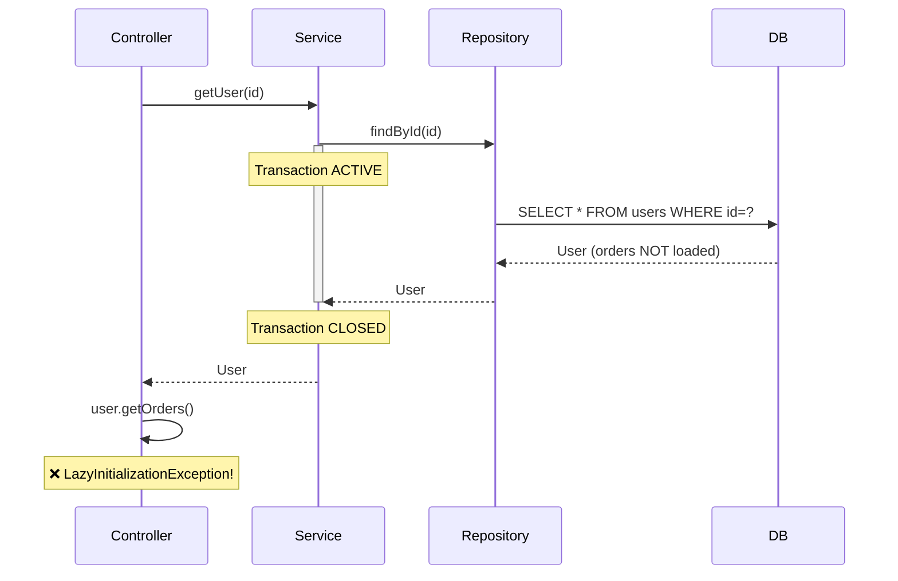
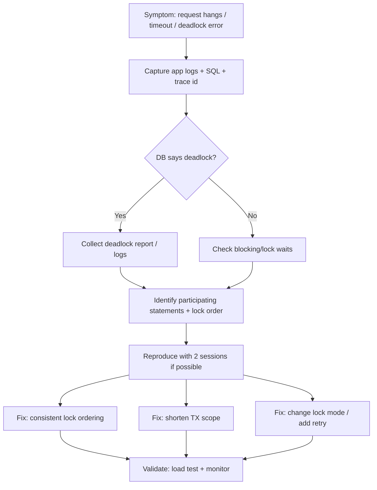
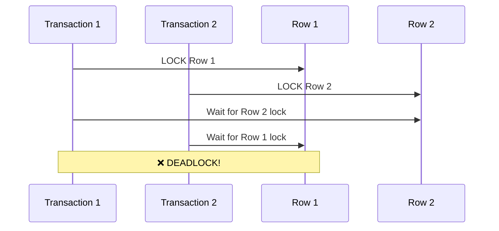

# Playbook: Debug Transactions and Locks

> [!summary] Goal
> Fix deadlocks, timeouts, LazyInitializationException, and inconsistent behavior by understanding transaction boundaries, lock mechanics, and Spring proxy behavior.

## Table of Contents

1. [Systematic Debugging Approach](#systematic-debugging-approach)
2. [Self-Invocation Debugging](#self-invocation-debugging)
3. [LazyInitializationException](#lazyinitializationexception)
4. [Deadlock Detection and Resolution](#deadlock-detection-and-resolution)
5. [Long-Running Transactions](#long-running-transactions)
6. [Unexpected Rollbacks](#unexpected-rollbacks)
7. [Isolation Level Issues](#isolation-level-issues)
8. [Connection Pool Exhaustion](#connection-pool-exhaustion)
9. [Database Lock Monitoring](#database-lock-monitoring)
10. [Real-World Scenarios](#real-world-scenarios)
11. [Debugging Tools](#debugging-tools)
12. [Quick Reference](#quick-reference)
13. [Interview Q&A](#interview-q-a)

---

## Systematic Debugging Approach

> [!tip] Quick Reference
> See [[SpringBoot/00_Cheat_Sheets#Transactions and Locking Cheat Sheet]] for propagation/isolation and common locking recipes.

### Step 1: Identify Symptoms

| Symptom | Likely Cause | Investigation Priority |
|---------|--------------|----------------------|
| `LazyInitializationException` | Transaction closed before lazy fetch | HIGH |
| Deadlock detected | Lock ordering conflict | HIGH |
| Transaction timeout | Long-running query or lock wait | HIGH |
| Data inconsistency | Wrong isolation level or propagation | MEDIUM |
| Connection pool exhausted | Connection leak or slow queries | HIGH |
| Method not transactional | Self-invocation or proxy bypass | MEDIUM |
| Optimistic lock exception | Concurrent modification | MEDIUM |

### Step 2: Gather Evidence

```bash
# Enable transaction logging in application.yml
logging:
  level:
    org.springframework.transaction: DEBUG
    org.springframework.orm.jpa: DEBUG
    org.hibernate.SQL: DEBUG
    org.hibernate.type.descriptor.sql.BasicBinder: TRACE
```

### Step 3: Confirm Transaction Boundaries

**Questions to answer:**
- Which method is annotated with `@Transactional`?
- Is it being called through a Spring proxy (not self-invoked)?
- What is the propagation level?
- Is the transaction read-only?

### Step 4: Verify Database State

```sql
-- PostgreSQL: Check active transactions
SELECT pid, state, query_start, state_change, query 
FROM pg_stat_activity 
WHERE state != 'idle' 
ORDER BY query_start;

-- MySQL: Check processlist
SHOW FULL PROCESSLIST;
```

---

## Self-Invocation Debugging

### Problem: Proxy Bypass

Spring's `@Transactional` works via **proxies**. When you call a method directly within the same class, the proxy is bypassed and the transaction never starts.

### Detection

```java
@Service
public class OrderService {
    
    // ❌ WRONG: createOrder calls saveOrder directly (self-invocation)
    public void createOrder(Order order) {
        // No transaction here!
        saveOrder(order);  // Proxy is bypassed
    }
    
    @Transactional
    public void saveOrder(Order order) {
        orderRepository.save(order);
        // Transaction starts, but too late if called from createOrder
    }
}
```

**How to detect:**
1. Enable transaction logging
2. Look for log: `"Creating new transaction with name [saveOrder]"`
3. If missing when called from `createOrder`, proxy was bypassed

### Solutions

#### Solution 1: Move @Transactional to Caller

```java
@Service
public class OrderService {
    
    @Transactional  // ✅ Transaction starts here
    public void createOrder(Order order) {
        saveOrder(order);  // Called within existing transaction
    }
    
    // Remove @Transactional here or use REQUIRES_SUPPORTS
    public void saveOrder(Order order) {
        orderRepository.save(order);
    }
}
```

#### Solution 2: Self-Inject the Bean

```java
@Service
public class OrderService {
    
    @Autowired
    private OrderService self;  // Inject proxy of self
    
    public void createOrder(Order order) {
        self.saveOrder(order);  // ✅ Calls through proxy
    }
    
    @Transactional
    public void saveOrder(Order order) {
        orderRepository.save(order);
    }
}
```

#### Solution 3: Use AopContext (Not Recommended)

```java
@Service
public class OrderService {
    
    public void createOrder(Order order) {
        // Get current proxy
        OrderService proxy = (OrderService) AopContext.currentProxy();
        proxy.saveOrder(order);  // ✅ Calls through proxy
    }
    
    @Transactional
    public void saveOrder(Order order) {
        orderRepository.save(order);
    }
}
```

**Enable in configuration:**
```java
@EnableAspectJAutoProxy(exposeProxy = true)
```

#### Solution 4: Extract to Separate Service (Best Practice)

```java
@Service
public class OrderService {
    
    @Autowired
    private OrderPersistenceService persistenceService;
    
    public void createOrder(Order order) {
        persistenceService.saveOrder(order);  // ✅ Calls different bean
    }
}

@Service
public class OrderPersistenceService {
    
    @Transactional
    public void saveOrder(Order order) {
        orderRepository.save(order);
    }
}
```

### Debugging Self-Invocation

```java
// Add this to detect if you're in a transaction
import org.springframework.transaction.support.TransactionSynchronizationManager;

public void someMethod() {
    boolean inTransaction = TransactionSynchronizationManager.isActualTransactionActive();
    System.out.println("In transaction: " + inTransaction);
    
    if (!inTransaction) {
        // Investigate why transaction didn't start
        throw new IllegalStateException("Expected to be in transaction!");
    }
}
```

---

## LazyInitializationException

### Problem

```
org.hibernate.LazyInitializationException: 
failed to lazily initialize a collection of role: com.example.User.orders, 
could not initialize proxy - no Session
```

### Root Cause

Trying to access a lazy-loaded relationship **after** the transaction/session has closed.

```java
@Service
public class UserService {
    
    @Transactional
    public User getUser(Long id) {
        return userRepository.findById(id).orElseThrow();
    }  // Transaction ends here, session closes
}

@RestController
public class UserController {
    
    @GetMapping("/users/{id}")
    public UserDTO getUser(@PathVariable Long id) {
        User user = userService.getUser(id);
        // ❌ Transaction closed, trying to access lazy collection
        List<Order> orders = user.getOrders();  // LazyInitializationException!
        return toDTO(user, orders);
    }
}
```

### Solution 1: Fetch Join in Query

```java
public interface UserRepository extends JpaRepository<User, Long> {
    
    @Query("SELECT u FROM User u LEFT JOIN FETCH u.orders WHERE u.id = :id")
    Optional<User> findByIdWithOrders(@PathVariable("id") Long id);
}

@Service
public class UserService {
    
    @Transactional(readOnly = true)
    public User getUserWithOrders(Long id) {
        return userRepository.findByIdWithOrders(id).orElseThrow();
    }  // Session closes, but orders are already loaded
}
```

### Solution 2: Use @EntityGraph

```java
public interface UserRepository extends JpaRepository<User, Long> {
    
    @EntityGraph(attributePaths = {"orders", "orders.items"})
    Optional<User> findById(Long id);
}
```

### Solution 3: Open Session in View (Anti-Pattern)

```yaml
# application.yml - NOT RECOMMENDED FOR PRODUCTION
spring:
  jpa:
    open-in-view: true  # Keeps session open until HTTP response rendered
```

**Why it's bad:**
- Database connections held longer
- Can mask lazy loading issues
- Performance problems in production

### Solution 4: Use DTOs with Projections

```java
public interface UserWithOrdersProjection {
    Long getId();
    String getName();
    List<OrderSummary> getOrders();
    
    interface OrderSummary {
        Long getId();
        BigDecimal getTotal();
    }
}

public interface UserRepository extends JpaRepository<User, Long> {
    
    @Query("SELECT u FROM User u LEFT JOIN FETCH u.orders WHERE u.id = :id")
    UserWithOrdersProjection findProjectionById(@PathVariable("id") Long id);
}
```

### Debugging LazyInitializationException



---

## Deadlock Detection and Resolution

### Deadlock Debug Workflow (Mermaid)



### Understanding Deadlocks

A deadlock occurs when two transactions wait for each other to release locks.



### PostgreSQL Deadlock Detection

```sql
-- Check for locks and blocking queries
SELECT 
    blocked_locks.pid AS blocked_pid,
    blocked_activity.usename AS blocked_user,
    blocking_locks.pid AS blocking_pid,
    blocking_activity.usename AS blocking_user,
    blocked_activity.query AS blocked_statement,
    blocking_activity.query AS blocking_statement
FROM pg_catalog.pg_locks blocked_locks
JOIN pg_catalog.pg_stat_activity blocked_activity 
    ON blocked_activity.pid = blocked_locks.pid
JOIN pg_catalog.pg_locks blocking_locks 
    ON blocking_locks.locktype = blocked_locks.locktype
    AND blocking_locks.database IS NOT DISTINCT FROM blocked_locks.database
    AND blocking_locks.relation IS NOT DISTINCT FROM blocked_locks.relation
    AND blocking_locks.page IS NOT DISTINCT FROM blocked_locks.page
    AND blocking_locks.tuple IS NOT DISTINCT FROM blocked_locks.tuple
    AND blocking_locks.virtualxid IS NOT DISTINCT FROM blocked_locks.virtualxid
    AND blocking_locks.transactionid IS NOT DISTINCT FROM blocked_locks.transactionid
    AND blocking_locks.classid IS NOT DISTINCT FROM blocked_locks.classid
    AND blocking_locks.objid IS NOT DISTINCT FROM blocked_locks.objid
    AND blocking_locks.objsubid IS NOT DISTINCT FROM blocked_locks.objsubid
    AND blocking_locks.pid != blocked_locks.pid
JOIN pg_catalog.pg_stat_activity blocking_activity 
    ON blocking_activity.pid = blocking_locks.pid
WHERE NOT blocked_locks.granted;
```

#### Use pg_stat_statements to Spot Lock-Heavy / Slow Queries

```sql
-- Enable once per DB
CREATE EXTENSION IF NOT EXISTS pg_stat_statements;

-- Top queries by total time
SELECT query, calls, total_time, mean_time, rows
FROM pg_stat_statements
ORDER BY total_time DESC
LIMIT 20;

-- High mean-time queries (often lock waits or bad plans)
SELECT query, calls, mean_time
FROM pg_stat_statements
WHERE calls >= 10
ORDER BY mean_time DESC
LIMIT 20;
```

> [!warning] Interpreting Results
> pg_stat_statements aggregates by normalized query. A single slow endpoint may appear as a single query with a high `mean_time`, even if the root cause is lock contention.

**Simplified version:**

```sql
-- Check current locks
SELECT 
    locktype,
    relation::regclass,
    mode,
    transactionid AS tid,
    pid,
    granted
FROM pg_locks
WHERE NOT granted
ORDER BY pid;
```

### MySQL Deadlock Detection

```sql
-- Show recent deadlock
SHOW ENGINE INNODB STATUS\G

-- Check current locks
SELECT 
    r.trx_id waiting_trx_id,
    r.trx_mysql_thread_id waiting_thread,
    r.trx_query waiting_query,
    b.trx_id blocking_trx_id,
    b.trx_mysql_thread_id blocking_thread,
    b.trx_query blocking_query
FROM information_schema.innodb_lock_waits w
JOIN information_schema.innodb_trx b ON b.trx_id = w.blocking_trx_id
JOIN information_schema.innodb_trx r ON r.trx_id = w.requesting_trx_id;
```

### Deadlock Resolution Strategies

#### Strategy 1: Consistent Lock Ordering

**Bad (causes deadlocks):**
```java
// Transaction 1
@Transactional
public void transferFunds(Account from, Account to, BigDecimal amount) {
    from.debit(amount);     // Lock account 1
    to.credit(amount);      // Lock account 2
}

// Transaction 2 (reverse order)
@Transactional
public void transferFunds(Account to, Account from, BigDecimal amount) {
    to.debit(amount);       // Lock account 2
    from.credit(amount);    // Lock account 1
}
// ❌ DEADLOCK: T1 waits for account 2, T2 waits for account 1
```

**Good (prevents deadlocks):**
```java
@Transactional
public void transferFunds(Long fromId, Long toId, BigDecimal amount) {
    // Always lock accounts in ID order
    Long firstId = Math.min(fromId, toId);
    Long secondId = Math.max(fromId, toId);
    
    Account first = accountRepository.findByIdWithLock(firstId);
    Account second = accountRepository.findByIdWithLock(secondId);
    
    if (fromId.equals(first.getId())) {
        first.debit(amount);
        second.credit(amount);
    } else {
        second.debit(amount);
        first.credit(amount);
    }
}
```

#### Strategy 2: Reduce Transaction Scope

**Bad:**
```java
@Transactional
public void processOrder(Order order) {
    // Long transaction holding locks
    orderRepository.save(order);           // Lock acquired
    callExternalPaymentAPI(order);         // Holds lock during network call
    sendEmail(order);                      // Holds lock during email
    updateInventory(order);                // Finally releases lock
}
```

**Good:**
```java
public void processOrder(Order order) {
    // Split into smaller transactions
    Order saved = saveOrder(order);
    callExternalPaymentAPI(saved);
    sendEmail(saved);
    updateInventory(saved);
}

@Transactional
public Order saveOrder(Order order) {
    return orderRepository.save(order);  // Short transaction
}

@Transactional
public void updateInventory(Order order) {
    inventoryRepository.decrementStock(order.getItems());
}
```

#### Strategy 3: Use Pessimistic Locking with Timeout

```java
public interface AccountRepository extends JpaRepository<Account, Long> {
    
    @Lock(LockModeType.PESSIMISTIC_WRITE)
    @QueryHints({
        @QueryHint(name = "jakarta.persistence.lock.timeout", value = "3000")
    })
    @Query("SELECT a FROM Account a WHERE a.id = :id")
    Optional<Account> findByIdWithLock(@PathVariable("id") Long id);
}
```

#### Strategy 4: Optimistic Locking

```java
@Entity
public class Account {
    
    @Id
    private Long id;
    
    @Version  // Enables optimistic locking
    private Long version;
    
    private BigDecimal balance;
}

@Transactional
public void transferFunds(Long fromId, Long toId, BigDecimal amount) {
    try {
        Account from = accountRepository.findById(fromId).orElseThrow();
        Account to = accountRepository.findById(toId).orElseThrow();
        
        from.debit(amount);
        to.credit(amount);
        
        accountRepository.saveAll(List.of(from, to));
    } catch (OptimisticLockException e) {
        // Retry logic
        throw new ConcurrentModificationException("Account modified by another transaction");
    }
}
```

#### Strategy 5: Skip Locked (PostgreSQL/MySQL 8+)

```java
public interface JobRepository extends JpaRepository<Job, Long> {
    
    @Lock(LockModeType.PESSIMISTIC_WRITE)
    @QueryHints({
        @QueryHint(name = "jakarta.persistence.lock.timeout", value = "0")  // NOWAIT or SKIP LOCKED
    })
    @Query(value = "SELECT * FROM jobs WHERE status = 'PENDING' " +
                   "ORDER BY created_at LIMIT 1 FOR UPDATE SKIP LOCKED", 
           nativeQuery = true)
    Optional<Job> findNextJobToProcess();
}
```

### Deadlock Retry Pattern

```java
@Service
public class RetryableTransactionService {
    
    private static final int MAX_RETRIES = 3;
    
    public void executeWithRetry(Runnable operation) {
        int attempt = 0;
        while (attempt < MAX_RETRIES) {
            try {
                operation.run();
                return;  // Success
            } catch (PessimisticLockException | DeadlockLoserDataAccessException e) {
                attempt++;
                if (attempt >= MAX_RETRIES) {
                    throw new RuntimeException("Failed after " + MAX_RETRIES + " retries", e);
                }
                // Exponential backoff
                try {
                    Thread.sleep((long) Math.pow(2, attempt) * 100);
                } catch (InterruptedException ie) {
                    Thread.currentThread().interrupt();
                    throw new RuntimeException(ie);
                }
            }
        }
    }
}
```

---

## Long-Running Transactions

### Detection

```sql
-- PostgreSQL: Find long-running transactions
SELECT 
    pid,
    now() - xact_start AS duration,
    state,
    query
FROM pg_stat_activity
WHERE xact_start IS NOT NULL
  AND state != 'idle'
ORDER BY duration DESC;

-- MySQL: Find long-running transactions
SELECT 
    trx_id,
    trx_started,
    TIMESTAMPDIFF(SECOND, trx_started, NOW()) AS duration_seconds,
    trx_query
FROM information_schema.innodb_trx
ORDER BY trx_started;
```

### Common Causes

1. **N+1 Query Problem**
2. **Large batch operations**
3. **External API calls inside transactions**
4. **Missing indexes causing table scans**

### Solution: Optimize Queries

**Bad (N+1 problem):**
```java
@Transactional
public List<OrderDTO> getAllOrders() {
    List<Order> orders = orderRepository.findAll();
    
    // N+1: Executes 1 query for orders + N queries for items
    return orders.stream()
        .map(order -> {
            List<OrderItem> items = order.getItems();  // Lazy load
            return new OrderDTO(order, items);
        })
        .collect(Collectors.toList());
}
```

**Good (fetch join):**
```java
public interface OrderRepository extends JpaRepository<Order, Long> {
    
    @Query("SELECT DISTINCT o FROM Order o LEFT JOIN FETCH o.items")
    List<Order> findAllWithItems();
}

@Transactional(readOnly = true)
public List<OrderDTO> getAllOrders() {
    List<Order> orders = orderRepository.findAllWithItems();
    return orders.stream()
        .map(order -> new OrderDTO(order, order.getItems()))
        .collect(Collectors.toList());
}
```

### Solution: Batch Processing

```java
@Transactional
public void processLargeDataset() {
    int pageSize = 100;
    int page = 0;
    
    Page<Order> orders;
    do {
        orders = orderRepository.findByStatus(
            OrderStatus.PENDING, 
            PageRequest.of(page++, pageSize)
        );
        
        // Process batch
        orders.forEach(this::processOrder);
        
        // Clear persistence context to avoid memory issues
        entityManager.flush();
        entityManager.clear();
        
    } while (orders.hasNext());
}
```

### Transaction Timeout Configuration

```java
// Method-level timeout
@Transactional(timeout = 10)  // 10 seconds
public void saveOrder(Order order) {
    orderRepository.save(order);
}

// Global configuration
@Configuration
public class TransactionConfig {
    
    @Bean
    public PlatformTransactionManager transactionManager(EntityManagerFactory emf) {
        JpaTransactionManager transactionManager = new JpaTransactionManager(emf);
        transactionManager.setDefaultTimeout(30);  // 30 seconds default
        return transactionManager;
    }
}
```

---

## Unexpected Rollbacks

### Problem: Checked vs Unchecked Exceptions

By default, Spring only rolls back on **unchecked exceptions** (RuntimeException and Error).

```java
@Transactional
public void createOrder(Order order) throws OrderException {
    orderRepository.save(order);
    
    if (order.getTotal().compareTo(BigDecimal.ZERO) <= 0) {
        // ❌ Checked exception - transaction NOT rolled back by default!
        throw new OrderException("Invalid order total");
    }
}
// Transaction commits even though exception was thrown!
```

### Solution: Configure rollbackFor

```java
@Transactional(rollbackFor = Exception.class)  // Roll back on all exceptions
public void createOrder(Order order) throws OrderException {
    orderRepository.save(order);
    
    if (order.getTotal().compareTo(BigDecimal.ZERO) <= 0) {
        throw new OrderException("Invalid order total");  // ✅ Rolls back
    }
}
```

### Solution: Use Unchecked Exceptions

```java
// Define unchecked exception
public class OrderException extends RuntimeException {
    public OrderException(String message) {
        super(message);
    }
}

@Transactional
public void createOrder(Order order) {
    orderRepository.save(order);
    
    if (order.getTotal().compareTo(BigDecimal.ZERO) <= 0) {
        throw new OrderException("Invalid order total");  // ✅ Rolls back
    }
}
```

### Debugging Rollback Behavior

```java
import org.springframework.transaction.interceptor.TransactionAspectSupport;

@Transactional
public void someMethod() {
    try {
        // Some operation
        riskyOperation();
    } catch (Exception e) {
        // Check if transaction is marked for rollback
        boolean isRollbackOnly = TransactionAspectSupport
            .currentTransactionStatus()
            .isRollbackOnly();
        
        System.out.println("Transaction rollback-only: " + isRollbackOnly);
    }
}
```

### Manual Rollback

```java
@Transactional
public void createOrder(Order order) {
    orderRepository.save(order);
    
    if (!validate(order)) {
        // Manually mark transaction for rollback
        TransactionAspectSupport.currentTransactionStatus().setRollbackOnly();
        return;
    }
    
    // Continue processing
}
```

---

## Isolation Level Issues

### Symptoms by Isolation Level

| Isolation Level | Dirty Read | Non-Repeatable Read | Phantom Read | Performance |
|----------------|------------|---------------------|--------------|-------------|
| READ_UNCOMMITTED | ✅ Possible | ✅ Possible | ✅ Possible | Fastest |
| READ_COMMITTED | ❌ Prevented | ✅ Possible | ✅ Possible | Fast |
| REPEATABLE_READ | ❌ Prevented | ❌ Prevented | ✅ Possible (MySQL prevents) | Slower |
| SERIALIZABLE | ❌ Prevented | ❌ Prevented | ❌ Prevented | Slowest |

### Problem 1: Non-Repeatable Read

```java
@Transactional(isolation = Isolation.READ_COMMITTED)
public void processOrder(Long orderId) {
    // Read 1
    Order order = orderRepository.findById(orderId).orElseThrow();
    BigDecimal total1 = order.getTotal();  // $100
    
    // Another transaction updates order.total to $200 and commits
    
    // Read 2 (same transaction)
    Order order2 = orderRepository.findById(orderId).orElseThrow();
    BigDecimal total2 = order2.getTotal();  // $200
    
    // total1 != total2  ❌ Non-repeatable read!
}
```

**Solution:**
```java
@Transactional(isolation = Isolation.REPEATABLE_READ)
public void processOrder(Long orderId) {
    // Reads within same transaction always return same data
}
```

### Problem 2: Phantom Read

```java
@Transactional(isolation = Isolation.REPEATABLE_READ)
public void generateReport() {
    // Query 1
    long count1 = orderRepository.countByStatus(OrderStatus.PENDING);  // 10
    
    // Another transaction inserts a new PENDING order and commits
    
    // Query 2 (same transaction)
    List<Order> orders = orderRepository.findByStatus(OrderStatus.PENDING);
    long count2 = orders.size();  // 11
    
    // count1 != count2  ❌ Phantom read! (PostgreSQL only, MySQL prevents this)
}
```

**Solution:**
```java
@Transactional(isolation = Isolation.SERIALIZABLE)
public void generateReport() {
    // Fully consistent view of data
}
```

### Debugging Isolation Issues

```sql
-- PostgreSQL: Check current isolation level
SHOW transaction_isolation;

-- Set isolation level for session
SET SESSION CHARACTERISTICS AS TRANSACTION ISOLATION LEVEL REPEATABLE READ;
```

```java
// Spring: Check isolation level programmatically
import org.springframework.jdbc.datasource.DataSourceUtils;

@Transactional
public void checkIsolationLevel() throws SQLException {
    Connection conn = DataSourceUtils.getConnection(dataSource);
    int level = conn.getTransactionIsolation();
    
    String levelName = switch (level) {
        case Connection.TRANSACTION_READ_UNCOMMITTED -> "READ_UNCOMMITTED";
        case Connection.TRANSACTION_READ_COMMITTED -> "READ_COMMITTED";
        case Connection.TRANSACTION_REPEATABLE_READ -> "REPEATABLE_READ";
        case Connection.TRANSACTION_SERIALIZABLE -> "SERIALIZABLE";
        default -> "UNKNOWN";
    };
    
    System.out.println("Isolation level: " + levelName);
}
```

---

## Connection Pool Exhaustion

### Detection

```yaml
# application.yml - HikariCP monitoring
spring:
  datasource:
    hikari:
      maximum-pool-size: 10
      minimum-idle: 5
      connection-timeout: 30000  # 30 seconds
      leak-detection-threshold: 60000  # 60 seconds - logs connection leaks
      
logging:
  level:
    com.zaxxer.hikari: DEBUG
```

**Symptoms:**
```
HikariPool-1 - Connection is not available, request timed out after 30000ms.
```

### Common Causes

1. **Long-running transactions holding connections**
2. **Connection leaks (not properly closed)**
3. **Pool size too small**
4. **Missing @Transactional causing connection per query**

### Debugging Connection Leaks

```java
// HikariCP will log stack trace of where connection was obtained
// if held longer than leak-detection-threshold
```

**Log output:**
```
HikariPool-1 - Connection leak detection triggered for connection ...
Stack trace of connection allocation:
  at com.example.OrderService.createOrder(OrderService.java:42)
  ...
```

### Solution: Monitor Pool Metrics

```java
@Component
public class HikariMetrics {
    
    @Autowired
    private HikariDataSource dataSource;
    
    @Scheduled(fixedDelay = 10000)
    public void logPoolStats() {
        HikariPoolMXBean pool = dataSource.getHikariPoolMXBean();
        
        System.out.println("Active connections: " + pool.getActiveConnections());
        System.out.println("Idle connections: " + pool.getIdleConnections());
        System.out.println("Total connections: " + pool.getTotalConnections());
        System.out.println("Threads awaiting connection: " + pool.getThreadsAwaitingConnection());
    }
}
```

### Solution: Tune Pool Size

**Formula:**
```
connections = ((core_count * 2) + effective_spindle_count)
```

For cloud databases (e.g., RDS):
```
connections = (available_memory_gb * 1000) / (work_mem_mb + overhead_mb)
```

**Configuration:**
```yaml
spring:
  datasource:
    hikari:
      maximum-pool-size: 20  # Adjust based on database capacity
      minimum-idle: 10
      connection-timeout: 30000
      idle-timeout: 600000  # 10 minutes
      max-lifetime: 1800000  # 30 minutes
```

---

## Database Lock Monitoring

### PostgreSQL Lock Monitoring

#### Query 1: Active Locks

```sql
SELECT 
    l.locktype,
    l.database,
    l.relation::regclass AS table_name,
    l.page,
    l.tuple,
    l.virtualxid,
    l.transactionid,
    l.mode,
    l.granted,
    a.pid,
    a.usename,
    a.query,
    a.state,
    a.query_start,
    now() - a.query_start AS duration
FROM pg_locks l
LEFT JOIN pg_stat_activity a ON l.pid = a.pid
WHERE l.pid IS NOT NULL
  AND a.state != 'idle'
ORDER BY a.query_start;
```

#### Query 2: Blocking Locks

```sql
SELECT
    activity.pid,
    activity.usename,
    activity.query AS blocked_query,
    blocking.pid AS blocking_id,
    blocking_activity.query AS blocking_query,
    activity.state
FROM pg_stat_activity AS activity
JOIN pg_stat_activity AS blocking_activity 
    ON blocking_activity.pid = ANY(pg_blocking_pids(activity.pid))
WHERE activity.pid != blocking_activity.pid;
```

#### Query 3: Lock Wait Analysis

```sql
SELECT 
    blocked_locks.pid AS blocked_pid,
    blocked_activity.usename AS blocked_user,
    now() - blocked_activity.query_start AS blocked_duration,
    blocking_locks.pid AS blocking_pid,
    blocking_activity.usename AS blocking_user,
    blocking_activity.query AS blocking_query,
    now() - blocking_activity.query_start AS blocking_duration
FROM pg_catalog.pg_locks blocked_locks
JOIN pg_catalog.pg_stat_activity blocked_activity ON blocked_activity.pid = blocked_locks.pid
JOIN pg_catalog.pg_locks blocking_locks 
    ON blocking_locks.locktype = blocked_locks.locktype
    AND blocking_locks.pid != blocked_locks.pid
JOIN pg_catalog.pg_stat_activity blocking_activity ON blocking_activity.pid = blocking_locks.pid
WHERE NOT blocked_locks.granted;
```

### MySQL Lock Monitoring

#### Query 1: InnoDB Locks

```sql
-- MySQL 8.0+
SELECT 
    r.trx_id AS waiting_trx_id,
    r.trx_mysql_thread_id AS waiting_thread,
    r.trx_query AS waiting_query,
    TIMESTAMPDIFF(SECOND, r.trx_started, NOW()) AS wait_duration,
    b.trx_id AS blocking_trx_id,
    b.trx_mysql_thread_id AS blocking_thread,
    b.trx_query AS blocking_query
FROM information_schema.innodb_lock_waits w
JOIN information_schema.innodb_trx b ON b.trx_id = w.blocking_trx_id
JOIN information_schema.innodb_trx r ON r.trx_id = w.requesting_trx_id;
```

#### Query 2: Metadata Locks

```sql
-- MySQL 8.0+
SELECT 
    object_type,
    object_schema,
    object_name,
    lock_type,
    lock_duration,
    lock_status,
    owner_thread_id,
    processlist_id
FROM performance_schema.metadata_locks
WHERE object_schema NOT IN ('mysql', 'performance_schema', 'information_schema');
```

#### Query 3: Table Locks

```sql
SELECT 
    t.TABLE_SCHEMA,
    t.TABLE_NAME,
    t.ENGINE,
    t.TABLE_ROWS,
    s.trx_id,
    s.trx_started,
    s.trx_query
FROM information_schema.TABLES t
JOIN information_schema.INNODB_TRX s
WHERE t.TABLE_SCHEMA NOT IN ('mysql', 'information_schema', 'performance_schema')
ORDER BY s.trx_started;
```

### Monitoring Dashboard SQL

```sql
-- PostgreSQL: Create monitoring view
CREATE OR REPLACE VIEW v_lock_monitor AS
SELECT 
    a.pid,
    a.usename,
    a.application_name,
    a.client_addr,
    a.state,
    a.query,
    l.locktype,
    l.mode,
    l.granted,
    now() - a.query_start AS duration,
    now() - a.xact_start AS transaction_duration
FROM pg_stat_activity a
LEFT JOIN pg_locks l ON a.pid = l.pid
WHERE a.state != 'idle'
ORDER BY transaction_duration DESC NULLS LAST;

-- Query the view
SELECT * FROM v_lock_monitor;
```

---

## Real-World Scenarios

### Scenario 1: Deadlock Between Two Transactions

**Symptoms:**
- Intermittent `DeadlockLoserDataAccessException`
- Error: "deadlock detected" in logs
- Happens during concurrent order processing

**Investigation Steps:**

1. **Enable deadlock logging:**
```yaml
logging:
  level:
    org.hibernate.engine.jdbc.spi.SqlExceptionHelper: ERROR
```

2. **Check database deadlock logs:**
```sql
-- PostgreSQL: Check logs
SELECT * FROM pg_stat_database_conflicts WHERE datname = 'mydb';

-- MySQL: Check last deadlock
SHOW ENGINE INNODB STATUS\G
```

3. **Analyze the deadlock:**
```
*** (1) TRANSACTION:
TRANSACTION 12345, ACTIVE 0 sec starting index read
UPDATE orders SET status = 'SHIPPED' WHERE id = 1;

*** (2) TRANSACTION:
TRANSACTION 12346, ACTIVE 0 sec starting index read  
UPDATE inventory SET quantity = quantity - 1 WHERE product_id = 100;
*** (2) WAITING FOR THIS LOCK TO BE GRANTED:
UPDATE orders SET status = 'SHIPPED' WHERE id = 1;
```

**Root Cause:**
```java
// Transaction 1
@Transactional
public void shipOrder(Long orderId) {
    Order order = orderRepository.findById(orderId).orElseThrow();  // Lock order
    order.setStatus(OrderStatus.SHIPPED);
    
    inventory.decrementStock(order.getProductId());  // Lock inventory
}

// Transaction 2 (concurrent)
@Transactional
public void updateInventory(Long productId) {
    Inventory inv = inventoryRepository.findById(productId).orElseThrow();  // Lock inventory
    inv.setQuantity(inv.getQuantity() - 1);
    
    // Update related orders
    List<Order> orders = orderRepository.findByProductId(productId);  // Lock orders
    orders.forEach(o -> o.setStatus(OrderStatus.PROCESSING));
}
// ❌ T1 locks order then inventory, T2 locks inventory then order
```

**Solution:**
```java
// Always lock in the same order: order first, then inventory
@Transactional
public void shipOrder(Long orderId) {
    // Lock order first
    Order order = orderRepository.findByIdWithLock(orderId).orElseThrow();
    
    // Then lock inventory
    Inventory inv = inventoryRepository.findByIdWithLock(order.getProductId()).orElseThrow();
    
    // Update both
    order.setStatus(OrderStatus.SHIPPED);
    inv.decrementQuantity(order.getQuantity());
}

public interface OrderRepository extends JpaRepository<Order, Long> {
    @Lock(LockModeType.PESSIMISTIC_WRITE)
    @Query("SELECT o FROM Order o WHERE o.id = :id")
    Optional<Order> findByIdWithLock(@PathVariable("id") Long id);
}
```

---

### Scenario 2: Transaction Timeout

**Symptoms:**
- `TransactionTimedOutException`
- Error: "transaction timeout expired"
- Happens during batch processing

**Investigation Steps:**

1. **Check timeout configuration:**
```java
@Transactional(timeout = 30)  // 30 seconds
public void processBatch(List<Order> orders) {
    // Process orders
}
```

2. **Find long-running queries:**
```sql
-- PostgreSQL
SELECT pid, now() - query_start AS duration, query 
FROM pg_stat_activity 
WHERE state != 'idle' 
ORDER BY duration DESC 
LIMIT 10;
```

3. **Enable query logging:**
```yaml
spring:
  jpa:
    show-sql: true
    properties:
      hibernate:
        format_sql: true
        use_sql_comments: true
```

**Root Cause:**
```java
@Transactional(timeout = 30)
public void processBatch(List<Order> orders) {
    // N+1 query problem - takes too long
    for (Order order : orders) {
        List<OrderItem> items = order.getItems();  // Lazy load - N queries
        items.forEach(this::processItem);
    }
}
```

**Solution:**
```java
@Transactional(timeout = 60, readOnly = true)  // Increase timeout, mark read-only
public void processBatch(List<Long> orderIds) {
    // Fetch all at once with join
    List<Order> orders = orderRepository.findAllByIdWithItems(orderIds);
    
    // Process in memory
    orders.forEach(order -> {
        order.getItems().forEach(this::processItem);
    });
}

public interface OrderRepository extends JpaRepository<Order, Long> {
    @Query("SELECT DISTINCT o FROM Order o LEFT JOIN FETCH o.items WHERE o.id IN :ids")
    List<Order> findAllByIdWithItems(@PathVariable("ids") List<Long> ids);
}
```

---

### Scenario 3: LazyInitializationException in Service Layer

**Symptoms:**
- `LazyInitializationException: could not initialize proxy - no Session`
- Happens when accessing relationships after transaction closes
- Intermittent (works in tests, fails in production)

**Investigation Steps:**

1. **Check Open Session in View:**
```yaml
spring:
  jpa:
    open-in-view: false  # Recommended for production
```

2. **Add transaction logging:**
```yaml
logging:
  level:
    org.springframework.transaction: TRACE
```

3. **Trace session lifecycle:**
```
Transaction started for UserService.getUser
Hibernate: select user0_.id ...
Transaction committed, session closed
Accessing user.orders  ❌ Session closed!
```

**Root Cause:**
```java
@Service
public class UserService {
    
    @Transactional(readOnly = true)
    public User getUser(Long id) {
        return userRepository.findById(id).orElseThrow();
    }  // Transaction ends, session closes
}

@Service
public class OrderService {
    
    @Autowired
    private UserService userService;
    
    public List<OrderDTO> getUserOrders(Long userId) {
        User user = userService.getUser(userId);  // Transaction closed
        
        // ❌ LazyInitializationException!
        List<Order> orders = user.getOrders();
        return toDTO(orders);
    }
}
```

**Solution 1: Fetch join in repository:**
```java
public interface UserRepository extends JpaRepository<User, Long> {
    
    @Query("SELECT u FROM User u LEFT JOIN FETCH u.orders WHERE u.id = :id")
    Optional<User> findByIdWithOrders(@PathVariable("id") Long id);
}

@Service
public class UserService {
    
    @Transactional(readOnly = true)
    public User getUserWithOrders(Long id) {
        return userRepository.findByIdWithOrders(id).orElseThrow();
    }  // Session closes, but orders are loaded
}
```

**Solution 2: Move transaction to caller:**
```java
@Service
public class OrderService {
    
    @Autowired
    private UserRepository userRepository;
    
    @Transactional(readOnly = true)  // Transaction spans entire method
    public List<OrderDTO> getUserOrders(Long userId) {
        User user = userRepository.findById(userId).orElseThrow();
        List<Order> orders = user.getOrders();  // ✅ Session still open
        return toDTO(orders);
    }
}
```

---

### Scenario 4: Self-Invocation Not Starting Transaction

**Symptoms:**
- Data not persisted to database
- No rollback on exception
- Transaction logs show no transaction started

**Investigation Steps:**

1. **Enable AOP logging:**
```yaml
logging:
  level:
    org.springframework.aop: TRACE
    org.springframework.transaction: DEBUG
```

2. **Check for self-invocation:**
```java
@Service
public class OrderService {
    
    public void createOrder(Order order) {
        // Calling transactional method from same class
        saveOrder(order);  // ❌ Proxy bypassed!
    }
    
    @Transactional
    public void saveOrder(Order order) {
        orderRepository.save(order);
    }
}
```

3. **Verify transaction started:**
```
# Expected log:
Creating new transaction with name [OrderService.saveOrder]: PROPAGATION_REQUIRED

# Actual log:
(no transaction log - self-invocation!)
```

**Root Cause:**
- Spring uses proxies for `@Transactional`
- Self-invocation bypasses proxy
- Transaction never starts

**Solution:**
```java
@Service
public class OrderService {
    
    @Autowired
    private OrderService self;  // Inject proxy
    
    public void createOrder(Order order) {
        self.saveOrder(order);  // ✅ Calls through proxy
    }
    
    @Transactional
    public void saveOrder(Order order) {
        orderRepository.save(order);
    }
}
```

---

### Scenario 5: Optimistic Lock Exception

**Symptoms:**
- `OptimisticLockException`
- Error: "Row was updated or deleted by another transaction"
- Happens during concurrent updates

**Investigation Steps:**

1. **Check entity version:**
```java
@Entity
public class Product {
    @Id
    private Long id;
    
    @Version  // Optimistic locking enabled
    private Long version;
    
    private Integer stock;
}
```

2. **Reproduce concurrently:**
```java
// Thread 1
Product p1 = productRepository.findById(1L).get();  // version = 1
p1.setStock(100);
Thread.sleep(1000);
productRepository.save(p1);  // Try to update with version = 1

// Thread 2 (concurrent)
Product p2 = productRepository.findById(1L).get();  // version = 1
p2.setStock(200);
productRepository.save(p2);  // ✅ Updates to version = 2

// Thread 1 continues
// ❌ OptimisticLockException - version mismatch (expected 1, actual 2)
```

**Root Cause:**
```java
@Transactional
public void updateStock(Long productId, Integer quantity) {
    Product product = productRepository.findById(productId).orElseThrow();
    
    // Long processing time - increases chance of concurrent modification
    Thread.sleep(1000);
    
    product.setStock(quantity);
    productRepository.save(product);  // May fail with OptimisticLockException
}
```

**Solution 1: Retry logic:**
```java
@Service
public class ProductService {
    
    private static final int MAX_RETRIES = 3;
    
    public void updateStockWithRetry(Long productId, Integer quantity) {
        int attempt = 0;
        while (attempt < MAX_RETRIES) {
            try {
                updateStock(productId, quantity);
                return;  // Success
            } catch (OptimisticLockException e) {
                attempt++;
                if (attempt >= MAX_RETRIES) {
                    throw new ConcurrentModificationException(
                        "Product was modified by another transaction", e
                    );
                }
                // Wait before retry
                try {
                    Thread.sleep(100 * attempt);
                } catch (InterruptedException ie) {
                    Thread.currentThread().interrupt();
                    throw new RuntimeException(ie);
                }
            }
        }
    }
    
    @Transactional
    public void updateStock(Long productId, Integer quantity) {
        Product product = productRepository.findById(productId).orElseThrow();
        product.setStock(quantity);
        productRepository.save(product);
    }
}
```

**Solution 2: Use pessimistic locking:**
```java
public interface ProductRepository extends JpaRepository<Product, Long> {
    
    @Lock(LockModeType.PESSIMISTIC_WRITE)
    @Query("SELECT p FROM Product p WHERE p.id = :id")
    Optional<Product> findByIdWithLock(@PathVariable("id") Long id);
}

@Transactional
public void updateStock(Long productId, Integer quantity) {
    // Lock row immediately
    Product product = productRepository.findByIdWithLock(productId).orElseThrow();
    product.setStock(quantity);
    // No save needed - managed entity
}
```

---

## Debugging Tools

### 1. IDE Debugger

**Breakpoint in transaction code:**
```java
@Transactional
public void createOrder(Order order) {
    orderRepository.save(order);  // Set breakpoint here
    
    // Evaluate expression in debugger:
    // TransactionSynchronizationManager.isActualTransactionActive()
    
    throw new RuntimeException("Test rollback");
}
```

### 2. SQL Logging

```yaml
# application.yml
spring:
  jpa:
    show-sql: true  # Print SQL to console
    properties:
      hibernate:
        format_sql: true  # Format SQL
        use_sql_comments: true  # Add comments with entity/method names
        generate_statistics: true  # Log performance stats
        
logging:
  level:
    org.hibernate.SQL: DEBUG
    org.hibernate.type.descriptor.sql.BasicBinder: TRACE  # Log parameters
    org.hibernate.stat: DEBUG  # Log statistics
```

**Output:**
```sql
/* insert com.example.Order */ 
insert into orders (id, total, status) values (?, ?, ?)
binding parameter [1] as [BIGINT] - [1]
binding parameter [2] as [DECIMAL] - [100.00]
binding parameter [3] as [VARCHAR] - [PENDING]
```

### 3. Transaction Logging

```yaml
logging:
  level:
    org.springframework.transaction: TRACE
    org.springframework.transaction.interceptor: TRACE
    org.springframework.orm.jpa: DEBUG
```

**Output:**
```
Creating new transaction with name [OrderService.createOrder]: PROPAGATION_REQUIRED,ISOLATION_DEFAULT
Opened new EntityManager [SessionImpl(12345)] for JPA transaction
Exposing JPA transaction as JDBC [HikariProxyConnection@67890]
Initiating transaction commit
Committing JPA transaction on EntityManager [SessionImpl(12345)]
Closing JPA EntityManager [SessionImpl(12345)] after transaction
```

### 4. AspectJ Tracing

```java
@Aspect
@Component
public class TransactionTracer {
    
    @Around("@annotation(transactional)")
    public Object traceTransaction(ProceedingJoinPoint pjp, Transactional transactional) throws Throwable {
        String methodName = pjp.getSignature().toShortString();
        
        boolean wasInTransaction = TransactionSynchronizationManager.isActualTransactionActive();
        
        System.out.println("=== Before " + methodName);
        System.out.println("In transaction: " + wasInTransaction);
        System.out.println("Propagation: " + transactional.propagation());
        
        try {
            Object result = pjp.proceed();
            
            System.out.println("=== After " + methodName + " (success)");
            System.out.println("Transaction active: " + 
                TransactionSynchronizationManager.isActualTransactionActive());
            
            return result;
        } catch (Exception e) {
            System.out.println("=== After " + methodName + " (exception: " + e.getMessage() + ")");
            System.out.println("Rollback-only: " + 
                TransactionSynchronizationManager.isCurrentTransactionReadOnly());
            throw e;
        }
    }
}
```

### 5. Database Query Monitoring

**PostgreSQL:**
```sql
-- Enable pg_stat_statements extension
CREATE EXTENSION IF NOT EXISTS pg_stat_statements;

-- Find slow queries
SELECT 
    query,
    calls,
    total_exec_time,
    mean_exec_time,
    max_exec_time
FROM pg_stat_statements
ORDER BY mean_exec_time DESC
LIMIT 10;
```

**MySQL:**
```sql
-- Enable slow query log
SET GLOBAL slow_query_log = 'ON';
SET GLOBAL long_query_time = 2;  -- Log queries > 2 seconds

-- Check slow query log
SHOW VARIABLES LIKE 'slow_query_log_file';
```

### 6. Spring Boot Actuator

```yaml
management:
  endpoints:
    web:
      exposure:
        include: health,metrics,info,env
  metrics:
    enable:
      hikari: true
      jdbc: true
```

**Access metrics:**
```bash
# HikariCP metrics
curl http://localhost:8080/actuator/metrics/hikaricp.connections.active
curl http://localhost:8080/actuator/metrics/hikaricp.connections.idle

# JPA metrics
curl http://localhost:8080/actuator/metrics/spring.data.repository.invocations
```

---

## Quick Reference

### Transaction Debugging Checklist

- [ ] Verify `@Transactional` annotation is present
- [ ] Check for self-invocation (same class method calls)
- [ ] Confirm transaction started (check logs)
- [ ] Verify propagation level matches requirements
- [ ] Check isolation level for read consistency needs
- [ ] Ensure exception triggers rollback (RuntimeException or rollbackFor)
- [ ] Review transaction scope (minimize duration)
- [ ] Check for lazy loading outside transaction
- [ ] Verify connection pool has sufficient capacity
- [ ] Monitor database locks and blocking queries
- [ ] Check for N+1 query problems
- [ ] Review index coverage for queries
- [ ] Test concurrent scenarios for deadlocks

### Optimistic vs Pessimistic Locking Comparison

| Aspect | Optimistic Locking | Pessimistic Locking |
|--------|-------------------|---------------------|
| **When to use** | Low contention, many reads | High contention, many writes |
| **Mechanism** | Version column, check on commit | Database row lock (SELECT FOR UPDATE) |
| **Performance** | Better (no locks) | Worse (blocks concurrent access) |
| **Failure mode** | OptimisticLockException at commit | Waits for lock, may timeout |
| **Retry** | Application must retry | Database handles waiting |
| **Deadlock risk** | None | Possible if lock ordering differs |
| **Example** | Product catalog updates | Bank account transfers |
| **Spring annotation** | `@Version` on entity field | `@Lock(PESSIMISTIC_WRITE)` |
| **SQL generated** | `UPDATE ... WHERE version = ?` | `SELECT ... FOR UPDATE` |

### Common Exceptions and Causes

| Exception | Cause | Solution |
|-----------|-------|----------|
| `LazyInitializationException` | Accessing lazy relationship outside transaction | Use fetch join or move to transactional context |
| `OptimisticLockException` | Version mismatch on update | Retry logic or switch to pessimistic lock |
| `PessimisticLockException` | Lock timeout or deadlock | Check lock ordering, reduce transaction scope |
| `TransactionTimedOutException` | Transaction exceeded timeout | Optimize queries, increase timeout, or split transaction |
| `CannotAcquireLockException` | Database deadlock detected | Ensure consistent lock ordering |
| `TransactionSystemException` | Commit/rollback failed | Check database connection, constraint violations |

### Transaction Propagation Quick Guide

```java
// REQUIRED (default) - Use existing or create new
@Transactional(propagation = Propagation.REQUIRED)

// REQUIRES_NEW - Always create new (suspend existing)
@Transactional(propagation = Propagation.REQUIRES_NEW)

// NESTED - Create savepoint in existing transaction
@Transactional(propagation = Propagation.NESTED)

// MANDATORY - Must have existing transaction
@Transactional(propagation = Propagation.MANDATORY)

// NEVER - Must NOT have transaction
@Transactional(propagation = Propagation.NEVER)

// NOT_SUPPORTED - Suspend transaction if exists
@Transactional(propagation = Propagation.NOT_SUPPORTED)

// SUPPORTS - Use transaction if exists, non-transactional otherwise
@Transactional(propagation = Propagation.SUPPORTS)
```

---

> [!question]- Interview Questions

> **Q: What happens when you call an `@Transactional` method from another method in the same class?**
> A: The transaction may not start because `@Transactional` is applied via proxies; self-invocation bypasses the proxy so the interceptor doesn’t run.
> 
> Solutions: move `@Transactional` to the caller, extract to a separate bean (preferred), or call via the proxied bean.
> 
> Example:
> ```java
> @Service
> public class OrderService {
>     @Autowired
>     private OrderService self;
> 
>     public void createOrder(Order order) {
>         self.saveOrder(order);  // Calls through proxy
>     }
> 
>     @Transactional
>     public void saveOrder(Order order) {
>         orderRepository.save(order);
>     }
> }
> ```

> **Q: How do you debug a `LazyInitializationException`?**
> A: It happens when you access a lazy relationship after the session/transaction is closed.
> Investigation: trace where the relationship is accessed, verify transactional boundaries, and confirm `spring.jpa.open-in-view` behavior.
> Fixes: fetch join, `@EntityGraph`, move access inside `@Transactional`, or map to DTOs.

> **Q: How do you prevent deadlocks in a Spring Boot application?**
> A: Enforce consistent lock ordering, keep transactions short, choose optimistic vs pessimistic locking appropriately, add supporting indexes, and implement retry on deadlock/serialization failures.

> **Q: What's the difference between `REPEATABLE_READ` and `READ_COMMITTED` isolation levels?**
> A:
> 
> `READ_COMMITTED`:
> - Reads only committed data (prevents dirty reads)
> - Each read may see different data (non-repeatable reads possible)
> - Best for: general OLTP workloads, lower lock contention
> 
> `REPEATABLE_READ`:
> - Reads within the transaction always return the same data
> - Prevents dirty and non-repeatable reads
> - Phantom reads depend on DB/implementation
> - Best for: calculations requiring a consistent view
> 
> Example:
> ```java
> @Transactional(isolation = Isolation.READ_COMMITTED)
> public void example() {
>     BigDecimal total1 = orderRepository.sumTotal();  // $1000
>     // Another transaction updates order totals
>     BigDecimal total2 = orderRepository.sumTotal();  // $1500 (changed!)
> }
> 
> @Transactional(isolation = Isolation.REPEATABLE_READ)
> public void example() {
>     BigDecimal total1 = orderRepository.sumTotal();  // $1000
>     // Another transaction updates order totals
>     BigDecimal total2 = orderRepository.sumTotal();  // $1000 (same)
> }
> ```

> **Q: How do you detect and fix connection pool exhaustion?**
> A:
> 
> Detection:
> - Exceptions like `Connection is not available, request timed out`
> - Hikari metrics show 0 idle connections
> - Leak detection can help:
> ```yaml
> spring.datasource.hikari.leak-detection-threshold: 60000
> ```
> 
> Common causes: long transactions, leaks, pool too small, slow queries.
> Fixes: shorten transactions, fix leaks, tune pool size, add timeouts.

> **Q: When should you use optimistic vs pessimistic locking?**
> A:
> 
> Optimistic locking (`@Version`): low contention (reads >> writes). Pros: no DB locks. Cons: conflicts at commit, needs retries.
> 
> Pessimistic locking (`SELECT ... FOR UPDATE`): high contention / critical invariants. Pros: strong consistency during the transaction. Cons: blocking + deadlock risk.

> **Q: How do you troubleshoot an unexpected rollback?**
> A:
> 
> Investigation:
> - Remember default rollback rules (runtime exceptions / errors)
> - Turn on transaction logs (`logging.level.org.springframework.transaction=DEBUG`)
> - Inspect propagation (`REQUIRED` vs `REQUIRES_NEW`) and rollback-only markers
> 
> Fixes:
> - Use unchecked exceptions or configure `rollbackFor`
> - Re-check propagation boundaries and exception handling
> - As a last resort (rare), mark rollback-only manually:
> ```java
> TransactionAspectSupport.currentTransactionStatus().setRollbackOnly();
> ```

---

## Cross-Links

- **Transactions fundamentals**: [[SpringBoot/02_Core/02_Transactions_and_Propagation]]
- **JPA essentials**: [[SpringBoot/02_Core/01_Spring_Data_JPA_Essentials]]
- **Database locks**: [[SQL/02_Core/02_Transactions_and_Locking]]
- **PostgreSQL locking**: [[SQL/PostgreSQL/02_Core/02_Locks_and_MVCC]]
- **Production checklist**: [[SpringBoot/04_Playbooks/01_Production_Configuration_Checklist]]
- **Debugging guide**: [[SpringBoot/03_Advanced/05_Debugging_and_Troubleshooting]]
