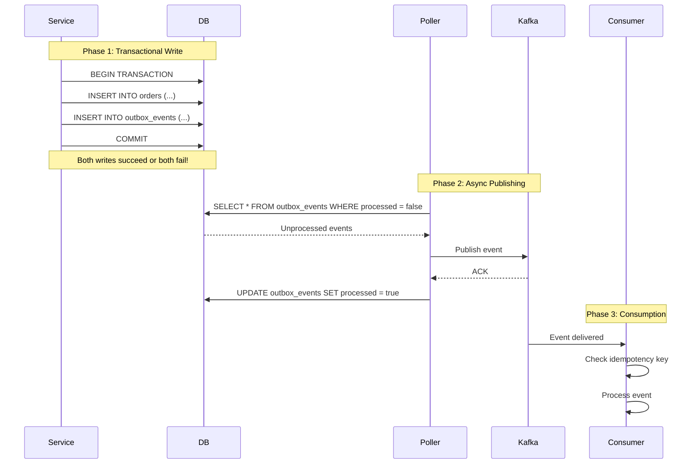

# Project: Outbox Pattern With Postgres and Kafka

> [!tip] Quick Reference
> See [[SpringBoot/00_Cheat_Sheets]] for Kafka/transactions quick lookups.

> [!summary] Goal
> Achieve reliable event publishing from a DB transaction using the transactional outbox pattern. Solve the dual-write problem by ensuring atomicity between database writes and Kafka publishes.

## Table of Contents

1. [Problem Statement](#problem-statement)
2. [Part 1: Understanding the Outbox Pattern](#part-1-understanding-the-outbox-pattern)
3. [Part 2: Project Setup](#part-2-project-setup)
4. [Part 3: Entity Design](#part-3-entity-design)
5. [Part 4: Database Layer](#part-4-database-layer)
6. [Part 5: Service Layer](#part-5-service-layer)
7. [Part 6: Outbox Publisher](#part-6-outbox-publisher)
8. [Part 7: Kafka Configuration](#part-7-kafka-configuration)
9. [Part 8: Consumer Side](#part-8-consumer-side)
10. [Part 9: Testing](#part-9-testing)
11. [Part 10: Production Considerations](#part-10-production-considerations)
12. [Part 11: Alternative Approaches](#part-11-alternative-approaches)

---

## Problem Statement

### The Dual-Write Problem

**Scenario**: When creating an order, you need to:
1. Save the order to the database
2. Publish an "OrderCreated" event to Kafka

**Naive approach (WRONG)**:
```java
@Transactional
public void createOrder(Order order) {
    // Write 1: Database
    orderRepository.save(order);
    
    // Write 2: Kafka
    kafkaTemplate.send("orders", order);  // ❌ Not atomic!
}
```

**What can go wrong?**

| Scenario | DB | Kafka | Result |
|----------|----|----|--------|
| Success | ✅ Saved | ✅ Published | Perfect |
| DB fails | ❌ Rolled back | ✅ Published | **Inconsistent**: Event without data |
| Kafka fails | ✅ Committed | ❌ Lost | **Inconsistent**: Data without event |
| App crashes after DB save | ✅ Committed | ❌ Lost | **Inconsistent**: Data without event |

**Problem**: No way to make database write + Kafka publish **atomic** (all-or-nothing).

### The Solution: Transactional Outbox Pattern

**Principle**: Write domain entity + outbox event in the **same database transaction**.



**Benefits**:
- ✅ **Atomicity**: Both order and event are saved together
- ✅ **Reliability**: Events are never lost (stored in DB)
- ✅ **Eventual consistency**: Events published asynchronously
- ✅ **At-least-once delivery**: Retry on failure

---

## Part 1: Understanding the Outbox Pattern

### How It Works

**Step 1: Save domain entity + outbox event in single transaction**
```sql
BEGIN;
INSERT INTO orders (id, total, status) VALUES (1, 100.00, 'CREATED');
INSERT INTO outbox_events (aggregate_id, event_type, payload) 
    VALUES (1, 'OrderCreated', '{"orderId":1,"total":100.00}');
COMMIT;
```

**Step 2: Background poller reads unprocessed events**
```sql
SELECT * FROM outbox_events 
WHERE processed = false 
ORDER BY created_at 
LIMIT 100;
```

**Step 3: Publish to Kafka and mark as processed**
```sql
-- After successful Kafka publish
UPDATE outbox_events SET processed = true WHERE id = 123;
```

**Step 4: Consumer processes event idempotently**
```java
// Check if already processed
if (alreadyProcessed(event.getId())) {
    return; // Skip duplicate
}
processEvent(event);
markAsProcessed(event.getId());
```

### Key Concepts

1. **Single source of truth**: Database is the source of truth
2. **At-least-once delivery**: Events may be delivered multiple times
3. **Idempotency**: Consumers must handle duplicates
4. **Eventual consistency**: Events published asynchronously (not immediately)

---

## Part 2: Project Setup

### Dependencies

**`pom.xml`:**

```xml
<?xml version="1.0" encoding="UTF-8"?>
<project xmlns="http://maven.apache.org/POM/4.0.0"
         xmlns:xsi="http://www.w3.org/2001/XMLSchema-instance"
         xsi:schemaLocation="http://maven.apache.org/POM/4.0.0 
         https://maven.apache.org/xsd/maven-4.0.0.xsd">
    <modelVersion>4.0.0</modelVersion>
    
    <parent>
        <groupId>org.springframework.boot</groupId>
        <artifactId>spring-boot-starter-parent</artifactId>
        <version>3.2.5</version>
        <relativePath/>
    </parent>
    
    <groupId>com.example</groupId>
    <artifactId>outbox-pattern</artifactId>
    <version>0.0.1-SNAPSHOT</version>
    <name>outbox-pattern</name>
    <description>Transactional Outbox Pattern with Kafka</description>
    
    <properties>
        <java.version>17</java.version>
    </properties>
    
    <dependencies>
        <!-- Spring Boot -->
        <dependency>
            <groupId>org.springframework.boot</groupId>
            <artifactId>spring-boot-starter-web</artifactId>
        </dependency>
        
        <dependency>
            <groupId>org.springframework.boot</groupId>
            <artifactId>spring-boot-starter-data-jpa</artifactId>
        </dependency>
        
        <!-- Kafka -->
        <dependency>
            <groupId>org.springframework.kafka</groupId>
            <artifactId>spring-kafka</artifactId>
        </dependency>
        
        <!-- Database -->
        <dependency>
            <groupId>org.postgresql</groupId>
            <artifactId>postgresql</artifactId>
            <scope>runtime</scope>
        </dependency>
        
        <dependency>
            <groupId>org.flywaydb</groupId>
            <artifactId>flyway-core</artifactId>
        </dependency>
        
        <!-- JSON -->
        <dependency>
            <groupId>com.fasterxml.jackson.core</groupId>
            <artifactId>jackson-databind</artifactId>
        </dependency>
        
        <!-- Lombok -->
        <dependency>
            <groupId>org.projectlombok</groupId>
            <artifactId>lombok</artifactId>
            <optional>true</optional>
        </dependency>
        
        <!-- Testing -->
        <dependency>
            <groupId>org.springframework.boot</groupId>
            <artifactId>spring-boot-starter-test</artifactId>
            <scope>test</scope>
        </dependency>
        
        <dependency>
            <groupId>org.springframework.kafka</groupId>
            <artifactId>spring-kafka-test</artifactId>
            <scope>test</scope>
        </dependency>
        
        <dependency>
            <groupId>org.testcontainers</groupId>
            <artifactId>testcontainers</artifactId>
            <version>1.19.7</version>
            <scope>test</scope>
        </dependency>
        
        <dependency>
            <groupId>org.testcontainers</groupId>
            <artifactId>postgresql</artifactId>
            <version>1.19.7</version>
            <scope>test</scope>
        </dependency>
        
        <dependency>
            <groupId>org.testcontainers</groupId>
            <artifactId>kafka</artifactId>
            <version>1.19.7</version>
            <scope>test</scope>
        </dependency>
    </dependencies>
    
    <build>
        <plugins>
            <plugin>
                <groupId>org.springframework.boot</groupId>
                <artifactId>spring-boot-maven-plugin</artifactId>
            </plugin>
        </plugins>
    </build>
</project>
```

### Application Configuration

**`src/main/resources/application.yml`:**

```yaml
spring:
  application:
    name: outbox-pattern
  
  # Database
  datasource:
    url: jdbc:postgresql://localhost:5432/outboxdb
    username: postgres
    password: postgres
    driver-class-name: org.postgresql.Driver
  
  jpa:
    database-platform: org.hibernate.dialect.PostgreSQLDialect
    hibernate:
      ddl-auto: validate
    show-sql: true
  
  # Flyway
  flyway:
    enabled: true
    baseline-on-migrate: true
  
  # Kafka
  kafka:
    bootstrap-servers: localhost:9092
    producer:
      key-serializer: org.apache.kafka.common.serialization.StringSerializer
      value-serializer: org.springframework.kafka.support.serializer.JsonSerializer
      acks: all  # Wait for all replicas to acknowledge
      retries: 3
      properties:
        enable.idempotence: true  # Exactly-once semantics
    consumer:
      group-id: order-consumer-group
      auto-offset-reset: earliest
      key-deserializer: org.apache.kafka.common.serialization.StringDeserializer
      value-deserializer: org.springframework.kafka.support.serializer.JsonDeserializer
      properties:
        spring.json.trusted.packages: com.example.outboxpattern.dto
        isolation.level: read_committed  # Read only committed messages

# Outbox Poller Configuration
outbox:
  polling:
    enabled: true
    fixed-delay: 1000  # Poll every 1 second
    batch-size: 100    # Process up to 100 events per poll

logging:
  level:
    root: INFO
    com.example.outboxpattern: DEBUG
    org.springframework.kafka: INFO
```

### Project Structure

```
outbox-pattern/
├── src/main/java/com/example/outboxpattern/
│   ├── OutboxPatternApplication.java
│   ├── entity/
│   │   ├── Order.java
│   │   └── OutboxEvent.java
│   ├── repository/
│   │   ├── OrderRepository.java
│   │   └── OutboxEventRepository.java
│   ├── service/
│   │   ├── OrderService.java
│   │   └── OutboxPublisher.java
│   ├── controller/
│   │   └── OrderController.java
│   ├── dto/
│   │   ├── CreateOrderRequest.java
│   │   ├── OrderResponse.java
│   │   └── OrderEvent.java
│   ├── consumer/
│   │   └── OrderEventConsumer.java
│   └── config/
│       └── KafkaConfig.java
├── src/main/resources/
│   ├── application.yml
│   └── db/migration/
│       ├── V1__Create_orders_table.sql
│       ├── V2__Create_outbox_events_table.sql
│       └── V3__Add_outbox_indexes.sql
└── docker-compose.yml
```

---

## Part 3: Entity Design

### Order Entity

**`src/main/java/com/example/outboxpattern/entity/Order.java`:**

```java
package com.example.outboxpattern.entity;

import jakarta.persistence.*;
import lombok.*;
import org.springframework.data.annotation.CreatedDate;
import org.springframework.data.annotation.LastModifiedDate;
import org.springframework.data.jpa.domain.support.AuditingEntityListener;

import java.math.BigDecimal;
import java.time.LocalDateTime;

@Entity
@Table(name = "orders")
@EntityListeners(AuditingEntityListener.class)
@Getter
@Setter
@NoArgsConstructor
@AllArgsConstructor
@Builder
public class Order {

    @Id
    @GeneratedValue(strategy = GenerationType.IDENTITY)
    private Long id;

    @Column(nullable = false, unique = true)
    private String orderNumber;

    @Column(nullable = false)
    private String customerEmail;

    @Column(nullable = false, precision = 10, scale = 2)
    private BigDecimal totalAmount;

    @Enumerated(EnumType.STRING)
    @Column(nullable = false)
    @Builder.Default
    private OrderStatus status = OrderStatus.CREATED;

    @CreatedDate
    @Column(name = "created_at", nullable = false, updatable = false)
    private LocalDateTime createdAt;

    @LastModifiedDate
    @Column(name = "updated_at", nullable = false)
    private LocalDateTime updatedAt;

    public enum OrderStatus {
        CREATED,
        CONFIRMED,
        SHIPPED,
        DELIVERED,
        CANCELLED
    }
}
```

### OutboxEvent Entity

**`src/main/java/com/example/outboxpattern/entity/OutboxEvent.java`:**

```java
package com.example.outboxpattern.entity;

import jakarta.persistence.*;
import lombok.*;
import org.springframework.data.annotation.CreatedDate;
import org.springframework.data.jpa.domain.support.AuditingEntityListener;

import java.time.LocalDateTime;

@Entity
@Table(name = "outbox_events")
@EntityListeners(AuditingEntityListener.class)
@Getter
@Setter
@NoArgsConstructor
@AllArgsConstructor
@Builder
public class OutboxEvent {

    @Id
    @GeneratedValue(strategy = GenerationType.IDENTITY)
    private Long id;

    /**
     * ID of the aggregate (e.g., Order ID)
     */
    @Column(name = "aggregate_id", nullable = false)
    private String aggregateId;

    /**
     * Type of aggregate (e.g., "Order", "Payment")
     */
    @Column(name = "aggregate_type", nullable = false)
    private String aggregateType;

    /**
     * Type of event (e.g., "OrderCreated", "OrderShipped")
     */
    @Column(name = "event_type", nullable = false)
    private String eventType;

    /**
     * Event payload as JSON
     */
    @Column(nullable = false, columnDefinition = "TEXT")
    private String payload;

    /**
     * Whether the event has been published to Kafka
     */
    @Column(nullable = false)
    @Builder.Default
    private Boolean processed = false;

    /**
     * Number of times we've attempted to publish
     */
    @Column(name = "retry_count", nullable = false)
    @Builder.Default
    private Integer retryCount = 0;

    /**
     * Last error message if publish failed
     */
    @Column(name = "last_error", columnDefinition = "TEXT")
    private String lastError;

    /**
     * When the event was successfully processed
     */
    @Column(name = "processed_at")
    private LocalDateTime processedAt;

    @CreatedDate
    @Column(name = "created_at", nullable = false, updatable = false)
    private LocalDateTime createdAt;
}
```

---

## Part 4: Database Layer

### Flyway Migrations

**`src/main/resources/db/migration/V1__Create_orders_table.sql`:**

```sql
CREATE TABLE orders (
    id BIGSERIAL PRIMARY KEY,
    order_number VARCHAR(50) NOT NULL UNIQUE,
    customer_email VARCHAR(255) NOT NULL,
    total_amount DECIMAL(10, 2) NOT NULL,
    status VARCHAR(20) NOT NULL,
    created_at TIMESTAMP NOT NULL DEFAULT CURRENT_TIMESTAMP,
    updated_at TIMESTAMP NOT NULL DEFAULT CURRENT_TIMESTAMP
);

CREATE INDEX idx_orders_order_number ON orders(order_number);
CREATE INDEX idx_orders_customer_email ON orders(customer_email);
CREATE INDEX idx_orders_status ON orders(status);
```

**`src/main/resources/db/migration/V2__Create_outbox_events_table.sql`:**

```sql
CREATE TABLE outbox_events (
    id BIGSERIAL PRIMARY KEY,
    aggregate_id VARCHAR(255) NOT NULL,
    aggregate_type VARCHAR(100) NOT NULL,
    event_type VARCHAR(100) NOT NULL,
    payload TEXT NOT NULL,
    processed BOOLEAN NOT NULL DEFAULT false,
    retry_count INTEGER NOT NULL DEFAULT 0,
    last_error TEXT,
    processed_at TIMESTAMP,
    created_at TIMESTAMP NOT NULL DEFAULT CURRENT_TIMESTAMP
);
```

**`src/main/resources/db/migration/V3__Add_outbox_indexes.sql`:**

```sql
-- Critical index for polling query performance
CREATE INDEX idx_outbox_events_processed_created 
ON outbox_events(processed, created_at) 
WHERE processed = false;

-- Index for debugging and monitoring
CREATE INDEX idx_outbox_events_aggregate 
ON outbox_events(aggregate_type, aggregate_id);

-- Index for finding failed events
CREATE INDEX idx_outbox_events_retry_count 
ON outbox_events(retry_count) 
WHERE processed = false AND retry_count > 0;
```

### Repositories

**`src/main/java/com/example/outboxpattern/repository/OrderRepository.java`:**

```java
package com.example.outboxpattern.repository;

import com.example.outboxpattern.entity.Order;
import org.springframework.data.jpa.repository.JpaRepository;
import org.springframework.stereotype.Repository;

import java.util.Optional;

@Repository
public interface OrderRepository extends JpaRepository<Order, Long> {
    Optional<Order> findByOrderNumber(String orderNumber);
}
```

**`src/main/java/com/example/outboxpattern/repository/OutboxEventRepository.java`:**

```java
package com.example.outboxpattern.repository;

import com.example.outboxpattern.entity.OutboxEvent;
import org.springframework.data.domain.Pageable;
import org.springframework.data.jpa.repository.JpaRepository;
import org.springframework.data.jpa.repository.Query;
import org.springframework.stereotype.Repository;

import java.util.List;

@Repository
public interface OutboxEventRepository extends JpaRepository<OutboxEvent, Long> {

    /**
     * Find unprocessed events ordered by creation time
     * Uses index: idx_outbox_events_processed_created
     */
    @Query("SELECT e FROM OutboxEvent e WHERE e.processed = false ORDER BY e.createdAt ASC")
    List<OutboxEvent> findUnprocessedEvents(Pageable pageable);

    /**
     * Count unprocessed events (for monitoring)
     */
    long countByProcessedFalse();
}
```

---

## Part 5: Service Layer

### DTOs

**`src/main/java/com/example/outboxpattern/dto/CreateOrderRequest.java`:**

```java
package com.example.outboxpattern.dto;

import jakarta.validation.constraints.Email;
import jakarta.validation.constraints.NotBlank;
import jakarta.validation.constraints.NotNull;
import jakarta.validation.constraints.Positive;
import lombok.AllArgsConstructor;
import lombok.Builder;
import lombok.Data;
import lombok.NoArgsConstructor;

import java.math.BigDecimal;

@Data
@Builder
@NoArgsConstructor
@AllArgsConstructor
public class CreateOrderRequest {

    @NotBlank(message = "Customer email is required")
    @Email(message = "Invalid email format")
    private String customerEmail;

    @NotNull(message = "Total amount is required")
    @Positive(message = "Total amount must be positive")
    private BigDecimal totalAmount;
}
```

**`src/main/java/com/example/outboxpattern/dto/OrderEvent.java`:**

```java
package com.example.outboxpattern.dto;

import lombok.AllArgsConstructor;
import lombok.Builder;
import lombok.Data;
import lombok.NoArgsConstructor;

import java.math.BigDecimal;
import java.time.LocalDateTime;

@Data
@Builder
@NoArgsConstructor
@AllArgsConstructor
public class OrderEvent {

    private String eventId;  // Outbox event ID (for idempotency)
    private String eventType;
    private String orderId;
    private String orderNumber;
    private String customerEmail;
    private BigDecimal totalAmount;
    private String status;
    private LocalDateTime occurredAt;
}
```

### OrderService

**`src/main/java/com/example/outboxpattern/service/OrderService.java`:**

```java
package com.example.outboxpattern.service;

import com.example.outboxpattern.dto.CreateOrderRequest;
import com.example.outboxpattern.dto.OrderEvent;
import com.example.outboxpattern.dto.OrderResponse;
import com.example.outboxpattern.entity.Order;
import com.example.outboxpattern.entity.OutboxEvent;
import com.example.outboxpattern.repository.OrderRepository;
import com.example.outboxpattern.repository.OutboxEventRepository;
import com.fasterxml.jackson.core.JsonProcessingException;
import com.fasterxml.jackson.databind.ObjectMapper;
import lombok.RequiredArgsConstructor;
import lombok.extern.slf4j.Slf4j;
import org.springframework.stereotype.Service;
import org.springframework.transaction.annotation.Transactional;

import java.time.LocalDateTime;
import java.util.UUID;

@Service
@RequiredArgsConstructor
@Slf4j
public class OrderService {

    private final OrderRepository orderRepository;
    private final OutboxEventRepository outboxEventRepository;
    private final ObjectMapper objectMapper;

    /**
     * Create order and save outbox event in SAME transaction
     * This ensures atomicity - both succeed or both fail
     */
    @Transactional
    public OrderResponse createOrder(CreateOrderRequest request) {
        log.info("Creating order for customer: {}", request.getCustomerEmail());

        try {
            // Step 1: Create and save order
            Order order = Order.builder()
                    .orderNumber(generateOrderNumber())
                    .customerEmail(request.getCustomerEmail())
                    .totalAmount(request.getTotalAmount())
                    .status(Order.OrderStatus.CREATED)
                    .build();

            Order savedOrder = orderRepository.save(order);
            log.info("Order saved with ID: {}", savedOrder.getId());

            // Step 2: Create event payload
            OrderEvent event = OrderEvent.builder()
                    .eventId(UUID.randomUUID().toString())
                    .eventType("OrderCreated")
                    .orderId(savedOrder.getId().toString())
                    .orderNumber(savedOrder.getOrderNumber())
                    .customerEmail(savedOrder.getCustomerEmail())
                    .totalAmount(savedOrder.getTotalAmount())
                    .status(savedOrder.getStatus().name())
                    .occurredAt(LocalDateTime.now())
                    .build();

            // Step 3: Save outbox event (SAME transaction as order)
            OutboxEvent outboxEvent = OutboxEvent.builder()
                    .aggregateId(savedOrder.getId().toString())
                    .aggregateType("Order")
                    .eventType("OrderCreated")
                    .payload(toJson(event))
                    .processed(false)
                    .build();

            outboxEventRepository.save(outboxEvent);
            log.info("Outbox event saved for order: {}", savedOrder.getId());

            // Both order and outbox event committed together!
            return toResponse(savedOrder);

        } catch (JsonProcessingException e) {
            log.error("Failed to serialize event", e);
            throw new RuntimeException("Failed to create order", e);
        }
    }

    /**
     * Generate unique order number
     */
    private String generateOrderNumber() {
        return "ORD-" + System.currentTimeMillis();
    }

    /**
     * Convert object to JSON
     */
    private String toJson(Object object) throws JsonProcessingException {
        return objectMapper.writeValueAsString(object);
    }

    /**
     * Convert entity to response DTO
     */
    private OrderResponse toResponse(Order order) {
        return OrderResponse.builder()
                .id(order.getId())
                .orderNumber(order.getOrderNumber())
                .customerEmail(order.getCustomerEmail())
                .totalAmount(order.getTotalAmount())
                .status(order.getStatus().name())
                .createdAt(order.getCreatedAt())
                .build();
    }
}
```

---

## Part 6: Outbox Publisher

**`src/main/java/com/example/outboxpattern/service/OutboxPublisher.java`:**

```java
package com.example.outboxpattern.service;

import com.example.outboxpattern.entity.OutboxEvent;
import com.example.outboxpattern.repository.OutboxEventRepository;
import lombok.RequiredArgsConstructor;
import lombok.extern.slf4j.Slf4j;
import org.springframework.beans.factory.annotation.Value;
import org.springframework.boot.autoconfigure.condition.ConditionalOnProperty;
import org.springframework.data.domain.PageRequest;
import org.springframework.kafka.core.KafkaTemplate;
import org.springframework.kafka.support.SendResult;
import org.springframework.scheduling.annotation.Scheduled;
import org.springframework.stereotype.Service;
import org.springframework.transaction.annotation.Transactional;

import java.time.LocalDateTime;
import java.util.List;
import java.util.concurrent.CompletableFuture;

@Service
@RequiredArgsConstructor
@Slf4j
@ConditionalOnProperty(value = "outbox.polling.enabled", havingValue = "true", matchIfMissing = true)
public class OutboxPublisher {

    private final OutboxEventRepository outboxEventRepository;
    private final KafkaTemplate<String, String> kafkaTemplate;

    @Value("${outbox.polling.batch-size:100}")
    private int batchSize;

    private static final String TOPIC_NAME = "order-events";
    private static final int MAX_RETRIES = 5;

    /**
     * Poll outbox table and publish events to Kafka
     * Runs every 1 second (configured in application.yml)
     */
    @Scheduled(fixedDelayString = "${outbox.polling.fixed-delay:1000}")
    public void publishPendingEvents() {
        log.debug("Polling outbox for pending events");

        // Fetch unprocessed events
        List<OutboxEvent> events = outboxEventRepository.findUnprocessedEvents(
                PageRequest.of(0, batchSize)
        );

        if (events.isEmpty()) {
            log.debug("No pending events to publish");
            return;
        }

        log.info("Found {} pending events to publish", events.size());

        // Process each event
        for (OutboxEvent event : events) {
            processEvent(event);
        }
    }

    /**
     * Process a single outbox event
     */
    @Transactional
    protected void processEvent(OutboxEvent event) {
        try {
            log.debug("Publishing event: {} for aggregate: {}", 
                    event.getEventType(), event.getAggregateId());

            // Send to Kafka
            CompletableFuture<SendResult<String, String>> future = kafkaTemplate.send(
                    TOPIC_NAME,
                    event.getAggregateId(),  // Key (for partitioning)
                    event.getPayload()       // Value (JSON payload)
            );

            // Wait for acknowledgment (synchronous for simplicity)
            SendResult<String, String> result = future.get();

            log.info("Event published successfully: {} to partition: {}, offset: {}",
                    event.getId(),
                    result.getRecordMetadata().partition(),
                    result.getRecordMetadata().offset());

            // Mark as processed
            event.setProcessed(true);
            event.setProcessedAt(LocalDateTime.now());
            event.setLastError(null);
            outboxEventRepository.save(event);

        } catch (Exception e) {
            log.error("Failed to publish event: {}", event.getId(), e);

            // Increment retry count
            event.setRetryCount(event.getRetryCount() + 1);
            event.setLastError(e.getMessage());

            // Give up after max retries (move to dead letter or alert)
            if (event.getRetryCount() >= MAX_RETRIES) {
                log.error("Event {} exceeded max retries, marking as failed", event.getId());
                event.setLastError("Max retries exceeded: " + e.getMessage());
            }

            outboxEventRepository.save(event);
        }
    }

    /**
     * Monitor outbox table size (for alerting)
     */
    @Scheduled(fixedDelay = 60000)  // Every minute
    public void monitorOutboxSize() {
        long unprocessedCount = outboxEventRepository.countByProcessedFalse();
        
        if (unprocessedCount > 1000) {
            log.warn("Outbox table has {} unprocessed events - potential backlog!", unprocessedCount);
        } else {
            log.info("Outbox status: {} unprocessed events", unprocessedCount);
        }
    }
}
```

---

## Part 7: Kafka Configuration

**`src/main/java/com/example/outboxpattern/config/KafkaConfig.java`:**

```java
package com.example.outboxpattern.config;

import org.apache.kafka.clients.admin.NewTopic;
import org.apache.kafka.clients.producer.ProducerConfig;
import org.springframework.context.annotation.Bean;
import org.springframework.context.annotation.Configuration;
import org.springframework.kafka.config.TopicBuilder;
import org.springframework.kafka.core.DefaultKafkaProducerFactory;
import org.springframework.kafka.core.KafkaTemplate;
import org.springframework.kafka.core.ProducerFactory;

import java.util.HashMap;
import java.util.Map;

@Configuration
public class KafkaConfig {

    /**
     * Create topic if it doesn't exist
     */
    @Bean
    public NewTopic orderEventsTopic() {
        return TopicBuilder.name("order-events")
                .partitions(3)
                .replicas(1)
                .build();
    }

    /**
     * Producer configuration with idempotence
     */
    @Bean
    public ProducerFactory<String, String> producerFactory() {
        Map<String, Object> props = new HashMap<>();
        props.put(ProducerConfig.BOOTSTRAP_SERVERS_CONFIG, "localhost:9092");
        props.put(ProducerConfig.KEY_SERIALIZER_CLASS_CONFIG, 
                org.apache.kafka.common.serialization.StringSerializer.class);
        props.put(ProducerConfig.VALUE_SERIALIZER_CLASS_CONFIG, 
                org.apache.kafka.common.serialization.StringSerializer.class);
        
        // Enable idempotent producer (exactly-once semantics)
        props.put(ProducerConfig.ENABLE_IDEMPOTENCE_CONFIG, true);
        props.put(ProducerConfig.ACKS_CONFIG, "all");
        props.put(ProducerConfig.RETRIES_CONFIG, 3);
        
        return new DefaultKafkaProducerFactory<>(props);
    }

    @Bean
    public KafkaTemplate<String, String> kafkaTemplate() {
        return new KafkaTemplate<>(producerFactory());
    }
}
```

---

## Part 8: Consumer Side

**`src/main/java/com/example/outboxpattern/consumer/OrderEventConsumer.java`:**

```java
package com.example.outboxpattern.consumer;

import com.example.outboxpattern.dto.OrderEvent;
import com.fasterxml.jackson.databind.ObjectMapper;
import lombok.RequiredArgsConstructor;
import lombok.extern.slf4j.Slf4j;
import org.springframework.kafka.annotation.KafkaListener;
import org.springframework.kafka.support.KafkaHeaders;
import org.springframework.messaging.handler.annotation.Header;
import org.springframework.messaging.handler.annotation.Payload;
import org.springframework.stereotype.Service;

import java.util.HashSet;
import java.util.Set;

@Service
@RequiredArgsConstructor
@Slf4j
public class OrderEventConsumer {

    private final ObjectMapper objectMapper;

    // In-memory store for processed event IDs (use Redis/DB in production)
    private final Set<String> processedEventIds = new HashSet<>();

    /**
     * Consume order events from Kafka
     * Implements idempotency to handle duplicate deliveries
     */
    @KafkaListener(topics = "order-events", groupId = "order-consumer-group")
    public void handleOrderEvent(
            @Payload String payload,
            @Header(KafkaHeaders.RECEIVED_PARTITION) int partition,
            @Header(KafkaHeaders.OFFSET) long offset) {

        log.info("Received event from partition: {}, offset: {}", partition, offset);

        try {
            // Parse event
            OrderEvent event = objectMapper.readValue(payload, OrderEvent.class);

            // Idempotency check using event ID
            if (isAlreadyProcessed(event.getEventId())) {
                log.warn("Event {} already processed, skipping duplicate", event.getEventId());
                return;
            }

            // Process event
            processOrderEvent(event);

            // Mark as processed
            markAsProcessed(event.getEventId());

            log.info("Successfully processed event: {}", event.getEventId());

        } catch (Exception e) {
            log.error("Failed to process event", e);
            // In production: send to dead letter queue or retry topic
            throw new RuntimeException("Event processing failed", e);
        }
    }

    /**
     * Check if event was already processed (idempotency)
     */
    private boolean isAlreadyProcessed(String eventId) {
        return processedEventIds.contains(eventId);
    }

    /**
     * Mark event as processed (idempotency)
     */
    private void markAsProcessed(String eventId) {
        processedEventIds.add(eventId);
        
        // In production: persist to database or Redis
        // Example:
        // processedEventRepository.save(new ProcessedEvent(eventId, LocalDateTime.now()));
    }

    /**
     * Business logic to handle the event
     */
    private void processOrderEvent(OrderEvent event) {
        log.info("Processing order event: {}", event);

        switch (event.getEventType()) {
            case "OrderCreated":
                handleOrderCreated(event);
                break;
            case "OrderShipped":
                handleOrderShipped(event);
                break;
            default:
                log.warn("Unknown event type: {}", event.getEventType());
        }
    }

    private void handleOrderCreated(OrderEvent event) {
        log.info("Order created: {} for customer: {}", 
                event.getOrderNumber(), event.getCustomerEmail());
        
        // Example: Send confirmation email
        // emailService.sendOrderConfirmation(event.getCustomerEmail(), event.getOrderNumber());
    }

    private void handleOrderShipped(OrderEvent event) {
        log.info("Order shipped: {}", event.getOrderNumber());
        
        // Example: Update shipping system
        // shippingService.updateShipmentStatus(event.getOrderId());
    }
}
```

---

## Part 9: Testing

### Unit Test: OrderService

**`src/test/java/com/example/outboxpattern/OrderServiceTest.java`:**

```java
package com.example.outboxpattern;

import com.example.outboxpattern.dto.CreateOrderRequest;
import com.example.outboxpattern.dto.OrderResponse;
import com.example.outboxpattern.entity.Order;
import com.example.outboxpattern.entity.OutboxEvent;
import com.example.outboxpattern.repository.OrderRepository;
import com.example.outboxpattern.repository.OutboxEventRepository;
import com.example.outboxpattern.service.OrderService;
import com.fasterxml.jackson.databind.ObjectMapper;
import org.junit.jupiter.api.Test;
import org.junit.jupiter.api.extension.ExtendWith;
import org.mockito.InjectMocks;
import org.mockito.Mock;
import org.mockito.junit.jupiter.MockitoExtension;

import java.math.BigDecimal;

import static org.assertj.core.api.Assertions.assertThat;
import static org.mockito.ArgumentMatchers.any;
import static org.mockito.Mockito.*;

@ExtendWith(MockitoExtension.class)
class OrderServiceTest {

    @Mock
    private OrderRepository orderRepository;

    @Mock
    private OutboxEventRepository outboxEventRepository;

    @Mock
    private ObjectMapper objectMapper;

    @InjectMocks
    private OrderService orderService;

    @Test
    void createOrder_SavesOrderAndOutboxEvent() throws Exception {
        // Given
        CreateOrderRequest request = CreateOrderRequest.builder()
                .customerEmail("test@example.com")
                .totalAmount(new BigDecimal("100.00"))
                .build();

        Order savedOrder = Order.builder()
                .id(1L)
                .orderNumber("ORD-123")
                .customerEmail("test@example.com")
                .totalAmount(new BigDecimal("100.00"))
                .status(Order.OrderStatus.CREATED)
                .build();

        when(orderRepository.save(any(Order.class))).thenReturn(savedOrder);
        when(outboxEventRepository.save(any(OutboxEvent.class))).thenReturn(new OutboxEvent());
        when(objectMapper.writeValueAsString(any())).thenReturn("{}");

        // When
        OrderResponse response = orderService.createOrder(request);

        // Then
        assertThat(response).isNotNull();
        assertThat(response.getOrderNumber()).isEqualTo("ORD-123");
        
        // Verify both order and outbox event were saved
        verify(orderRepository, times(1)).save(any(Order.class));
        verify(outboxEventRepository, times(1)).save(any(OutboxEvent.class));
    }
}
```

### Integration Test with TestContainers

**`src/test/java/com/example/outboxpattern/OutboxPatternIntegrationTest.java`:**

```java
package com.example.outboxpattern;

import com.example.outboxpattern.dto.CreateOrderRequest;
import com.example.outboxpattern.entity.OutboxEvent;
import com.example.outboxpattern.repository.OutboxEventRepository;
import com.fasterxml.jackson.databind.ObjectMapper;
import org.junit.jupiter.api.Test;
import org.springframework.beans.factory.annotation.Autowired;
import org.springframework.boot.test.autoconfigure.web.servlet.AutoConfigureMockMvc;
import org.springframework.boot.test.context.SpringBootTest;
import org.springframework.http.MediaType;
import org.springframework.kafka.test.context.EmbeddedKafka;
import org.springframework.test.context.DynamicPropertyRegistry;
import org.springframework.test.context.DynamicPropertySource;
import org.springframework.test.web.servlet.MockMvc;
import org.testcontainers.containers.PostgreSQLContainer;
import org.testcontainers.junit.jupiter.Container;
import org.testcontainers.junit.jupiter.Testcontainers;

import java.math.BigDecimal;

import static org.assertj.core.api.Assertions.assertThat;
import static org.springframework.test.web.servlet.request.MockMvcRequestBuilders.post;
import static org.springframework.test.web.servlet.result.MockMvcResultMatchers.status;

@SpringBootTest
@AutoConfigureMockMvc
@Testcontainers
@EmbeddedKafka(partitions = 1, topics = {"order-events"})
class OutboxPatternIntegrationTest {

    @Container
    static PostgreSQLContainer<?> postgres = new PostgreSQLContainer<>("postgres:15-alpine");

    @DynamicPropertySource
    static void configureProperties(DynamicPropertyRegistry registry) {
        registry.add("spring.datasource.url", postgres::getJdbcUrl);
        registry.add("spring.datasource.username", postgres::getUsername);
        registry.add("spring.datasource.password", postgres::getPassword);
        registry.add("outbox.polling.enabled", () -> false);  // Disable for test
    }

    @Autowired
    private MockMvc mockMvc;

    @Autowired
    private ObjectMapper objectMapper;

    @Autowired
    private OutboxEventRepository outboxEventRepository;

    @Test
    void createOrder_SavesOutboxEvent() throws Exception {
        // Given
        CreateOrderRequest request = CreateOrderRequest.builder()
                .customerEmail("integration@example.com")
                .totalAmount(new BigDecimal("150.00"))
                .build();

        // When
        mockMvc.perform(post("/api/orders")
                        .contentType(MediaType.APPLICATION_JSON)
                        .content(objectMapper.writeValueAsString(request)))
                .andExpect(status().isCreated());

        // Then - verify outbox event was created
        long count = outboxEventRepository.countByProcessedFalse();
        assertThat(count).isGreaterThan(0);

        OutboxEvent event = outboxEventRepository.findAll().get(0);
        assertThat(event.getAggregateType()).isEqualTo("Order");
        assertThat(event.getEventType()).isEqualTo("OrderCreated");
        assertThat(event.getProcessed()).isFalse();
    }
}
```

---

## Part 10: Production Considerations

### 1. Scaling the Poller

**Problem**: Single poller instance processes all events sequentially.

**Solution**: Run multiple poller instances with distributed locking.

```java
@Service
public class OutboxPublisher {
    
    @Scheduled(fixedDelay = 1000)
    @SchedulerLock(name = "outboxPublisher", lockAtMostFor = "5m", lockAtLeastFor = "1s")
    public void publishPendingEvents() {
        // Only one instance acquires lock and processes
    }
}
```

**Using ShedLock**:
```xml
<dependency>
    <groupId>net.javacrumbs.shedlock</groupId>
    <artifactId>shedlock-spring</artifactId>
    <version>5.10.0</version>
</dependency>
```

### 2. Monitoring Outbox Table Size

```java
@Component
public class OutboxMonitor {
    
    @Autowired
    private OutboxEventRepository repository;
    
    @Autowired
    private MeterRegistry meterRegistry;
    
    @Scheduled(fixedDelay = 10000)
    public void monitorOutbox() {
        long unprocessed = repository.countByProcessedFalse();
        
        // Expose metric
        meterRegistry.gauge("outbox.unprocessed.count", unprocessed);
        
        // Alert if backlog grows
        if (unprocessed > 10000) {
            log.error("ALERT: Outbox backlog at {}", unprocessed);
            // Send to alerting system (PagerDuty, Slack, etc.)
        }
    }
}
```

### 3. Archiving Old Events

```sql
-- Archive processed events older than 30 days
INSERT INTO outbox_events_archive
SELECT * FROM outbox_events
WHERE processed = true 
  AND processed_at < NOW() - INTERVAL '30 days';

DELETE FROM outbox_events
WHERE processed = true 
  AND processed_at < NOW() - INTERVAL '30 days';
```

### 4. Dead Letter Queue

```java
@Service
public class OutboxPublisher {
    
    private static final int MAX_RETRIES = 5;
    
    @Transactional
    protected void processEvent(OutboxEvent event) {
        try {
            kafkaTemplate.send(TOPIC_NAME, event.getPayload()).get();
            markAsProcessed(event);
        } catch (Exception e) {
            event.setRetryCount(event.getRetryCount() + 1);
            
            if (event.getRetryCount() >= MAX_RETRIES) {
                // Move to dead letter queue
                kafkaTemplate.send("order-events-dlq", event.getPayload());
                event.setProcessed(true);  // Mark as processed to stop retrying
                log.error("Event {} moved to DLQ after {} retries", 
                        event.getId(), MAX_RETRIES);
            }
            
            outboxEventRepository.save(event);
        }
    }
}
```

### 5. Performance Tuning

**Batch size**: Adjust based on throughput
```yaml
outbox:
  polling:
    batch-size: 500  # Process 500 events per poll
```

**Poll interval**: Reduce for lower latency
```yaml
outbox:
  polling:
    fixed-delay: 100  # Poll every 100ms
```

**Database connection pool**:
```yaml
spring:
  datasource:
    hikari:
      maximum-pool-size: 20
```

---

## Part 11: Alternative Approaches

### Comparison Table

| Approach | Complexity | Latency | Consistency | Cost |
|----------|-----------|---------|-------------|------|
| **Transactional Outbox** | Medium | Medium | Strong | Low |
| **Change Data Capture (CDC)** | High | Low | Strong | Medium |
| **2-Phase Commit (2PC)** | High | High | Strong | High |
| **Saga Pattern** | High | Medium | Eventual | Medium |

### Change Data Capture (CDC) with Debezium

**How it works**:
1. Debezium monitors database transaction log
2. Captures INSERT/UPDATE/DELETE operations
3. Publishes changes to Kafka automatically

**Pros**:
- No polling overhead
- Near real-time (very low latency)
- No application code changes

**Cons**:
- Requires Kafka Connect infrastructure
- More complex setup
- Database-specific connectors

**Example setup**:
```json
{
  "name": "orders-connector",
  "config": {
    "connector.class": "io.debezium.connector.postgresql.PostgresConnector",
    "database.hostname": "localhost",
    "database.port": "5432",
    "database.user": "postgres",
    "database.password": "postgres",
    "database.dbname": "outboxdb",
    "table.include.list": "public.outbox_events",
    "topic.prefix": "dbserver1"
  }
}
```

### When to Use Each Approach

**Use Transactional Outbox when**:
- Simple setup required
- Medium latency acceptable (1-5 seconds)
- Full control over event format
- Small to medium event volume

**Use CDC when**:
- Very low latency required (<100ms)
- High event volume
- Want to capture ALL database changes
- Have infrastructure for Kafka Connect

---

## Cross-Links

- **Idempotency**: [[SystemDesign/01_Foundations/04_APIs_Idempotency_and_Retries]]
- **Spring Kafka**: [[SpringBoot/03_Advanced/01_Spring_for_Apache_Kafka_Integration]]
- **Kafka delivery semantics**: [[CICD/Kafka/02_Core/01_Delivery_Semantics_and_Exactly_Once]]
- **Transactions**: [[SpringBoot/02_Core/02_Transactions_and_Propagation]]
- **Saga pattern**: [[SystemDesign/03_Patterns/03_Saga_Pattern]]
- **Event sourcing**: [[SystemDesign/03_Patterns/04_Event_Sourcing]]
