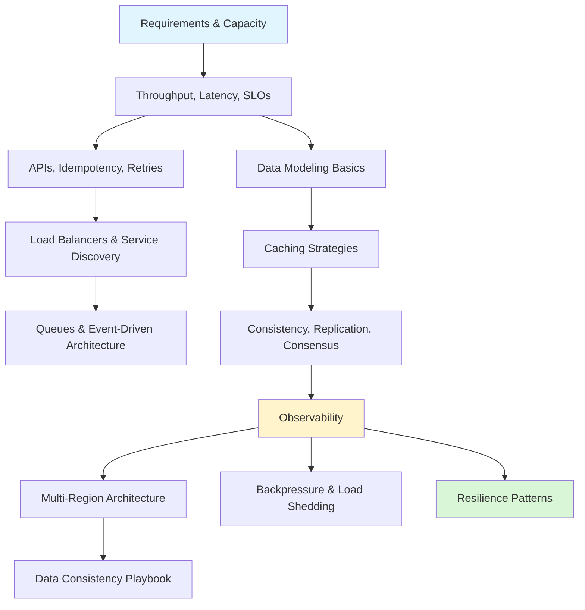

# System Design (Beginner to Advanced)

> [!summary] Scope
> System design foundations, building blocks, advanced patterns, microservice architecture, database internals, search and stream processing, distributed systems theory, real-world case studies, and end-to-end design exercises with capacity estimation, tradeoffs, failure modes, and operational playbooks.

## Learning Path

## Topic Map

### Foundations (4 files)

#### [[SystemDesign/01_Foundations/01_Requirements_and_Capacity_Estimation]]
- Requirements gathering: functional vs non-functional, must-have vs nice-to-have
- Capacity estimation: DAU → QPS → peak factor, storage projection, bandwidth
- Estimation formulas with worked examples for Twitter-scale numbers
- Storage tiering: hot (SSD) vs warm (HDD) vs cold (S3/Blob)

#### [[SystemDesign/01_Foundations/02_Throughput_Latency_and_SLOs]]
- Latency distributions: p50, p95, p99, p99.9 — why average is dangerous
- Tail latency: the "tail at scale" problem with dependency chain math
- Little's Law: L = λ × W with practical applications for connection sizing
- SLI vs SLO vs SLA: definitions, how to choose good SLOs
- Error budgets: calculation, consumption policy, feature vs stability decisions

#### [[SystemDesign/01_Foundations/03_Data_Modeling_Basics]]
- ER modeling: entities, relationships, cardinality
- Normalization flow: 1NF → 5NF with examples and tradeoffs
- Denormalization patterns: pre-join, materialized views, embedded documents, counter columns
- Indexing strategies: B-tree, hash, bitmap, inverted, GiST, LSM-tree — selection decision tree
- Partitioning: hash-based, range-based, directory-based, consistent hashing

#### [[SystemDesign/01_Foundations/04_APIs_Idempotency_and_Retries]]
- Delivery semantics: at-most-once, at-least-once, exactly-once
- Idempotency: key generation (UUID v4), storage (Redis with TTL), concurrent request handling
- Retry strategies: exponential backoff, full jitter, capped retries
- Retry decision tree: which errors to retry vs fail fast
- HTTP status code handling: 5xx/429 retry, 4xx fail fast

### Core (9 files)

#### [[SystemDesign/02_Core/01_Caching_Strategies]]
- Cache layers: browser, CDN, reverse proxy, application, distributed
- Caching strategies: cache-aside, write-through, write-behind — sequence diagrams and comparison
- Cache invalidation: TTL, explicit delete, versioned keys, pub/sub
- Redis for caching: data structures, eviction policies (`allkeys-lru`, `volatile-ttl`, etc.)
- CDN caching: Cache-Control directives, stale-while-revalidate
- Failure modes: cache stampede, hot keys, thundering herd — mitigation patterns

#### [[SystemDesign/02_Core/02_Load_Balancers_and_Service_Delivery]]
- L4 vs L7 load balancing: OSI layer, performance, content awareness
- LB algorithms: round-robin, least connections, IP hash, consistent hash — decision tree
- Health checks: active vs passive, TCP vs HTTP, startup/readiness/liveness
- Service discovery: client-side, server-side, DNS-based, Kubernetes Services
- Comparison: Nginx vs HAProxy vs AWS ALB vs AWS NLB vs K8s Service

#### [[SystemDesign/02_Core/03_Queues_and_Event_Driven_Architecture]]
- When to use a queue: load leveling, decoupling, async workflows, event logging
- Message broker vs stream processor: RabbitMQ vs Kafka comparison
- Delivery semantics and idempotent consumers
- Dead letter queues: retry strategy, monitoring, replay
- Ordering guarantees: per-partition (Kafka), per-queue (RabbitMQ single consumer), FIFO (SQS)
- Kafka vs RabbitMQ vs SQS 10-row comparison table
- Decision tree for queue selection

#### [[SystemDesign/02_Core/04_Consistency_Replication_and_Consensus]]
- Consistency models: strong, causal, eventual, read-your-writes, monotonic reads
- Replication: single leader, multi-leader, leaderless — with sequence diagrams
- Synchronous vs asynchronous replication: tradeoffs
- Quorum: W + R > N formula, strong consistency configuration
- Hinted handoff: flow diagram for write availability during replica failure
- Consensus algorithms: Raft (leader election + log replication), Paxos, Zab — comparison
- Decision tree for replication strategy selection

#### [[SystemDesign/02_Core/05_Observability_Logs_Metrics_Traces]]
- Three pillars: metrics, logs, traces — what each answers
- RED (Rate, Errors, Duration) for services; USE (Utilization, Saturation, Errors) for infrastructure
- Metric types: counter, gauge, histogram, summary — PromQL examples
- Structured logging: JSON schema, best practices, sampling
- Distributed tracing: trace context propagation (W3C Trace Context), sampling strategies
- Alert design: severity levels (P0-P3), symptom vs cause alerting
- Comparison: Prometheus vs Grafana vs Loki vs ELK vs Datadog vs OpenTelemetry

#### [[SystemDesign/02_Core/06_Microservice_Architecture]]
- Monolith vs microservices vs modular monolith comparison table
- Service decomposition: DDD bounded contexts, aggregates, ubiquitous language, domain events
- API Gateway vs Backend for Frontend (BFF) patterns with architecture diagrams
- Inter-service communication: REST vs gRPC vs message queue decision tree
- Service mesh: sidecar proxy, mTLS, traffic splitting — with Istio/Linkerd comparison
- Deployment strategies: rolling, blue/green, canary, feature flags — decision tree
- Strangler Fig pattern for incremental migration

#### [[SystemDesign/02_Core/07_Architecture_Patterns]]
- Layered architecture with dependency flow diagram
- Hexagonal (Ports and Adapters) with onion diagram
- Clean Architecture: dependency rule, framework independence
- Event-Driven Architecture: pub/sub, event types (event notification, event-carried state transfer, command)
- CQRS: command vs query model separation, independent scaling
- Saga pattern: choreography (event-based) vs orchestration (command-based) — full sequence diagrams
- Architecture pattern decision tree

#### [[SystemDesign/02_Core/08_Database_Storage_Internals]]
- B-Tree vs LSM-Tree architecture: page structure vs memtable/SSTable/compaction
- B-Tree vs LSM-Tree comparison table: read/write latency, write amplification, space amplification
- Write-Ahead Log (WAL): durability protocol, crash recovery, checkpointing
- MVCC (Multi-Version Concurrency Control): xmin/xmax, snapshot isolation, dead tuple cleanup
- Storage engine selection decision tree

#### [[SystemDesign/02_Core/09_Search_and_Stream_Processing]]
- Elasticsearch architecture: cluster, shards, inverted index with posting lists
- Relevance scoring (BM25): term frequency, inverse document frequency, length normalization
- Batch vs stream vs micro-batch processing comparison
- Kafka Streams vs Apache Flink vs Spark Streaming comparison table
- Lambda vs Kappa architecture diagrams — when to use each
- Change Data Capture (CDC): Debezium, WAL-based streaming, dual-write problem solution

### Advanced (8 files)

#### [[SystemDesign/03_Advanced/01_Multi_Region_Architecture]]
- Active-passive vs active-active: architecture diagrams and tradeoff analysis
- Cross-region replication: synchronous vs asynchronous, replication lag factors
- Traffic routing: DNS-based (Geo DNS), Anycast, Global LB, client-side — failover time comparison
- Failover workflow: detection → decision → execution → validation → monitoring
- RPO and RTO: how they drive replication strategy
- Case studies: Netflix (active-active, eventual consistency), Google Spanner (strong consistency globally)

#### [[SystemDesign/03_Advanced/02_Backpressure_and_Load_Shedding]]
- Backpressure patterns: block, drop, throttle, bounce — with sequence diagrams
- Rate limiting algorithms: token bucket, leaky bucket, fixed window, sliding window log, sliding window counter — comparison table
- Token bucket implementation sketch
- Load shedding techniques: random early drop, priority queue, graceful degradation, concurrency limit
- Decision tree for overload scenarios

#### [[SystemDesign/03_Advanced/03_Resilience_Patterns]]
- Circuit breaker: state machine (closed → open → half-open), configuration thresholds
- Bulkhead: thread pool vs semaphore isolation, sizing guidelines
- Timeouts: connection, request, deadline propagation, idle timeout
- Resilience comparison: circuit breaker vs bulkhead vs timeout vs retry
- Decision tree for choosing resilience patterns
- Pitfalls: too-sensitive circuit breakers, no deadline propagation, retry without circuit breaker

#### [[SystemDesign/03_Advanced/04_Data_Consistency_Playbook]]
- Consistency decision tree: single leader, partitioned writes, conflict resolution
- Conflict resolution: last-write-wins (LWW), vector clocks, CRDTs — comparison
- CRDT basics: G-Counter, PN-Counter, G-Set, OR-Set, LWW-Register — merge semantics
- Pitfalls: unsynchronized clocks with LWW, vector clock bloat, wrong CRDT for the data type

#### [[SystemDesign/03_Advanced/05_Distributed_Transactions_and_Consensus]]
- 2PC sequence diagram: prepare → commit/abort, coordinator failure handling
- 3PC: non-blocking improvement with pre-commit phase
- 2PC vs Saga vs Outbox comparison table
- Raft deep dive: leader election, log replication, safety properties
- Leader election algorithms: Raft vs Bully vs Zab vs Gossip-based
- Gossip protocol: SWIM failure detection, phi-accrual convergence
- FLP impossibility: proof sketch and how real systems work around it

#### [[SystemDesign/03_Advanced/06_Case_Study_Netflix_Uber_Twitter]]
- Netflix: monolithic → SOA → 1000+ services, Eureka/Hystrix/Zuul, Chaos Engineering (Chaos Monkey, Chaos Kong, Game Days), active-active multi-region
- Uber: dispatch system architecture, H3 geospatial indexing, surge pricing mechanics, microservice decomposition
- Twitter: timeline fan-out (on-write vs on-read), Snowflake ID generation (64-bit, 41-bit timestamp, 10-bit worker, 12-bit sequence)
- Common patterns across all three companies

#### [[SystemDesign/03_Advanced/07_Case_Study_YouTube_Google_DynamoDB]]
- YouTube: video encoding pipeline (144p→4K, DASH/HLS), CDN distribution, recommendation system (candidate generation → ranking → re-ranking)
- Google Spanner: tablet/Paxos architecture, TrueTime API (GPS + atomic clocks), external consistency, commit wait
- Amazon DynamoDB: consistent hashing ring, quorum (N=3, W=2, R=2), hinted handoff, read repair, vector clocks, gossip membership
- DynamoDB vs original Dynamo paper differences

#### [[SystemDesign/03_Advanced/08_Distributed_Systems_Theory]]
- CAP theorem: consistency vs availability during partitions, CP vs AP real-world examples
- PACELC extension: tradeoff during normal operation (latency vs consistency)
- Gossip protocol deep dive: SWIM, phi-accrual failure detection, push-pull convergence
- CRDT types: G-Counter, PN-Counter, G-Set, OR-Set — merge semantics and commutativity
- Vector clocks: causality detection, concurrent write identification, limitations
- Clock synchronization: NTP limitations, Hybrid Logical Clocks (HLC), TrueTime
- Byzantine Fault Tolerance: PBFT, HotStuff, when to use BFT vs CFT

### Playbooks (3 files)

#### [[SystemDesign/04_Playbooks/01_Design_Review_Checklist]]
- Requirements review: user flows, SLOs, must-have vs nice-to-have
- Data model review: ER diagram, indexes, shard key, data lifecycle
- API design review: idempotency, pagination, rate limiting, error format
- Infrastructure review: SPOFs, scaling, caching, service discovery
- Security review: auth, TLS, secrets, input validation
- Operations review: deployment strategy, monitoring, alerts, DR plan

#### [[SystemDesign/04_Playbooks/02_Incident_Playbook_Retry_Storms]]
- Retry storm anatomy: sequence diagram of amplification and collapse
- Detection signals: error rate, retry ratio, queue depth, p99 cliff
- Immediate mitigations: kill retries → add capacity → protect servers → drain backlog
- Root causes: no backoff, no jitter, aggressive health check, cascading retry
- Long-term fixes: circuit breakers, deadline propagation, retry budgets, game days

#### [[SystemDesign/04_Playbooks/03_MultiRegion_Readiness_Checklist]]
- Pre-failover checklist: replication, capacity, DNS TTL, runbook, game day schedule
- Game day scenarios: network failure, DB failover, cache cluster failure, gradual degradation, chaos
- Failover runbook: detect → decide → execute → verify → monitor (no auto-failback)
- Post-failover validation: error rate, latency, replication catch-up, background jobs

### Projects (4 files)

#### [[SystemDesign/05_Projects/01_Design_URL_Shortener_EndToEnd]]
- Requirements and capacity estimation for 100M URLs/month
- Architecture: API gateway → write service → ID generator → DB → cache → CDN
- ID generation: base62 encoding, Snowflake, range batching — comparison
- Write path sequence: POST → validate → encode → store → cache → respond
- Read path sequence: GET → CDN → Redis → DB → redirect with analytics logging
- Sharding: consistent hashing on short code
- Pitfalls: 301 vs 302 redirects, single-point ID generator, hot short URLs

#### [[SystemDesign/05_Projects/02_Design_Notification_System]]
- Requirements for 16M notifications/day across push, email, SMS, in-app
- Architecture: API → template engine → preference filter → Kafka → dispatcher → external providers
- Template engine: per-channel rendering with variables
- Fan-out patterns: on-write vs on-read vs hybrid for follower distribution
- Delivery guarantees: Kafka persistence, retry with backoff, DLQ, fallback channels
- Delivery status tracking: PENDING → SENT → DELIVERED → READ → BOUNCED → FAILED
- Pitfalls: provider rate limiting, missing preference checks, notification flooding

#### [[SystemDesign/05_Projects/03_Design_Uber_Lyft]]
- Requirements and capacity estimation for 50M rides/day
- Location ingestion: gRPC streaming for 500K driver updates/sec
- Geospatial indexing: H3 hexagonal grid + Redis sorted sets
- Ride matching: scoring function (distance, rating, direction, surge)
- Surge pricing: supply/demand ratio per H3 zone, dynamic multiplier
- ETA calculation: route planner + traffic model + real-time corrections
- Pitfalls: ghost rides, driver surge stalking, ETA oscillation

#### [[SystemDesign/05_Projects/04_Design_Distributed_Key_Value_Store]]
- Consistent hashing with virtual nodes for even distribution
- Quorum: N=3, W/R configurable for strong or eventual consistency
- Write path: preference list → parallel writes → hinted handoff
- Read path: read from R replicas → version comparison → read repair
- Anti-entropy: Merkle tree comparison for reconciling replicas
- Membership: gossip protocol + SWIM failure detection
- Pitfalls: tombstone buildup, hot spots, gossip convergence delays

## Recommended Paths

| Path | Files | Target |
|------|-------|--------|
| **Quick Start** | F01, F02, F03, F04 | System design fundamentals |
| **Building Blocks** | C01, C02, C03, C04, C05 | Core distributed systems components |
| **Microservices & Patterns** | C06, C07, A05 | Service decomposition, architecture patterns, distributed transactions |
| **Storage & Processing** | C08, C09, A02 | Database internals, search, stream processing |
| **Advanced Theory** | A01, A03, A04, A08 | Multi-region, resilience, consistency, CAP, CRDT |
| **Case Studies** | A06, A07 | Real-world architectures (Netflix, Uber, Twitter, YouTube, Spanner, DynamoDB) |
| **Interview Prep** | F01, C01, C03, C04, Pr01, Pr02, Pr03, Pr04 | Most common interview topics + design exercises |

## Cross-Links

- [[Networking/00_MOC/00_Networking_MOC]] for networking fundamentals (DNS, TCP, CDN)
- [[CICD/Kafka/00_MOC/00_Kafka_MOC]] for Kafka deep dive
- [[CICD/Kubernetes/00_MOC/00_Kubernetes_MOC]] for container orchestration and service discovery
- [[SQL/02_Core/01_Indexes_Basics_and_BTree]] for database indexing deep dive
- [[SQL/02_Core/03_Isolation_Levels_and_Anomalies]] for transaction isolation
- [[SpringBoot/03_Advanced/01_Spring_for_Apache_Kafka_Integration]] for outbox and event-driven patterns

## References

- [Amazon Builders Library](https://aws.amazon.com/builders-library/)
- [Google Cloud Architecture Framework](https://cloud.google.com/architecture/framework)
- [High Scalability Blog](http://highscalability.com/)
- [System Design Interview — Alex Xu](https://github.com/Chanda-Abdul/Several-Coding-Patterns-for-Solving-Data-Structures-and-Algorithms-Questions-during-Interviews)
- [ByteByteGo (YouTube)](https://www.youtube.com/@ByteByteGo)
