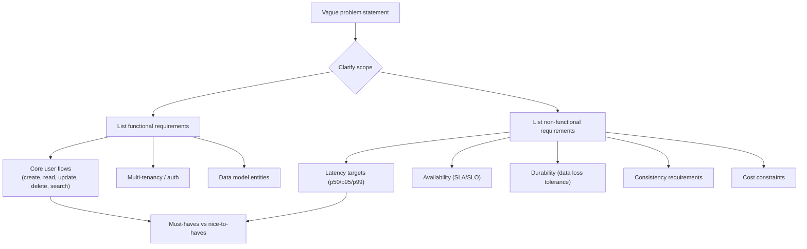
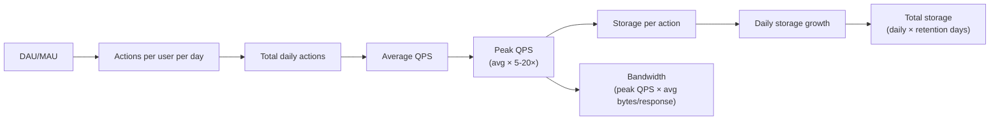
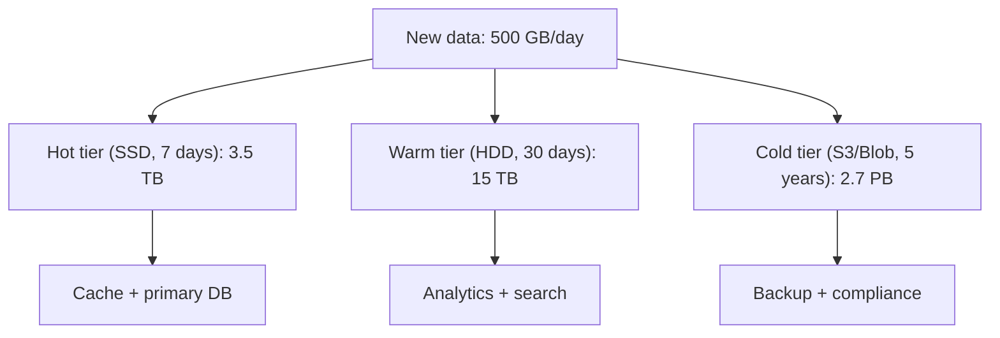
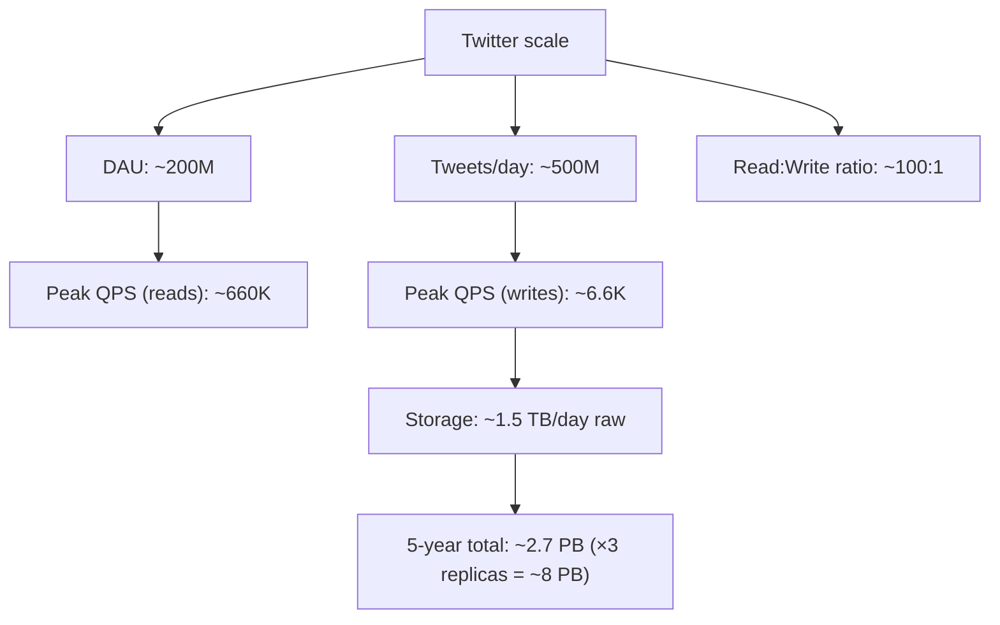

# Requirements and Capacity Estimation

> [!summary] Goal
> Turn a vague problem into measurable targets (QPS, p99 latency, storage growth) so design tradeoffs are grounded in real numbers.

## Table of Contents

1. [Requirements Gathering](#requirements-gathering)
2. [Capacity Estimation Flow](#capacity-estimation-flow)
3. [Traffic Estimation](#traffic-estimation)
4. [Storage Estimation](#storage-estimation)
5. [Bandwidth Estimation](#bandwidth-estimation)
6. [Case Study: Design Twitter's Numbers](#case-study-design-twitters-numbers)
7. [Pitfalls](#pitfalls)

---

## Requirements Gathering



| Requirement type | Examples | How to validate |
|-----------------|----------|----------------|
| **Functional** | Create tweet, follow user, search posts, view timeline | "Does the user need this in v1?" |
| **Non-functional** | p99 < 200ms, 99.99% avail, at-most-1hr data loss | "What happens if we miss this?" |
| **Must-have** | Core CRUD, auth, basic search | "Without this, the product doesn't work" |
| **Nice-to-have** | Push notifications, analytics dashboards | "Can we defer this to v2?" |

> [!tip] Output of this phase: 3-5 explicit SLOs, 3-5 key load numbers, prioritized feature list.

---

## Capacity Estimation Flow



### Key formulas

| Metric | Formula | Example |
|--------|---------|---------|
| **Daily actions** | DAU × actions/user/day | 100M × 5 = 500M/day |
| **Average QPS** | Daily actions / 86,400 | 500M / 86,400 ≈ 5,787 QPS |
| **Peak QPS** | Average QPS × peak factor | 5,787 × 10 = 57,870 QPS |
| **Daily storage** | Daily actions × bytes/action | 500M × 1KB = 500 GB/day |
| **Total storage** | Daily storage × retention days | 500 GB × 365 = 183 TB/year |
| **Peak bandwidth** | Peak QPS × avg response bytes | 57,870 × 10KB = 578 MB/s |

---

## Traffic Estimation

### DAU to QPS

```text
Given:
  DAU = 100 million
  Actions/user/day = 5 (tweets, likes, follows)
  Peak factor = 10× (lunch hour spike)

Total actions/day = 100M × 5 = 500M
Average QPS = 500M / 86,400 ≈ 5,787
Peak QPS = 5,787 × 10 ≈ 57,870
```

### Read/Write ratio

Most systems are read-heavy. Common ratios:

| System type | Read:Write ratio | Example |
|-------------|:----------------:|---------|
| Social feed | 100:1 | Twitter timeline reads vs tweets |
| E-commerce | 50:1 | Product page views vs purchases |
| Messaging | 1:1 | Send vs receive messages |
| Video streaming | 500+:1 | Video watches vs uploads |
| Monitoring | 1:100 | Alerts generated vs viewed |

### Peak factor reference

| Scenario | Peak factor | Example |
|----------|:-----------:|---------|
| Global consumer app | 5-10× | Twitter/Instagram |
| Regional app (one timezone) | 10-20× | Indian railway booking |
| Event-driven spike | 50-100× | Ticket sale launch |
| Enterprise | 2-3× | Internal tools |

---

## Storage Estimation

```text
Storage types to consider:
  1. Primary data (user posts, messages)
  2. Metadata (indexes, relationships)
  3. Media (images, videos) — offloaded to object store
  4. Logs (access logs, audit logs)
  5. Backups / replicas (multiply by replication factor)

Per-event bytes estimate:
  Tweet (text only):          ~250 bytes
  Tweet with photo:           ~200 KB
  Tweet with video:           ~10-100 MB
  Chat message (text):        ~100 bytes
  User profile:               ~1 KB
  API request log entry:      ~500 bytes
```

### Storage calculation example

```text
Given:
  500M tweets/day
  Average tweet size: 1 KB (text + metadata)
  Replication factor: 3
  Retention: 5 years

Daily raw storage = 500M × 1 KB = 500 GB
Daily with replication = 500 GB × 3 = 1.5 TB
Yearly with replication = 1.5 TB × 365 = 548 TB
5-year total ≈ 2.7 PB
```

### Storage by tier



---

## Bandwidth Estimation

```text
Peak bandwidth (outgoing):
  Peak QPS × average response size

Example:
  57,870 QPS × 10 KB avg response ≈ 578 MB/s ≈ 4.6 Gbps

For a video platform:
  10M concurrent viewers
  5 Mbps per stream
  Total bandwidth: 10M × 5 Mbps = 50 Tbps (requires CDN)
```

---

## Case Study: Design Twitter's Numbers



### Breakdown

| Metric | Calculation | Value |
|--------|------------|-------|
| DAU | Public number | 200M |
| Tweets/user/day | Estimate | 2.5 |
| Total tweets/day | 200M × 2.5 | 500M |
| Average write QPS | 500M / 86,400 | 5,787 |
| Peak write QPS | 5,787 × 5 | ~28,900 |
| Timeline reads/user/day | Estimate | 200 |
| Total reads/day | 200M × 200 | 40B |
| Average read QPS | 40B / 86,400 | 463,000 |
| Peak read QPS | 463K × 1.5 | ~695,000 |
| Read:write ratio | 463K / 5,787 | 80:1 |
| Storage/day (text) | 500M × 250 bytes | 125 GB |
| Storage/day (with media) | Realistic avg 5 KB | 2.5 TB |
| Peak bandwidth (reads) | 695K × 5 KB | 3.5 GB/s |

### Key takeaways for design

1. **Reads dominate** — optimize the fan-out / timeline generation path
2. **Writes still significant** — 28K peak writes/s needs sharding
3. **Storage is manageable** — 8 PB over 5 years is feasible with modern DBs + S3
4. **Bandwidth is the real challenge** — 3.5 GB/s peak requires CDN + edge caching

---

## Pitfalls

### Confusing DAU with total users

System design is about peak concurrent load, not registered user count. A system with 100M registered users may have only 10M DAU and 500K concurrent users at peak.

### Underestimating peak factor

Using average QPS for capacity planning causes outages during traffic spikes. Always multiply by a realistic peak factor.

### Forgetting replication overhead

Storage estimation must include replication factor (typically 3×) and backup retention. Raw data size is misleading.

### Mixing up bits and bytes

Network bandwidth is measured in **bits per second** (Gbps). Storage in **bytes** (GB, TB). A 10 Gbps link carries ~1.25 GB/s.

### Ignoring indexing overhead

Primary data storage is just the start. Indexes typically add 50-200% overhead depending on the number and type of indexes.

---

> [!question]- Interview Questions
>
> **Q: How do you estimate QPS from DAU?**
> A: Multiply DAU by actions per user per day, divide by 86,400 seconds, then multiply by a peak factor (typically 5-20× depending on the use case).
>
> **Q: What is a realistic read:write ratio for a social media feed?**
> A: Typically 100:1. Users read their timeline far more often than they post. Twitter's ratio is ~80:1, Instagram's is higher due to heavy browsing.
>
> **Q: How do you estimate storage for a system like Twitter?**
> A: Estimate per-tweet size (text + metadata ≈ 250 bytes, media makes it larger), multiply by tweets/day, multiply by retention period, multiply by replication factor.
>
> **Q: Why is bandwidth often harder to scale than storage?**
> A: Bandwidth costs scale linearly with peak traffic and require physical network capacity. Storage can be tiered (hot/warm/cold) and compressed. A single 10 Gbps link can be saturated by 50K QPS with 25 KB responses.
>
> **Q: What is the difference between average QPS and peak QPS?**
> A: Average QPS = total daily requests / 86,400. Peak QPS = average × peak factor (5-20×). Systems must be provisioned for peak, not average. A system handling 5K QPS average may see 50K QPS during a lunch-hour spike.

---

## Cross-Links

- [[SystemDesign/01_Foundations/02_Throughput_Latency_and_SLOs]] for SLO targets and latency budgeting
- [[SystemDesign/01_Foundations/03_Data_Modeling_Basics]] for data schema design and indexing
- [[SystemDesign/02_Core/01_Caching_Strategies]] for reducing read latency and DB load
- [[SystemDesign/05_Projects/01_Design_URL_Shortener_EndToEnd]] for a worked capacity estimation exercise
