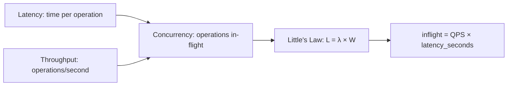
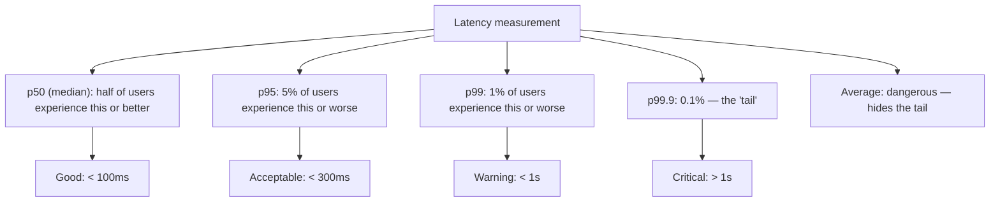
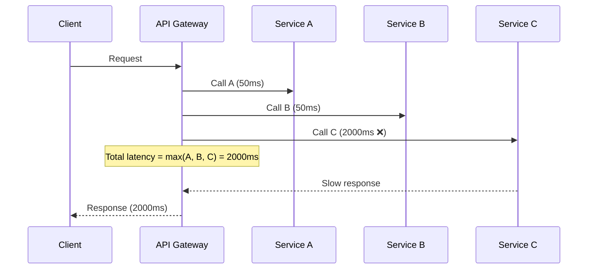
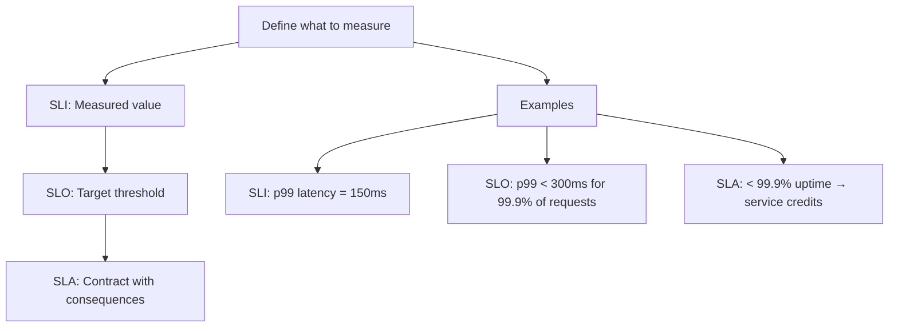
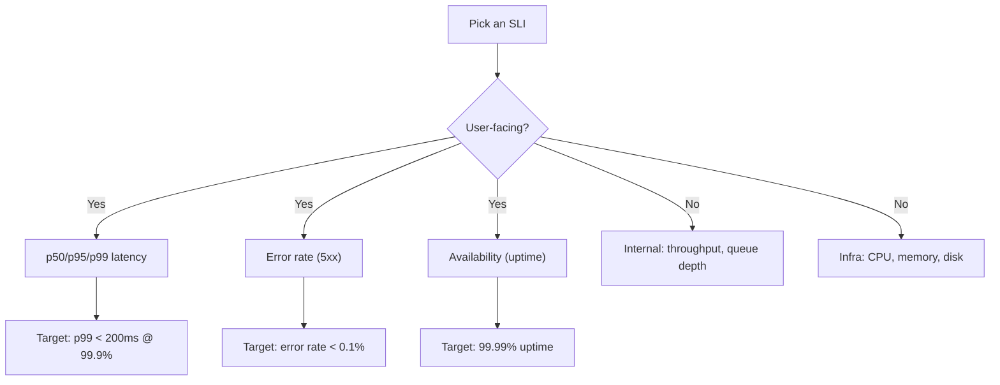
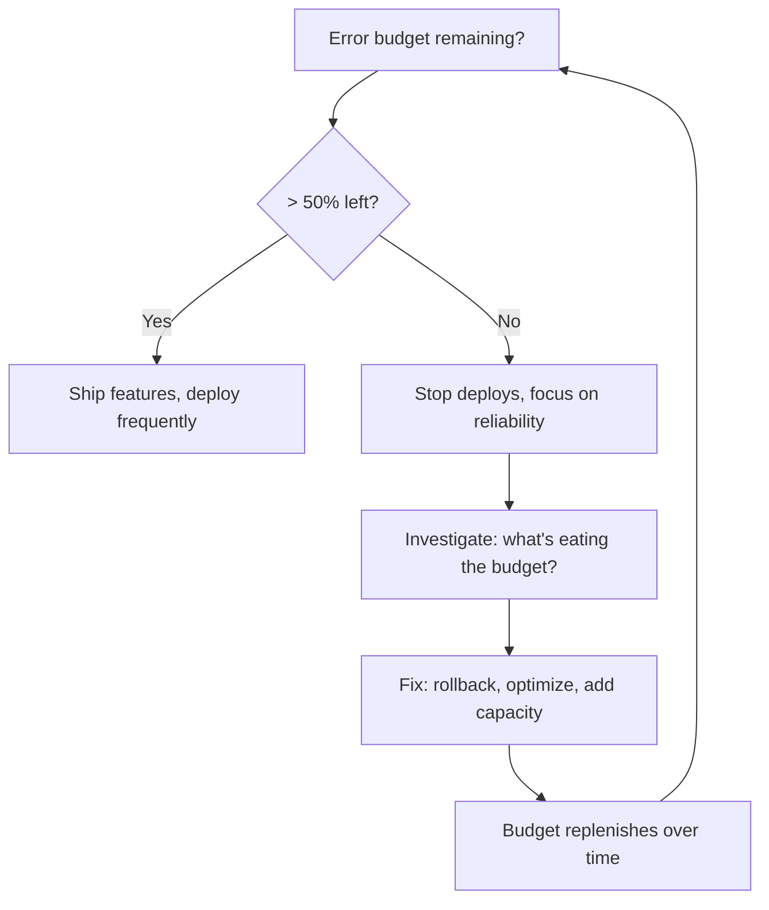

# Throughput, Latency, and SLOs

> [!summary] Goal
> Design for p99 latency and error budgets, not average-case. Understand the relationship between throughput, concurrency, and latency, and set measurable targets with SLOs.

## Table of Contents

1. [Core Definitions](#core-definitions)
2. [Latency Distributions](#latency-distributions)
3. [Tail Latency](#tail-latency)
4. [Little's Law](#littles-law)
5. [SLI, SLO, SLA](#sli-slo-sla)
6. [Error Budgets](#error-budgets)
7. [Pitfalls](#pitfalls)

---

## Core Definitions



| Term | Definition | Unit | Example |
|------|-----------|------|---------|
| **Latency** | Time for one operation to complete | ms, s | p95 read latency = 150ms |
| **Throughput** | Operations completed per unit time | QPS, TPS, RPS | 50,000 requests/second |
| **Concurrency** | Number of operations in-flight simultaneously | count | 500 active connections |
| **Bandwidth** | Data transferred per unit time | Mbps, Gbps | 10 Gbps network link |
| **Capacity** | Maximum throughput before saturation | QPS | 100K QPS at p99 < 200ms |

---

## Latency Distributions

Average latency is misleading. Two systems with the same average can have wildly different user experiences:



| Percentile | Meaning | User impact |
|------------|---------|-------------|
| **p50 (median)** | Half of requests are faster than this | Typical experience |
| **p95** | 5% of requests are slower than this | Representative of bad days |
| **p99** | 1% of requests are slower than this | The long tail matters |
| **p99.9** | 0.1% of requests are slower than this | Edge cases, often errors |
| **p100 (max)** | Worst observed latency | Often an outlier, not meaningful |

### Why average is dangerous

```text
System A: [50ms, 50ms, 50ms, 50ms, 50ms]  → average = 50ms, p99 = 50ms
System B: [5ms, 5ms, 5ms, 5ms, 230ms]     → average = 50ms, p99 = 230ms

Both have 50ms average, but System B is terrible for 1 in 5 users.
Always measure percentiles, not averages.
```

---

## Tail Latency

In distributed systems, a single slow component delays the entire request — this is the **tail at scale** problem.



### Why tail latency matters

| Number of dependencies | p99 per service | End-to-end p99 |
|:---------------------:|:---------------:|:--------------:|
| 1 | 50ms | 50ms |
| 5 | 50ms | ~226ms (1 - 0.99^5) |
| 20 | 50ms | ~640ms (1 - 0.99^20) |
| 100 | 50ms | ~993ms (1 - 0.99^100) |

### Mitigations

- **Hedged requests**: send the same request to multiple replicas, use the first result
- **Request deadlines**: propagate timeout budget via context headers
- **Circuit breaker**: stop sending to slow instances
- **Caching**: reduce dependency on slow backends

---

## Little's Law

$$L = \lambda \times W$$

| Variable | Meaning | Unit |
|----------|---------|------|
| L | Concurrency (requests in-flight) | count |
| λ | Throughput (arrival rate) | requests/second |
| W | Latency (time per request) | seconds |

### Practical applications

```text
Given:
  Latency = 200ms (0.2s)
  Throughput target = 50,000 QPS

Required concurrency: L = 50,000 × 0.2 = 10,000 connections

If your server has 5,000 connection limit, you need:
  - More servers (scale out), OR
  - Lower latency (cache/optimize), OR
  - Connection pooling
```

| Scenario | Latency | Throughput | Concurrency | Implication |
|----------|:-------:|:----------:|:-----------:|-------------|
| Fast, low traffic | 10ms | 1,000 | 10 | Single server fine |
| Slow, high traffic | 500ms | 100,000 | 50,000 | Need connection pooling + horizontal scaling |
| Database query | 100ms | 10,000 | 1,000 | Connection pool of 50-100 per app instance |

---

## SLI, SLO, SLA



| Term | Definition | Example |
|------|-----------|---------|
| **SLI** (Service Level Indicator) | The actual metric you measure | p99 request latency, error rate, throughput |
| **SLO** (Service Level Objective) | Target value for the SLI over a time window | p99 < 200ms for 99.9% of requests in a rolling 30-day window |
| **SLA** (Service Level Agreement) | Contractual commitment with consequences | 99.99% availability guarantee; failure = service credits |

### Choosing good SLOs



| SLI | How to measure | Realistic SLO |
|-----|---------------|---------------|
| **Latency (p99)** | Server-side request duration, 1-min buckets | p99 < 300ms for 99.9% of requests |
| **Error rate** | 5xx responses / total requests | < 0.1% over 10-min window |
| **Availability** | Successful requests / total requests | 99.99% over rolling 30 days |
| **Throughput** | Requests/second | Meet demand without degraded latency |
| **Freshness** | Age of data in cache/replica | Stale data < 1% of reads |

---

## Error Budgets

Error budget = 100% − SLO. It's how much "unreliability" you're allowed.

```text
Given: SLO = 99.9% (over 30 days)
Error budget = 100% - 99.9% = 0.1%

30 days = 2,592,000 seconds
Allowed downtime = 2,592,000 × 0.001 = 2,592 seconds ≈ 43 minutes per month

For a system doing 100M requests/month:
  Allowed errors = 100M × 0.001 = 100,000 errors per month
```

### Error budget policy



| Budget consumed | Action |
|:--------------:|--------|
| 0-50% | Normal operations, deploy freely |
| 50-75% | Add monitoring, review changes |
| 75-90% | Freeze non-critical deploys |
| 90-100% | Emergency: rollback, hotfix, add capacity |

> [!tip] Error budgets align product velocity with reliability. The team decides: spend the budget on new features or on stability. When the budget is gone, reliability takes priority.

---

## Pitfalls

### Optimizing for average instead of p99

Average latency hides the tail. A system with 50ms average could have 2-second p99, affecting 1 in 100 users. Always measure and publish percentiles.

### Ignoring coordinated omission

When the system is overloaded, slow requests are excluded from latency measurements (the client has given up). This makes the system appear faster than it actually is during load tests.

### Setting too many SLOs

If everything is critical, nothing is. Pick 3-5 user-facing SLOs. Internal metrics are useful for debugging but don't need contractual targets.

### Tight SLOs without engineering investment

Setting a 99.999% availability SLO (5 nines) without the corresponding investment in redundancy, multi-region, and incident response is setting up for failure. Each additional 9 is ~10× harder.

### SLO vs SLA confusion

SLO is your internal target. SLA is the contract with customers. Never set SLA tighter than SLO — you need margin for error.

---

> [!question]- Interview Questions
>
> **Q: What is tail latency and why does it matter in distributed systems?**
> A: Tail latency is the slowest few percent of requests (p99, p99.9). In a system that calls 100 services sequentially, even if each service has 99% p99 success rate, the overall request fails 63% of the time (1 - 0.99^100). Mitigations include hedged requests, request deadlines, and circuit breakers.
>
> **Q: What is Little's Law and how do you apply it in system design?**
> A: L = λ × W (inflight = QPS × latency). It tells you how many concurrent connections you need to sustain a given throughput at a given latency. If your target is 100K QPS at 200ms latency, you need 20,000 concurrent connections capacity.
>
> **Q: What is the difference between SLI, SLO, and SLA?**
> A: SLI is the measured metric (e.g., p99 latency). SLO is the internal target (e.g., p99 < 200ms for 99.9% of requests). SLA is the contractual commitment (e.g., 99.99% availability with penalty clauses). SLO should always be stricter than SLA.
>
> **Q: How does an error budget work?**
> A: Error budget = 100% − SLO. It's the allowed amount of unreliability. When the budget is high, teams can deploy features freely. When it's depleted, focus shifts to reliability. This aligns product velocity with operational health.
>
> **Q: Why is average latency a dangerous metric?**
> A: Averages hide the tail. Two systems can have the same 50ms average: one with consistent 50ms for everyone, another with 5ms for 80% of users and 230ms for 20%. The second system feels terrible to 1 in 5 users. Always track percentiles (p50, p95, p99).

---

## Cross-Links

- [[SystemDesign/01_Foundations/01_Requirements_and_Capacity_Estimation]] for deriving load numbers
- [[SystemDesign/02_Core/05_Observability_Logs_Metrics_Traces]] for measuring SLIs in production
- [[SystemDesign/03_Advanced/03_Resilience_Patterns]] for circuit breakers and timeout propagation
- [[SystemDesign/01_Foundations/04_APIs_Idempotency_and_Retries]] for retry budget management
