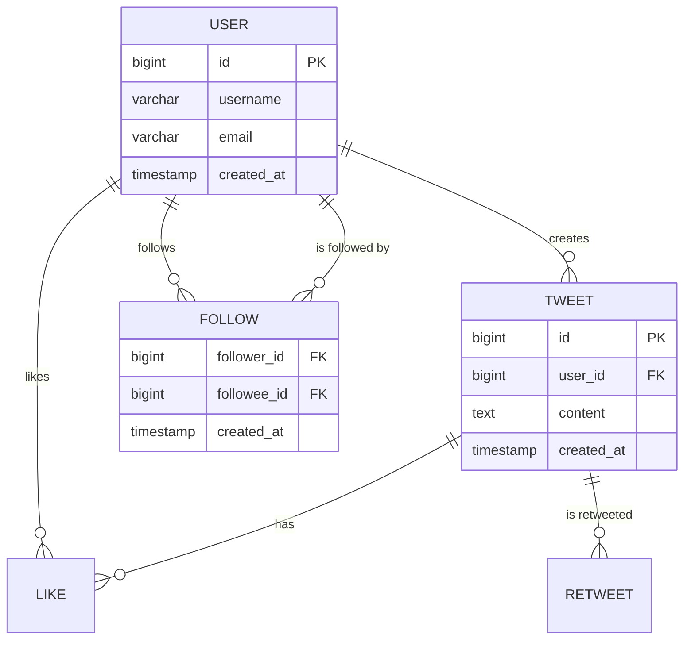
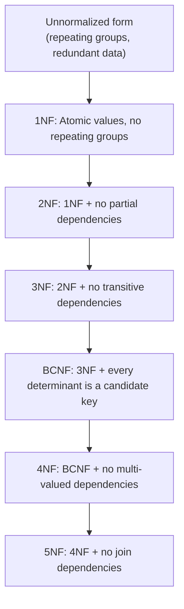
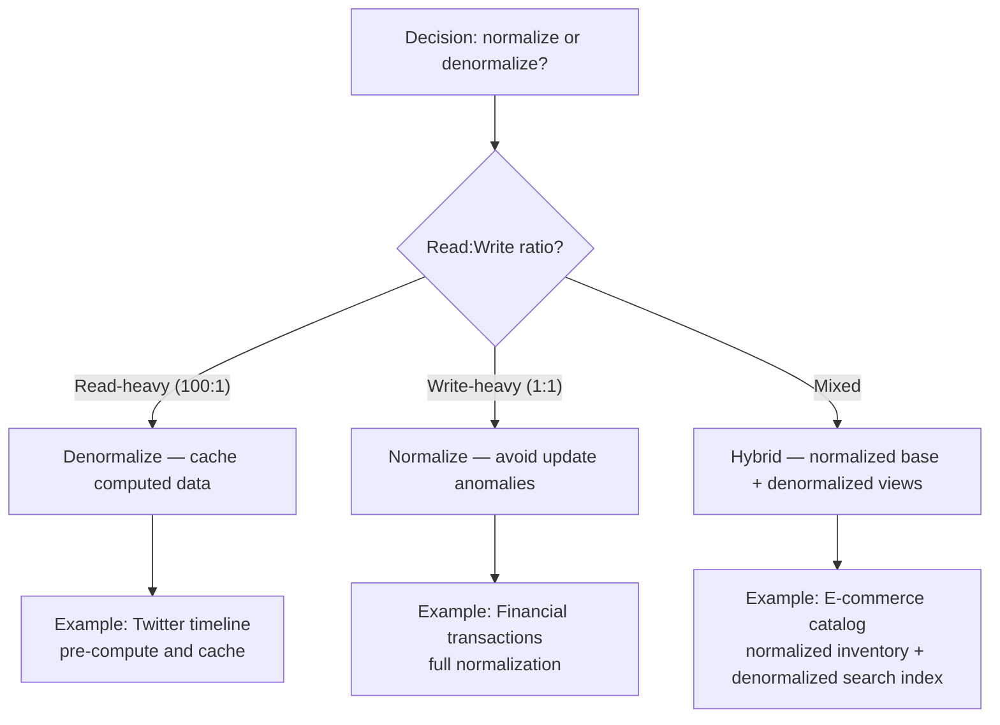
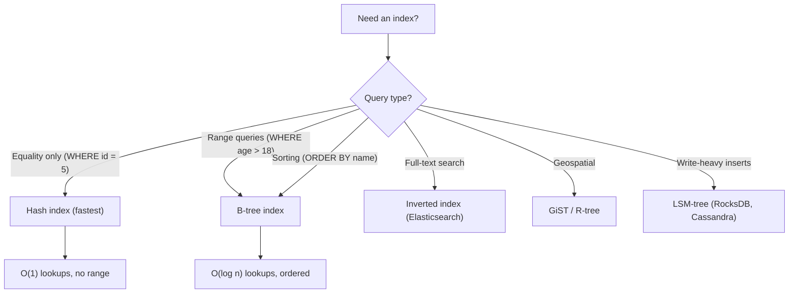
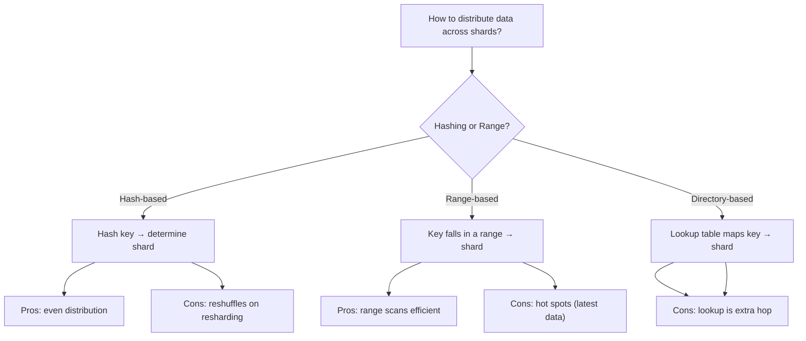
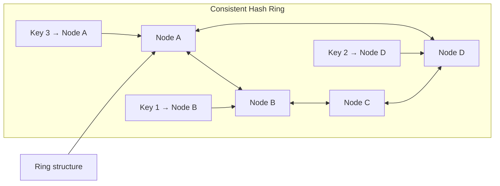

# Data Modeling Basics

> [!summary] Goal
> Design scalable data models: choose between normalization and denormalization, pick the right index types, and partition data for distributed systems.

## Table of Contents

1. [Entity-Relationship Modeling](#entity-relationship-modeling)
2. [Normalization](#normalization)
3. [Denormalization Tradeoffs](#denormalization-tradeoffs)
4. [Indexing Strategies](#indexing-strategies)
5. [Partitioning (Sharding)](#partitioning)
6. [Pitfalls](#pitfalls)

---

## Entity-Relationship Modeling



| Entity | Attributes | Relationships |
|--------|------------|---------------|
| **User** | id, username, email, created_at | Creates tweets, follows users |
| **Tweet** | id, user_id, content, created_at | Belongs to user, has likes |
| **Follow** | follower_id, followee_id, created_at | Many-to-many between users |
| **Like** | user_id, tweet_id, created_at | Many-to-many: users ↔ tweets |

---

## Normalization

### Normal forms flow



| Normal form | Rule | Example violation |
|-------------|------|-------------------|
| **1NF** | Each column has atomic values, no repeating groups | `phone_numbers: "555-0100,555-0200"` (comma-separated) |
| **2NF** | 1NF + every non-key column depends on the full primary key | `Order(OrderId, ProductId, ProductName)` — ProductName depends only on ProductId, not the full composite key |
| **3NF** | 2NF + no transitive dependency | `Employee(DeptId, DeptName)` — DeptName depends on DeptId, not on Employee |
| **BCNF** | Every determinant is a candidate key | A professor can teach only one course, but a course can have multiple professors. Violates BCNF. |
| **4NF** | No multi-valued dependencies | A person has multiple degrees and multiple addresses (independent facts) |
| **5NF** | No join dependencies | Rare in practice |

### When to normalize

| Factor | Favor normalization | Favor denormalization |
|--------|-------------------|----------------------|
| **Data integrity** | ✅ Critical (financial, compliance) | ❌ Not critical |
| **Write volume** | ✅ Write-heavy | ❌ Read-heavy |
| **Query patterns** | ✅ Known, simple joins | ❌ Complex, unpredictable |
| **Scaling** | ❌ Joins become expensive | ✅ Fewer joins, faster reads |
| **Storage cost** | ✅ Reduces duplication | ❌ More storage |

---

## Denormalization Tradeoffs

Denormalization intentionally introduces redundancy to **optimize read performance** at the cost of write complexity.



### Denormalization patterns

| Pattern | How it works | Tradeoff |
|---------|-------------|----------|
| **Pre-join** | Store denormalized rows with joined data | Faster reads, redundant writes |
| **Materialized view** | Pre-computed query result refreshed periodically | Near-real-time, acceptable staleness |
| **Embedded document** | Store related data in the same document (NoSQL) | No joins, but document size limits |
| **Counter column** | Maintain count in parent row (e.g., tweet like count) | Eventual consistency, but fast reads |
| **Fan-out on write** | Pre-compute timelines on tweet creation | Fast reads, expensive writes |

---

## Indexing Strategies

### Index types

| Index type | Structure | Best for | Tradeoff |
|-----------|-----------|----------|----------|
| **B-tree** | Balanced tree, sorted keys | Range queries, sorting, equality | Works for most cases, default choice |
| **Hash** | Hash table | Exact equality lookups | No range queries, no sorting |
| **Bitmap** | Bit arrays per value | Low-cardinality columns (gender, status) | High cardinality = large bitmaps |
| **Inverted** | Term → document mapping | Full-text search | Storage overhead, complex updates |
| **GiST/GIN** | Generalized search tree | Geospatial, full-text, arrays | Slower builds, faster searches |
| **LSM-tree** | Log-structured merge | Write-heavy workloads | Slower reads, write-optimized |

### Index selection decision tree



### Indexing guidelines

```text
1. Index columns used in WHERE, JOIN, ORDER BY, GROUP BY
2. Composite indexes: order by selectivity (most selective first)
3. Covering indexes: include all selected columns to avoid table lookups
4. Avoid over-indexing: each index slows writes by 2-10%
5. Monitor index usage: drop unused indexes
6. For large tables: partial indexes for hot subsets
```

---

## Partitioning (Sharding)

### Partitioning strategies



| Strategy | Data distribution | Resharding complexity | Range queries | Hot spot risk |
|----------|:-----------------:|:---------------------:|:-------------:|:-------------:|
| **Hash (key → shard)** | Even | Hard (rehash all keys) | Not efficient | Low |
| **Range (key → range)** | Uneven | Medium (split ranges) | Efficient | High (latest data) |
| **Directory** | Customizable | Easy (move keys) | Requires lookup | Low (can rebalance) |
| **Consistent hashing** | Even | Minimal (ring rebalance) | Not efficient | Low |

### Consistent hashing



> [!tip] Consistent hashing minimizes key movement when nodes are added or removed. Only the keys on neighboring nodes need rebalancing — K/n keys move instead of all keys.

---

## Pitfalls

### Over-normalization in read-heavy systems

Normalizing until 5NF creates beautiful schemas that require 10-way joins for every page load. In read-heavy systems (social feeds, dashboards), denormalize aggressively and accept data redundancy.

### Wrong index type for the query

A hash index is useless for range queries (`WHERE age BETWEEN 20 AND 30`). A B-tree index is useless for full-text search. Match the index type to the query pattern.

### Ignoring index maintenance

Each index adds write amplification. Write-heavy tables should have few indexes. Read-heavy tables can have more. Monitor `pg_stat_user_indexes` or equivalent to find unused indexes.

### Single-shard hot spots

Range-based partitioning on a monotonically increasing key (like a timestamp) creates a hot shard for recent data. Solution: hash the key or use a compound shard key.

### Resharding without downtime

Adding or removing shards in a naive hash-based scheme requires rehashing all keys. Use consistent hashing (Cassandra) or directory-based partitioning (Elasticsearch) to minimize disruption.

---

> [!question]- Interview Questions
>
> **Q: Should you normalize or denormalize for a Twitter timeline?**
> A: Denormalize. Twitter pre-computes timelines (fan-out on write) by inserting the tweet into each follower's timeline cache. This is a massive denormalization — the same tweet appears in millions of timeline rows. The tradeoff is write amplification (millions of inserts per tweet from a popular user) for fast reads.
>
> **Q: What index type would you use for a column queried by equality only?**
> A: Hash index. It provides O(1) lookup time for exact matches. However, B-tree is the safer default since it supports both equality and range queries with O(log n).
>
> **Q: How do you choose between hash-based and range-based sharding?**
> A: Hash sharding gives even distribution but loses range query efficiency. Range sharding allows efficient range scans but can create hot spots. Use hash for general-purpose, range for time-series where you query recent data, and directory-based when you need to move data between shards.
>
> **Q: What is consistent hashing and why is it useful?**
> A: Consistent hashing places both nodes and keys on a hash ring. Each key is assigned to the next clockwise node. When a node is added or removed, only the keys on neighboring nodes need to move — K/n keys, not all keys. This is critical for distributed caches and databases that need elastic scaling.
>
> **Q: What is the tradeoff between read and write optimization in indexing?**
> A: Each index speeds up reads (WHERE, JOIN, ORDER BY) but slows down writes (INSERT, UPDATE, DELETE) because the index must be updated. The write penalty is typically 2-10% per index. Read-heavy systems can have many indexes; write-heavy systems should minimize them.

---

## Cross-Links

- [[SystemDesign/01_Foundations/01_Requirements_and_Capacity_Estimation]] for storage sizing
- [[SystemDesign/02_Core/01_Caching_Strategies]] for denormalization with caching
- [[SystemDesign/02_Core/04_Consistency_Replication_and_Consensus]] for data replication across shards
- [[SQL/02_Core/01_Indexes_Basics_and_BTree]] for B-tree deep dive
- [[SQL/03_Advanced/04_Advanced_Index_Types_GIN_GiST_BRIN]] for advanced PostgreSQL index types
