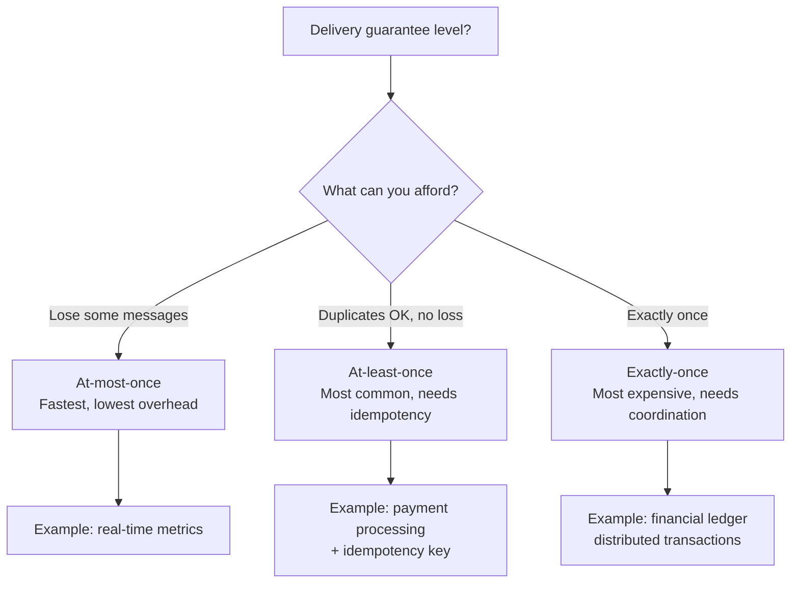
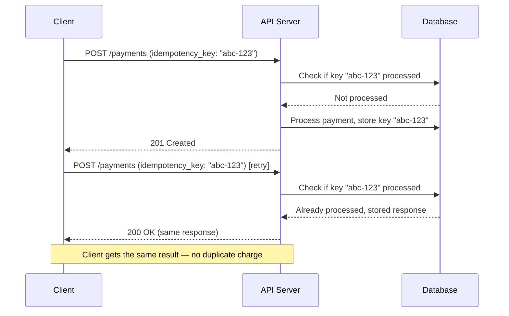
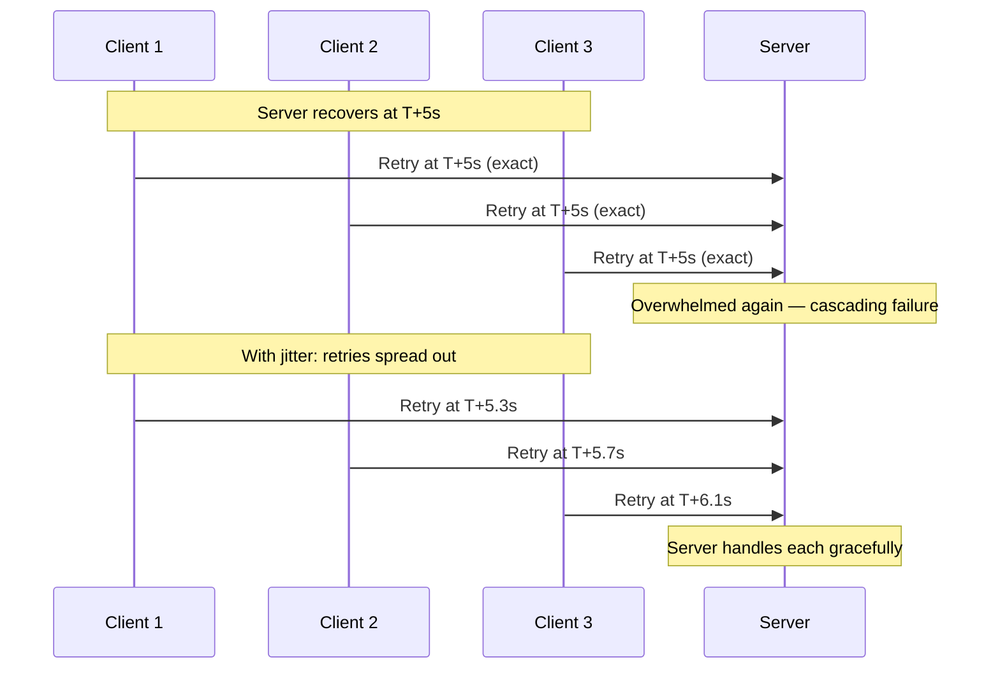
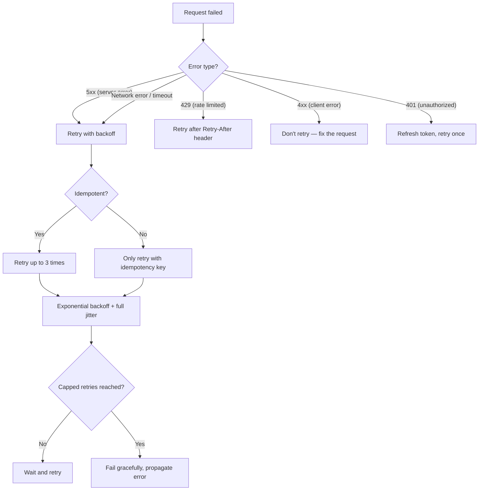

# APIs, Idempotency, and Retries

> [!summary] Goal
> Design robust APIs that handle retries safely. Implement idempotency keys, exponential backoff with jitter, and decide between exactly-once and at-least-once semantics.

## Table of Contents

1. [Delivery Semantics](#delivery-semantics)
2. [Idempotency](#idempotency)
3. [Retry Strategies](#retry-strategies)
4. [Retry Decision Tree](#retry-decision-tree)
5. [Pitfalls](#pitfalls)

---

## Delivery Semantics



| Semantic | Duplicates | Data loss | Complexity | Use case |
|----------|:----------:|:---------:|:----------:|----------|
| **At-most-once** | No | Yes | Low | Analytics, metrics, real-time UI updates |
| **At-least-once** | Yes | No | Medium | Payments, orders, notifications |
| **Exactly-once** | No | No | High | Financial ledgers, inventory, banking |

---

## Idempotency

An operation is **idempotent** if performing it multiple times has the same effect as performing it once.



### What's naturally idempotent vs needs help

| HTTP method | Idempotent? | Notes |
|:-----------:|:-----------:|-------|
| **GET** | ✅ Yes | Reading data is always idempotent |
| **PUT** | ✅ Yes | Replace resource at a known URL |
| **DELETE** | ✅ Yes | Deleting a non-existent resource returns the same result |
| **POST** | ❌ No | Creates a new resource — needs idempotency key |
| **PATCH** | ❌ No | Partial update may not be idempotent; use `If-Match` |

### Idempotency key implementation

```text
When the client sends a POST request:
  1. Client generates a unique idempotency key (UUID v4)
  2. Sends it in the Idempotency-Key header
  3. Server checks if the key was already processed:
     - New key: process normally, store the result
     - Existing key: return the stored result (same response)
     - Key in-flight: return 409 Conflict (don't retry yet)
  4. Key expires after a reasonable TTL (24 hours)
```

| Aspect | Implementation notes |
|--------|---------------------|
| **Key generation** | UUID v4 on the client side (`crypto.randomUUID()`) |
| **Key storage** | Redis with TTL: `SET idem:abc-123 response 86400` |
| **Key format** | `v4_uuid` — 128 bits, enough to avoid collisions |
| **Cache duration** | 24 hours (enough for retry windows, not so long that storage grows unbounded) |
| **Concurrent requests** | Use Redis `SET NX` (set if not exists) to detect duplicates in-flight |
| **Response** | Store the exact HTTP response (status + body) tied to the key |

---

## Retry Strategies

### Exponential backoff

```text
delay = initial_delay × (backoff_factor ^ attempt)

Attempt 1: 100ms
Attempt 2: 100ms × 2^1 = 200ms
Attempt 3: 100ms × 2^2 = 400ms
Attempt 4: 100ms × 2^3 = 800ms
Attempt 5: 100ms × 2^4 = 1600ms (1.6s)
...
Attempt 10: 100ms × 2^9 = 51.2s
```

### Adding jitter

Without jitter, all retries happen simultaneously — creating a **thundering herd**:



### Jitter algorithms

| Algorithm | Formula | Characteristics |
|-----------|---------|----------------|
| **Full jitter** | `random(0, min(cap, base × 2^attempt))` | Spreads uniformly; recommended for most cases |
| **Equal jitter** | `base × 2^attempt / 2 + random(0, base × 2^attempt / 2)` | Maintains some structure with randomness |
| **Decorrelated jitter** | `min(cap, random(base, prev_delay × 3))` | Natural fast recovery, used by AWS |

```text
Full jitter (recommended):
  sleep = random_between(0, min(cap, base * 2^attempt))

Example with cap = 30s, base = 100ms:
  Attempt 1: sleep = random(0, 200ms)
  Attempt 2: sleep = random(0, 400ms)
  Attempt 3: sleep = random(0, 800ms)
  Attempt 4: sleep = random(0, 1.6s)
  Attempt 5: sleep = random(0, 3.2s)
  ...
  Max capped at 30s
```

---

## Retry Decision Tree



| Error code | Should retry? | Strategy |
|:----------:|:-------------:|----------|
| **400 Bad Request** | ❌ No | Fix client — retrying won't help |
| **401 Unauthorized** | ⚠️ Once | Refresh token, then retry exactly once |
| **403 Forbidden** | ❌ No | Access denied — retrying won't help |
| **404 Not Found** | ❌ No | Resource doesn't exist |
| **409 Conflict** | ⚠️ Maybe | Read latest state, decide, retry with fresh data |
| **429 Too Many Requests** | ✅ Yes | Use `Retry-After` header; exponential backoff |
| **5xx Server Error** | ✅ Yes | Exponential backoff + jitter, max 3 retries |
| **Network error** | ✅ Yes | Same as 5xx — transient |

---

## Pitfalls

### Retrying non-idempotent requests without idempotency keys

Retrying a `POST /payments` without an idempotency key charges the customer twice. Always require idempotency keys for mutating POST endpoints.

### Infinite retry loops

Without a retry budget, a failing system gets hammered by infinite retries. Always cap retries (3 is a good default) and add circuit breaker logic.

### No jitter on retries

All clients retry at the same time → thundering herd → server collapse → more retries → cascading failure. Always add jitter to spread retries.

### Retrying on client errors (4xx)

A 400 Bad Request will always be a 400. Retrying wastes resources and amplifies the problem. Only retry on 5xx, 429, and network errors.

### Too-short idempotency key TTL

If the key TTL is too short (minutes), a slow retry (minutes later) creates a duplicate. Use 24-hour TTL. If storage is a concern, LRU-evict old keys.

---

> [!question]- Interview Questions
>
> **Q: What is idempotency and how do you implement it in a REST API?**
> A: An operation is idempotent if repeating it produces the same result. For non-idempotent endpoints (POST), the client sends an `Idempotency-Key` header (UUID v4). The server stores the result keyed by this UUID. If it sees the same key again, it returns the stored response without processing.
>
> **Q: What is the difference between at-least-once and exactly-once delivery?**
> A: At-least-once guarantees no data loss but allows duplicates — the receiver must handle idempotency. Exactly-once prevents both loss and duplicates but requires distributed coordination (2PC, consensus), which is expensive and slower.
>
> **Q: How does exponential backoff work and why add jitter?**
> A: Exponential backoff doubles the wait between retries (100ms, 200ms, 400ms...). Jitter adds randomness to prevent all clients from retrying simultaneously (the thundering herd problem). Full jitter (`random(0, base * 2^attempt)`) is the recommended approach.
>
> **Q: Which HTTP errors should you retry and which should you not?**
> A: Retry 5xx (server errors), 429 (rate limiting), and network errors. Do NOT retry 4xx client errors (400, 401, 403, 404) — they will fail the same way. Use idempotency keys for POST retries.
>
> **Q: How do you handle concurrent requests with the same idempotency key?**
> A: Use a locking mechanism. When the server receives a request with a new key, atomically mark it as "in-flight" (e.g., Redis `SET NX`). If a second request with the same key arrives while the first is processing, return 409 Conflict. The client should back off and retry.

---

## Cross-Links

- [[SystemDesign/02_Core/03_Queues_and_Event_Driven_Architecture]] for async retry patterns with DLQs
- [[SystemDesign/03_Advanced/03_Resilience_Patterns]] for circuit breakers and timeout budgets
- [[SystemDesign/04_Playbooks/02_Incident_Playbook_Retry_Storms]] for diagnosing retry storms in production
- [[SystemDesign/02_Core/05_Observability_Logs_Metrics_Traces]] for monitoring retry rates and error budgets
