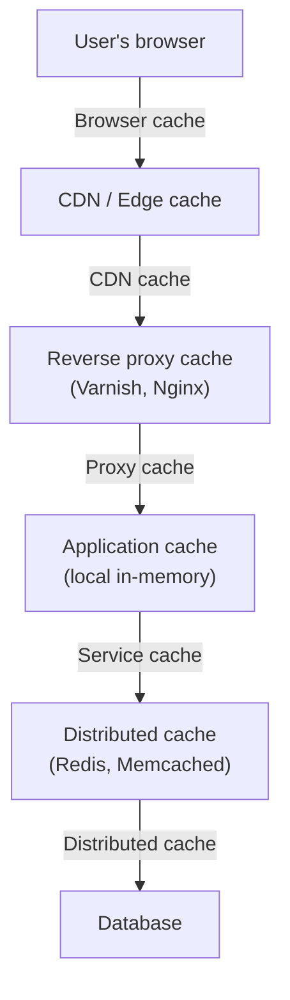
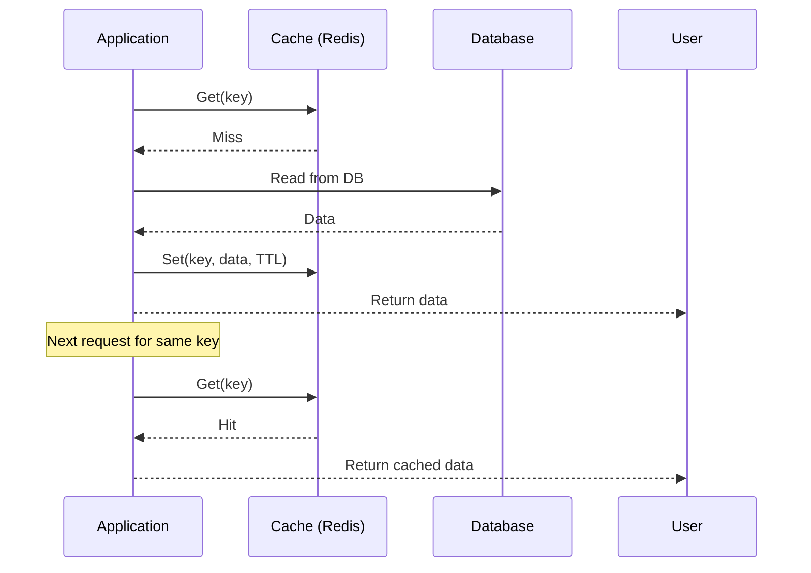
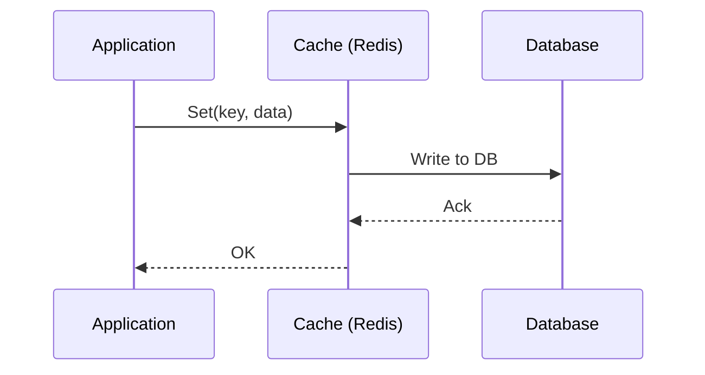
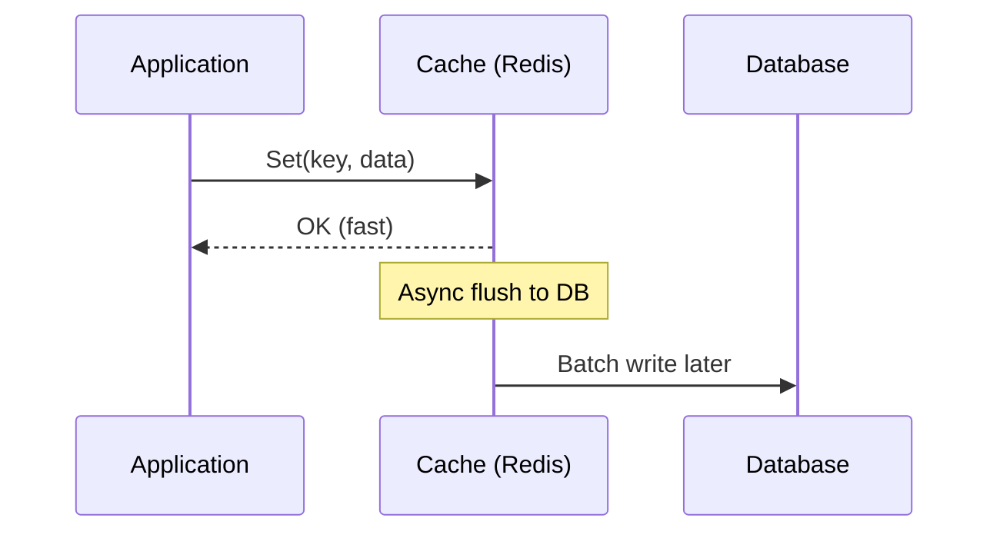
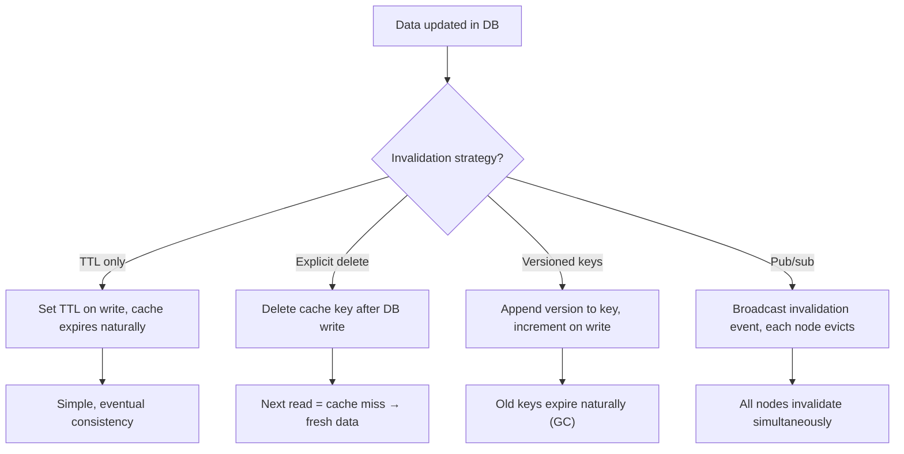
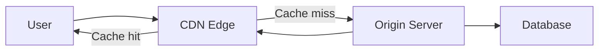
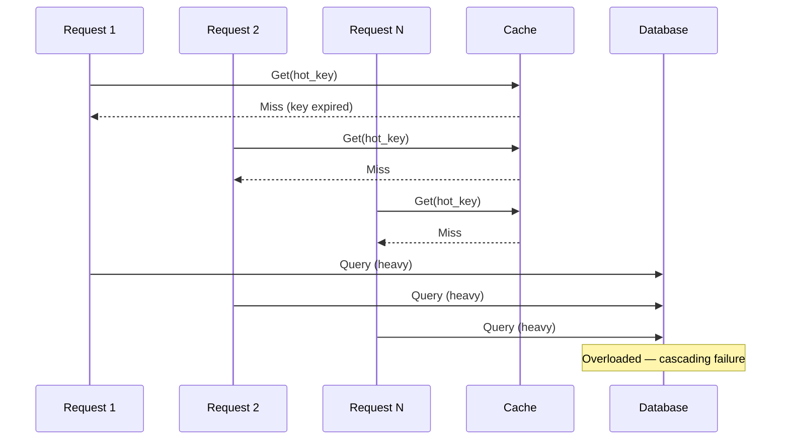
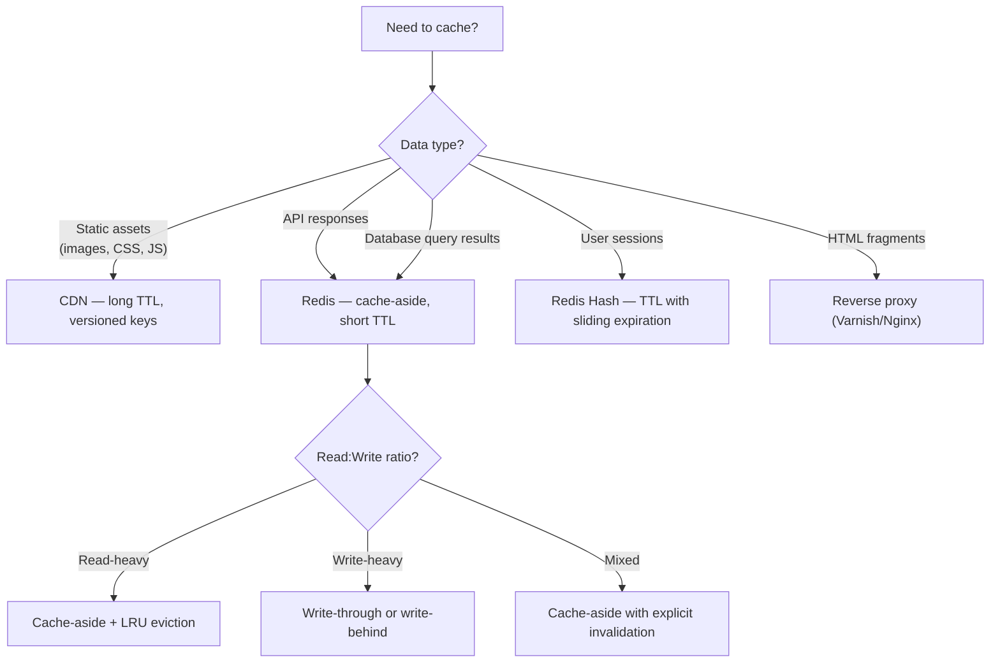

# Caching Strategies

> [!summary] Goal
> Reduce latency and database load by caching data at the right layer with the right invalidation strategy. Choose between local, distributed, and CDN caching based on access patterns.

## Table of Contents

1. [Cache Layers](#cache-layers)
2. [Caching Strategies](#caching-strategies)
3. [Cache Invalidation](#cache-invalidation)
4. [Redis for Caching](#redis-for-caching)
5. [CDN Caching](#cdn-caching)
6. [Failure Modes](#failure-modes)
7. [Decision Tree](#decision-tree)
8. [Pitfalls](#pitfalls)

---

## Cache Layers



| Layer | Latency | Capacity | Cache type |
|-------|:-------:|:--------:|------------|
| **Browser cache** | <1ms | ~100MB per origin | Static assets, images |
| **CDN edge** | ~5-20ms | Regional | Static + dynamic HTML |
| **Reverse proxy** | ~1-5ms | Per instance | HTML fragments, API responses |
| **Application (local)** | <0.1ms | Per process (GB) | Hot data, configuration |
| **Distributed (Redis)** | ~1-5ms | Cluster (TB) | Shared session, counters, rate limits |

---

## Caching Strategies

### Cache-Aside (Lazy Loading)



| Aspect | Cache-Aside |
|--------|-------------|
| **When to use** | Read-heavy workloads, general purpose |
| **Write strategy** | Application writes to DB, invalidates cache |
| **Stale data risk** | Yes (up to TTL) |
| **Complexity** | Low — application manages cache |
| **Cache stampede** | Yes — multiple misses on expiry |

### Write-Through



| Aspect | Write-Through |
|--------|---------------|
| **When to use** | Write-heavy, need cache consistency |
| **Write strategy** | Application writes to cache, cache writes to DB |
| **Stale data risk** | Low (always in sync) |
| **Complexity** | Medium — cache is authoritative |
| **Write latency** | Higher (two hops) |

### Write-Behind (Write-Back)



| Aspect | Write-Behind |
|--------|--------------|
| **When to use** | High write throughput, batching |
| **Write strategy** | Write to cache, async persist to DB |
| **Stale data risk** | High — data loss if cache fails before flush |
| **Complexity** | High — need to handle cache failures |
| **Write latency** | Low (async) |

### Strategy comparison

| Strategy | Read perf | Write perf | Staleness | Data loss risk | Implementation |
|----------|:---------:|:----------:|:---------:|:--------------:|:--------------:|
| **Cache-Aside** | High | Normal | Low (TTL) | None | Trivial |
| **Write-Through** | High | Lower | None | None | Medium |
| **Write-Behind** | High | Highest | Higher | Yes (cache crash) | Complex |

---

## Cache Invalidation



| Strategy | How it works | Stale reads | Best for |
|----------|-------------|:-----------:|----------|
| **TTL only** | Set expiration, never explicitly invalidate | Possible, bounded by TTL | Read-only reference data |
| **Explicit delete** | Delete cache key on write, re-populate on next read | None (after delete) | Frequently updated data |
| **Versioned keys** | Key = `entity:123:v2`; increment version on write | None | Immutable assets, images |
| **Pub/sub invalidation** | Broadcast invalidation events across service instances | None | Shared cache across many app instances |

---

## Redis for Caching

### Data structures

| Structure | Use case | Example |
|-----------|----------|---------|
| **String** | Simple key-value | Cache HTML, JSON, counters |
| **Hash** | Object fields | User sessions, product metadata |
| **List** | Ordered queue | Timeline fan-out, recent items |
| **Set** | Unique members | Followers, tags |
| **Sorted Set** | Ranked members | Leaderboard, rate limiting, delayed queue |
| **HyperLogLog** | Cardinality estimation | Unique visitors, distinct counts |

### Eviction policies

| Policy | Behavior | When to use |
|--------|----------|-------------|
| `noeviction` | Return error when memory full | Cache must not lose data |
| `allkeys-lru` | Evict least recently used keys | General-purpose cache |
| `allkeys-lfu` | Evict least frequently used keys | Hot/cold data patterns |
| `volatile-lru` | Evict LRU among keys with TTL set | Mixed cache + persistent data |
| `allkeys-random` | Evict random keys | Uniform access patterns |
| `volatile-ttl` | Evict keys with shortest TTL | Prefer keeping newer data |

> [!tip] For most caching use cases, use `allkeys-lru`. It keeps frequently accessed data in memory and evicts cold data without needing explicit TTLs.

---

## CDN Caching



### CDN cache control

```text
Cache-Control: public, max-age=3600, s-maxage=86400

public     → Can be cached by any cache (CDN + browser)
private    → Only browser cache (no CDN)
max-age    → TTL for browser cache (seconds)
s-maxage   → TTL for CDN cache (seconds, overrides max-age for shared caches)
stale-while-revalidate → Serve stale, refresh in background
stale-if-error → Serve stale if origin is down
```

| CDN directive | Behavior | Use case |
|---------------|----------|----------|
| `max-age=0` | Always revalidate | Dynamic content, API responses |
| `max-age=3600` | Cache for 1 hour | Semi-static pages |
| `s-maxage=86400` | CDN cache 1 day, browser 1 hour | News articles |
| `stale-while-revalidate=86400` | Serve stale for 1 day while refreshing | High-traffic content |

---

## Failure Modes

### Cache stampede (thundering herd)

When a popular cache key expires, many requests simultaneously miss cache and hammer the database:



**Mitigations:**
- **Request coalescing**: only one request fetches from DB, others wait
- **Stale-while-revalidate**: serve stale data, refresh in background
- **Jitter TTLs**: add random variation to TTLs so keys don't expire simultaneously
- **Mutex**: lock the key while populating, others wait

### Hot keys

A single key receives disproportionate traffic. One Redis node handles all requests for that key, saturating its CPU/network.

**Mitigations:**
- **Local cache in front of Redis**: each app instance holds a copy
- **Replicate hot key**: use replica nodes to spread read load
- **Shard by client**: if the key is per-user, the traffic is naturally distributed

---

## Decision Tree



---

## Pitfalls

### Using cache as the source of truth

Cache is a performance layer, not a durability layer. Redis persistence (RDB/AOF) is best-effort. Always treat the database as the authoritative data source.

### No TTL — unbounded cache growth

Without TTLs, every key lives forever. Memory fills up, eviction kicks in indiscriminately, and hot keys get evicted. Always set TTLs, even if they're long.

### Too-large cached values

Caching a 10MB JSON blob puts pressure on memory and network. Use pagination, compression (Snappy, LZ4), or cache individual elements instead.

### Cache stampede without mitigation

A popular key expires → 1000 simultaneous DB queries → database overload. Always implement request coalescing or stale-while-revalidate for hot keys.

### Monitoring blind spots

Cache hit rate below 80% indicates a sizing or modeling problem. Monitor `redis-cli --stat`, `INFO commandstats`, and eviction rates. Set alerts on eviction counts.

---

> [!question]- Interview Questions
>
> **Q: What is the difference between cache-aside and write-through caching?**
> A: In cache-aside (lazy loading), the application reads from cache, falls back to DB on miss, and populates the cache. Writes go directly to DB and invalidate the cache. In write-through, the application writes to the cache first, and the cache synchronously writes to the DB — reads always hit the cache.
>
> **Q: How do you handle a cache stampede?**
> A: Use request coalescing (only one request fetches from DB, others wait), stale-while-revalidate (serve stale data while refreshing), or add jitter to TTLs so keys don't expire simultaneously. A mutex lock around the cache population prevents redundant DB queries.
>
> **Q: What Redis eviction policy should you choose for a general-purpose cache?**
> A: `allkeys-lru`. It evicts the least recently used keys when memory is full, keeping hot data in cache without needing to set explicit TTLs on every key.
>
> **Q: How does CDN caching differ from application caching?**
> A: CDN caching operates at the HTTP layer (Cache-Control headers, URL-based). It caches entire responses at edge locations close to users. Application caching (Redis) operates at the data layer — it stores raw query results, sessions, or computed values. CDN reduces network latency; Redis reduces database load.
>
> **Q: What is stale-while-revalidate?**
> A: It allows serving stale cached content while asynchronously fetching fresh content in the background. The user gets near-instant responses (from stale cache) while the cache is updated. This eliminates cache stampedes and provides the best user experience during cache refreshes.

---

## Cross-Links

- [[SystemDesign/02_Core/02_Load_Balancers_and_Service_Discovery]] for CDN routing and anycast
- [[SystemDesign/01_Foundations/03_Data_Modeling_Basics]] for denormalization and materialized views
- [[SystemDesign/03_Advanced/03_Resilience_Patterns]] for circuit breakers around cache failures
- [[SystemDesign/02_Core/05_Observability_Logs_Metrics_Traces]] for cache hit-rate monitoring
- [[CICD/Docker/02_Core/01_Images_Containers_and_Layers]] for CDN cache invalidation in CI/CD
