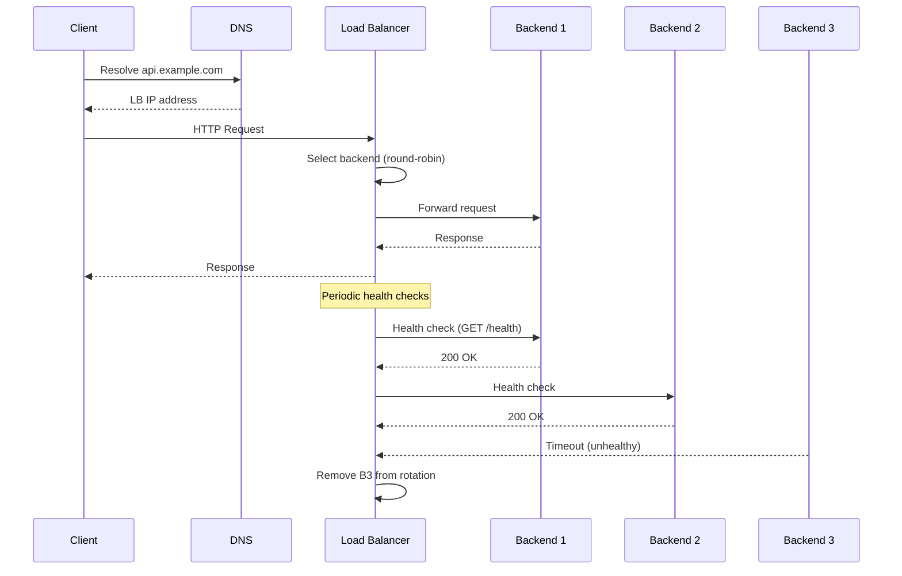
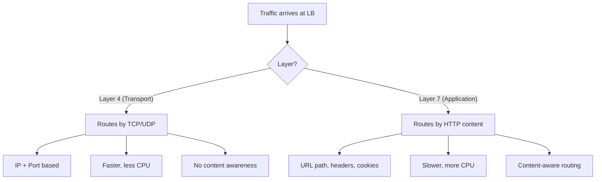
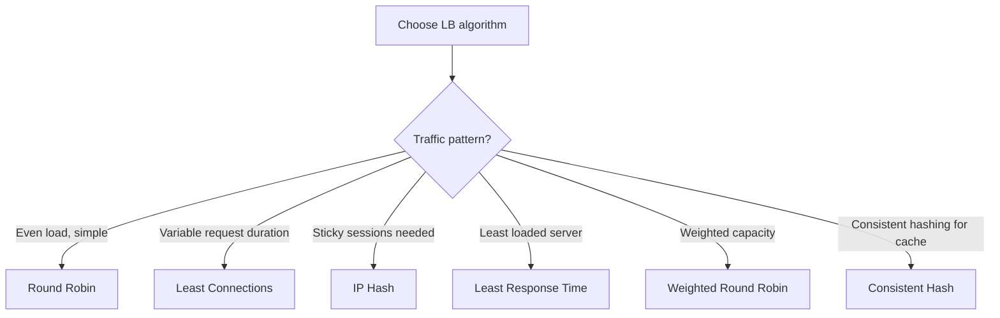
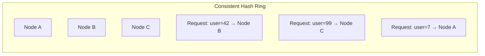
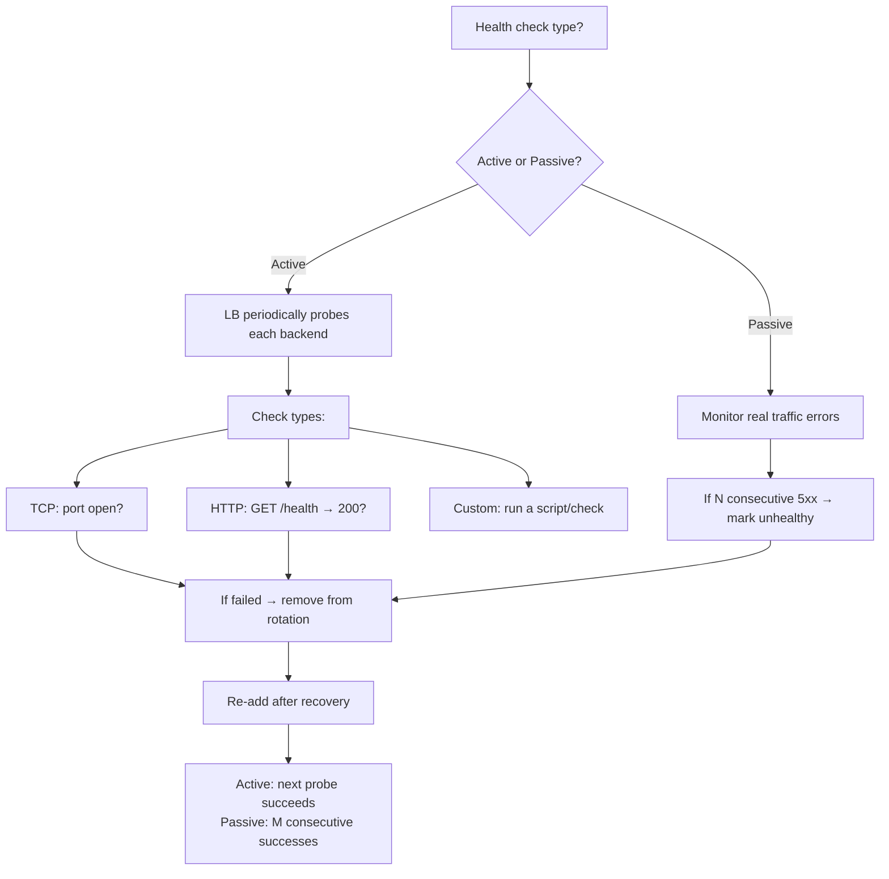
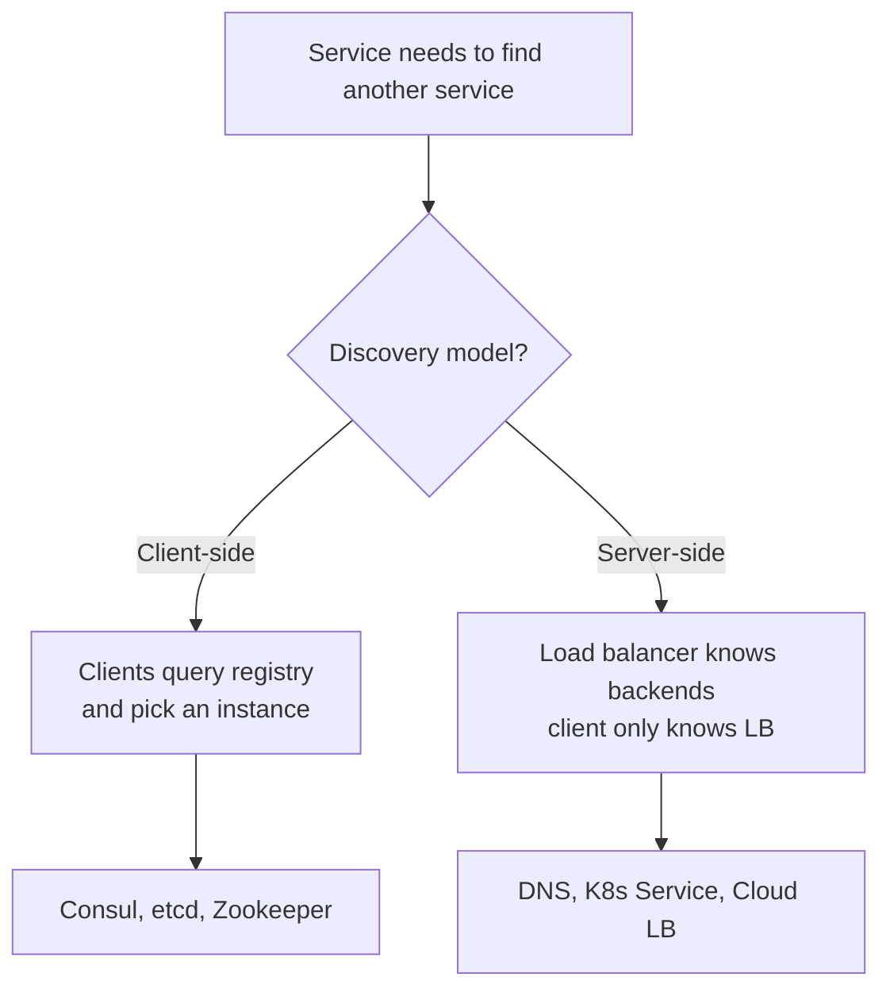

# Load Balancers and Service Discovery

> [!summary] Goal
> Route traffic to healthy instances, avoid single points of failure, and enable services to find each other dynamically in a distributed system.

## Table of Contents

1. [Load Balancer Flow](#load-balancer-flow)
2. [L4 vs L7 Load Balancing](#l4-vs-l7-load-balancing)
3. [Load Balancing Algorithms](#load-balancing-algorithms)
4. [Health Checks](#health-checks)
5. [Service Discovery](#service-discovery)
6. [Comparison: LB Implementations](#comparison-lb-implementations)
7. [Pitfalls](#pitfalls)

---

## Load Balancer Flow



---

## L4 vs L7 Load Balancing



| Aspect | L4 (Transport) | L7 (Application) |
|--------|:--------------:|:----------------:|
| **OSI layer** | 4 (TCP/UDP) | 7 (HTTP/HTTPS) |
| **Routing decision** | IP + port | URL path, headers, cookies |
| **Performance** | Faster (less parsing) | Slower (full packet inspection) |
| **Use case** | TCP/UDP traffic | HTTP API routing |
| **TLS termination** | ❌ Pass-through | ✅ Can terminate |
| **Session persistence** | Source IP hash | Cookie-based |
| **Examples** | HAProxy (TCP mode), AWS NLB | Nginx, HAProxy (HTTP mode), AWS ALB |

---

## Load Balancing Algorithms



| Algorithm | Description | Best for | Sticky? |
|-----------|-------------|----------|:-------:|
| **Round Robin** | Rotate through backends in order | Equal-capacity instances, simple use cases | No |
| **Least Connections** | Send to backend with fewest active connections | Variable-length requests (e.g., mixed fast/slow APIs) | No |
| **IP Hash** | Hash client IP to consistently pick a backend | Sticky sessions without cookies | Yes |
| **Least Response Time** | Pick backend with fastest recent response times | Performance-sensitive, heterogeneous capacity | No |
| **Weighted Round Robin** | Assign weights based on capacity | Heterogeneous instances (different CPU/RAM) | No |
| **Consistent Hash** | Hash a key (URL, user ID) to a backend, stable on changes | Cache affinity, distributed caching | Yes |

### Consistent hashing for load balancing



When a node is added or removed, only `1/n` of keys are reassigned — critical for cache clusters and stateful services.

---

## Health Checks



| Check type | What it does | Use case |
|-----------|-------------|----------|
| **TCP** | Opens TCP connection to port | Quick connectivity check |
| **HTTP (readiness)** | GET /healthz returns 200 | Is the app ready to serve? |
| **HTTP (liveness)** | GET /alive returns 200 | Is the process alive? (K8s) |
| **gRPC** | Health check via gRPC protocol | gRPC services |
| **Custom script** | Application-specific check | Complex validation (DB connection, cache) |

### Startup vs readiness vs liveness

| Probe | When it runs | Failure action | K8s equivalent |
|-------|-------------|---------------|:--------------:|
| **Startup** | Before any traffic | Don't send traffic | `startupProbe` |
| **Readiness** | Throughout lifetime | Remove from LB rotation | `readinessProbe` |
| **Liveness** | Throughout lifetime | Restart the instance | `livenessProbe` |

---

## Service Discovery



| Model | How it works | Pros | Cons |
|-------|-------------|------|------|
| **Client-side** | App queries service registry (Consul, etcd), picks an instance | No extra hop, flexible routing | Every client implements discovery logic |
| **Server-side** | Client sends to load balancer, LB routes to healthy backends | Simple client, no discovery logic | Extra network hop, LB is a bottleneck |
| **DNS-based** | DNS resolves to a set of IPs (round-robin DNS) | Simple, standard protocol | Slow propagation, no health awareness |
| **Kubernetes Service** | K8s assigns virtual IP to a set of pods | Auto-updated, health-aware | K8s-only |

### DNS-based discovery tradeoffs

```text
Round-robin DNS:
  api.example.com → [10.0.0.1, 10.0.0.2, 10.0.0.3]

Pros:
  - Simple, works everywhere
  - No additional infrastructure

Cons:
  - DNS caching: clients may call unhealthy instances
  - Slow failover: TTL must expire before clients retry
  - No awareness of load or health

Best for: low-criticality, high-TTL setups with client-side retries
```

---

## Comparison: LB Implementations

| Feature | Nginx | HAProxy | AWS ALB | AWS NLB | K8s Service |
|---------|:-----:|:-------:|:-------:|:-------:|:-----------:|
| **Layer** | L7 | L4 + L7 | L7 | L4 | L4 |
| **Performance** | Medium | High | High | Very high | High |
| **TLS termination** | ✅ | ✅ | ✅ | ❌ (pass-through) | ✅ (Ingress) |
| **Sticky sessions** | Cookie | Cookie + hash | Cookie | Source IP | Service mesh |
| **Health checks** | Active | Active + passive | Active | Active | Active (probes) |
| **Dynamic config** | Reload | Reload (no restart) | API | API | Auto via API |
| **Service discovery** | External resolver | DNS, Consul | Auto (target groups) | Auto | Built-in |
| **WebSocket** | ✅ | ✅ | ✅ | ✅ | ✅ |
| **gRPC** | ✅ (HTTP/2) | ✅ (HTTP/2) | ✅ (HTTP/2) | ❌ | ✅ |

---

## Pitfalls

### Health check endpoint is too expensive

A health check that queries the database on every probe (every 5 seconds × 100 instances = 20 queries/second) can become a significant load. Keep health checks lightweight — check process health, not full integration.

### Sticky sessions prevent even load distribution

IP hash or cookie-based sticky sessions make it impossible to drain instances gracefully. When you remove an instance, all its sticky sessions break. Prefer stateless services with distributed caches and session stores.

### DNS caching hides backend failures

Clients cache DNS lookups. If a backend fails, clients with cached IPs still send traffic to the dead instance. Mitigate with short TTLs (30-60s) and client-side retry logic.

### Too-aggressive health checks

Checking every 1 second with a 500ms timeout adds unnecessary load. Standard: check every 10-15 seconds with a 2-5 second timeout. Unhealthy threshold: 3 consecutive failures. Healthy threshold: 2 consecutive successes.

### Single load balancer is a SPOF

A single load balancer is itself a single point of failure. Use DNS load balancing across multiple LB instances, or use Anycast IPs (Cloudflare, AWS Global Accelerator).

---

> [!question]- Interview Questions
>
> **Q: What is the difference between L4 and L7 load balancing?**
> A: L4 (transport) load balancing routes traffic based on TCP/UDP port and IP address — it's fast but content-blind. L7 (application) load balancing inspects HTTP headers, URL paths, cookies, and body — slower but enables content-based routing (e.g., route `/api/v1/*` to one service, `/api/v2/*` to another).
>
> **Q: What load balancing algorithm would you choose for a service with variable request latency?**
> A: Least Connections. It sends requests to the backend with the fewest active connections. This works well when some requests take 10ms and others take 10s — the fast server isn't overwhelmed waiting for the slow server's connections to drain.
>
> **Q: How does service discovery work in a microservice architecture?**
> A: Two models: client-side (app queries Consul/etcd for healthy instances and picks one) and server-side (app sends to a load balancer, which knows the healthy backends). Kubernetes Services implement server-side discovery with endpoint slices updated by the API server.
>
> **Q: What is the difference between readiness and liveness probes?**
> A: Readiness probes determine if an instance should receive traffic — failure removes it from the load balancer. Liveness probes determine if an instance should be restarted — failure kills and recreates the instance. Start with readiness probes; add liveness probes only when the app can recover from deadlocks.
>
> **Q: What are the tradeoffs of DNS-based load balancing?**
> A: DNS-based LB is simple and universal but has slow failover (DNS caching, TTL propagation), no health awareness (clients may hit unhealthy instances), and no load awareness. Best for low-criticality traffic or as the first line of LB with a real-time LB behind it.

---

## Cross-Links

- [[Networking/02_Core/05_Load_Balancing_Algorithms]] for deeper algorithm analysis
- [[SystemDesign/01_Foundations/01_Requirements_and_Capacity_Estimation]] for bandwidth planning per LB
- [[SystemDesign/02_Core/01_Caching_Strategies]] for consistent hashing in cache clusters
- [[CICD/Kubernetes/02_Core/02_Ingress_and_Service_Types]] for K8s load balancing
