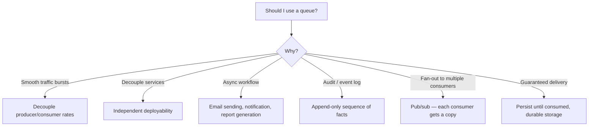
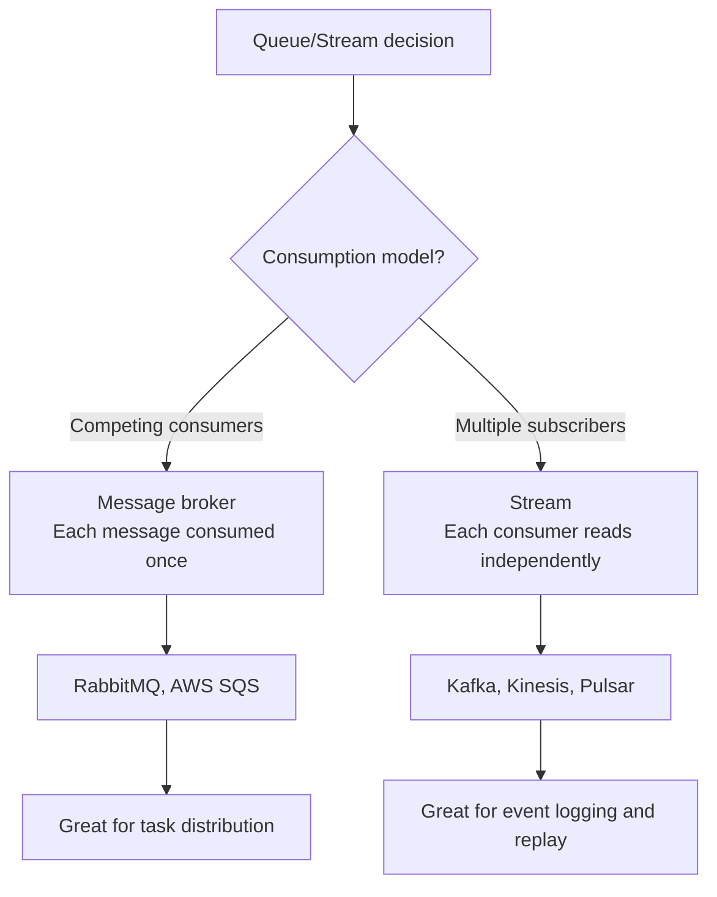
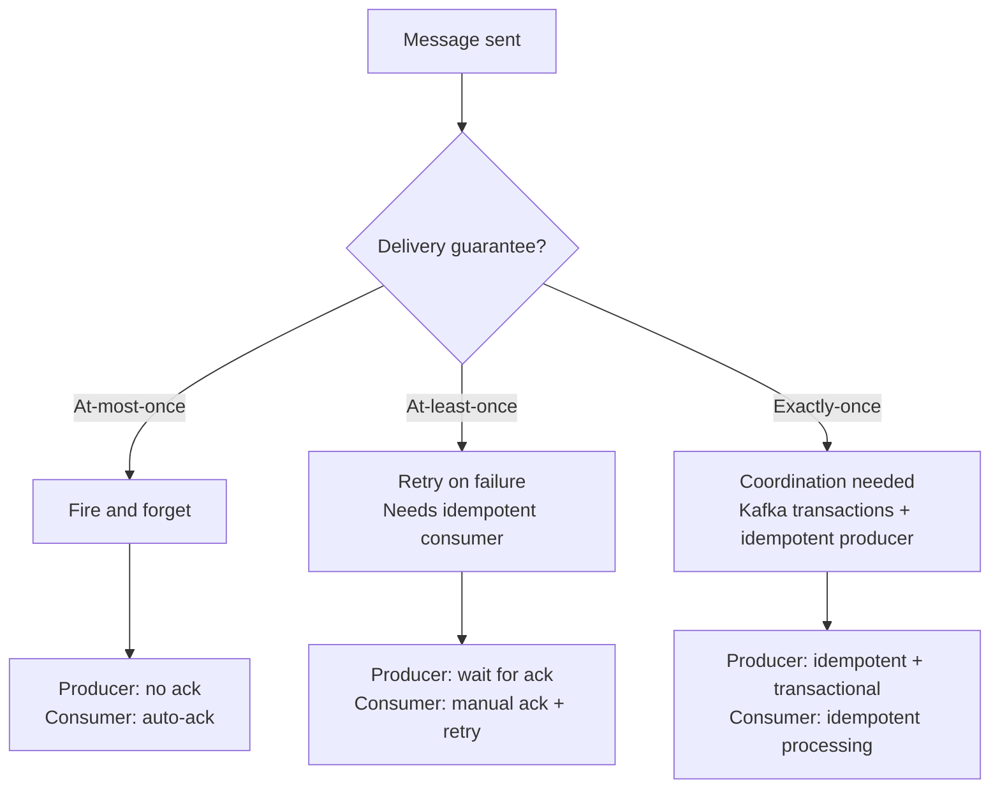
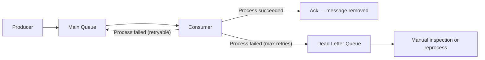
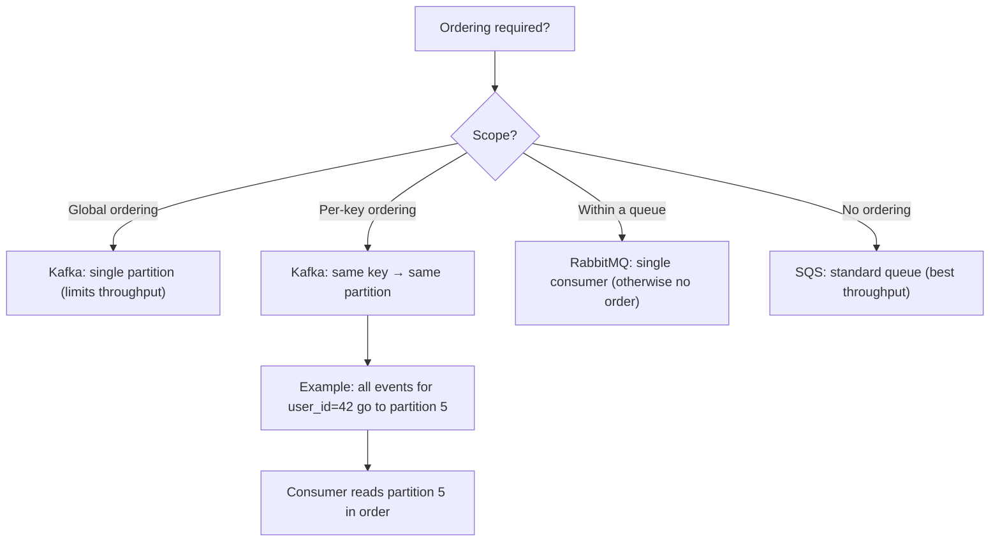
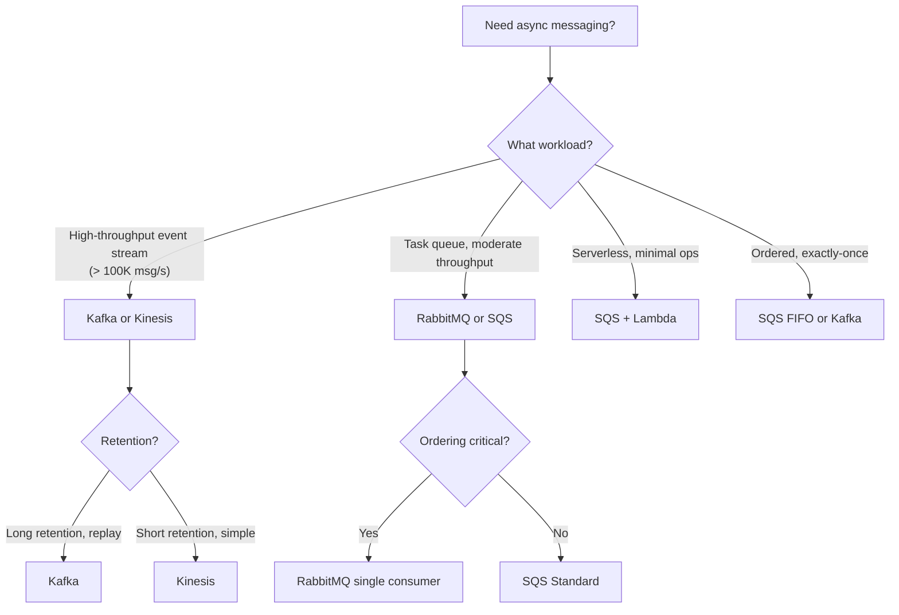

# Queues and Event-Driven Architecture

> [!summary] Goal
> Decouple producers and consumers using queues and event streams. Handle ordering, delivery guarantees, dead-letter queues, and backpressure. Choose between Kafka, RabbitMQ, and SQS.

## Table of Contents

1. [When to Use a Queue](#when-to-use-a-queue)
2. [Message Broker vs Stream Processor](#message-broker-vs-stream-processor)
3. [Delivery Semantics](#delivery-semantics)
4. [Dead Letter Queues and Retries](#dead-letter-queues-and-retries)
5. [Ordering Guarantees](#ordering-guarantees)
6. [Comparison: Kafka vs RabbitMQ vs SQS](#comparison-kafka-vs-rabbitmq-vs-sqs)
7. [Decision Tree](#decision-tree)
8. [Pitfalls](#pitfalls)

---

## When to Use a Queue



| Use case | Example | Queue type |
|----------|---------|------------|
| **Load leveling** | Spike of 10K requests/min, consumers can only handle 1K/min | Message queue (RabbitMQ, SQS) |
| **Async processing** | User uploads video → transcoding pipeline | Message queue + stream |
| **Event broadcast** | User signs up → send email, update CRM, trigger onboarding | Pub/sub |
| **Event sourcing** | Order placed → event log for analytics, audit, replays | Stream (Kafka) |
| **Workflow orchestration** | Order → payment → inventory → shipping | Step Functions, temporal |

---

## Message Broker vs Stream Processor



| Aspect | Message Broker (RabbitMQ, SQS) | Stream Processor (Kafka) |
|--------|:-----------------------------:|:------------------------:|
| **Consumption** | Competing consumers — each message delivered once | Independent consumers — each reads from its own offset |
| **Message deletion** | Deleted after ack | Retained for configured period (configurable) |
| **Replay** | ❌ Not possible (deleted after ack) | ✅ Yes — reset consumer offset |
| **Ordering** | Within a single queue (single consumer) | Within a partition (key-based) |
| **Throughput** | Thousands/sec for durable | Millions/sec |
| **Persistence** | Memory or disk | Disk (append-only log) |
| **Use case** | Task queues, RPC, async jobs | Event sourcing, analytics, log aggregation, stream processing |

---

## Delivery Semantics



| Semantic | How it works | Duplicates? | Complexity | Use case |
|----------|-------------|:-----------:|:----------:|----------|
| **At-most-once** | Send, don't wait for confirmation | No | Low | Metrics, logging — loss OK |
| **At-least-once** | Send, wait for ack, retry on failure | Yes | Medium | Most use cases — orders, notifications |
| **Exactly-once** | Dedup + transactional boundaries | No | High | Financial, inventory, ledgers |

---

## Dead Letter Queues and Retries



### Retry strategy

| Retry attempt | Wait | Action |
|:-------------:|:----:|--------|
| 1 | 0s | Immediate retry |
| 2 | 30s | Exponential backoff |
| 3 | 2min | Exponential backoff |
| 4 | 10min | Exponential backoff |
| 5 | 1 hour | Exponential backoff (capped) |
| Max (6) | — | Move to DLQ |

### DLQ monitoring

```text
Alert on:
  - DLQ message count > 0 for more than 5 minutes
  - DLQ growth rate (messages per minute)
  - Dead letters by error type (parse error vs service unavailable)

Actions:
  - Auto-retry from DLQ with backoff (limited attempts)
  - Manual inspection for data errors
  - Replay fixed messages to the main queue
```

---

## Ordering Guarantees



| System | Ordering guarantee | Limitation |
|--------|-------------------|------------|
| **Kafka** | Within a partition (per key) | Partitions are unordered relative to each other |
| **RabbitMQ** | Single consumer on a queue | Multiple consumers = no ordering |
| **SQS Standard** | Best-effort ordering | Messages may be delivered out of order |
| **SQS FIFO** | Strict ordering (first-in-first-out) | 300 TPS, limited throughput |

> [!tip] If you need ordering per entity (e.g., all events for a user in order), use Kafka with user_id as the partition key. All events for the same user go to the same partition, and each partition is consumed in order.

---

## Comparison: Kafka vs RabbitMQ vs SQS

| Feature | Kafka | RabbitMQ | SQS Standard | SQS FIFO |
|---------|:-----:|:--------:|:------------:|:--------:|
| **Type** | Stream | Message broker | Managed queue | Managed queue |
| **Throughput** | Millions/sec | Thousands/sec | Unlimited | 300 TPS |
| **Ordering** | Per-partition | Single consumer | Best-effort | Strict FIFO |
| **Message retention** | Configurable (days) | Until acked | Up to 14 days | Up to 14 days |
| **Replay** | ✅ Reset offset | ❌ | ❌ | ❌ |
| **Pub/sub** | ✅ Consumer groups | ✅ Exchange/queue binding | ✅ SNS + SQS | ❌ |
| **Exactly-once** | ✅ Transactions | ❌ | ❌ | ✅ API-level |
| **Latency** | ~5-10ms | ~1ms (in-memory) | ~50ms | ~50ms |
| **Operational cost** | High (self-managed) | Medium | Pay per request | Pay per request |
| **Max message size** | 1MB (configurable) | ~500MB | 256KB | 256KB |
| **Best for** | Event sourcing, streams, analytics | Task queues, RPC, async workflows | Serverless decoupling | Ordered processing at low throughput |

---

## Decision Tree



---

## Pitfalls

### No dead letter queue

Without a DLQ, poison messages (malformed payloads, processing errors) are retried infinitely, blocking the queue. Always configure a DLQ with a max-retry count.

### Assuming global ordering

Kafka doesn't provide global ordering across partitions. SQS Standard doesn't guarantee ordering. If you need ordering, use Kafka with per-key partitioning (same key → same partition) or SQS FIFO.

### Synchronous processing in an async pipeline

If every consumer calls an external API synchronously, a single slow API call backs up the entire queue. Use timeouts, circuit breakers, and consider batching.

### Idempotent consumers are not optional

At-least-once delivery means duplicates. Every consumer must be idempotent — dedup by message ID, use database constraints, or implement upsert operations.

### Monitoring queue depth is not enough

Queue depth tells you there's a problem but not what kind. Monitor consumer lag (Kafka consumer lag, SQS approximate age of oldest message), processing errors, and DLQ growth. An empty queue with a stuck consumer silently loses messages.

---

> [!question]- Interview Questions
>
> **Q: When would you choose Kafka over RabbitMQ?**
> A: Kafka is better for high-throughput event streams (>100K msg/s), event sourcing, log aggregation, and workloads that need message replay. RabbitMQ is better for task queues, RPC-style async processing, and workloads with moderate throughput (<10K msg/s) that need complex routing.
>
> **Q: What is a dead letter queue and why is it important?**
> A: A DLQ stores messages that couldn't be processed after exhausting retries. Without a DLQ, poison messages are retried indefinitely, blocking the queue and consuming resources. The DLQ allows operators to inspect and fix failed messages without losing them.
>
> **Q: How does Kafka achieve ordering within a partition?**
> A: Kafka assigns messages with the same key (e.g., user_id) to the same partition using a hash of the key. Each partition is an ordered, append-only log. A single consumer reads a partition sequentially. This gives per-key ordering without global ordering, which would be a bottleneck.
>
> **Q: What is the difference between pub/sub and competing consumers?**
> A: In pub/sub, each consumer group gets all messages (broadcast). In competing consumers, each message is delivered to only one consumer in the group (work distribution). Kafka uses consumer groups for competing consumers; multiple groups subscribing to the same topic get independent copies of the stream.
>
> **Q: How do you handle backpressure in an event-driven system?**
> A: Backpressure mechanisms include consumer-side throttling (slow down polling), queue-based backpressure (stop reading when the queue is full), and reactive streams (demand-based flow control). In Kafka, the consumer controls its own pace by committing offsets only after processing. In RabbitMQ, use the `prefetch` setting to limit unacked messages.

---

## Cross-Links

- [[SystemDesign/01_Foundations/04_APIs_Idempotency_and_Retries]] for idempotent consumer design
- [[SystemDesign/03_Advanced/02_Backpressure_and_Load_Shedding]] for backpressure patterns
- [[SystemDesign/02_Core/04_Consistency_Replication_and_Consensus]] for consistency in async systems
- [[CICD/Kafka/00_MOC/00_Kafka_MOC]] for Kafka deep dive
- [[SystemDesign/04_Playbooks/02_Incident_Playbook_Retry_Storms]] for diagnosing queue-related incidents
