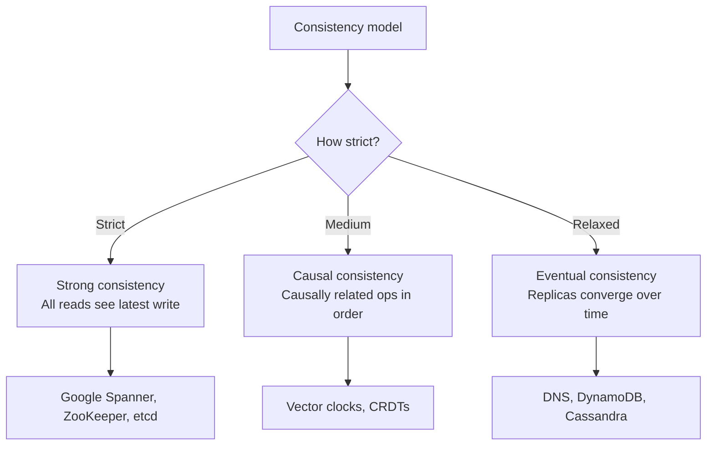
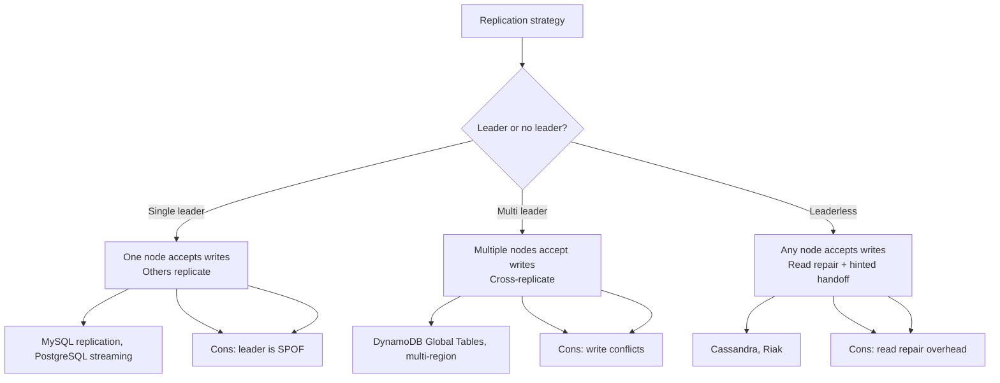
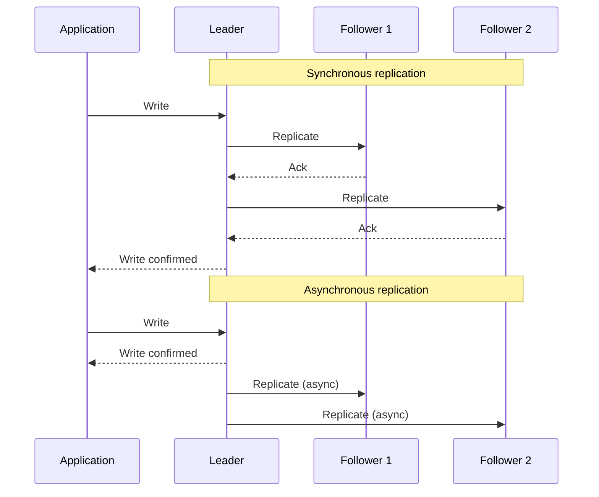
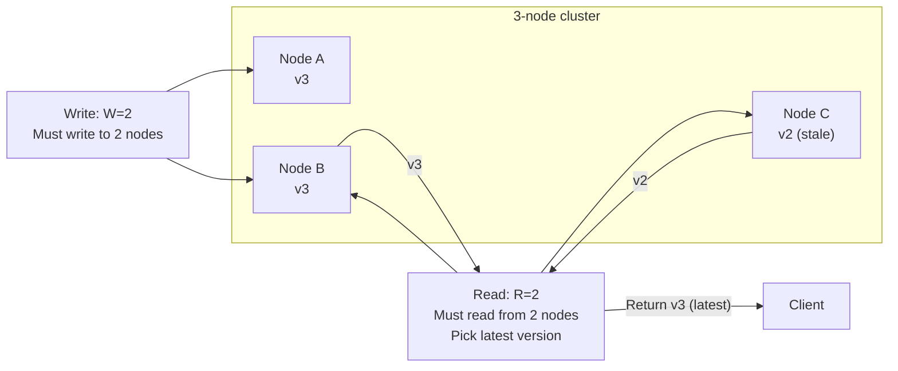
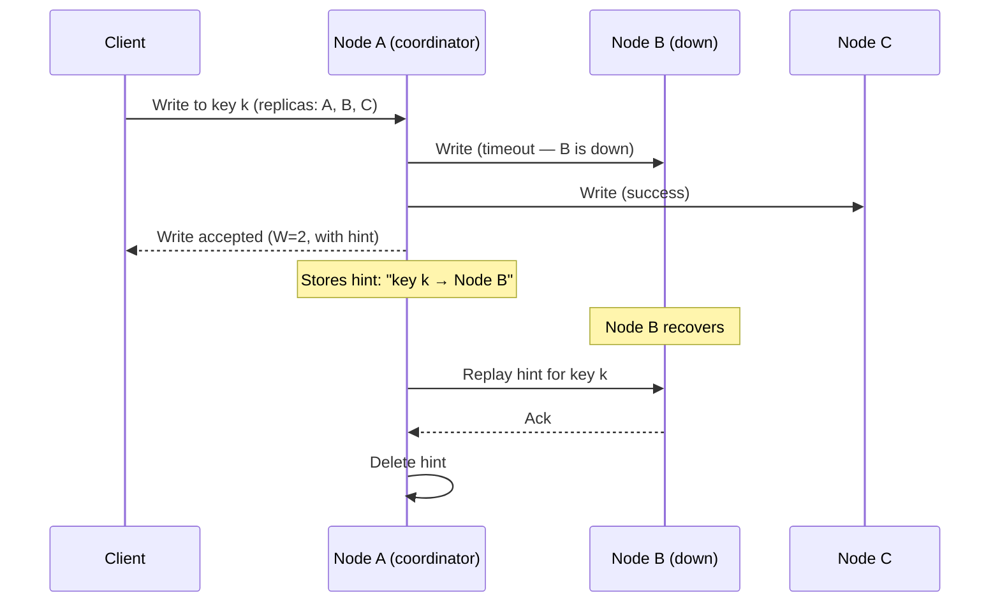
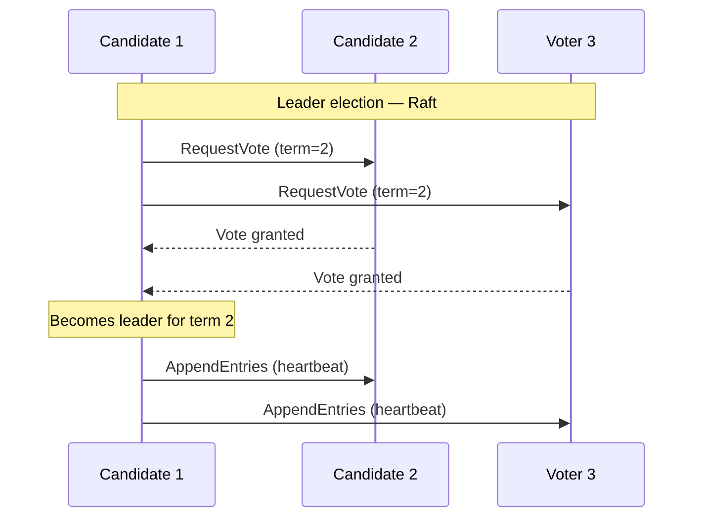
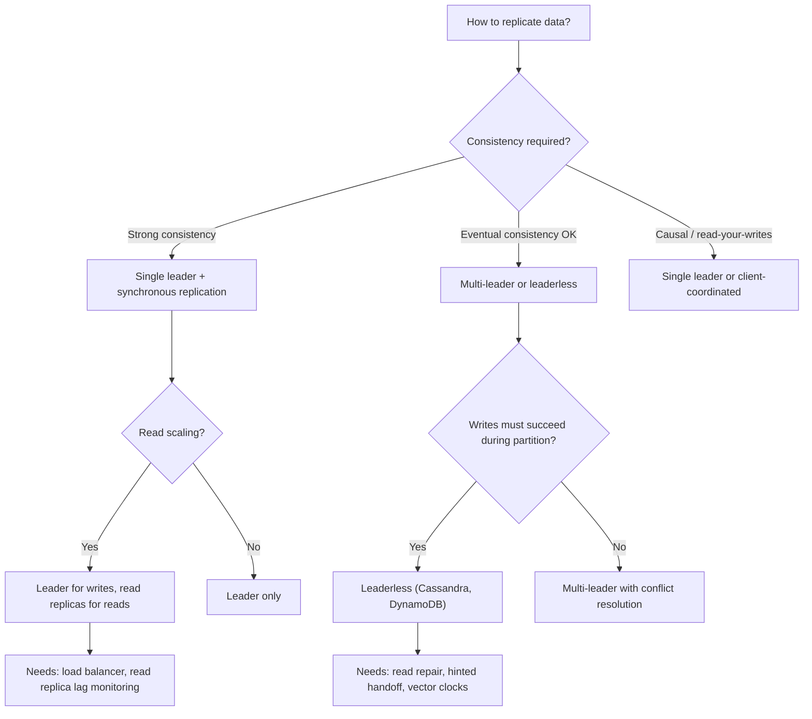

# Consistency, Replication, and Consensus

> [!summary] Goal
> Choose the right consistency model, replication strategy, and consensus algorithm for your distributed system. Understand the tradeoffs between strong consistency, availability, and performance.

## Table of Contents

1. [Consistency Models](#consistency-models)
2. [Replication Strategies](#replication-strategies)
3. [Quorum and Hinted Handoff](#quorum-and-hinted-handoff)
4. [Consensus Algorithms](#consensus-algorithms)
5. [Decision Tree](#decision-tree)
6. [Pitfalls](#pitfalls)

---

## Consistency Models



| Model | Guarantee | Latency | Available during partition? | Example |
|-------|-----------|:-------:|:--------------------------:|---------|
| **Strong** | Read returns the latest write | Higher | No (CP) | Spanner, ZK, etcd |
| **Read-your-writes** | Client sees its own writes | Good | Yes (AP) | Session consistency |
| **Monotonic reads** | Reads never go back in time | Good | Yes | User timeline |
| **Causal** | Causally related ops in order | Medium | Yes (AP) | Vector clocks |
| **Eventual** | All replicas eventually converge | Best | Yes (AP) | DNS, DynamoDB |
| **Weak** | No ordering guarantees | Best | Yes | In-memory cache |

---

## Replication Strategies



### Synchronous vs asynchronous replication



| Aspect | Synchronous | Asynchronous |
|--------|:-----------:|:------------:|
| **Data durability** | ✅ All replicas confirmed | ⚠️ Leader failure = data loss |
| **Write latency** | Higher (wait for replicas) | Lower (write to leader only) |
| **Read staleness** | None (all up to date) | Possible (replicas lag) |
| **Availability** | Lower (replica failure blocks writes) | Higher (writes succeed even if replica is down) |
| **Best for** | Strong consistency requirements | High throughput, eventual consistency OK |

---

## Quorum and Hinted Handoff

### Quorum read/write



| Quorum setting | Consistency guarantee | Failure tolerance |
|:--------------:|:---------------------:|:----------------:|
| W = 1, R = 1 | No consistency | 0 node failures |
| W = 2, R = 2 (N=3) | Strong consistency | 1 node failure |
| W = 2, R = 1 | Write-heavy — reads may be stale | 1 write node failure |
| W = 1, R = 2 | Read-heavy — reads are consistent | 1 read node failure |
| W = N, R = 1 | Full consistency but no write failure tolerance | — |

> [!tip] For strong consistency with fault tolerance in a 3-node cluster, use `W = R = 2`. This ensures the read set and write set overlap — at least one node in the read set has the latest write.

### Hinted handoff

When a replica is unavailable during a write, another node accepts the write "on behalf" of the downed node and stores a **hint**. When the downed node recovers, the hint is replayed.



---

## Consensus Algorithms

Consensus algorithms allow a group of nodes to agree on a value despite failures. Used for leader election, log replication, and distributed coordination.



| Algorithm | Approach | Used by | Performance |
|-----------|----------|---------|:-----------:|
| **Raft** | Leader-based, understandable | etcd, Consul, TiKV | ~10-50K ops/sec |
| **Paxos** | Symmetric, harder to implement | Google Chubby, Spanner | Similar to Raft |
| **Zab** | Leader-based, atomic broadcast | ZooKeeper | ~10K ops/sec |
| **Multi-Paxos** | Optimized Paxos with leader | Cassandra (optional) | Higher throughput |

### Raft in practice

```text
Raft guarantees:
  1. Leader Election: exactly one leader per term
  2. Log Replication: entries are replicated to a majority
  3. Safety: if two logs agree on an entry, all earlier entries also agree

Nodes spend most time in normal operation:
  - Leader accepts client writes
  - Leader replicates to followers
  - Followers are passive (apply entries, respond to heartbeats)
  - If follower doesn't hear from leader → start election

Failure handling:
  - Leader failure: new election in ~150-300ms
  - Network partition: majority side continues, minority is unavailable
  - Split-brain impossible: at most one leader per term
```

---

## Decision Tree



---

## Pitfalls

### Stale reads from read replicas

Reading from asynchronous replicas can return stale data. A user who just updated their profile may see the old version when their read hits a lagging replica. Use read-your-writes consistency (read from leader for the user's own data) or synchronous replication for critical reads.

### Write conflicts in multi-leader replication

Multiple leaders accepting writes to the same data can create conflicts. Handle with: last-write-wins (LWW, loses data), CRDTs (conflict-free data types), or application-level conflict resolution.

### Majority loss in a network partition

With Raft/etcd/ZK, a partitioned minority can't accept writes. A 3-node cluster needs 2 nodes to make progress. During a partition that splits 2:1, the side with 2 nodes continues, the side with 1 node is unavailable.

### Hinted handoff accumulation

If a node is down for a long time, hinted handoffs accumulate on other nodes. When the node recovers, replaying all hints can overwhelm it. Monitor hint counts and consider rebuilding the node from a snapshot instead.

### Over-quorum for write-heavy workloads

Setting W=3 and R=3 in a 3-node cluster provides strong consistency but zero failure tolerance (N=3, W+R > N requires 3 for each). Use W=2, R=2 for fault tolerance with strong consistency.

---

> [!question]- Interview Questions
>
> **Q: What is the difference between strong and eventual consistency?**
> A: Strong consistency guarantees that every read returns the latest write — all replicas agree at all times. Eventual consistency guarantees that replicas will converge over time without any ordering guarantee. Strong consistency requires synchronous replication (higher latency, lower availability during partitions). Eventual consistency allows any replica to accept writes (lower latency, higher availability).
>
> **Q: How does Raft consensus work?**
> A: Raft elects a leader that accepts all client writes and replicates them to followers via AppendEntries RPCs. A write is committed when a majority (quorum) of followers acknowledge it. If the leader fails, a new election is triggered — the candidate with the most up-to-date log becomes the new leader. Raft guarantees safety: at most one leader per term, and committed entries are never lost.
>
> **Q: What is quorum and how do you configure W and R for strong consistency?**
> A: Quorum is the minimum number of nodes that must agree on a read (R) or write (W). For strong consistency in a cluster of N nodes, configure W + R > N. In a 3-node cluster, W=2 and R=2 ensures the read set and write set overlap — at least one node in the read set has the latest write.
>
> **Q: What is hinted handoff?**
> A: When a replica is unavailable during a write, another node accepts the write on behalf of the downed node and stores a hint (the data and the target node). When the downed node recovers, the hint is replayed. This improves write availability without requiring all replicas to be up.
>
> **Q: How do you handle conflicts in multi-leader replication?**
> A: Options include: (1) Last-write-wins (LWW) — accept the write with the latest timestamp, loses data from concurrent writes. (2) CRDTs — merge concurrent writes without conflicts using commutative data structures. (3) Application-level resolution — flag conflicting versions, let the application or user decide.

---

## Cross-Links

- [[SystemDesign/01_Foundations/03_Data_Modeling_Basics]] for sharding and partitioning
- [[SystemDesign/02_Core/01_Caching_Strategies]] for cache invalidation and consistency
- [[SystemDesign/03_Advanced/04_Data_Consistency_Playbook]] for diagnosing consistency issues
- [[SQL/02_Core/03_Isolation_Levels_and_Anomalies]] for database transaction isolation
- [[CICD/Kubernetes/01_Foundations/04_Cluster_Architecture_and_Components]] for etcd and Raft in K8s
