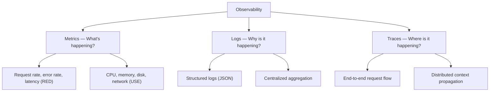
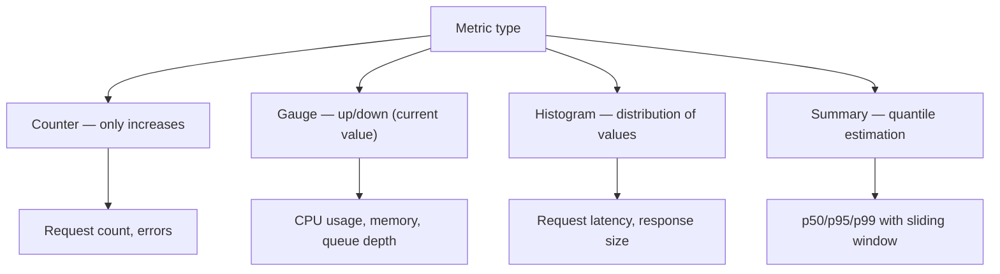
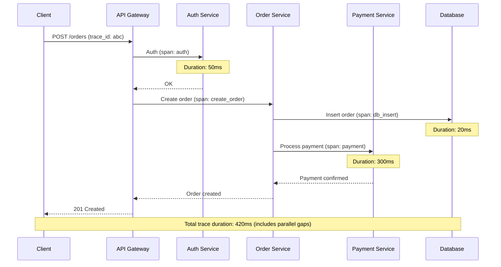
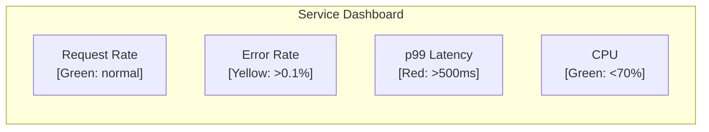

# Observability: Logs, Metrics, Traces

> [!summary] Goal
> Understand what's happening in a distributed system using the three pillars of observability — logs, metrics, and traces. Choose the right tools and design effective dashboards, alerts, and debugging workflows.

## Table of Contents

1. [The Three Pillars](#the-three-pillars)
2. [Metrics](#metrics)
3. [Logging](#logging)
4. [Distributed Tracing](#distributed-tracing)
5. [Alerts and Dashboards](#alerts-and-dashboards)
6. [Comparison: Observability Tools](#comparison-observability-tools)
7. [Pitfalls](#pitfalls)

---

## The Three Pillars



| Pillar | What it answers | Data type | Query pattern | Storage |
|--------|----------------|-----------|---------------|---------|
| **Metrics** | What's broken? | Numbers (counters, gauges, histograms) | Aggregation over time | TSDB (Prometheus, TimescaleDB) |
| **Logs** | Why is it broken? | Text (structured JSON events) | Search and filter | ELK, Loki, CloudWatch |
| **Traces** | Where is it broken? | Span trees with timing | Trace ID → waterfall | Jaeger, Zipkin, Tempo |

### RED and USE methods

```text
RED method (services):
  Rate: requests per second
  Errors: failed requests per second
  Duration: latency distribution (p50, p95, p99)

USE method (infrastructure):
  Utilization: % busy (CPU, memory, disk)
  Saturation: queue depth, load
  Errors: failed operations
```

---

## Metrics

### Metric types



| Type | Can decrease? | Use case | Example PromQL |
|------|:------------:|----------|----------------|
| **Counter** | No (only reset) | Request counts, error counts | `rate(http_requests_total[5m])` |
| **Gauge** | Yes | CPU, memory, queue depth | `node_cpu_percent` |
| **Histogram** | No | Latency distributions | `histogram_quantile(0.99, rate(...))` |
| **Summary** | No | Pre-computed quantiles | `request_latency_seconds_summary` |

### Key metrics per layer

```text
Application (RED):
  request_rate_total{endpoint, method, status}
  error_rate_total{endpoint, method, error_type}
  latency_seconds{endpoint, p50|p95|p99}

Infrastructure (USE):
  cpu_usage_percent
  memory_usage_bytes
  disk_io_latency_seconds
  network_packets_dropped_total

Database:
  db_connections_active
  query_latency_seconds{query_type}
  replication_lag_bytes
  cache_hit_ratio

Queue:
  queue_depth_current
  message_age_seconds
  consumer_lag (Kafka offset lag)
```

---

## Logging

### Structured vs unstructured

```json
// ❌ Unstructured
"2026-05-09 14:30:01 ERROR Failed to process payment for order 12345"

// ✅ Structured (JSON)
{
  "timestamp": "2026-05-09T14:30:01.123Z",
  "level": "ERROR",
  "service": "payment-service",
  "trace_id": "abc123def456",
  "user_id": "user_789",
  "order_id": "order_12345",
  "error": {
    "type": "payment_declined",
    "code": "insufficient_funds",
    "message": "Transaction declined by issuer"
  },
  "duration_ms": 342,
  "environment": "production"
}
```

| Aspect | Unstructured | Structured |
|--------|:------------:|:----------:|
| **Searchability** | ❌ Text search only | ✅ Query by field |
| **Automated parsing** | ❌ Regex, brittle | ✅ JSON parse, schema |
| **Alerting** | ❌ Grep-based, high noise | ✅ Field-based, precise |
| **Correlation** | ❌ Manual | ✅ Trace IDs, user IDs |
| **Schema evolution** | ✅ No schema needed | ⚠️ Must manage schema |

### Logging best practices

```text
1. Log levels: DEBUG < INFO < WARN < ERROR < FATAL
   - INFO: request start/end, state transitions
   - WARN: degraded behavior, retries
   - ERROR: failures that need investigation
   - FATAL: process cannot continue

2. Include context in every log line:
   - trace_id / span_id (for tracing correlation)
   - service_name, version
   - user_id, request_id (for business context)
   - duration_ms (for performance analysis)

3. Don't log sensitive data:
   - Passwords, tokens, credit card numbers, PII
   - Use log redaction or allow-lists

4. Sampling for high-volume logs:
   - Always sample DEBUG/INFO (1:1000)
   - Never sample ERROR/FATAL
   - Use head-based or tail-based sampling
```

---

## Distributed Tracing



### Trace context propagation

```text
Propagation headers (W3C Trace Context):
  traceparent: 00-0af7651916cd43dd8448eb211c80319c-b7ad6b7169203331-01
  │              │  │                       │                       │
  │              │  └─ trace_id (16 bytes)   span_id (8 bytes)      trace_flags
  │              └─ version
  └─ 00

Producers:
  - Extract traceparent from incoming request
  - Create child span, generate new span_id
  - Pass traceparent to downstream services
  - Record span start/end with timing and metadata

Consumers:
  - Extract traceparent from request or message headers
  - Use same trace_id, create new span_id for local work
  - Record span with parent span_id for tree structure
```

### Sampling strategies

| Strategy | How it works | When to use |
|----------|-------------|-------------|
| **Head-based** | Decide to sample at request entry | Simple, but may miss slow requests that aren't sampled |
| **Tail-based** | Record all spans, sample after seeing the result | Captures all failures/slow requests, more expensive |
| **Probabilistic** | Sample X% of requests (e.g., 1%) | Low overhead, good for high-traffic systems |
| **Rate-limited** | Max N traces per second | Bounds cost, but may not represent unusual patterns |

---

## Alerts and Dashboards

### Alert severity levels

```text
P0 (Critical):   Customer-facing outage, data loss
  Response: < 5 minutes
  Example: p99 latency > 5s for 5 minutes

P1 (High):       Degraded experience, partial outage
  Response: < 15 minutes
  Example: Error rate > 1% for 10 minutes

P2 (Medium):     Non-critical impairment
  Response: < 1 hour
  Example: Queue depth > 1000 for 30 minutes

P3 (Low):        Minor issue, no user impact
  Response: Next business day
  Example: Disk usage > 80%
```

### Dashboard design (Red-Yellow-Green)



---

## Comparison: Observability Tools

| Tool | Type | Data model | Query language | Strengths |
|------|------|-----------|:--------------:|-----------|
| **Prometheus** | Metrics | Pull-based, counter/gauge/histogram | PromQL | Simple, self-hosted, K8s-native |
| **Grafana** | Visualization | Multi-source dashboards | — | Best dashboard UI, multi-tenancy |
| **Loki** | Logs | Labels + compressed logs | LogQL | Integrates with Prometheus, cheap |
| **ELK (Elasticsearch)** | Logs | Full-text index | Lucene/KQL | Powerful full-text search, ecosystem |
| **Datadog** | All-in-one | Host-based pricing | Custom | Integrated platform, APM, no ops |
| **Jaeger** | Tracing | Span storage | Trace ID / tags | Open source, CNCF, sampling |
| **Tempo** | Tracing | Object store-backed | Trace ID | Cheap storage, Grafana integration |
| **OpenTelemetry** | Instrumentation | Unified API (metrics/logs/traces) | — | Vendor-neutral standard |
| **New Relic** | All-in-one | Agent-based | NRQL | APM focus, code-level insights |
| **CloudWatch** | AWS native | Metrics, logs, traces | CloudWatch Logs Insights | Built into AWS, no agents needed |

---

## Pitfalls

### Dashboard overload

A dashboard with 50 charts communicates nothing. Every chart should answer a question. Use the RED method for services (Rate, Errors, Duration) and USE for infrastructure (Utilization, Saturation, Errors). Max 8-10 charts per dashboard.

### Alert fatigue

Too many alerts cause operators to ignore all of them. Alert on symptoms (p99 latency, error rate) not causes (high CPU, disk usage). High CPU is only a problem if it degrades user-facing metrics. Reasonable target: 5-10 material alerts per service.

### Logs without structure

Unstructured logs are nearly useless at scale. You can't grep across 100 servers. Use JSON-structured logging with a consistent schema (timestamp, level, service, trace_id, message).

### Tracing without propagation

Distributed tracing requires every service to propagate trace context. If one service drops the trace header, the entire trace breaks. Instrument all entry points with OpenTelemetry and validate end-to-end in staging.

### Metrics cardinality explosion

Adding unbounded labels (user_id, request_id) to metrics explodes cardinality. Prometheus can't handle millions of unique label combinations. Keep label cardinality under 10,000 per metric. Use logging for per-request data, metrics for aggregation.

---

> [!question]- Interview Questions
>
> **Q: What are the three pillars of observability?**
> A: Metrics (what's happening — request rate, error rate, latency), logs (why it's happening — detailed events with context), and traces (where it's happening — end-to-end request flow across services). All three are needed to debug distributed systems.
>
> **Q: What is the difference between RED and USE monitoring methods?**
> A: RED (Rate, Errors, Duration) is for services — how many requests, how many fail, how long they take. USE (Utilization, Saturation, Errors) is for infrastructure resources — how busy, how queued, how many errors. RED tells you if users are impacted; USE tells you which resource is causing it.
>
> **Q: How does distributed tracing work?**
> A: Each request gets a unique trace_id at the entry point. Every service creates a span (unit of work) with its own span_id and the parent span_id. Spans are collected and assembled into a tree showing the full request path with timing for each service. OpenTelemetry is the standard API for instrumentation.
>
> **Q: Why use structured logging?**
> A: Unstructured logs can't be queried at scale. Structured JSON logs with a consistent schema (timestamp, level, service, trace_id, message) enable field-based filtering, automated alerting, correlation with traces, and cost-efficient storage.
>
> **Q: What is metric cardinality and why does it matter?**
> A: Cardinality is the number of unique label combinations in a metric. High cardinality (e.g., a label per user_id) blows up storage and query performance. Prometheus recommends staying under 10,000 label combinations per metric. Use logging for per-request data, metrics for aggregated views.

---

## Cross-Links

- [[SystemDesign/01_Foundations/02_Throughput_Latency_and_SLOs]] for SLI definition and error budgets
- [[SystemDesign/03_Advanced/03_Resilience_Patterns]] for circuit breaker monitoring
- [[SystemDesign/04_Playbooks/01_Design_Review_Checklist]] for observability review criteria
- [[SystemDesign/02_Core/04_Consistency_Replication_and_Consensus]] for replication lag monitoring
- [[CICD/Kubernetes/04_Playbooks/04_Monitoring_and_Observability_with_Prometheus]] for K8s observability
