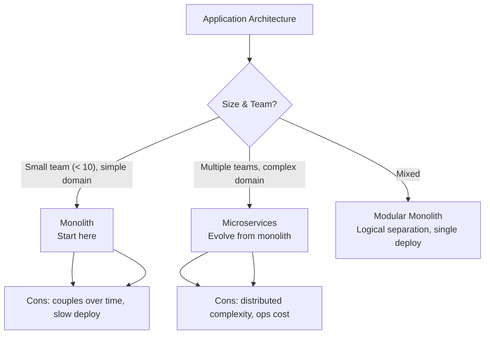
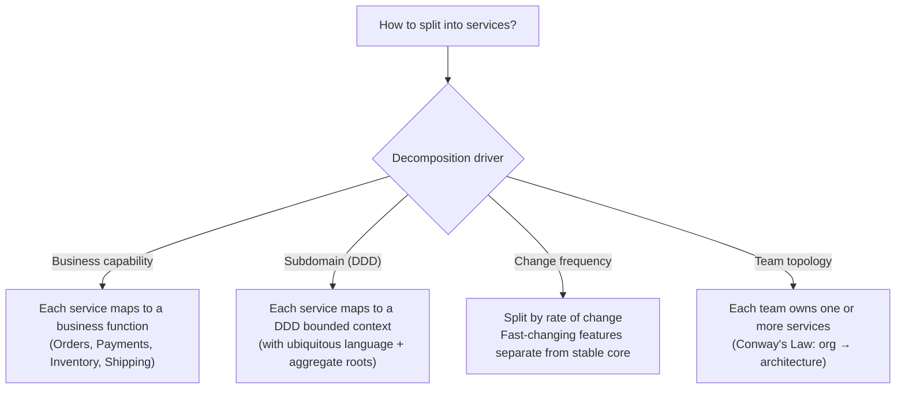
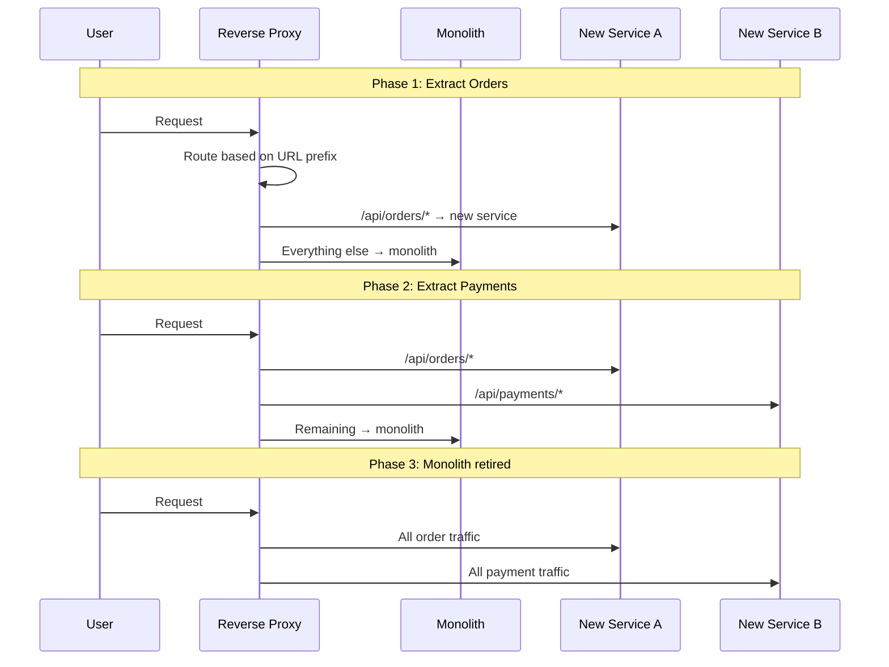
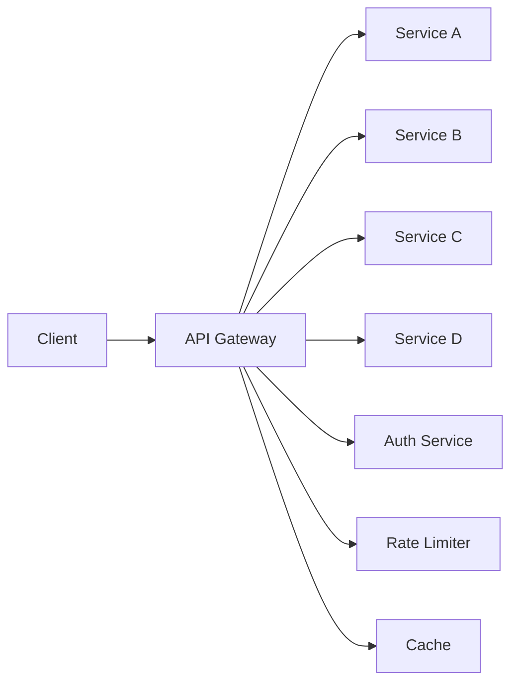
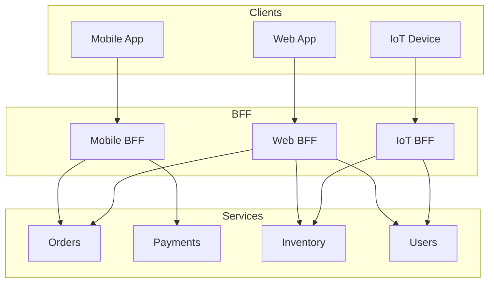
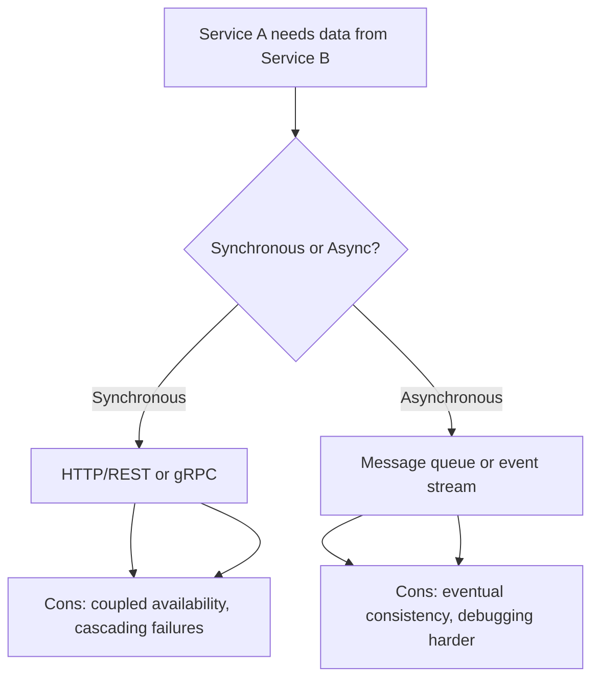
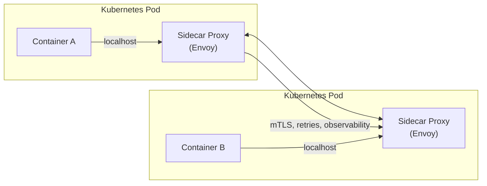
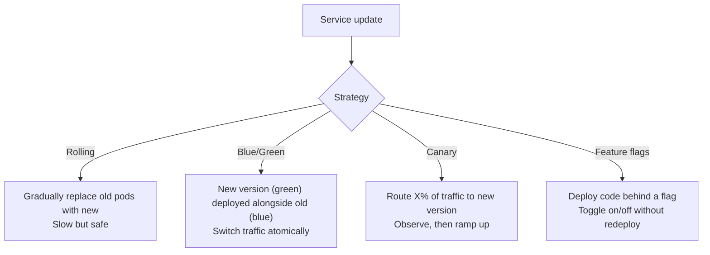
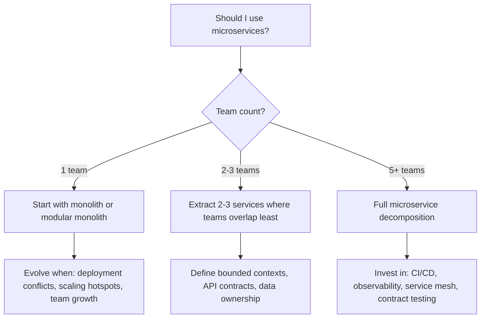

# Microservice Architecture

> [!summary] Goal
> Decompose a monolith into microservices using Domain-Driven Design, choose the right communication patterns, and understand when microservices add value versus unnecessary complexity.

## Table of Contents

1. [Monolith vs Microservices](#monolith-vs-microservices)
2. [Service Decomposition Strategies](#service-decomposition-strategies)
3. [API Gateway and BFF](#api-gateway-and-bff)
4. [Inter-Service Communication](#inter-service-communication)
5. [Service Mesh](#service-mesh)
6. [Deployment Strategies](#deployment-strategies)
7. [Decision Tree](#decision-tree)
8. [Pitfalls](#pitfalls)

---

## Monolith vs Microservices



| Aspect | Monolith | Microservices | Modular Monolith |
|--------|:--------:|:-------------:|:----------------:|
| **Team autonomy** | Low | High | Medium |
| **Deploy velocity** | Slow (whole app) | Fast (per service) | Medium |
| **Testing** | Easy (single process) | Complex (network, contracts) | Easy |
| **Scaling** | Coarse (entire app) | Fine (per service) | Coarse |
| **Operational cost** | Low | High (observability, deployment, networking) | Low |
| **Debugging** | Easy | Hard (distributed tracing) | Easy |
| **Startup friendliness** | ✅ Start here | ❌ Only when needed | ✅ Good middle ground |

---

## Service Decomposition Strategies



### Domain-Driven Design decomposition

```text
DDD Building Blocks:
  - Bounded Context: explicit boundary where a domain model applies
  - Aggregate: cluster of domain objects treated as a unit
  - Aggregate Root: the only object external objects can reference
  - Ubiquitous Language: shared language between devs and domain experts
  - Domain Event: something that happened in the domain (immutable fact)

Example — E-commerce bounded contexts:
  [Customer] → [Orders] → [Payments] → [Inventory] → [Shipping]
       ↓            ↓           ↓            ↓             ↓
  Customer      Order        Payment      Stock          Shipment
  Profile       Aggregate    Transaction  Availability   Tracking

Each bounded context becomes a candidate microservice.
Communication between contexts happens via events or API calls.
```

### Strangler Fig pattern

Gradually replace a monolith by extracting services one at a time:



---

## API Gateway and BFF



### API Gateway responsibilities

| Function | Description |
|----------|-------------|
| **Routing** | Forward requests to the correct service based on URL path |
| **Auth** | Validate tokens, enforce permissions before routing |
| **Rate limiting** | Enforce per-client or per-endpoint limits |
| **TLS termination** | Handle HTTPS, pass plain HTTP to internal services |
| **Request aggregation** | Combine responses from multiple services for a single client request |
| **Protocol translation** | External REST → internal gRPC |
| **Caching** | Cache responses for idempotent GET requests |
| **Circuit breaking** | Fail fast if downstream service is unhealthy |

### Backend for Frontend (BFF)



| Aspect | Single API Gateway | BFF per client |
|--------|:-----------------:|:--------------:|
| **Code duplication** | Low (one codebase) | Some (each BFF has similar logic) |
| **Client-specific optimization** | Hard (one size fits all) | Easy (tailored per client) |
| **Team autonomy** | Low (shared gateway) | High (each mobile/web/IoT team owns its BFF) |
| **Deploy coupling** | Gateway deploys affect all clients | Independent deploys per BFF |

---

## Inter-Service Communication



| Protocol | Type | Payload | Performance | Use case |
|----------|:----:|:-------:|:-----------:|----------|
| **REST (HTTP/JSON)** | Sync | JSON | Low | Simple APIs, external clients |
| **gRPC** | Sync | Protobuf | High (binary, HTTP/2) | Internal service-to-service, streaming |
| **GraphQL** | Sync | Custom query | Medium | Complex data requirements from clients |
| **Message Queue** | Async | JSON/Protobuf | High | Decoupled tasks, load leveling |
| **Event Stream (Kafka)** | Async | Avro/Protobuf | Very high | Event sourcing, analytics |

### gRPC communication patterns

```text
Unary:     Client → single request → Server → single response
Server streaming:  Client → request → Server → stream of responses
Client streaming:  Client → stream of requests → Server → response
Bidirectional:     Client ↔ Server ↔ streaming both ways

Advantages over REST:
  - Strongly typed contracts (.proto files)
  - HTTP/2 multiplexing (multiple streams per connection)
  - Binary encoding (smaller payload, faster serialization)
  - Built-in streaming, deadlines, cancellation
  - Code generation for multiple languages

When NOT to use gRPC:
  - External/public APIs (most browsers don't support HTTP/2 gRPC)
  - Simple CRUD (REST is more natural and tool-friendly)
  - When protobuf compilation adds friction
```

---

## Service Mesh



| Feature | Without service mesh | With service mesh (Istio, Linkerd) |
|---------|:-------------------:|:----------------------------------:|
| **mTLS** | Application code | Automatic (sidecar proxy) |
| **Retries** | Manual implementation | Configurable policy |
| **Circuit breaking** | Library (Resilience4j) | Proxy-level |
| **Observability** | Custom metrics | Automatic HTTP/gRPC metrics + traces |
| **Traffic splitting** | Load balancer config | Canary, blue/green, A/B via config |
| **Rate limiting** | Application or API gateway | Proxy-level |
| **Operational complexity** | Low | High (control plane, sidecar injection) |

> [!tip] Start without a service mesh. Use application-level resilience patterns (circuit breaker, retry, timeout in your code) and only add a mesh when you need cross-cutting policy enforcement at scale.

---

## Deployment Strategies



| Strategy | Deploy time | Rollback speed | Traffic shifting | Resource cost |
|----------|:-----------:|:--------------:|:----------------:|:-------------:|
| **Rolling** | Slow | Medium | Gradual | No extra |
| **Blue/Green** | Fast (once green is ready) | Instant | Instant swap | Double (blue + green) |
| **Canary** | Gradual | Quick | Percentage-based | Partial extra |
| **Feature flags** | Fast | Instant | Toggle | None |

---

## Decision Tree



---

## Pitfalls

### Starting with microservices

Microservices add distributed systems complexity (network, consistency, observability) on day one. A startup with 3 developers does not need 10 microservices. Start with a monolith. Extract services when the monolith hurts.

### Distributed monolith

Microservices that are tightly coupled (shared database, synchronous calls only, coordinated deploys) are a "distributed monolith" — all the downsides of distribution with none of the benefits. Each service should own its data and be deployable independently.

### Shared database

Multiple services reading/writing the same database tables creates coupling. A change to the schema breaks all services. Each service must own its data and expose it via an API.

### Chatty calls between services

Service A calls B, B calls C, C calls D — a chain of synchronous calls. One slow service blocks the entire chain. Each hop adds latency and failure risk. Use async events or an API Gateway to aggregate data.

### Ignoring observability from day one

Without distributed tracing, you can't debug a request across 5 services. With centralized logging, you can't correlate events. Invest in observability (traces, metrics, structured logs) before you need it.

---

> [!question]- Interview Questions
>
> **Q: When should you use microservices vs a monolith?**
> A: Start with a monolith or modular monolith. Migrate to microservices when: (1) multiple teams are stepping on each other's code, (2) parts of the system have different scaling requirements, (3) you need independent deployability. Microservices increase operational complexity — only adopt when the benefits outweigh the costs.
>
> **Q: What is a bounded context in DDD?**
> A: A bounded context is an explicit boundary around a domain model where a specific ubiquitous language applies. Within a bounded context, terms have precise meanings. For example, "Customer" means different things in the Sales context vs Support context vs Billing context. Each bounded context is a candidate microservice.
>
> **Q: What is the difference between API Gateway and BFF?**
> A: API Gateway is a single entry point for all clients — it handles routing, auth, rate limiting. BFF (Backend for Frontend) is a dedicated backend per client type (mobile, web, IoT) that tailors the API to each client's needs. BFF avoids the "one size fits all" problem of a single gateway.
>
> **Q: What is a service mesh and when should you use one?**
> A: A service mesh (Istio, Linkerd) offloads networking concerns (mTLS, retries, circuit breaking, observability) to a sidecar proxy. Use it when you have many services and need consistent cross-cutting policies. Start without one — application-level resilience libraries are simpler.
>
> **Q: What is the Strangler Fig pattern?**
> A: Gradually replace a monolith with microservices by routing traffic to new services via a reverse proxy. Start with one endpoint, route it to the new service, keep everything else on the monolith. Repeat until the monolith is fully replaced and can be decommissioned.

---

## Cross-Links

- [[SystemDesign/02_Core/02_Load_Balancers_and_Service_Discovery]] for service discovery in microservices
- [[SystemDesign/02_Core/03_Queues_and_Event_Driven_Architecture]] for async communication
- [[SystemDesign/03_Advanced/03_Resilience_Patterns]] for circuit breakers between services
- [[SystemDesign/02_Core/07_Architecture_Patterns]] for layered and hexagonal architecture within services
- [[CICD/Kubernetes/02_Core/02_Ingress_and_Service_Types]] for K8s service discovery
