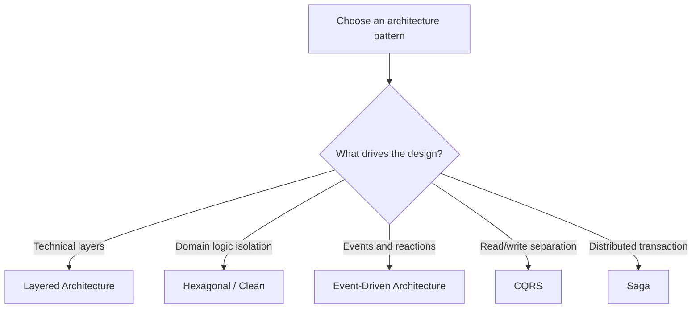
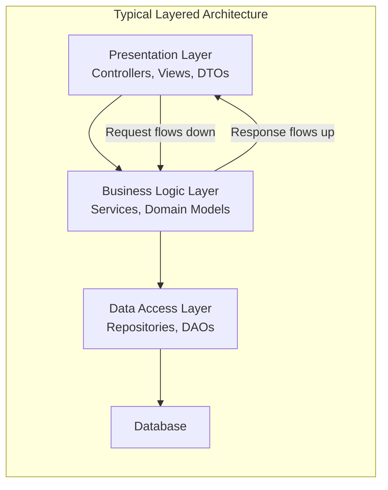
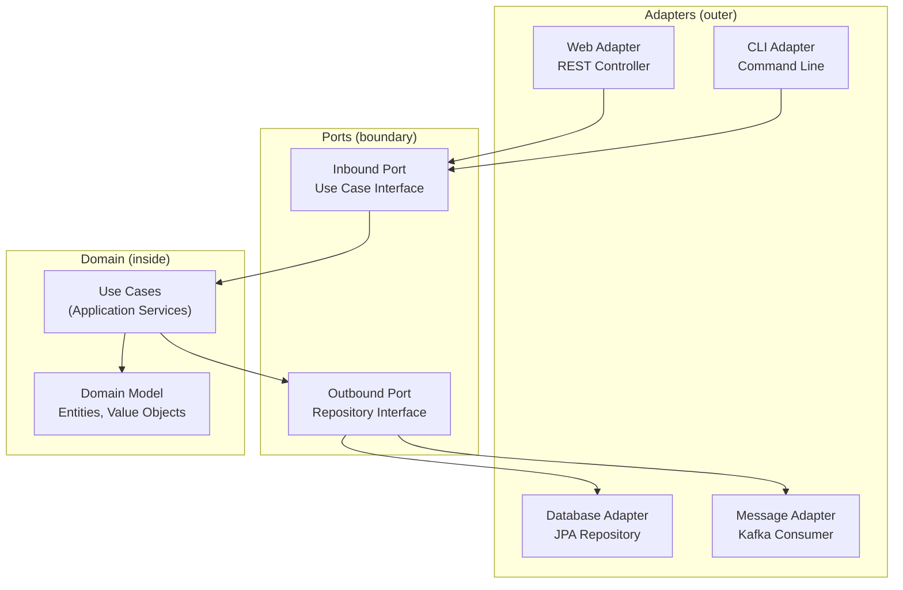
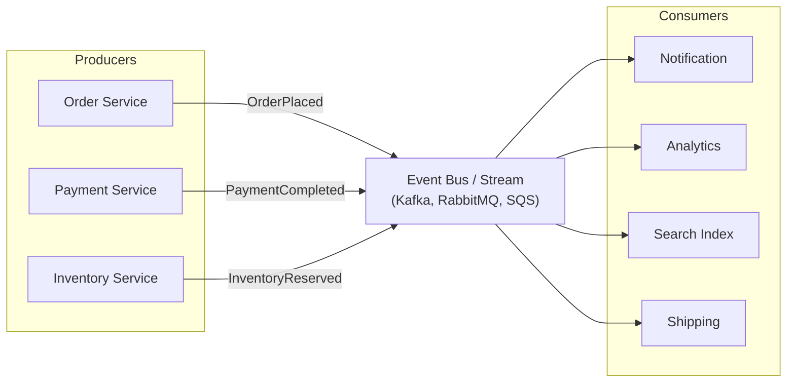
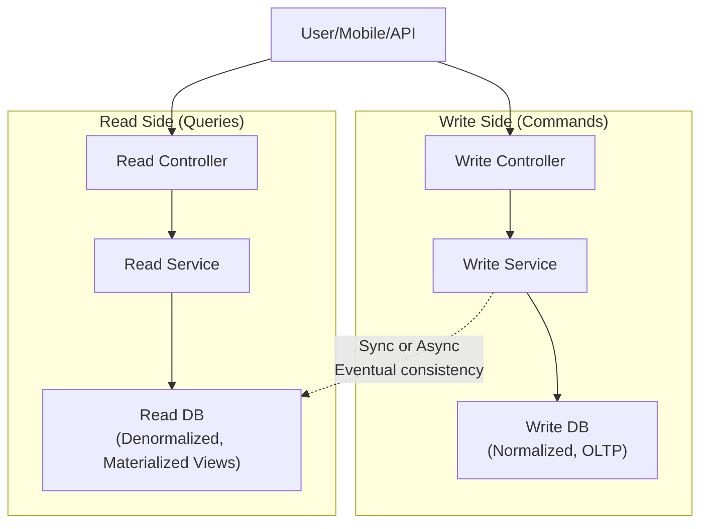
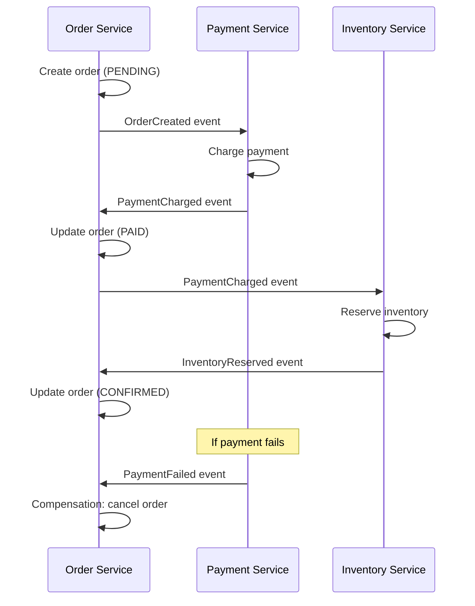
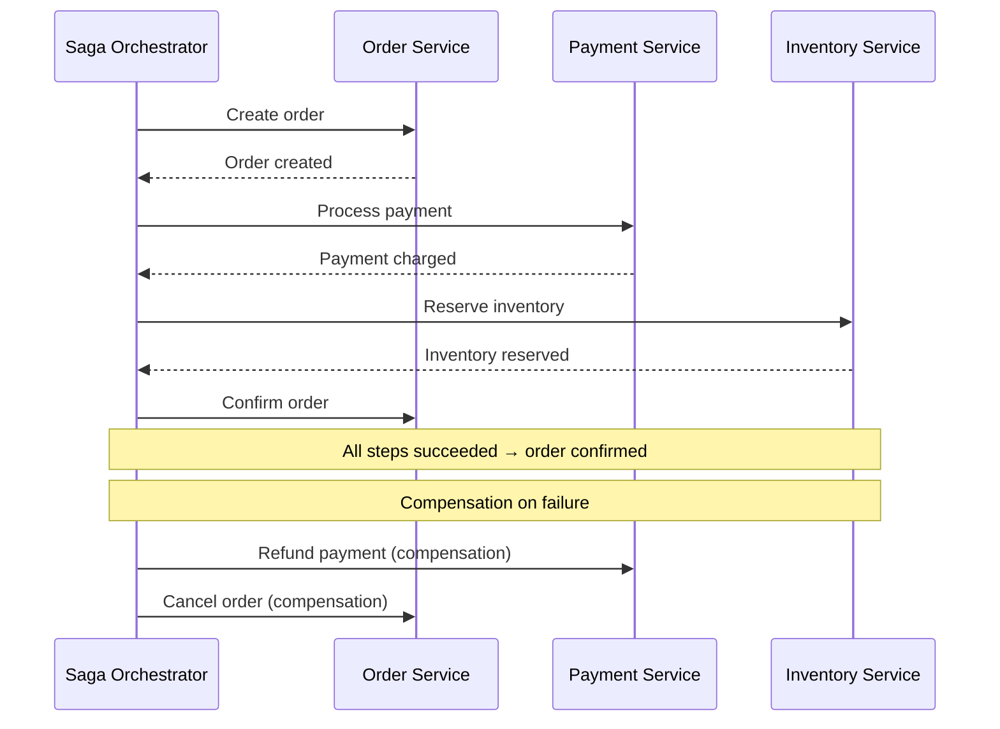
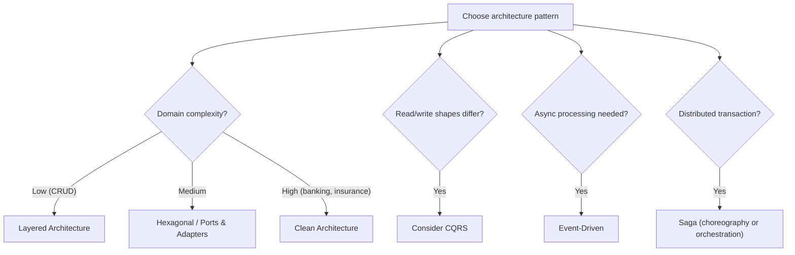

# Architecture Patterns

> [!summary] Goal
> Choose the right internal architecture for your service — from layered to hexagonal to event-driven. Understand CQRS, Saga, and migration patterns like the Strangler Fig.

## Table of Contents

1. [Architecture Pattern Comparison](#architecture-pattern-comparison)
2. [Layered Architecture](#layered-architecture)
3. [Hexagonal (Ports and Adapters)](#hexagonal)
4. [Event-Driven Architecture](#event-driven-architecture)
5. [CQRS](#cqrs)
6. [Saga Pattern](#saga-pattern)
7. [Decision Tree](#decision-tree)
8. [Pitfalls](#pitfalls)

---

## Architecture Pattern Comparison



| Pattern | Separation of concerns | Testability | Complexity | When to use |
|---------|:---------------------:|:-----------:|:----------:|-------------|
| **Layered** | Medium | Medium | Low | Simple CRUD apps, first iteration |
| **Hexagonal** | High | High | Medium | Domain-heavy apps, business logic focus |
| **Clean Architecture** | High | High | High | Complex domains (enterprise, banking) |
| **Event-Driven** | Medium | Medium | High | Reactive systems, microservices |
| **CQRS** | High (read/write) | High | High | High read/write disparity |

---

## Layered Architecture



| Layer | Responsibility | Technology examples |
|-------|---------------|-------------------|
| **Presentation** | HTTP handling, input validation, response formatting | Spring Controllers, Express routes |
| **Business** | Domain logic, workflows, rules | Spring Services, domain classes |
| **Data Access** | Database interactions, queries | JPA Repositories, JDBC, MyBatis |
| **Database** | Data persistence | PostgreSQL, MySQL, MongoDB |

### When layered works

```text
✅ Good for:
  - Simple CRUD applications
  - Prototypes and MVPs
  - Teams familiar with the pattern

❌ Problems at scale:
  - Business logic leaks into controllers ("fat controllers")
  - Database concerns leak into services (transaction management everywhere)
  - Hard to test business logic without database
  - Layer dependencies are rigid
```

---

## Hexagonal (Ports and Adapters)



| Concept | Description | Example |
|---------|-------------|---------|
| **Inbound Port** | Interface for driving operations into the app | `CreateOrderUseCase` |
| **Outbound Port** | Interface for driven operations (persistence, messaging) | `OrderRepository` |
| **Adapter** | Implementation of a port — framework-specific | `OrderController` (web), `JpaOrderRepository` (DB) |
| **Domain** | Pure business logic — no framework dependencies | `Order`, `Money`, `OrderStatus` |

### Hexagonal vs Layered

```text
Layered:     Controller → Service → Repository → DB
             (concrete classes depend on concrete classes)

Hexagonal:   Controller(Adapter) → OrderService(Port) ← JpaRepository(Adapter)
             (all dependencies point inward toward domain)
             (framework code is outside, domain code is pure)

Key difference:
  In hexagonal architecture, you can swap the web framework, database, or 
  message broker without changing a single line of domain code.
```

---

## Event-Driven Architecture



| Aspect | Event-Driven | Request-Driven |
|--------|:------------:|:--------------:|
| **Coupling** | Loose (via events) | Tight (direct API calls) |
| **Availability** | High (broker buffers) | Lower (caller depends on callee) |
| **Consistency** | Eventual | Strong (if synchronous) |
| **Debugging** | Hard (follow event chain) | Easier (step through request) |
| **Testing** | Complex (eventual, async) | Simpler (synchronous) |
| **Scalability** | High (independent consumers) | Limited (blocking calls) |

### Event types

| Event type | Semantics | Example |
|-----------|-----------|---------|
| **Event notification** | "Something happened" (no payload) | `OrderShipped` — consumer may or may not act |
| **Event-carried state transfer** | "Something happened, here's the data" | `OrderPlaced{orderId, userId, total}` — consumer has enough info |
| **Command** | "Do this thing" (expects result) | `ChargeCreditCard` — sent directly to a specific service |
| **Document** | Full data snapshot | `OrderDocument{... full order ...}` — anti-corruption layer |

---

## CQRS

Command Query Responsibility Segregation separates read and write models:



| Aspect | Command (Write) | Query (Read) |
|--------|:---------------:|:-------------:|
| **Model** | Domain model (normalized) | Projection model (denormalized) |
| **Operation** | Create, Update, Delete | Read, Search, Aggregate |
| **Consistency** | Strong (within the command) | Eventual (projection may lag) |
| **Optimized for** | Data integrity, validation | Fast reads, complex queries |
| **Scale** | Write-optimized sharding | Read-optimized sharding, replicas |

### When to use CQRS

```text
✅ Good fit:
  - Read and write workloads have different shapes (e.g., write 1 record, read complex aggregations)
  - Read model needs a different schema than write model
  - You need independent scaling of reads vs writes

❌ Overkill:
  - Simple CRUD (one model is fine)
  - Write operations are also simple reads
  - Team is not familiar with eventual consistency complexities
```

---

## Saga Pattern

Manages a distributed transaction across multiple services without 2PC:

### Choreography (event-based)



### Orchestration (command-based)



| Aspect | Choreography | Orchestration |
|--------|:------------:|:-------------:|
| **Coordination** | Decentralized (events) | Centralized (orchestrator) |
| **Service coupling** | Loose (knows about events) | Tighter (orchestrator knows all) |
| **Failure handling** | Complex (track event chains) | Simple (orchestrator knows state) |
| **Visibility** | Low (events scattered) | High (orchestrator has full view) |
| **When to use** | Simple workflows, <5 steps | Complex workflows, >5 steps |

---

## Decision Tree



---

## Pitfalls

### Layered architecture turning into "big ball of mud"

Without discipline, layers erode. Controllers call repositories directly. Business logic lives in SQL queries. Separation of concerns requires constant vigilance — enforce dependency rules with architecture tests.

### Over-engineering with hexagonal architecture

A TODO app does not need ports and adapters. Hexagonal architecture adds abstraction that pays off only when the domain is complex enough to justify it. Start layered, evolve to hexagonal when you need to swap infrastructure.

### Event-driven debugging nightmares

An event chain that spans 10 services is hard to trace. Without a saga log or event store, figuring out why an order failed requires searching across multiple services' logs. Always correlate events with a saga ID or correlation ID.

### CQRS without eventual consistency understanding

Reading stale data from the read model confuses users and requires careful UX ("your changes will appear shortly"). If the business requires strong consistency, CQRS may not be the right pattern.

### Saga without compensating transactions

Every saga step must have a compensating action if the saga fails. Forgetting compensations means partial updates that can't be undone — leading to data corruption.

---

> [!question]- Interview Questions
>
> **Q: What is the difference between layered and hexagonal architecture?**
> A: Layered architecture organizes code by technical function (controllers, services, repositories). Dependencies flow top-down. Hexagonal architecture organizes code by domain vs infrastructure. Business logic is at the center with ports (interfaces), and adapters (implementations) plug in from outside. Hexagonal makes the domain testable without frameworks.
>
> **Q: What is CQRS and when should you use it?**
> A: CQRS separates read and write models into different data structures. Use when reads and writes have fundamentally different shapes (e.g., write a single record but read complex aggregations) or need independent scaling. Don't use for simple CRUD — the complexity isn't justified.
>
> **Q: What is the difference between saga choreography and orchestration?**
> A: Choreography: services react to events and emit events. Decentralized, simpler for <5 steps, but hard to track overall workflow. Orchestration: a central orchestrator tells each service what to do. More centralized, easier to manage failures and compensate, but adds a coordination dependency.
>
> **Q: What is the Strangler Fig pattern?**
> A: Incrementally replace a monolith by intercepting traffic at the reverse proxy layer. Route specific URL patterns to new services while keeping the rest on the monolith. Extract services one at a time until nothing is left of the monolith. Named after the fig tree that grows around and eventually replaces its host tree.
>
> **Q: How do you handle failure in an event-driven system?**
> A: Use dead letter queues for failed events, track saga IDs for multi-step workflows, implement compensating events for rollbacks, and monitor event processing lag. Each event should be idempotent — the same event can be safely replayed. Log event processing outcomes for debugging.

---

## Cross-Links

- [[SystemDesign/02_Core/06_Microservice_Architecture]] for microservice decomposition and service mesh
- [[SystemDesign/02_Core/03_Queues_and_Event_Driven_Architecture]] for message brokers and Kafka
- [[SystemDesign/03_Advanced/05_Distributed_Transactions_and_Consensus]] for sagas vs 2PC
- [[SystemDesign/01_Foundations/04_APIs_Idempotency_and_Retries]] for idempotent event handling
- [[SpringBoot/02_Core/02_Transactions_and_Propagation]] for Spring saga and transaction support
