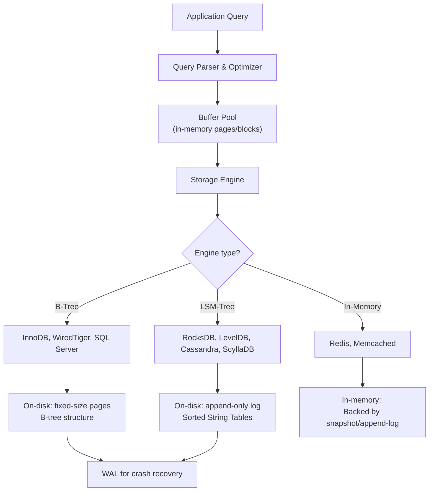
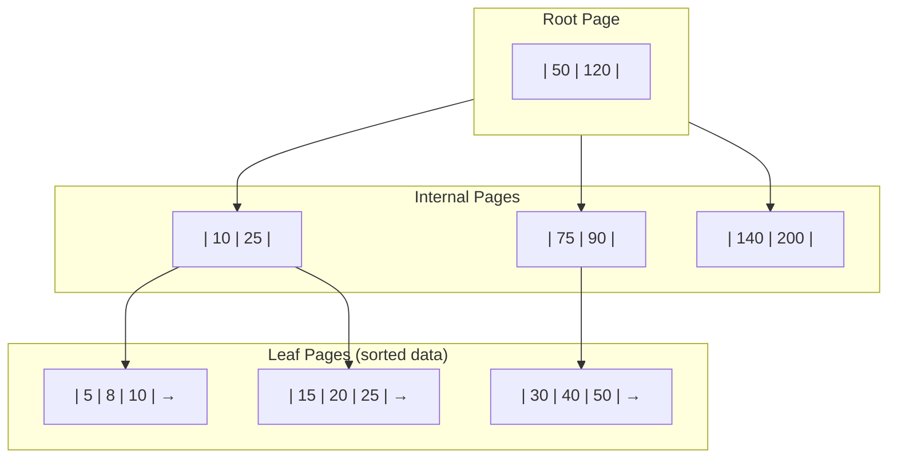
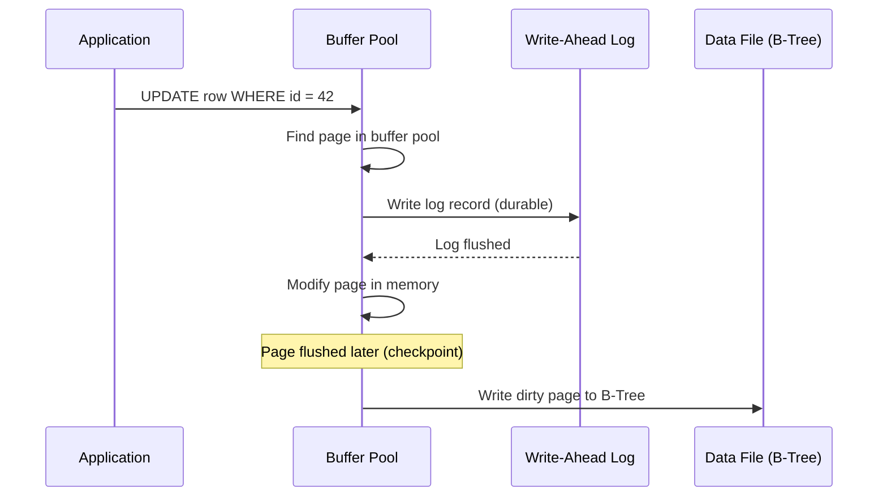
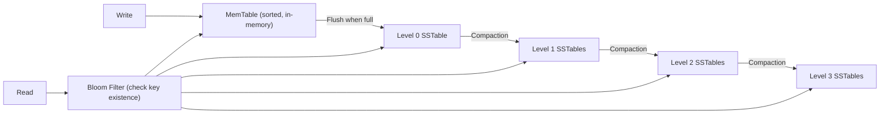
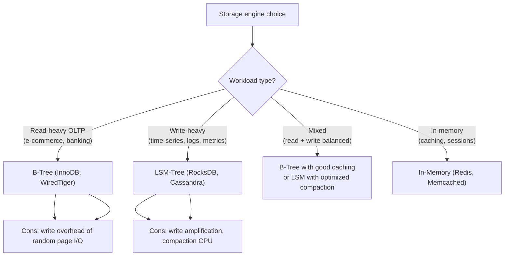
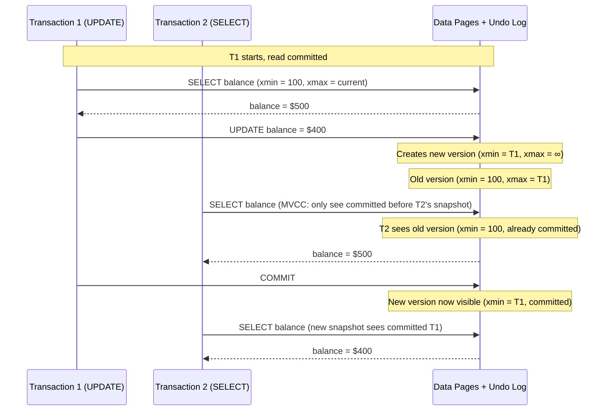
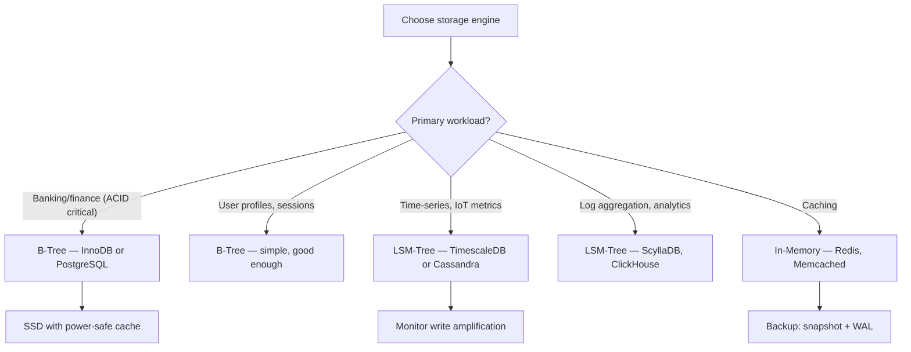

# Database Storage Internals

> [!summary] Goal
> Understand how databases store and retrieve data internally — B-trees, LSM-trees, WAL, MVCC, and how storage engine choice affects read/write performance and write amplification.

## Table of Contents

1. [Storage Engine Architecture](#storage-engine-architecture)
2. [B-Tree](#b-tree)
3. [LSM-Tree](#lsm-tree)
4. [B-Tree vs LSM-Tree Comparison](#b-tree-vs-lsm-tree-comparison)
5. [Write-Ahead Log (WAL)](#write-ahead-log)
6. [MVCC (Multi-Version Concurrency Control)](#mvcc)
7. [Decision Tree](#decision-tree)
8. [Pitfalls](#pitfalls)

---

## Storage Engine Architecture



---

## B-Tree



### B-Tree properties

```text
B-Tree of order m:
  - Every node has at most m children
  - Every node (except root) has at least ceil(m/2) children
  - Root has at least 2 children (unless leaf)
  - All leaves at same depth
  - Keys sorted within each node

For InnoDB:
  - Page size: 16KB (default)
  - Order ~ 15000 (fits many keys per page)
  - Height for 100M rows: ~3-4 levels
  - Lookup cost: O(log n) per level = 3-4 page fetches
```

### Write path



---

## LSM-Tree

Log-Structured Merge Tree optimizes for writes by batching them in memory first:



### LSM-Tree components

| Component | Description | Why |
|-----------|-------------|-----|
| **MemTable** | In-memory sorted structure (skip list or tree) | Absorbs writes at memory speed |
| **SSTable** | Sorted String Table — immutable on-disk file | Sequential write = fast |
| **Bloom Filter** | Probabilistic data structure | Quickly skip SSTables that don't contain the key |
| **Compaction** | Merge multiple SSTables into one | Remove deleted/overwritten entries, keep read efficient |
| **WAL** | Append-only log on disk | Recover MemTable on crash |

### Read path

```text
Read(key):
  1. Check MemTable (in memory) — fastest
  2. Check immutable MemTable (being flushed)
  3. Check L0 SSTables (may need to check many)
  4. Check L1, L2, ... Ln SSTables (bloom filter helps skip)

Worst case: read is slower than B-Tree because it must check multiple levels.
  — Mitigated by: bloom filters, caching, compaction

Read Amplification = number of SSTables checked per read
Write Amplification = bytes written / bytes ingested (compaction overhead)
```

---

## B-Tree vs LSM-Tree Comparison

| Aspect | B-Tree | LSM-Tree |
|--------|:-----:|:--------:|
| **Read latency (point lookup)** | O(log n) — fast (≤4 levels) | O(n) worst — multiple SSTable checks (bloom filters help) |
| **Read latency (range scan)** | Fast (leaf pages linked) | Slower (merge across levels) |
| **Write throughput** | Lower (random page writes) | Higher (sequential SSTable writes) |
| **Write amplification** | Low (~5-10×) | High (~10-50× depending on compaction) |
| **Space amplification** | Low (no duplicate data) | Higher (temporary duplicates before compaction) |
| **Cache efficiency** | Good (fixed page size) | Bloom filters + block cache |
| **Concurrent writes** | Page-level locking | Lock-free memtable (once per flush) |
| **Compaction** | None (in-place updates) | Background (can throttle writes) |
| **Use cases** | Read-heavy, OLTP, strong consistency | Write-heavy, time-series, Cassandra |

### Write amplification comparison

```text
B-Tree (InnoDB):
  - 1 row update = 1 WAL write + 1 page write (16KB) + eventual checkpoint
  - Write amplification: ~5-10× (small rows, big pages)

LSM-Tree (RocksDB):
  - 1 row write = 1 WAL write + 1 memtable append + compaction overhead
  - Write amplification: ~10-50× (each row moves through multiple compaction levels)
  - Tunable: larger levels = lower WA, higher read cost

Why LSM write amplification matters:
  100 MB/s write traffic at 30× WA = 3 GB/s actual disk I/O
  Can saturate SSD write bandwidth on heavy write workloads
```

### Storage engine selection



---

## Write-Ahead Log (WAL)

The WAL ensures durability — every write is logged before the data page is modified:

```text
Write protocol:
  1. Append log record to WAL (disk fsync)
  2. Modify buffer pool page (no disk yet)
  3. Acknowledge write to client
  4. Later: checkpoint (flush dirty pages to disk)

Recovery:
  1. Read last checkpoint
  2. Replay WAL from checkpoint → redo committed transactions
  3. Undo uncommitted transactions

WAL configuration (PostgreSQL):
  wal_level = minimal | replica | logical
  synchronous_commit = on | off | remote_write | remote_apply
  fsync = on | off
  commit_delay = 0 (microseconds)
```

### WAL vs doublewrite buffer

```text
WAL:        Sequential log of changes (smaller, sequential I/O)
            Used for crash recovery + point-in-time recovery

Doublewrite: Write same page twice (to doublewrite buffer, then to data file)
             Used by InnoDB to prevent partial page writes
             (MySQL InnoDB uses both: WAL for transactions, doublewrite for page safety)
```

---

## MVCC (Multi-Version Concurrency Control)

MVCC allows concurrent reads and writes without blocking:



```text
MVCC key concepts:
  xmin: transaction that created this row version
  xmax: transaction that deleted/updated this row version (or ∞ if active)
  Dead tuple: row version that no longer needed (no active snapshot can see it)
  
  PostgreSQL: dead tuples cleaned by VACUUM
  InnoDB: history list cleaned by purge thread
  
  Snapshot isolation: each transaction sees a point-in-time snapshot
  Conflicts: detected on write-write (first updater wins)
```

---

## Decision Tree



---

## Pitfalls

### Write amplification saturating SSDs

LSM-tree compaction writes 10-50× more data than the application writes. On a heavy write workload (100 MB/s ingested), this can consume 1-5 GB/s of SSD write bandwidth, wearing out the SSD prematurely. Monitor compaction throughput and tune level sizes.

### B-Tree page fragmentation

Random updates and deletes fragment B-Tree pages, wasting space and slowing range scans. PostgreSQL `VACUUM`, InnoDB `OPTIMIZE TABLE`, and rebuilding indexes periodically. Set fill factor to 70-80% for tables with many updates.

### Choosing LSM-tree for read-heavy workloads

LSM-trees optimize for writes at the expense of reads. A read-heavy workload will pay the cost of checking multiple SSTable levels for every read. Add bloom filters, increase block cache, and consider B-Tree for read-dominated workloads.

### Not monitoring checkpoint frequency

In both B-tree and LSM engines, infrequent checkpoints cause long recovery times on crash. Too-frequent checkpoints cause write amplification from constant flushing. Monitor checkpoint frequency and tune for your workload's balance.

### Ignoring the compaction debt problem

If writes exceed compaction throughput, compaction falls behind. SSTable levels grow, read latency increases, and space amplification climbs. Cassandra and RocksDB have backpressure mechanisms — monitor `pending_compaction` and alert when it grows.

---

> [!question]- Interview Questions
>
> **Q: What is the difference between a B-tree and an LSM-tree?**
> A: B-tree organizes data in fixed-size pages, updated in-place. Reads are fast (O(log n) levels), writes involve random page I/O. LSM-tree buffers writes in memory (memtable), flushes to immutable SSTables, and periodically compacts them. Writes are sequential (fast), reads may need to check multiple SSTables (slower unless bloom filters help).
>
> **Q: Why does an LSM-tree have write amplification?**
> A: Each row written goes through multiple compaction levels. A row first written to L0 may be rewritten in L1, L2, L3 compactions. With typical settings, each byte ingested results in 10-50 bytes of actual disk writes. The tradeoff: sequential writes (fast) for higher total I/O.
>
> **Q: What is the purpose of the Write-Ahead Log?**
> A: The WAL ensures durability without flushing data pages on every write. The protocol: (1) append to WAL and fsync, (2) modify buffer pool (in memory), (3) acknowledge write. On crash, replay the WAL to restore committed transactions. WAL writes are sequential (fast), unlike random page writes.
>
> **Q: How does MVCC work in PostgreSQL?**
> A: Each row version stores xmin (creating transaction) and xmax (deleting/updating transaction). A transaction sees row versions where xmin is committed and xmax is either ∞ or from a transaction that started after the snapshot. Updated rows create a new version; old versions are "dead tuples" cleaned by VACUUM.
>
> **Q: When would you choose RocksDB over InnoDB?**
> A: Choose RocksDB (LSM-tree) for write-heavy workloads: time-series data, IoT, event logs, message queues, metrics ingestion. Choose InnoDB (B-tree) for read-heavy OLTP: user accounts, orders, inventory — workloads where predictable read latency and strong consistency matter more than write throughput.

---

## Cross-Links

- [[SQL/02_Core/01_Indexes_Basics_and_BTree]] for PostgreSQL B-tree index deep dive
- [[SQL/03_Advanced/01_VACUUM_Autovacuum_and_Bloat]] for MVCC cleanup and bloat management
- [[SQL/03_Advanced/03_Replication_and_Backups]] for WAL shipping and PITR
- [[SystemDesign/02_Core/04_Consistency_Replication_and_Consensus]] for replication with WAL
- [[SystemDesign/01_Foundations/03_Data_Modeling_Basics]] for schema design and indexing strategies
