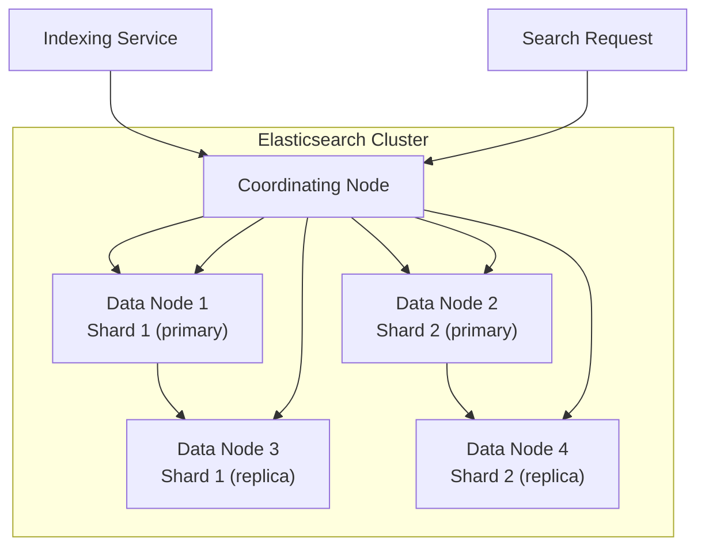
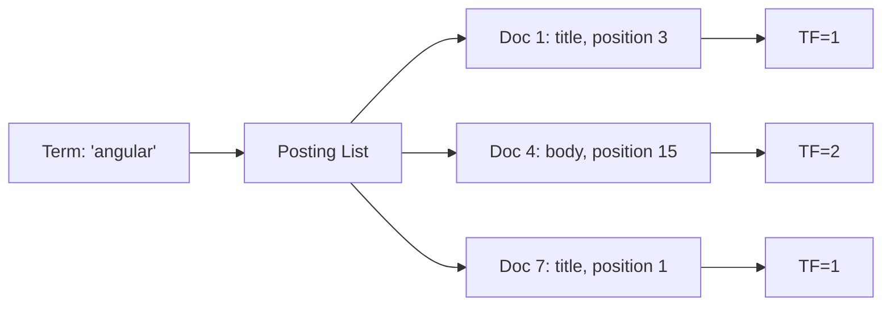
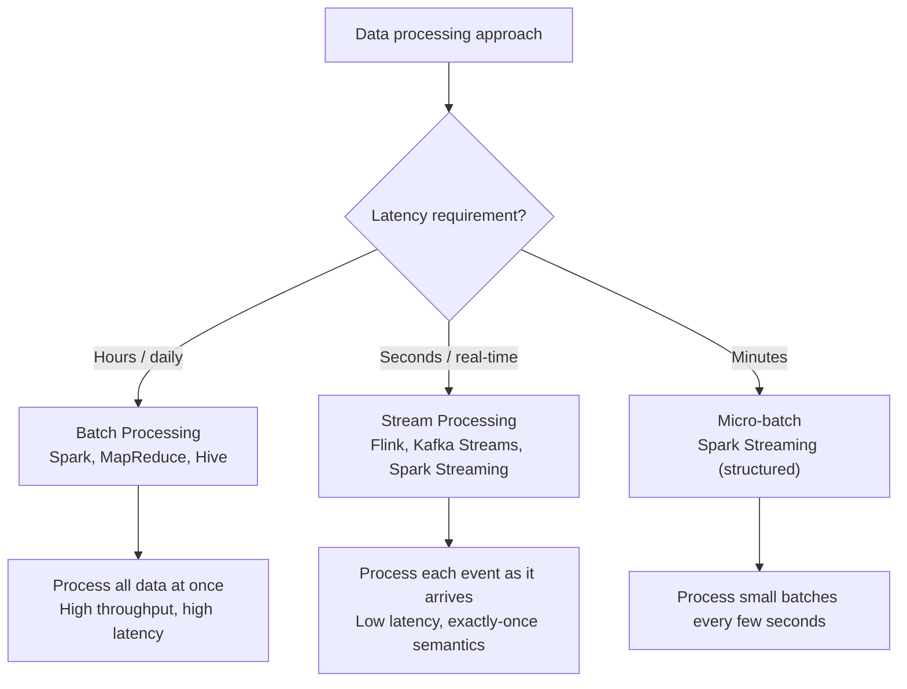
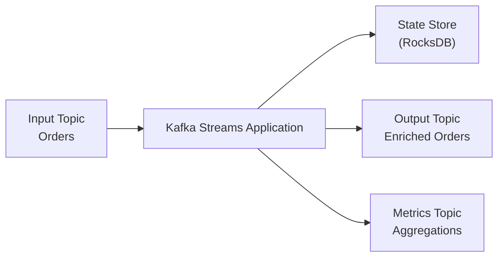
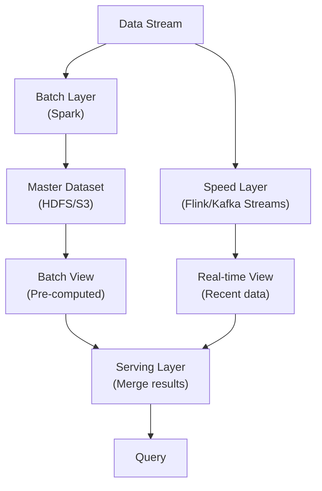
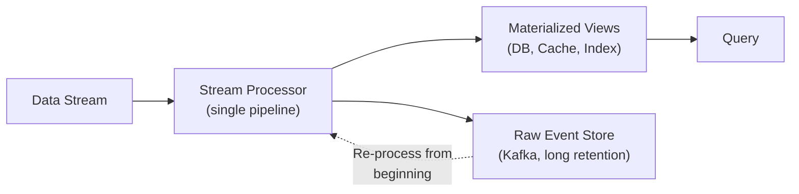
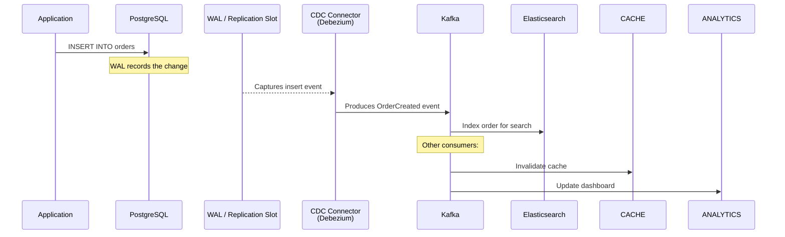
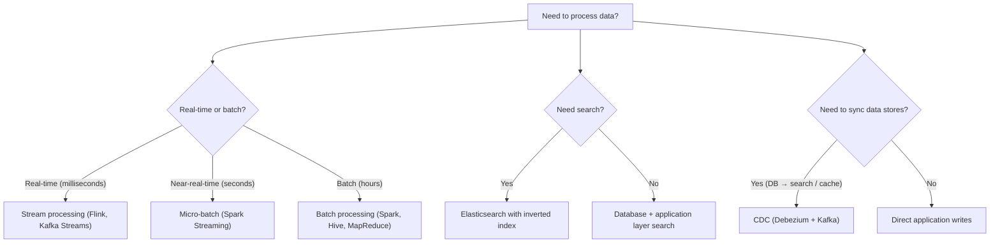

# Search and Stream Processing

> [!summary] Goal
> Build search systems with Elasticsearch and process real-time data streams with Kafka Streams, Flink, and change data capture. Understand when to use batch vs stream processing.

## Table of Contents

1. [Search Systems — Elasticsearch](#search-systems-elasticsearch)
2. [Batch vs Stream Processing](#batch-vs-stream-processing)
3. [Stream Processing Frameworks](#stream-processing-frameworks)
4. [Lambda and Kappa Architectures](#lambda-and-kappa-architectures)
5. [Change Data Capture (CDC)](#change-data-capture)
6. [Decision Tree](#decision-tree)
7. [Pitfalls](#pitfalls)

---

## Search Systems — Elasticsearch



### Inverted index

| Term | Documents |
|------|-----------|
| `angular` | doc1, doc4, doc7 |
| `elasticsearch` | doc2, doc5 |
| `search` | doc1, doc2, doc3, doc6 |
| `database` | doc3, doc4, doc8 |
| `stream` | doc5, doc6, doc9, doc10 |



### Relevance scoring (BM25)

```text
BM25 score = sum over matching terms of:
  IDF × (TF × (k1 + 1)) / (TF + k1 × (1 - b + b × (docLength / avgDocLength)))

Where:
  IDF = inverse document frequency (rare terms matter more)
  TF = term frequency in the document
  k1 = saturation parameter (default 1.2)
  b = length normalization factor (default 0.75)

Simplified: a document scores higher when:
  - It contains rare matching terms (high IDF)
  - The matching term appears multiple times (TF)
  - The document is not unnecessarily long (length normalization)
```

### Search architecture patterns

| Pattern | Description | Use case |
|---------|-------------|----------|
| **Write-side indexing** | Index documents as they are created/updated | Real-time search (web, e-commerce) |
| **Batch indexing** | Periodically rebuild index from source of truth | Catalog search, nightly rebuilds |
| **Follower / CDC index** | Sync index from DB via change data capture | Avoid dual-write consistency issues |
| **Cross-cluster search** | Query multiple ES clusters from a single API | Multi-region, tenant isolation |

---

## Batch vs Stream Processing



| Aspect | Batch | Stream | Micro-batch |
|--------|:-----:|:------:|:-----------:|
| **Latency** | Hours | Milliseconds | Seconds |
| **Throughput** | Highest | High | High |
| **Exactly-once** | Easy (at rest) | Complex (in-flight) | Medium |
| **Error handling** | Easy (re-run batch) | Complex (handle out-of-order) | Medium |
| **State management** | External (file, DB) | Internal (state store) | Internal |
| **Use case** | Daily reports, ETL | Fraud detection, real-time dashboards | Near-real-time analytics |

---

## Stream Processing Frameworks

### Kafka Streams



| Feature | Kafka Streams | Apache Flink | Spark Streaming |
|---------|:-------------:|:------------:|:---------------:|
| **Processing model** | Stream (record-at-a-time) | Stream (event-at-a-time) | Micro-batch |
| **State management** | RocksDB (local), changelog topics | Managed state (RocksDB, FSB) | External (checkpoints) |
| **Exactly-once** | ✅ (transactional producer) | ✅ (checkpointing) | ✅ (WAL-based) |
| **Event time** | Via timestamp extractor | ✅ Built-in watermark | ✅ With watermark |
| **SQL support** | KSQL | Flink SQL | Spark SQL |
| **Deployment** | Embedded (any app) | Cluster (JobManager + TaskManagers) | Cluster (Spark driver + executors) |

### Streaming operations

```text
Stateless operations:
  map, filter, flatMap — process each event independently

Stateful operations:
  aggregate, reduce, count — maintain state across events
  join — combine two or more streams
  window — group events by time (tumbling, sliding, session)

Watermarks:
  Track how far event time has progressed
  Allow handling of late-arriving events
  "If watermark > window_end, close window and emit result"
```

---

## Lambda and Kappa Architectures

### Lambda Architecture



| Aspect | Batch Layer | Speed Layer | Serving Layer |
|--------|:-----------:|:-----------:|:-------------:|
| **Latency** | Hours | Minutes/Seconds | Instant |
| **Computation** | Re-process all data | Incremental | Merge + serve |
| **Correctness** | Perfect (full data) | Approximate (recent only) | Best effort |
| **Storage** | Raw data (S3/HDFS) | Incremental results | Pre-computed views |

### Kappa Architecture



> [!tip] Kappa simplifies Lambda by using a single stream processing pipeline for both real-time and historical computation. Store raw events in Kafka (with long retention) instead of a separate batch storage. When you need to recalculate, consume the stream from the beginning.

---

## Change Data Capture (CDC)

CDC captures database changes as a stream of events, enabling real-time data synchronization without dual-writes:



| CDC tool | Source databases | Output format | Use case |
|----------|----------------|---------------|----------|
| **Debezium** | MySQL, Postgres, MongoDB, SQL Server, Oracle | Kafka Connect | Database → stream → search/cache/analytics |
| **AWS DMS** | Multiple | S3, Kinesis, Kafka | Database migration + continuous replication |
| **PeerDB** | PostgreSQL | Kafka, S3 | Postgres-specific CDC, fast |
| **Kafka Connect JDBC** | Any with JDBC | Kafka | Polling-based (not true CDC) |

### Why CDC instead of dual-write?

```text
Dual-write problem:
  Application writes to both DB and Elasticsearch.
  If ES write fails, DB write already committed → inconsistent.

CDC solution:
  Application writes to DB only.
  CDC reads the WAL asynchronously and syncs to ES.
  DB is always the source of truth.
  ES eventually consistent, but never out-of-sync from failed dual-writes.
```

---

## Decision Tree



---

## Pitfalls

### Elasticsearch mapping explosion

Dynamically adding fields to an index creates a mapping update that can crash the cluster. For user-generated data, use `"dynamic": false` or `"dynamic": "strict"`. Monitor mapping size — too many fields degrades cluster performance.

### Not planning for compaction in stream processing

Stateful stream processing (aggregations, joins) maintains state in RocksDB. Without compaction, state grows unbounded. Configure idle state TTL, watermarking, and compaction. Monitor state store size.

### Lambda architecture complexity

Running two separate pipelines (batch + stream) that must produce the same result is operationally expensive. Prefer Kappa architecture: a single stream processing pipeline that can reprocess from the beginning. Use Kafka with long retention for the raw event store.

### CDC lag under high write volume

CDC reads changes from the WAL. If the database write rate exceeds the CDC consumer rate, replication lag grows. Monitor the lag (e.g., `pg_current_wal_lsn` for Postgres) and alert on sustained increases.

### Ignoring event ordering in stream processing

Events may arrive out of order (network delays, retries). Use event time (not processing time) for windowing. Configure allowed lateness and handle late events with side output or re-processing.

---

> [!question]- Interview Questions
>
> **Q: How does an inverted index work in Elasticsearch?**
> A: An inverted index maps each unique term to a list of document IDs where that term appears. For search, the query terms are looked up in the index, and the posting lists are intersected to find matching documents. Relevance is scored using BM25, which considers term frequency, inverse document frequency, and document length normalization.
>
> **Q: What is the difference between Lambda and Kappa architectures?**
> A: Lambda has two pipelines: a batch layer (accurate, high latency) and a speed layer (approximate, low latency), merged in the serving layer. Kappa uses a single stream processing pipeline for everything. Raw events are stored in Kafka with long retention. To recompute, re-consume from the beginning. Kappa is simpler but requires Kafka storage capacity.
>
> **Q: What is Change Data Capture and why use it?**
> A: CDC captures database changes from the WAL and streams them to Kafka. It solves the dual-write problem: instead of writing to both DB and search/cache (where one can fail), write only to the DB. CDC ensures the secondary stores (Elasticsearch, Redis) are always eventually consistent with the source of truth.
>
> **Q: When would you use Kafka Streams vs Apache Flink?**
> A: Both are stream processors but with different deployment models. Kafka Streams runs as an embedded library within your application — no separate cluster, simpler operations, tightly coupled with Kafka. Flink runs as a separate cluster with job managers and task managers — better for complex stateful processing, larger deployments, and streaming SQL. Choose Kafka Streams for simpler pipelining, Flink for heavy processing.
>
> **Q: How do you handle late-arriving events in stream processing?**
> A: Use watermarks to track event time progress. Configure a maximum allowed lateness (e.g., 5 minutes). Events within the allowed window are included; events arriving later are sent to a side output or dropped. For critical data, store late events in a separate topic for batch reprocessing.

---

## Cross-Links

- [[SystemDesign/02_Core/03_Queues_and_Event_Driven_Architecture]] for Kafka and event streaming
- [[SystemDesign/02_Core/08_Database_Storage_Internals]] for WAL and MVCC (CDC foundation)
- [[SystemDesign/02_Core/07_Architecture_Patterns]] for CQRS and event-driven patterns
- [[SystemDesign/02_Core/05_Observability_Logs_Metrics_Traces]] for monitoring stream processing
- [[CICD/Kafka/02_Core/01_Kafka_Basics_Topics_Partitions_and_Producers]] for Kafka fundamentals
