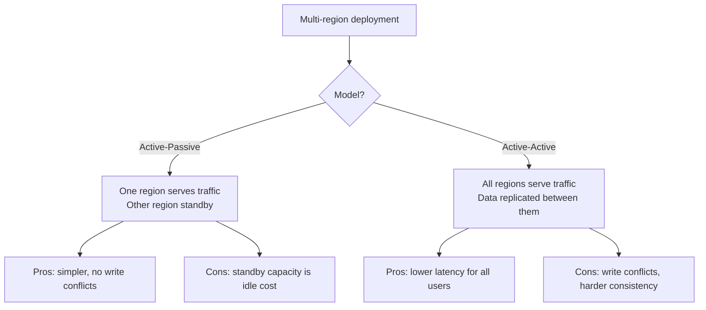
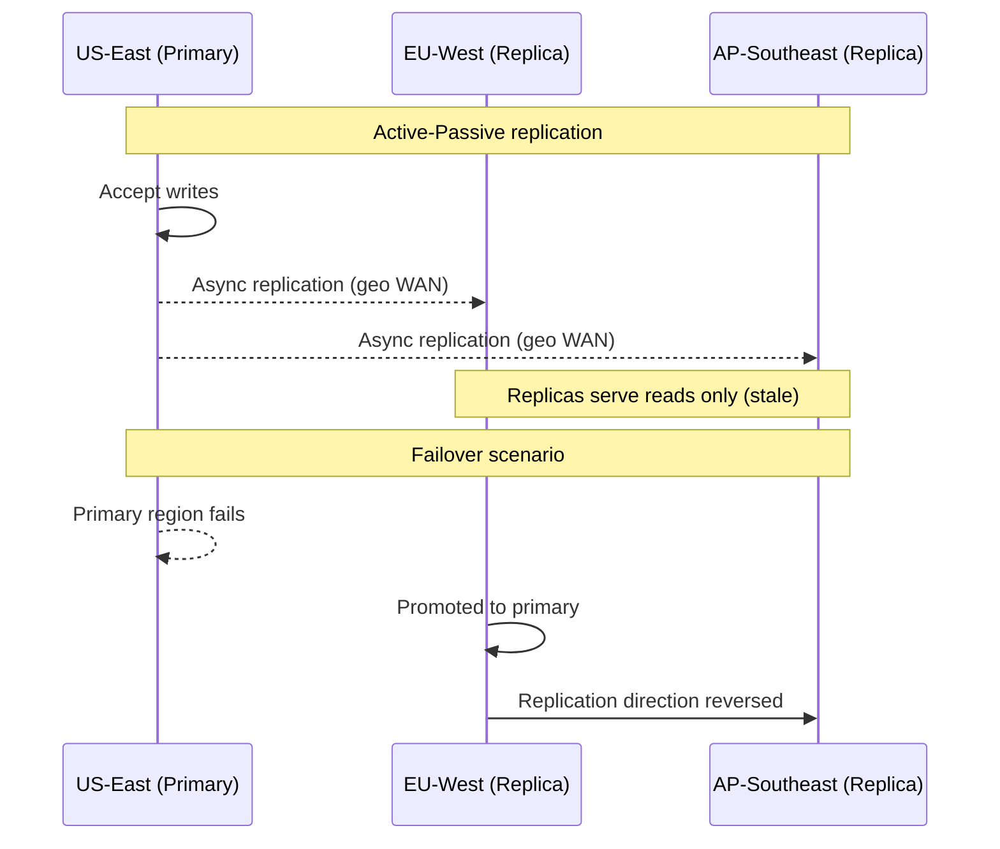
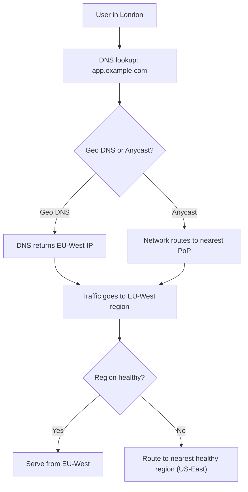
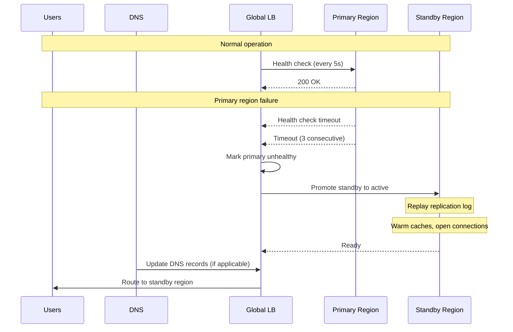

# Multi-Region Architecture

> [!summary] Goal
> Reduce blast radius and user-facing latency by deploying across multiple geographic regions. Choose between active-passive and active-active models based on consistency and availability requirements.

## Table of Contents

1. [Multi-Region Models](#multi-region-models)
2. [Cross-Region Replication](#cross-region-replication)
3. [Traffic Routing](#traffic-routing)
4. [Failover](#failover)
5. [Case Studies](#case-studies)
6. [Pitfalls](#pitfalls)

---

## Multi-Region Models



| Aspect | Active-Passive | Active-Active |
|--------|:--------------:|:-------------:|
| **Latency** | Good for primary region, poor for others | Low for all users |
| **Cost** | Standby region sits idle (pay for capacity) | All capacity utilized |
| **Failover time** | Minutes (DNS propagation + warmup) | Seconds (traffic rebalanced) |
| **Write conflicts** | None (single write leader) | Possible (conflict resolution needed) |
| **Consistency** | Strong (single leader) | Eventual or causal |
| **Operational complexity** | Lower | Higher |
| **Example** | Traditional DR setup | Netflix, Google, DynamoDB Global Tables |

---

## Cross-Region Replication



| Replication type | Latency | Data loss risk | Use case |
|-----------------|:-------:|:--------------:|----------|
| **Synchronous (same region)** | Low | None | Within-region durability |
| **Synchronous (cross-region)** | High (WAN latency) | None | Multi-region strong consistency (rare) |
| **Asynchronous (cross-region)** | Low (local write) | Possible (replication lag) | Most multi-region setups |
| **Bidirectional async** | Low (local write) | Conflict resolution needed | Active-active |

### Replication lag factors

```text
Cross-region replication lag depends on:
  - Physical distance (speed of light: 20ms US-East ↔ EU-West)
  - Network bandwidth and routing
  - Write volume (more writes = more backlog)
  - Replication mechanism (log shipping vs logical replication)

Typical values:
  US-East ↔ US-West:         ~50-80ms
  US-East ↔ EU-West:         ~80-120ms
  US-East ↔ AP-Southeast:    ~150-250ms
  EU-West ↔ AP-Southeast:    ~200-350ms
```

---

## Traffic Routing



| Routing method | How it works | Failover time | Complexity |
|---------------|-------------|:-------------:|:----------:|
| **DNS-based (Geo DNS)** | Route53, CloudDNS: return different IPs per region | Minutes (TTL + DNS cache) | Low |
| **Anycast** | Same IP advertised from multiple regions; BGP routes to nearest | Seconds (BGP convergence) | Medium |
| **Global Load Balancer** | GCP LB, AWS Global Accelerator: health-check-aware routing | Seconds (health check + reroute) | Medium |
| **Client-side routing** | App SDK picks region based on latency probes | Milliseconds | High |

---

## Failover



### Failover checklist

```text
Pre-failover:
  [ ] Automated health checks monitoring all regions
  [ ] Runbook documented and tested
  [ ] Standby region has enough capacity for full traffic
  [ ] DNS TTL set to minimum (60s or lower)
  [ ] All dependencies replicated (databases, caches, queues)

During failover:
  [ ] Verify standby region health before switching
  [ ] Update DNS or LB to point to standby
  [ ] Monitor error rates on both sides
  [ ] If primary recovers, don't auto-failback (manual only)

Post-failover:
  [ ] Replicate new data back to old primary
  [ ] Investigate root cause
  [ ] Schedule failback during maintenance window
```

---

## Case Studies

### Netflix — Active-Active (multi-region)

```text
Netflix runs in 3+ AWS regions simultaneously.

Architecture:
  - Stateless microservices (no session affinity)
  - Cassandra for data (AP, eventual consistency)
  - EVCache for cross-region caching
  - Zuul API gateway for routing
  - Chaos Monkey constantly tests failure paths

Key decisions:
  - All regions are active — no idle capacity
  - Data is eventually consistent across regions
  - User's watch history follows them (eventual)
  - Recommendations are computed per-region
  - Failover takes seconds, users don't notice
```

### Google Spanner — Strong consistency globally

```text
Google Spanner provides externally consistent reads/writes across regions.

Architecture:
  - TrueTime API (GPS + atomic clocks) for global timestamps
  - Paxos-based consensus across regions
  - Reads from any replica with bounded staleness
  - Writes go through a leader per shard (leader can be in any region)

Key decisions:
  - TrueTime enables external consistency without locking
  - Writes to distant regions have 100-300ms latency (speed of light)
  - Most applications use local replicas for reads
  - Used by: Google Ads, Google Play, YouTube
```

---

## Pitfalls

### Assuming failback is the reverse of failover

Failing back to the original primary after recovery is more complex than the initial failover. The former primary may have stale data that needs to be reconciled. Always test failback separately. Never auto-failback.

### Not testing multi-region regularly

A multi-region architecture that has never been tested in production is a false sense of security. Run game days every quarter. Netflix's Chaos Monkey operates continuously. Practice failing over during low traffic periods.

### Ignoring cross-region replication lag

Async replication means data loss during a disaster (up to minutes of writes). Set `RPO` (Recovery Point Objective) expectations accordingly. If your RPO is 1 second, you need synchronous cross-region replication or a different architecture.

### Cache stampede after failover

When traffic shifts to a cold region, caches are empty. All requests hit the database — a massive cache stampede. Pre-warm caches in the standby region before failover.

### Cost of active-active gone wrong

Running two active regions doubles infrastructure costs (compute, database, bandwidth for cross-region replication). Ensure the business benefit (lower latency, higher availability) justifies the cost.

---

> [!question]- Interview Questions
>
> **Q: What is the difference between active-passive and active-active multi-region architectures?**
> A: Active-passive has one region serving traffic with another on standby — simpler but idle capacity cost. Active-active has all regions serving traffic — better latency for all users but requires conflict resolution for writes and is operationally more complex.
>
> **Q: How does DNS-based failover work and what are its limitations?**
> A: Geo DNS returns different IP addresses per region. On failure, the DNS record is updated to point to a healthy region. Limitation: DNS caching means failover can take minutes (TTL), and clients that already resolved the IP will keep hitting the failed region until the cache expires.
>
> **Q: What is RPO and RTO in multi-region architecture?**
> A: RPO (Recovery Point Objective) is the maximum acceptable data loss in time — e.g., 5 minutes of data. RTO (Recovery Time Objective) is the maximum acceptable downtime — e.g., 1 hour to resume service. Both drive the replication strategy: async RPO is higher, sync RPO is near-zero but higher latency.
>
> **Q: How does Google Spanner achieve strong consistency across regions?**
> A: Spanner uses TrueTime (GPS + atomic clocks) to assign globally-ordered timestamps to transactions. Reads can be served from any replica at a timestamp guaranteed to reflect all completed writes. Writes go through a per-shard leader using Paxos consensus, which may be in another region.
>
> **Q: What should you do after failing over to a secondary region?**
> A: Verify all services are healthy, monitor error rates, communicate to stakeholders, investigate root cause. Do NOT auto-failback — the old primary may have stale data that needs reconciliation. Schedule failback during a maintenance window after ensuring data consistency.

---

## Cross-Links

- [[SystemDesign/02_Core/04_Consistency_Replication_and_Consensus]] for cross-region replication mechanisms
- [[SystemDesign/02_Core/02_Load_Balancers_and_Service_Discovery]] for global load balancing
- [[SystemDesign/04_Playbooks/03_MultiRegion_Readiness_Checklist]] for operational readiness
- [[SystemDesign/03_Advanced/03_Resilience_Patterns]] for circuit breakers and bulkheads
- [[SystemDesign/02_Core/01_Caching_Strategies]] for cross-region cache warming
