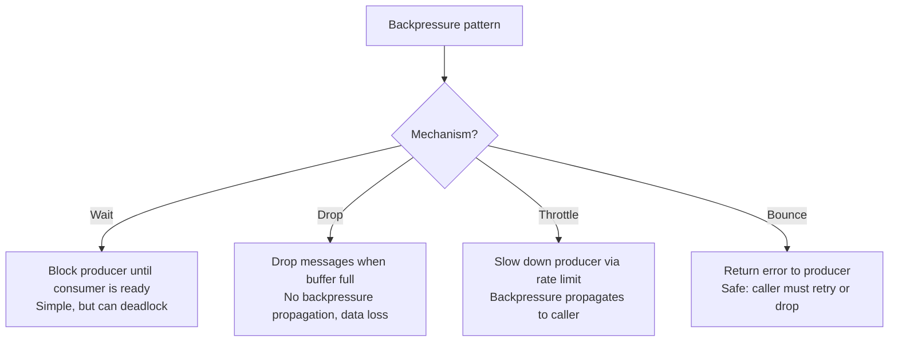
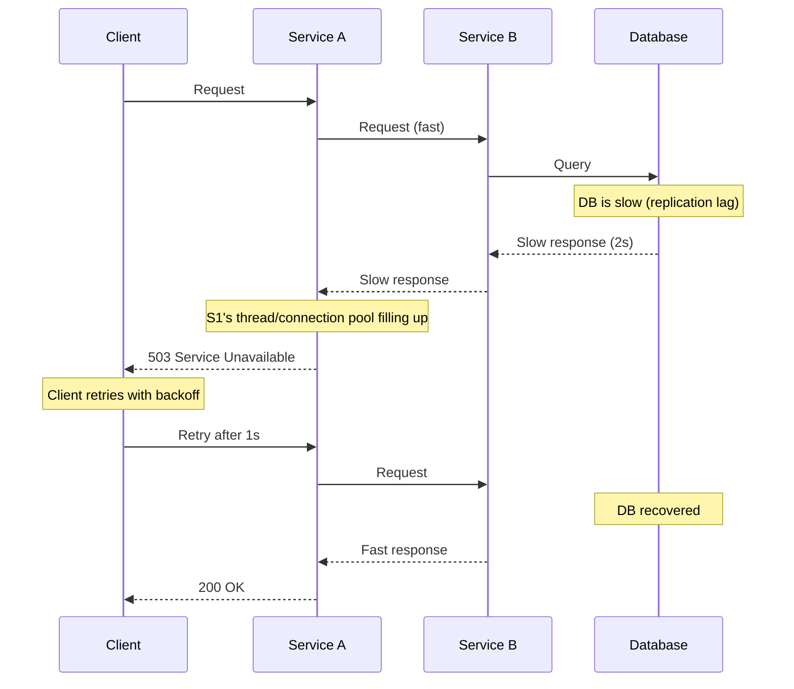
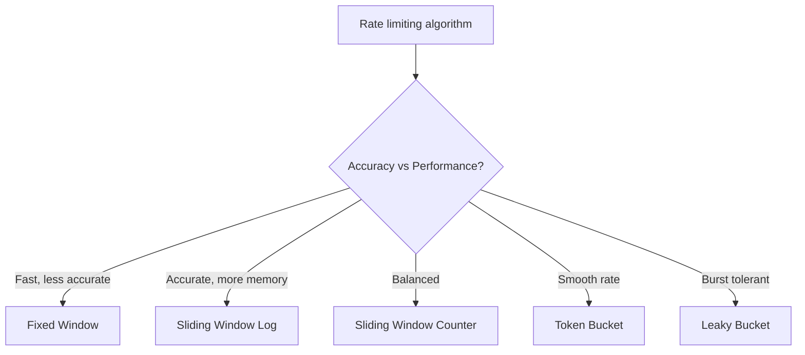
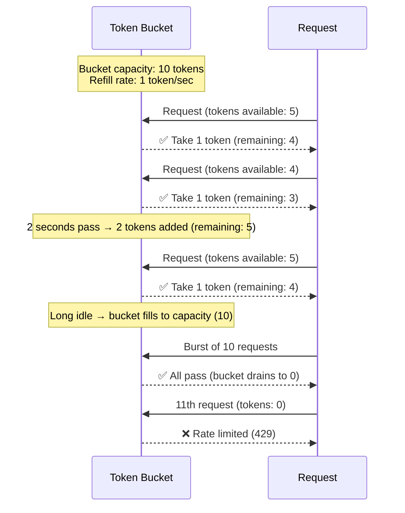
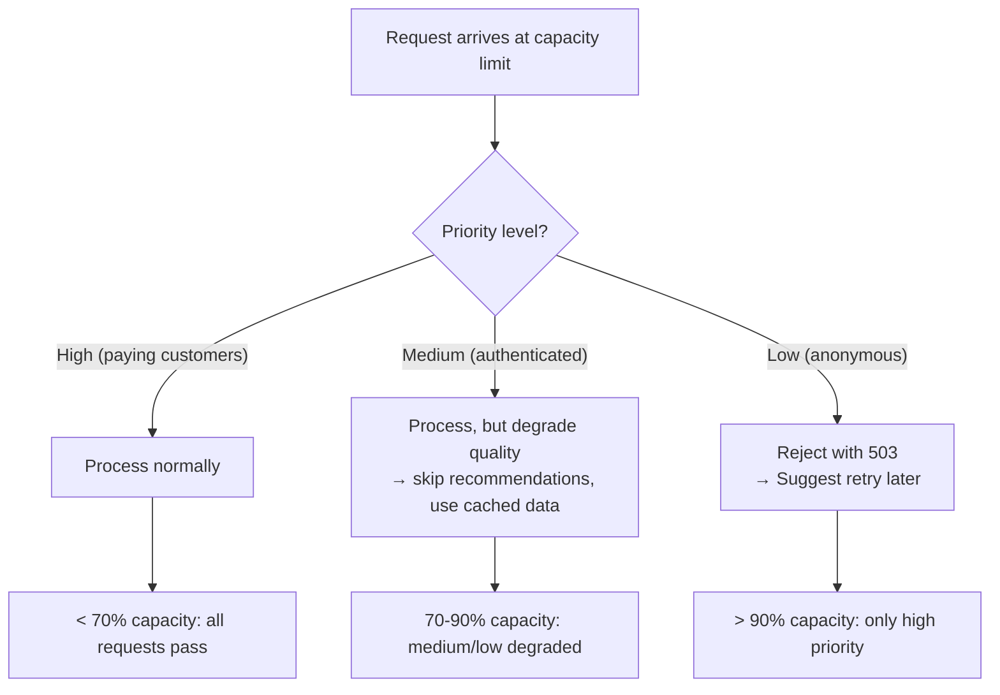
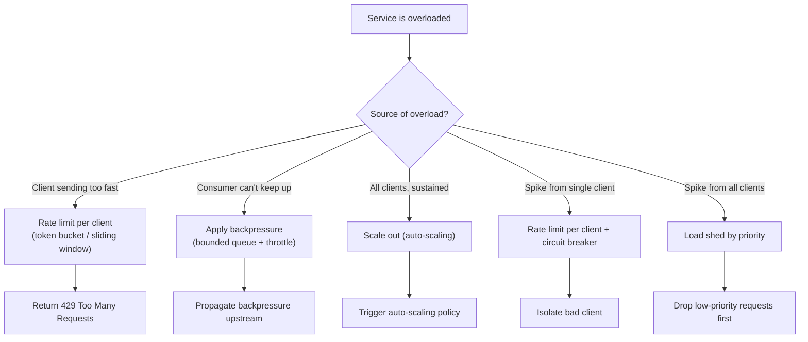

# Backpressure and Load Shedding

> [!summary] Goal
> Protect services from overload using backpressure, rate limiting, and load shedding. Distinguish between client-side backpressure, server-side rate limiting, and infrastructure-level load shedding.

## Table of Contents

1. [Backpressure Patterns](#backpressure-patterns)
2. [Rate Limiting Algorithms](#rate-limiting-algorithms)
3. [Load Shedding](#load-shedding)
4. [Decision Tree](#decision-tree)
5. [Pitfalls](#pitfalls)

---

## Backpressure Patterns

Backpressure is the mechanism by which a downstream service signals upstream to slow down. Without it, a slow consumer causes the producer to buffer indefinitely or drop messages.



| Pattern | How it works | Blocking? | Data loss | Use case |
|---------|-------------|:---------:|:---------:|----------|
| **Block (bounded queue)** | Producer blocks when queue is full | Yes | No | In-process data processing |
| **Drop (tail drop)** | Incoming messages dropped when buffer full | No | Yes | Real-time metrics |
| **Throttle** | Limit ingress rate, queue or drop excess | Depends | Depends | API gateways |
| **Bounce (circuit breaker)** | Return error immediately when overloaded | No | No (caller handles) | Microservice calls |

### Practical backpressure flow



---

## Rate Limiting Algorithms



### Token bucket



### Algorithm comparison

| Algorithm | Smooth rate? | Burst support? | Memory per user | Accuracy | Implementation |
|-----------|:-----------:|:--------------:|:---------------:|:--------:|:--------------:|
| **Token Bucket** | ✅ | ✅ (up to bucket size) | 2 integers | Good | Simple |
| **Leaky Bucket** | ✅ (constant output) | ❌ (queues bursts) | 2 integers | Good | Simple |
| **Fixed Window** | ❌ (edge bursts) | ✅ (within window) | 1 integer | Low | Trivial |
| **Sliding Window Log** | ✅ | ✅ | O(window_size) | High | Expensive |
| **Sliding Window Counter** | ✅ | ✅ | 2 integers | Medium | Moderate |

### Implementation sketch (token bucket)

```text
class TokenBucket:
    capacity: int        # max tokens
    refill_rate: float   # tokens per second
    tokens: float        # current tokens
    last_refill: timestamp

    allow() -> bool:
        now = current_time()
        elapsed = now - last_refill
        tokens = min(capacity, tokens + elapsed * refill_rate)
        last_refill = now
        
        if tokens >= 1:
            tokens -= 1
            return true
        return false
```

---

## Load Shedding

Load shedding is intentionally dropping or degrading requests to protect the system from catastrophic failure.

### Priority-based load shedding



### Load shedding techniques

| Technique | Description | When to use |
|-----------|-------------|-------------|
| **Random early drop** | Drop X% of requests before capacity is fully reached | Simple, no priority awareness |
| **Priority queue** | High-priority requests processed first; low-priority dropped | Need user/request differentiation |
| **Graceful degradation** | Return cached/stale data instead of live data | Latency-tolerant use cases |
| **Request size limit** | Reject requests exceeding max size (payload, query complexity) | APIs with variable cost per request |
| **Concurrency limit** | Max in-flight requests; new requests rejected | Thread pool exhaustion prevention |
| **Cooperative shedding** | Clients ask server for capacity before sending | Long-running streaming connections |

---

## Decision Tree



---

## Pitfalls

### No backpressure — unbounded queue growth

Without backpressure, a slow consumer causes the input queue to grow indefinitely. Memory fills up, the process OOMs, and all messages are lost. Always use bounded queues with a clear overflow policy (block, drop, or circuit break).

### Rate limiting without clear signals

Returning 429 without `Retry-After` header forces clients to guess when to retry. Always include `Retry-After` header with the expected wait time. Without it, clients retry immediately — making the problem worse.

### Uniform rate limit for all clients

A startup with 10 users and an enterprise with 10K users should have different limits. Implement tiered rate limiting per API key/tenant.

### Load shedding without metrics

If you're shedding load, you need to know it's happening. Track `requests_shed_total` as a metric. Alert on sustained load shedding. Without monitoring, load shedding silently degrades the user experience.

### Self-DDoS from retries

A client receiving 429 with a 1-second `Retry-After` is fine. A thousand clients retrying simultaneously after a rate limit is a self-inflicted DDoS. Use jitter in retry schedules (see [[SystemDesign/01_Foundations/04_APIs_Idempotency_and_Retries]]).

---

> [!question]- Interview Questions
>
> **Q: What is backpressure and why is it important?**
> A: Backpressure is the mechanism by which a downstream service communicates its capacity limit upstream. Without it, a slow consumer causes unbounded buffering, memory exhaustion, and cascading failures. Bounded queues, throttling, and circuit breakers are common backpressure mechanisms.
>
> **Q: What is the difference between token bucket and leaky bucket rate limiting?**
> A: Token bucket allows bursts up to the bucket capacity by accumulating tokens during idle periods — good for APIs with occasional spikes. Leaky bucket enforces a constant output rate by queuing excess requests — good for maintaining a predictable processing rate.
>
> **Q: When should you use fixed window vs sliding window rate limiting?**
> A: Fixed window is simple (one counter per window) but allows bursts at window boundaries (2× the limit in adjacent windows). Sliding window is more accurate (considers the last N seconds at every point) but requires more memory or computation. Use fixed window for non-critical limits, sliding window for precise enforcement.
>
> **Q: What is priority-based load shedding?**
> A: When the system is overloaded, reject or degrade low-priority requests before affecting high-priority ones. For example, at 90% capacity, reject anonymous requests. At 95%, also reject non-paying users. At 99%, serve cached results for everyone. The goal is to protect the most important traffic.
>
> **Q: How do you implement cooperative backpressure between services?**
> A: Services can communicate capacity via flow control signals. gRPC supports flow control at the HTTP/2 layer. In Kafka, consumers control their own pace by committing offsets only after processing. In message queues, use prefetch limits. The key is that the consumer never receives more work than it can handle.

---

## Cross-Links

- [[SystemDesign/01_Foundations/04_APIs_Idempotency_and_Retries]] for retry strategies after rate limiting
- [[SystemDesign/03_Advanced/03_Resilience_Patterns]] for circuit breakers (close cousin of rate limiting)
- [[SystemDesign/02_Core/03_Queues_and_Event_Driven_Architecture]] for backpressure in message queues
- [[SystemDesign/02_Core/05_Observability_Logs_Metrics_Traces]] for monitoring rate limiting and shedding
- [[SpringBoot/03_Advanced/04_Reactive_Spring_WebFlux_Basics]] for reactive streams backpressure
