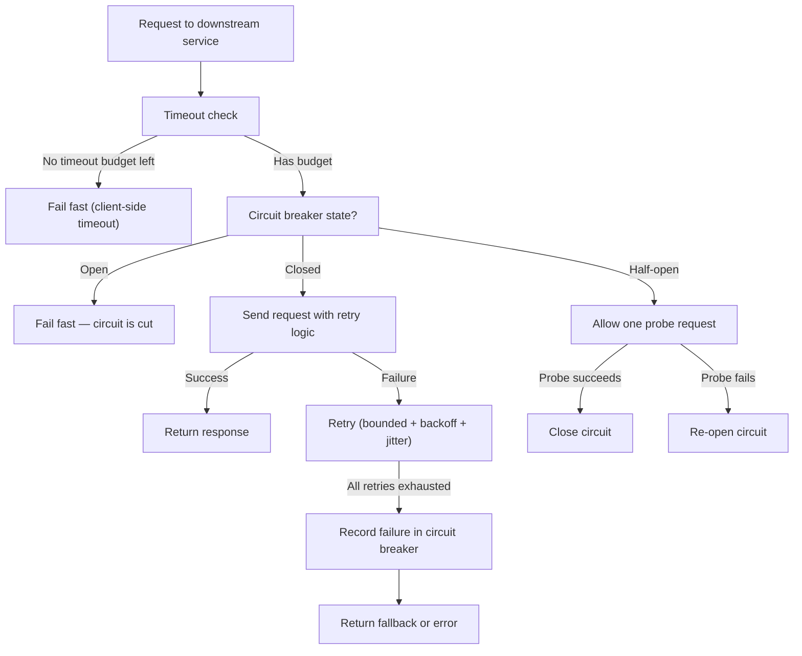
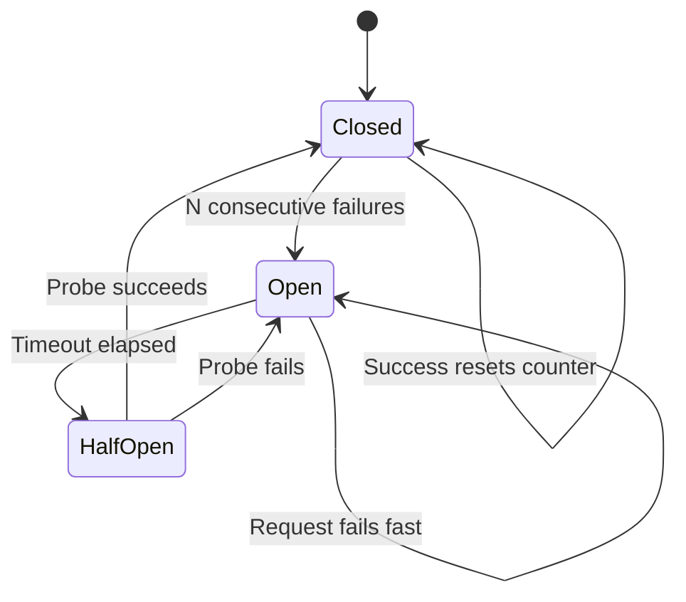
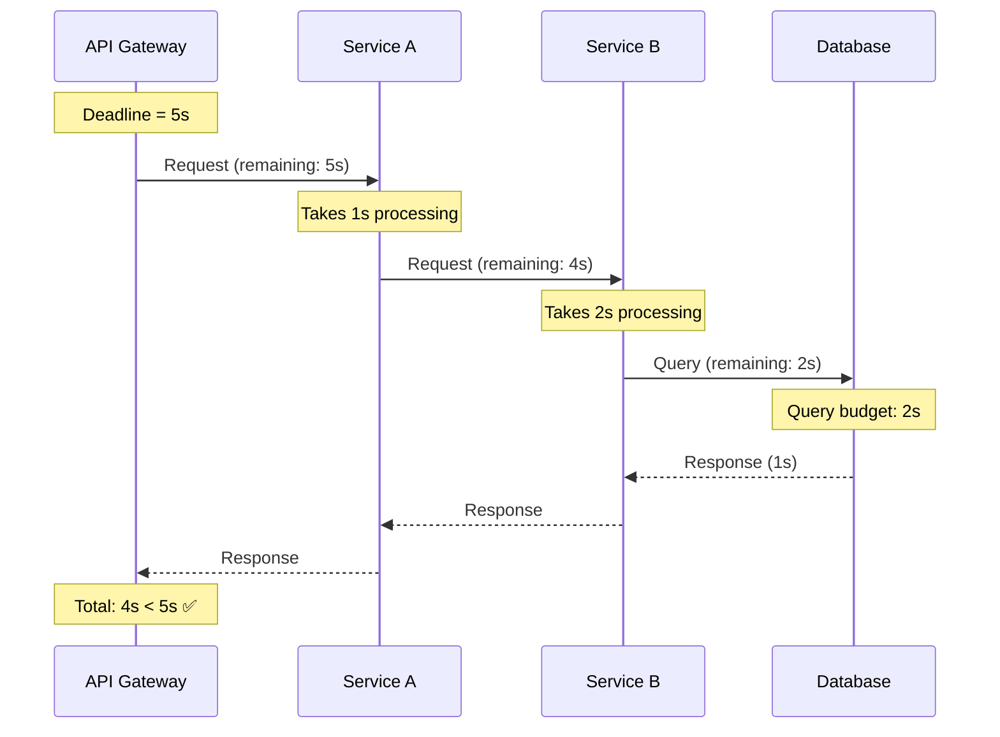
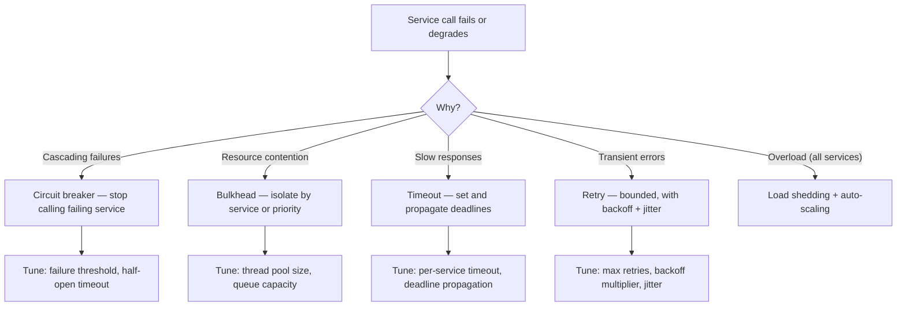

# Resilience Patterns

> [!summary] Goal
> Handle partial failure gracefully using circuit breakers, bulkheads, timeouts, and retries. Prevent cascading failures and help distributed systems recover on their own.

## Table of Contents

1. [Resilience Flow](#resilience-flow)
2. [Circuit Breaker](#circuit-breaker)
3. [Bulkhead](#bulkhead)
4. [Timeouts](#timeouts)
5. [Resilience Comparison](#resilience-comparison)
6. [Decision Tree](#decision-tree)
7. [Pitfalls](#pitfalls)

---

## Resilience Flow



---

## Circuit Breaker

The circuit breaker pattern prevents a service from repeatedly calling a failing downstream service, giving it time to recover.



| State | Behavior | Transition |
|-------|----------|------------|
| **Closed** | Normal operation — requests pass through | → Open after N consecutive failures |
| **Open** | Requests fail immediately (fast-fail) | → Half-Open after timeout (e.g., 30s) |
| **Half-Open** | Single probe request allowed | → Closed if probe succeeds, → Open if fails |

### Configuration

```text
circuitBreaker:
  failureThreshold: 5        # Open after 5 consecutive failures
  successThreshold: 3        # Close after 3 consecutive successes in half-open
  timeout: 30s               # Time to wait before transitioning to half-open
  waitInterval: 60s          # Open duration before half-open attempt
  
  # Optional: sliding window metrics
  slidingWindowSize: 10      # Track last 10 calls
  minimumCalls: 5            # Minimum calls before evaluating
```

---

## Bulkhead

Bulkhead isolates resources so that a failure in one part doesn't consume capacity from other parts.

```mermaid
flowchart LR
    subgraph App["Application"]
        subgraph BH1["Bulkhead: Payment API"]
            T1["Thread Pool: 5 threads"]
            Q1["Queue: 10"]
        end
        subgraph BH2["Bulkhead: Inventory API"]
            T2["Thread Pool: 5 threads"]
            Q2["Queue: 10"]
        end
        subgraph BH3["Bulkhead: Auth API"]
            T3["Thread Pool: 3 threads"]
            Q3["Queue: 5"]
        end
    end
    R["Request"] --> BH1
    R --> BH2
    R --> BH3
    Note over BH1: Payment API is slow...
    Note over T1: Thread pool saturated (5/5)
    Note over Q1: Queue filling up
    Note over BH2,BH3: But Inventory and Auth are unaffected
```

| Approach | Mechanism | Pros | Cons |
|----------|-----------|------|------|
| **Thread pool isolation** | Each downstream gets its own thread pool | Strict isolation, independent queueing | Context switching overhead, thread count limits |
| **Semaphore isolation** | Limit concurrent calls via semaphores | Lighter than thread pools (no context switch) | No queueing — drops immediately when limit reached |
| **Queue-based** | Bounded queue per downstream | Smooths bursts | Can mask problems if queue is too deep |

### Bulkhead sizing

```text
threadPool:
  maxThreads: 5
  queueCapacity: 10
  
Sizing guidelines:
  threadPool = maxConcurrentRequests × (1 + headroom%)
  Example: if Payment API handles 50 QPS at 200ms latency,
  needed threads = 50 × 0.2 = 10 concurrent → use 15 (50% headroom)

  Start with small values and increase based on monitoring:
  - Too small: increased latency (queuing), timeouts
  - Too large: no failure isolation (defeats the purpose)
```

---

## Timeouts

### Timeout types

| Timeout | What it protects | Set at | Typical value |
|---------|-----------------|--------|:-------------:|
| **Connection timeout** | Network connectivity | Client | 500ms - 5s |
| **Request timeout** | Slow response | Client | 5s - 30s |
| **Read timeout** | Slow streaming response | Client | Same as request |
| **Deadline (end-to-end)** | Total time for the whole operation | Entry point | 30s - 60s |
| **Idle timeout** | Inactive connections | Server | 60s - 300s |

### Deadline propagation



```text
Deadline propagation rules:
  1. Entry point sets a total deadline (e.g., 5s for the full request)
  2. Each hop subtracts its processing time from the deadline
  3. Pass remaining time in request headers (gRPC: grpc-timeout)
  4. If remaining <= 0, fail immediately (don't call downstream)
  5. Shorter deadline = faster failure detection
```

---

## Resilience Comparison

| Feature | Circuit Breaker | Bulkhead | Timeout | Retry |
|---------|:---------------:|:--------:|:-------:|:-----:|
| **Problem solved** | Repeated failures | Resource exhaustion | Slow responses | Transient failures |
| **Action** | Fail fast, give time to recover | Isolate resources | Stop waiting | Try again |
| **Success signal** | Successful probe | — | Request completes | Success on retry |
| **Failure signal** | N consecutive failures | Pool full, queue full | Elapsed time | Error response |
| **Metrics** | State: open/closed, failure count | Active threads, queue depth | Timeout count | Retry count, success/fail |
| **Risk** | False positives (brief glitch opens circuit) | Too small = queueing, too large = no isolation | Overly tight = false failures | Amplifying load (retry storm) |

---

## Decision Tree



---

## Pitfalls

### Circuit breaker too sensitive

A circuit breaker that opens after 2 failures is too aggressive — a brief network glitch degrades the entire system. Set failure threshold to at least 5 and don't evaluate the circuit until at least 10 requests have been observed (minimum calls).

### Circuit breaker never opening

A circuit breaker with a 60-second timeout open → half-open transition is pointless if the underlying problem takes 10 minutes to recover. The circuit opens every 60 seconds, probes fail, and the system degrades without recovering.

### Bulkhead sized by average, not peak

If the Payment API usually handles 5 concurrent requests but spikes to 50 during a flash sale, a bulkhead with 10 threads will reject legitimate traffic. Size bulkheads for peak + headroom, and add monitoring to prove the sizing.

### Timeout too tight for tail latency

If p99 latency is 2s but the timeout is 500ms, 1% of legitimate requests time out. Set timeouts based on p99.5 or p99.9, not average. Consider client-side timeout vs server-side (let the server decide when to give up).

### Retry without circuit breaker

Retrying a failing service without a circuit breaker makes things worse. All clients retry → more load → more failures → infinite retry loop. Always combine retries with a circuit breaker: retry for transient errors, give up (open circuit) for sustained failures.

---

> [!question]- Interview Questions
>
> **Q: How does a circuit breaker work and what are its three states?**
> A: Closed — normal operation, requests pass through. Open — failures exceed threshold, requests fail immediately without calling the service. Half-Open — after a timeout, a single probe request is allowed to test if the service has recovered. If it succeeds, the circuit closes; if it fails, it re-opens.
>
> **Q: What is the bulkhead pattern and when would you use it?**
> A: Bulkhead isolates resources so a failure in one subsystem doesn't consume capacity from others. Each downstream service gets its own thread pool or semaphore. Used when one slow dependency would otherwise exhaust the entire application's thread pool and block all requests.
>
> **Q: How do you choose between thread pool and semaphore bulkheads?**
> A: Thread pool isolation provides strict isolation with independent queueing but adds context-switching overhead. Semaphores are lighter (no queueing, immediate rejection) but don't provide buffering. Use thread pools for dependencies with variable latency, semaphores for fast in-process calls.
>
> **Q: What is deadline propagation and why is it important?**
> A: Deadline propagation passes the remaining timeout budget from service to service in the request chain. Each hop subtracts its processing time from the deadline. If the remaining time is zero, the request fails fast without calling downstream. This prevents wasted work when the overall timeout is near exhaustion.
>
> **Q: How do you prevent retry storms?**
> A: Combine retries with a circuit breaker. Use bounded retries (max 3), exponential backoff with jitter, and monitor retry rates. The circuit breaker gives the downstream service time to recover. Without it, all clients retry simultaneously, amplifying the failure.

---

## Cross-Links

- [[SystemDesign/01_Foundations/04_APIs_Idempotency_and_Retries]] for retry strategy and idempotency
- [[SystemDesign/03_Advanced/02_Backpressure_and_Load_Shedding]] for rate limiting and overload protection
- [[SystemDesign/04_Playbooks/02_Incident_Playbook_Retry_Storms]] for diagnosing retry storm incidents
- [[SystemDesign/02_Core/05_Observability_Logs_Metrics_Traces]] for monitoring circuit breaker states
- [[SpringBoot/03_Advanced/01_Spring_for_Apache_Kafka_Integration]] for Spring Resilience4j integration
