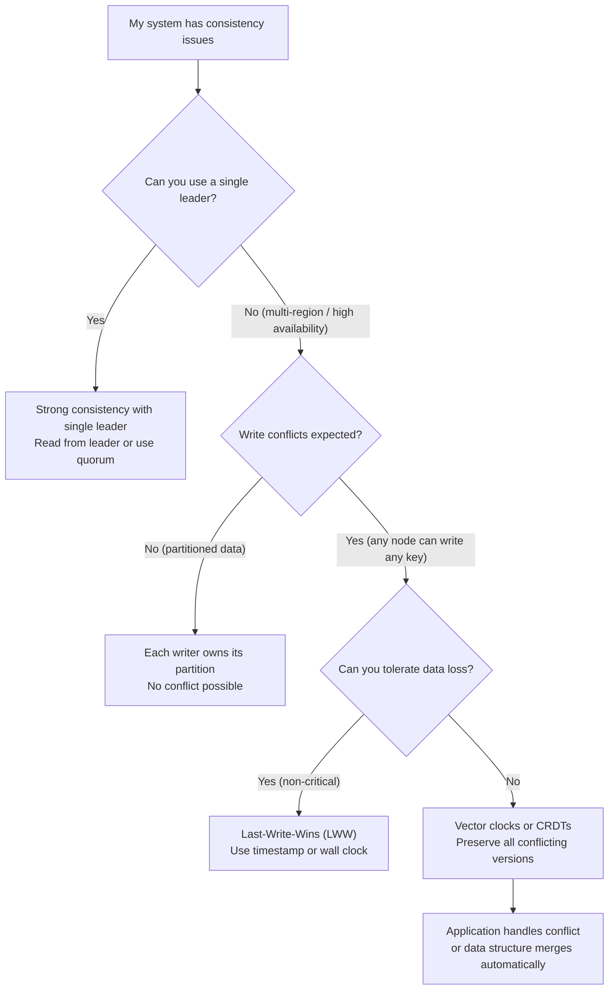
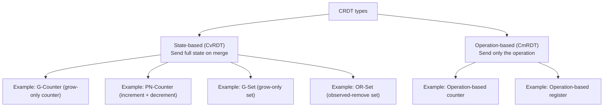

# Data Consistency Playbook

> [!summary] Goal
> Diagnose and fix consistency issues in distributed systems. Choose the right conflict resolution strategy and understand when to use CRDTs, vector clocks, or last-write-wins.

## Table of Contents

1. [Consistency Decision Tree](#consistency-decision-tree)
2. [Conflict Resolution Strategies](#conflict-resolution-strategies)
3. [CRDT Basics](#crdt-basics)
4. [Pitfalls](#pitfalls)

---

## Consistency Decision Tree



---

## Conflict Resolution Strategies

### Last-Write-Wins (LWW)

The simplest strategy: the write with the latest timestamp wins. All other concurrent writes are lost.

```text
Replica A: write(key="user:42", name="Alice", timestamp=100)
Replica B: write(key="user:42", name="Bob", timestamp=101)

Result: name = "Bob" (timestamp 101 > 100)
         Alice's write is permanently lost
```

| Aspect | LWW |
|--------|-----|
| **Data loss** | Yes — concurrent writes are lost |
| **Complexity** | Trivial — compare timestamps |
| **Clock skew** | Depends on accurate clocks (use hybrid logical clocks) |
| **When to use** | Non-critical data, caches, counters, analytics |
| **Example** | DynamoDB (default), Cassandra (default with `LWT`) |

### Vector clocks

Each replica tracks a version vector. Conflicts are detected when concurrent writes occur and preserved for application-level resolution.

```text
Initial state: key="cart" → {items: ["apple"], vclock: {A: 1}}

Replica A adds "banana":   vclock → {A: 2}, items → ["apple", "banana"]
Replica B adds "cherry":   vclock → {B: 1}, items → ["apple", "cherry"]

Concurrent writes detected — A's vclock doesn't descend from B's and vice versa.

Resolution: return both versions, let application merge
  → items → ["apple", "banana", "cherry"]  (merged)
```

| Aspect | Vector clocks |
|--------|---------------|
| **Data loss** | None — all concurrent versions preserved |
| **Complexity** | Medium — compare vectors, resolve conflicts |
| **Clock skew** | Tolerant (uses logical counters, not wall clocks) |
| **Version size** | Grows with number of replicas (O(N)) |
| **When to use** | Critical data, collaborative editing, shopping carts |
| **Example** | Riak, Dynamo (original paper), Amazon Shopping Cart |

### Comparison

| Strategy | Data loss | Complexity | Storage overhead | Clock dependency | Use case |
|----------|:---------:|:----------:|:----------------:|:----------------:|----------|
| **Last-Write-Wins** | Yes | None | None | Wall clock | Non-critical, counters |
| **Vector clock** | No | Medium | O(N) versions | Logical clock | Shopping cart, docs |
| **CRDT** | No (merge) | Medium | O(N) state | None (merge) | Collaborative editing |
| **Application-managed** | No | High | Application logic | Varies | Complex business logic |

---

## CRDT Basics

Conflict-Free Replicated Data Types (CRDTs) are data structures that can be updated concurrently on multiple replicas and automatically merge without conflicts.



### Common CRDTs

| CRDT | How it works | Use case |
|------|-------------|----------|
| **G-Counter** | Each replica tracks its own increments; sum across all replicas | Total likes, view counts |
| **PN-Counter** | Two G-Counters: one for +, one for - | Upvote/downvote balance |
| **G-Set** | Add elements only; union on merge | Once-added, never-removed data |
| **OR-Set** | Track added/removed elements with tags; merge by union minus removed | Shopping cart items |
| **LWW-Register** | Last-write-wins with timestamp-per-replica | Collaborative field editing |
| **MV-Register** | Multi-value register — preserves all concurrent values | Needs application merge |

### G-Counter example

```text
Replica A: [5, 0, 0] → total = 5
Replica B: [0, 3, 0] → total = 3
Replica C: [0, 0, 2] → total = 2

After replicas exchange state:
  A sees B and C → [5, 3, 2] → total = 10
  B sees A and C → [5, 3, 2] → total = 10
  C sees A and B → [5, 3, 2] → total = 10

Merge is idempotent, commutative, associative = eventual consistency without conflicts.
```

---

## Pitfalls

### LWW with unsynchronized clocks

Using wall clocks for last-write-wins is dangerous — clock skew means a later write can appear to be earlier. Use Hybrid Logical Clocks (HLCs) that combine wall clock + logical counter, or use a deterministic ordering mechanism (e.g., compare UUIDs).

### Vector clock bloat

Vector clocks grow with every replica in the system. After many replica changes, clocks can become large. Periodically trim vector clocks by removing entries for decommissioned replicas (with consensus).

### CRDT for the wrong data type

CRDTs work well for commutative, associative operations (counters, sets, registers). They don't work well for operations that require global ordering (transfers between accounts, inventory reservations). Use consensus for operations that need total order.

### Assuming automatic conflict resolution covers all cases

CRDTs and vector clocks can detect and merge most conflicts automatically. But application-level semantic conflicts (e.g., both users assigned the same meeting room at the same time) can't be resolved by data structures alone — they need application-level or human intervention.

### Not monitoring inconsistency

If you use eventual consistency, stale reads and conflicts are expected. But sustained inconsistency (conflicts not converging) indicates a problem. Monitor: conflict rate, resolution latency, and staleness metrics (age of oldest unresolved conflict).

---

> [!question]- Interview Questions
>
> **Q: What are the tradeoffs of last-write-wins (LWW) conflict resolution?**
> A: LWW is simple (compare timestamps, take the latest) but loses data from concurrent writes. It's suitable for non-critical data where the latest write is the most relevant. The risk is clock skew — an earlier write with a fast clock can overwrite a later write with a slow clock. Mitigate with hybrid logical clocks or coordinate via a single leader.
>
> **Q: What is a CRDT and when would you use one?**
> A: A Conflict-Free Replicated Data Type can be updated concurrently on multiple replicas and automatically merge without conflicts. Use CRDTs for data that needs high availability, multi-region writes, and can tolerate temporary divergence (e.g., counters, sets, collaborative editing). Examples include G-Counter (total views), OR-Set (cart items), and LWW-Register (profile fields).
>
> **Q: What are the three properties of a CRDT merge operation?**
> A: Commutative (A merged with B = B merged with A), associative ((A merged with B) merged with C = A merged with (B merged with C)), and idempotent (merging the same state twice produces the same result as merging once). These properties ensure eventual convergence regardless of the order replicas exchange state.
>
> **Q: How do vector clocks detect concurrent writes?**
> A: Each replica maintains a version vector (counter per replica). Write A is causally before write B if all A's counters are ≤ B's counters (and at least one is strictly less). If neither A descends from B nor B descends from A, they are concurrent and must be resolved.
>
> **Q: When should you use a distributed transaction vs CRDT?**
> A: Use distributed transactions (2PC, Saga) for operations that need atomicity across multiple systems — e.g., transferring money from account A to account B. Use CRDTs for data that can tolerate temporary divergence and eventual consistency — e.g., a like count that will eventually converge. CRDTs are available under partition; distributed transactions are not.

---

## Cross-Links

- [[SystemDesign/02_Core/04_Consistency_Replication_and_Consensus]] for consistency models and quorum
- [[SystemDesign/03_Advanced/01_Multi_Region_Architecture]] for cross-region replication conflicts
- [[SystemDesign/02_Core/01_Caching_Strategies]] for cache invalidation consistency
- [[SystemDesign/05_Projects/02_Design_Notification_System]] for handling delivery guarantees consistently
