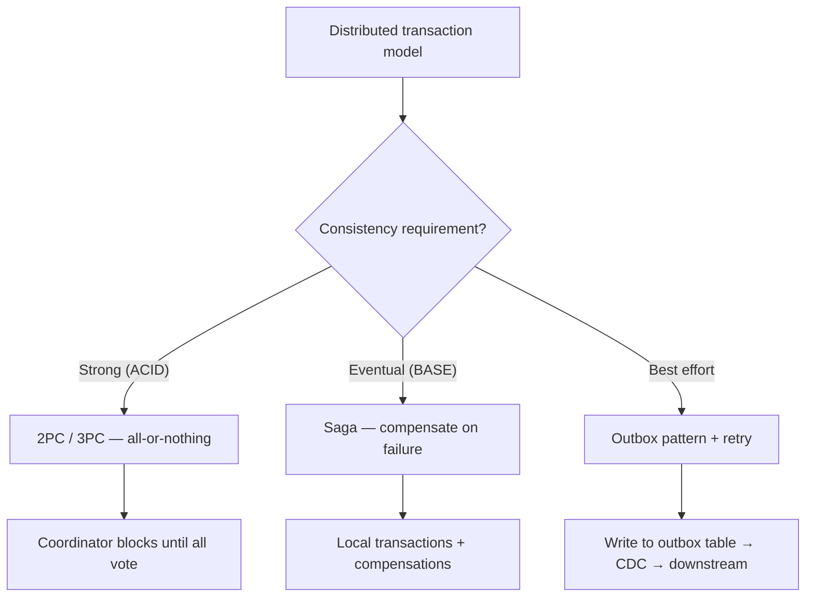
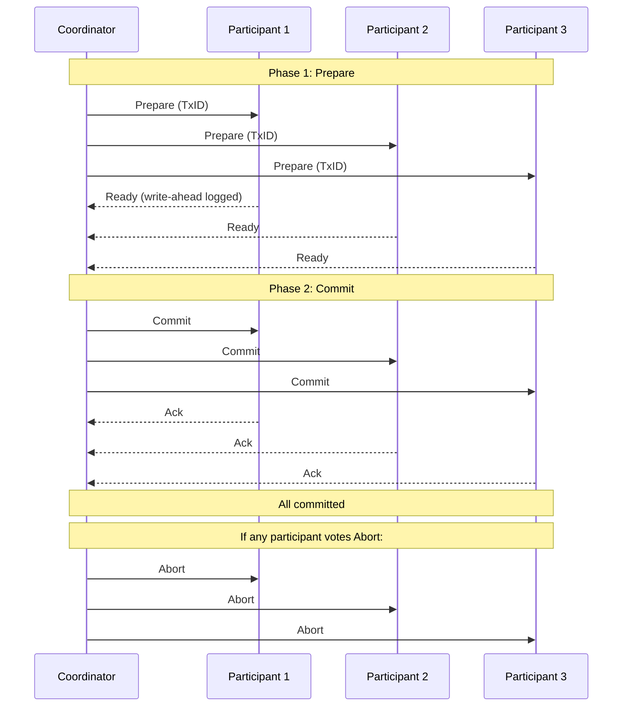
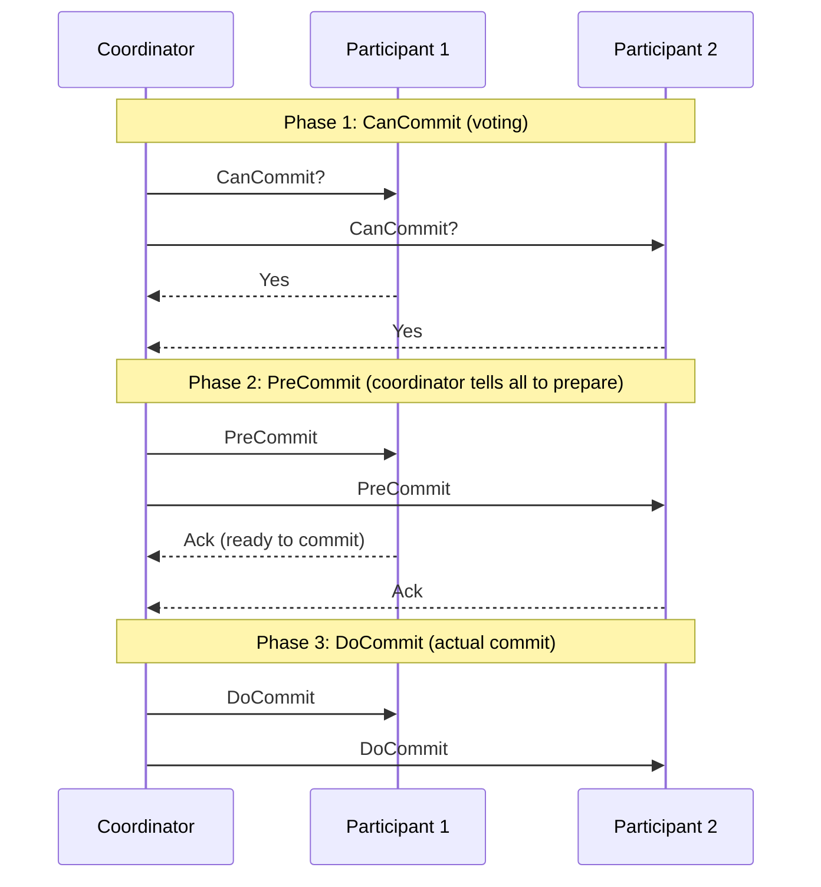
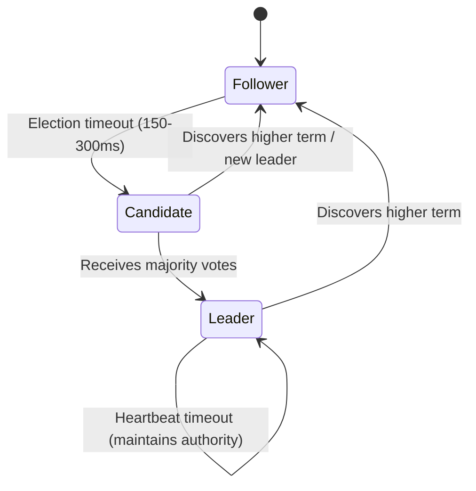
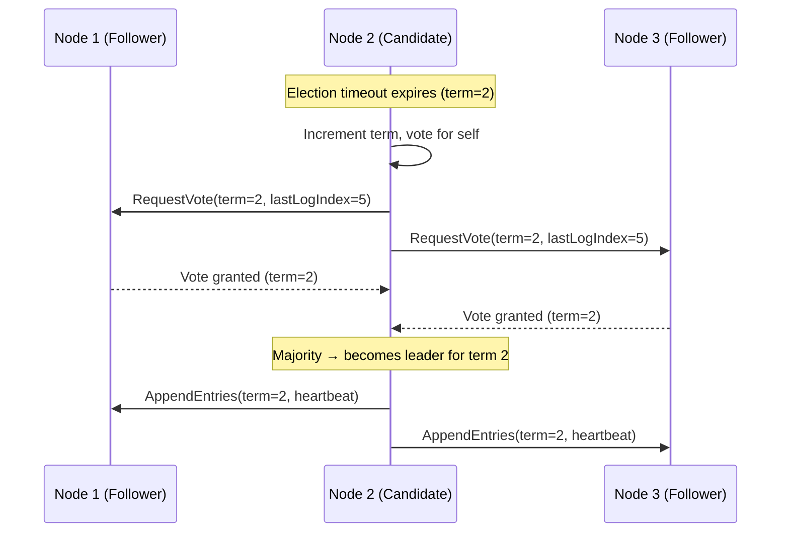
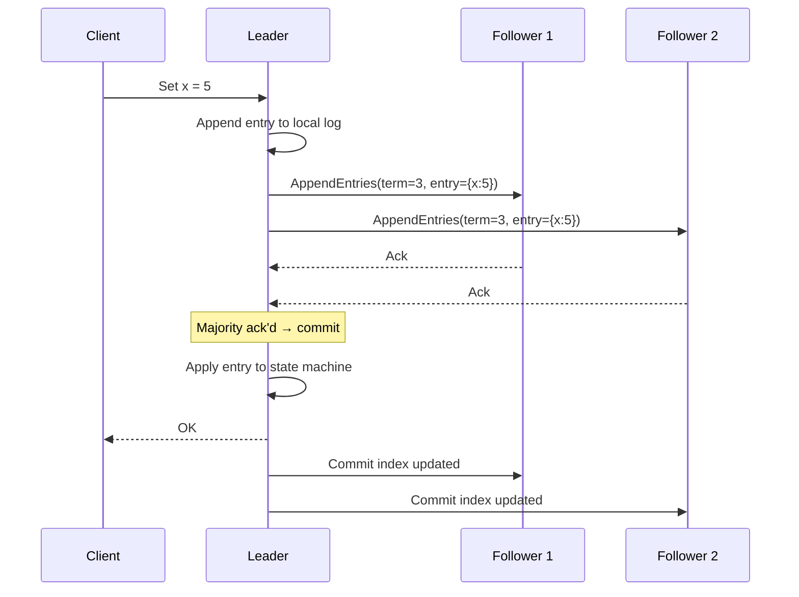
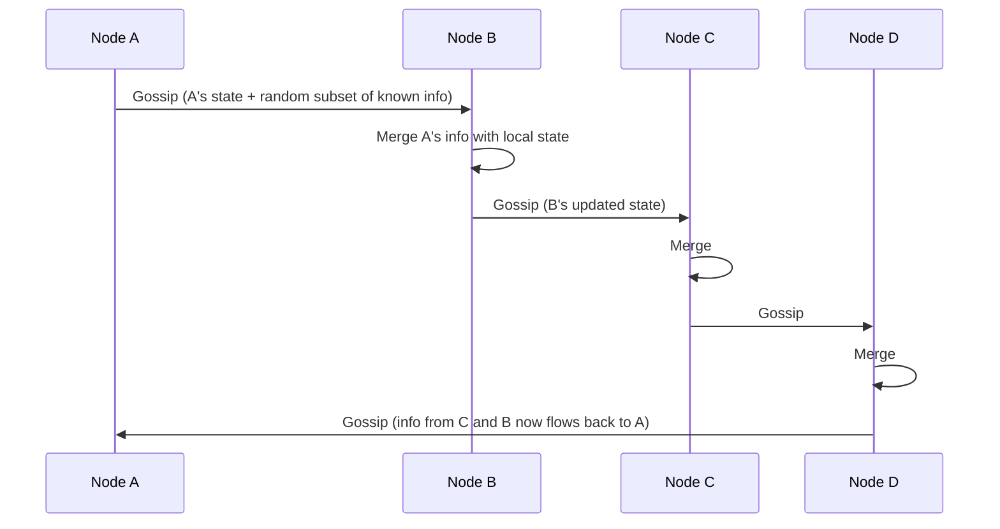

# Distributed Transactions and Consensus

> [!summary] Goal
> Coordinate transactions across multiple services and nodes using 2PC, Saga, and consensus algorithms. Understand the limitations (FLP impossibility, CAP) and tradeoffs of each approach.

## Table of Contents

1. [Distributed Transaction Models](#distributed-transaction-models)
2. [Two-Phase Commit (2PC)](#two-phase-commit)
3. [Three-Phase Commit (3PC)](#three-phase-commit)
4. [Distributed vs Non-Distributed: Comparison](#distributed-vs-non-distributed-comparison)
5. [Raft Consensus Deep Dive](#raft-consensus-deep-dive)
6. [Leader Election Algorithms](#leader-election-algorithms)
7. [Gossip Protocol](#gossip-protocol)
8. [FLP Impossibility](#flp-impossibility)
9. [Pitfalls](#pitfalls)

---

## Distributed Transaction Models



| Model | Consistency | Availability during partition | Latency | Use case |
|-------|:-----------:|:---------------------------:|:-------:|----------|
| **2PC** | Strong (all commit or all abort) | No (blocks) | Higher (multiple rounds) | Short-lived, critical, small scope |
| **3PC** | Strong (non-blocking) | Yes (with timeout) | Higher (more rounds) | Theoretical improvement over 2PC |
| **Saga** | Eventual (compensating) | Yes | Lower (local transactions) | Long-running business workflows |
| **Outbox** | Eventual (via CDC) | Yes | Lowest | Event-driven microservices |

---

## Two-Phase Commit (2PC)



### 2PC failure handling

```text
Coordinator failure:
  - Before prepare: no one knows about the transaction — safe to forget
  - After prepare, before commit: participants are "in doubt" (locked)
    → Participants must block until coordinator recovers
    → Or: timeout and heuristic decision (risky)

Participant failure:
  - Before prepare vote: coordinator times out → abort
  - After prepare vote: participant has logged "ready"
  - Coordinator proceeds with commit; participant on recovery checks log

The blocking problem:
  If coordinator crashes after all participants voted "ready",
  participants hold locks and cannot decide without coordinator.
  This is why 2PC is "blocking" and 3PC tries to solve this.
```

---

## Three-Phase Commit (3PC)

3PC adds a `pre-commit` phase to avoid the blocking problem of 2PC:



```text
Why 3PC is non-blocking:
  If coordinator fails after PreCommit, participants can timeout and commit.
  Because they all agreed in the PreCommit phase, they know everyone is ready.
  No locks held indefinitely.

Limitations:
  - 3PC still blocks if a network partition separates participants.
  - More message rounds = higher latency.
  - Rarely used in practice; 2PC + timeout recovery is more common.
```

---

## Distributed vs Non-Distributed: Comparison

| Aspect | 2PC / Distributed Transaction | Saga (Choreography) | Outbox Pattern |
|--------|:---------------------------:|:-------------------:|:--------------:|
| **Atomicity** | ✅ All-or-nothing | ❌ Eventual (compensations) | ❌ Eventual |
| **Isolation** | ✅ Serializable | ❌ Read uncommitted | ❌ Read uncommitted |
| **Durability** | ✅ WAL-backed | ✅ Local transactions | ✅ Local DB write |
| **Latency** | High (multiple network rounds) | Medium (local + event) | Low (local write, async event) |
| **Availability** | Low (coordinator blocks) | High | High |
| **Complexity** | Very high | Medium | Low |
| **Use case** | Banking, inventory reservation | Order fulfillment, multi-step workflows | Event-driven sync between services |

---

## Raft Consensus Deep Dive

Raft ensures a cluster of nodes agrees on a log of commands despite failures:



### Leader election



### Log replication



### Raft safety properties

```text
Election Safety: at most one leader per term
Leader Append-Only: leader never overwrites or deletes log entries
Log Matching: if two logs have same (term, index), entries are identical
Leader Completeness: committed entries are present in all future leaders
State Machine Safety: if a server applies entry at a given index,
  no other server applies a different entry at the same index

Practical implication:
  - Once a log entry is committed (replicated to majority), it's permanent
  - A new leader will have all committed entries from previous terms
  - No split-brain: independent failure detection prevents dual leaders
```

---

## Leader Election Algorithms

| Algorithm | Approach | Convergence | Fault tolerance | Used by |
|-----------|----------|:-----------:|:---------------:|---------|
| **Raft** | Randomized timeouts, request/response votes | Fast (~O(log n) rounds) | Majority survives | etcd, Consul, TiKV |
| **Bully** | Highest-ID node wins, challenge if higher ID appears | O(n²) messages in worst case | Up to n-1 failures | Tangora, some older systems |
| **Zab (ZooKeeper)** | Fast leader election with dynamic quorum | Fast | Majority survives | ZooKeeper |
| **Gossip-based** | Propagate leader info via gossip, detect failure via suspicion | Slower | Configurable | Cassandra, Riak |
| **Paxos (single decree)** | Prepare → Promise → Accept → Accepted | 2-3 rounds per value | Majority survives | Google Chubby, Spanner |

---

## Gossip Protocol

Nodes periodically exchange state information with random peers, achieving eventual convergence:



| Property | Description |
|----------|-------------|
| **Convergence** | O(log n) rounds for all nodes to know an update |
| **Failure detection** | phi-accrual detector: if no gossip heard in X seconds, suspect |
| **Message complexity** | O(n²) in naive implementation, O(n log n) with partial views |
| **Durability** | Info eventually reaches all live nodes (best-effort) |
| **Use cases** | Cassandra, Riak, Redis Cluster membership, SWIM protocol |

---

## FLP Impossibility

The FLP result (Fischer, Lynch, Paterson, 1985) proves that **in an asynchronous distributed system, consensus is impossible with even a single crash failure**:

```text
Core insight:
  In an asynchronous system (no bounds on message delay or processing time),
  it's impossible to distinguish between:
    (a) a crashed node, AND
    (b) a node that is very slow

  Therefore, you can never guarantee that all non-faulty nodes agree on a value.
  Any consensus algorithm must rely on SOME form of synchrony assumption:
    - Failure detectors (timeout-based)
    - Randomized algorithms (random backoff)
    - Partial synchrony (usually synchronous, occasionally asynchronous)

How real systems work around FLP:
  - Raft: uses randomized election timeouts (150-300ms)
  - Paxos: uses failure detectors with timeouts
  - Practical systems assume "mostly synchronous" networks
  - The impossibility applies to deterministic algorithms in a purely async model
```

---

## Pitfalls

### 2PC in high-latency environments

2PC requires multiple rounds of messages between coordinator and participants. If participants are in different regions (50-200ms apart), the commit time adds up: transaction across 3 regions = 4 round trips = 200-800ms of coordination overhead.

### Not handling the "in-doubt" transaction in 2PC

If the coordinator crashes after prepare but before commit, participants hold locks indefinitely. Implement a heuristic timeout: if a participant doesn't hear from the coordinator in T seconds, it can (a) wait, (b) abort (risky), or (c) contact a recovery coordinator.

### Raft cluster of 2 nodes

A 2-node Raft cluster requires both nodes for a majority — a single node failure blocks all writes. Never run Raft with an even number of nodes (split-brain risk). Minimum practical: 3 nodes. Standard: 3 or 5.

### Leader election storms

If all Raft followers have the same election timeout, they all become candidates simultaneously — no one wins a majority. Raft uses random timeouts (150-300ms) to break ties. If you see repeated election cycles, check that timeouts are randomized and that the cluster isn't overloaded.

### Assuming FLP doesn't apply to your system

FLP proves that perfect consensus in an async system is theoretically impossible. Every practical system (Raft, Paxos) works by sidestepping FLP with timeouts or randomness. If your failure detector is wrong (e.g., timeout too short), you get split-brain or failed elections. Tune failure detectors carefully.

---

> [!question]- Interview Questions
>
> **Q: What is the problem with 2PC?**
> A: 2PC is a blocking protocol — if the coordinator fails after the prepare phase, participants hold locks and cannot decide (commit or abort) without the coordinator recovering. This makes 2PC unavailable during coordinator failures. Also, 2PC has high latency (multiple rounds) and doesn't handle network partitions well.
>
> **Q: How does Raft ensure safety?**
> A: Raft guarantees: (1) at most one leader per term, (2) logs are append-only on the leader, (3) committed entries are present on a majority, (4) only a node with the most up-to-date log can become leader. Together, these ensure that once a log entry is committed, it's permanently part of the log on all future leaders.
>
> **Q: What is the FLP impossibility result?**
> A: FLP (Fischer, Lynch, Paterson) proves that in a fully asynchronous system, consensus is impossible with even one crash failure — you can't distinguish between a crashed node and a slow one. Practical systems avoid FLP by using failure detectors (timeouts) or randomization (Raft's random election timeout).
>
> **Q: What is the difference between Saga and 2PC?**
> A: 2PC provides strong atomicity — all participants commit or all abort — but blocks during coordinator failure. Saga provides eventual consistency — each step is a local transaction, and failure triggers compensating transactions. Sagas don't block, are available during partitions, but offer weaker guarantees (eventual consistency, no isolation).
>
> **Q: How does the Gossip protocol work?**
> A: Each node periodically selects a random peer and exchanges state information. Information spreads exponentially: after O(log n) rounds, all nodes in an n-node cluster have received the update. Gossip is used for: failure detection (Cassandra), membership (Redis Cluster), and metadata propagation (DNS changes).

---

## Cross-Links

- [[SystemDesign/02_Core/04_Consistency_Replication_and_Consensus]] for consistency models and quorum
- [[SystemDesign/02_Core/07_Architecture_Patterns]] for Saga choreography vs orchestration
- [[SystemDesign/03_Advanced/03_Resilience_Patterns]] for retries and timeouts in distributed calls
- [[SpringBoot/02_Core/02_Transactions_and_Propagation]] for Spring transaction management
- [[CICD/Kubernetes/01_Foundations/04_Cluster_Architecture_and_Components]] for etcd and Raft in K8s
