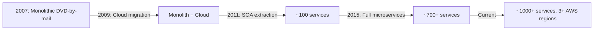
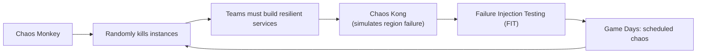
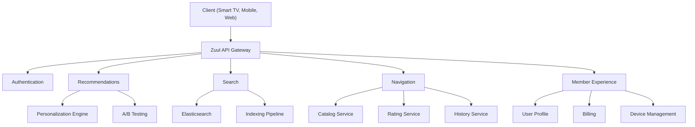
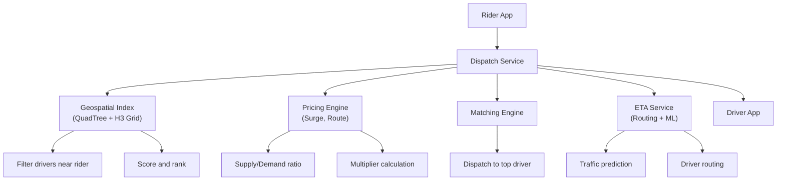
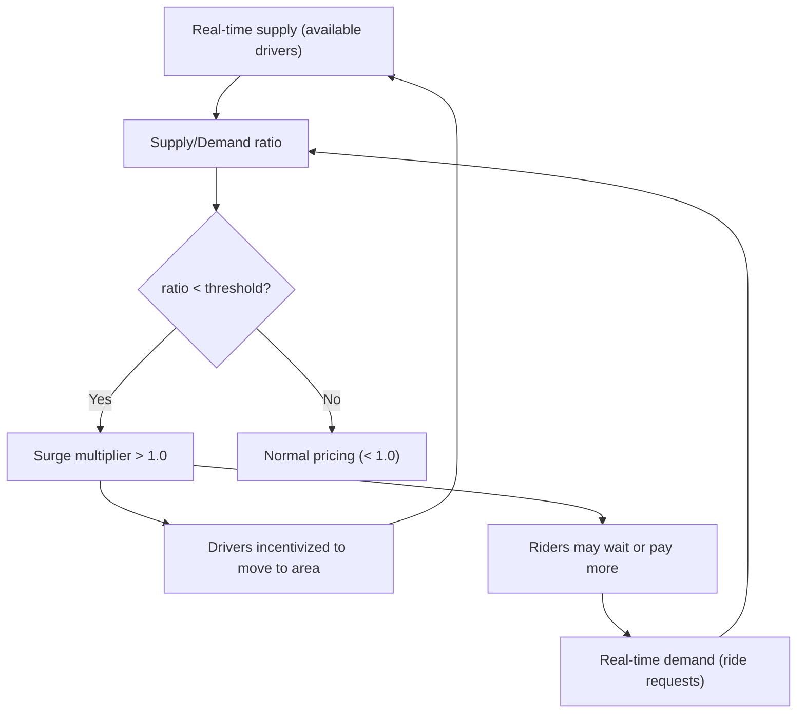
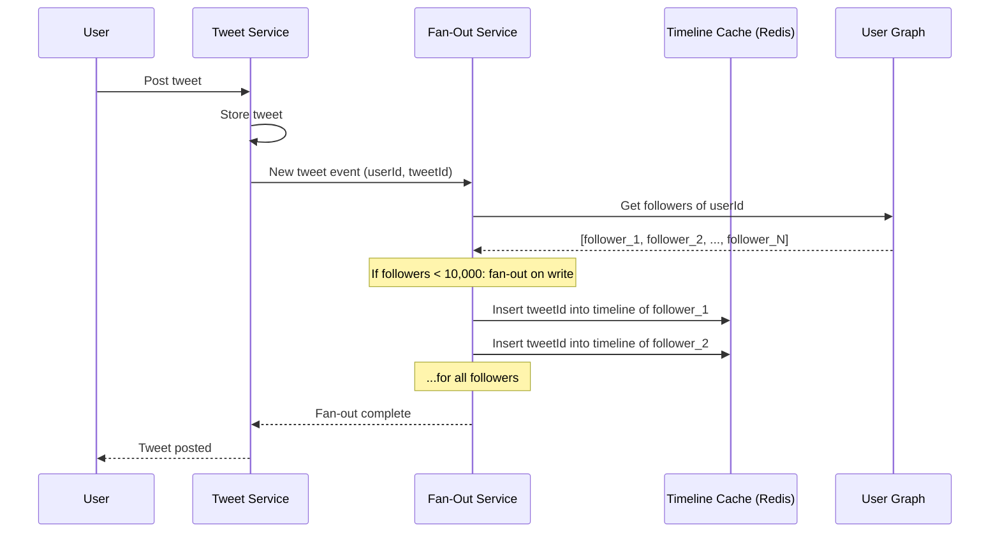
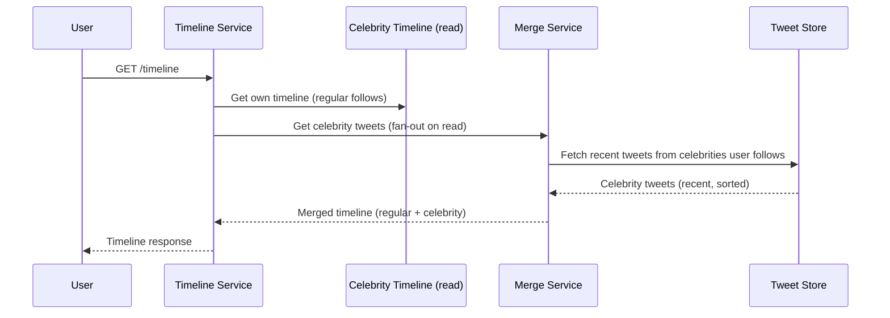
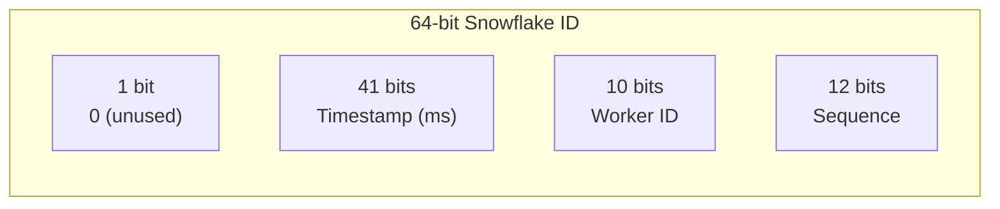

# Case Study: Netflix, Uber, Twitter

> [!summary] Goal
> Learn from real-world system designs — Netflix's microservice evolution and resilience engineering, Uber's dispatch and geo-spatial indexing, and Twitter's timeline fan-out and snowflake ID generation.

## Table of Contents

1. [Netflix](#netflix)
2. [Uber](#uber)
3. [Twitter](#twitter)
4. [Common Patterns Across All Three](#common-patterns-across-all-three)

---

## Netflix

### Evolution: Monolith → SOA → Microservices



### Key architectural decisions

| Decision | What they chose | Why |
|----------|---------------|-----|
| **API Gateway** | Zuul (now Zuul 2.0) — Netty-based, non-blocking | Routes requests to correct services, handles auth, rate limiting |
| **Service Mesh** | Eureka (service discovery), Ribbon (client-side load balancing), Hystrix (circuit breaker) | Evolved into their own OSS stack before Istio/Linkerd existed |
| **Resilience** | Hystrix Circuit Breaker, Bulkhead, Timeout per service | Prevents cascading failures; each dependency has its own thread pool |
| **Data** | Cassandra (AP, eventual consistency), EVCache (Memcached-based distributed cache) | High availability over strong consistency |
| **Multi-region** | Active-Active (3+ AWS regions) | All regions serve traffic; no idle capacity |
| **Observability** | Atlas (metrics), Spinnaker (CD), Chaos Monkey | "If it hurts, do it more often" — Netflix Engineering Culture |

### Netflix's Chaos Engineering



| Tool | What it does | Lesson |
|------|-------------|--------|
| **Chaos Monkey** | Randomly terminates EC2 instances | Build systems that survive instance failure |
| **Chaos Kong** | Simulates an entire AWS region failure | Multi-region must be tested, not just documented |
| **FIT** | Injects latency/failures into service-to-service calls | Test resilience of each dependency independently |
| **Game Days** | Scheduled failure exercises with the on-call team | Practice makes incident response faster |

### Netflix's microservice architecture



---

## Uber

### Dispatch system architecture



### Geospatial indexing

```text
Problem: Find nearby drivers efficiently in a city with millions of drivers.

Solution: Uber uses a combination of:
  1. H3 Hexagonal Grid — divides the world into hexagons of adjustable resolution
  2. Drivers are assigned to the hex cell they're in
  3. Query: find all occupied hex cells within a radius
  4. Retrieve drivers from those cells

Why H3 over QuadTree?
  - Hexagons have uniform distance between centers
  - No ambiguity at cell boundaries (all neighbors are equidistant)
  - Better for spatial queries and price regions

Previous approach: QuadTree with geohash
  - Drivers send location every 4 seconds via gRPC
  - Geohash reduces 2D → 1D for DB indexing
  - Redis sorted sets for real-time driver location per geohash
```

### Surge pricing mechanics



### Microservice decomposition

| Service | Responsibility | Data store |
|---------|---------------|------------|
| **Dispatch** | Match rider with driver | Cassandra (trip state) |
| **Geospatial Index** | Track driver locations | Redis + H3 |
| **Pricing** | Surge calculation, fare estimation | Redis (counters) |
| **ETA** | Route computation, arrival time | Postgres + ML models |
| **Payment** | Process charges, payouts | Postgres (ledger) |
| **User** | Riders and drivers profiles | Schemaless (MySQL-based) |
| **Trip** | Ride history and state machine | Cassandra |

---

## Twitter

### Timeline generation: Fan-out on write (for regular users)



### Timeline generation: Fan-out on read (for celebrities)



### Snowflake ID generation



| Field | Bits | Max value | Notes |
|-------|:----:|:---------:|-------|
| **Sign** | 1 | — | Always 0 (positive integer) |
| **Timestamp** | 41 | ~69 years | Milliseconds since custom epoch |
| **Worker ID** | 10 | 1024 | Datacenter (5 bits) + Server (5 bits) |
| **Sequence** | 12 | 4096 | Per-worker counter, resets every ms |

```text
Unique, time-ordered, 64-bit IDs without a central coordinator.
Each server generates 4096 IDs per millisecond = ~4M IDs/sec per server.

Twitter's custom epoch: 2010-11-04 (first tweet)

Other ID systems inspired by Snowflake:
  - Instagram: similar but uses logical shard ID instead of worker
  - Discord: 64-bit Snowflake variant
  - Sonyflake: 39-bit timestamp, 8-bit worker
```

---

## Common Patterns Across All Three

| Pattern | Netflix | Uber | Twitter |
|---------|---------|------|---------|
| **API Gateway** | Zuul | API Gateway | — |
| **Service discovery** | Eureka | Internal DNS | Finagle |
| **Circuit breaker** | Hystrix | Internal library | — |
| **Distributed caching** | EVCache (Memcached) | Redis | Twemcache, Redis |
| **Async event processing** | Kafka | Kafka | Kafka (event bus) |
| **Polyglot persistence** | Cassandra + EVCache + S3 | Cassandra + Redis + Postgres | MySQL + Redis + Manhattan |
| **Active-active multi-region** | 3+ AWS regions | Multiple regions | Multiple datacenters |
| **Canary / A/B testing** | Zuul + Spinnaker | Internal platform | Experimentation platform |

---

## Cross-Links

- [[SystemDesign/02_Core/06_Microservice_Architecture]] for service decomposition patterns
- [[SystemDesign/03_Advanced/03_Resilience_Patterns]] for circuit breaker and bulkhead patterns
- [[SystemDesign/03_Advanced/05_Distributed_Transactions_and_Consensus]] for consensus and leader election
- [[SystemDesign/02_Core/01_Caching_Strategies]] for timeline cache design
- [[SystemDesign/03_Advanced/01_Multi_Region_Architecture]] for active-active multi-region
