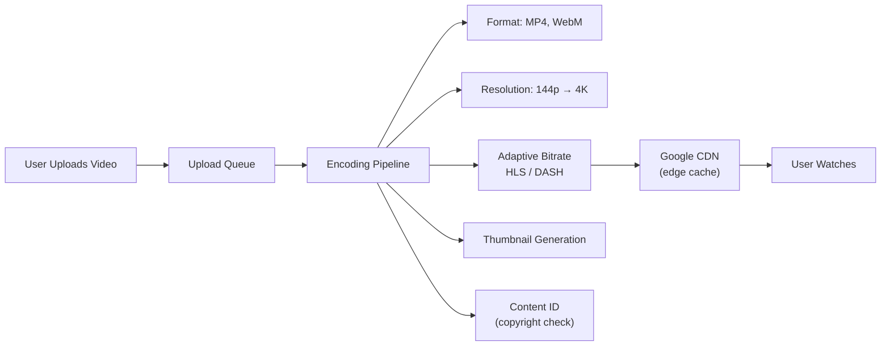
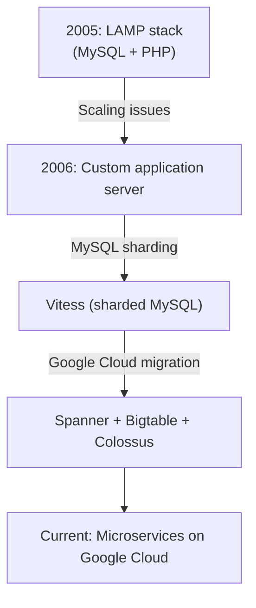
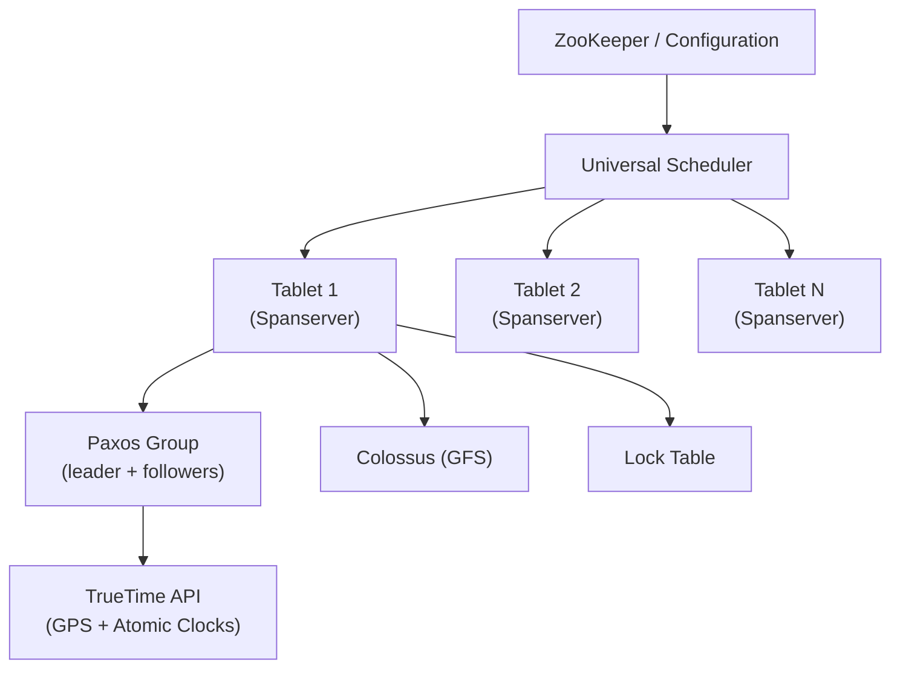
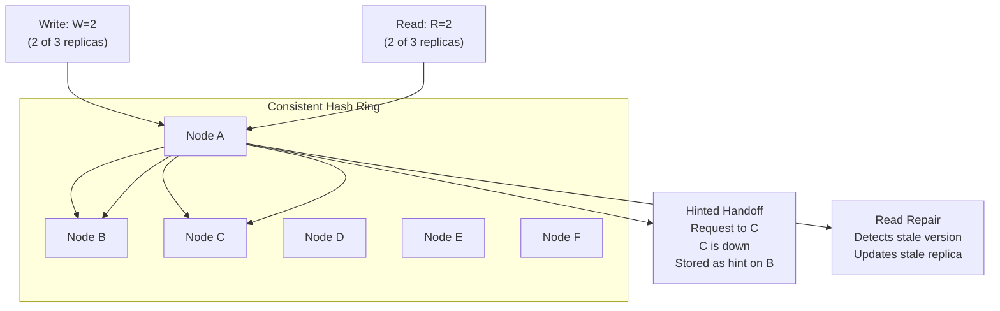

# Case Study: YouTube, Google Spanner, DynamoDB

> [!summary] Goal
> Learn from YouTube's video streaming pipeline, Google Spanner's globally consistent database, and DynamoDB's highly available key-value store.

## Table of Contents

1. [YouTube](#youtube)
2. [Google Spanner](#google-spanner)
3. [Amazon DynamoDB](#amazon-dynamodb)
4. [Common Patterns Across All Three](#common-patterns-across-all-three)

---

## YouTube

### Video streaming pipeline



### Encoding pipeline

```text
Upload → various formats and resolutions:

144p (256×144):     ~1 Mbps   → mobile slow connection
360p (640×360):     ~5 Mbps   → mobile 3G/4G
720p (1280×720):    ~10 Mbps  → HD quality
1080p (1920×1080):  ~15 Mbps  → Full HD
4K (3840×2160):     ~30 Mbps  → UHD

Adaptive Bitrate (ABR):
  Player requests segments based on current bandwidth.
  DASH (Dynamic Adaptive Streaming over HTTP) or HLS (HTTP Live Streaming).
  Video split into 10-second segments; player switches resolution per segment.

Storage:
  Hot: SSD for popular videos (CDN edge + origin)
  Warm: HDD for less popular
  Cold: Tape/Blob for archival
  Each video stored in multiple resolutions = 100-500× the upload size
```

### YouTube architecture evolution



| Era | Database | Storage | Search | CDN |
|-----|:--------:|:-------:|:------:|:---:|
| 2005 | MySQL | Local disk | MySQL LIKE | None |
| 2008 | Vitess (sharded MySQL) | Google File System | Custom inverted index | Akamai |
| 2012 | Bigtable + Vitess | Colossus (GFS v2) | YouTube Search | Google CDN |
| Current | Spanner + Bigtable | Colossus | Deep Neural Nets | Google Global Cache |

### Recommendation system

```text
YouTube's recommendation system has three stages:

1. Candidate Generation (hundreds → hundreds):
   - Collaborative filtering: "users who watched X also watched Y"
   - Content-based: similar topics, tags, description embeddings
   - Deep neural network: user history + video features → candidate pool

2. Ranking (hundreds → tens):
   - Deep neural network: predicts click-through rate (CTR)
   - Features: user history, video age, language, device
   - Expected watch time (not just clicks)

3. Re-ranking (remove duplicates, diversify):
   - Remove videos from same channel (diversity)
   - Remove recently watched (freshness)
   - Balance: new content vs viral content vs subscribed content
```

---

## Google Spanner

### Architecture



### TrueTime API

```text
TrueTime provides globally synchronized time with bounded uncertainty:
  TT.now() returns [earliest, latest]
  Uncertainty ε is typically 1-7ms (GPS + atomic clocks)

  Reading: TT.now().latest
  Writing: TT.now().earliest

External consistency guarantee:
  If transaction T1 commits before T2 starts, T2's timestamp > T1's timestamp.

  This is impossible with NTP alone (clock skew unbounded).
  TrueTime's bounded uncertainty makes it feasible.

Commit wait:
  After a write commits, Spanner waits for ε (max clock uncertainty) before
  making it visible. This ensures that any subsequent transaction in any
  datacenter sees a timestamp after the commit.

  Commit wait = TT.after(transaction_timestamp) — typically 1-7ms
  This is the cost of external consistency across global datacenters.
```

### Spanner's schema

```sql
CREATE TABLE Users (
  id INT64 NOT NULL,
  name STRING(100),
  email STRING(100),
) PRIMARY KEY (id);

CREATE TABLE Posts (
  user_id INT64 NOT NULL,
  post_id INT64 NOT NULL,
  content STRING(MAX),
  timestamp TIMESTAMP OPTIONS (allow_commit_timestamp=true),
) PRIMARY KEY (user_id, post_id),
  INTERLEAVE IN PARENT Users ON DELETE CASCADE;
```

| Feature | Spanner | Traditional NewSQL | NoSQL |
|---------|:-------:|:-----------------:|:-----:|
| **Consistency** | External (strongest) | Strong | Eventual |
| **Global replication** | ✅ Built-in | ❌ Add-on | ❌ Add-on |
| **SQL support** | ✅ Full SQL | ✅ Full SQL | ❌ Limited |
| **Auto-sharding** | ✅ | ⚠️ Manual | ✅ |
| **Transaction isolation** | Serializable | Serializable | None / limited |
| **Read latency (global)** | 5-15ms (local replica) | Depends on leader | 1-5ms (local) |
| **Write latency (cross-region)** | 100-300ms (commit wait) | Not applicable | <10ms (async) |

---

## Amazon DynamoDB

DynamoDB was inspired by the Dynamo paper (2007) — a highly available, eventually consistent key-value store:

### Dynamo architecture



### Key DynamoDB features

| Feature | How it works |
|---------|-------------|
| **Consistent hashing** | Data partitioned across nodes on a ring. Virtual nodes (tokens) for even distribution |
| **Quorum** | N=3 (replication factor), W=2 (write), R=2 (read). W+R > N ensures strong consistency |
| **Hinted handoff** | When a replica is down, another node accepts the write with a hint. Replayed when replica recovers |
| **Vector clocks** | Track causality between concurrent writes. Conflicting versions returned for application resolution |
| **Read repair** | During reads, detect stale replicas and asynchronously update them |
| **Gossip-based membership** | Nodes propagate membership changes via gossip. No central registry |
| **Sloppy quorum** | During partition, accept writes from the first N healthy nodes in the ring (not necessarily the preferred replicas) |

### DynamoDB vs Dynamo paper

```text
DynamoDB (AWS managed service) shares the name but differs from the Dynamo paper:

Paper Dynamo (2007):
  - Decentralized (peer-to-peer)
  - Application handles conflict resolution
  - Eventual consistency (AP from CAP)
  - Used by: Amazon Shopping Cart, Session Management

DynamoDB (2012+):
  - Fully managed, serverless
  - Both eventual AND strong consistency (configurable)
  - Global Tables for multi-region
  - DAX (in-memory cache) for microsecond reads
  - Auto-scaling, on-demand capacity
  - Backup, PITR, TTL, Streams
```

### DynamoDB data model

```text
Primary Key options:
  - Partition Key only (hash): simple lookup
  - Partition Key + Sort Key (hash + range): compound key, range queries

Example — Game leaderboard:
  Partition Key: game_id
  Sort Key: score (descending)
  Attributes: player_name, timestamp, region

  Query: where game_id = "fortnite" → get all scores sorted
  Query: where game_id = "fortnite" AND score > 1000 → range query

GSI (Global Secondary Index):
  Different partition/sort key combination — for alternative access patterns

LSI (Local Secondary Index):
  Same partition key, different sort key — within the same partition
  Must be created at table creation time
```

---

## Common Patterns Across All Three

| Pattern | YouTube | Spanner | DynamoDB |
|---------|---------|---------|----------|
| **Shared-nothing architecture** | ✅ | ✅ | ✅ |
| **Replication for durability** | ✅ (×3+ replicas) | ✅ (Paxos + replicas) | ✅ (N=3, configurable) |
| **Sharding (auto-partitioning)** | ✅ (Vitess) | ✅ (Tablets, auto-split) | ✅ (Partitions, auto-scale) |
| **Eventually consistent reads** | ✅ | ❌ (strong) | ✅ (optional strong) |
| **CDN / edge caching** | ✅ (Google Global Cache) | ✅ (read replicas) | ✅ (DAX cache) |
| **Async processing pipeline** | ✅ (encoding queue) | ✅ (compaction) | ✅ (DynamoDB Streams) |
| **Multi-region replication** | ✅ | ✅ | ✅ (Global Tables) |

---

## Cross-Links

- [[SystemDesign/02_Core/08_Database_Storage_Internals]] for B-tree and LSM-tree internals
- [[SystemDesign/02_Core/04_Consistency_Replication_and_Consensus]] for quorum, replication, consensus
- [[SystemDesign/03_Advanced/05_Distributed_Transactions_and_Consensus]] for Paxos and 2PC
- [[SystemDesign/03_Advanced/01_Multi_Region_Architecture]] for active-active vs active-passive
- [[SystemDesign/02_Core/09_Search_and_Stream_Processing]] for video encoding pipeline and async processing
