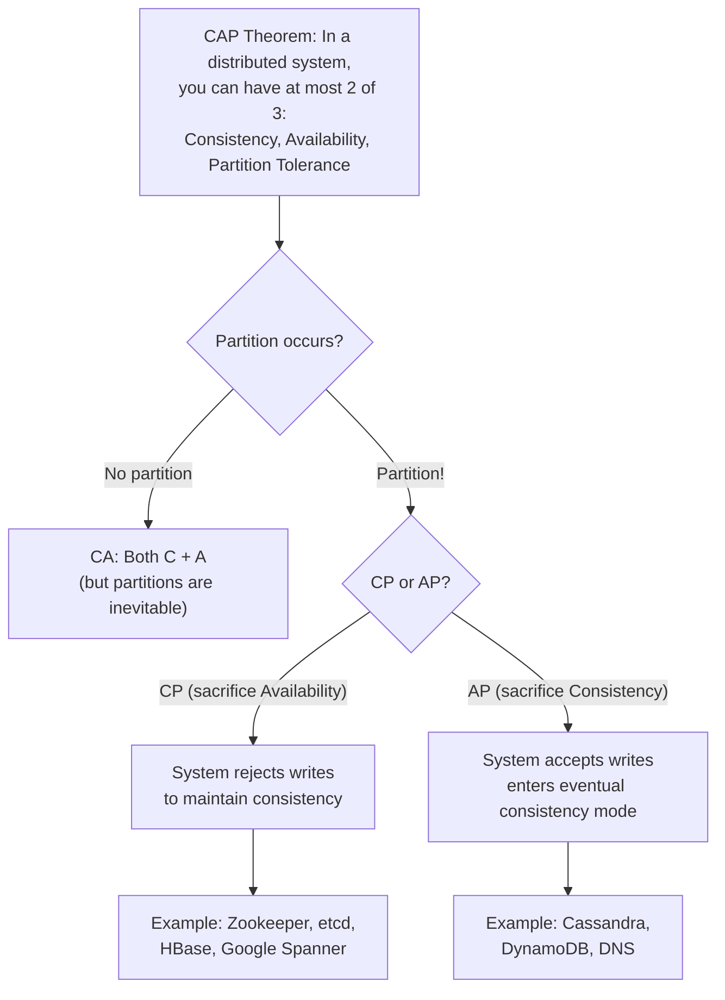
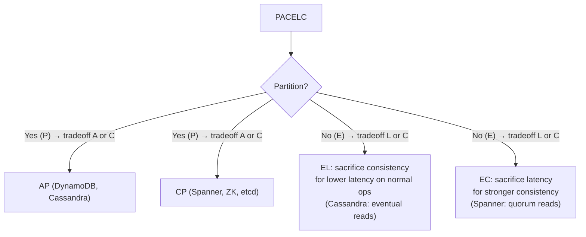
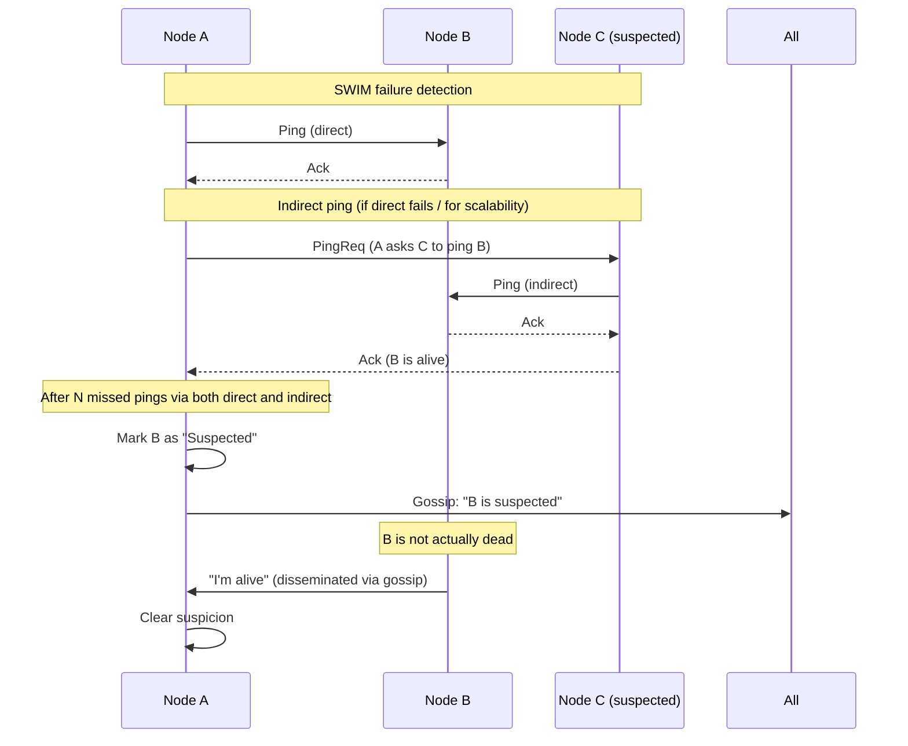
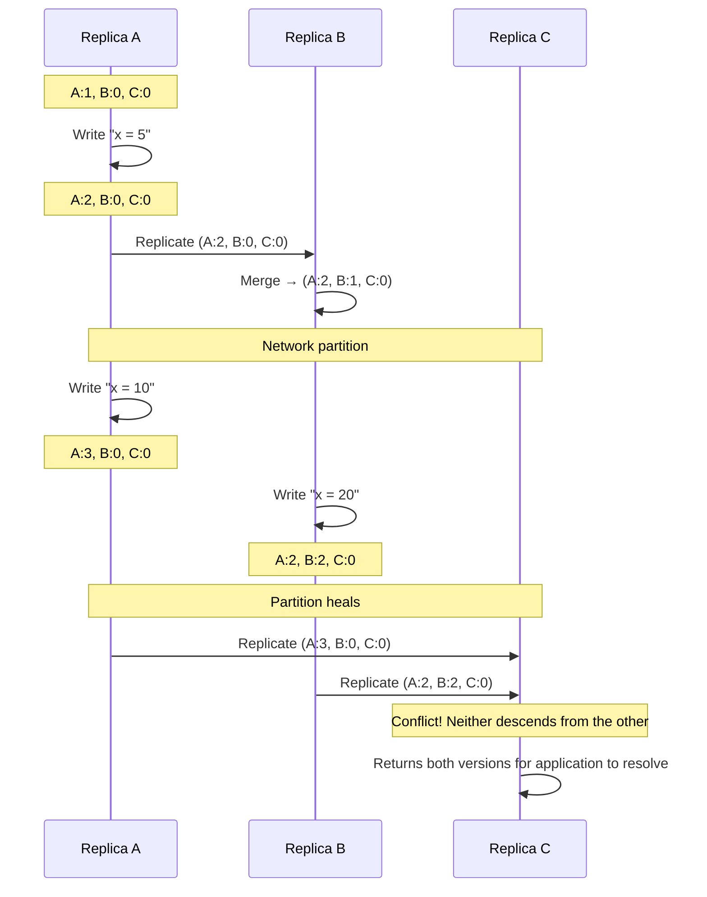
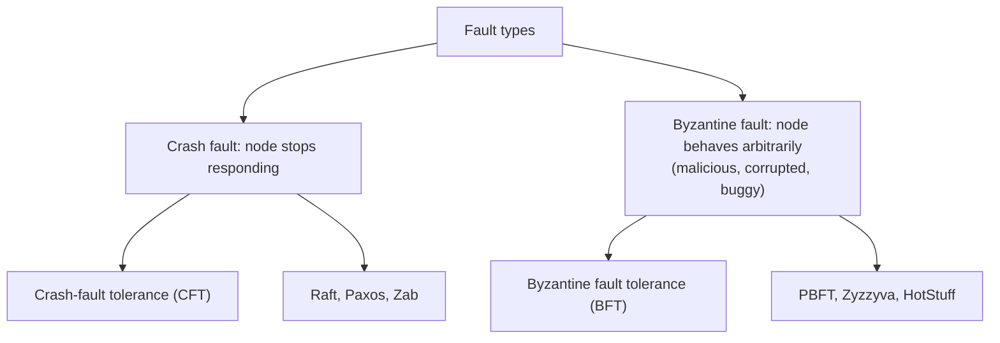

# Distributed Systems Theory

> [!summary] Goal
> Understand the fundamental theorems and protocols of distributed systems: CAP, PACELC, Gossip, CRDTs, vector clocks, clock synchronization, and Byzantine fault tolerance.

## Table of Contents

1. [CAP Theorem](#cap-theorem)
2. [PACELC Extension](#pacelc-extension)
3. [Gossip Protocol Deep Dive](#gossip-protocol-deep-dive)
4. [CRDTs Deep Dive](#crdts-deep-dive)
5. [Vector Clocks](#vector-clocks)
6. [Clock Synchronization](#clock-synchronization)
7. [Byzantine Fault Tolerance](#byzantine-fault-tolerance)
8. [Pitfalls](#pitfalls)

---

## CAP Theorem



| System | Category | Behavior during partition |
|--------|:--------:|--------------------------|
| **ZooKeeper / etcd** | CP | Minority side becomes unavailable; majority continues |
| **Cassandra / DynamoDB** | AP | N=3, W=2, R=2 — writes succeed on the majority side; conflicts resolved later |
| **MongoDB** | CP (default) | Secondary can't accept writes if primary is unreachable |
| **Redis Cluster** | AP | Partition splits the cluster; both sides may accept writes (split-brain) |
| **PostgreSQL** | CA | Single leader, no partitions in a single-node sense |
| **Google Spanner** | CP | Paxos requires majority; TrueTime ensures external consistency |

### Common CAP misinterpretations

```text
❌ "CAP says you must choose 2 out of 3."
   → You don't choose to have partitions. Partitions happen.
   → You choose CP or AP when a partition occurs.

❌ "CAP means consistency or availability — pick one."
   → Without partitions, you can have both C and A.
   → The choice is about what happens during a partition.

❌ "Eventually consistent = not consistent."
   → Eventual consistency means the system will converge.
   → It's a weaker consistency model, not "inconsistent."
```

---

## PACELC Extension

PACELC extends CAP: **if there's a Partition, choose Availability or Consistency; Else, choose Latency or Consistency.**



| System | During partition (P) | Normal operation (E) |
|--------|:-------------------:|:--------------------:|
| **DynamoDB** | AP | EL (eventual reads by default) |
| **Cassandra** | AP | EL (adjustable consistency level) |
| **Spanner** | CP | EC (Paxos majority, TrueTime waits) |
| **ZooKeeper** | CP | EC (sync reads by default) |
| **Cosmos DB** | Configurable | Configurable (tunable consistency) |

---

## Gossip Protocol Deep Dive

### Gossip variants

| Variant | Description | Message complexity | Convergence |
|---------|-------------|:-----------------:|:-----------:|
| **Push** | Node sends its state to random peers | O(n log n) | O(log n) |
| **Pull** | Node requests state from random peers | O(n log n) | O(log n) |
| **Push-Pull** | Both push and pull in the same exchange | O(n log n) | Fastest (~O(log n)/2) |

### SWIM protocol

SWIM (Scalable Weakly-consistent Infection-style Membership) improves gossip:



| SWIM feature | Benefit |
|-------------|---------|
| **Direct + indirect pings** | Handles dropped packets (request 1 node to probe another) |
| **Suspicion phase** | Prevents false positives from brief network hiccups |
| **Dissemination via gossip** | No central registry; membership info self-heals |
| **O(log n) convergence** | Even in large clusters (1000+ nodes) |

### phi-accrual failure detector

```text
Instead of binary "up/down" or timeout-based detection, phi-accrual
maintains a suspicion level (φ) based on historical heartbeat timing:

  φ = -log10(P(likelihood that the node is still alive given elapsed time)

  φ threshold:
    φ < 1:   Probably alive (low suspicion)
    φ = 2:   Moderate suspicion
    φ = 5:   High suspicion — likely dead
    φ > 8:   Almost certainly dead

  Advantages:
    - Adapts to network conditions (no hard timeout)
    - Provides confidence level, not binary decision
    - Works in environments with variable latency

  Used by: Cassandra, Akka, Apache ZooKeeper (adapted)
```

---

## CRDTs Deep Dive

### State-based (CvRDT) — merge operation

```text
Merge(S1, S2) must be:
  Commutative:  merge(A, B) = merge(B, A)
  Associative:  merge(merge(A, B), C) = merge(A, merge(B, C))
  Idempotent:   merge(A, A) = A

Common CvRDT implementations:
```

```text
G-Counter (Grow-only Counter):
  State: vector of counters, one per replica
  Increment: increment own element
  Merge: take element-wise max
  Read: sum of all elements
  Example: [5, 3, 2] → total = 10

PN-Counter (Positive-Negative Counter):
  Two G-Counters: P + N
  Increment: P.inc()
  Decrement: N.inc()
  Merge: merge(P1, P2), merge(N1, N2)
  Read: P.sum() - N.sum()

G-Set (Grow-only Set):
  Elements can only be added, never removed
  Add: insert element into set
  Merge: set union
  Use case: once-added, never-removed (e.g., ip addresses that connected)

OR-Set (Observed-Remove Set):
  Each element has a unique tag (UUID + replica ID)
  Add: element + tag → add to add-set
  Remove: add tag to remove-set
  Merge: (add-set1 ∪ add-set2) ∖ (remove-set1 ∪ remove-set2)
  Effect: concurrent add + remove → add wins (Causal consistency)
```

### Operation-based (CmRDT)

```text
Operation instead of state:
  - Send the operation (not the full state)
  - Operations must be commutative at the receiving end
  - Requires reliable exactly-once delivery

Comparison:
  CvRDT: State (larger messages), at-least-once delivery OK
  CmRDT: Operations (smaller messages), but needs exactly-once or idempotent ops
```

---

## Vector Clocks



### Causality detection

```text
Given two vector clocks V1 and V2:

  V1 < V2 (V1 happens-before V2):
    All elements of V1 ≤ V2, and at least one is strictly <
    Example: (A:2, B:1) before (A:3, B:1)

  V1 || V2 (concurrent):
    Neither V1 < V2 nor V2 < V1
    Example: (A:3, B:0) and (A:2, B:2)
    → Conflict → both versions returned to application

  V1 = V2 (same logical time):
    All elements equal
```

---

## Clock Synchronization

### NTP limitations

```text
NTP accuracy depends on network distance to the time server:
  Local network:   0.1-1ms
  Regional:        1-10ms
  Internet:        10-100ms

Limitations for distributed systems:
  - Clock skew between nodes can be tens of milliseconds
  - "Last-write-wins" using wall clocks loses data
  - Hard to order events across nodes with wall clocks alone
```

### Hybrid Logical Clocks (HLC)

```text
HLC = physical clock (wall time) + logical counter

On receiving a message with timestamp T_msg:
  l = max(local_physical_time, T_msg.logical)
  if l == local_physical_time: c = max(c + 1, T_msg.counter + 1)
  else: c = T_msg.counter + 1

Properties:
  - Always advances (monotonic)
  - Bounded by physical clock skew (ε)
  - Detects concurrent events (same HLC → compare process IDs)
  - Space-efficient: 64 bits (48 bits wall, 16 bits counter)

Used by: CockroachDB, Spanner (with TrueTime), MongoDB
```

---

## Byzantine Fault Tolerance



| Aspect | Crash Fault Tolerance (CFT) | Byzantine Fault Tolerance (BFT) |
|--------|:--------------------------:|:-------------------------------:|
| **Failure model** | Nodes crash or stop | Nodes may lie, collude, send arbitrary messages |
| **Minimum nodes** | 2f + 1 (to tolerate f failures) | 3f + 1 (to tolerate f faulty nodes) |
| **Complexity** | Medium | High |
| **Performance** | High (thousands of ops/sec) | Low (hundreds of ops/sec) |
| **Used by** | etcd (Raft), ZK (Zab) | Blockchain (PBFT, Tendermint) |
| **Key property** | Safety under majority | Safety under 2/3 majority |

### Practical BFT

```text
PBFT (Practical Byzantine Fault Tolerance):
  - Requires 3f + 1 nodes
  - Tolerates up to f Byzantine faulty nodes
  - Three phases: pre-prepare, prepare, commit
  - O(n²) message complexity

Modern BFT systems:
  - HotStuff: O(n) message complexity, used in Libra/Diem
  - Tendermint: used in Cosmos blockchain
  - HoneyBadgerBFT: asynchronous BFT (no FLP violation)

In practice:
  Most distributed systems don't need BFT — crash faults are the common case.
  BFT is essential in: blockchain, cryptocurrency, critical infrastructure.
```

---

## Pitfalls

### Assuming CAP is a static choice

CAP activates only during partitions. Your system can be CA 99.99% of the time and switch to CP or AP during the 0.01% when a partition occurs. DynamoDB supports both eventual and strong consistency — the tradeoff is latency, not just partition behavior.

### Vector clock growth unbounded

In a system with N replicas, vector clocks grow O(N) counters. After many replica additions/removals, the clock size can be large. Periodically truncate vector clocks by agreeing on a common version. Cassandra limits clock size by removing entries for decommissioned nodes.

### Using wall clocks for conflict resolution

Last-write-wins with NTP-synchronized wall clocks can lose writes due to clock skew. A node with a fast clock always wins. Use hybrid logical clocks (HLCs) that combine wall time with logical counters, or use vector clocks for non-LWW workloads.

### Failure detector too aggressive

A phi-accrual failure detector with too-low threshold causes false positives, triggering unnecessary leader elections or replica reassignment. Tune thresholds based on measured network latency variance, not average latency.

### Ignoring Byzantine faults in the threat model

If a compromised node can corrupt your consensus protocol, you lose all guarantees. For most applications, crash faults are sufficient — but add BFT when: multiple parties don't trust each other (blockchain), or a single compromised node could corrupt the global state.

---

> [!question]- Interview Questions
>
> **Q: What does CAP theorem actually say?**
> A: CAP says that when a network partition occurs, you must choose between Consistency (all nodes see the same data) and Availability (every request gets a response). Without partitions, you can have both. The theorem is about the partition case — not an eternal choice.
>
> **Q: What is PACELC and how does it extend CAP?**
> A: PACELC extends CAP: if there's a Partition (P), choose Availability or Consistency (A or C). ELSE (E), choose Latency or Consistency (L or C). This captures the tradeoff in normal operation: lower latency with weaker consistency (EL) or higher latency with strong consistency (EC).
>
> **Q: How does the gossip protocol achieve convergence?**
> A: Each node periodically exchanges state with a random peer. Information spreads exponentially — after O(log n) rounds in an n-node cluster, every node has the information. Push-pull gossip (both send and receive updates in one exchange) converges fastest.
>
> **Q: What is the difference between a vector clock and a hybrid logical clock?**
> A: Vector clocks track causality per replica (O(N) counters), detecting concurrent writes accurately but growing with replica count. HLC combines physical time with a logical counter (constant size, 64 bits), bounded by clock skew. HLC is more space-efficient but provides weaker causality tracking.
>
> **Q: When would you use Byzantine Fault Tolerance instead of crash fault tolerance?**
> A: Use BFT when nodes can behave maliciously — for example, in a blockchain where nodes don't trust each other, or in a financial system where a compromised validator could corrupt the ledger. For most distributed systems (databases, configuration stores), crash faults are the only concern and CFT (Raft/Paxos) is sufficient and far more performant.

---

## Cross-Links

- [[SystemDesign/02_Core/04_Consistency_Replication_and_Consensus]] for quorum and consistency models
- [[SystemDesign/03_Advanced/04_Data_Consistency_Playbook]] for conflict resolution in practice
- [[SystemDesign/03_Advanced/05_Distributed_Transactions_and_Consensus]] for Raft, Paxos, and FLP
- [[SystemDesign/03_Advanced/07_Case_Study_YouTube_Google_DynamoDB]] for DynamoDB vector clock usage
- [[SystemDesign/02_Core/08_Database_Storage_Internals]] for MVCC and version tracking
