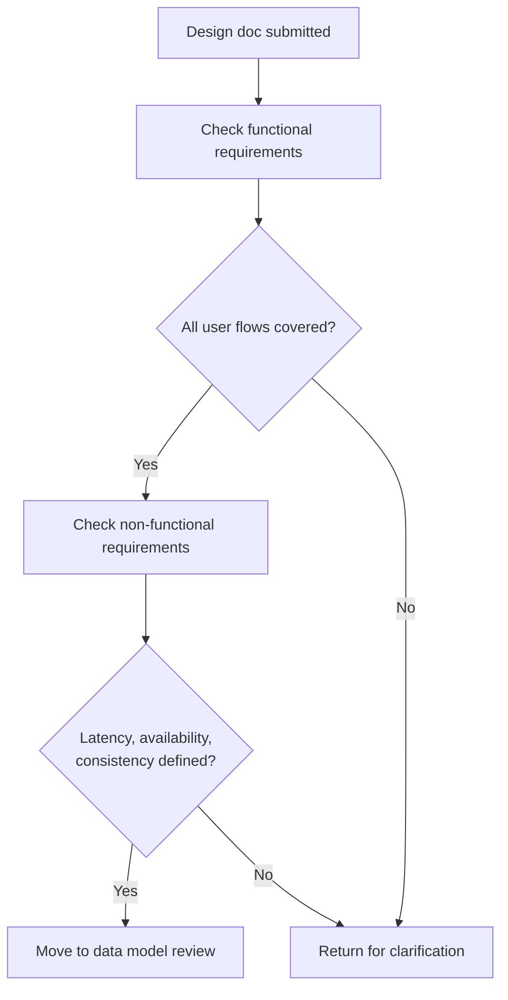
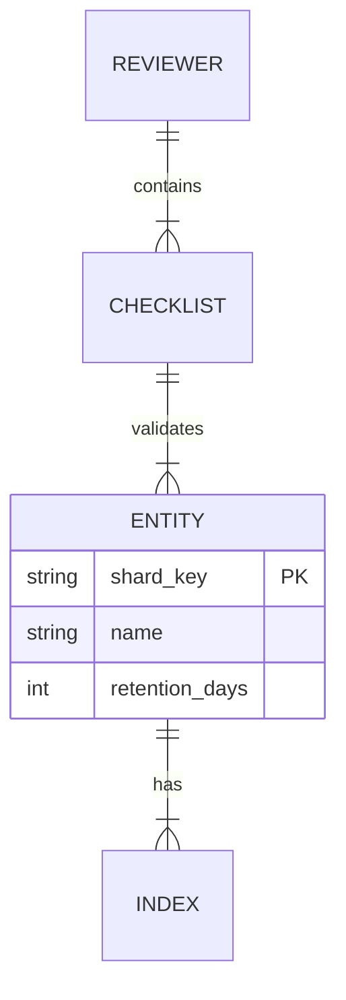
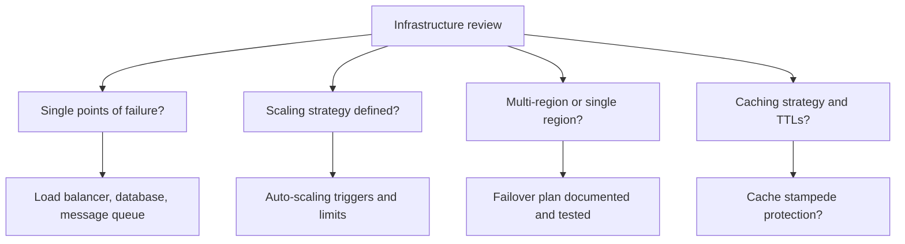

# Playbook: Design Review Checklist

> [!summary] Goal
> Systematically review a system design to catch common issues before they reach production. Use this checklist for design docs, architecture reviews, and interview prep.

## Table of Contents

1. [Requirements Review](#requirements-review)
2. [Data Model Review](#data-model-review)
3. [API Design Review](#api-design-review)
4. [Infrastructure Review](#infrastructure-review)
5. [Security Review](#security-review)
6. [Operations Review](#operations-review)

---

## Requirements Review

- [ ] Core user flows documented (create, read, update, delete, search)
- [ ] Actors identified (user, admin, system)
- [ ] Multi-tenancy requirements captured
- [ ] AuthN/AuthZ boundaries defined
- [ ] Latency targets (p50, p95, p99) specified
- [ ] Availability target (SLO) specified
- [ ] Consistency model specified (strong vs eventual)
- [ ] Durability / data loss tolerance defined
- [ ] Scale targets: DAU, QPS, storage, bandwidth
- [ ] Must-have vs nice-to-have priorities listed

---

## Data Model Review

- [ ] Entities, relationships, and cardinality documented (ER diagram)
- [ ] Primary keys and shard keys identified
- [ ] Indexes planned for all query patterns
- [ ] Data lifecycle: archival, retention, deletion policy
- [ ] Data growth projection over 1/3/5 years
- [ ] Denormalization justified (read performance vs write complexity)
- [ ] Consistency guarantees per entity (strong vs eventual)
- [ ] Conflict resolution strategy (if multi-leader or leaderless)

---

## API Design Review

- [ ] RESTful resource naming follows conventions (plural nouns, `/v1/`)
- [ ] Idempotency key support for mutating POST endpoints
- [ ] Pagination strategy for list endpoints (cursor vs offset)
- [ ] Rate limiting per endpoint/tenant documented
- [ ] Error response format standardised
- [ ] Versioning strategy (URL path vs header vs query param)
- [ ] Timeouts and retry budget defined per endpoint
- [ ] Backward compatibility for existing clients

---

## Infrastructure Review

- [ ] Load balancing (L4 vs L7) appropriate for the protocol
- [ ] Auto-scaling configured with min/max limits
- [ ] Database connection pooling configured
- [ ] Read replicas defined for read-heavy workloads
- [ ] Cache layer defined (local vs distributed vs CDN)
- [ ] Cache eviction policy and TTLs configured
- [ ] CDN strategy for static assets
- [ ] Service discovery mechanism (DNS, Consul, K8s)
- [ ] Health check endpoints: readiness + liveness

---

## Security Review

- [ ] Authentication: OAuth2, API keys, JWT?
- [ ] Authorization: RBAC or per-resource?
- [ ] TLS everywhere (in-transit encryption)
- [ ] Secrets management (Vault, AWS Secrets Manager)
- [ ] Input validation and sanitization
- [ ] Rate limiting per tenant / IP
- [ ] DDoS protection (Cloudflare, AWS Shield)
- [ ] Audit logging for sensitive operations

---

## Operations Review

- [ ] Deployment strategy: rolling, blue/green, canary
- [ ] Rollback plan documented
- [ ] Monitoring dashboards for RED metrics
- [ ] Alerts configured with severity levels
- [ ] Runbook for common failure scenarios
- [ ] Backup and restore tested
- [ ] Disaster recovery plan (RPO, RTO defined)
- [ ] Cost estimation (compute, storage, bandwidth)
- [ ] On-call rotation and escalation path defined

---

## Cross-Links

- [[SystemDesign/01_Foundations/01_Requirements_and_Capacity_Estimation]] for requirements clarity
- [[SystemDesign/04_Playbooks/02_Incident_Playbook_Retry_Storms]] for operations review relevance
- [[SystemDesign/04_Playbooks/03_MultiRegion_Readiness_Checklist]] for multi-region-specific checks
- [[SystemDesign/02_Core/05_Observability_Logs_Metrics_Traces]] for monitoring and dashboards
