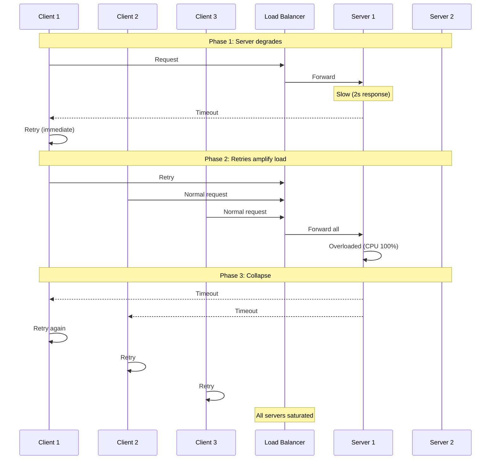
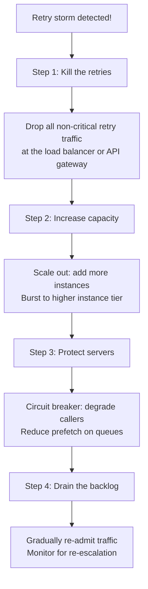

# Playbook: Incident — Retry Storms

> [!summary] Goal
> Diagnose and stop a retry storm before it cascades into a full system outage. Understand the causes, detection signals, and immediate mitigations.

## Table of Contents

1. [Retry Storm Anatomy](#retry-storm-anatomy)
2. [Detection Signals](#detection-signals)
3. [Immediate Mitigations](#immediate-mitigations)
4. [Root Causes](#root-causes)
5. [Long-Term Fixes](#long-term-fixes)

---

## Retry Storm Anatomy



### The amplification effect

```text
Normal state:
  10,000 QPS → all succeed

After degradation (p99 increases from 200ms → 2s):
  Throughput drops from 10,000 → 5,000
  Queue grows → more timeouts → more retries

With 50% of clients retrying:
  5,000 successful + 5,000 normal + 5,000 retries = 15,000 QPS
  Server handles 5,000 → 10,000 more timeouts → more retries
  → Throughput drops further → eventually 0 (collapse)
```

---

## Detection Signals

| Signal | Threshold | What it means |
|--------|:---------:|---------------|
| **Error rate increase** | > 2× baseline | Something is failing — investigate before retries amplify |
| **Retry ratio** | Retries > 10% of total requests | Clients are retrying aggressively — potential storm forming |
| **Queue depth growth** | Queue > 2× normal | Server can't keep up — requests piling up |
| **p99 latency cliff** | p99 > 3× baseline | Not just slower — requests are timing out |
| **Success rate drop + retry rate increase** | Both moving in opposite directions | Classic retry storm pattern |
| **CPU at 100% but throughput dropping** | CPU saturated, QPS flat/falling | Spending all CPU on queueing/retrying, not processing |

---

## Immediate Mitigations



### Step-by-step

```text
1. Kill retries immediately
   - Deploy rate limit to 429 retry traffic
   - Or restart load balancer to drop in-flight retries
   - Use configuration flag: RETRY_ENABLED=false

2. Add capacity
   - Increase replica count (K8s: kubectl scale deployment)
   - Activate standby instances
   - If cloud: switch to larger instance type

3. Protect servers
   - Reduce LB connection queue
   - Tighten timeout on slow endpoints
   - Enable circuit breakers on downstream dependencies

4. Drain backlog
   - Re-admit traffic at 50% → 75% → 100%
   - If queues have accumulated, reprocess at a controlled rate
   - Monitor error rate and p99 latency for re-escalation
```

---

## Root Causes

| Cause | How it happens | Prevention |
|-------|---------------|------------|
| **No backoff on retries** | Client retries immediately — same request hits same overloaded server | Exponential backoff + jitter |
| **Retry budget too large** | Client retries 10 times — retry storm lasts 10× longer | Max 3 retries, circuit breaker after 5 failures |
| **No jitter** | All clients retry simultaneously — thundering herd | Add random jitter to retry timing |
| **Aggressive health check** | LB retries unhealthy server immediately — makes recovery impossible | Passive health checks, cooldown period |
| **Cascading retry** | Service A retries → overloads Service B → B's retries overload Service C | Deadline propagation, circuit breaker per hop |
| **Synchronous fallback** | Fallback calls another service — shifts load instead of reducing it | Return degraded response, don't retry in fallback |

---

## Long-Term Fixes

- Implement circuit breakers on all downstream calls
- Use exponential backoff with full jitter (see [[SystemDesign/01_Foundations/04_APIs_Idempotency_and_Retries]])
- Set deadline propagation (gRPC: `grpc-timeout` header)
- Monitor retry ratio as an alerting metric
- Run game days: simulate retry storms and practice mitigation
- Add `Retry-After` header to all 429/503 responses
- Implement client-side retry budgets (max X% of requests can be retries)

---

## Cross-Links

- [[SystemDesign/01_Foundations/04_APIs_Idempotency_and_Retries]] for retry strategy fundamentals
- [[SystemDesign/03_Advanced/03_Resilience_Patterns]] for circuit breakers and timeouts
- [[SystemDesign/03_Advanced/02_Backpressure_and_Load_Shedding]] for rate limiting mitigations
- [[SystemDesign/02_Core/05_Observability_Logs_Metrics_Traces]] for monitoring retry signals
