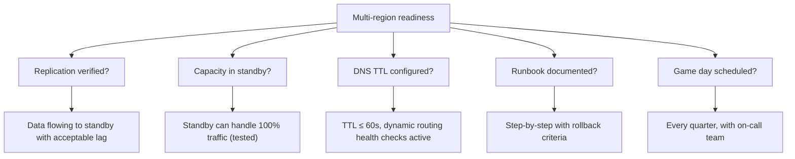
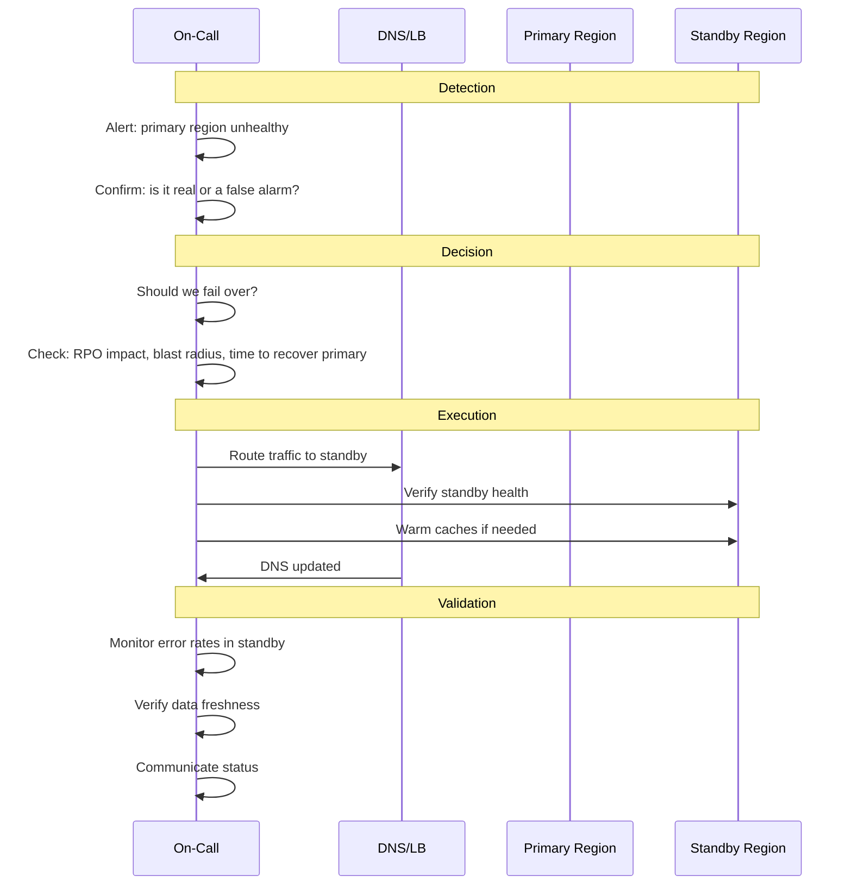

# Playbook: Multi-Region Readiness Checklist

> [!summary] Goal
> Ensure your multi-region architecture is actually ready for failover. Test assumptions with game days and validate every component of the DR plan.

## Table of Contents

1. [Pre-Failover Checklist](#pre-failover-checklist)
2. [Game Day Scenarios](#game-day-scenarios)
3. [Failover Execution](#failover-execution)
4. [Post-Failover Validation](#post-failover-validation)

---

## Pre-Failover Checklist



### Checklist

- [ ] Cross-region replication configured and verified (both directions)
- [ ] Replication lag < RPO target (monitor and alert on lag)
- [ ] Standby region has compute capacity for 100% traffic
- [ ] Standby database sized and provisioned
- [ ] Caches in standby can be warmed (or pre-warmed)
- [ ] DNS TTL set to minimum (60s or lower)
- [ ] Geo-routing health checks active (Route53, CloudDNS, etc.)
- [ ] TLS certificates provisioned for all regions
- [ ] Monitoring dashboards cover both regions
- [ ] Alerts configured for region-level health
- [ ] Runbook documented with step-by-step failover procedure
- [ ] Rollback criteria defined (when to abort failover)
- [ ] On-call team trained on the runbook
- [ ] Game day scheduled and attended in the last quarter

---

## Game Day Scenarios

| Scenario | What to simulate | Expected outcome |
|----------|-----------------|------------------|
| **Primary region network failure** | Block all traffic to primary region | Traffic routes to standby within 60s |
| **Database primary failure** | Kill the primary database instance | Read replicas promote, writes queue or redirect |
| **Cache cluster failure** | Stop all Redis nodes in primary | App falls back to DB (withstand load) or routes to standby |
| **DNS provider outage** | Make DNS records unavailable | App uses cached DNS or alternative resolver |
| **Gradual degradation (not binary)** | Slow down primary region (not kill) | Partial traffic shifted, no oscillation |
| **Chaos: random component failure** | Kill random instances across regions | No user-impacting failure |

### Game day checklist

```text
Before:
  [ ] Scope defined: which region, which services, which failure
  [ ] Blast radius: no real user impact (use shadow traffic or test accounts)
  [ ] Rollback criteria: known signals to abort
  [ ] Observability: dashboards ready to monitor

During:
  [ ] Inject failure
  [ ] Measure: time to detection, time to failover, time to recovery
  [ ] Record unexpected failures (components that didn't behave as expected)

After:
  [ ] Retrospective: what broke, what surprised us
  [ ] Action items: fix gaps in runbook, monitoring, or architecture
  [ ] Schedule next game day
```

---

## Failover Execution



### Failover runbook template

```text
1. DETECT
   - Confirm alert: is primary region truly down?
   - Check: cloud console, monitoring dashboards, status page
   - If false alarm: document and close

2. DECIDE
   - Time to recover primary? > RTO → fail over
   - Data loss acceptable? < RPO → fail over
   - If borderline: fail over (availability over consistency)

3. EXECUTE
   - Update DNS or LB to point to standby
   - Scale up standby if needed
   - Warm caches (if pre-warming not already done)
   - Verify: sample requests succeed

4. VERIFY
   - Check: error rate, latency, throughput in standby
   - Check: dependent services in standby
   - Communicate: internal + external status update

5. MONITOR
   - Do NOT auto-failback
   - Monitor standby health continuously
   - Plan failback for next maintenance window
```

---

## Post-Failover Validation

- [ ] All user-facing endpoints return 200 in the new primary region
- [ ] Error rate back to pre-failover baseline
- [ ] p50/p95/p99 latency within normal range
- [ ] Database replication from old primary caught up (no data loss)
- [ ] Background jobs (cron, queues) processing in the new region
- [ ] External dependencies (CDN, third-party APIs) working
- [ ] Monitoring dashboards showing correct data for new primary
- [ ] Alerts configured for the new topology
- [ ] Incident ticket created with timeline
- [ ] Retrospective scheduled

---

## Cross-Links

- [[SystemDesign/03_Advanced/01_Multi_Region_Architecture]] for architecture models
- [[SystemDesign/02_Core/04_Consistency_Replication_and_Consensus]] for cross-region replication
- [[SystemDesign/04_Playbooks/01_Design_Review_Checklist]] for general design review
- [[SystemDesign/02_Core/02_Load_Balancers_and_Service_Discovery]] for DNS and global routing
