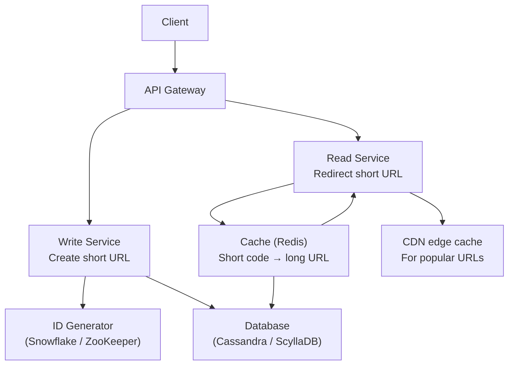
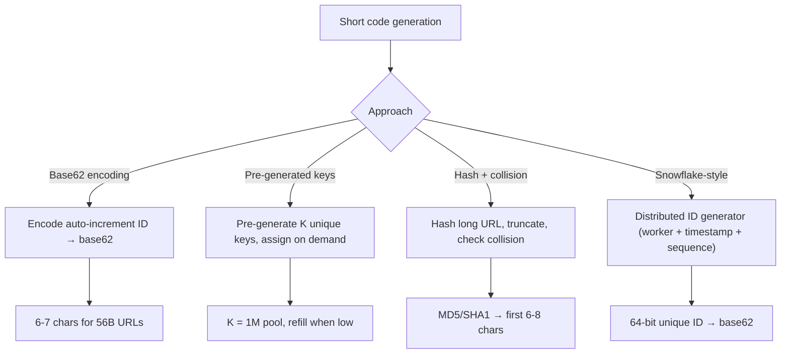
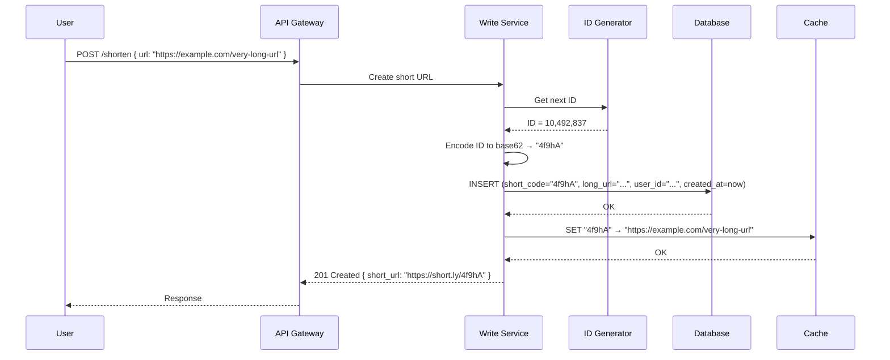
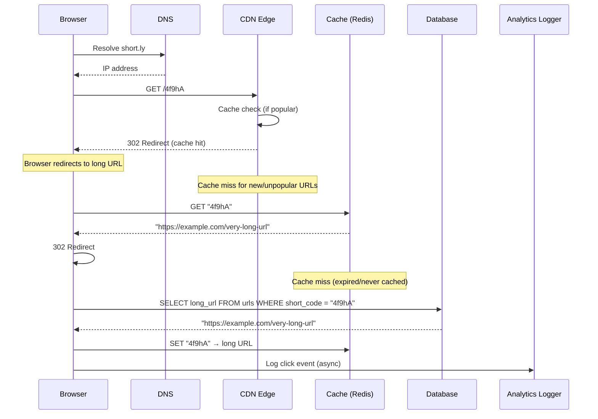
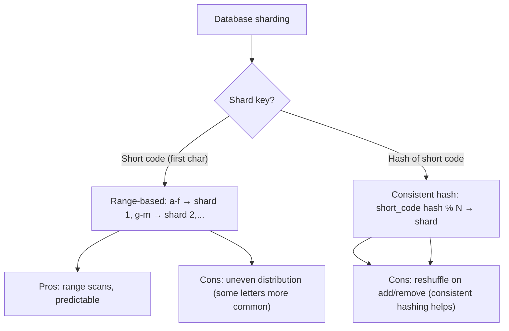

# Project: Design a URL Shortener

> [!summary] Goal
> Design a scalable URL shortening service like TinyURL or Bitly. Cover ID generation, redirection, analytics, and sharding.

## Table of Contents

1. [Requirements](#requirements)
2. [Architecture Overview](#architecture-overview)
3. [ID Generation](#id-generation)
4. [Write Path](#write-path)
5. [Read Path (Redirection)](#read-path)
6. [Sharding Strategy](#sharding-strategy)
7. [Pitfalls](#pitfalls)

---

## Requirements

### Functional

- User submits a long URL → get a short URL (e.g., `https://short.ly/abc123`)
- Visiting the short URL → 302 redirect to the long URL
- Optional: custom alias (user chooses the short code)
- Optional: expiration (TTL for short links)
- Track click count per short URL

### Non-functional

- 100M URLs created/month → ~3.3M/day
- 10K writes/second at peak
- 100K reads/second (redirects) — 10:1 read-to-write ratio
- p99 redirect latency < 50ms (redirects must be fast)
- 99.99% availability (broken links are user-visible)

### Capacity estimation

```text
URLs created:  100M/month = 3.3M/day ≈ 38 writes/sec average, 380/sec peak
Redirects:     1B/month = 33M/day ≈ 380 reads/sec average, 3,800/sec peak
Storage:
  - Per URL: ~500 bytes (short code + long URL + user_id + created_at + click_count)
  - 3.3M × 500 bytes = 1.65 GB/day = ~600 GB/year
  - × 3 replication = ~1.8 TB/year
```

---

## Architecture Overview



---

## ID Generation

The short code must be unique and reasonably short. Several approaches:



| Approach | Length | Collisions? | Performance | Distributed? |
|----------|:------:|:-----------:|:-----------:|:------------:|
| **Base62 encoding** | 7 chars (62^7 ≈ 3.5T) | No (sequential) | Fast (increment) | No (single writer) |
| **Pre-generated keys** | 7 chars | No (pre-allocated) | Fastest (local assign) | Yes (pre-generate batches) |
| **Hash + truncate** | 6-8 chars | Yes (need collision check) | Medium (hash + DB check) | Yes |
| **Snowflake** | 11 chars (base62) | No (unique per worker) | Fast (local generate) | Yes |

### Recommended: Base62 encoding with distributed sequences

```text
Base62 alphabet: [a-z, A-Z, 0-9] = 62 characters

For 7 characters: 62^7 ≈ 3.5 trillion unique URLs
For 8 characters: 62^8 ≈ 218 trillion

Encoding: auto-increment ID → base62
  125 → "db" (2 chars)
  10,000 → "q0U" (3 chars, still short)
  1,000,000 → "4c92" (4 chars)

ID source: Snowflake-style or database sequence with range batching
  Each app server pre-allocates a range: [1000, 2000), [2000, 3000), etc.
  No single point of failure for ID generation
```

---

## Write Path



---

## Read Path (Redirection)



---

## Sharding Strategy



### Recommended: Consistent hashing on short code

```text
Shard count: 256 virtual nodes (or use Cassandra which handles this natively)

Read path:
  hash("4f9hA") % 256 → shard node
  Cache: Redis cluster with same consistent hashing

Write path:
  Same hash → same shard
  No cross-shard joins needed (each URL is a single row)

Growth: add nodes to the ring, only 1/N of keys move
```

---

## Pitfalls

### Redirect status: 301 vs 302

301 (permanent redirect) is cached by browsers — subsequent visits skip the shortener entirely, so you can't count clicks. 302 (temporary redirect) is not cached — every visit hits the shortener, enabling analytics. Use 302 for analytics, 301 only if you never need to change the destination.

### Single-point ID generator

A single auto-increment database for IDs is a SPOF and throughput bottleneck. Use distributed ID generation:
- Snowflake (Twitter): worker_id + timestamp + sequence — no coordination needed
- Range batching: each app server pre-allocates a block of 10K IDs

### Hot shard for popular links

A Bitly link shared on Twitter creates a read storm on a single shard. Mitigate with:
- CDN caching for popular URLs (Cache-Control: public, max-age=3600)
- Redis replica shards for hot keys
- Local cache per app server as a first line of defense

---

> [!question]- Interview Questions
>
> **Q: How would you generate unique short codes?**
> A: Use base62 encoding of a unique integer ID. The ID source can be a database sequence with range batching (each server pre-allocates a range) or Snowflake-style (worker + timestamp + sequence). This gives reversible short codes without collisions. For 7 characters, 62^7 ≈ 3.5T unique URLs.
>
> **Q: Why use 302 instead of 301 for redirection?**
> A: 301 is cached by browsers — subsequent visits bypass the shortener, so you can't track clicks or update the destination. 302 is not cached — every visit hits the shortener, enabling analytics. Use 302 unless you're certain the destination will never change.
>
> **Q: How would you handle a hot short URL that goes viral?**
> A: Cache at multiple layers: CDN edge (Cache-Control), Redis replicas, and local server cache. The CDN absorbs the bulk of reads. Redis replicas spread the remaining read load. Consistent hashing ensures even shard distribution.
>
> **Q: How do you estimate storage for a URL shortener?**
> A: Per URL: short code (7 bytes), long URL (avg 200 bytes), user_id (8 bytes), created_at (8 bytes), click_count (4 bytes) ≈ 250 bytes raw. With indexes and replication ×3: ~1 KB per URL. For 100M URLs/month: ~100 GB/month storage growth.
>
> **Q: How do you shard the URL database?**
> A: Consistent hash on the short code. This distributes URLs evenly across shards, allows elastic growth (add/remove shards with minimal rebalancing), and supports both reads and writes with the same key.

---

## Cross-Links

- [[SystemDesign/01_Foundations/01_Requirements_and_Capacity_Estimation]] for capacity math
- [[SystemDesign/02_Core/01_Caching_Strategies]] for CDN + Redis caching layers
- [[SystemDesign/02_Core/04_Consistency_Replication_and_Consensus]] for database replication
- [[SystemDesign/03_Advanced/04_Data_Consistency_Playbook]] for handling concurrent writes
- [[SystemDesign/01_Foundations/03_Data_Modeling_Basics]] for sharding strategies
