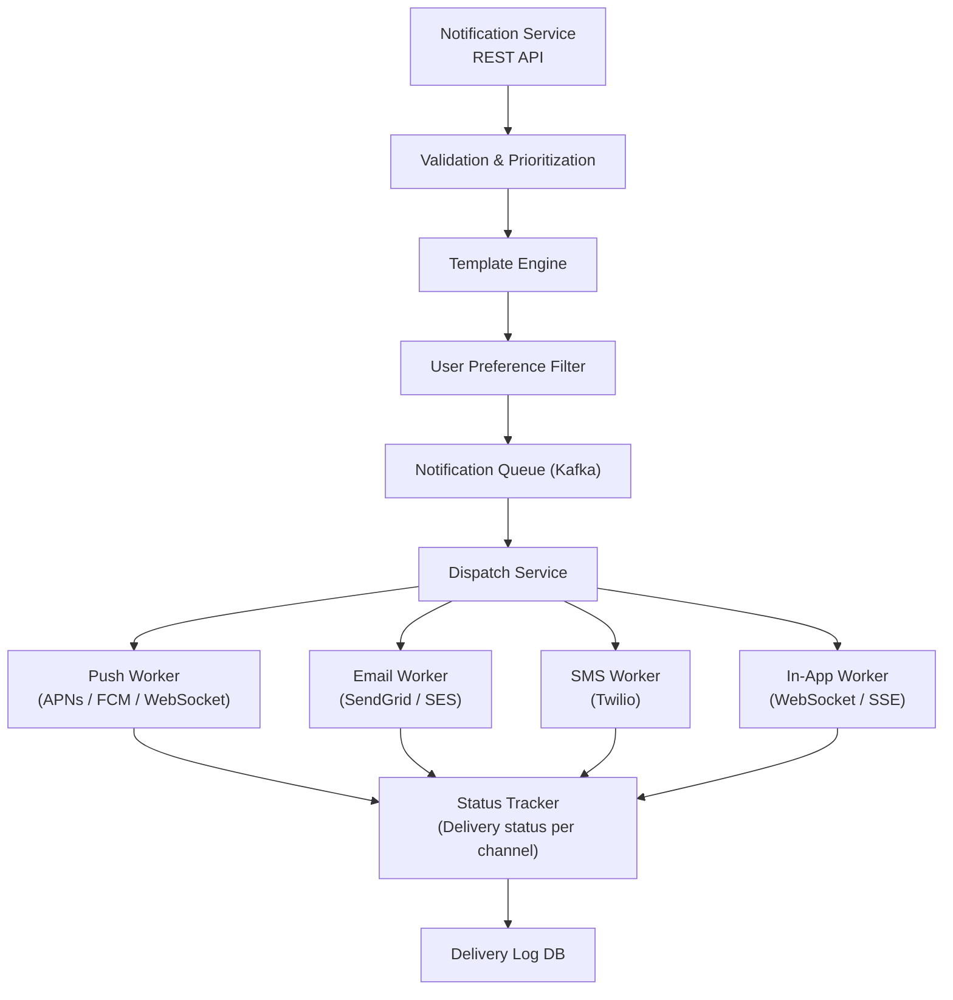
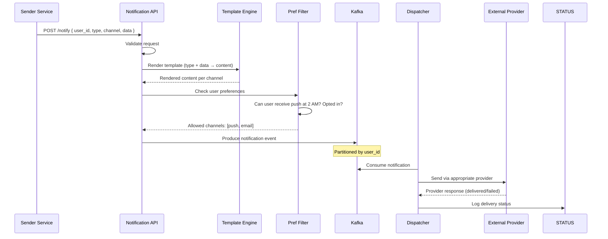
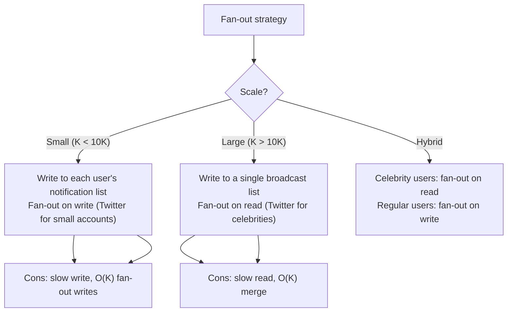
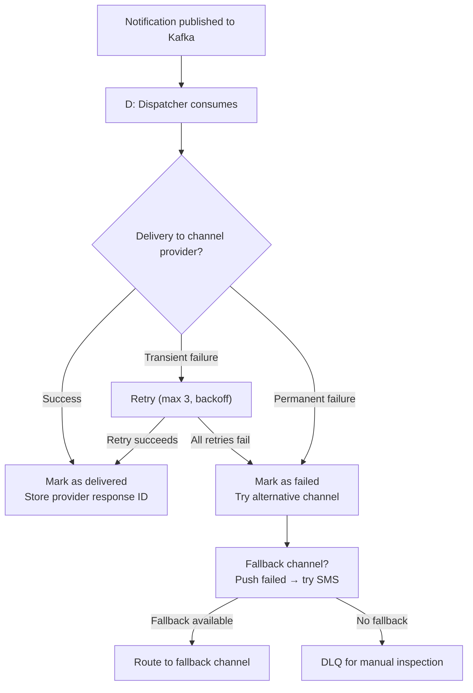

# Project: Design a Notification System

> [!summary] Goal
> Design a scalable notification system that delivers push notifications, emails, and SMS to millions of users. Handle templating, delivery guarantees, user preferences, and rate limiting.

## Table of Contents

1. [Requirements](#requirements)
2. [Architecture Overview](#architecture-overview)
3. [Notification Pipeline](#notification-pipeline)
4. [Fan-Out Patterns](#fan-out-patterns)
5. [Delivery Guarantees](#delivery-guarantees)
6. [Pitfalls](#pitfalls)

---

## Requirements

### Functional

- Send notifications via push, email, SMS, in-app
- Users can choose which channels they prefer (per notification type)
- Template-based notification content
- Rate limiting per user/channel (don't spam)
- Delivery tracking (sent, delivered, read, bounced)
- Scheduled/batched notifications (digest mode)

### Non-functional

- 10M push notifications/day
- 5M emails/day
- 1M SMS/day
- Peak: 10K notifications/second (during campaigns)
- p99 delivery latency < 1 second (push), < 5 minutes (email)
- At-least-once delivery (no missed notifications)
- 99.99% availability

### Capacity estimation

```text
Notifications/day:  16M
Peak rate:          10K/sec (breaking news, campaign)
Storage:
  - Per notification: ~1KB (template + user_id + channel + status + timestamps)
  - 16M × 1KB = 16 GB/day
  - × 30 days retention = 480 GB
  - × 3 replication = 1.44 TB

Async processing:
  - Push: WebSocket / APNs / FCM
  - Email: SMTP relay (SendGrid, AWS SES)
  - SMS: Twilio, AWS SNS
```

---

## Architecture Overview



---

## Notification Pipeline



### Template engine

```text
Template: "Hello {{name}}, your order {{order_id}} has shipped!"

With data: { name: "Alice", order_id: "ORD-12345" }
Rendered: "Hello Alice, your order ORD-12345 has shipped!"

Per channel variations:
  Push: short, action-oriented ("Your order shipped! Track it →")
  Email: full HTML with branding
  SMS: plain text, character-limited
  In-App: rich text with clickable links
```

---

## Fan-Out Patterns

Fan-out is the process of delivering a notification to all followers/subscribers.



| Pattern | Write cost | Read cost | Use case |
|---------|:----------:|:---------:|----------|
| **Fan-out on write** | O(K) | O(1) | Small follower counts (< 10K) |
| **Fan-out on read** | O(1) | O(K) | Large follower counts (celebrity) |
| **Hybrid** | O(min followers, threshold) | O(1 + merge) | Mixed follower distribution |
| **Pull-based** | O(1) | O(K) | Batch digests, daily summaries |

### Hybrid approach

```text
For each user posting a notification:
  1. Count their followers
  2. If followers < 10,000 (threshold):
     Fan-out on write: write to each follower's inbox
  3. If followers >= 10,000:
     Write to a broadcast list (one entry)
     Followers pull on read: merge their inbox + broadcast lists

Threshold tuned based on:
  - Average write QPS
  - Storage cost per notification copy
  - Read latency SLAs
```

---

## Delivery Guarantees



### Delivery status

| Status | Meaning | Action |
|--------|---------|--------|
| **PENDING** | Queued, not yet dispatched | Normal |
| **SENT** | Accepted by provider (APNs, SendGrid, Twilio) | Wait for callback |
| **DELIVERED** | Provider confirmed delivery to device/inbox | Done |
| **READ** | User interacted (opened app, clicked link) | Analytics |
| **BOUNCED** | Invalid address, unsubscribed, device token expired | Remove from active list |
| **FAILED** | Max retries exhausted | Try fallback or DLQ |

---

## Pitfalls

### Rate limiting per channel

APNs/FCM throttle connections. AWS SES has sending limits. Twilio has rate limits per number. If you exceed them, your provider bans you. Implement per-channel rate limiting with token bucket:

```text
Push: 1000/second per provider connection
Email: 500/second per SES configuration set
SMS: 10/second per phone number (compliance requirement)
```

### No user preference check

Sending a push notification at 3 AM to a user who set "do not disturb" is a terrible experience. Always check user preferences per notification type. Store preferences in Redis for fast lookup on the hot path.

### Notification flooding

A single event (e.g., "someone liked your post") should produce a single notification, not 50. Implement coalescing: batch notifications of the same type from the same source within a time window (e.g., "5 people liked your post").

### Template injection

If templates accept user-generated content without sanitization, a malicious user can inject links, bypass rate limits, or craft phishing messages. Sanitize all content that goes into templates server-side.

### Missing delivery confirmation

Without tracking delivery status, you don't know if APNs rejected a device token (user uninstalled the app) or if SES is bouncing emails. Process delivery callbacks and update user channel status accordingly. Remove invalid tokens/addresses from your active lists.

---

> [!question]- Interview Questions
>
> **Q: How would you fan out notifications to millions of followers?**
> A: Use a hybrid approach. For users with few followers (<10K), fan-out on write — write the notification to each follower's inbox. For celebrities with many followers, fan-out on read — write once to a broadcast list, and followers merge their inbox with broadcast lists on read. This balances write cost with read latency.
>
> **Q: How do you handle rate limits from push notification providers?**
> A: Implement per-channel rate limiting with token buckets. APNs/FCM have connection-level limits — maintain multiple connections and distribute notifications across them. Queue excess notifications and retry with backoff. Monitor rejection rates and alert on provider throttling.
>
> **Q: How do you ensure at-least-once delivery?**
> A: Use Kafka as the persistent notification queue. Dispatchers consume and commit offsets only after receiving a delivery confirmation from the provider. On failure, retry up to 3 times with exponential backoff. After max retries, move to DLQ and try a fallback channel (e.g., push fails → SMS).
>
> **Q: How do you handle notification preferences?**
> A: Store user preferences per notification type and channel. On the notification path, check preferences before templating and dispatching. Cache preferences in Redis with a short TTL (5 minutes) to avoid DB load on the hot path. Allow users to set quiet hours and per-type opt-outs.
>
> **Q: How would you implement notification coalescing (e.g., "5 people liked your post")?**
> A: Use a time-windowed buffer in Redis. When a "like" event arrives, increment a counter and update the last event timestamp. If no new events arrive within 60 seconds, flush the buffered notification. This combines multiple like events into a single notification.

---

## Cross-Links

- [[SystemDesign/02_Core/03_Queues_and_Event_Driven_Architecture]] for Kafka-based async processing
- [[SystemDesign/01_Foundations/04_APIs_Idempotency_and_Retries]] for retry and idempotency
- [[SystemDesign/03_Advanced/02_Backpressure_and_Load_Shedding]] for rate limiting provider calls
- [[SystemDesign/03_Advanced/03_Resilience_Patterns]] for circuit breakers on external providers
- [[SystemDesign/03_Advanced/01_Multi_Region_Architecture]] for multi-region notification delivery
