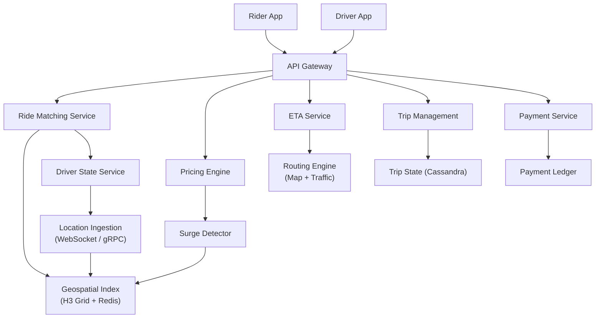
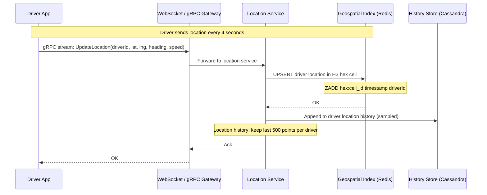
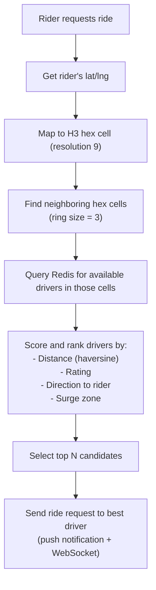
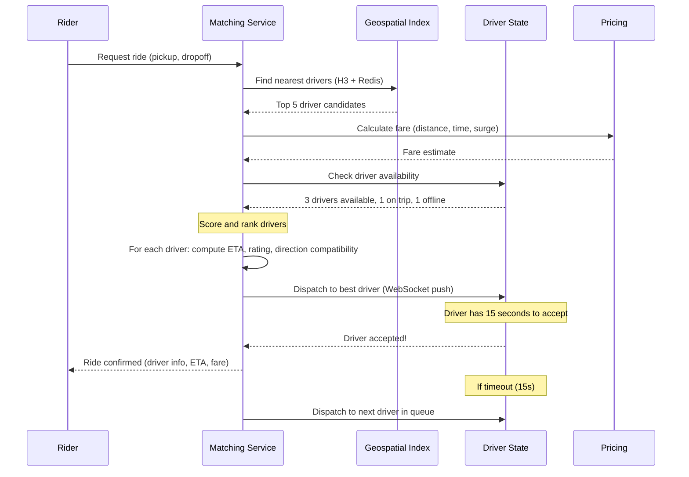
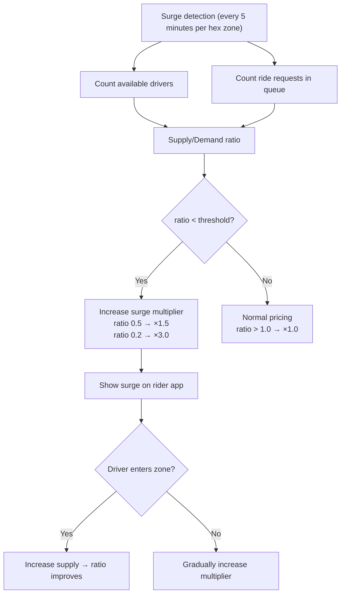

# Project: Design Uber / Lyft

> [!summary] Goal
> Design a ride-hailing system covering real-time location tracking, ride matching, surge pricing, and ETA calculation at global scale.

## Table of Contents

1. [Requirements](#requirements)
2. [Architecture Overview](#architecture-overview)
3. [Location Ingestion](#location-ingestion)
4. [Geospatial Indexing](#geospatial-indexing)
5. [Ride Matching](#ride-matching)
6. [Surge Pricing](#surge-pricing)
7. [ETA Calculation](#eta-calculation)
8. [Pitfalls](#pitfalls)

---

## Requirements

### Functional

- Rider requests a ride → matched with the nearest available driver
- Rider sees real-time driver location on map
- Driver sees ride requests and accepts/rejects
- Pricing based on distance, time, and surge multiplier
- ETA shown to rider before and during the ride
- Ride history for both rider and driver

### Non-functional

- 10M active riders/day, 2M active drivers/day
- 50M ride requests/day across 500+ cities
- Peak: 5K requests/second (rush hour in major cities)
- p99 ride matching latency < 500ms
- Driver location update: every 4 seconds via gRPC
- 99.99% availability (people depend on rides)

### Capacity estimation

```text
Daily ride requests:     50M
Peak QPS:                50,000 (evening rush)
Driver locations/sec:    2M / 4 = 500K updates/sec
Storage:
  - Ride record: ~1KB → 50M × 1KB × 90 days retention = 4.5 TB
  - Driver location: ephemeral (Redis), ~1KB per driver
  - Historical location: ~100 bytes/update × 500K/sec → compress/aggregate
```

---

## Architecture Overview



---

## Location Ingestion



### Handling high-frequency updates

```text
Challenge: 500K location updates/second from 2M drivers.

Solutions:
  1. gRPC streaming (not HTTP polling) — persistent connection, no handshake per update
  2. In-memory geospatial index (Redis) — no disk writes for ephemeral location
  3. Batch writes to history store — write every 10th update, aggregate the rest
  4. Client-side throttling — reduce update frequency when driver is stopped
  5. Server-side sampling — random sample X% of updates for analytics

Network bandwidth:
  500K updates/sec × 50 bytes (protobuf) = 25 MB/sec ingress
  Well within a cluster's capacity (single 10G NIC = 1.25 GB/sec)
```

---

## Geospatial Indexing



### H3 hexagonal grid

```text
Why hexagons (H3) over squares (geohash)?

  Square (geohash): 8 neighbors, 2 different distances (corner vs edge)
  Hexagon (H3):     6 neighbors, all the same distance

  Uniformity matters for:
    - Fair pricing (boundary decisions)
    - Consistent search radius
    - Surge pricing zones (no gaps or overlaps)

H3 resolutions:
  res 9  → hexagon area ≈ 0.1 km² (city block level)
  res 10 → hexagon area ≈ 0.015 km² (street level)
  res 8  → hexagon area ≈ 0.7 km² (neighborhood level)

Redis data structure per hex cell:
  ZADD hex:res9:872830b2f 1623456789 driver_42
  ZADD hex:res9:872830b2f 1623456784 driver_55
  
  Query: ZRANGEBYSCORE hex:res9:872830b2f (now - 10s) now
  → returns drivers whose location was updated in the last 10 seconds
```

---

## Ride Matching

### Matching flow



### Matching scoring function

```text
score = w1 × (1/distance) + w2 × rating + w3 × direction_match + w4 × surge_bonus

Where:
  distance: haversine distance (km) between driver and pickup
  rating: driver's star rating (1-5)
  direction_match: is driver heading toward pickup, or away?
  surge_bonus: 0 in surge zone, 1 if no surge (drivers in surge areas)
  w1, w2, w3, w4: tuned by ML models

Goal: minimize rider wait time while maximizing driver efficiency
```

---

## Surge Pricing



### Surge zones

```text
Surge zones are NOT per-city — they're per-H3 hex cluster:
  - Downtown Manhattan: surge ×3.0 (after concert)
  - Upper East Side: surge ×1.2 (normal variation)
  - JFK Airport: surge ×2.5 (flight arrivals)

Multiplier factors:
  ×1.0 = no surge (normal pricing)
  ×1.5 = light surge
  ×2.5 = medium surge
  ×4.0+ = extreme surge (rare, major events)

Pricing transparency:
  Rider sees the surge multiplier on the request screen.
  Rider can accept the surge price or wait for it to decrease.
  No surge pricing during emergencies (legal/compliance).
```

---

## ETA Calculation

```text
Simple ETA: distance / average speed in the zone

Better ETA (Uber uses):
  1. Route planner: compute shortest path using road network (OpenStreetMap or Google Maps)
  2. Traffic model: historical speed per road segment × current traffic multiplier
  3. Traffic signals: add estimated wait time per traffic light
  4. Real-time corrections: driver's actual speed vs predicted speed

Traffic model:
  Historical data: speed per 5-minute bucket per road segment
  Real-time data: Uber drivers' current speeds on the same roads
  Combining: weighted average with recency bias

Final ETA = min(route_time × 1.1, route_time + 2min)
  (add 10% or 2 minutes minimum buffer — better to arrive early than late)
```

---

## Pitfalls

### Location update processing under load

During rush hour, location updates flood the ingestion pipeline. Use gRPC streaming to reduce connection overhead, batch writes to history, and sample location data for non-critical consumers (analytics). Location in Redis is ephemeral — if Redis fails, drivers' last known location is lost.

### Driver "stalking" the surge zone

Drivers see surge zones and drive to them. If too many drivers converge on one zone, supply exceeds demand, and the surge collapses. Uber manages this by: (a) surging larger areas (neighborhood, not street corner), (b) showing heat maps with slight delay, (c) not showing exact surge boundaries.

### Matching storm during surge

During surge, many riders request simultaneously. If the matching service processes synchronously, it creates a thundering herd. Use a queue: rider requests enter a per-zone matching queue, and the matching service processes them at a controlled rate.

### ETA oscillation

Driver gets closer → ETA decreases → rider waits → driver passes pickup → ETA increases. Frequent ETA changes confuse riders. Smooth ETA updates: update no more than once per 5 seconds, use moving average.

### Ghost rides

A driver accepts a ride but doesn't move, or cancels after accepting. Rider is stranded. Mitigations: (a) driver tracking — if driver isn't moving toward pickup, alert rider, (b) automatic re-dispatch if driver cancels within 2 minutes, (c) penalty for driver cancellations after acceptance.

---

> [!question]- Interview Questions
>
> **Q: How would you find nearby drivers for a ride request?**
> A: Use a geospatial index with H3 hexagonal grid and Redis. Map the rider's location to an H3 hex cell. Query for available drivers in that cell and surrounding cells (ring of 3). Score and rank by distance, rating, and direction. Store driver locations as sorted sets per hex cell with TTL-based expiry.
>
> **Q: How does surge pricing work?**
> A: Surge pricing adjusts based on supply/demand ratio per geospatial zone. If ride requests exceed available drivers, the multiplier increases. Higher prices attract more drivers to the area (increasing supply) and reduce demand (fewer riders willing to pay). The multiplier is calculated per zone every few minutes.
>
> **Q: How do you handle 500K location updates per second?**
> A: Use gRPC streaming for persistent connections, Redis for ephemeral location storage (no disk writes), batch writes to history store (aggregate before writing), and client-side throttling (reduce frequency when stopped). Network bandwidth is manageable: 500K × 50 bytes protobuf = 25 MB/sec.
>
> **Q: How does ETA estimation work?**
> A: Basic: distance/average speed. Better: route planning using road network data, historical traffic patterns per road segment × real-time traffic multiplier, traffic signal wait estimation, and real-time driver speed correction. Add a 10% buffer for reliability (better to arrive early than late).
>
> **Q: What happens if a driver cancels after accepting?**
> A: Monitor driver movement toward pickup — if no movement after 30 seconds or driver moves away, mark as suspicious. Automatically re-dispatch to the next best driver. Penalize drivers who cancel after acceptance (reduce priority, deactivation for repeated offenses). Notify rider immediately with new driver ETA.

---

## Cross-Links

- [[SystemDesign/02_Core/03_Queues_and_Event_Driven_Architecture]] for ride request queuing
- [[SystemDesign/02_Core/01_Caching_Strategies]] for Redis geospatial indexing
- [[SystemDesign/03_Advanced/02_Backpressure_and_Load_Shedding]] for location update rate limiting
- [[SystemDesign/02_Core/05_Observability_Logs_Metrics_Traces]] for monitoring matching latency
- [[SystemDesign/03_Advanced/06_Case_Study_Netflix_Uber_Twitter]] for Uber's architecture overview
