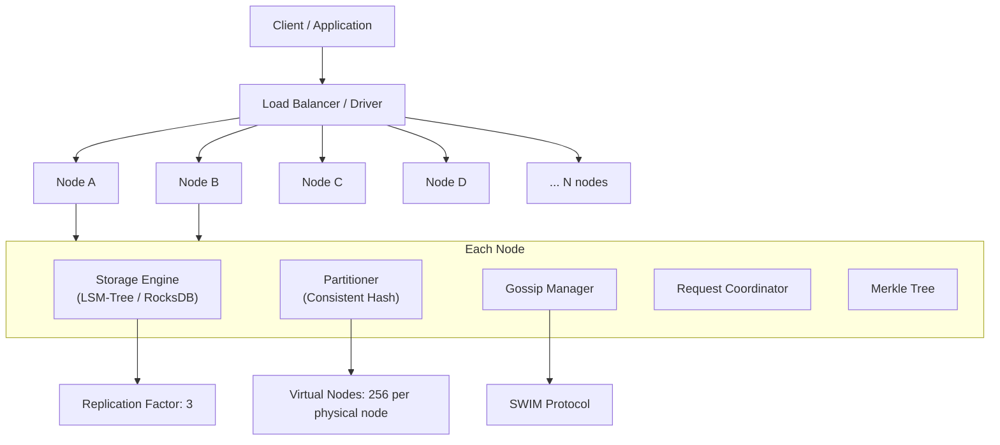
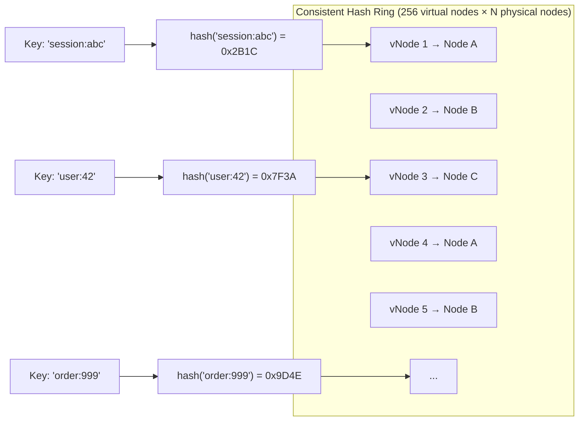
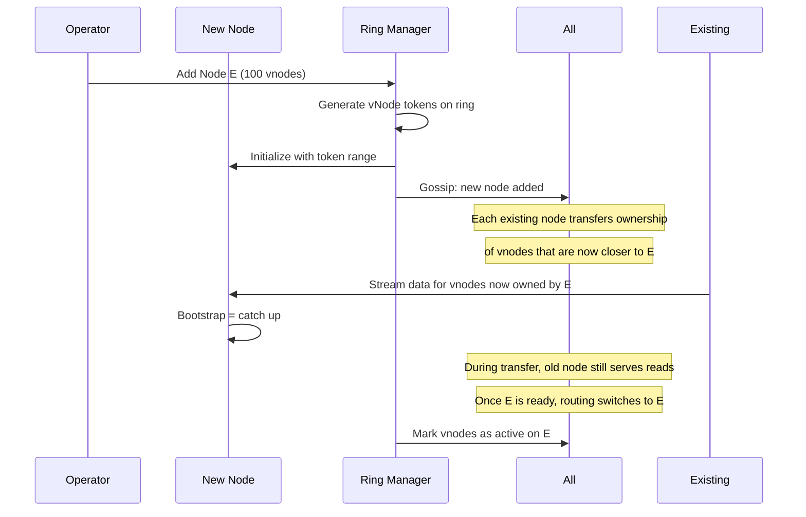
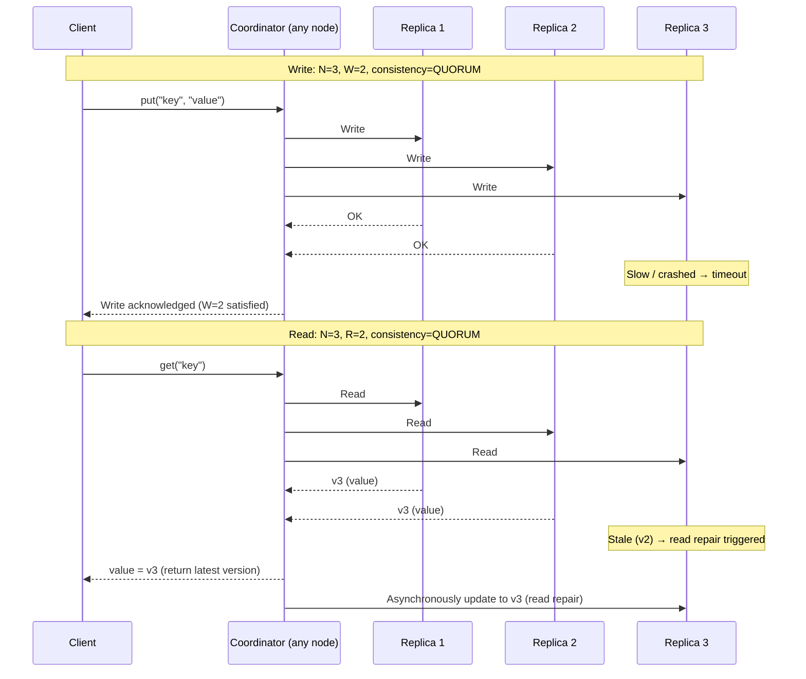
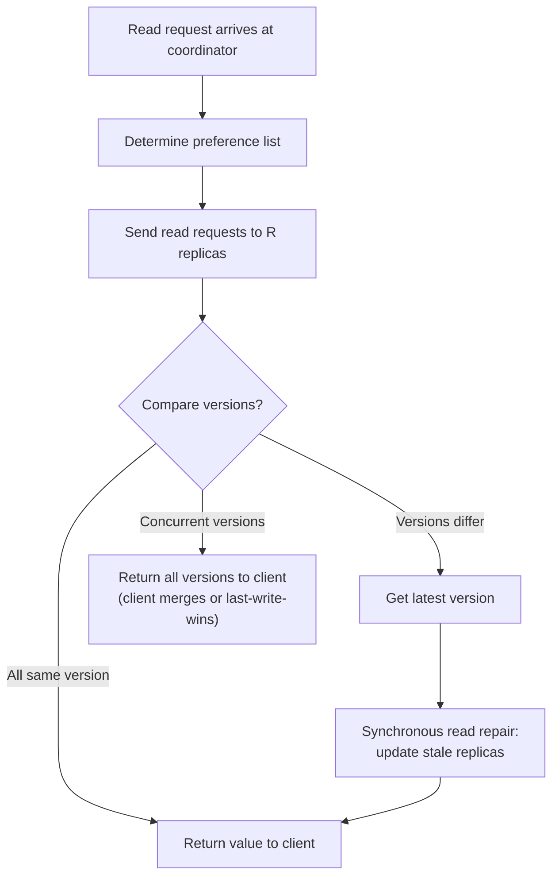
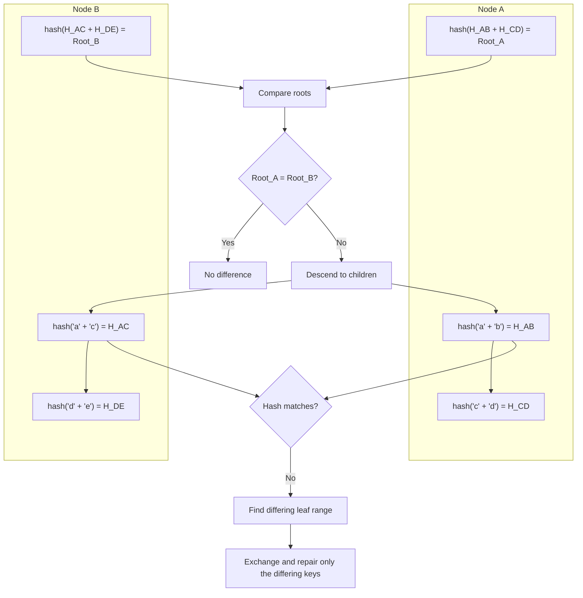
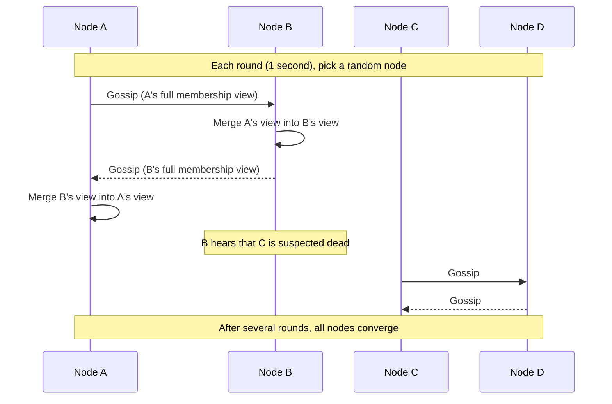
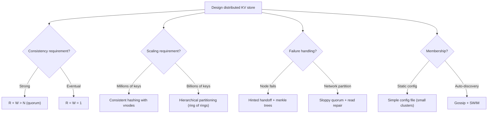

# Project: Design a Distributed Key-Value Store

> [!summary] Goal
> Design a distributed key-value store like DynamoDB or Cassandra. Cover consistent hashing, quorum, hinted handoff, read repair, Merkle trees, and gossip-based membership.

## Table of Contents

1. [Requirements](#requirements)
2. [Architecture Overview](#architecture-overview)
3. [Partitioning — Consistent Hashing](#partitioning-consistent-hashing)
4. [Replication — Quorum](#replication-quorum)
5. [Read and Write Path](#read-and-write-path)
6. [Anti-Entropy — Merkle Trees](#anti-entropy-merkle-trees)
7. [Membership — Gossip](#membership-gossip)
8. [Decision Tree](#decision-tree)
9. [Pitfalls](#pitfalls)

---

## Requirements

### Functional

- `get(key)` → returns value or `NOT_FOUND`
- `put(key, value)` → stores value, overwrites existing
- `delete(key)` → removes value
- Configurable consistency per operation (eventual vs strong)
- Support for primitive types (string, number, binary) and collections

### Non-functional

- 10M QPS reads, 1M QPS writes (10:1 read ratio)
- p99 read latency < 5ms
- p99 write latency < 10ms
- 99.999% availability (5 nines)
- Eventually consistent by default; strong consistency available (at lower availability)
- Linear scalability — add nodes without downtime
- Handle node failures transparently

### Capacity estimation

```text
Keyspace: 1 billion keys
Average value size: 1 KB
Total data: 1 PB
Replication factor: 3
Total storage: 3 PB

Per-node capacity (100 nodes):
  3 PB / 100 nodes / 3 replicas = 10 TB per node (usable)
  With 75% capacity target: ~13 TB per node

Write QPS: 1M distributed across 100 nodes = 10K writes/node
Read QPS: 10M across 100 nodes = 100K reads/node
```

---

## Architecture Overview



---

## Partitioning — Consistent Hashing



### Virtual nodes (vnodes)

```text
Each physical node is represented by multiple virtual nodes on the ring.

Physical node A = vnodes {1, 4, 7, ..., 256}
Physical node B = vnodes {2, 5, 8, ..., 256}
Physical node C = vnodes {3, 6, 9, ..., 256}

Benefits of vnodes:
  1. Load distribution: A node with many vnodes gets proportionally more data
  2. Heterogeneous hardware: powerful nodes get more vnodes, weaker nodes get fewer
  3. Fast rebalancing: when a node fails, its vnodes spread evenly across remaining nodes
  4. Each vnode can be replicated independently

Preference list (for replication factor N=3):
  For key 'user:42':
    Coordinator sends to the next 3 healthy vnodes in the ring
    → vNode X (primary), vNode Y (replica 1), vNode Z (replica 2)
    → These 3 vnodes are on 3 different physical nodes (guaranteed by design)
```

### Adding / removing nodes



---

## Replication — Quorum



### Consistency levels

| Level | W (write) | R (read) | Guarantee |
|-------|:---------:|:--------:|-----------|
| **ONE** | 1 | 1 | No consistency (eventual) |
| **QUORUM** | N/2 + 1 | N/2 + 1 | Strong consistency (N=3, W=R=2) |
| **ALL** | N | N | Strongest, but zero fault tolerance |
| **ANY** | 1 (hinted) | — | Highest write availability (hinted handoff counts) |
| **LOCAL_QUORUM** | Local DC quorum | Local DC quorum | Consistency within one datacenter |

---

## Read and Write Path

### Write path

```mermaid
flowchart TD
    A["Write request arrives at coordinator"] --> B["Determine preference list<br/>(next N healthy vnodes)"]
    B --> C["Send to all N replicas in parallel"]
    C --> D{Count acks?}
    D -->|"≥ W acks"| E["Acknowledge to client"]
    D -->|< W acks"| F["Return 'unavailable' to client"]
    C --> G{"Replica down?"}
    G -->|"Yes"| H["Hinted handoff:<br/>another node accepts the write<br/>stores hint for replay"]
    H --> I{"Hint count growing?"}
    I -->|"Yes"| J["Trigger repair or rebuild replica"]
```

### Read path



---

## Anti-Entropy — Merkle Trees

Merkle trees detect inconsistencies between replicas without comparing every key:



```text
Merkle tree construction:
  1. Partition the key range into leaf segments (e.g., 256 leaves)
  2. For each leaf: hash all keys in that segment → leaf hash
  3. Each internal node: hash of child hashes
  4. Root: hash of top-level children

Comparison:
  1. Exchange root hashes
  2. If roots differ, descend to children at specific levels
  3. Find which leaf segments are different
  4. Exchange only those segments' keys for repair

Complexity:
  Full comparison: O(n) per pair of nodes
  Merkle tree comparison: O(log n) to find differences
  Tree size: proportional to key range (not number of keys)
```

---

## Membership — Gossip



| Gossip state | Description | Size |
|-------------|-------------|:----:|
| **Membership list** | All nodes known, with heartbeat counters | O(n) ~ KB per message |
| **Heartbeat** | Monotonically increasing counter per node | 8 bytes per node |
| **Suspicion** | phi-accrual suspicion level per node | 1 byte per node |
| **Node state** | LOADING, NORMAL, LEAVING, REMOVED | 1 byte per node |

### SWIM integration

```text
SWIM (Scalable Weakly-consistent Infection-style Membership):

Round (every ~1 second):
  1. Pick a random node from membership list
  2. Ping the node:
     - If ack received: include node state in gossip
     - If no ack in timeout: ask K other nodes to ping indirectly
     - If indirect probes also fail: mark as suspected
  3. Disseminate updated membership via gossip messages

Failure detection (phi-accrual):
  φ = -log10(P(current_time - last_heartbeat | expected_distribution))
  
  φ > threshold (e.g., 5) → node is suspected
  Suspected node is not used for reads/writes
  If confirmed dead: remove from membership list
  If node recovers: rejoins as new member with new heartbeat counter
```

---

## Decision Tree



---

## Pitfalls

### Inconsistent data after node recovery

When a node comes back after a long outage, it has stale data. Without anti-entropy (Merkle trees), the stale data persists. Run Merkle tree comparison periodically (every hour) and after node recovery.

### Hot spots despite consistent hashing

If the hash function doesn't distribute keys evenly, some nodes get more traffic. Virtual nodes help, but uneven key distribution (some keys accessed 1000× more) still causes hot spots. Add application-level caching for hot keys.

### Gossip convergence during network issues

In a large cluster (100+ nodes) with network problems, gossip can take minutes to converge. Nodes may be incorrectly suspected as dead, triggering unnecessary replica rebalancing. Tune phi-accrual thresholds conservatively.

### Write-heavy workloads with quorum

W=ALL or W=QUORUM with a slow replica increases write latency. Use W=ONE for latency-sensitive writes and rely on hinted handoff + read repair for eventual consistency. Use W=QUORUM only for critical writes.

### Tombstone buildup on deletes

Deletes create tombstones (markers that a key was deleted). Without compaction, tombstones accumulate, consuming space and slowing reads. Tombstones must outlive the maximum clock skew (to avoid resurrecting deleted data) but should be compacted after that.

---

> [!question]- Interview Questions
>
> **Q: How does consistent hashing work in a distributed KV store?**
> A: Both keys and nodes are placed on a hash ring. Each key is assigned to the next clockwise node. Virtual nodes (vnodes) allow each physical node to own multiple positions on the ring, improving load distribution and enabling heterogeneous hardware. When a node joins or leaves, only K/n keys move (where K=total keys and n=vnodes).
>
> **Q: What is quorum and how do you configure W and R for strong consistency?**
> A: N = replication factor (number of replicas per key). W = nodes that must acknowledge a write. R = nodes that must respond to a read. For strong consistency: W + R > N (ensures read and write sets overlap). For N=3 with strong consistency: W=2, R=2. For eventual consistency: W=1, R=1.
>
> **Q: How does hinted handoff handle temporary failures?**
> A: When a replica is down, another node accepts the write and stores a hint (target node ID + data). When the target node recovers, the hint is replayed. If hints accumulate (node is down for too long), initiate Merkle tree comparison to bring the node fully up to date.
>
> **Q: What is a Merkle tree and why is it used?**
> A: A Merkle tree is a hash tree where leaves represent data segments and internal nodes are hashes of their children. Two nodes can compare their Merkle tree roots — if roots match, all data is identical. If they differ, descend the tree to find the differing leaf segments. This avoids comparing every key-value pair.
>
> **Q: How do you handle new nodes joining the cluster?**
> A: The new node announces itself via gossip. Each existing node identifies vnodes that should be transferred to the new node (consistent hash ring update). Data is streamed to the new node while old nodes still serve reads. Once the new node is bootstrapped, routing is updated. The old nodes release ownership.

---

## Cross-Links

- [[SystemDesign/02_Core/04_Consistency_Replication_and_Consensus]] for quorum and replication strategies
- [[SystemDesign/03_Advanced/08_Distributed_Systems_Theory]] for gossip, vector clocks, and CRDTs
- [[SystemDesign/02_Core/08_Database_Storage_Internals]] for LSM-tree storage engine
- [[SystemDesign/03_Advanced/04_Data_Consistency_Playbook]] for conflict resolution
- [[SystemDesign/03_Advanced/07_Case_Study_YouTube_Google_DynamoDB]] for DynamoDB architecture
