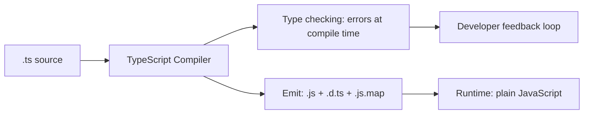
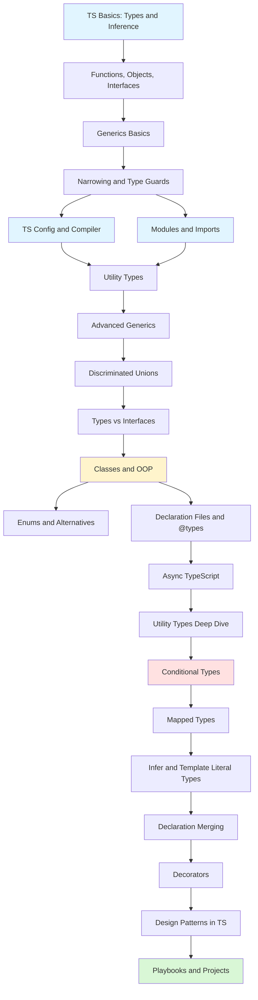

# TypeScript (TS-First)

> [!summary] Scope
> TypeScript from fundamentals through advanced type system patterns: config, modules, generics, conditional/mapped/template literal types, classes, enums, declarations, async, design patterns, testing, linting, migration, React integration, and production tooling.

## Overview

TypeScript is a typed superset of JavaScript that compiles to plain JS:

- **Types exist at compile time only** — fully erased in emitted JS
- **Structural type system** — compatibility is based on shape, not nominal types
- **Inference-first** — let TS deduce types rather than annotating everything
- **Configurable strictness** — `strict: true` enables the full safety net

---

## Learning Path

### How to use this vault

| Path | Focus | Target audience |
|------|-------|-----------------|
| **Foundations → Core** | Everything you need daily | All TS developers |
| **Core → Advanced** | Type-level programming | Library authors, power users |
| **Playbooks** | Production patterns | Backend/frontend engineers |
| **Projects** | Hands-on application | Everyone |

---

## Topic Map

### Foundations (6 files)

#### [[TypeScript/01_Foundations/01_TS_Basics_Types_and_Inference]]
- Core primitives and inference-first approach
- Structural typing, union types, literal types, `as const`
- `satisfies` for type validation without widening
- `any` vs `unknown` vs `never` — when to use each

#### [[TypeScript/01_Foundations/02_Functions_Objects_and_Interfaces]]
- Function types, parameter defaults, rest/optional params
- Object types, excess property checks, index signatures
- Interfaces and extension (`extends`)
- Intersection and union types for compositions

#### [[TypeScript/01_Foundations/03_Generics_Basics]]
- Generic functions with type parameter inference
- Constraints with `extends`, `keyof` constraints
- Default type parameters, multi-parameter generics
- Generic types, interfaces, and classes

#### [[TypeScript/01_Foundations/04_Narrowing_and_Type_Guards]]
- `typeof`, `instanceof`, `in` narrowing
- Discriminated unions and user-defined type guards (`x is T`)
- Assertion functions (`asserts x is T`)
- Exhaustiveness checking with `never`

#### [[TypeScript/01_Foundations/05_TS_Config_and_Compiler]]
- All `strict` mode flags explained
- `target` / `module` / `moduleResolution` combinations
- `paths`, `rootDir`, `outDir`, `declaration` flags
- Project references, performance flags, sample configs

#### [[TypeScript/01_Foundations/06_Modules_and_Imports]]
- ES module syntax: named, default, re-exports, namespace imports
- `import type` / `export type` — zero runtime cost
- Module resolution: Node16, Bundler, classic
- Ambient declarations (`declare module`, `declare global`)

### Core (9 files)

#### [[TypeScript/02_Core/01_Utility_Types]]
- Object utilities: `Partial`, `Required`, `Readonly`, `Pick`, `Omit`, `Record`
- Union utilities: `Exclude`, `Extract`, `NonNullable`
- Function utilities: `Parameters`, `ReturnType`, `Awaited`
- When to use each utility

#### [[TypeScript/02_Core/02_Advanced_Generics]]
- `keyof` and indexed access types (`T[K]`)
- Conditional generic helpers (`KeysOfType`, `PickByType`)
- Variadic tuple types (`[...T, ...U]`, `infer` in tuples)
- Generic inference patterns

#### [[TypeScript/02_Core/03_Discriminated_Unions]]
- Tagged unions with literal discriminant property
- Exhaustiveness checking with `assertNever`
- Multi-level discriminants
- State machine modeling and async Result pattern

#### [[TypeScript/02_Core/04_Types_vs_Interfaces]]
- Overlap: both work for object shapes
- Where only `type` works: unions, mapped, conditional, template literal
- Where only `interface` works: declaration merging, `implements`
- Decision flowchart and performance considerations

#### [[TypeScript/02_Core/05_Classes_and_OOP]]
- Class syntax, property declarations, strict initialization
- Visibility: `public`, `protected`, `private` vs `#private`
- Parameter properties, `abstract` classes, `implements`
- Accessors (`get`/`set`), `static`, `this` parameter

#### [[TypeScript/02_Core/06_Enums_and_Const_Objects]]
- Numeric, string, and `const` enums
- Reverse mapping, member types
- Union of literals and const object alternatives
- Decision flowchart: enum vs union vs const object

#### [[TypeScript/02_Core/07_Declaration_Files_and_AtTypes]]
- `.d.ts` file anatomy and the `declare` keyword
- DefinitelyTyped and `@types` resolution
- Writing declarations for JS libraries
- Triple-slash directives and publishing types

#### [[TypeScript/02_Core/08_Async_TypeScript]]
- `Promise<T>` generics and `async`/`await` inference
- `Awaited<T>` deep unwrapping
- Typing error handling (`try`/`catch` with `unknown`)
- `Promise.all`, `allSettled` tuple inference

#### [[TypeScript/02_Core/09_Utility_Types_Deep_Dive]]
- All 15+ built-in utility types with implementations
- Missing ones: `ConstructorParameters`, `InstanceType`, `ThisParameterType`
- Intrinsic string types: `Uppercase`, `Lowercase`, `Capitalize`, `Uncapitalize`
- Custom utilities: `DeepPartial`, `Mutable`, `UnionToIntersection`, `NoInfer`

### Advanced (7 files)

#### [[TypeScript/03_Advanced/01_Conditional_Types]]
- Basic: `T extends U ? X : Y`
- Distributive behavior over unions (and how to disable it)
- Nested conditional types and chaining
- `infer` in conditionals: `Promise<infer U>`, `(infer U)[]`, function types

#### [[TypeScript/03_Advanced/02_Mapped_Types]]
- `[K in keyof T]` iteration pattern
- Modifiers: `?`, `readonly`, `-?`, `-readonly`
- Key remapping with `as` clause (filter, rename, transform)
- Recursive mapped types (`DeepPartial`)

#### [[TypeScript/03_Advanced/03_Infer_and_Template_Literal_Types]]
- `infer` in conditional types and tuples
- Template literal types with union distribution
- Intrinsic string types for case transformation
- Parsing URL paths, route params, event names at type level

#### [[TypeScript/03_Advanced/04_Typing_Patterns_for_APIs]]
- API results as discriminated unions (`Result<T>`)
- `satisfies` for endpoint configuration
- Function overloads for ergonomic APIs
- Branded/nominal types for type-safe IDs

#### [[TypeScript/03_Advanced/05_Declaration_Merging_and_Augmentation]]
- Interface merging (multiple declarations combine)
- Module augmentation (`declare module 'x'`)
- Global augmentation (`declare global { }`)
- Enum and namespace merging

#### [[TypeScript/03_Advanced/06_Decorators]]
- Legacy `experimentalDecorators` vs TC39 stage 3
- Class, method, property, accessor, parameter decorators
- Decorator factories and evaluation order
- Framework patterns (Angular, NestJS)

#### [[TypeScript/03_Advanced/07_Design_Patterns_in_TypeScript]]
- Factory pattern with discriminated unions
- Builder pattern with fluent typed chains
- Singleton via module-level `as const`
- Strategy pattern, DI container, Repository pattern, Typed Event Emitter

### Playbooks (6 files)

#### [[TypeScript/04_Playbooks/01_Debug_Type_Errors_Systematically]]
- Localize, reduce, check common causes workflow
- Prefer constraints over assertions
- Understanding error messages

#### [[TypeScript/04_Playbooks/02_Model_API_Types_Safely]]
- Discriminated union Result types for API calls
- Generic fetch wrappers
- Validation at trust boundaries

#### [[TypeScript/04_Playbooks/03_Testing_TypeScript]]
- Vitest/Jest setup for TypeScript
- Type-level testing with `tsd` and `vitest-type-assert`
- Testing discriminated unions, generics, async code
- DTS testing patterns

#### [[TypeScript/04_Playbooks/04_Linting_and_Formatting]]
- ESLint + `typescript-eslint` setup (flat config)
- Recommended rule sets: `recommended`, `recommended-type-checked`, `strict-type-checked`
- Prettier integration, pre-commit hooks with Husky
- CI pipeline integration

#### [[TypeScript/04_Playbooks/05_Migrating_JS_to_TS]]
- Incremental: `allowJs`, `@ts-expect-error`, file-by-file
- `@ts-ignore` vs `@ts-expect-error` vs `@ts-nocheck`
- Strict mode adoption strategy
- Migration order: utilities first, entry points last

#### [[TypeScript/04_Playbooks/06_TypeScript_with_React]]
- Component typing: `interface Props` over `React.FC`
- Typing hooks: `useState`, `useReducer`, `useRef`, `useCallback`
- Event handlers, generic components, context
- `forwardRef` and `useImperativeHandle`

### Projects (2 files)

#### [[TypeScript/05_Projects/01_Build_a_Typed_Event_Emitter]]
- Build a type-safe event emitter with generics
- Apply discriminated unions and mapped types

#### [[TypeScript/05_Projects/02_Build_a_TypeSafe_Router_Types]]
- Model routes as template literal types
- Parse path parameters at type level

---

## Cross-Links

- [[React/00_MOC/00_React_MOC]] for React + TypeScript patterns
- [[Angular/00_MOC/00_Angular_MOC]] for Angular + TypeScript
- [[Node/00_MOC/00_Node_MOC]] for Node.js TypeScript backend patterns

---

## References

- [TypeScript Handbook](https://www.typescriptlang.org/docs/handbook/intro.html)
- [TypeScript Playground](https://www.typescriptlang.org/play)
- [TypeScript Release Notes](https://devblogs.microsoft.com/typescript/)
- [typescript-eslint](https://typescript-eslint.io/)
- [DefinitelyTyped](https://github.com/DefinitelyTyped/DefinitelyTyped)
- [React TypeScript Cheatsheet](https://react-typescript-cheatsheet.netlify.app/)
