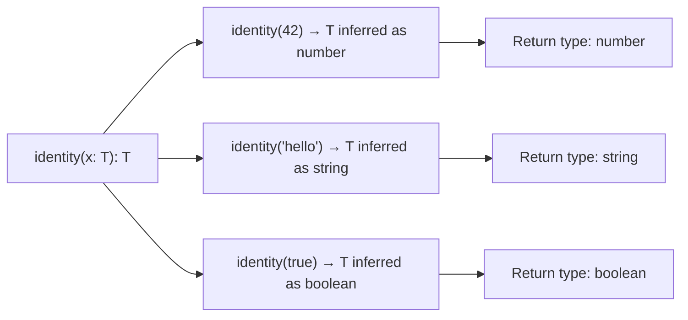

# Generics Basics

> [!summary] Goal
> Write reusable, strongly-typed helpers without losing inference — understand generic functions, constraints, defaults, and how TypeScript infers type parameters.

## Table of Contents

1. [Why Generics Matter](#why-generics-matter)
2. [Generic Functions](#generic-functions)
3. [Type Parameter Inference](#type-parameter-inference)
4. [Constraints with `extends`](#constraints-with-extends)
5. [Generic Types](#generic-types)
6. [Default Type Parameters](#default-type-parameters)
7. [Multiple Type Parameters](#multiple-type-parameters)
8. [Generic Classes](#generic-classes)
9. [Pitfalls](#pitfalls)

---

## Why Generics Matter

Generics let one function, type, or class work with many different types while preserving type safety.



---

## Generic Functions

### Basic generic function

```ts
function identity<T>(x: T): T {
  return x;
}

const a = identity(123);    // T inferred as number
const b = identity('x');    // T inferred as string
const c = identity(true);   // T inferred as boolean
```

### Generic arrow functions

```ts
const identity = <T>(x: T): T => x;

// In JSX (React), use trailing comma to avoid ambiguity with JSX tags:
const identity = <T,>(x: T): T => x;
```

---

## Type Parameter Inference

TypeScript infers type parameters from the arguments:

```ts
function toArray<T>(value: T | T[]): T[] {
  return Array.isArray(value) ? value : [value];
}

const a = toArray(42);         // T inferred as number → number[]
const b = toArray(['a', 'b']); // T inferred as string → string[]
```

### Explicit type parameter

Sometimes inference is not enough — specify the type explicitly:

```ts
function parse<T>(json: string): T {
  return JSON.parse(json);
}

// T would be unknown without explicit annotation:
const data = parse<{ id: string }>('{"id":"123"}');
// data: { id: string }
```

### Inference from multiple parameters

```ts
function pair<T, U>(a: T, b: U): [T, U] {
  return [a, b];
}

const p = pair(42, 'hello');
// const p: [number, string]
```

---

## Constraints with `extends`

Constrain what types can be used as type arguments:

```ts
function len<T extends { length: number }>(x: T): number {
  return x.length;
}

len('hello');         // string has .length   ✅
len([1, 2, 3]);       // array has .length    ✅
// len(42);           // Error: number has no .length
```

### Constraining to specific shapes

```ts
interface HasId {
  id: string | number;
}

function findById<T extends HasId>(items: T[], id: T['id']): T | undefined {
  return items.find(item => item.id === id);
}

const users = [{ id: 'u1', name: 'Alice' }, { id: 'u2', name: 'Bob' }];
findById(users, 'u1');  // ✅
// findById(users, 42); // Error if User.id is string
```

### Keyof constraint

```ts
function getProperty<T, K extends keyof T>(obj: T, key: K): T[K] {
  return obj[key];
}

const person = { name: 'Alice', age: 30 };
getProperty(person, 'name');  // string
getProperty(person, 'age');   // number
// getProperty(person, 'xxx'); // Error: 'xxx' not in keyof
```

---

## Generic Types

```ts
type Box<T> = { value: T };

type UserBox = Box<{ id: string; email: string }>;
// { value: { id: string; email: string } }

type Nullable<T> = T | null | undefined;
type MaybeUser = Nullable<User>;
```

### Generic interfaces

```ts
interface Repository<T> {
  get(id: string): Promise<T | null>;
  getAll(): Promise<T[]>;
  create(data: Omit<T, 'id'>): Promise<T>;
  update(id: string, data: Partial<T>): Promise<T>;
  delete(id: string): Promise<void>;
}
```

---

## Default Type Parameters

```ts
type ApiResponse<T = unknown> =
  | { ok: true; data: T }
  | { ok: false; error: { message: string } };

// Without explicit T: T defaults to unknown
const response: ApiResponse = { ok: true, data: { anything: true } };

// With explicit T:
const userResponse: ApiResponse<User> = { ok: true, data: user };
```

```ts
function createArray<T = string>(length: number, value: T): T[] {
  return Array(length).fill(value);
}

const arr = createArray(3, 42);  // T inferred as number
const strArr = createArray(3);     // T defaults to string
```

---

## Multiple Type Parameters

```ts
function zip<T, U>(a: T[], b: U[]): [T, U][] {
  const result: [T, U][] = [];
  for (let i = 0; i < Math.min(a.length, b.length); i++) {
    result.push([a[i], b[i]]);
  }
  return result;
}

const zipped = zip([1, 2, 3], ['a', 'b', 'c']);
// const zipped: [number, string][]
```

### Partial inference

```ts
function makePair<T, U = T>(first: T, second?: U): [T, U | undefined] {
  return [first, second];
}

makePair(1, 'hello');  // [number, string | undefined]
makePair(1);           // [number, number | undefined]
```

---

## Generic Classes

```ts
class Stack<T> {
  private items: T[] = [];

  push(item: T): void {
    this.items.push(item);
  }

  pop(): T | undefined {
    return this.items.pop();
  }

  peek(): T | undefined {
    return this.items[this.items.length - 1];
  }

  isEmpty(): boolean {
    return this.items.length === 0;
  }
}

const numberStack = new Stack<number>();
numberStack.push(42);
// const val = numberStack.pop();  // number | undefined
```

---

## Pitfalls

### Over-genericizing

```ts
// BAD — too generic, loses meaning
function process<T extends any>(x: T): T { return x; }

// GOOD — specific enough to be useful
function parseNumber<T extends string>(x: T): number {
  return Number(x);
}
```

**Fix**: Prefer concrete types at public API boundaries. Use generics only when they preserve a relationship between types.

### Missing constraint causing inference issues

```ts
function getLength<T>(x: T): number {
  // return x.length;  // Error: Property 'length' does not exist on T
}
```

**Fix**: Add constraint: `function getLength<T extends { length: number }>(x: T): number`.

### `T extends any` vs `T extends unknown`

```ts
// `T extends any` enables distributive conditional types
// `T extends unknown` also distributes
// Use `T extends unknown` for clarity — `any` is unsafe
```

---

> [!question]- Interview Questions
>
> **Q: How does TypeScript infer generic type parameters?**
> A: It looks at the arguments passed to the function and infers the type parameter from the argument types. If multiple arguments use the same type parameter, they must be consistent.
>
> **Q: What is the `extends` keyword used for in generics?**
> A: It constrains what types can be used as the type argument. `T extends { length: number }` means T must have a `length` property.
>
> **Q: Can you provide a default type for a generic parameter?**
> A: Yes: `function f<T = string>(x: T): T`. The default is used when type inference fails or the caller omits the type argument.
>
> **Q: What is `keyof T` used for with generics?**
> A: `keyof T` produces a union of all property keys of T. Used with generics to create type-safe property accessors: `function get<T, K extends keyof T>(obj: T, key: K): T[K]`.

---

## Cross-Links

- [[TypeScript/02_Core/02_Advanced_Generics]] for advanced generic patterns
- [[TypeScript/03_Advanced/01_Conditional_Types]] for conditional generic types
- [[TypeScript/02_Core/04_Types_vs_Interfaces]] for generic type vs interface choice

---

## References

- [TypeScript Generics Handbook](https://www.typescriptlang.org/docs/handbook/2/generics.html)
- [TypeScript Generics](https://www.typescriptlang.org/docs/handbook/generics.html)
