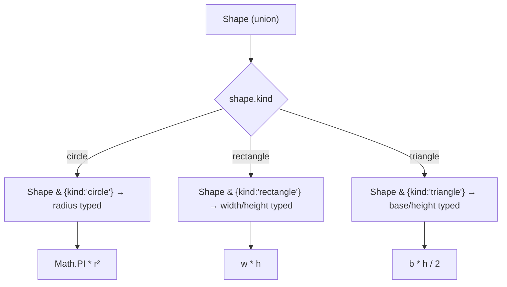

# Narrowing and Type Guards

> [!summary] Goal
> Narrow union types to their specific members using control flow analysis, type guards, and user-defined predicates — so the compiler knows more about your types than you told it.

## Table of Contents

1. [Why Narrowing Matters](#why-narrowing-matters)
2. [`typeof` Guard](#typeof-guard)
3. [`instanceof` Guard](#instanceof-guard)
4. [`in` Operator Narrowing](#in-operator-narrowing)
5. [Discriminated Unions](#discriminated-unions)
6. [User-Defined Type Guards](#user-defined-type-guards)
7. [Assertion Functions](#assertion-functions)
8. [Exhaustiveness Checking](#exhaustiveness-checking)
9. [Pitfalls](#pitfalls)

---

## Why Narrowing Matters

Narrowing is TypeScript's ability to refine a union type to a more specific type based on control flow:

```mermaid
flowchart TD
    A["value: string | number | null"] --> B{typeof value}
    B -->|"string"| C["value: string (narrowed)"]
    B -->|"number"| D["value: number (narrowed)"]
    B -->|"null"| E["value: never after null check"]
    C --> F[Can call .toUpperCase()]
    D --> G[Can call .toFixed()]
```

---

## `typeof` Guard

```ts
function formatValue(value: string | number): string {
  if (typeof value === 'string') {
    return value.toUpperCase();       // value: string
  }
  return value.toFixed(2);            // value: number
}
```

### Supported `typeof` checks

| Check | Narrowed type | Example |
|-------|--------------|---------|
| `typeof x === 'string'` | `string` | `x.toUpperCase()` |
| `typeof x === 'number'` | `number` | `x.toFixed()` |
| `typeof x === 'boolean'` | `boolean` | `x ? 'yes' : 'no'` |
| `typeof x === 'object'` | `object \| null` | Still may be null |
| `typeof x === 'undefined'` | `undefined` | Default value handling |
| `typeof x === 'function'` | `Function` | `x()` |
| `typeof x === 'symbol'` | `symbol` | `x.description` |

---

## `instanceof` Guard

```ts
class ApiError extends Error {
  constructor(public statusCode: number) {
    super();
  }
}

class NetworkError extends Error {
  constructor(public url: string) {
    super();
  }
}

function handleError(error: ApiError | NetworkError): string {
  if (error instanceof ApiError) {
    return `API Error (${error.statusCode})`;   // error: ApiError
  }
  return `Network Error: ${error.url}`;          // error: NetworkError
}
```

---

## `in` Operator Narrowing

```ts
type User = { name: string; email: string };
type Admin = { name: string; role: 'admin'; permissions: string[] };

function getRole(person: User | Admin): string {
  if ('role' in person) {
    return person.role;                     // person: Admin
  }
  return 'user';                            // person: User
}
```

### `in` with null/undefined

```ts
function process(value: object | null) {
  if ('key' in value) {             // Error: value may be null
  }
}
```

**Fix**: Check for null first:

```ts
if (value !== null && 'key' in value) { ... }
```

---

## Discriminated Unions

A **discriminated union** (tagged union) uses a common property (the discriminant) to narrow:

```ts
type Shape =
  | { kind: 'circle'; radius: number }
  | { kind: 'rectangle'; width: number; height: number }
  | { kind: 'triangle'; base: number; height: number };

function area(shape: Shape): number {
  switch (shape.kind) {
    case 'circle':
      return Math.PI * shape.radius ** 2;         // shape: Circle
    case 'rectangle':
      return shape.width * shape.height;           // shape: Rectangle
    case 'triangle':
      return (shape.base * shape.height) / 2;      // shape: Triangle
  }
}
```



### Multi-level discriminated unions

```ts
type Event =
  | { type: 'user'; action: 'created' | 'deleted'; userId: string }
  | { type: 'system'; severity: 'info' | 'error'; message: string };

function handleEvent(event: Event) {
  switch (event.type) {
    case 'user':
      switch (event.action) {    // nested narrowing
        case 'created': // ...
        case 'deleted': // ...
      }
      break;
    case 'system':
      console.log(event.message);
      break;
  }
}
```

---

## User-Defined Type Guards

A user-defined type guard is a function that returns `x is Type`:

```ts
interface Cat { meow(): void }
interface Dog { bark(): void }

function isCat(pet: Cat | Dog): pet is Cat {
  return 'meow' in pet;
}

function play(pet: Cat | Dog) {
  if (isCat(pet)) {
    pet.meow();                         // pet: Cat
  } else {
    pet.bark();                         // pet: Dog
  }
}
```

### Type guard array filter

```ts
function isDefined<T>(value: T | undefined | null): value is T {
  return value !== null && value !== undefined;
}

const values: (string | null | undefined)[] = ['a', null, 'b', undefined];
const defined = values.filter(isDefined);
// const defined: string[]
```

### Type guard with generics

```ts
function isOfType<T>(obj: unknown, key: keyof T): obj is T {
  return (obj as T)?.[key] !== undefined;
}
```

---

## Assertion Functions

Assertion functions narrow types by throwing if the type doesn't match:

```ts
function assertIsString(value: unknown): asserts value is string {
  if (typeof value !== 'string') {
    throw new Error('Expected string');
  }
}

function process(input: unknown) {
  assertIsString(input);
  input.toUpperCase();                           // input: string
}
```

### Assertion with conditions

```ts
function assertDefined<T>(value: T): asserts value is NonNullable<T> {
  if (value === null || value === undefined) {
    throw new Error('Value is null or undefined');
  }
}

const x: string | null = getValue();
assertDefined(x);
x.length;                                         // x: string
```

---

## Exhaustiveness Checking

The `never` type ensures all union members are handled:

```ts
type Status = 'idle' | 'loading' | 'success' | 'error';

function assertNever(value: never): never {
  throw new Error(`Unexpected value: ${value}`);
}

function getStatusMessage(status: Status): string {
  switch (status) {
    case 'idle': return 'Ready';
    case 'loading': return 'Please wait';
    case 'success': return 'Done';
    case 'error': return 'Failed';
    default:
      return assertNever(status);  // Error if new Status variant added
  }
}
```

If a new status is added (`'cancelled'`), TypeScript flags the error at compile time.

---

## Pitfalls

### `typeof null` is `'object'`

```ts
function process(value: string | null) {
  if (typeof value === 'object') {
    // value is STILL string | null here!
    // typeof null === 'object' — so this branch catches null too
  }
}
```

**Fix**: Check for null explicitly: `if (value !== null && typeof value === 'object')`.

### `switch` fall-through

```ts
function getLen(shape: Shape): number {
  switch (shape.kind) {
    case 'circle':
      return shape.radius * 2;
    case 'rectangle':  // Forgot break — falls through to triangle!
    case 'triangle':
      return shape.base;  // Error: base doesn't exist on rectangle
  }
}
```

**Fix**: Use `return` in each case or enable `noFallthroughCasesInSwitch`.

### Type guard without `value is T` return type

```ts
function isString(x: unknown): boolean {
  return typeof x === 'string';
}

function process(x: string | number) {
  if (isString(x)) {
    x.toUpperCase();  // Error: x is still string | number
  }
}
```

**Fix**: Add the `x is string` return type annotation.

---

> [!question]- Interview Questions
>
> **Q: What narrowing techniques does TypeScript support?**
> A: `typeof` guards, `instanceof` guards, `in` operator, discriminated unions, user-defined type guards (`x is T`), assertion functions (`asserts x is T`), and truthiness/falsiness checks.
>
> **Q: What is a discriminated union?**
> A: A union type where each member has a common property (the discriminant) with a literal type. Narrowing on the discriminant refines to the specific member.
>
> **Q: How does a user-defined type guard differ from a boolean return?**
> A: A type guard with `value is Type` return type tells the compiler to narrow the type in the true branch. A plain `boolean` return does not narrow.
>
> **Q: What is exhaustiveness checking with `never`?**
> A: Adding a `default` case that calls `assertNever(value: never)` ensures all union members are handled. If a new member is added, TypeScript flags the default branch as a type error.
>
> **Q: What is the difference between `typeof null` in JavaScript vs TypeScript?**
> A: `typeof null` returns `'object'` in both JS and TS. TypeScript's narrowing accounts for this — `typeof x === 'object'` does not exclude `null`.

---

## Cross-Links

- [[TypeScript/02_Core/03_Discriminated_Unions]] for deep discriminated union patterns
- [[TypeScript/03_Advanced/01_Conditional_Types]] for type-level narrowing with conditional types
- [[TypeScript/04_Playbooks/01_Debug_Type_Errors_Systematically]] for debugging narrowing issues
- [[TypeScript/04_Playbooks/06_TypeScript_with_React]] for event handler narrowing

---

## References

- [TypeScript Narrowing Handbook](https://www.typescriptlang.org/docs/handbook/2/narrowing.html)
- [TypeScript Type Guards](https://www.typescriptlang.org/docs/handbook/advanced-types.html#type-guards-and-differentiating-types)
- [TypeScript Assertion Functions](https://www.typescriptlang.org/docs/handbook/release-notes/typescript-3-7.html#assertion-functions)
